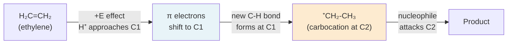
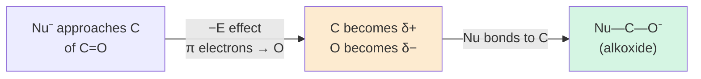

# ⚗️ 2. Electromeric Effect

**[← 01 Inductive Effect](01_inductive_effect.md)** | **[Module README](README.md)** | **[03 Mesomeric Effect →](03_mesomeric_effect.md)**

---

## 1. Definition

> **The Electromeric Effect** (E effect) is the complete and reversible intramolecular transfer of a pair of π (pi) electrons from a multiple bond to one of its atoms under the influence of an attacking (external) reagent.

Key characteristics:
1. It involves **π electrons only** (never σ electrons).
2. It is a **temporary effect** — it exists only when a reagent is approaching the molecule; it disappears when the reagent is removed.
3. It is **reversible** — if the attacking reagent departs without reacting, the electron pair returns to its original position.
4. It is an **intermolecular** induction — triggered by an external reagent, unlike the inductive or mesomeric effects which are inherent to the molecule.
5. It always leads to **complete** electron transfer (unlike partial polarisation in the inductive effect).

The electromeric effect was introduced by **Sir Christopher Ingold** in the 1930s as part of his comprehensive theory of electronic effects in organic molecules.

---

## 2. Mechanism: How It Works

Consider a molecule containing a C=C double bond. In the absence of any reagent, the π electrons are symmetrically distributed. When an electrophilic reagent (E⁺) approaches:

```
Step 1 — Normal state (no reagent):

     C = C          (π electrons symmetrically shared)

Step 2 — Reagent E⁺ approaches one carbon (Cα):

          E⁺
          ↓
     C = C          (π electrons still in place; E⁺ approaching Cα)

Step 3 — Electromeric effect:
     Complete transfer of π pair to Cβ:

    [C—C]²⁻ ... E⁺  → C—C bond uses donated electrons
     Cα⁺  Cβ⁻         to bond with E⁺

```

The electron pair shifts completely from the π bond to the atom **not** being attacked (in +E effect) or **toward** the atom being attacked (in +E effect — see below).

---

## 3. Types of Electromeric Effect

### 3.1 Positive Electromeric Effect (+E Effect)

> In the **+E effect**, the π electrons are transferred to the atom to which the attacking reagent **will** form a bond.

This is the more common type. It occurs when an **electrophile** (E⁺) attacks a multiple bond.

**Example: Protonation of ethylene (H⁺ attacking C=C)**

```
             H⁺ (approaching Cα)
             ↓
    Hα Cα = Cβ Hβ
           ↕ (+E effect)
    Hα Cα — Cβ Hβ
        ⁺     ⁻
```

The π electrons shift **toward Cα** (the site of attack by H⁺), forming a new C−H bond. This generates a carbocation at Cβ:

```
    H₂C = CH₂  +  H⁺  →  [H₃C—CH₂]⁺
    (ethylene)         (ethyl carbocation)
```

**Reaction Mechanism (Mermaid):**



---

### 3.2 Negative Electromeric Effect (−E Effect)

> In the **−E effect**, the π electrons are transferred **away from** the atom to which the attacking reagent will attach.

This occurs when a **nucleophile** (Nu:⁻) attacks a carbonyl compound (C=O):

**Example: Nucleophilic addition to formaldehyde (Nu⁻ attacking C=O)**

```
    Nu⁻ approaches Cα (the carbon of C=O)

    Nu⁻ → Cα = Oβ

    −E effect: π electrons shift toward Cα (away from Oβ)
    This gives Cα negative character to repel Nu⁻?

    Actually: −E effect shifts electrons to Oβ, 
    making Cα more electrophilic (δ+), facilitating Nu attack
```

**Clearer representation:**

```
    Nu⁻     C = O
    →  ⇒   C⁻— O  (−E: π pair moves to O)

    Oδ⁻ takes the electrons; Cα is now more electrophilic → Nu attacks C
```



---

## 4. Conditions Required for Electromeric Effect

1. The molecule must contain a **multiple bond** (C=C, C=O, C=N, C≡C, C≡N, etc.).
2. An **attacking reagent** must be present (the effect is triggered by the approaching reagent).
3. The multiple bond must be accessible to the attacking reagent.

---

## 5. Electromeric Effect in Different Multiple Bonds

### 5.1 C=C Double Bond (Alkenes)

- Attacked by electrophiles (H⁺, Br₂, HBr, etc.)
- +E effect: π electrons move toward attacking electrophile
- Generates carbocation intermediate → leads to Markovnikov product

```
    CH₂=CH₂  +  H⁺  →  +CH₂-CH₃  (via +E effect)
```

### 5.2 C≡C Triple Bond (Alkynes)

- Also attacked by electrophiles
- Similar +E effect as alkenes
- Can react twice (two π bonds available)

```
    HC≡CH  +  H⁺  →  +CH=CH₂  →  CH₃CHO (via hydration)
```

### 5.3 C=O Double Bond (Aldehydes, Ketones)

- Attacked by nucleophiles
- −E effect predominates
- π electrons shift to O; C becomes electrophilic

```
    CH₃CHO  +  CN⁻  →  [CH₃CH(OH)CN]  (cyanohydrin formation, via −E)
```

### 5.4 C=N Double Bond (Imines, Nitriles)

- Similar to C=O
- Attacked by nucleophiles
- −E effect: electrons go to N

---

## 6. Comparison: Electromeric vs Inductive vs Mesomeric

| Feature | Inductive Effect | Electromeric Effect | Mesomeric Effect |
|:--------|:-----------------|:--------------------|:-----------------|
| Bond type | σ bonds | π bonds | π bonds |
| Permanence | **Permanent** (always present) | **Temporary** (only with reagent) | **Permanent** (always present) |
| Reversibility | Irreversible | **Reversible** (if reagent leaves) | Irreversible |
| Electron transfer | **Partial** (polarisation) | **Complete** (pair transferred) | **Complete** (delocalisation) |
| Trigger | None needed | Requires attacking reagent | None needed |
| Nature | Static effect | Dynamic effect | Static effect |
| Scope | Saturated & unsaturated | Unsaturated only | Conjugated only |

---

## 7. Experimental Evidence for Electromeric Effect

1. **Proton NMR chemical shifts** of alkenes change when in the presence of Lewis acids — consistent with π electron redistribution under electrophilic influence.
2. **Reaction rates of addition to alkenes**: The rate of HBr addition to alkenes is first-order in alkene and first-order in HBr — suggesting concerted π-electron donation (electromeric) during the approach.
3. **Selectivity in additions**: Markovnikov regioselectivity is best explained by the +E effect directing the initial electrophile to the less substituted carbon, generating the more stable carbocation.

---

## 8. Applications

1. **Electrophilic Addition to Alkenes** (HX, H₂O, Br₂ additions): The +E effect explains why the π bond acts as a nucleophile and attacks the electrophile.
2. **Nucleophilic Addition to Carbonyls** (Grignard reactions, cyanohydrin formation, aldol reactions): The −E effect explains activation of the carbonyl carbon.
3. **Explaining Markovnikov's Rule**: The +E effect causes the proton to add to the carbon that generates the more stable carbocation.
4. **Acid-Base Reactions of Organic Acids**: The electromeric effect of the C=O in COOH groups assists deprotonation.

---

## 9. Worked Example

**Question**: Explain the mechanism of addition of HBr to propene using the electromeric effect.

**Answer**:

```
Molecule: CH₃-CH=CH₂ (propene)
Reagent: HBr (H⁺ is the electrophile)

Step 1: H⁺ approaches the terminal carbon (C3) of the double bond.

        H⁺
        ↓
CH₃-CH=CH₂

Step 2: +E effect — π electrons shift from C2=C3 bond toward C3 
        (where H⁺ will attach):

        π electrons → C3: gives C3 partial negative character,
        C2 becomes electron-deficient (δ+)

Step 3: H⁺ bonds to C3; C2 becomes a carbocation:

        CH₃-CH⁺-CH₃  (2° carbocation — more stable)
        ↑
        secondary: more stable than CH₃-CH₂-CH₂⁺ (1°)

Step 4: Br⁻ attacks C2:

        CH₃-CHBr-CH₃  (2-bromopropane — major product, Markovnikov)
```

The +E effect ensures the proton adds to the terminal carbon (generating the more stable secondary carbocation), consistent with Markovnikov's rule.

---

## 10. Key Points Summary

1. The electromeric effect involves **complete transfer of π electrons** under reagent influence.
2. It is **temporary and reversible** — the molecule returns to normal when the reagent leaves.
3. **+E effect**: π electrons go toward the atom being attacked by the electrophile.
4. **−E effect**: π electrons go away from the atom being attacked (toward the other atom of the bond).
5. It operates **only in molecules with π bonds** (multiple bonds).
6. It is fundamentally different from the inductive effect (σ, permanent, partial) and mesomeric effect (π, permanent, complete).

---

## 11. References & Further Reading

1. **Clayden, Greeves, Warren** — *Organic Chemistry*, 2nd ed., Ch. 12 — Nucleophilic addition to C=O
2. **Ingold, C.K.** — "Structure and Mechanism in Organic Chemistry", 1953 — Original theoretical framework
3. **LibreTexts** — Electronic Effects — [chem.libretexts.org](https://chem.libretexts.org/Bookshelves/Organic_Chemistry)
4. **Brilliant.org** — Electromeric Effect — [brilliant.org/wiki/inductive-effect-electromeric-efffect-resonance](https://brilliant.org/wiki/inductive-effect-electromeric-efffect-resonance/)
5. **Khan Academy** — Addition reactions to π bonds — [khanacademy.org/science/organic-chemistry/alkenes-alkynes](https://www.khanacademy.org/science/organic-chemistry/alkenes-alkynes)

---

| ← Previous | Module | Next → |
|:-----------|:-------|:-------|
| [01 Inductive Effect ←](01_inductive_effect.md) | [📋 README](README.md) | [03 Mesomeric Effect →](03_mesomeric_effect.md) |

> 📖 *Part of [BUTEX Notes](https://github.com/itachi-re/butex-notes) — CHEM-101 Module 11: Organic Reactions*
