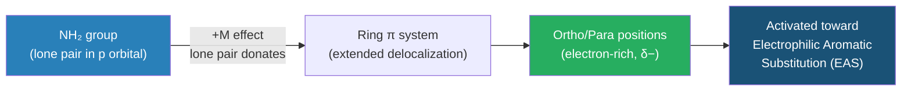
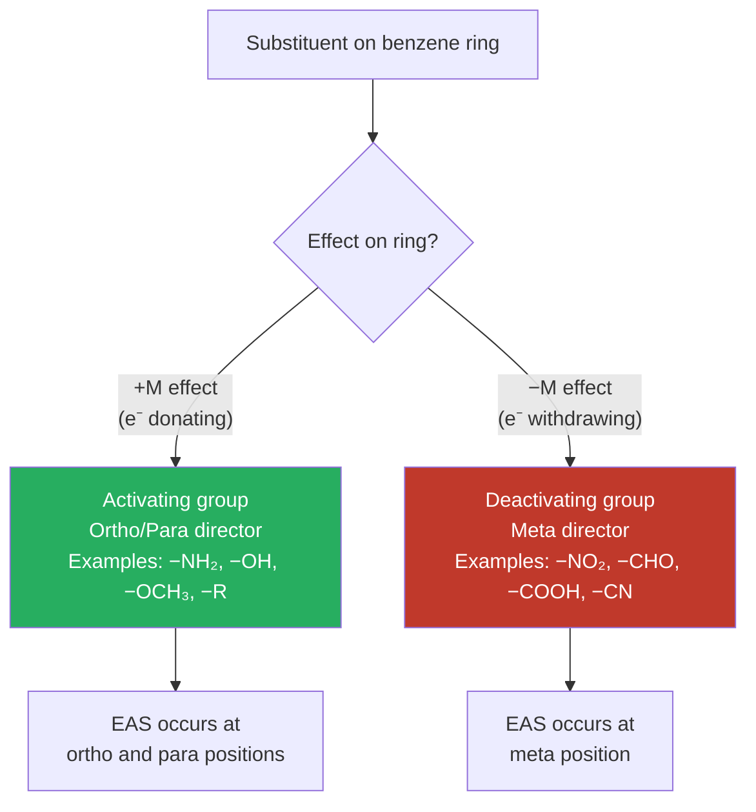

# ⚗️ 3. Mesomeric Effect (Resonance Effect)

**[← 02 Electromeric Effect](02_electromeric_effect.md)** | **[Module README](README.md)** | **[04 Carbonium Ions →](04_carbonium_ions.md)**

---

## 1. Definition

> **The Mesomeric Effect** (M effect, also called the **Resonance Effect** or **Conjugative Effect**) is the permanent displacement of electron density through a system of conjugated π bonds, caused by the overlap of a p orbital of a substituent with the adjacent π system of a multiple bond.

The term "mesomeric" was coined by **Ingold (1938)** from the Greek *mesos* (middle), because the actual electron distribution is intermediate between the resonance structures. It is a **permanent** effect (present in the ground state of the molecule) and is denoted by the symbol **M** (or **R** for resonance).

Key characteristics:
1. Operates through **π bonds** and lone pairs in a **conjugated system**.
2. **Permanent** effect — exists without any attacking reagent.
3. Requires the participating group to have either a **lone pair** or a **π bond** that can overlap with the adjacent π system.
4. Results in a **delocalized** electron distribution — the actual structure is a resonance hybrid of multiple canonical forms.
5. Generally **stronger and more important** than the inductive effect when both are present.

---

## 2. Physical Basis: Resonance and Delocalization

When a p orbital on a substituent is parallel to the π system of an adjacent double bond, **side-on overlap** occurs, creating an extended π system. The electrons are no longer confined to one bond — they are **delocalized** over multiple atoms.

**Example: Phenol (C₆H₅OH)**

The oxygen lone pair overlaps with the benzene ring π system:

```
    Resonance structures of phenol:

         OH          O⁻           O⁻           O⁻           O⁻
         |           ‖            |             |             |
    (Benzene)  ←→ (ortho⁺) ←→ (ortho'⁺) ←→ (para⁺)  ←→ (ortho''⁺)

    The oxygen p lone pair delocalizes into the ring → +M effect
    The ring becomes electron-rich at ortho and para positions.
```

**Why a single structure is insufficient:**

No single Lewis structure correctly represents the bonding. The actual structure has:
- Bond lengths intermediate between C−O and C=O
- All C−C bonds in benzene equal length (1.40 Å, between 1.34 Å double and 1.54 Å single)
- Fractional charges at ortho/para positions

---

## 3. Conditions Required for Mesomeric Effect

The mesomeric effect requires **conjugation**. Specifically, the substituent must have:

1. **A lone pair** in a p orbital aligned with the adjacent π system (for +M groups), OR
2. **An empty p orbital** adjacent to a π system (for −M groups), OR
3. **A π bond** conjugated with another π bond (for conjugated dienes, α,β-unsaturated carbonyls, etc.)

**Conjugation requires**: alternate single and double bonds, with all participating orbitals coplanar.

---

## 4. Types of Mesomeric Effect

### 4.1 Positive Mesomeric Effect (+M Effect)

> In the **+M effect**, the substituent **donates** electron density into the π system of the molecule.

The substituent must have a **lone pair** (in a p orbital) or act as a π-donor.

#### Common +M groups:
$$
\text{−O}^- > \text{−NH}_2 > \text{−NR}_2 > \text{−OH} > \text{−OR} > \text{−NHCOR} > \text{−F} > \text{−Cl} > \text{−Br} > \text{−I}
$$

> Note: Halogens have a **−I but +M** effect. Their strong electronegativity withdraws via σ bonds (−I), but their lone pairs donate into the π system (+M). The net effect on aromatic systems is mild activation.

**Example: Aniline (C₆H₅NH₂)**

```
    Resonance structures showing +M effect of −NH₂:

    H₂N—Ph  ←→  H₂N⁺=Ph(−)  ←→  ... (ortho/para positions enriched)

    Orbital picture:
    N lone pair (p orbital) → conjugates with ring π system
    → electrons donated into ring → ring activated
```



### 4.2 Negative Mesomeric Effect (−M Effect)

> In the **−M effect**, the substituent **withdraws** electron density from the π system.

The substituent must have an **empty orbital** or an electronegative atom capable of pulling the π electrons.

#### Common −M groups:
$$
\text{−NO}_2 > \text{−CHO} > \text{−COR} > \text{−COOH} > \text{−COOR} > \text{−CONH}_2 > \text{−CN} > \text{−SO}_3\text{H}
$$

**Example: Nitrobenzene (C₆H₅NO₂)**

```
    Resonance structures showing −M effect of −NO₂:

    Ph−NO₂  ←→  ⁺Ph(=)NO₂⁻  (+ at ortho/para of ring)

    N uses its π bond with O to withdraw electrons from ring
    → ring deactivated; meta positions relatively less electron-poor
```


---

## 5. Comparison: +M vs −M

| Feature | +M Effect | −M Effect |
|:--------|:----------|:----------|
| Electron flow | Substituent → π system | π system → substituent |
| Charge at ortho/para | Negative (δ−) | Positive (δ+) |
| EAS reactivity | Activates ring | Deactivates ring |
| EAS directing | Ortho/Para director | Meta director |
| Example groups | −NH₂, −OH, −OCH₃, −X | −NO₂, −CHO, −COOH, −CN |
| Effect on acidity | Decreases (for COOH) | Increases (for COOH) |
| Effect on basicity | Increases (for NH₂) | Decreases (for NH₂) |

---

## 6. Mesomeric Effect vs Inductive Effect

A substituent can exert **both effects simultaneously**. When they oppose each other, the **mesomeric effect usually dominates**.

### Example: Chlorobenzene (C₆H₅Cl)

| Effect | Direction | Result |
|:-------|:----------|:-------|
| Inductive (−I of Cl) | Withdraws from ring via σ bond | Weakly deactivates |
| Mesomeric (+M of Cl) | Lone pair donates into ring via p orbital | Weakly activates |
| **Net result** | +M > −I for ring chemistry | Mildly activating, ortho/para director |

### Example: −COOH group on benzene

| Effect | Direction | Result |
|:-------|:----------|:-------|
| Inductive (−I of C=O) | Withdraws via σ bond | Weakly deactivates |
| Mesomeric (−M of C=O) | Pulls π electrons from ring | Deactivates strongly |
| **Net result** | Both are −M, −I | Strongly deactivating, meta director |

---

## 7. Mathematical Treatment: Resonance Energy

The **resonance energy** (also called **delocalization energy**) is the extra stability gained by a molecule due to electron delocalization. It is measured as the difference between the actual heat of formation and the calculated value assuming no delocalization.

**Benzene's resonance energy**:

$$
\text{Calculated H}_f \text{ (as three isolated C=C)} = -359 \text{ kJ/mol (hydrogenation)}
$$
$$
\text{Actual H}_f \text{ (benzene)} = -208 \text{ kJ/mol}
$$
$$
\text{Resonance energy} = 359 - 208 = \boxed{151 \text{ kJ/mol}}
$$

This 151 kJ/mol extra stability explains why benzene preferentially undergoes **substitution** (preserving the aromatic system) rather than **addition** (destroying it).

---

## 8. Visual: Resonance Structures of Key Molecules

### 8.1 Benzene (Aromatic System)

```
        H           H           H
        |           |           |
    H—C   C—H   H—C   C—H   H—C   C—H
       ‖ / ‖       |  ‖  |      ‖  | ‖
    H—C   C—H   H—C   C—H   H—C   C—H
        |           |           |
        H           H           H
    Structure 1  Structure 2  (hybrid has all equal bonds)
```

### 8.2 Aniline (+M Effect)

```
    H₂N:        H₂N⁺        H₂N⁺        H₂N⁺
     |            ‖            |            |
    [ring]  ←→  [ring δ-]  ←→  [ring δ-]  ←→  [ring δ-]
                  ortho              para              ortho'

    → Nitrogen lone pair donated → ortho/para positions enriched
```

### 8.3 Nitrobenzene (−M Effect)

```
    NO₂         ⁺NO₂         ⁺NO₂         ⁺NO₂
     |             ‖             |             |
    [ring]  ←→  [ring δ+]   ←→  [ring δ+]  ←→  [ring δ+]
                  ortho              para              ortho'

    → π electrons withdrawn → ortho/para positions electron-poor
    → Meta positions attacked in EAS
```

---

## 9. Applications of the Mesomeric Effect

### 9.1 Electrophilic Aromatic Substitution (EAS) Directing Effects



### 9.2 Acidity Enhancement

The −M effect of the carboxylate group stabilises the COO⁻ anion via resonance:

```
    CH₃COOH  →  CH₃COO⁻  +  H⁺

    COO⁻ resonance:
    O            O⁻
    ‖    ←→      |
    C—O⁻         C=O

    The negative charge is equally shared by both oxygens → very stable
    → carboxylic acids are moderately strong organic acids
```

### 9.3 Basicity of Aniline vs Methylamine

- **Methylamine** (CH₃NH₂): nitrogen lone pair available for protonation, pKₐ(conjugate acid) = 10.64 → strong base
- **Aniline** (PhNH₂): lone pair partially donated into ring (+M) → less available → pKₐ(conjugate acid) = 4.63 → much weaker base

$$
\Delta\text{pK}_a = 10.64 - 4.63 = 6.01 \quad \text{(aniline is } 10^{6.01} \approx 10^6 \text{ times weaker base)}
$$

---

## 10. Key Points Summary

1. The mesomeric effect operates through **conjugated π systems** and is a **permanent** effect.
2. **+M effect**: substituent donates electrons into the π system (lone pair donors: −NH₂, −OH, −X).
3. **−M effect**: substituent withdraws electrons from the π system (π acceptors: −NO₂, −CHO, −CN).
4. When inductive and mesomeric effects oppose each other, **mesomeric dominates** for π-system chemistry.
5. Resonance energy (delocalization energy) quantifies the extra stability from the mesomeric effect.
6. In EAS: **+M groups → ortho/para directors (activating)**; **−M groups → meta directors (deactivating)**.
7. The mesomeric effect influences acidity (COOH), basicity (NH₂), and reactivity in EAS.

---

## 11. Practice Problems

1. Explain why phenol (pKₐ = 10.0) is a stronger acid than cyclohexanol (pKₐ = 16.0), using the mesomeric effect.
2. Predict the major product of bromination of aniline and explain the regiochemistry using the +M effect.
3. Why is the C−N bond in aniline shorter than a typical C−N single bond?
4. Compare the relative basicity of p-nitroaniline and p-methylaniline. Explain using mesomeric effects.
5. Draw all resonance structures of the acetate ion (CH₃COO⁻) and use them to explain why both C−O bonds are equal in length (1.26 Å).

---

## 12. References & Further Reading

1. **Clayden, Greeves, Warren** — *Organic Chemistry*, 2nd ed., Ch. 7 — Delocalisation and conjugation
2. **LibreTexts** — Resonance Effects — [chem.libretexts.org/Bookshelves/Organic_Chemistry/Map:_Organic_Chemistry_(Clayden_et_al.)/07:_Delocalisation_and_Conjugation](https://chem.libretexts.org/Bookshelves/Organic_Chemistry/Map:_Organic_Chemistry_(Clayden_et_al.)/07:_Delocalisation_and_Conjugation)
3. **Chemistry Steps** — Inductive and Resonance Effects — [chemistrysteps.com/inductive-and-resonance-mesomeric-effects](https://www.chemistrysteps.com/inductive-and-resonance-mesomeric-effects/)
4. **Khan Academy** — Resonance Structures — [khanacademy.org/science/ap-chemistry/chemical-bonds/resonance-structures/a/resonance-and-dot-structures](https://www.khanacademy.org/science/ap-chemistry/chemical-bonds/resonance-structures/a/resonance-and-dot-structures)
5. **Master Organic Chemistry** — Resonance in aromatic compounds — [masterorganicchemistry.com](https://www.masterorganicchemistry.com)

---

| ← Previous | Module | Next → |
|:-----------|:-------|:-------|
| [02 Electromeric Effect ←](02_electromeric_effect.md) | [📋 README](README.md) | [04 Carbonium Ions →](04_carbonium_ions.md) |

> 📖 *Part of [BUTEX Notes](https://github.com/itachi-re/butex-notes) — CHEM-101 Module 11: Organic Reactions*
