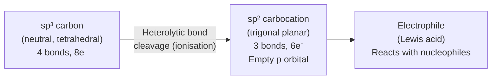
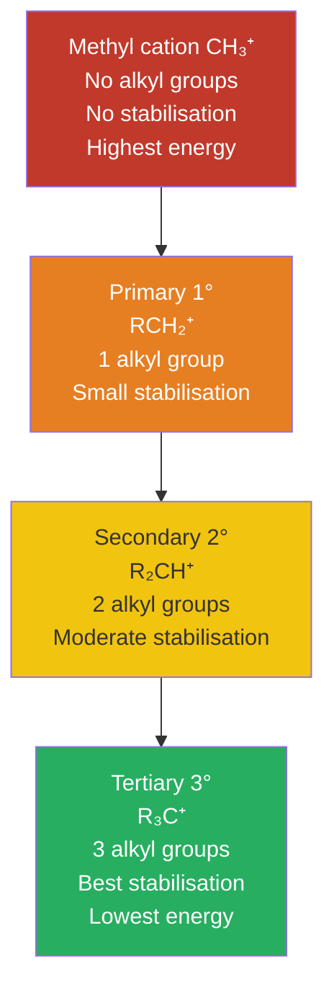
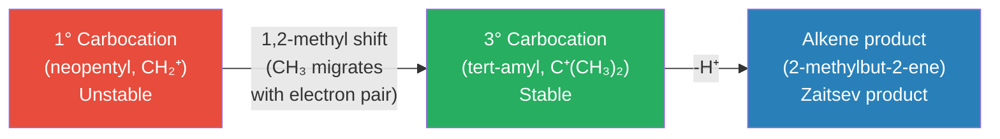
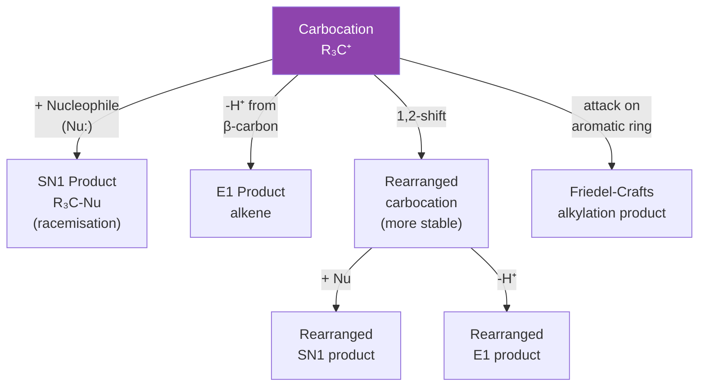

# ⚡ CHEM-103 — Module 11, Topic 04: Carbonium Ions (Carbocations)

**[🔗 Back to Module 11 README](README.md)** · **[🔗 Back to CHEM-103](../)**


**Navigation:** [← 03 Mesomeric Effect](03_mesomeric_effect.md) · [→ 05 Carbanions](05_carbanions.md)

---

## 📋 Table of Contents

1. [Definition and Nomenclature](#1-definition-and-nomenclature)
2. [Structure and Hybridisation](#2-structure-and-hybridisation)
3. [Types of Carbocations](#3-types-of-carbocations)
4. [Formation Pathways](#4-formation-pathways)
5. [Stability of Carbocations](#5-stability-of-carbocations)
6. [Hyperconjugation](#6-hyperconjugation)
7. [Resonance-Stabilised Carbocations](#7-resonance-stabilised-carbocations)
8. [1,2-Shifts and Rearrangements](#8-12-shifts-and-rearrangements)
9. [Role in Organic Reactions](#9-role-in-organic-reactions)
10. [Solved Examples](#10-solved-examples)
11. [Practice Problems](#11-practice-problems)
12. [Summary Table](#12-summary-table)
13. [References](#13-references)

---

## 1. Definition and Nomenclature

> **Carbonium ion (Carbocation):** A species in which a carbon atom bears a **formal positive charge** and has only **six electrons** in its valence shell — a sextet rather than the octet of neutral carbon.

### 1.1 Terminology Note

| Term | Meaning | Source |
|:-----|:--------|:-------|
| **Carbonium ion** | Traditional name for R₃C⁺ (trivalent) — used widely in South Asian curricula and older texts | Meerwein, 1920s |
| **Carbocation** | Umbrella term: any positively charged carbon species (IUPAC recommended) | Modern IUPAC |
| **Carbenium ion** | Strict IUPAC term for trivalent R₃C⁺ | Olah, 1972 |
| **Carbonium ion** (strict) | IUPAC term reserved for **pentacoordinate** species like CH₅⁺ (protonated methane) | Olah, 1972 |

> ⚠️ **For CHEM-103 at BUTEX:** "Carbonium ion" refers to the classical trivalent carbocation **R₃C⁺**. This is the conventional South Asian textbook usage and matches the module syllabus.

---

## 2. Structure and Hybridisation

### 2.1 Orbital Description

A carbocation is **sp² hybridised**:

- Three sp² hybrid orbitals form **σ bonds** with three attached atoms/groups (planar arrangement, bond angles ≈ 120°)
- One **empty p orbital** lies perpendicular to the plane of the σ bonds
- The empty p orbital is what makes the carbon **electrophilic** — it can accept electrons

```
         H (or R)
         |
  H ---- C⁺     ← trigonal planar, 120° bond angles
         |
         H (or R)

     [empty p orbital above and below the plane]
```

### 2.2 Key Properties

| Property | Value |
|:---------|:------|
| Hybridisation | sp² |
| Geometry | Trigonal planar |
| Bond angles | ~120° |
| Valence electrons on C⁺ | 6 (sextet — electron-deficient) |
| Empty orbital | p orbital (perpendicular to plane) |
| Character | Electrophile (Lewis acid) |



---

## 3. Types of Carbocations

### 3.1 Classification by Substitution

The number of carbon atoms directly bonded to the positively charged carbon determines the type:

| Type | Structure | Example | Symbol |
|:-----|:---------|:--------|:-------|
| **Methyl** (0°) | CH₃⁺ | Methanium | 0° |
| **Primary** (1°) | RCH₂⁺ | Ethyl cation: CH₃CH₂⁺ | 1° |
| **Secondary** (2°) | R₂CH⁺ | Isopropyl cation: (CH₃)₂CH⁺ | 2° |
| **Tertiary** (3°) | R₃C⁺ | tert-Butyl cation: (CH₃)₃C⁺ | 3° |

### 3.2 Special Stabilised Carbocations

| Type | Example | Stability |
|:-----|:--------|:---------|
| **Allylic** | H₂C=CH–CH₂⁺ | High (resonance over 2 carbons) |
| **Benzylic** | C₆H₅–CH₂⁺ | High (resonance into ring) |
| **Cyclopropylcarbinyl** | Cyclopropyl–CH₂⁺ | Very high (Walsh orbital overlap) |
| **Vinyl** | H₂C=CH⁺ | Very low (sp hybrid, no hyperconj.) |
| **Phenyl (aryl)** | C₆H₅⁺ | Very low (sp² C⁺ with no adjacent H for hyperconj.) |

---

## 4. Formation Pathways

Carbocations arise in three principal ways in organic chemistry:

```mermaid
flowchart TD
    subgraph F1["1. Heterolytic Ionisation"]
        A1["R-X\n(alkyl halide / tosylate)"] -->|"polar solvent\nheat"| B1["R⁺  +  X⁻"]
    end
    subgraph F2["2. Protonation of Unsaturated Bond"]
        A2["C=C\n(alkene)"] -->|"H⁺ (aq acid)"| B2["R-CH-CH₃\n      ⁺"]
    end
    subgraph F3["3. Lewis Acid Activation"]
        A3["R-X  +  AlCl₃\n(Friedel-Crafts)"] -->|""| B3["R⁺  [AlCl₄]⁻"]
    end
    F1 & F2 & F3 --> C["Carbocation intermediate\nparticipates in further reaction"]
```

### 4.1 Mechanism of Ionisation (SN1 context)

$$\text{(CH}_3\text{)}_3\text{C} - \underset{\text{leaving group}}{\text{Br}} \xrightarrow{\text{polar protic solvent, }\Delta} \underset{\text{tert-butyl cation}}{\text{(CH}_3\text{)}_3\text{C}^+} + \text{Br}^-$$

The bond cleavage is **heterolytic**: both electrons of the C–X bond go to the leaving group (X).

---

## 5. Stability of Carbocations

### 5.1 Stability Order

$$\underbrace{\text{3°}}_{\text{most stable}} > \underbrace{\text{2°}}_{\text{stable}} > \underbrace{\text{1°}}_{\text{unstable}} > \underbrace{\text{CH}_3^+}_{\text{very unstable}}$$

### 5.2 Why Does Substitution Increase Stability?

Two key electronic effects operate:

**A. Inductive Effect (+I):**
Alkyl groups are **electron-donating** by induction (through σ bonds). Each additional alkyl group pushes electron density toward the electron-deficient C⁺, partially satisfying the empty orbital and lowering energy.

**B. Hyperconjugation** (see Section 6): even more important — σ(C–H) and σ(C–C) bonds adjacent to C⁺ donate electron density into the empty p orbital by orbital overlap.



### 5.3 Energy Comparison

```
 Energy
  ↑
  |  CH₃⁺
  |   |
  |   |   1°C⁺
  |   |    |
  |   |    |    2°C⁺
  |   |    |     |
  |   |    |     |    3°C⁺
  |   |    |     |     |
  +---+----+-----+-----+----→ Increasing substitution
     Most               Most
     unstable           stable
```

---

## 6. Hyperconjugation

Hyperconjugation is the **most important** stabilising factor for carbocations — responsible for a large fraction of the 3° > 2° > 1° stability order.

### 6.1 Definition

> **Hyperconjugation:** The overlap of a filled **σ(C–H)** or **σ(C–C)** bonding orbital adjacent to the positively charged carbon with the **empty p orbital** of the carbocation. This delocalises electron density from the σ bond into the empty orbital, stabilising the cation.

### 6.2 Mechanism

For the ethyl cation CH₃–CH₂⁺:

```
     H         H
     |         |
H -- C ------- C⁺       The σ(C–H) of CH₃ overlaps 
     |                   with the empty p of CH₂⁺
     H         
```

This is equivalent to a no-bond resonance (Baker-Nathan effect):

$$\text{H}-\text{CH}_2-\text{CH}_2^+ \;\longleftrightarrow\; \text{H}^+\cdots \text{CH}_2=\text{CH}_2$$

This does **not** mean a proton actually leaves — it represents the electron-density shift.

### 6.3 Counting Hyperconjugative Interactions

The number of σ(C–H) bonds available for hyperconjugation directly determines stability:

| Carbocation | α-C–H bonds available | Relative stability |
|:-----------|:----------------------|:-------------------|
| CH₃⁺ | 0 | Lowest |
| CH₃CH₂⁺ (1°) | 3 | Low |
| (CH₃)₂CH⁺ (2°) | 6 | Moderate |
| (CH₃)₃C⁺ (3°) | 9 | Highest |

$$\text{Number of hyperconjugative structures} = 3 \times (\text{number of } \alpha\text{-CH}_3 \text{ groups})$$

---

## 7. Resonance-Stabilised Carbocations

When the carbocation is adjacent to a π bond or lone pair, resonance delocalisation provides **additional, substantial** stabilisation.

### 7.1 Allylic Carbocation

$$\text{CH}_2=\text{CH}-\underset{+}{\text{CH}}_2 \;\longleftrightarrow\; \underset{+}{\text{CH}}_2-\text{CH}=\text{CH}_2$$

The positive charge is delocalised over **two** carbon atoms. The two C–C bonds are equal (1.40 Å, between single and double bond length). Stability: **allylic ≈ secondary**.

### 7.2 Benzylic Carbocation

The positive charge from the benzylic carbon delocalises into the aromatic ring at the *ortho* and *para* positions:

$$\text{C}_6\text{H}_5-\overset{+}{\text{C}}\text{H}_2 \;\longleftrightarrow\; \text{ortho/para cyclohexadienyl cations (4 resonance structures)}$$

Stability: **benzylic ≈ tertiary** (or even higher for substituted benzyl cations).

### 7.3 Vinyl Cation

$$\text{CH}_2=\overset{+}{\text{C}}\text{H}$$

The positive charge is in an **sp hybrid orbital** (directed along the axis, away from the π system — poor overlap). Vinyl cations are very unstable — comparable to or worse than primary cations.

---

## 8. 1,2-Shifts and Rearrangements

A defining feature of carbocation intermediates is their tendency to undergo **rearrangement** to give a more stable cation. This is a key diagnostic test for carbocation mechanisms (SN1, E1).

### 8.1 The 1,2-Hydride Shift

A hydrogen atom (with its bonding electron pair) migrates from the **β-carbon** to the **α-carbon** (the cationic centre).

$$\text{Mechanism:}$$

```
       +                    +
R -- C -- CH₂ -- R'    →   R -- CH -- C -- R'
```

**Example:** Rearrangement of neopentyl cation to tert-amyl cation

```
(CH₃)₃C–CH₂⁺   →  [1,2-Me shift]  →   (CH₃)₂C⁺–CH₂CH₃
(neopentyl, 1°)                          (tert-amyl, 3°)
```

The driving force is conversion of a **less stable** cation to a **more stable** one.

### 8.2 The 1,2-Methyl Shift (Wagner-Meerwein)

A methyl group (with its bonding electron pair) migrates from β-carbon to α-carbon.

**Example:** In the acid-catalysed dehydration of neopentyl alcohol:

$$\text{(CH}_3\text{)}_3\text{C}-\text{CH}_2\text{OH} \xrightarrow{\text{H}^+} \text{(CH}_3\text{)}_3\text{C}-\text{CH}_2^+ \xrightarrow{\text{1,2-Me shift}} \text{(CH}_3\text{)}_2\overset{+}{\text{C}}-\text{CH}_2\text{CH}_3 \xrightarrow{-\text{H}^+} \text{2-methylbut-2-ene}$$



### 8.3 Pinacol Rearrangement

A special 1,2-shift in 1,2-diols (pinacols) under acid catalysis:

$$\text{(CH}_3\text{)}_2\text{C(OH)}-\text{C(OH)(CH}_3\text{)}_2 \xrightarrow{\text{H}^+} \text{(CH}_3\text{)}_3\text{C}-\text{CO}-\text{CH}_3 \;\text{(pinacolone)}$$

Steps:
1. Protonation of one OH → oxonium ion
2. Loss of water → 3° carbocation
3. 1,2-methyl shift → more stable oxocarbenium ion
4. Deprotonation → ketone

---

## 9. Role in Organic Reactions

Carbocations are key intermediates in:



---

## 10. Solved Examples

### Example 1: Identify the More Stable Carbocation

**Q:** Which is more stable: (CH₃)₂CH⁺ or (CH₃)₃C⁺? Explain.

**A:**
- (CH₃)₃C⁺ (tertiary) is more stable.
- It has **three** α-CH₃ groups, giving **9 σ(C–H) bonds** available for hyperconjugation.
- (CH₃)₂CH⁺ (secondary) has only **two** α-CH₃ groups → **6 σ(C–H)** hyperconjugative interactions.
- More hyperconjugation → greater electron donation into empty p → greater stabilisation.

### Example 2: Predict the Rearrangement Product

**Q:** When 3-methyl-2-butanol is treated with HBr, what substitution product is obtained?

**Step 1:** Protonation and loss of water gives a secondary carbocation at C2:

```
      CH₃                 CH₃
      |                   |
CH₃-CH-CH-CH₃  →  CH₃-CH-⁺CH-CH₃  (2° cation at C2)
      |                   
      OH
```

**Step 2:** 1,2-H shift from C3 to C2 gives a tertiary carbocation:

```
CH₃-⁺C(CH₃)-CH₂-CH₃  (3° cation at C2 — but wait, need to re-examine)
```

Actually with (CH₃)₂CH–CHOH–CH₃ → 2° cation → 1,2-H shift → 3° cation → Br⁻ attack → **2-bromo-3-methylbutane** + **2-bromo-2-methylbutane** (rearranged product).

### Example 3: Hyperconjugation Count

**Q:** How many hyperconjugative structures can be drawn for the tert-butyl cation?

**A:** (CH₃)₃C⁺ has three CH₃ groups, each with 3 C–H bonds α to C⁺.

Number of hyperconjugative structures = **9**

Each structure corresponds to one σ(C–H) bond donating into the empty p orbital.

---

## 11. Practice Problems

1. Arrange in order of increasing stability: vinyl, methyl, allyl, tert-butyl, isopropyl cations.
2. Explain why the cyclopropylcarbinyl cation is more stable than the tert-butyl cation.
3. Predict the major product when 2,2-dimethyl-1-propanol undergoes dehydration with H₂SO₄/heat.
4. How many hyperconjugative structures can be drawn for the isopropyl cation?
5. Why does the benzylic cation not undergo 1,2-H shift even though a primary cation is formed initially?

---

## 12. Summary Table

| Property | Methyl C⁺ | 1° C⁺ | 2° C⁺ | 3° C⁺ | Allylic | Benzylic |
|:---------|:---------:|:-----:|:-----:|:-----:|:-------:|:--------:|
| Hybridisation | sp² | sp² | sp² | sp² | sp²/sp² | sp² |
| Stability | ✗✗✗ | ✗✗ | ✗ | ✓ | ✓✓ | ✓✓ |
| Hyperconj. bonds | 0 | 3 | 6 | 9 | — | — |
| Resonance | No | No | No | No | Yes | Yes |
| Rearrangement? | — | Likely | Sometimes | No | No | No |
| Role in SN1 | Never | Rarely | Possible | Yes | Yes | Yes |

---

## 13. References

1. **Clayden, J., Greeves, N., Warren, S.** — *Organic Chemistry*, 2nd ed., Oxford University Press, 2012 — Chapters 12, 15, 17 (Carbocations, SN1, E1)
2. **March, J.** — *Advanced Organic Chemistry*, 5th ed., Wiley-Interscience, 2001 — Chapter 5 (Carbocations and their reactions)
3. **Olah, G.A.** — "Stable Carbocations," *Chemical Reviews*, 1995 — Original superacid work confirming stable carbocations
4. **Clayden, Organic Chemistry** — Chapter 12 (Nucleophilic substitution) — Carbocations in SN1
5. **LibreTexts:** [Carbocations](https://chem.libretexts.org/Bookshelves/Organic_Chemistry/Organic_Chemistry_(Clayden)/12%3A_Nucleophilic_substitution_at_saturated_carbon) — Free, detailed notes with diagrams
6. **Master Organic Chemistry:** [Carbocation Stability](https://www.masterorganicchemistry.com/2011/03/07/3-factors-that-determine-carbocation-stability/) — Clear explanations with examples
7. **ChemGuide (Jim Clark):** [Carbocations](https://www.chemguide.co.uk/mechanisms/elim/carbions.html) — Excellent introductory treatment
8. **Khan Academy:** [Introduction to reaction mechanisms](https://www.khanacademy.org/science/organic-chemistry/substitution-elimination-reactions) — Video-based introduction
9. **IUPAC Recommendations (2013):** Gold Book entry: [carbocation](https://goldbook.iupac.org/terms/view/C00800)

---

> 📖 *These notes are part of the [BUTEX Notes](https://github.com/itachi-re/butex-notes) repository — B.Sc. Textile Engineering, Fabric Engineering Dept. · CHEM-103 · Module 11*

**Navigation:** [← 03 Mesomeric Effect](03_mesomeric_effect.md) · [→ 05 Carbanions](05_carbanions.md)
