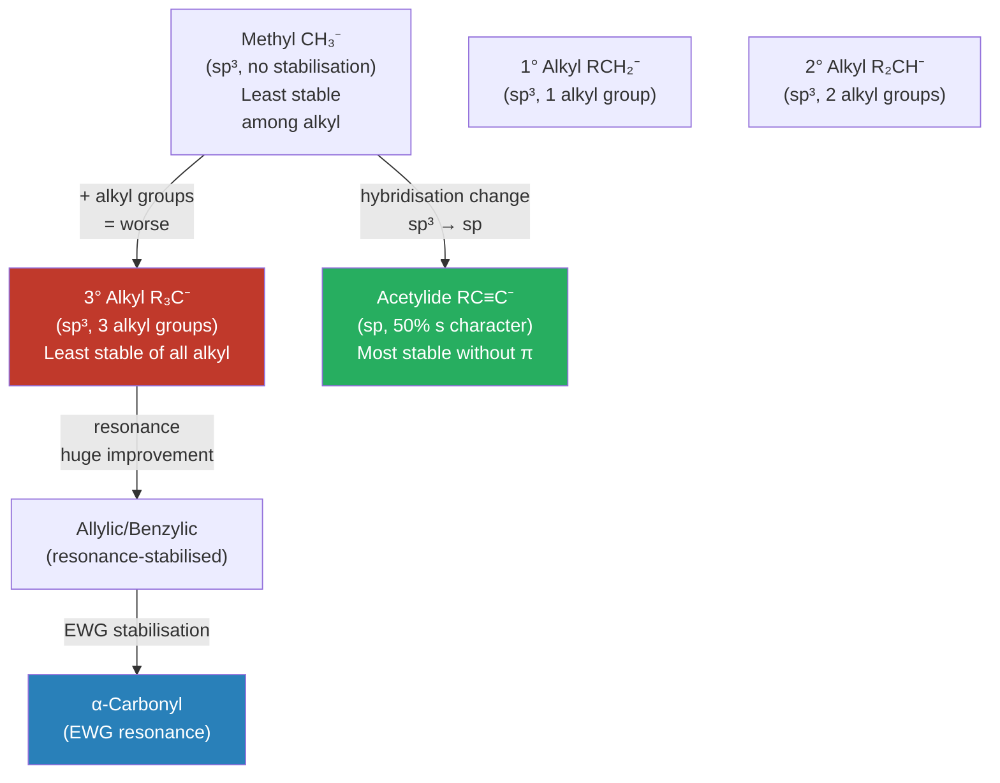
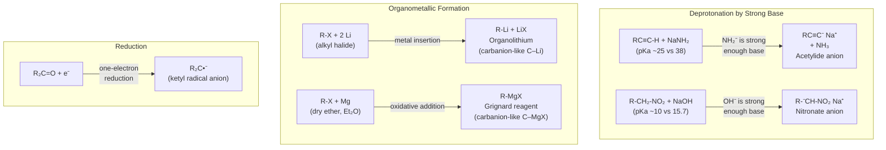

# ⚡ CHEM-103 — Module 11, Topic 05: Carbanions

**[🔗 Back to Module 11 README](README.md)** · **[🔗 Back to CHEM-103](../)**


**Navigation:** [← 04 Carbonium Ions](04_carbonium_ions.md) · [→ 06 SN1 Reactions](06_sn1.md)

---

## 📋 Table of Contents

1. [Definition](#1-definition)
2. [Structure and Hybridisation](#2-structure-and-hybridisation)
3. [Stability Factors](#3-stability-factors)
4. [Stability Order](#4-stability-order)
5. [pKₐ and the Carbanion Connection](#5-pka-and-the-carbanion-connection)
6. [Formation of Carbanions](#6-formation-of-carbanions)
7. [Reactions of Carbanions](#7-reactions-of-carbanions)
8. [Comparison: Carbanions vs Carbocations](#8-comparison-carbanions-vs-carbocations)
9. [Solved Examples](#9-solved-examples)
10. [Practice Problems](#10-practice-problems)
11. [References](#11-references)

---

## 1. Definition

> **Carbanion:** An organic species in which a carbon atom bears a **formal negative charge**, possessing **eight electrons** in its valence shell (an octet), including a **lone pair** of electrons on the carbon.

General formula: **R₃C:⁻** or **R₃C⁻**

Carbanions are the **carbon-based nucleophiles** and **Brønsted bases** of organic chemistry. They arise whenever a C–H (or C–X) bond undergoes **heterolytic cleavage** with the electron pair staying on carbon.

$$\text{R}_3\text{C} - \text{H} + \text{Base}^- \;\longrightarrow\; \underset{\text{carbanion}}{\text{R}_3\text{C}^-} + \text{Base}-\text{H}$$

---

## 2. Structure and Hybridisation

### 2.1 The Lone Pair Orbital

Unlike carbocations (sp², planar), the structure of a carbanion depends on its hybridisation:

| Carbanion Type | Hybridisation | Geometry | Lone Pair Orbital |
|:--------------|:-------------|:---------|:-----------------|
| Alkyl (R₃C⁻) | sp³ | Pyramidal (tetrahedral-like) | sp³ orbital |
| Vinyl (R₂C=CR⁻) | sp² | Planar at carbanion C | sp² orbital |
| Acetylide (RC≡C⁻) | sp | Linear | sp orbital |

```
       R
       |
   R - C:⁻     ← sp³ carbanion: lone pair in sp³ orbital
       |         pyramidal, ~107° angles
       R

   R-C≡C:⁻     ← sp carbanion (acetylide)
               very stable — lone pair in low-energy sp orbital
```

### 2.2 Why sp³? Not Planar Like Carbocations?

Carbanions have **8 electrons** — the lone pair occupies a valence orbital. To minimise electron repulsion, sp³ hybridisation is favoured (four electron pairs in tetrahedral arrangement). They are **not** sp² planar, unlike carbocations.

> **Inversion:** sp³ carbanions can undergo rapid inversion of configuration (analogous to ammonia inversion), but this is slow enough that some chiral carbanions can be generated and observed.

---

## 3. Stability Factors

The stability of a carbanion is determined by how well the **negative charge is dispersed** from the carbon. Four main factors operate:

### 3.1 Factor 1: Inductive Effect

Electron-withdrawing groups (**−I effect**) stabilise carbanions by delocalising negative charge through σ bonds.

$$\underset{\text{more stable}}{\text{CF}_3-\text{CH}_2^-} \;\gg\; \underset{\text{less stable}}{\text{CH}_3-\text{CH}_2^-}$$

Conversely, electron-donating alkyl groups (**+I**) destabilise carbanions (they push electron density toward an already negative centre).

**Key destabilisation order (inductive):** 3° > 2° > 1° > methyl (for *alkyl* carbanions — more alkyl groups = more electron-pushing = less stable)

### 3.2 Factor 2: Resonance Delocalisation

Adjacent π systems dramatically stabilise carbanions by spreading the negative charge over multiple atoms:

**Allylic carbanion:**

$$\underset{-}{\text{CH}}_2-\text{CH}=\text{CH}_2 \;\longleftrightarrow\; \text{CH}_2=\text{CH}-\underset{-}{\text{CH}}_2$$

**Acetylacetonate anion** (β-diketone → very stable):

$$\text{CH}_3\text{CO}-\underset{-}{\text{CH}}-\text{COCH}_3 \;\longleftrightarrow\; \text{two equivalent resonance structures}$$

**Nitro-stabilised carbanion:**

$$\text{R}-\underset{-}{\text{CH}}-\text{NO}_2 \;\longleftrightarrow\; \text{R-CH=NO}_2^- \;\text{(very stable)}$$

The order of π-stabilisation: **NO₂ > COR > COOR > CN > C₆H₅ > CR=CR₂**

### 3.3 Factor 3: Hybridisation of the Carbanion Carbon

This is the **most powerful** factor for intrinsically stabilised carbanions:

| Hybridisation | % s character | Orbital energy | Stability of lone pair |
|:-------------|:-------------:|:-------------:|:---------------------:|
| sp | 50% | Lower (closer to nucleus) | **Highest** — most stable |
| sp² | 33% | Intermediate | Intermediate |
| sp³ | 25% | Higher (further from nucleus) | **Lowest** — least stable |

$$\underset{\text{sp, most stable}}{\text{RC}\equiv\text{C}^-} \;\gg\; \underset{\text{sp}^2}{\text{R}_2\text{C}=\text{C}^-\text{R}} \;\gg\; \underset{\text{sp}^3\text{, least stable}}{\text{R}_3\text{C}^-}$$

> **Physical reason:** In sp orbitals (50% s character), the electron pair is held in a lower-energy orbital with more s character — closer to the nucleus, more stable. The sp lone pair is "tighter" and lower in energy.

**Application:** Acetylide ions (HC≡C⁻, sp) are stable enough to be formed with strong bases like NaNH₂, while simple alkyl carbanions require organolithium or Grignard conditions.

### 3.4 Factor 4: Solvent and Counter-Ion Effects

In solution:
- **Polar protic solvents** stabilise carbanions via hydrogen bonding to the negative carbon (but also favour dissociation)
- **Counter-ions** (Li⁺, Mg²⁺) dramatically affect the electron density on carbon in organometallic species — C–Li and C–MgX bonds have significant covalent character and are better described as "carbanion-like" rather than true free carbanions

---

## 4. Stability Order

### 4.1 Simple Alkyl Carbanions (no resonance)

$$\underbrace{\text{CH}_3^-}_{\text{methyl}} > \underbrace{\text{1°}}_{\text{primary}} > \underbrace{\text{2°}}_{\text{secondary}} > \underbrace{\text{3°}}_{\text{tertiary}}$$

> This is the **opposite** of carbocations! Alkyl groups (+I) destabilise the negative charge.

### 4.2 Overall Stability (all types)

$$\underbrace{\text{R-C}\equiv\text{C}^-}_{\text{acetylide, sp}} \approx \underbrace{\text{ArCH}_2^-}_{\text{benzylic}} \gg \underbrace{\overset{-}{\text{CH}_2}\text{-C=O}}_{\text{α-carbonyl}} \gg \underbrace{\overset{-}{\text{CH}_2}\text{-CH=CH}_2}_{\text{allylic}} \gg \underbrace{\text{3° alkyl}}_{\text{least stable}}$$



---

## 5. pKₐ and the Carbanion Connection

The stability of a carbanion from acid **C–H** can be directly measured by the **pKₐ** of the conjugate acid:

$$\text{C-H} \;\longrightarrow\; \text{C}^- + \text{H}^+ \qquad K_a = \frac{[\text{C}^-][\text{H}^+]}{[\text{C-H}]}$$

**Lower pKₐ = more acidic C–H = more stable carbanion**

| C–H Acid | pKₐ | Carbanion type |
|:---------|:---:|:---------------|
| HCl (reference) | −7 | Cl⁻ |
| H₂SO₄ | −3 | — |
| RCOOH | 4–5 | Carboxylate |
| Malonyl ester CH₂(COOR)₂ | ~13 | α-dicarbonyl stabilised |
| β-Diketone (CH₃COCH₂COCH₃) | ~9 | α-diketone stabilised |
| Nitroalkane R-CH₂-NO₂ | ~10 | Nitro-stabilised |
| Phenylacetylene C₆H₅-C≡CH | ~23 | Acetylide (sp) |
| Terminal alkyne HC≡CH | ~25 | Acetylide (sp) |
| Benzene C₆H₆ | ~43 | Aryl (sp²) |
| Ethylene H₂C=CH₂ | ~44 | Vinyl (sp²) |
| Toluene C₆H₅CH₃ | ~43 | Benzylic |
| Ethane CH₃CH₃ | ~50 | Simple alkyl (sp³) |
| Methane CH₄ | ~48 | Methyl (sp³) |

> **Key rule:** To deprotonate a C–H acid and form a stable carbanion, you need a base whose **conjugate acid has a lower pKₐ** than the C–H compound.

---

## 6. Formation of Carbanions



### 6.1 Grignard Reagents — Most Important Carbanion Equivalent

$$\text{R-X} + \text{Mg} \xrightarrow{\text{dry ether (Et}_2\text{O)}} \text{R-MgX}$$

The C–Mg bond is polar with δ⁻ on carbon. This acts as a **carbanion equivalent** (nucleophile and base) without being a true free carbanion. Examples:

- CH₃MgI (methylmagnesium iodide) — methyl carbanion equivalent
- C₆H₅MgBr (phenylmagnesium bromide) — phenyl carbanion equivalent
- CH₂=CH–MgBr (vinylmagnesium bromide)

---

## 7. Reactions of Carbanions

Carbanions are strong **nucleophiles** and strong **bases**. Their two main modes of reaction:

### 7.1 As Nucleophiles (C–C Bond Formation)

**Addition to carbonyl (Grignard reaction):**

$$\text{R-MgX} + \text{R'CHO} \xrightarrow{1.\;\text{ether}\;;\;2.\;\text{H}_3\text{O}^+} \text{R-CH(OH)-R'} \;\text{(secondary alcohol)}$$

**Alkylation (SN2 on alkyl halide):**

$$\text{R}^- + \text{R'CH}_2\text{-X} \;\longrightarrow\; \text{R-CH}_2\text{R'} + \text{X}^-$$

**Michael addition (to α,β-unsaturated carbonyl):**

$$\text{Nu}^- + \text{CH}_2=\text{CHCOR} \;\longrightarrow\; \text{Nu-CH}_2-\overset{-}{\text{C}}\text{H-COR} \;\longrightarrow\; \text{Nu-CH}_2-\text{CH}_2\text{-COR}$$

### 7.2 As Bases (Deprotonation)

Carbanions/organometallics abstract protons from weaker acids:

$$\text{C}_4\text{H}_9\text{Li} + \text{R}_2\text{NH} \;\longrightarrow\; \text{C}_4\text{H}_{10} + \text{R}_2\text{N}^-\text{Li}^+$$

---

## 8. Comparison: Carbanions vs Carbocations

| Property | **Carbocation R₃C⁺** | **Carbanion R₃C⁻** |
|:---------|:-------------------:|:-----------------:|
| Charge on carbon | Positive (+1) | Negative (−1) |
| Valence electrons | 6 (sextet) | 8 (octet) |
| Hybridisation (simple) | sp² | sp³ |
| Geometry | Trigonal planar | Pyramidal |
| Empty orbital | Yes (empty p) | No |
| Lone pair | No | Yes (on C) |
| Character | Electrophile / Lewis acid | Nucleophile / Lewis base |
| Stability order (alkyl) | 3° > 2° > 1° > Me | Me > 1° > 2° > 3° |
| Stabilised by | Electron-donating groups, resonance with donor π | Electron-withdrawing groups, resonance with acceptor π |
| Role in reactions | SN1, E1, Friedel-Crafts | SN2, aldol, Grignard, Michael |
| Rearrangement | Common (1,2-shifts) | Rare |

---

## 9. Solved Examples

### Example 1: Rank by Carbanion Stability

**Q:** Rank in order of increasing stability of the corresponding carbanion:
(a) CH₄ (b) HC≡CH (c) CH₃NO₂ (d) CH₃COCH₂COCH₃

**A:**
- (a) CH₄ — simple sp³ methyl, pKₐ ≈ 48 → least stable carbanion
- (b) HC≡CH — sp acetylide, pKₐ ≈ 25 → highly stable (sp lone pair)
- (c) CH₃NO₂ — nitro-stabilised, pKₐ ≈ 10 → very stable
- (d) CH₃COCH₂COCH₃ (acetylacetone) — flanked by two C=O groups, pKₐ ≈ 9 → most stable

**Order of increasing carbanion stability:** a < b < c < d

### Example 2: Deduce Grignard Reaction Product

**Q:** What is the product of PhMgBr reacting with acetaldehyde (CH₃CHO), then aqueous workup?

**A:**

$$\text{C}_6\text{H}_5\text{MgBr} + \text{CH}_3\text{CHO} \xrightarrow{1.\;\text{ether}\;;\;2.\;\text{H}_3\text{O}^+} \text{C}_6\text{H}_5-\text{CH(OH)}-\text{CH}_3 \;\text{(1-phenylethanol)}$$

The phenyl carbanion equivalent attacks the electrophilic C=O carbon.

### Example 3: Why Is Acetylide Stable Enough to Form with NaNH₂?

- HC≡CH pKₐ ≈ 25; NH₃ pKₐ ≈ 38
- NaNH₂ provides NH₂⁻ (conjugate acid NH₃, pKₐ 38)
- Since **38 > 25**: NH₂⁻ is a strong enough base to deprotonate HC≡CH
- Product: HC≡C⁻ Na⁺ (sodium acetylide) — stable because lone pair is in sp orbital

---

## 10. Practice Problems

1. Explain why the carbanion from nitromethane (CH₂⁻–NO₂) is more stable than the carbanion from propene (CH₂=CH–CH₂⁻).
2. Would NaOH (pKₐ of H₂O ≈ 15.7) be strong enough to form a carbanion from diethyl malonate (pKₐ ≈ 13)?
3. Write the product of the reaction of CH₃CH₂MgBr with CO₂, followed by aqueous workup.
4. Why can carbanions adjacent to two carbonyl groups exist in aqueous base, while simple alkyl carbanions require very strong, anhydrous conditions?
5. Compare the sp³ geometry of carbanions with the inversion of nitrogen in amines. Why does this inversion make it difficult to isolate enantiomeric carbanions?

---

## 11. References

1. **Clayden, J., Greeves, N., Warren, S.** — *Organic Chemistry*, 2nd ed., Oxford University Press, 2012 — Chapter 8 (Acidity, pKₐ, carbanion stability), Chapter 10 (Nucleophilic addition to C=O)
2. **March, J.** — *Advanced Organic Chemistry*, 5th ed., Wiley-Interscience, 2001 — Chapter 5 (Carbanions)
3. **Fleming, I.** — *Molecular Orbitals and Organic Chemical Reactions — Student Edition*, Wiley, 2009 — Orbital basis for hybridisation and stability
4. **LibreTexts:** [Carbanion Stability](https://chem.libretexts.org/Bookshelves/Organic_Chemistry/Organic_Chemistry_(OpenStax)/08%3A_Alkyl_Halides_and_Elimination_Reactions/8.06%3A_Carbanions) — Free detailed text
5. **Master Organic Chemistry:** [Carbanion Stability](https://www.masterorganicchemistry.com/reaction-guide/carbanion/) — With pKₐ table and stability trends
6. **ChemGuide:** [Grignard reagents](https://www.chemguide.co.uk/organicprops/grignard/background.html) — Formation and reactions
7. **Khan Academy:** [Carbanions](https://www.khanacademy.org/science/organic-chemistry/organic-chemistry-foundations) — Video introductions

---

> 📖 *These notes are part of the [BUTEX Notes](https://github.com/itachi-re/butex-notes) repository — B.Sc. Textile Engineering, Fabric Engineering Dept. · CHEM-103 · Module 11*

**Navigation:** [← 04 Carbonium Ions](04_carbonium_ions.md) · [→ 06 SN1 Reactions](06_sn1.md)
