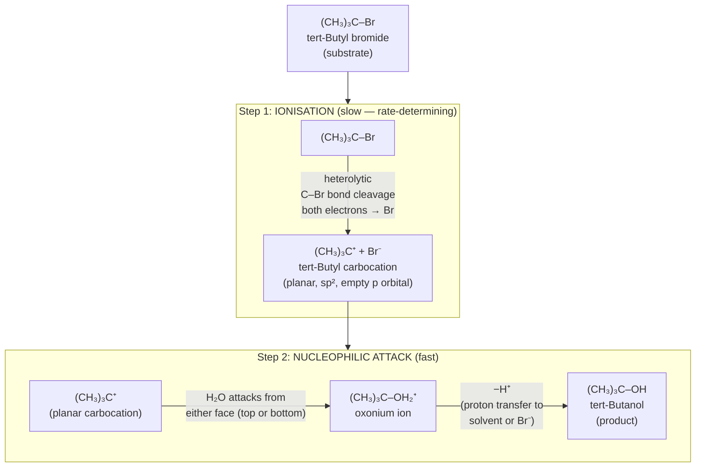
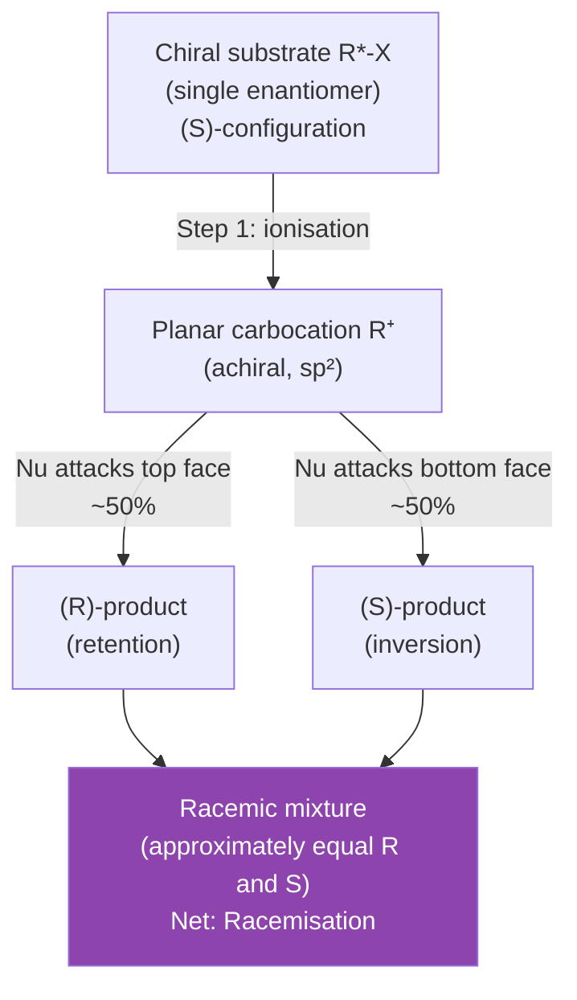
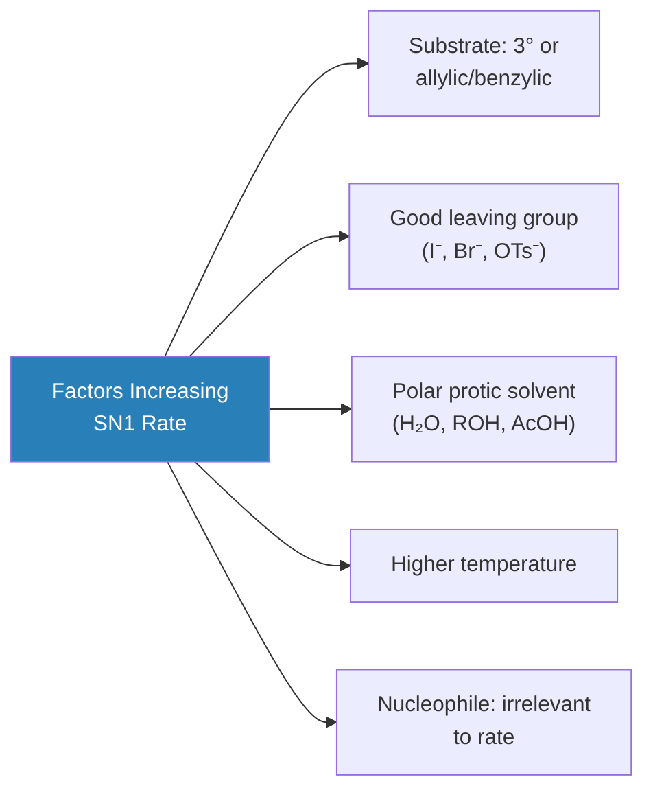
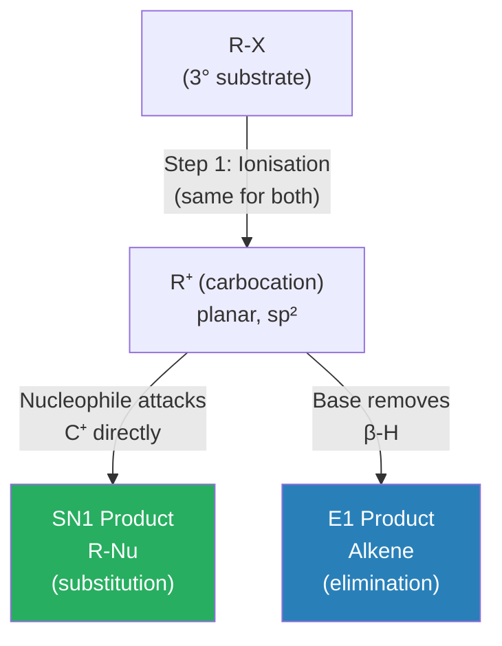

# 🔄 CHEM-103 — Module 11, Topic 06: SN1 Reactions

**[🔗 Back to Module 11 README](README.md)** · **[🔗 Back to CHEM-103](../)**


**Navigation:** [← 05 Carbanions](05_carbanions.md) · [→ 07 SN2 Reactions](07_sn2.md)

---

## 📋 Table of Contents

1. [Definition and Overview](#1-definition-and-overview)
2. [The SN1 Mechanism](#2-the-sn1-mechanism)
3. [Kinetics and Rate Law](#3-kinetics-and-rate-law)
4. [Energy Profile Diagram](#4-energy-profile-diagram)
5. [Stereochemistry of SN1](#5-stereochemistry-of-sn1)
6. [Factors Governing SN1](#6-factors-governing-sn1)
7. [Rearrangements in SN1](#7-rearrangements-in-sn1)
8. [Evidence for the SN1 Mechanism](#8-evidence-for-the-sn1-mechanism)
9. [SN1 vs SN2 — Quick Comparison](#9-sn1-vs-sn2--quick-comparison)
10. [Competition: SN1 vs E1](#10-competition-sn1-vs-e1)
11. [Solved Examples](#11-solved-examples)
12. [Practice Problems](#12-practice-problems)
13. [References](#13-references)

---

## 1. Definition and Overview

> **SN1 (Substitution, Nucleophilic, Unimolecular):** A two-step nucleophilic substitution reaction in which the **rate-determining step** involves **only the substrate** (unimolecular). A **carbocation intermediate** is formed in the first step, which is then captured by a nucleophile in the second step.

| Attribute | Detail |
|:----------|:-------|
| Steps | 2 (stepwise, not concerted) |
| Molecularity (RDS) | Unimolecular (only substrate in slow step) |
| Rate order | First order overall |
| Intermediate | Carbocation |
| Stereochemistry | Racemisation (complete or partial) |
| Substrate preference | Tertiary > Secondary >> Primary |
| Solvent preference | Polar protic (e.g., H₂O, ROH, HCOOH) |
| Rearrangements | Possible (via carbocation) |

---

## 2. The SN1 Mechanism

### 2.1 Step-by-Step Mechanism

**Reaction:** (CH₃)₃C–Br + H₂O → (CH₃)₃C–OH + HBr



### 2.2 Arrow Pushing (Electron Flow)

```
Step 1 (Ionisation):

    (CH₃)₃C ← : Br     →    (CH₃)₃C⁺    +    :Br⁻
               ↑
     Arrow from C–Br bond to Br (heterolytic cleavage)
     Both electrons go to Br (leaving group)

Step 2 (Attack):

    (CH₃)₃C⁺   +   :OH₂    →    (CH₃)₃C–Ȯ̈H₂⁺
         ↑               ↑
   empty p orbital   lone pair on O attacks
   
   then  −H⁺  →  (CH₃)₃C–OH
```

---

## 3. Kinetics and Rate Law

### 3.1 Derivation of the Rate Law

In SN1, the first (and **only**) step in the rate-determining step involves **only the substrate R–X**. The nucleophile (Nu) does not appear in the slow step.

By the **law of mass action:**

$$\text{Rate} = k[\text{R-X}]$$

This is a **first-order** rate equation — rate depends only on the concentration of substrate.

The nucleophile's concentration **does not appear** in the rate law, even though it is required for the overall reaction. This is the defining experimental signature of SN1.

### 3.2 Mathematical Expression

$$\boxed{\text{Rate} = k[\text{R-X}]}$$

Where:
- $k$ = first-order rate constant (units: s⁻¹)
- $[\text{R-X}]$ = concentration of substrate (mol L⁻¹)

### 3.3 Steady-State Approximation

If we apply the steady-state approximation to the carbocation intermediate:

$$\frac{d[\text{R}^+]}{dt} = k_1[\text{R-X}] - k_{-1}[\text{R}^+][\text{X}^-] - k_2[\text{R}^+][\text{Nu}] \approx 0$$

Solving for $[\text{R}^+]$:

$$[\text{R}^+] = \frac{k_1[\text{R-X}]}{k_{-1}[\text{X}^-] + k_2[\text{Nu}]}$$

When $k_2[\text{Nu}] \gg k_{-1}[\text{X}^-]$ (i.e., in dilute solution with good nucleophile):

$$\text{Rate} = k_2[\text{R}^+][\text{Nu}] \approx \frac{k_1 k_2 [\text{R-X}][\text{Nu}]}{k_{-1}[\text{X}^-] + k_2[\text{Nu}]} \approx k_1[\text{R-X}]$$

This confirms first-order kinetics.

### 3.4 Half-Life for SN1

Since SN1 is first order:

$$t_{1/2} = \frac{\ln 2}{k} = \frac{0.693}{k}$$

The half-life is **independent of initial concentration** (characteristic of first-order reactions).

---

## 4. Energy Profile Diagram

The SN1 reaction has **two transition states** and **one intermediate** (the carbocation):

```
         TS1                  TS2
          ‡                    ‡
          /\                  /\
         /  \                /  \
        /    \              /    \
Energy /      \            /      \
  |   /        \__________/        \
  |  / RX + Nu  Carbocation         \
  | /            intermediate        \
  |/                                  \
  +--- Reaction coordinate ---------->
     R-X + Nu :    [R⁺ ... X⁻]   R-Nu + X⁻
     (reactants)  (intermediate)  (products)

   |___Eₐ(1)___|       |___Eₐ(2)___|
   RDS = Step 1        Fast = Step 2
```

**Key points:**
- **TS1** (first transition state) is the highest point → rate-determining
- **Carbocation intermediate** sits in the energy valley between the two maxima
- **TS2** is lower in energy than TS1 (attack of Nu on the cation is fast)
- Overall reaction can be exothermic or endothermic depending on the specific reaction

---

## 5. Stereochemistry of SN1

### 5.1 The Planar Carbocation and Racemisation

The carbocation intermediate is **trigonal planar** (sp²). Both faces of the carbocation are equally accessible to the incoming nucleophile. If the original substrate was a **chiral centre**, then:

- Attack from the **top** face → one enantiomer (inversion)
- Attack from the **bottom** face → other enantiomer (retention)

**In theory:** 50:50 mixture → **complete racemisation**

**In practice:** There is often **slight excess of inversion** product (~60–70% inversion, ~30–40% retention) because:
1. **Ion pair formation:** The leaving group (X⁻) briefly lingers on one face of the carbocation (as a "tight ion pair"), partially blocking attack from that face
2. The nucleophile has a slightly higher probability of attacking from the back (from the direction the leaving group departed)



### 5.2 Optical Activity Measurement

If we start with optically pure (R) substrate:
- SN1 gives **mostly racemic** product (optical rotation → ~0)
- The degree of racemisation is a diagnostic for SN1 mechanism

---

## 6. Factors Governing SN1

### 6.1 Substrate Structure — Most Important Factor

The rate of SN1 depends on the **stability of the carbocation** formed:

$$\text{3°} \gg \text{2°} \gg \text{1°} \approx 0\;\text{(does not occur)}$$

**Relative rates of SN1 ionisation (approximate):**

| Substrate | Type | Relative rate |
|:---------|:-----|:-------------:|
| (CH₃)₃C–Br | 3° | 1,200,000 |
| (CH₃)₂CH–Br | 2° | 12 |
| CH₃CH₂–Br | 1° | 1 |
| CH₃–Br | Methyl | < 0.001 |

**Special fast substrates:** allylic, benzylic (resonance-stabilised carbocations)

### 6.2 Leaving Group — Second Most Important

Better leaving groups (**weaker conjugate bases**) give faster SN1:

$$\text{Rate order (SN1): }\underbrace{\text{I}^-}_{\text{best LG}} > \underbrace{\text{Br}^-}_{} > \underbrace{\text{Cl}^-}_{} > \underbrace{\text{F}^-}_{\text{poor LG}}$$

Tosylate (OTs), triflate (OTf), and other sulfonates are excellent leaving groups (weak bases of sulfonic acids).

> **OH⁻ and OR⁻ are NOT leaving groups** (strong bases) — to use OH/OR as leaving groups, first convert to OTs, OMs, or OTf (activate with acid to form H₂O⁺, which then leaves as H₂O).

### 6.3 Solvent — Critical for Ion Formation

SN1 requires **polar protic solvents** (water, alcohols, acetic acid, formic acid) because:

1. They **solvate** (stabilise) the developing carbocation and anion in the transition state
2. They **stabilise the ionic products** via hydrogen bonding and ion-dipole interactions
3. High dielectric constant (ε) reduces electrostatic attraction between ions, promoting dissociation

| Solvent | Dielectric constant ε | SN1 rate |
|:--------|:---------------------:|:--------:|
| Water H₂O | 80 | High |
| Methanol MeOH | 33 | Moderate-high |
| Acetic acid AcOH | 6 | Moderate |
| Diethyl ether Et₂O | 4.3 | Very low |
| Hexane | 1.9 | Negligible |

### 6.4 Nucleophile — Does NOT Affect Rate

Since the nucleophile does not participate in the rate-determining step, **the concentration and strength of the nucleophile have no effect on the SN1 rate**.

However, the nucleophile determines the **product**:
- Weak nucleophile (H₂O) → alcohol via solvolysis
- Strong nucleophile → can sometimes divert from SN1 to SN2 (for 2° substrates)

### 6.5 Temperature

Higher temperature increases the rate (Arrhenius equation: $k = A e^{-E_a/RT}$). At elevated temperature, **E1 competes with SN1** (both go through the same carbocation intermediate).



---

## 7. Rearrangements in SN1

Since SN1 goes through a carbocation intermediate, **rearrangements** (1,2-H or 1,2-methyl shifts) can occur to give a more stable cation — which then proceeds to substitution or elimination.

**Example:** Solvolysis of neopentyl bromide (1°) in water does **not** give neopentyl alcohol. Instead:

$$\underset{\text{neopentyl Br (1°, slow ionisation)}}{\text{(CH}_3\text{)}_3\text{C-CH}_2\text{-Br}} \xrightarrow{\text{slow}} \underset{\text{1° carbocation, unstable}}{\text{(CH}_3\text{)}_3\text{C-CH}_2^+} \xrightarrow{\text{1,2-Me shift}} \underset{\text{3° carbocation, stable}}{\text{(CH}_3\text{)}_2\text{C}^+-\text{CH}_2\text{CH}_3} \xrightarrow{\text{H}_2\text{O}} \underset{\text{2-methyl-2-butanol (major)}}{\text{(CH}_3\text{)}_2\text{C(OH)-CH}_2\text{CH}_3}$$

The product is **not** the simple substitution product — this rearranged product is diagnostic of the SN1/carbocation mechanism.

---

## 8. Evidence for the SN1 Mechanism

| Evidence | Observation | Implication |
|:---------|:------------|:------------|
| **Rate law** | Rate = k[R-X] (first order, no [Nu] dependence) | Only substrate in RDS → unimolecular |
| **Racemisation** | Optically pure substrate → mostly racemic product | Planar carbocation intermediate |
| **Rearrangements** | Products with rearranged carbon skeleton | Free carbocation has time to rearrange |
| **Solvent effect** | Rate increases dramatically with polar protic solvent | Ions stabilised by solvation |
| **Substrate effect** | 3° >> 2° >> 1° reactivity | Reflects carbocation stability |
| **Common ion effect** | Adding X⁻ (leaving group anion) slows the rate | Pushes ionisation equilibrium back (Le Chatelier) |

---

## 9. SN1 vs SN2 — Quick Comparison

| Feature | **SN1** | **SN2** |
|:--------|:-------:|:-------:|
| Steps | 2 (stepwise) | 1 (concerted) |
| Molecularity | Unimolecular (RDS) | Bimolecular |
| Rate law | k[R-X] | k[R-X][Nu] |
| Intermediate | Carbocation | None (transition state only) |
| Stereochemistry | Racemisation | Complete inversion (Walden) |
| Best substrate | 3° > 2° >> 1° | Methyl > 1° > 2° >> 3° |
| Solvent | Polar protic | Polar aprotic |
| Rearrangements | Yes | No |
| Nucleophile effect on rate | None | Direct (stronger = faster) |

---

## 10. Competition: SN1 vs E1

Both SN1 and E1 go through the **same carbocation intermediate**. The fate of the cation depends on:



| Factor | Favours SN1 | Favours E1 |
|:-------|:-----------:|:----------:|
| Temperature | Lower | **Higher** |
| Nucleophile/Base | Strong nucleophile | Strong bulky base |
| Substrate | Less substituted | More substituted |
| Concentration of Nu/Base | Higher [Nu] | Higher [Base] |

> **General rule:** Heat (higher temperature) shifts the SN1/E1 competition toward **elimination (E1)** because elimination is entropically favoured (one molecule → two molecules: alkene + HX). See Topic 08 for more on E1.

---

## 11. Solved Examples

### Example 1: Identify Mechanism (SN1 or SN2?)

**Q:** 2-bromo-2-methylpropane (tert-butyl bromide) reacts with CH₃OH. Is this SN1 or SN2?

**A:**
- Substrate: **tertiary** (3°) — excellent for SN1
- Solvent: **methanol** (polar protic) — favours SN1
- The nucleophile (CH₃OH) is weak → cannot force SN2
- **Mechanism: SN1**
- Product: (CH₃)₃C–OCH₃ (methyl tert-butyl ether)

### Example 2: Predict the Rate Effect

**Q:** Which reacts faster via SN1: (CH₃)₃CBr or CH₃CH₂Br? Explain.

**A:**
- (CH₃)₃CBr gives a **3° carbocation** — highly stable due to 9 hyperconjugative interactions + 3 inductive donors
- CH₃CH₂Br gives a **1° carbocation** — very unstable
- **(CH₃)₃CBr reacts much faster** (estimated ~10⁶ × faster)

### Example 3: Stereochemistry Problem

**Q:** (S)-3-bromo-3-methylhexane undergoes SN1 with water. What is the stereochemical outcome?

**A:**
1. (S)-substrate ionises → planar carbocation (achiral, sp²)
2. Water attacks from both faces with approximately equal probability
3. **Result:** approximately 1:1 mixture of (R)-3-methyl-3-hexanol and (S)-3-methyl-3-hexanol
4. **Optical rotation → ~0; racemic mixture produced**
5. (Slight excess of inversion product due to ion pair shielding)

### Example 4: Rate Law Determination

**Q:** Doubling the concentration of tert-butyl bromide doubles the rate of its solvolysis. Doubling the concentration of H₂O has no effect. What is the rate law?

**A:**
- Rate depends on [R-X] only → **first order in substrate**
- Rate is **independent of [H₂O]** (nucleophile)
- **Rate = k[(CH₃)₃CBr]** — SN1 confirmed

---

## 12. Practice Problems

1. Write the SN1 mechanism for the reaction of 2-chloro-2-methylbutane with methanol. Show all steps, lone pairs, and curved arrows.
2. Explain why primary alkyl halides essentially never react by SN1.
3. A compound (R)-2-bromobutane undergoes SN1 hydrolysis. Sketch the energy profile and describe the stereochemical outcome.
4. Why does the common ion effect (addition of Br⁻) slow down the SN1 reaction of tert-butyl bromide?
5. Predict the major product(s) when 2-methyl-3-phenyl-3-chlorobutane undergoes SN1 solvolysis in water.
6. A student observes that the rate of reaction of (CH₃)₃CBr in a mixture of 50% water / 50% acetone is faster than in pure acetone. Explain.

---

## 13. References

1. **Clayden, J., Greeves, N., Warren, S.** — *Organic Chemistry*, 2nd ed., Oxford University Press, 2012 — Chapter 12 (Nucleophilic substitution at saturated carbon), Chapter 17 (Conformational analysis and SN1/SN2)
2. **March, J.** — *Advanced Organic Chemistry*, 5th ed., Wiley, 2001 — Chapter 10 (Aliphatic nucleophilic substitution)
3. **Ingold, C.K.** — *Structure and Mechanism in Organic Chemistry*, 1953 — Original SN1/SN2 terminology and mechanistic framework
4. **LibreTexts:** [SN1 Reactions](https://chem.libretexts.org/Bookshelves/Organic_Chemistry/Organic_Chemistry_(OpenStax)/11%3A_Reactions_of_Alkyl_Halides-_Nucleophilic_Substitutions_and_Eliminations/11.03%3A_The_SN1_Reaction) — Free, detailed with energy diagrams
5. **Master Organic Chemistry:** [SN1 in Depth](https://www.masterorganicchemistry.com/reaction-guide/sn1-reaction/) — All factors covered with examples
6. **ChemGuide:** [SN1 Mechanism](https://www.chemguide.co.uk/mechanisms/nucsub/sn1ch.html) — Clear diagrams
7. **Khan Academy:** [SN1 reactions](https://www.khanacademy.org/science/organic-chemistry/substitution-elimination-reactions/sn1-sn2-tutorial/v/sn1-and-sn2) — Video walkthrough

---

> 📖 *These notes are part of the [BUTEX Notes](https://github.com/itachi-re/butex-notes) repository — B.Sc. Textile Engineering, Fabric Engineering Dept. · CHEM-103 · Module 11*

**Navigation:** [← 05 Carbanions](05_carbanions.md) · [→ 07 SN2 Reactions](07_sn2.md)
