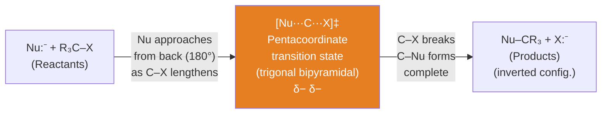
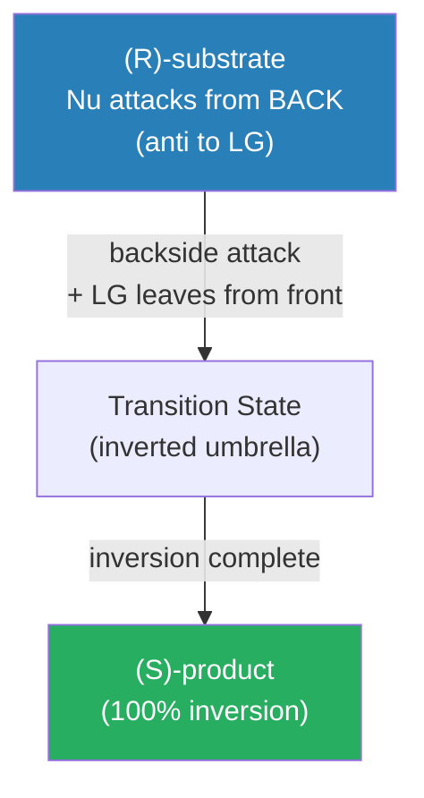
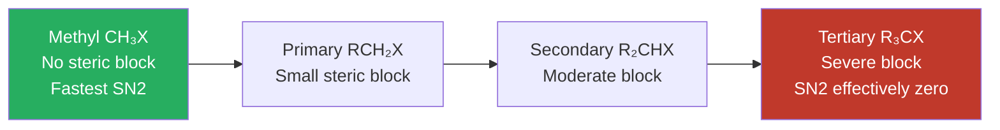

# 🔄 CHEM-103 — Module 11, Topic 07: SN2 Reactions

**[🔗 Back to Module 11 README](README.md)** · **[🔗 Back to CHEM-103](../)**


**Navigation:** [← 06 SN1 Reactions](06_sn1.md) · [→ 08 E1 Reactions](08_e1.md)

---

## 📋 Table of Contents

1. [Definition and Overview](#1-definition-and-overview)
2. [The SN2 Mechanism](#2-the-sn2-mechanism)
3. [Kinetics and Rate Law](#3-kinetics-and-rate-law)
4. [Energy Profile Diagram](#4-energy-profile-diagram)
5. [Stereochemistry — Walden Inversion](#5-stereochemistry--walden-inversion)
6. [Factors Governing SN2](#6-factors-governing-sn2)
7. [Nucleophilicity](#7-nucleophilicity)
8. [Leaving Group Ability](#8-leaving-group-ability)
9. [Evidence for the SN2 Mechanism](#9-evidence-for-the-sn2-mechanism)
10. [SN2 in Synthesis](#10-sn2-in-synthesis)
11. [Solved Examples](#11-solved-examples)
12. [Practice Problems](#12-practice-problems)
13. [References](#13-references)

---

## 1. Definition and Overview

> **SN2 (Substitution, Nucleophilic, Bimolecular):** A **one-step, concerted** nucleophilic substitution reaction in which the nucleophile attacks the substrate **simultaneously** as the leaving group departs. Both nucleophile and substrate appear in the **rate-determining step** (which is the only step).

| Attribute | Detail |
|:----------|:-------|
| Steps | 1 (concerted — no intermediate) |
| Molecularity (RDS) | Bimolecular (Nu + substrate in only step) |
| Rate order | Second order overall (first order in each) |
| Intermediate | **None** (only a transition state) |
| Stereochemistry | **100% inversion** (Walden inversion) |
| Substrate preference | Methyl > 1° > 2° >> 3° (never) |
| Solvent preference | Polar aprotic (DMF, DMSO, acetone, acetonitrile) |
| Rearrangements | **Never** (no carbocation intermediate) |

---

## 2. The SN2 Mechanism

### 2.1 The Concerted Backside Attack

SN2 is a **concerted (single-step)** process. There is no carbocation intermediate. The nucleophile attacks the **back** (anti) face of the carbon bearing the leaving group:

```
                         δ-            δ-
   Nu:⁻  +  C ← X   →  Nu ---C---X   →  Nu-C  +  X:⁻
            |               |               |
           (substrate)   (transition state)  (product)
           
   Nu attacks from     Pentacoordinate TS    Inversion of
   180° to X           (trigonal bipyramidal)  configuration
```

**The trajectory of backside attack:**
- Nu, the central C, and X must be **collinear** (180° approach)
- The three other groups on C **"umbrella flip"** as Nu comes in and X leaves
- Like an umbrella inverting in the wind

### 2.2 The Transition State



**Transition state geometry:**

```
         R
         |
Nu⁻ ----C---- X⁻    ← trigonal bipyramidal TS
         |            ← Nu and X are axial (linear)
         R    R       ← R groups are equatorial (in the plane)
         
   δ−           δ−
   Nu  --------  X   bonds partially formed/broken
```

### 2.3 Molecular Orbital Description

The nucleophile's **filled orbital (lone pair)** overlaps with the **σ*(C–X) antibonding orbital** from the back of the molecule. This backside overlap:
1. Weakens the C–X bond (population of σ*)
2. Forms the new C–Nu bond
3. Forces the geometry to invert

---

## 3. Kinetics and Rate Law

### 3.1 Rate Law

Since both nucleophile and substrate are in the single step:

$$\boxed{\text{Rate} = k[\text{R-X}][\text{Nu}]}$$

This is **second-order overall** (first order in substrate, first order in nucleophile).

| Experiment | [R-X] | [Nu] | Rate | Conclusion |
|:-----------|:-----:|:----:|:----:|:-----------|
| 1 | 0.10 M | 0.10 M | r₁ | Baseline |
| 2 | 0.20 M | 0.10 M | 2r₁ | First order in [R-X] |
| 3 | 0.10 M | 0.20 M | 2r₁ | First order in [Nu] |
| 4 | 0.20 M | 0.20 M | 4r₁ | Second order overall |

### 3.2 Units of k

$$k = \frac{\text{Rate}}{[\text{R-X}][\text{Nu}]} = \frac{\text{mol L}^{-1}\text{s}^{-1}}{\text{mol L}^{-1} \times \text{mol L}^{-1}} = \text{L mol}^{-1}\text{s}^{-1}$$

---

## 4. Energy Profile Diagram

SN2 has a **single transition state** — no intermediate:

```
          ‡
         /\
        /  \
       /    \
Energy/      \
  |  /        \
  | /  Nu+R-X  \   Nu-R + X⁻
  |/             \
  +------- Reaction coordinate -------->
            
         [Nu···C···X]‡
      (single maximum = TS)
      
  |<----Eₐ (activation)---->|
```

The **activation energy** (Eₐ) is determined mainly by:
- Steric crowding at the electrophilic C (steric effect on TS)
- Strength of the C–X bond being broken
- Stability of the developing C–Nu bond
- Solvent stabilisation of TS

---

## 5. Stereochemistry — Walden Inversion

### 5.1 The Walden Inversion

> **Walden Inversion:** The **complete inversion of configuration** at the chiral centre in an SN2 reaction. Named after Paul Walden (1896), who first observed this phenomenon.

If a chiral substrate with (R) configuration undergoes SN2, the product has **(S) configuration** — and vice versa. This is a **100% stereospecific** process.



### 5.2 The Umbrella Analogy

```
  Before (R):              TS:             After (S):
       a                  a                   a
       |                   \                  |
Nu --- C --- X    → Nu---C---X‡ →     Nu --- C
      / \                  /                 / \
     b   c                b c               c   b
     
  Umbrellas pointing       Flat              Umbrella flipped —
  away from Nu             (planar)          all groups inverted
```

### 5.3 Experimental Evidence for Inversion

**Classic experiment (Hughes and Ingold, 1935):**
- Starting material: (R)-2-bromobutane (specific optical rotation = +34°)
- Reaction: (R)-2-bromobutane + *Br⁻ (radioactive) → product
- Product: (S)-2-bromobutane (specific optical rotation = −34°)
- Complete inversion of sign of rotation confirms 100% inversion of configuration

---

## 6. Factors Governing SN2

### 6.1 Substrate Structure — Steric Effects (Most Critical)

Steric hindrance at the reaction centre is the **dominant factor** in SN2:

**Reactivity order:**

$$\underbrace{\text{CH}_3\text{X}}_{\text{methyl}} > \underbrace{\text{1° RCH}_2\text{X}}_{\text{primary}} > \underbrace{\text{2° R}_2\text{CHX}}_{\text{secondary}} \gg \underbrace{\text{3° R}_3\text{CX}}_{\text{tertiary — essentially zero}}$$

**Relative rates of SN2 (MeBr = 1.0):**

| Substrate | Relative Rate |
|:---------|:-------------:|
| CH₃Br (methyl) | 1.0 |
| CH₃CH₂Br (1°, ethyl) | 0.028 |
| (CH₃)₂CHBr (2°, isopropyl) | 0.0005 |
| (CH₃)₃CBr (3°, tert-butyl) | ~0 |

This dramatic rate decrease reflects the increasing steric crowding at the carbon being attacked: bulky groups block the back-face trajectory of the nucleophile, raising the activation energy.

**Neopentyl system (special case):**
- Neopentyl chloride (CH₃)₃C–CH₂Cl is primary but has a bulky tert-butyl group **β** to the reaction centre
- This β-branching creates **severe steric hindrance** even in a 1° system → very slow SN2



### 6.2 Nucleophile Strength (Nucleophilicity)

In SN2, the nucleophile participates in the rate-determining step → **stronger nucleophile = faster rate**

> **Nucleophilicity** ≠ **Basicity** (though they are related)
> - Basicity: thermodynamic (equilibrium with H⁺)
> - Nucleophilicity: kinetic (rate of attack on C)

**Key nucleophilicity trends:**

**Trend 1 — Charge:** Negatively charged > neutral:
$$\text{OH}^- > \text{H}_2\text{O} \qquad \text{RS}^- > \text{RSH} \qquad \text{RO}^- > \text{ROH}$$

**Trend 2 — Polarisability (same period, going across):**
$$\text{I}^- > \text{Br}^- > \text{Cl}^- > \text{F}^- \quad\text{(in protic solvent)}$$

Larger, more polarisable atoms form better, more diffuse nucleophiles. Iodide is the best halide nucleophile in polar protic solvents.

**Trend 3 — Polarisability (going down a group):**
$$\text{I}^- > \text{Br}^- > \text{Cl}^- > \text{F}^-$$

**Trend 4 — Solvent effect on nucleophilicity (polar protic vs aprotic):**
- In **polar protic solvents** (H₂O, ROH): nucleophiles are heavily solvated → reduced nucleophilicity. Small, hard nucleophiles (F⁻) are strongly solvated → relatively poor nucleophiles.
- In **polar aprotic solvents** (DMSO, DMF, acetone): nucleophiles are **not** solvated → "naked" anions → dramatically higher nucleophilicity. F⁻ becomes an excellent nucleophile in DMSO!

### 6.3 Solvent Effects

| Solvent Type | Example | Effect on SN2 |
|:------------|:--------|:--------------|
| Polar aprotic | DMSO, DMF, CH₃CN, acetone | **Excellent** — nucleophiles not solvated |
| Polar protic | H₂O, MeOH, EtOH | **Poor** — nucleophiles strongly solvated, rates reduced |
| Non-polar | Hexane, CCl₄ | Very poor — salts insoluble |

> **SN2 rule:** Use **polar aprotic** solvents for best SN2 rates. This is opposite to SN1, which needs polar protic.

---

## 7. Nucleophilicity

### 7.1 Common Nucleophiles — Nucleophilicity Order

```
Strong nucleophiles (good for SN2):
R₃C⁻ > R₂N⁻ > RO⁻ > HO⁻ >> ROH > H₂O    (oxygen series)
RS⁻ > HS⁻ >> RSH > H₂S                      (sulfur — very good)
I⁻ > Br⁻ > Cl⁻ >> F⁻                        (halide, protic solvent)
F⁻ > Cl⁻ > Br⁻ > I⁻                         (halide, aprotic solvent)
CN⁻, N₃⁻, SCN⁻, RS⁻                         (good soft nucleophiles)
```

### 7.2 Hard and Soft Nucleophiles (HSAB Principle)

| Type | Property | Example | Reactivity with C |
|:-----|:---------|:--------|:-----------------|
| **Soft** nucleophile | Polarisable, large, low charge density | I⁻, RS⁻, PPh₃ | Excellent SN2 at C |
| **Hard** nucleophile | Not polarisable, small, high charge density | F⁻, OH⁻, RO⁻ | Better at C=O |

---

## 8. Leaving Group Ability

Better leaving groups make SN2 faster (they leave more readily in the TS):

$$\text{I}^- > \text{Br}^- > \text{Cl}^- \gg \text{F}^- \approx \text{OH}^- \approx \text{OR}^- \approx \text{NH}_2^-$$

$$\text{OTs}^- \approx \text{OMs}^- > \text{I}^- > \text{Br}^- > \text{Cl}^-$$

**Rule:** Good leaving groups are the **conjugate bases of strong acids** (stable after departure):

| Leaving Group | Conjugate Acid | pKₐ of HA | LG ability |
|:-------------|:-------------|:---------:|:----------:|
| OTs⁻ (tosylate) | TsOH | −1 | Excellent |
| I⁻ | HI | −10 | Excellent |
| Br⁻ | HBr | −9 | Very good |
| Cl⁻ | HCl | −7 | Good |
| F⁻ | HF | +3.2 | Poor |
| OH⁻ | H₂O | +15.7 | Very poor |
| OR⁻ | ROH | ~16 | Does not leave |

---

## 9. Evidence for the SN2 Mechanism

| Evidence | Observation | Interpretation |
|:---------|:------------|:---------------|
| **Rate law** | Rate = k[R-X][Nu] — second order overall | Both substrate and Nu in RDS → bimolecular |
| **Walden inversion** | 100% inversion of configuration at chiral C | Backside attack — concerted |
| **Steric effects** | Me > 1° > 2° >> 3° reactivity | Back face blocked more by each additional group |
| **No rearrangements** | Products always have same carbon skeleton | No carbocation intermediate to rearrange |
| **Isotope labelling** | ¹⁴C or deuterium labels confirm regiochemistry | Concerted, single step — bond breaking/forming at same C |
| **Kinetic isotope effect** | kH/kD ≈ 1 (no C–H bond in TS) | C–H not broken in RDS |

---

## 10. SN2 in Synthesis

SN2 is one of the most useful **C–C bond forming** and **functional group interconversion** reactions in synthesis:

| Starting material | Nucleophile | Product | Use |
|:-----------------|:-----------|:--------|:----|
| R–Br | CN⁻ (NaCN) | R–CN | Nitrile synthesis (+1 carbon) |
| R–Br | N₃⁻ (NaN₃) | R–N₃ | Azide (→ amine by reduction) |
| R–Br | I⁻ (NaI, Finkelstein) | R–I | Halogen exchange |
| R–Br | OH⁻ | R–OH | Alcohol synthesis |
| R–Br | RS⁻ | R–SR | Thioether synthesis |
| R–Br | R'C≡C⁻ | R–C≡C–R' | Alkyne extension |
| R–Br | RMgX (Gilman Cu) | R–R' | C–C coupling |

### 10.1 Finkelstein Reaction

A clean method to convert RCl or RBr → RI using NaI in acetone:

$$\text{R-Cl} + \text{NaI} \xrightarrow{\text{acetone}} \text{R-I} + \text{NaCl} \downarrow$$

Driving force: NaCl is **insoluble** in acetone → Le Chatelier drives forward. NaBr is also insoluble; NaI is soluble in acetone.

---

## 11. Solved Examples

### Example 1: Write the SN2 Mechanism

**Q:** Show the SN2 mechanism for the reaction of (S)-2-bromobutane with NaI in acetone.

**A:**
1. I⁻ (nucleophile) approaches C2 of (S)-2-bromobutane from the **back** (anti to Br)
2. Transition state: pentacoordinate carbon [I···C···Br]‡
3. C–Br breaks; C–I forms simultaneously
4. Result: **(R)-2-iodobutane** — complete inversion (Walden inversion)

The reaction is stereospecific: (S) → (R).

### Example 2: Rate Comparison

**Q:** Rank in order of increasing SN2 reactivity with NaCN in DMF:
(a) (CH₃)₃CBr (b) CH₃Br (c) (CH₃)₂CHBr (d) CH₃CH₂Br

**A:** SN2 rate order: **b > d > c > a** (methyl > 1° > 2° >> 3°)

### Example 3: Solvent Effect

**Q:** A student performs SN2 (CH₃I + OH⁻) in both water and DMSO. In which solvent is the rate higher?

**A:** **DMSO** — polar aprotic solvent. OH⁻ is not solvated by H-bonding in DMSO → "naked" OH⁻ is a much better nucleophile. In water, OH⁻ is surrounded by a shell of H₂O molecules that must be shed before attack, raising the activation energy.

### Example 4: Product Determination

**Q:** What is the major organic product when 1-bromobutane reacts with NaCN in DMSO?

**A:**
$$\text{CH}_3\text{CH}_2\text{CH}_2\text{CH}_2\text{Br} + \text{CN}^- \xrightarrow{\text{DMSO}} \text{CH}_3\text{CH}_2\text{CH}_2\text{CH}_2\text{CN} + \text{Br}^-$$

Product: **pentanenitrile** (butyl cyanide). The chain is extended by one carbon.

---

## 12. Practice Problems

1. Write the mechanism (with curved arrows) for the SN2 reaction of iodomethane with methylamine (CH₃NH₂).
2. (R)-2-Methylbutyl tosylate reacts with NaI in acetone. What is the configuration of the product? Draw the mechanism.
3. Explain why neopentyl bromide ((CH₃)₃CCH₂Br) undergoes SN2 far more slowly than n-pentyl bromide (CH₃CH₂CH₂CH₂CH₂Br), even though both are primary.
4. Compare the SN2 rates of the following with NaI in acetone: (a) n-butyl tosylate (b) sec-butyl tosylate (c) tert-butyl tosylate. Explain.
5. In the Finkelstein reaction, why is acetone chosen as the solvent rather than water or ethanol?
6. Predict the product and stereochemistry: (S)-2-iodopentane + NaOH in DMSO.

---

## 13. References

1. **Clayden, J., Greeves, N., Warren, S.** — *Organic Chemistry*, 2nd ed., Oxford University Press, 2012 — Chapter 12 (SN2 mechanism, steric effects, Walden inversion)
2. **March, J.** — *Advanced Organic Chemistry*, 5th ed., Wiley, 2001 — Chapter 10 (SN2 mechanistic detail and nucleophilicity tables)
3. **Hughes, E.D., Ingold, C.K.** — *Journal of the Chemical Society*, 1935 — Original SN1/SN2 classification and Walden inversion evidence
4. **Pearson, R.G.** — HSAB principle — Hardness and Softness in nucleophilicity
5. **LibreTexts:** [SN2 Reactions](https://chem.libretexts.org/Bookshelves/Organic_Chemistry/Organic_Chemistry_(OpenStax)/11%3A_Reactions_of_Alkyl_Halides-_Nucleophilic_Substitutions_and_Eliminations/11.02%3A_The_SN2_Reaction) — Free detailed notes
6. **Master Organic Chemistry:** [SN2 in Depth](https://www.masterorganicchemistry.com/reaction-guide/sn2-reaction/) — Nucleophilicity, leaving groups, steric effects
7. **ChemGuide:** [SN2 Mechanism](https://www.chemguide.co.uk/mechanisms/nucsub/sn2ch.html) — Walden inversion diagrams

---

> 📖 *These notes are part of the [BUTEX Notes](https://github.com/itachi-re/butex-notes) repository — B.Sc. Textile Engineering, Fabric Engineering Dept. · CHEM-103 · Module 11*

**Navigation:** [← 06 SN1 Reactions](06_sn1.md) · [→ 08 E1 Reactions](08_e1.md)
