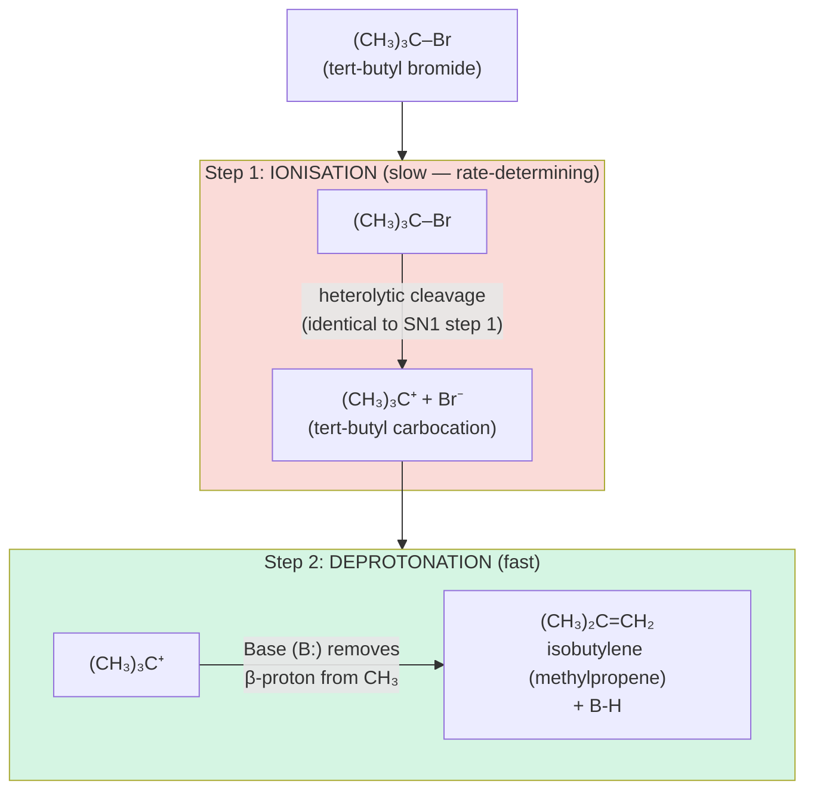
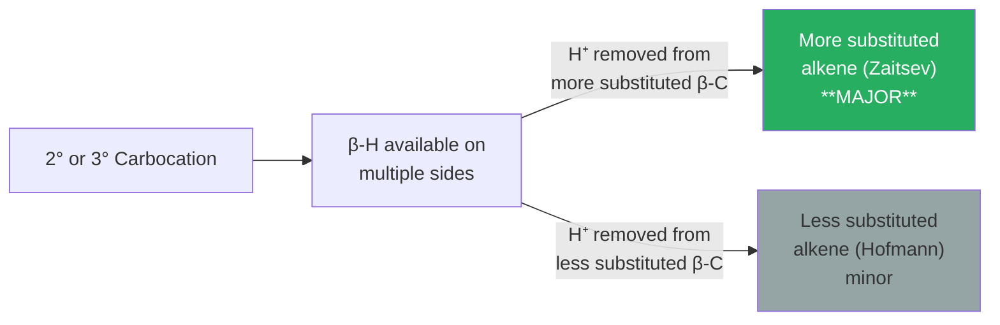
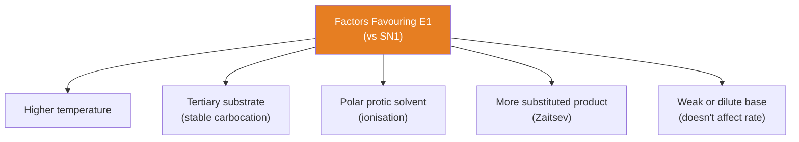
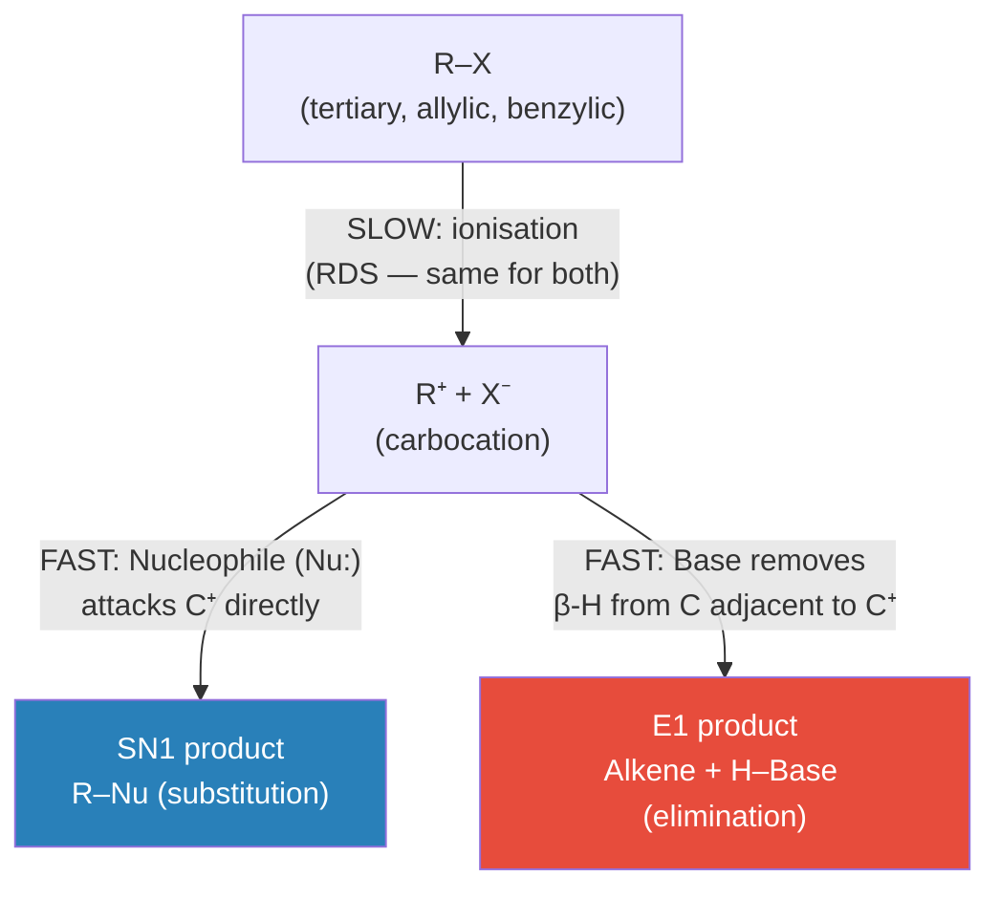

# 🔥 CHEM-103 — Module 11, Topic 08: E1 Reactions

**[🔗 Back to Module 11 README](README.md)** · **[🔗 Back to CHEM-103](../)**


**Navigation:** [← 07 SN2 Reactions](07_sn2.md) · [→ 09 E2 Reactions](09_e2.md)

---

## 📋 Table of Contents

1. [Definition and Overview](#1-definition-and-overview)
2. [The E1 Mechanism](#2-the-e1-mechanism)
3. [Kinetics and Rate Law](#3-kinetics-and-rate-law)
4. [Energy Profile Diagram](#4-energy-profile-diagram)
5. [Zaitsev's Rule](#5-zaitsevs-rule)
6. [Stereochemistry of E1](#6-stereochemistry-of-e1)
7. [Factors Governing E1](#7-factors-governing-e1)
8. [Competition: E1 vs SN1](#8-competition-e1-vs-sn1)
9. [Rearrangements in E1](#9-rearrangements-in-e1)
10. [Evidence for E1](#10-evidence-for-e1)
11. [Solved Examples](#11-solved-examples)
12. [Practice Problems](#12-practice-problems)
13. [References](#13-references)

---

## 1. Definition and Overview

> **E1 (Elimination, Unimolecular):** A two-step elimination reaction in which the **rate-determining step** involves only the substrate (unimolecular ionisation to a **carbocation**), followed by removal of a β-proton by a base in a fast second step, generating an **alkene**.

The "E" stands for **Elimination** and "1" indicates **unimolecular** (first-order kinetics).

| Attribute | Detail |
|:----------|:-------|
| Steps | 2 (stepwise) |
| Molecularity (RDS) | Unimolecular |
| Rate law | Rate = k[R-X] |
| Intermediate | Carbocation (same as SN1) |
| Product | Alkene |
| Substrate preference | 3° > 2° >> 1° |
| Regiochemistry | Zaitsev's rule (more substituted alkene favoured) |
| Stereochemistry | Non-stereospecific (mixture of E/Z) |
| Competing reaction | SN1 |

---

## 2. The E1 Mechanism

### 2.1 Step-by-Step

**Reaction:** (CH₃)₃C–Br + weak base → (CH₃)₂C=CH₂ + HBr



### 2.2 Identification of α and β Carbons

```
         β       α
   CH₃ - C  ---  C - Br       ← leaving group on α-carbon
         |       |
         H       (CH₃)₂
   
   E1: base removes H from β-carbon
       C–H(β) breaks, C–C(α-β) becomes a double bond
       C–X(α) breaks (already in Step 1)
```

In E1, **Step 1 (ionisation) is the same as SN1**. The reaction diverges after the carbocation forms:
- **SN1:** nucleophile attacks C⁺ directly
- **E1:** base abstracts a β-H, forming the alkene

---

## 3. Kinetics and Rate Law

Since **only the substrate** appears in the rate-determining step (ionisation):

$$\boxed{\text{Rate} = k[\text{R-X}]}$$

**First-order overall** — identical in form to the SN1 rate law.

> **Key:** The concentration of the base does **not** appear in the E1 rate law. This distinguishes E1 from E2, where Rate = k[R-X][Base].

### 3.1 Half-Life

$$t_{1/2} = \frac{\ln 2}{k} = \frac{0.693}{k}$$

Independent of initial concentration (characteristic of first-order processes).

---

## 4. Energy Profile Diagram

E1 has **two transition states** and **one intermediate** (the carbocation) — same profile as SN1:

```
         TS1                  TS2
          ‡                    ‡
         /\                   /\
        /  \                 /  \
       /    \               /    \
Energy/      \             /      \
  |  /   +    \_________/          \
  | /  RX + B  Carbocation           \
  |/    (reactants) intermediate      \ Alkene + HB + X⁻ (products)
  +------- Reaction coordinate -------->

    |--Eₐ(1) (RDS)--|   |--Eₐ(2) (fast)--|
```

- TS1 is the highest energy point → rate-determining
- The carbocation intermediate is the same as in SN1
- TS2 involves proton transfer from β-C to base — much lower barrier

---

## 5. Zaitsev's Rule

> **Zaitsev's Rule (Saytzeff's Rule):** In elimination reactions, the **major product** is the **more substituted alkene** — the alkene that has the greater number of alkyl groups on the double bond carbons.

### 5.1 Basis: Thermodynamic Stability of Alkenes

More substituted alkenes are **more stable** due to:
1. **Hyperconjugation:** More σ(C–H) bonds adjacent to π bond donate electron density → stabilise π system
2. **σ–π interaction:** The alkyl groups stabilise the π electron cloud

**Stability order:**

$$\underbrace{\text{tetrasubstituted}}_{\text{most stable}} > \underbrace{\text{trisubstituted}}_{\text{}} > \underbrace{\text{disubstituted}}_{\text{}} > \underbrace{\text{monosubstituted}}_{\text{}} > \underbrace{\text{unsubstituted (ethylene)}}_{\text{least stable}}$$

### 5.2 Application of Zaitsev's Rule

**Example:** Elimination from 2-bromo-2-methylbutane

```
    CH₃                   CH₃             CH₃
    |                     |               |
CH₃-C-CH₂-CH₃    →    CH₃-C=CH-CH₃   +  CH₂=C-CH₂-CH₃
    |                  (2-methylbut-2-ene) (2-methylbut-1-ene)
    Br                  Zaitsev product    Hofmann product
                        (trisubstituted)   (disubstituted)
                        **major**          minor
```

The carbocation at C2 can lose H⁺ from C1 (methyl) or C3. Loss from C3 gives the more substituted alkene → **Zaitsev product** is major.



### 5.3 Why E1 Favours Zaitsev

In E1, the carbocation is formed first (Step 1). The proton removal (Step 2) is fast and reversible. The reaction follows **thermodynamic control** — the more stable (more substituted) alkene is the major product.

---

## 6. Stereochemistry of E1

E1 is **not stereospecific**. Because:

1. The carbocation intermediate is **flat (sp²)** — all memory of original stereochemistry is lost
2. Rotation around the C–C bond is free in the carbocation
3. The β-H can be removed in **any orientation** relative to the double bond forming

**Result:** E1 gives a **mixture of E and Z isomers** (when applicable), with the **more stable (usually E/trans)** alkene as the major component (thermodynamic product).

**Example:** Elimination from (R)- and (S)-2-bromobutane via E1 both give the same mixture of (E)- and (Z)-but-2-ene, with **E-but-2-ene predominating** (more stable, less steric interaction).

---

## 7. Factors Governing E1

### 7.1 Substrate Structure

E1 requires a stable carbocation:
$$\text{3°} \gg \text{2°} > \text{1°}\text{ (doesn't occur)}$$

- **Tertiary substrates** are best — form stable 3° carbocations
- **Benzylic and allylic** substrates also work well

### 7.2 Leaving Group

Good leaving groups accelerate ionisation (same as SN1):
$$\text{I}^- > \text{Br}^- > \text{Cl}^- > \text{F}^-$$

Tosylates and mesylates are also excellent.

### 7.3 Temperature

**Higher temperature strongly favours E1** over SN1:

- Elimination → produces **two molecules** from one: entropy gain (ΔS > 0)
- Substitution → one molecule from one: no entropy gain (ΔS ≈ 0)
- At high T: the TΔS term in ΔG = ΔH − TΔS becomes dominant → elimination is more thermodynamically favoured

> **Rule of thumb:** Low temperature → SN1. High temperature → E1.

### 7.4 Solvent

Same as SN1: **polar protic** solvents (H₂O, ROH) stabilise the carbocation in the ionisation step.

### 7.5 Base/Nucleophile

In E1, the base participates only in the **fast** step 2 → its strength does **not** affect the rate. However:
- A **weak base** (H₂O, ROH) cannot force E2 → allows E1 to operate
- A **strong base** (OH⁻, RO⁻, R₂N⁻) with the right substrate may switch to E2



---

## 8. Competition: E1 vs SN1

Both E1 and SN1 **share the same rate-determining step** (ionisation of R–X → carbocation + X⁻). They differ in what happens to the carbocation:



| Condition | Favours SN1 | Favours E1 |
|:----------|:-----------:|:----------:|
| Temperature | **Lower** | **Higher** |
| Base strength | Weak nucleophile | Strong base |
| Substrate | Stable carbocation | Stable carbocation (same) |
| Product type | Substitution (R-Nu) | Alkene |
| Entropy | ΔS ≈ 0 | **ΔS > 0** (2 molecules formed) |

**Practical consequence:** When treating a 3° alkyl halide with hot ethanol (high T) vs cold water (low T, good nucleophile), you get predominantly elimination (E1) or substitution (SN1) respectively.

---

## 9. Rearrangements in E1

Since E1 goes through a carbocation intermediate, **1,2-shifts** can occur (as in SN1):

**Example:** Acid-catalysed dehydration of 3,3-dimethylbutan-2-ol

```
         OH                        
         |  H⁺                     
(CH₃)₃C-CH-CH₃ → 3° cation first expected, but...

Step 1: Protonation of OH → H₂O leaves → 2° carbocation at C2:
(CH₃)₃C–⁺CH–CH₃

Step 2: 1,2-Methyl shift → 3° carbocation at C3:
(CH₃)₂⁺C–CH(CH₃)₂

Step 3: E1 (loss of β-H) → 2,3-dimethylbut-2-ene (Zaitsev, major)
```

Rearranged alkene products are a diagnostic sign of a carbocation (E1) mechanism.

---

## 10. Evidence for E1

| Evidence | Observation | Implication |
|:---------|:------------|:------------|
| **Rate law** | Rate = k[R-X]; first order, independent of [Base] | Only substrate in RDS |
| **Rearrangements** | Alkene skeleton rearranged relative to substrate | Free carbocation intermediate |
| **Zaitsev product** | More substituted alkene is major product | Thermodynamic control via carbocation |
| **E/Z mixture** | Both E and Z alkenes formed | No stereochemical constraint in step 2 |
| **Substrate effects** | 3° >> 2°; no reaction for 1° | Requires stable carbocation |
| **Solvent effects** | More polar solvent → faster | Ion stabilisation in RDS |
| **Common ion effect** | Added X⁻ slows the reaction | Ionisation equilibrium pushed back |

---

## 11. Solved Examples

### Example 1: Predict E1 Products

**Q:** 2-Bromo-2-methylbutane is heated with ethanol. Write the E1 mechanism and predict the major product.

**Substrate:** CH₃C(CH₃)(Br)CH₂CH₃

**Step 1:** Ionisation
$$\text{CH}_3\text{C(CH}_3\text{)(Br)CH}_2\text{CH}_3 \xrightarrow{\Delta,\;\text{EtOH}} \text{CH}_3\overset{+}{\text{C}}\text{(CH}_3\text{)CH}_2\text{CH}_3 + \text{Br}^-$$
(3° carbocation)

**Step 2:** Loss of β-H (Zaitsev)

Two β-H sources:
- C1 (–CH₃): removing H gives **2-methylbut-1-ene** (disubstituted) — *minor*
- C3 (–CH₂–): removing H gives **2-methylbut-2-ene** (trisubstituted) — **major (Zaitsev)**

**Major product: (CH₃)₂C=CHCH₃ (2-methylbut-2-ene)**

### Example 2: Rate Law Test

**Q:** The rate of elimination from tert-amyl chloride in 80% ethanol/water is measured. Adding more water doubles the rate, but adding more pyridine (a base) has no effect. What mechanism operates?

**A:** 
- Rate independent of base [Py] → base does NOT appear in rate law
- Rate = k[substrate] → **E1 mechanism**
- More water → better solvation of developing carbocation in RDS → rate increases

### Example 3: E1 vs E2 Identification

**Q:** (CH₃)₃CBr is treated with (a) dilute NaOH/water at 50°C and (b) conc. NaOEt/EtOH at 50°C. Which gives E1 and which E2?

**A:**
- (a) Dilute NaOH/water: **weak base, polar protic solvent** → cannot force E2. Rate ∝ [substrate] only. → **E1 (and SN1)**
- (b) Conc. NaOEt/EtOH: **strong base, high concentration** → rate ∝ [substrate][base]. → **E2** (concerted mechanism — see Topic 09)

---

## 12. Practice Problems

1. Write the E1 mechanism for the dehydration of 2-methylpropan-2-ol with H₂SO₄/heat.
2. For 2-bromo-3-methylbutane, predict the E1 products and identify the Zaitsev product.
3. Why does E1 give a mixture of E and Z isomers, while E2 gives a specific stereochemical outcome?
4. 2-Methyl-3-phenyl-3-chlorobutane undergoes E1 in hot acetic acid. Predict the product, considering possible rearrangements.
5. Explain how increasing the temperature of an SN1/E1 competition shifts the product distribution toward the elimination product.
6. Why is 1-bromopropane essentially unreactive under E1 conditions?

---

## 13. References

1. **Clayden, J., Greeves, N., Warren, S.** — *Organic Chemistry*, 2nd ed., Oxford University Press, 2012 — Chapter 19 (Elimination reactions — E1 and E2)
2. **March, J.** — *Advanced Organic Chemistry*, 5th ed., Wiley, 2001 — Chapter 17 (Eliminations — E1 mechanism)
3. **Zaitsev, A.M.** — Original rule on preferential formation of more-substituted alkenes, *Liebigs Annalen*, 1875
4. **LibreTexts:** [E1 Elimination Reactions](https://chem.libretexts.org/Bookshelves/Organic_Chemistry/Organic_Chemistry_(OpenStax)/11%3A_Reactions_of_Alkyl_Halides-_Nucleophilic_Substitutions_and_Eliminations/11.07%3A_The_E1_Reaction) — Free, with energy diagrams
5. **Master Organic Chemistry:** [E1 Reactions](https://www.masterorganicchemistry.com/reaction-guide/e1-reactions/) — Zaitsev, rearrangements, E1 vs SN1
6. **ChemGuide:** [E1 and E2 Mechanisms](https://www.chemguide.co.uk/mechanisms/elim/e1ch.html)
7. **Khan Academy:** [Elimination reactions](https://www.khanacademy.org/science/organic-chemistry/substitution-elimination-reactions)

---

> 📖 *These notes are part of the [BUTEX Notes](https://github.com/itachi-re/butex-notes) repository — B.Sc. Textile Engineering, Fabric Engineering Dept. · CHEM-103 · Module 11*

**Navigation:** [← 07 SN2 Reactions](07_sn2.md) · [→ 09 E2 Reactions](09_e2.md)
