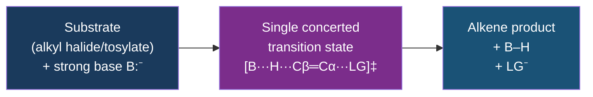
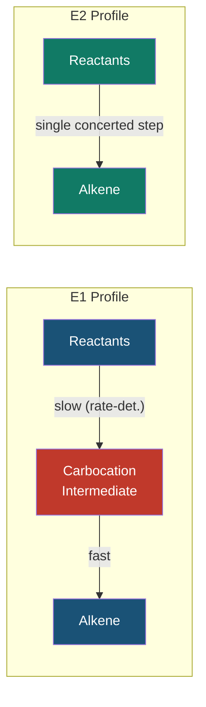
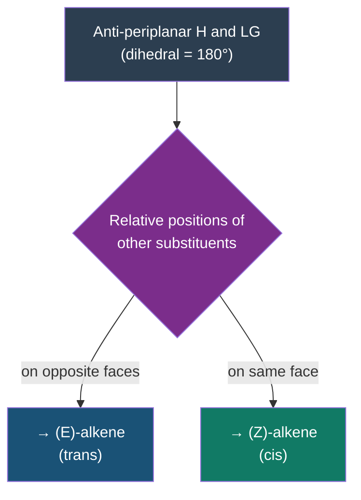
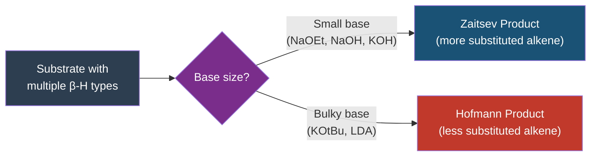
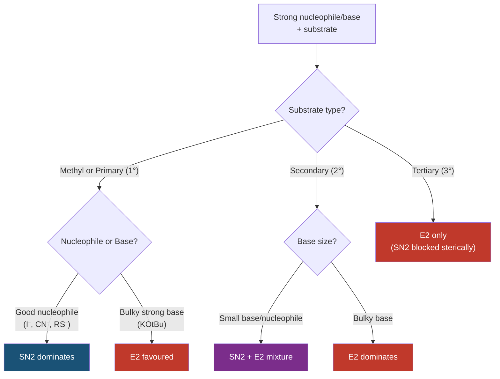

# 🔥 CHEM-103 — Module 11, Topic 09: E2 Reactions

**[🔗 Back to Module 11](README.md)** | **[⬅ Topic 08: E1 Reactions](08_e1.md)** | **[➡ Topic 10: Addition Reactions](10_addition_reactions.md)**


---

## 📋 Table of Contents

1. [Introduction & Definition](#1-introduction--definition)
2. [The E2 Mechanism — Step by Step](#2-the-e2-mechanism--step-by-step)
3. [Kinetics & Rate Law](#3-kinetics--rate-law)
4. [Energy Profile](#4-energy-profile)
5. [The Anti-Periplanar Requirement](#5-the-anti-periplanar-requirement)
6. [Stereochemistry of E2](#6-stereochemistry-of-e2)
7. [Regiochemistry — Zaitsev vs Hofmann](#7-regiochemistry--zaitsev-vs-hofmann)
8. [Substrate Effects](#8-substrate-effects)
9. [Base and Solvent Effects](#9-base-and-solvent-effects)
10. [Competition: E2 vs SN2](#10-competition-e2-vs-sn2)
11. [Comparison: E2 vs E1](#11-comparison-e2-vs-e1)
12. [Worked Examples](#12-worked-examples)
13. [Summary Table](#13-summary-table)
14. [References & Further Reading](#14-references--further-reading)

---

## 1. Introduction & Definition

### 1.1 What is E2?

**E2** stands for **Elimination, Bimolecular**. It is a one-step (concerted) elimination reaction in which a base simultaneously abstracts a β-hydrogen while the leaving group departs, forming an alkene via the collapse of a single transition state — with no intermediate carbocation.

> **IUPAC Definition:** An elimination reaction in which the rate-determining step involves two species — the substrate and the base — giving a second-order overall rate law.

The general transformation is:

```
       H   LG
       |   |
  ─── Cβ─ Cα ───    +   B:⁻     →    ─── Cβ═Cα ───   +   B─H  +  LG⁻
```

Where:
- **B:** = a **strong base** (the second reacting species)
- **LG** = a **leaving group** on the α-carbon (e.g., Br, Cl, OTs)
- **β-H** = a hydrogen on the carbon adjacent to the leaving group

### 1.2 The "2" in E2

The "2" signifies **bimolecular** — two molecules appear in the rate-determining step:

$$\text{Rate} = k[\text{substrate}][\text{base}]$$

This contrasts with E1 where only the substrate appears in the slow step.

---

## 2. The E2 Mechanism — Step by Step

### 2.1 The Concerted Single Step

Unlike E1, E2 has **no intermediate**. Bond breaking and bond forming happen simultaneously in a single, concerted step through one transition state.

```
           δ⁻      δ⁻
   B ─── H ─── Cβ ─── Cα ─── LG
         ↑           ↑
    H abstracted   LG expelled
         ←  π bond forms  →
```

**Three events occur simultaneously:**
1. B:⁻ abstracts the β-H (base–H bond **forms**)
2. The Cβ–H bond **breaks**
3. The Cα–LG bond **breaks**
4. The Cβ=Cα π bond **forms**

### 2.2 Arrow-Pushing Mechanism

```
              B:⁻
               ↓
         H          LG
         |           |
    ─ ─ Cβ  ─  ─  Cα ─ ─
              ↗
         (concerted)
```

Using curved arrows:

```
   B: ——→ H—Cβ—Cα—LG
              ↕       ↕
         [B—H + Cβ═Cα + LG⁻]
```

- Arrow 1: from lone pair of B to the β-H (forming B–H)
- Arrow 2: from the Cβ–H bond to form the π bond between Cβ and Cα
- Arrow 3: from the Cα–LG bond to LG (forming LG⁻)

### 2.3 Mechanism Flowchart



---

## 3. Kinetics & Rate Law

### 3.1 Rate Expression

$$\boxed{\text{Rate} = k_2 [\text{R-LG}][\text{B}^-]}$$

- **Second-order overall** (first order in substrate, first order in base)
- Doubling [substrate] → rate doubles
- Doubling [base] → rate doubles
- Doubling both → rate quadruples

### 3.2 Kinetic Evidence

| Experiment | [Substrate] | [Base] | Observed Rate |
|:-----------|:------------|:-------|:--------------|
| 1 | 0.10 M | 0.10 M | $r$ |
| 2 | 0.20 M | 0.10 M | $2r$ |
| 3 | 0.10 M | 0.20 M | $2r$ |
| 4 | 0.20 M | 0.20 M | $4r$ |

This confirms **bimolecular** kinetics — the base concentration appears in the rate law.

### 3.3 Physical Interpretation

The concerted mechanism means the base must **collide productively** with the substrate for the reaction to proceed. The transition state involves both molecules, hence the bimolecular rate law.

---

## 4. Energy Profile

### 4.1 E2 Reaction Coordinate

```
 Energy
   │
   │              ‡
   │            ╱╲
   │           ╱  ╲
   │          ╱    ╲
   │         ╱      ╲
   │        ╱        ╲
   │───────╱          ╲──────
   │  Reactants           Products
   │  (substrate + B:⁻)   (alkene + BH + LG⁻)
   └─────────────────────────────────────────→
                 Reaction Coordinate
```

**Key features:**
- **One single energy barrier** (one transition state, ‡)
- **No intermediate** — the curve has no valley between reactants and products
- The $E_a$ is the energy of the single transition state relative to reactants

### 4.2 Comparison with E1



---

## 5. The Anti-Periplanar Requirement

This is the **most important geometric requirement** for E2 and what makes E2 **stereospecific**.

### 5.1 Definition

For E2 to occur, the β-H and the leaving group must be **anti-periplanar** — they must be in the same plane but on **opposite sides** of the Cβ–Cα bond, at a dihedral angle of **180°**.

```
        H   LG          ← these two must be 180° apart
        |   |
   ─ ─ Cβ─ Cα ─ ─
```

**Dihedral angle requirement: φ(H–Cβ–Cα–LG) = 180°**

### 5.2 Why Anti-Periplanar?

For the π bond to form during the concerted step, the p orbitals that will become the π bond must begin to overlap. The p orbital geometry is only achieved when the breaking C–H bond and breaking C–LG bond are **anti** (180° dihedral):

```
Newman projection — anti-periplanar:

    H                      H
    |       front C        |
    Cβ ──────────────── Cα
         back carbon
                 LG (180° from H)

    The four atoms H–Cβ–Cα–LG are coplanar
    with H and LG on opposite sides (anti)
```

### 5.3 Syn Periplanar (0°) — Less Common

The syn-periplanar arrangement (H and LG eclipsed, 0°) can also give E2 but requires higher energy and is geometrically strained. Anti-periplanar is overwhelmingly preferred.

### 5.4 Newman Projections — Reactive vs Unreactive Conformations

For 2-bromobutane reacting with KOH:

**Reactive conformation (H and Br anti, 180°):**

```
Newman projection (looking along C2–C3):

        H                H
       / \              /
  CH₃   CH₃     →   CH₃─CH═CH─CH₃ (trans-but-2-ene)
       |
       Br (back, 180° from H)
```

**Unreactive conformation (gauche, ~60°):**

```
        H
       / \
  CH₃   CH₃   ← Br is NOT anti to any β-H → no E2 possible from this conformation
         |
         Br
```

---

## 6. Stereochemistry of E2

E2 is **stereospecific**: the geometry of the starting material determines the geometry of the alkene product.

### 6.1 The Rule

- **Anti-periplanar elimination** → H and LG are on opposite faces of the Cβ–Cα bond
- The two remaining substituents on Cβ and Cα end up on the **same side** of the new π bond (if they were on the same face) or **opposite sides** (if on opposite faces)

### 6.2 Case Study: meso- vs (±)-2,3-Dibromobutane

This is the classic proof of the anti-periplanar requirement.

**Reaction:** R–CH(Br)–CH(Br)–R + EtO⁻ → alkene + Br⁻

#### Substrate A: *meso*-2,3-dibromobutane

```
Anti-periplanar conformation (Newman along C2–C3):

      CH₃                 Br (back, anti to H)
       |                  |
       C₂                 C₃
      / \                / \
     H   Br         CH₃    H
        ↑
    anti to Br on C₃

Product: (E)-but-2-ene (trans)

  CH₃     CH₃
     ╲   ╱
      C═C
     ╱   ╲
    H     H         ← methyl groups trans (E)
```

#### Substrate B: (±)-2,3-dibromobutane (racemic mixture)

```
Anti-periplanar conformation:

      CH₃              CH₃ (anti to H, on same side as CH₃)
       |                |
       C₂               C₃
      / \              / \
     H   Br        Br    H

Product: (Z)-but-2-ene (cis)

  CH₃     H
     ╲   ╱
      C═C
     ╱   ╲
    H     CH₃        ← methyl groups cis (Z)
```

**The result:**
| Starting Material | Product |
|:------------------|:--------|
| *meso*-2,3-dibromobutane | only **(E)-but-2-ene** |
| (±)-2,3-dibromobutane | only **(Z)-but-2-ene** |

This clean stereospecificity proves the anti-periplanar mechanism. If the mechanism were stepwise (via free rotation), both isomers would give a mixture.

### 6.3 Summary of E2 Stereospecificity



---

## 7. Regiochemistry — Zaitsev vs Hofmann

When the substrate has more than one type of β-hydrogen, two different alkenes can form. The **regiochemistry** depends on the size of the base.

### 7.1 Zaitsev's Rule

> With a **small, strong base**, E2 preferentially removes the β-H from the carbon bearing **more substituents**, giving the **more substituted (more stable) alkene**.

This is the thermodynamic product — the more substituted alkene is stabilized by hyperconjugation and has a lower energy.

**Example:** 2-Bromobutane + KOH/EtOH

```
        Hβ₁  Hβ₂
         |    |
  CH₃ ─ C ─ C ─ CH₂CH₃
        |    |
        Br   H

Two possible β-H removals:
  1) Remove Hβ₁ (from C1) → but-1-ene (less substituted, monosubstituted)
  2) Remove Hβ₂ (from C3) → but-2-ene (more substituted, disubstituted)  ← MAJOR (Zaitsev)
```

**Zaitsev product:** but-2-ene (more substituted, ~80%)
**Hofmann product:** but-1-ene (less substituted, ~20%)

### 7.2 Hofmann's Rule

> With a **large (bulky) base**, E2 preferentially removes the β-H from the **least substituted** carbon (less hindered), giving the **less substituted alkene**.

Classic bulky bases:
- Potassium *tert*-butoxide (KO*t*Bu, *t*-BuOK)
- 2,6-Lutidine
- Lithium diisopropylamide (LDA) — extreme bulk

**Example:** 2-Bromobutane + KO*t*Bu/*t*-BuOH

```
  CH₃CH₂─CH─CH₃
            |
            Br

Bulky base cannot access the more hindered internal β-H easily
→ Attacks terminal (less hindered) β-H

Major product: but-1-ene (Hofmann, less substituted)  ~75%
Minor product: but-2-ene (Zaitsev)  ~25%
```

### 7.3 Zaitsev vs Hofmann Summary



| Feature | Zaitsev (small base) | Hofmann (bulky base) |
|:--------|:---------------------|:---------------------|
| Base | KOH, NaOEt | KO*t*Bu, LDA |
| Product | More substituted alkene | Less substituted alkene |
| Control | Thermodynamic stability | Steric accessibility |
| Stability | More stable (higher Tc) | Less stable |
| Example | KOH/EtOH | KOtBu/tBuOH |

### 7.4 Stability Trend for Alkenes

$$\text{Tetrasubstituted} > \text{Trisubstituted} > \text{Disubstituted} > \text{Monosubstituted} > \text{Ethylene}$$

This is because each additional alkyl group donates electron density to the π system via hyperconjugation, lowering the energy of the HOMO.

---

## 8. Substrate Effects

### 8.1 Substrate Classes and E2 Reactivity

| Substrate | E2 Rate | Notes |
|:----------|:--------|:------|
| Methyl (CH₃–LG) | No β-H → **impossible** | Cannot undergo elimination |
| Primary (1°) R–CH₂–LG | Slow | β-H available; but SN2 usually dominates |
| Secondary (2°) R₂CH–LG | Moderate | E2 competes with SN2 |
| Tertiary (3°) R₃C–LG | **Fast** | No SN2 possible (steric); E2 strongly favoured |

### 8.2 Why Tertiary Substrates Favour E2

1. **Three sets of β-H** available (more chances for anti-periplanar geometry)
2. More substituted intermediate alkene is more stable (Zaitsev)
3. Backside approach for SN2 is blocked by the three alkyl groups

### 8.3 Leaving Group Effects

Better leaving groups give faster E2:

$$\text{I}^- > \text{Br}^- > \text{Cl}^- > \text{F}^- \qquad \text{(leaving group ability)}$$
$$\text{OTs}^- > \text{OMs}^- > \text{I}^- \qquad \text{(activated esters)}$$

### 8.4 Cyclic Substrates — Geometric Constraint

In cyclic systems, the anti-periplanar requirement is particularly restrictive. Only the **diaxial** conformation in cyclohexane allows E2.

**Example:** *trans*-4-*tert*-butylcyclohexyl bromide

```
Cyclohexane chair — the bulky tBu group locks the ring
with tBu equatorial.

  If Br is axial → a β-H must also be axial (anti-periplanar) → E2 occurs
  If Br is equatorial → no β-H is anti-periplanar → E2 impossible

tBu locks: Br axial in trans isomer → E2 fast
           Br equatorial in cis isomer  → E2 very slow
```

---

## 9. Base and Solvent Effects

### 9.1 Base Strength

E2 requires a **strong base** because:
- The β-H in a saturated C–H bond is not very acidic (pKa ~50)
- A weak base cannot abstract it effectively
- The concerted mechanism demands the base be present in the transition state

**Common E2 bases:**
- NaOH or KOH in ethanol (moderate — often gives Zaitsev)
- NaOEt (sodium ethoxide) in ethanol — strong
- KO*t*Bu (potassium *tert*-butoxide) in *t*-BuOH — very strong and bulky → Hofmann
- LDA (lithium diisopropylamide) in THF — very strong and bulky, irreversible

### 9.2 Base Concentration

High base concentration favours E2 over SN1/E1 because:
- E2 rate ∝ [base] (appears in rate law)
- E1 rate is independent of [base] (only substrate in rate law)

$$\text{High [B}^-\text{]} \Rightarrow k_2[\text{R-LG}][\text{B}^-] \gg k_1[\text{R-LG}]$$

### 9.3 Solvent Effects

| Solvent | Polarity | Effect on E2 |
|:--------|:---------|:-------------|
| Polar protic (EtOH, H₂O) | High | Moderate E2; tends to favour SN2 for 1°/2° |
| Polar aprotic (DMSO, DMF) | High | Favours SN2 strongly for 1°; E2 possible for 2°/3° |
| Non-polar (toluene, THF) | Low | Enhances basicity of base → E2 more likely |

> **Key principle:** Polar aprotic solvents make nucleophiles/bases "naked" and more reactive. For bulky bases like KO*t*Bu in *t*-BuOH (weakly polar protic), E2 is strongly favoured.

### 9.4 Temperature

Higher temperature always favours elimination over substitution:

- Elimination has a **higher Eₐ** than substitution
- At high temperature, the system has enough energy to overcome the larger barrier
- **Entropy** favours elimination (one molecule → three fragments)

$$\Delta G = \Delta H - T\Delta S \quad \Rightarrow \quad \text{high } T \text{ makes } T\Delta S \text{ term larger → favours higher } \Delta S$$

---

## 10. Competition: E2 vs SN2

Both E2 and SN2 are bimolecular reactions with strong nucleophile/base. They compete constantly.



### 10.1 Decision Factors

| Factor | Favours SN2 | Favours E2 |
|:-------|:------------|:-----------|
| Substrate | 1° < 2° ≪ 3° (steric) | 3° > 2° > 1° |
| Base/Nucleophile | Strong nucleophile (CN⁻, I⁻, RS⁻) | Strong bulky base (KO*t*Bu) |
| Temperature | Low | High |
| Solvent | Polar aprotic | Polar aprotic (but base is key) |
| Base concentration | Low | High |

### 10.2 The "Nucleophile vs Base" Distinction

A strong **nucleophile** attacks carbon (C–LG bond attacked from back) → SN2.
A strong **base** attacks hydrogen (C–H bond β-position) → E2.

Bulky reagents cannot fit near a carbon surrounded by groups → they attack the exposed H instead. Hence KO*t*Bu is a base (E2 promoter) even though it is as strong as NaOEt.

---

## 11. Comparison: E2 vs E1

| Feature | **E2** | **E1** |
|:--------|:-------|:-------|
| **Steps** | One (concerted) | Two (stepwise) |
| **Intermediate** | None | Carbocation |
| **Rate law** | $k[\text{R-LG}][\text{B}^-]$ | $k[\text{R-LG}]$ |
| **Base** | Required (strong) | Not required (weak base OK) |
| **Substrate** | 1°, 2°, 3° | 2° or 3° (must form stable C⁺) |
| **Temperature** | Room temp or above | Usually high T |
| **Solvent** | Polar protic/aprotic | Polar protic |
| **Stereochemistry** | Stereospecific (anti) | Non-stereospecific (mix) |
| **Regiochemistry** | Zaitsev or Hofmann | Zaitsev (most stable C⁺) |
| **Rearrangements** | **No** | Yes (hydride/methyl shifts) |

---

## 12. Worked Examples

### Example 12.1 — Predict the major product

**Substrate:** 2-Bromo-2-methylpropane (*tert*-butyl bromide) + KOH/EtOH

```
     CH₃
      |
 CH₃─C─Br  +  KOH  →  ?
      |
     CH₃
```

**Analysis:**
- Tertiary substrate → SN2 impossible (steric)
- Strong base KOH present → E2 favoured
- Only one type of β-H (all 9 H are equivalent)
- Product: 2-methylpropene (isobutylene)

$$\text{(CH}_3)_3\text{CBr} + \text{KOH} \xrightarrow{\text{EtOH}, \Delta} \text{CH}_2\text{=C(CH}_3)_2 + \text{KBr} + \text{H}_2\text{O}$$

---

### Example 12.2 — Zaitsev vs Hofmann

**Substrate:** 2-Bromopentane

**With NaOEt (small base):**

```
CH₃CH₂CH₂─CH─CH₃
              |
              Br

β-H at C1: → pent-1-ene (monosubstituted) — minor
β-H at C3: → pent-2-ene (disubstituted)   — MAJOR (Zaitsev)
```

**With KO*t*Bu (bulky base):**

```
β-H at C1 (less hindered, terminal): → pent-1-ene — MAJOR (Hofmann)
β-H at C3 (more hindered, internal): → pent-2-ene — minor
```

---

### Example 12.3 — Stereospecificity Demonstration

**Substrate:** (*2R,3S*)-2-bromo-3-methylbutane + KO*t*Bu (strong, bulky base)

In the anti-periplanar conformation, the base removes the β-H that is 180° from the Br leaving group. The product alkene geometry is **fixed** by the starting material's stereochemistry.

*(Full Newman projection analysis would show only one alkene stereoisomer forms.)*

---

### Example 12.4 — Rate Law Verification

**Given:** Rate = 3.5 × 10⁻³ M s⁻¹ when [substrate] = 0.05 M and [KOH] = 0.10 M

Find: The rate constant k₂

$$k_2 = \frac{\text{Rate}}{[\text{substrate}][\text{base}]} = \frac{3.5 \times 10^{-3}}{(0.05)(0.10)} = \frac{3.5 \times 10^{-3}}{5 \times 10^{-3}} = 0.70 \text{ M}^{-1}\text{s}^{-1}$$

---

## 13. Summary Table

| Aspect | Detail |
|:-------|:-------|
| **Mechanism** | Concerted one-step, no intermediate |
| **Molecularity** | Bimolecular (substrate + base) |
| **Rate law** | Rate = k₂[R-LG][B⁻] |
| **Order** | 2nd overall (1st in each reactant) |
| **Geometry** | Anti-periplanar β-H and LG required |
| **Stereochemistry** | Stereospecific (anti-addition → specific alkene geometry) |
| **Regiochemistry** | Zaitsev (small base) or Hofmann (bulky base) |
| **Rearrangements** | None |
| **Substrate preference** | Tertiary > Secondary > Primary |
| **Best base** | Strong and bulky: KO*t*Bu for Hofmann; KOH/NaOEt for Zaitsev |
| **Solvent** | Polar protic or polar aprotic |
| **Temperature** | Any; higher T helps |
| **Competes with** | SN2 (bimolecular substrates with strong nucleophile/base) |

---

## 14. References & Further Reading

1. **Clayden, J., Greeves, N., Warren, S.** — *Organic Chemistry*, 2nd ed., Oxford University Press, 2012 — Chapter 19: Elimination reactions (pp. 467–492). The definitive treatment of E2 stereochemistry.

2. **Kürti, L., Czakó, B.** — *Strategic Applications of Named Reactions in Organic Synthesis*, Elsevier, 2005.

3. **LibreTexts — E2 Reactions:**
   [https://chem.libretexts.org/Bookshelves/Organic_Chemistry/Organic_Chemistry_(McMurry)/11%3A_Reactions_of_Alkyl_Halides-_Nucleophilic_Substitutions_and_Eliminations/11.10%3A_E2_Reactions](https://chem.libretexts.org/Bookshelves/Organic_Chemistry/Organic_Chemistry_(McMurry)/11%3A_Reactions_of_Alkyl_Halides-_Nucleophilic_Substitutions_and_Eliminations/11.10%3A_E2_Reactions)

4. **ChemGuide — Elimination Reactions:**
   [https://www.chemguide.co.uk/mechanisms/elim/whatis.html](https://www.chemguide.co.uk/mechanisms/elim/whatis.html)

5. **Master Organic Chemistry — E2 Explained:**
   [https://www.masterorganicchemistry.com/2012/08/27/the-e2-reaction/](https://www.masterorganicchemistry.com/2012/08/27/the-e2-reaction/)

6. **Khan Academy — Elimination Reactions:**
   [https://www.khanacademy.org/science/organic-chemistry/substitution-elimination-reactions](https://www.khanacademy.org/science/organic-chemistry/substitution-elimination-reactions)

7. **IUPAC Gold Book — E2 mechanism:**
   [https://goldbook.iupac.org/terms/view/E02048](https://goldbook.iupac.org/terms/view/E02048)

8. **Mechanism animations (CurlyArrows):**
   [https://curlyarrows.com/e2-elimination/](https://curlyarrows.com/e2-elimination/)

---

<div align="center">

**[⬆ Back to Module 11 README](README.md)** · **[⬅ E1 Reactions](08_e1.md)** · **[➡ Addition Reactions](10_addition_reactions.md)**

---

> 📖 *These notes are part of the [BUTEX Notes](https://github.com/itachi-re/butex-notes) repository — B.Sc. Textile Engineering, Fabric Engineering Dept. · CHEM-103*

</div>
