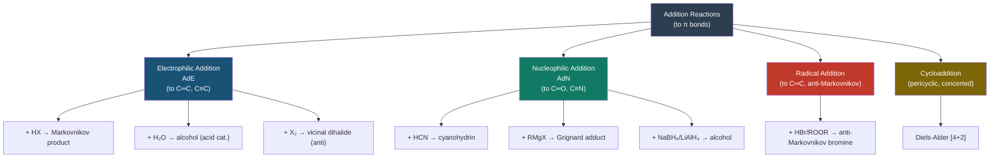
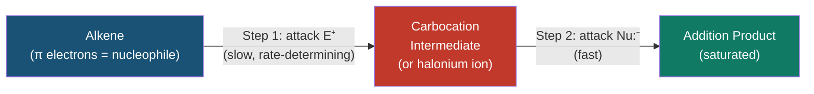
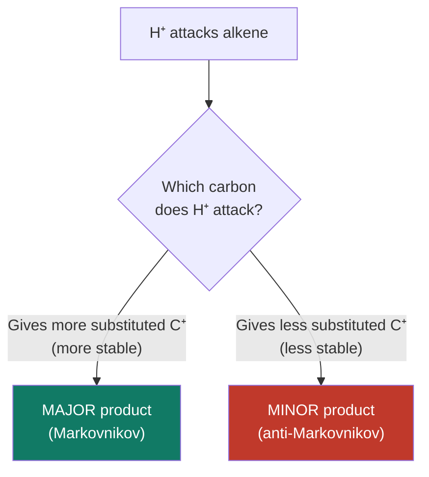
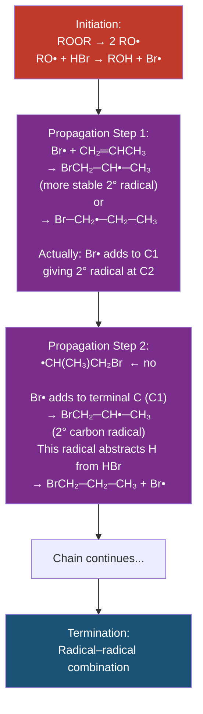
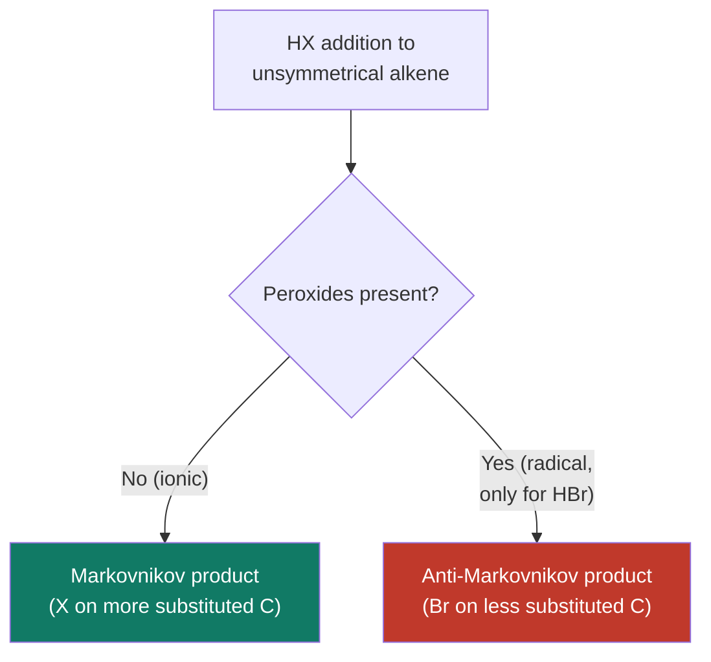
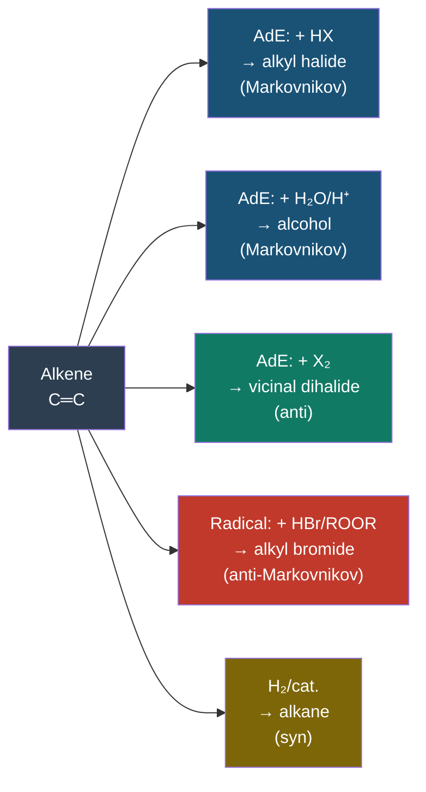

# ➕ CHEM-103 — Module 11, Topic 10: Addition Reactions

**[🔗 Back to Module 11](README.md)** | **[⬅ Topic 09: E2 Reactions](09_e2.md)**


---

## 📋 Table of Contents

1. [Introduction — The π Bond as a Nucleophile](#1-introduction--the-π-bond-as-a-nucleophile)
2. [Classification of Addition Reactions](#2-classification-of-addition-reactions)
3. [Electrophilic Addition (AdE)](#3-electrophilic-addition-ade)
   - 3.1 Mechanism Overview
   - 3.2 Addition of HX (Hydrogen Halides)
   - 3.3 Markovnikov's Rule — Statement and Electronic Basis
   - 3.4 Acid-Catalysed Hydration (Addition of H₂O)
   - 3.5 Addition of Halogens (X₂)
4. [Nucleophilic Addition (AdN)](#4-nucleophilic-addition-adn)
   - 4.1 Carbonyl Group as Electrophile
   - 4.2 Addition of HCN (Cyanohydrin Formation)
   - 4.3 Grignard Reaction
   - 4.4 Reduction by NaBH₄/LiAlH₄
5. [Radical Addition (Anti-Markovnikov)](#5-radical-addition-anti-markovnikov)
   - 5.1 Mechanism
   - 5.2 Peroxide Effect (Kharasch Effect)
6. [Catalytic Hydrogenation](#6-catalytic-hydrogenation)
7. [Syn vs Anti Addition — Stereochemistry](#7-syn-vs-anti-addition--stereochemistry)
8. [Markovnikov's Rule — Summary and Exceptions](#8-markovnikovs-rule--summary-and-exceptions)
9. [Comparing All Four Addition Types](#9-comparing-all-four-addition-types)
10. [Worked Examples](#10-worked-examples)
11. [Summary Table](#11-summary-table)
12. [References & Further Reading](#12-references--further-reading)

---

## 1. Introduction — The π Bond as a Nucleophile

Addition reactions are the **characteristic reactions of unsaturated compounds** — molecules containing C=C, C=O, C≡C, or C=N bonds. The π bond is the reactive site.

### 1.1 Why the π Bond is Reactive

A π bond consists of electrons **above and below** the σ-bond axis in a *p*–*p* overlap. These electrons are:
- **Exposed** — not shielded by the σ-bond framework
- **High in energy** (HOMO of the molecule)
- **Nucleophilic** — they can donate to electrophiles

```
    C═C    ← π electrons are exposed above and below the bond axis
    
    HOMO of alkene: the π-bonding MO
    LUMO of electrophile: the σ* of E–X or empty p-orbital
    
    → π electrons attack the electrophile → π bond opens → addition occurs
```

### 1.2 General Equation

$$\underset{\text{unsaturated}}{\text{A}=\text{B}} + \text{X}─\text{Y} \xrightarrow{\text{catalyst (if needed)}} \underset{\text{saturated}}{\text{A(X)─B(Y)}}$$

The π bond is **broken** and two new σ bonds form. The degree of unsaturation decreases by 1.

### 1.3 Where Addition Reactions Occur

| Functional Group | Reactive π Bond | Type of Electrophile |
|:----------------|:----------------|:---------------------|
| Alkene (C=C) | C=C π bond | Electrophilic addition |
| Alkyne (C≡C) | C≡C π bonds (two) | Electrophilic addition |
| Carbonyl (C=O) | C=O π bond | Nucleophilic addition |
| Imine (C=N) | C=N π bond | Nucleophilic addition |

---

## 2. Classification of Addition Reactions



---

## 3. Electrophilic Addition (AdE)

### 3.1 Mechanism Overview

In electrophilic addition, the alkene's π electrons act as a **nucleophile** attacking an **electrophile** (E⁺). The process generates a **carbocation intermediate** (or bridged halonium ion), which is then attacked by a **nucleophile** in the second step.



**Two-step mechanism, ionic:**

```
Step 1 (slow):    C═C  +  E⁺  →  [C─C⁺]  (carbocation)
                         ↑
               (Electrophile attacks the π bond)

Step 2 (fast):   [C─C⁺]  +  Nu:⁻  →  C─C  (product)
                              ↑
                      (Nucleophile attacks C⁺)
```

---

### 3.2 Addition of HX (Hydrogen Halides)

The most fundamental electrophilic addition. HX (HCl, HBr, HI) adds across C=C.

**General equation:**

$$\text{CH}_2\text{=CH}_2 + \text{HBr} \xrightarrow{} \text{CH}_3\text{─CH}_2\text{─Br}$$

**For an unsymmetrical alkene (e.g., propene + HBr):**

$$\text{CH}_3\text{─CH=CH}_2 + \text{HBr} \xrightarrow{} \text{CH}_3\text{─CHBr─CH}_3 \quad \text{(major, Markovnikov)}$$

$$\text{NOT:} \quad \text{CH}_3\text{─CH₂─CH}_2\text{Br} \quad \text{(minor, anti-Markovnikov)}$$

**Mechanism for propene + HBr:**

```
Step 1: H─Br is polarised as H^δ⁺─Br^δ⁻
        The π electrons of propene attack the H⁺

        CH₃─CH═CH₂  +  H⁺  →  CH₃─CH⁺─CH₃  (2° carbocation, MAJOR)
                                OR
                                CH₃─CH₂─CH₂⁺  (1° carbocation, minor)

Step 2: Br⁻ attacks the more stable (2°) carbocation

        CH₃─CH⁺─CH₃  +  Br⁻  →  CH₃─CHBr─CH₃  (2-bromopropane, major)
```

The regioselectivity is explained by **Markovnikov's Rule** (see Section 3.3).

**Reactivity order of HX:**

$$\text{HI} > \text{HBr} > \text{HCl} > \text{HF} \quad \text{(acid strength = electrophilicity of H⁺)}$$

---

### 3.3 Markovnikov's Rule — Statement and Electronic Basis

#### Original Statement (1870, Vladimir Markovnikov):

> In the addition of HX to an unsymmetrical alkene, the **hydrogen** adds to the carbon that already has **more hydrogen atoms** attached to it, and the **halogen** adds to the carbon with fewer hydrogens.

#### Modern Electronic Interpretation:

> In the addition of HX to an unsymmetrical alkene, addition proceeds to give the **more stable carbocation intermediate** — i.e., H⁺ adds to give the **more substituted carbocation**.

**Why the more substituted carbocation is preferred:**

More alkyl groups attached to C⁺ → greater **hyperconjugation** and **inductive electron-donation** → C⁺ is more stable → lower energy transition state (Hammond Postulate) → faster formation.

```
For propene + H⁺:

  Pathway A: H⁺ adds to C1 → CH₃─CH⁺─CH₃  (2° carbocation, more stable) ✓
  Pathway B: H⁺ adds to C2 → CH₃─CH₂─CH₂⁺ (1° carbocation, less stable) ✗

  Stability:  3° > 2° > 1° > methyl carbocations
```

#### Markovnikov's Rule (Carbocation Stability Version):

$$\boxed{H^+ \text{ adds to the alkene carbon that gives the MORE STABLE carbocation intermediate}}$$

#### Visual Summary:



---

### 3.4 Acid-Catalysed Hydration (Addition of H₂O)

Water adds to alkenes in the presence of a strong acid catalyst (usually H₂SO₄ or H₃PO₄).

**General equation:**

$$\text{C=C} + \text{H}_2\text{O} \xrightarrow{\text{H}^+} \text{C(OH)─C(H)}$$

**Mechanism for propene + H₂O/H⁺:**

```
Step 1:  CH₃─CH═CH₂ + H⁺ → CH₃─CH⁺─CH₃  (Markovnikov, 2° C⁺)

Step 2:  CH₃─CH⁺─CH₃ + H₂O → CH₃─CH(OH₂⁺)─CH₃  (water attacks C⁺)

Step 3:  CH₃─CH(OH₂⁺)─CH₃ → CH₃─CH(OH)─CH₃ + H⁺  (deprotonation)
```

**Overall:**

$$\text{CH}_3\text{─CH=CH}_2 \xrightarrow{\text{H}_2\text{O/H}^+} \text{CH}_3\text{─CH(OH)─CH}_3 \quad \text{(propan-2-ol, major)}$$

The product follows Markovnikov's rule: –OH goes to the more substituted carbon.

**Conditions:** Dilute H₂SO₄ (50–60%), room to moderate temperature. This is an equilibrium; excess water and high temperature drives forward; dehydration is the reverse.

---

### 3.5 Addition of Halogens (X₂)

Molecular halogens (Cl₂, Br₂) add across C=C in an **anti** fashion, forming vicinal dihalides.

**General equation:**

$$\text{CH}_2\text{=CH}_2 + \text{Br}_2 \xrightarrow{\text{CCl}_4} \text{CH}_2\text{Br─CH}_2\text{Br} \quad \text{(1,2-dibromoethane)}$$

**Mechanism — via halonium (bridged) ion:**

```
Step 1:  Br₂ approaches alkene from one face
         π electrons attack Br, displacing Br⁻

         C═C  +  Br─Br  →  cyclic bromonium ion  +  Br⁻
                              ↑
                     (Br bridges both carbons)

     Bromonium ion:
           Br⁺
          /   \
         C ─── C   (three-membered ring, "bridge")

Step 2:  Br⁻ attacks the back of one carbon (SN2-like)
         Opens the bromonium ring from the OPPOSITE face

Result:  Anti addition — both Br atoms end up on opposite faces
```

**Bromine test for unsaturation:** Br₂/CCl₄ (orange/brown) decolourises rapidly with alkenes. Alkanes do not decolourise under these conditions.

**Stereochemistry of halogen addition:**

```
For cyclohexene + Br₂:

  Front-face bromonium ion → Br⁻ attacks back face
  → trans-1,2-dibromocyclohexane (anti addition, trans diaxial)
  
  NEVER cis-1,2-dibromocyclohexane from this mechanism
```

---

## 4. Nucleophilic Addition (AdN)

Nucleophilic addition is characteristic of **carbonyl compounds** (aldehydes, ketones). The carbonyl carbon is electrophilic due to the high electronegativity of oxygen.

### 4.1 Carbonyl Group as Electrophile

```
        δ⁺  δ⁻
         C═O         ← C is electrophilic (Nu: attacks C)
         ↑
    Nucleophile attacks here

The C=O π bond breaks heterolytically:
  O takes both electrons → forms O⁻ (alkoxide)
  C becomes bonded to Nu
```

**General mechanism:**

```
Step 1 (rate-det.):  Nu:⁻ + C═O → Nu─C─O⁻  (tetrahedral alkoxide intermediate)

Step 2 (fast):       Nu─C─O⁻ + H⁺ → Nu─C─OH  (protonation)
```

---

### 4.2 Addition of HCN — Cyanohydrin Formation

$$\underset{\text{aldehyde/ketone}}{R\text{─CHO}} + \text{HCN} \rightleftharpoons R\text{─CH(OH)─CN} \quad \text{(cyanohydrin)}$$

**Mechanism (base-catalysed):**

```
Step 1:  CN⁻ (nucleophile) attacks the δ⁺ carbonyl carbon

         R─C═O  +  CN⁻  →  R─C(CN)─O⁻  (alkoxide)

Step 2:  O⁻ is protonated by HCN (which regenerates CN⁻)

         R─C(CN)─O⁻  +  HCN  →  R─C(CN)─OH  +  CN⁻
```

**Practical importance:**
- Cyanohydrins can be hydrolysed to α-hydroxy acids
- Reduced to amino alcohols
- Key in bio-synthesis of amino acids (Strecker synthesis)

**Example:** Acetaldehyde + HCN

$$\text{CH}_3\text{CHO} + \text{HCN} \rightleftharpoons \text{CH}_3\text{─CH(OH)─CN} \quad \text{(lactonitrile, pKa ~ 9.6)}$$

---

### 4.3 Grignard Reaction (Nucleophilic Addition to Carbonyls)

Grignard reagents (R─MgX) are powerful carbon nucleophiles that add to carbonyls.

$$\underset{\text{Grignard}}{\text{R─MgX}} + \underset{\text{carbonyl}}{\text{R'─C═O}} \xrightarrow{\text{Et}_2\text{O}} \text{R─C(R')─O⁻MgX} \xrightarrow{\text{H}_3\text{O}^+} \text{R─C(R')─OH}$$

**Types of Grignard additions:**

| Carbonyl Substrate | Grignard Product |
|:-------------------|:----------------|
| Formaldehyde (HCHO) | Primary alcohol (1°) |
| Aldehyde (RCHO) | Secondary alcohol (2°) |
| Ketone (R₂C=O) | Tertiary alcohol (3°) |
| CO₂ | Carboxylic acid (after workup) |
| Ester (RCOOR') | Tertiary alcohol (2 equiv. RMgX) |

**Mechanism:**

```
     δ⁻          δ⁺
  R─Mg─X   +   C═O   →   R─C─O⁻MgX⁺   →   R─C─OH
     ↑              ↑
  carbanion    electrophilic C
```

---

### 4.4 Reduction by NaBH₄ and LiAlH₄

Hydride reagents deliver H⁻ (a nucleophile) to the carbonyl carbon.

| Reagent | Selectivity |
|:--------|:------------|
| NaBH₄ (mild) | Reduces aldehydes and ketones; does NOT reduce esters, carboxylic acids, or C=C |
| LiAlH₄ (strong) | Reduces all carbonyls including esters, carboxylic acids, and amides |

**Mechanism (NaBH₄):**

```
Step 1:  H⁻ (from BH₄⁻) attacks C═O → alkoxide intermediate

         C═O  +  H⁻  →  C(H)─O⁻

Step 2:  Protonation (workup with H₂O/NH₄Cl)

         C(H)─O⁻  +  H₂O  →  C(H)─OH + OH⁻
```

**Net result:**

$$\text{RCHO} \xrightarrow{\text{NaBH}_4} \text{RCH}_2\text{OH} \qquad \text{(aldehyde → primary alcohol)}$$
$$\text{R}_2\text{C=O} \xrightarrow{\text{NaBH}_4} \text{R}_2\text{CHOH} \qquad \text{(ketone → secondary alcohol)}$$

---

## 5. Radical Addition (Anti-Markovnikov)

### 5.1 The Peroxide Effect — Kharasch Effect

In the presence of peroxides (ROOR) or UV light, HBr adds to alkenes in a **radical chain mechanism** to give the **anti-Markovnikov** product.

**Example:**

$$\text{CH}_3\text{─CH=CH}_2 + \text{HBr} \xrightarrow{\text{ROOR (peroxide)}} \text{CH}_3\text{─CH}_2\text{─CH}_2\text{Br} \quad \text{(1-bromopropane, anti-Markovnikov)}$$

Compare with ionic addition (no peroxide):

$$\text{CH}_3\text{─CH=CH}_2 + \text{HBr} \xrightarrow{\text{no peroxide}} \text{CH}_3\text{─CHBr─CH}_3 \quad \text{(2-bromopropane, Markovnikov)}$$

### 5.2 Radical Chain Mechanism



**Initiation:**

$$\text{ROOR} \xrightarrow{h\nu \text{ or } \Delta} 2\text{ RO}^\bullet$$
$$\text{RO}^\bullet + \text{HBr} \rightarrow \text{ROH} + \text{Br}^\bullet$$

**Propagation (key steps):**

$$\text{Br}^\bullet + \text{CH}_2\text{=CH─CH}_3 \rightarrow \text{Br─CH}_2\text{─}^\bullet\text{CH─CH}_3 \quad \text{(more stable 2° radical at C2)}$$
$$\text{Br─CH}_2\text{─}^\bullet\text{CH─CH}_3 + \text{HBr} \rightarrow \text{Br─CH}_2\text{─CH}_2\text{─CH}_3 + \text{Br}^\bullet$$

**Why anti-Markovnikov?**

| | Ionic (Markovnikov) | Radical (anti-Markovnikov) |
|:--|:--|:--|
| Key intermediate | Carbocation (C⁺) | Carbon radical (C•) |
| Stability | 3° > 2° > 1° C⁺ | 3° > 2° > 1° C• |
| **Br bonds to:** | C⁺ (more substituted C) | **C1 (less substituted)** — because Br• adds to **terminal C** to give **more stable internal radical** |
| Regiochemistry | Markovnikov | Anti-Markovnikov |

> **Critical point:** Br• adds to the *terminal* (less substituted) carbon, creating the *internal* (more substituted, more stable) radical. Then H• from HBr adds to the internal radical. Net result: Br on C1, H on C2 — the **opposite** of Markovnikov.

### 5.3 Peroxide Effect Only for HBr

The peroxide (radical) effect applies **only to HBr**, not HCl or HI:
- HCl: radical addition is thermodynamically unfavourable (Cl• addition is endothermic)
- HI: I• reacts with alkene reversibly; I–H bond too weak (propagation fails)
- HBr: thermodynamically and kinetically ideal for radical chain

---

## 6. Catalytic Hydrogenation

### 6.1 Overview

$$\text{C=C} + \text{H}_2 \xrightarrow{\text{Pt, Pd, Ni}} \text{C─C} \quad \text{(alkane)}$$

Molecular hydrogen (H₂) adds across C=C in the presence of a heterogeneous metal catalyst. Both H atoms add to the **same face** of the alkene (**syn addition**).

### 6.2 Mechanism (Heterogeneous)

```
Step 1:  H₂ adsorbs onto metal surface → H atoms bond to metal
Step 2:  Alkene adsorbs onto same metal surface (flat)
Step 3:  Both H atoms delivered from the surface → same face of alkene
Step 4:  Saturated product desorbs
```

### 6.3 Stereochemistry — Syn Addition

Because both H atoms come from the same face of the metal surface, hydrogenation is **syn** (same-face addition).

**Example:**

```
(Z)-but-2-ene + H₂/Pd → meso-butane  (syn addition from one face)
(E)-but-2-ene + H₂/Pd → (±)-butane  (syn addition, two faces equally accessible → racemic)
```

### 6.4 Common Catalysts

| Catalyst | Notes |
|:---------|:------|
| Pt/C (Adams' catalyst: PtO₂) | Very active; reduces C=C, C=O, NO₂ |
| Pd/C | Selective for C=C; milder |
| Ni (Raney Ni) | Cheap; used in industry (margarine production) |
| Lindlar's catalyst (Pd/CaCO₃/Pb) | Partial reduction of alkynes → Z-alkene only |
| Wilkinson's catalyst (RhCl(PPh₃)₃) | Homogeneous; soluble in organic solvents |

### 6.5 Energy Release

Hydrogenation is **exothermic** (∆H < 0). The heat of hydrogenation is a measure of alkene stability:

$$\text{CH}_2\text{=CH}_2 + \text{H}_2 \rightarrow \text{CH}_3\text{─CH}_3 \qquad \Delta H = -137 \text{ kJ mol}^{-1}$$

More substituted alkenes release **less** heat (they are more stable to begin with):

$$\text{Heats of hydrogenation:} \quad \text{Ethylene} > \text{Monosubst.} > \text{Disubst.} > \text{Trisubst.} > \text{Tetrasubst.}$$

---

## 7. Syn vs Anti Addition — Stereochemistry

The stereochemistry of addition is a key distinguishing feature between different addition reactions.

### 7.1 Definitions

| Term | Meaning |
|:-----|:--------|
| **Syn addition** | Both new groups add to the **same face** of the π bond |
| **Anti addition** | New groups add to **opposite faces** of the π bond |

### 7.2 Which Reactions are Syn vs Anti?

| Reaction | Stereochemistry | Reason |
|:---------|:----------------|:-------|
| Catalytic H₂/Pd | **Syn** | Both H delivered from metal surface (same face) |
| Osmium tetroxide (OsO₄) | **Syn** | Concerted cyclic addition from one face |
| Br₂ or Cl₂ addition | **Anti** | Halonium ion → back-face SN2 attack |
| mCPBA epoxidation + ring opening | **Anti** overall | SN2 opening of epoxide |
| HX ionic addition | Non-stereospecific | Free rotation of carbocation before Nu attacks |

### 7.3 Visual Example — Br₂ to Cyclopentene

```
Cyclopentene + Br₂:

   Front face: Br⁺ bridges (bromonium ion)
      ↓
   Back face: Br⁻ attacks one carbon (SN2)
   
   Product: trans-1,2-dibromocyclopentane
   (Br atoms on opposite faces = anti)
   
   NEVER: cis-1,2-dibromocyclopentane from this reaction
```

### 7.4 Syn Addition — OsO₄ Example

```
Cyclohexene + OsO₄:

   OsO₄ delivers both –OH groups from the same face (concerted [3+2])
   
   Product: cis-1,2-cyclohexanediol (syn diol)
   
   NEVER: trans diol from OsO₄
```

---

## 8. Markovnikov's Rule — Summary and Exceptions

### 8.1 Complete Statement

> **Markovnikov's Rule:** In the addition of an unsymmetrical reagent (H–X, H–OH, etc.) to an unsymmetrical alkene, the electrophilic part (H⁺) adds to the carbon that bears **more hydrogen atoms** (or equivalently, gives the **more stable carbocation**). The nucleophilic part (X⁻, OH, etc.) then adds to the other carbon.

### 8.2 Why It Works — Electronic Basis

The C=C in an unsymmetrical alkene has unequal electron density due to inductive and hyperconjugative effects of attached groups. More electron-rich carbon is attacked last (by the nucleophile).

For propene:

```
        δ⁻
  CH₃ ─ CH═CH₂
         δ⁺
   (electron density pushed toward CH₂ by methyl's +I effect)
   
   → H⁺ prefers to add to CH₂ (more electron-rich? No — H⁺ adds to give more stable C⁺)
   
   Actually: H⁺ adds to C1 (CH₂) → C2 becomes C⁺ (2° = more stable)
   vs        H⁺ adds to C2 (CH) → C1 becomes C⁺ (1° = less stable)
   
   → H⁺ adds to C1, giving more stable 2° carbocation at C2
   → Br⁻ attacks C2
   → 2-bromopropane (Markovnikov product)
```

### 8.3 Exceptions / Anti-Markovnikov Conditions

| Condition | Example | Product | Explanation |
|:----------|:--------|:--------|:------------|
| HBr + ROOR (peroxides) | CH₂=CHCH₃ + HBr | 1-bromopropane | Radical mechanism; more stable radical at C2 means Br adds to C1 |
| Hydroboration (BH₃/THF) | CH₂=CHCH₃ + BH₃ | 1-propanol (after oxidation) | Steric: bulky B adds to less hindered C1 |
| Anti-Markovnikov hydration | Rare; via specific reagents | – | |

### 8.4 Summary Decision Tree



---

## 9. Comparing All Four Addition Types



| Reaction | Reagents | Product | Mechanism | Stereochem. | Regiochem. |
|:---------|:---------|:--------|:----------|:------------|:-----------|
| HX addition (ionic) | HCl, HBr, HI | Alkyl halide | Electrophilic, via C⁺ | Non-specific | Markovnikov |
| Hydration | H₂O / H⁺ | Alcohol | Electrophilic, via C⁺ | Non-specific | Markovnikov |
| Halogenation | Br₂/Cl₂ | Vicinal dihalide | Electrophilic, via halonium | **Anti** | N/A (symmetric) |
| HBr / peroxide | HBr, ROOR | Alkyl bromide | Radical chain | Non-specific | **Anti-Markovnikov** |
| Hydrogenation | H₂ / Pt, Pd, Ni | Alkane | Heterogeneous, surface | **Syn** | N/A |
| HCN addition | HCN / CN⁻ | Cyanohydrin | Nucleophilic (to C=O) | Varies | N/A |
| Grignard | RMgX | Alcohol | Nucleophilic (to C=O) | Varies | N/A |
| Hydride (NaBH₄) | NaBH₄ / H₂O | Alcohol | Nucleophilic (to C=O) | Varies | N/A |

---

## 10. Worked Examples

### Example 10.1 — Predict the product (ionic HBr addition)

**Substrate:** 2-Methylbut-2-ene + HBr (no peroxide)

```
   CH₃
    |
CH₃─C═CH─CH₃  +  HBr  →  ?
```

**Analysis:**
1. Ionic mechanism (no peroxide) → Markovnikov applies
2. H⁺ adds to give more stable carbocation
3. C2 is already tertiary (3 alkyl groups) → H⁺ adds to C3 giving 3° C⁺ at C2? Let's check:

```
   H⁺ adds to C3: gives   CH₃─C⁺(CH₃)─CH₂─CH₃  → 3° carbocation (most stable!)
   H⁺ adds to C2: gives   CH₃─CH(CH₃)─CH⁺─CH₃  → 2° carbocation
   
   → H⁺ adds to C3, giving 3° C⁺ at C2
   → Br⁻ attacks C2
```

**Product:**

$$\text{2-bromo-2-methylbutane} \quad (\text{CH}_3)_2\text{CBr─CH}_2\text{CH}_3$$

---

### Example 10.2 — Anti-Markovnikov radical addition

**Substrate:** propene + HBr (with peroxide ROOR)

```
Step 1: Initiation
  ROOR → RO•
  RO• + HBr → ROH + Br•

Step 2: Propagation
  Br• + CH₂═CH─CH₃ → Br─CH₂─CH•─CH₃  (Br adds to C1 → 2° radical at C2)
  Br─CH₂─CH•─CH₃ + HBr → Br─CH₂─CH₂─CH₃ + Br•  (H adds to C2)

Product: 1-bromopropane (Br on terminal C)
```

$$\text{CH}_3\text{CH=CH}_2 + \text{HBr} \xrightarrow{\text{ROOR}} \text{CH}_3\text{CH}_2\text{CH}_2\text{Br}$$

---

### Example 10.3 — Nucleophilic addition to carbonyl

**Reaction:** Propanone (acetone) + NaBH₄, then H₂O workup

```
   CH₃─C(═O)─CH₃  +  BH₄⁻  →  CH₃─CH(O⁻)─CH₃  (alkoxide)
   
   Then H₂O workup: → CH₃─CH(OH)─CH₃  (propan-2-ol)
```

$$(\text{CH}_3)_2\text{C=O} \xrightarrow{\text{1. NaBH}_4} \xrightarrow{\text{2. H}_2\text{O}} (\text{CH}_3)_2\text{CHOH} \quad \text{(propan-2-ol, 2° alcohol)}$$

---

### Example 10.4 — Rate Law (Electrophilic Addition Kinetics)

The rate-determining step of electrophilic addition is formation of the carbocation:

$$\text{Rate} = k[\text{alkene}][\text{HX}]$$

Given: alkene = 0.10 M, HBr = 0.20 M, rate = 1.4 × 10⁻³ M s⁻¹

$$k = \frac{1.4 \times 10^{-3}}{(0.10)(0.20)} = \frac{1.4 \times 10^{-3}}{0.020} = 0.070 \text{ M}^{-1}\text{s}^{-1}$$

---

### Example 10.5 — Stereochemistry of Br₂ addition

**Reaction:** cyclohexene + Br₂/CCl₄

```
Mechanism: bromonium ion (front face) → Br⁻ attacks back face (anti-SN2)
Result:    trans-1,2-dibromocyclohexane (anti addition)

           Br          Br
           |           |
       ── C ──      ── C ──
       (equatorial)  (axial)     ← trans, diaxial (then ring can flip)

The product is the racemic mixture (two enantiomers, both formed equally)
```

---

## 11. Summary Table

| Feature | Electrophilic AdE | Nucleophilic AdN | Radical Addition | Hydrogenation |
|:--------|:-----------------|:-----------------|:----------------|:--------------|
| **Substrate** | Alkene, alkyne | Aldehyde, ketone | Alkene | Alkene, alkyne |
| **Reagent type** | Electrophile (E⁺) | Nucleophile (Nu:⁻) | Radical (X•) | H₂ / metal |
| **Key Intermediate** | Carbocation or halonium | Tetrahedral alkoxide | Carbon radical | Surface-H |
| **Rate law** | k[alkene][E⁺] | k[C=O][Nu:⁻] | Radical chain | Surface kinetics |
| **Regiochemistry** | Markovnikov | N/A (polar C=O) | Anti-Markovnikov | N/A |
| **Stereochemistry** | Anti (X₂); mixed (HX) | Varies | Non-specific | Syn |
| **Rearrangements?** | Yes (via C⁺) | No | No | No |
| **Examples** | HBr, H₂O/H⁺, Br₂ | HCN, RMgX, NaBH₄ | HBr + ROOR | H₂/Pd |

---

## 12. References & Further Reading

1. **Clayden, J., Greeves, N., Warren, S.** — *Organic Chemistry*, 2nd ed., Oxford University Press, 2012 — Chapter 20: Electrophilic addition to alkenes; Chapter 6: Nucleophilic addition to carbonyl groups.

2. **McMurry, J.** — *Organic Chemistry*, 9th ed., Cengage, 2016 — Chapters 6–7 (alkene reactions) and Chapter 19 (carbonyl additions).

3. **LibreTexts — Electrophilic Addition:**
   [https://chem.libretexts.org/Bookshelves/Organic_Chemistry/Organic_Chemistry_(OpenStax)/10%3A_Reactions_of_Alkenes](https://chem.libretexts.org/Bookshelves/Organic_Chemistry/Organic_Chemistry_(OpenStax)/10%3A_Reactions_of_Alkenes)

4. **LibreTexts — Nucleophilic Addition to Carbonyls:**
   [https://chem.libretexts.org/Bookshelves/Organic_Chemistry/Organic_Chemistry_(OpenStax)/19%3A_Aldehydes_and_Ketones](https://chem.libretexts.org/Bookshelves/Organic_Chemistry/Organic_Chemistry_(OpenStax)/19%3A_Aldehydes_and_Ketones)

5. **ChemGuide — Addition Reactions:**
   [https://www.chemguide.co.uk/mechanisms/additionrxns/whatis.html](https://www.chemguide.co.uk/mechanisms/additionrxns/whatis.html)

6. **Master Organic Chemistry — Markovnikov's Rule:**
   [https://www.masterorganicchemistry.com/2011/04/18/markovnikovs-rule/](https://www.masterorganicchemistry.com/2011/04/18/markovnikovs-rule/)

7. **Khan Academy — Addition Reactions of Alkenes:**
   [https://www.khanacademy.org/science/organic-chemistry/substitution-elimination-reactions/addition-reactions/v/addition-reactions](https://www.khanacademy.org/science/organic-chemistry/substitution-elimination-reactions/addition-reactions/v/addition-reactions)

8. **IUPAC Gold Book — Addition Reaction:**
   [https://goldbook.iupac.org/terms/view/A00133](https://goldbook.iupac.org/terms/view/A00133)

9. **Markovnikov's Original Paper (1870):** V. Markovnikov, *Annalen der Chemie und Pharmacie*, 153, 256 (1870). Translated excerpts available via ACS publications.

10. **Kharasch, M. S.; Mayo, F. R.** — *Journal of the American Chemical Society*, 1933, 55, 2521 — Original peroxide effect paper.

---

<div align="center">

**[⬆ Back to Module 11 README](README.md)** · **[⬅ E2 Reactions](09_e2.md)**

---

> 📖 *These notes are part of the [BUTEX Notes](https://github.com/itachi-re/butex-notes) repository — B.Sc. Textile Engineering, Fabric Engineering Dept. · CHEM-103*

</div>
