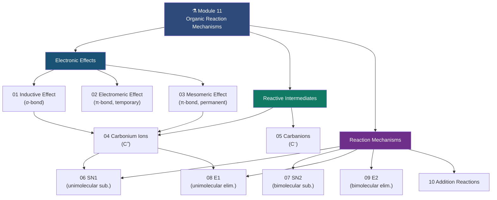

# ⚗️ CHEM-103 — Module 11: Organic Reactions and their Mechanisms

**[🔗 Back to CHEM-103](https://github.com/itachi-re/butex-notes/tree/master/CHEM-103)**

---

## 📋 Module Overview

This module covers the foundational concepts of **organic reaction mechanisms** as per the CHEM-103 syllabus at BUTEX. The study of reaction mechanisms explains *how* and *why* organic reactions occur — at the electronic level. Understanding these mechanisms is the single most important skill for predicting and rationalising the outcomes of organic reactions.

The module is divided into three thematic sections:

1. **Electronic Effects** (Topics 1–3): How electron density is distributed and transmitted within organic molecules — the "fingerprint" that determines a molecule's reactivity.
2. **Reactive Intermediates** (Topics 4–5): Short-lived, high-energy species (carbocations, carbanions) that appear as key players in mechanisms.
3. **Reaction Mechanisms** (Topics 6–10): Step-by-step analysis of major reaction classes: substitution (SN1, SN2), elimination (E1, E2), and addition reactions.

---

## 📂 Contents

| # | File | Topic | Key Concepts |
|:--|:-----|:------|:-------------|
| 01 | [01_inductive_effect.md](01_inductive_effect.md) | Inductive Effect | σ-bond polarisation, +I / −I groups, acidity & basicity effects, pKₐ |
| 02 | [02_electromeric_effect.md](02_electromeric_effect.md) | Electromeric Effect | Complete π-electron transfer, +E / −E, temporary & reversible |
| 03 | [03_mesomeric_effect.md](03_mesomeric_effect.md) | Mesomeric Effect | Resonance/conjugation, +M / −M groups, EAS directing |
| 04 | [04_carbonium_ions.md](04_carbonium_ions.md) | Carbonium Ions | Carbocations, sp² hybridisation, stability order, 1,2-shifts |
| 05 | [05_carbanions.md](05_carbanions.md) | Carbanions | Negative carbon intermediates, stability, synthetic applications |
| 06 | [06_sn1.md](06_sn1.md) | SN1 Reactions | Unimolecular substitution, carbocation intermediate, racemisation |
| 07 | [07_sn2.md](07_sn2.md) | SN2 Reactions | Bimolecular substitution, backside attack, Walden inversion |
| 08 | [08_e1.md](08_e1.md) | E1 Reactions | Unimolecular elimination, Zaitsev's rule, competition with SN1 |
| 09 | [09_e2.md](09_e2.md) | E2 Reactions | Bimolecular elimination, anti-periplanar geometry, stereospecific |
| 10 | [10_addition_reactions.md](10_addition_reactions.md) | Addition Reactions | Electrophilic / nucleophilic / radical addition, Markovnikov's rule |

---

## 🎯 Learning Objectives

By the end of this module, you should be able to:

1. Define and distinguish between inductive, electromeric, and mesomeric electronic effects
2. Predict the direction and relative magnitude of electronic effects in organic molecules
3. Explain how electronic effects influence molecular acidity, basicity, and reactivity
4. Describe the structure, hybridisation, formation, and stability of carbocations and carbanions
5. Write complete, step-by-step arrow-pushing mechanisms for SN1, SN2, E1, and E2 reactions
6. Derive and interpret the rate laws for each substitution and elimination mechanism
7. Predict the stereochemical outcome of each reaction type (racemisation vs. inversion vs. retention)
8. Apply Markovnikov's rule and Zaitsev's rule to predict major reaction products
9. Identify factors (substrate structure, nucleophile/base strength, solvent, temperature) that favour each mechanism
10. Classify addition reactions and explain the role of the π bond as a nucleophile

---

## 📚 Prerequisites

Before studying this module, revise:

1. Atomic structure — orbital types, electronic configuration
2. Covalent bonding — σ and π bonds, bond polarity
3. Hybridisation — sp, sp², sp³ and their geometries
4. Electronegativity and its periodic trends
5. Resonance structures and delocalization
6. Brønsted-Lowry acid-base theory, pKₐ
7. Basic functional groups: alkyl halides, alkenes, alkynes, alcohols, carboxylic acids

---

## 🗺️ Module Map

---

## 🔗 Cross-Module Connections

- **[CHEM-101 / 02 — Chemical Bonding](../02_chemical_bonding/)** — Hybridisation, orbital overlap, bond polarity
- **[CHEM-101 / 04 — Acids & Bases](../04_acids_bases/)** — pKₐ, acid strength, conjugate bases
- **[CHEM-101 / 07 — Equilibrium](../07_equilibrium/)** — Reaction thermodynamics, Keq
- **[CHEM-101 / 08 — Kinetics](../08_kinetics/)** — Rate laws, activation energy, Arrhenius equation

---

## 📖 Recommended References

1. **Clayden, J., Greeves, N., Warren, S.** — *Organic Chemistry*, 2nd ed., Oxford University Press, 2012 — The gold-standard university textbook.
2. **March, J.** — *Advanced Organic Chemistry*, 5th ed., Wiley-Interscience, 2001 — Graduate-level reference.
3. **LibreTexts Organic Chemistry** — Free online — [chem.libretexts.org/Bookshelves/Organic_Chemistry](https://chem.libretexts.org/Bookshelves/Organic_Chemistry)
4. **ChemGuide (Jim Clark)** — Excellent clear explanations — [chemguide.co.uk](https://www.chemguide.co.uk)
5. **Master Organic Chemistry** — Mechanism deep-dives — [masterorganicchemistry.com](https://www.masterorganicchemistry.com)
6. **IUPAC Gold Book** — Official definitions — [goldbook.iupac.org](https://goldbook.iupac.org)
7. **Khan Academy Organic Chemistry** — [khanacademy.org/science/organic-chemistry](https://www.khanacademy.org/science/organic-chemistry)

---

> 📖 *These notes are part of the [BUTEX Notes](https://github.com/itachi-re/butex-notes) repository — B.Sc. Textile Engineering, Fabric Engineering Dept. · CHEM-103*
