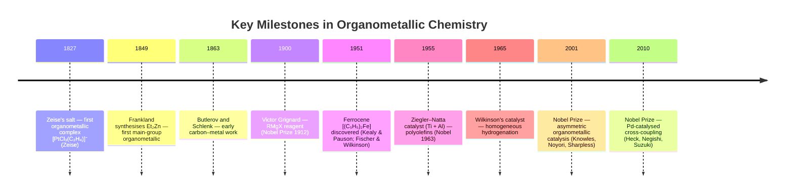
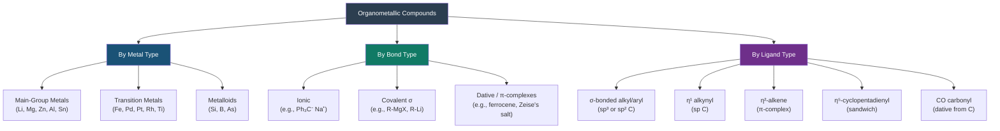
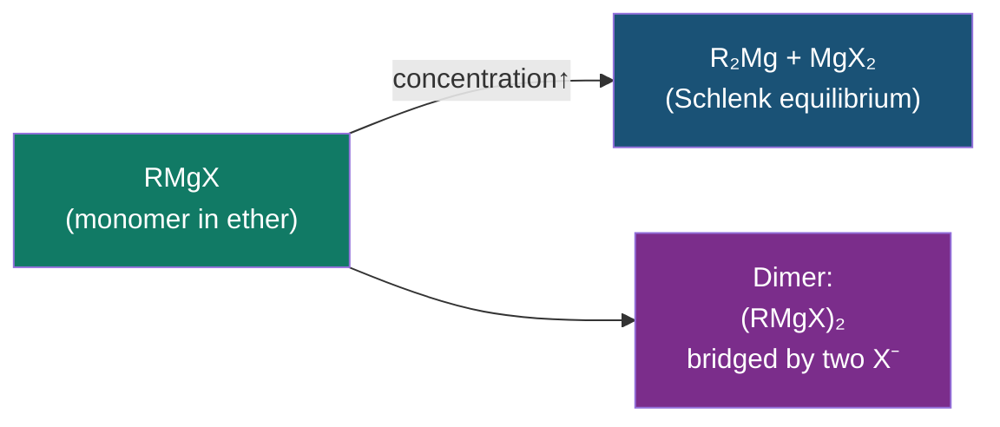
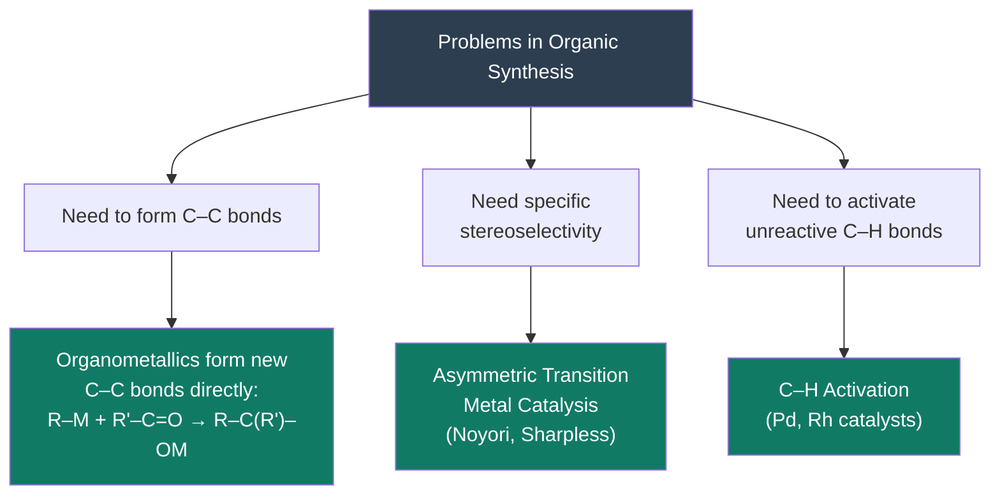

# 🧲 CHEM-103 — Module 12, Topic 01: Organometallic Compounds — Importance and Structure

**[🔗 Back to Module 12](README.md)** | **[➡ Topic 02: Grignard Reagent](02_grignard_reagent.md)**


---

## 📋 Table of Contents

1. [Definition and Scope](#1-definition-and-scope)
2. [Historical Background](#2-historical-background)
3. [The Carbon–Metal (C–M) Bond](#3-the-carbonmetal-cm-bond)
4. [Classification of Organometallic Compounds](#4-classification-of-organometallic-compounds)
5. [Bonding Types in Organometallics](#5-bonding-types-in-organometallics)
6. [Important Families of Organometallic Compounds](#6-important-families-of-organometallic-compounds)
7. [Structure of Common Organometallics](#7-structure-of-common-organometallics)
8. [Importance of Organometallic Chemistry](#8-importance-of-organometallic-chemistry)
9. [Industrial Applications](#9-industrial-applications)
10. [Worked Examples](#10-worked-examples)
11. [Summary Table](#11-summary-table)
12. [References & Further Reading](#12-references--further-reading)

---

## 1. Definition and Scope

### 1.1 Definition

> **Organometallic compound:** A compound containing at least one **direct, covalent bond between a carbon atom and a metal atom** (C–M bond).

The carbon may be part of an alkyl, aryl, vinyl, alkynyl, or carbonyl group. The metal may be a main-group metal, a transition metal, or a metalloid.

$$\text{C─M} \quad \text{(direct carbon–metal bond)}$$

**Examples:**

| Compound | Formula | C–M Bond |
|:---------|:--------|:---------|
| Diethylzinc | (C₂H₅)₂Zn | C–Zn |
| Methylmagnesium bromide (Grignard) | CH₃MgBr | C–Mg |
| *n*-Butyllithium | *n*-C₄H₉Li | C–Li |
| Tetramethyltin | (CH₃)₄Sn | C–Sn |
| Ferrocene | (η⁵-C₅H₅)₂Fe | C–Fe (dative) |
| Zeise's salt | [PtCl₃(η²-C₂H₄)]⁻ | C–Pt (dative) |
| Tetraethyllead | (C₂H₅)₄Pb | C–Pb |

### 1.2 Boundary: What is NOT an Organometallic?

Compounds where C is **not** directly bonded to the metal are **not** organometallic:

| Compound | Why NOT organometallic |
|:---------|:-----------------------|
| Sodium acetate (CH₃COO⁻ Na⁺) | O–Na bond, not C–Na |
| Dimethyl sulfoxide (DMSO) | C–S bond; S is not a metal |
| Metal carbonate (CaCO₃) | C–O–Ca; no direct C–Ca bond |
| Ethanol + NaOH → Na⁺ + EtO⁻ | Na–O bond |

---

## 2. Historical Background



---

## 3. The Carbon–Metal (C–M) Bond

The nature of the C–M bond is the defining feature of organometallic chemistry and determines all physical and chemical properties.

### 3.1 Electronegativity and Bond Polarity

Carbon's electronegativity (Pauling scale): **χ(C) = 2.5**

Bond polarity depends on the **electronegativity difference (Δχ)**:

$$\Delta\chi = \chi(\text{C}) - \chi(\text{M})$$

$$\boxed{\text{The larger the } \Delta\chi, \text{ the more ionic the C–M bond}}$$

| Metal | χ(M) | Δχ = χ(C) − χ(M) | Bond character |
|:------|:-----|:------------------|:--------------|
| Li | 1.0 | +1.5 | Strongly ionic/polar covalent |
| Mg | 1.2 | +1.3 | Ionic/polar covalent |
| Al | 1.5 | +1.0 | Polar covalent |
| Zn | 1.6 | +0.9 | Polar covalent |
| Sn | 1.8 | +0.7 | Weakly polar covalent |
| Fe | 1.8 | +0.7 | Covalent / coordinate |
| Hg | 2.0 | +0.5 | Weakly polar covalent |
| Pt | 2.2 | +0.3 | Largely covalent |

### 3.2 The C–M Bond as a Carbanion Equivalent

Because C is more electronegative than most metals, the electron density in the C–M bond is **polarised towards carbon**:

$$\underset{\delta^-}{\text{C}}──\underset{\delta^+}{\text{M}}$$

This makes the carbon **nucleophilic** — it behaves like a **carbanion** (R:⁻). This is why organometallic reagents are such powerful nucleophiles and bases.

```
R─MgBr  ←→  R:⁻ ... ⁺MgBr
   ↑                 ↑
Covalent form    Ionic limit (carbanion)
```

The more ionic the C–M bond, the more reactive the organometallic:

$$\text{C─Li} > \text{C─Mg} > \text{C─Zn} > \text{C─Sn} > \text{C─Hg} \quad \text{(reactivity/polarity)}$$

### 3.3 Bond Dissociation Energies

| Bond | BDE (kJ mol⁻¹) | Notes |
|:-----|:---------------|:------|
| C–H | ~413 | Reference |
| C–C | ~348 | Reference |
| C–Li | ~130 | Very weak — highly reactive |
| C–Mg | ~180 | Weak — reactive |
| C–Zn | ~185 | Weak — reactive |
| C–Sn | ~218 | Moderate |
| C–Si | ~311 | Relatively strong — stable |

Low BDE → high reactivity → useful as synthetic reagents.

---

## 4. Classification of Organometallic Compounds



### 4.1 Classification by Metal Type

**Main-group organometallics** (Groups 1–2, 12–14):
- Most important for organic synthesis
- Include Grignard (Mg), organolithium (Li), organoaluminium (Al), organozinc (Zn), organotin (Sn)

**Transition metal organometallics** (d-block):
- Include ferrocene (Fe), Wilkinson's catalyst (Rh), Zeise's salt (Pt), Ziegler–Natta (Ti/Al)
- Important in homogeneous catalysis and cross-coupling

**Metalloid organometallics** (B, Si):
- Organoboron (boronic acids) and organosilicon (silanes) — important in Suzuki and Hiyama coupling

---

## 5. Bonding Types in Organometallics

### 5.1 Ionic Bonding

When Δχ is very large (>1.7), the C–M bond is essentially ionic. The carbon carries a full negative charge (carbanion) and the metal a positive charge.

**Example: Sodium cyclopentadienide**

$$\text{C}_5\text{H}_6 + \text{NaNH}_2 \rightarrow [\text{C}_5\text{H}_5]^- \text{Na}^+ + \text{NH}_3$$

The cyclopentadienyl anion is aromatic (6 π electrons, Hückel) and forms a stable ionic salt.

### 5.2 Covalent σ-Bonding (Most Common in Synthesis)

The C–M bond is a localised two-centre two-electron σ bond, like a normal C–C bond but polar.

```
    H₃C─MgBr    ← standard covalent sp³ C bonded to Mg
    
    Bond angle at C: ~109.5°
    Hybridisation at C: sp³
    The Mg end: also forms two additional dative bonds with ether solvent
```

### 5.3 Dative (Coordinate) Bonding — π Complexes

In transition metal organometallics, the C=C π system donates its electrons **datively** to an empty metal orbital. This is a **Lewis acid–base** interaction.

**Example: Zeise's salt** [PtCl₃(η²-C₂H₄)]⁻

```
    Cl₃Pt ←── C═C (ethylene donates π electrons to Pt)
    
    The C═C bond is lengthened (weakened) on coordination
    The two C atoms are equivalent → η² bonding (eta-2)
```

**Example: Ferrocene** (η⁵-C₅H₅)₂Fe

```
    Two C₅H₅⁻ rings sandwich an Fe²⁺ ion
    Each ring donates 6 electrons via the aromatic π system
    → 18-electron complex (stable "effective atomic number" = 26+10+2×6? no: Fe²⁺ = 24 electrons from d⁶, each Cp⁻ = 6e → 24 + 2×6 = 36 → wait 
    Correct: Fe²⁺ (d⁶) = 6 d-electrons; each Cp⁻ donates 5 electrons (η⁵) → 6 + 2×5 = 16? 
    Actually ferrocene has 18 electrons: Fe(0) d⁸ + 2 Cp⁻ each with 5e → 8 + 5 + 5 = 18 ✓
    
    Sandwich structure — Fe between two parallel rings
```

### 5.4 Agostic Interactions

A special type of 3-centre 2-electron bonding where a C–H bond donates to a metal centre. Important in catalysis but beyond CHEM-103 scope.

---

## 6. Important Families of Organometallic Compounds

### 6.1 Organolithium Compounds (R–Li)

- Most reactive common organometallics (C–Li most polar in main group)
- Prepared: RX + 2Li → RLi + LiX (in hexane or Et₂O)
- Examples: *n*-BuLi, *t*-BuLi, PhLi, MeLi
- Extremely air- and moisture-sensitive; handled under inert gas (Schlenk line)
- Applications: strong bases (deprotonation), carbanion nucleophiles, precursors to other organometallics

### 6.2 Grignard Reagents (R–MgX)

- Most widely used organometallic in undergraduate lab and industry
- Less reactive than organolithium — more selective
- **(Full treatment in Topic 02)**

### 6.3 Organoaluminium Compounds (R₃Al, RAlX₂)

- Trialkylaluminium compounds — pyrophoric (spontaneously ignite in air)
- Component of Ziegler–Natta polymerisation catalyst (Et₃Al + TiCl₄)
- Controlled hydroalumination of alkenes

### 6.4 Organoboron Compounds (R–B(OH)₂ boronic acids)

- Stable, low-toxicity — used in Suzuki cross-coupling
- Prepared by hydroboration of alkenes (BH₃/THF, syn addition)
- Key in pharmaceutical synthesis

### 6.5 Organotin (Stannanes, R₄Sn / R₃SnX)

- Used in Stille coupling
- Tributyltin hydride (Bu₃SnH) — radical reactions
- Toxic; being replaced by organoboron where possible

### 6.6 Organosilicon (Silanes, R₃Si–X)

- Hiyama coupling
- TMS (trimethylsilyl) group — protecting group in synthesis
- Silicon enol ethers in Mukaiyama aldol

---

## 7. Structure of Common Organometallics

### 7.1 Structure of Methyllithium (MeLi)

In the solid state, methyllithium forms a **tetrameric cubane structure**:

```
    Li₄(CH₃)₄ cubane:
    
    Li atoms occupy alternating corners of a cube
    CH₃ groups occupy the other four corners
    Each CH₃ bridges three Li atoms (3-centre, 2-electron bonds)
    
    In ether solution: dimers and monomers form
    In THF: mostly monomeric (coordinated solvent breaks aggregation)
```

### 7.2 Structure of Grignard Reagents (RMgX in ether)



The Grignard in ether (Et₂O) is actually the **solvated monomer**:

```
    Et₂O→Mg←OEt₂
         |    \
         R     X
    
    Tetrahedral Mg, coordinated by 2 ether molecules, 1 R group, 1 X⁻
    (Mg is a Lewis acid; ether is the Lewis base — dative O→Mg bonds)
```

Full details in Topic 02.

### 7.3 Structure of Ferrocene — The Sandwich Compound

```
           Cp⁻ ring (η⁵)
           ○ ○ ○ ○ ○
              Fe²⁺
           ○ ○ ○ ○ ○
           Cp⁻ ring (η⁵)
    
    D₅ₕ symmetry (eclipsed, solid state)
    D₅d symmetry (staggered, solution)
    All C–Fe distances equal: 2.04 Å
    Aromatic: highly stable, resists ring-opening reactions
```

### 7.4 Structure of Zeise's Salt

```
    [PtCl₃(η²-C₂H₄)]⁻:
    
    Pt is square planar (d⁸, sp²d)
    Three Cl ligands + one sideways-on ethylene
    C–C bond lengthened from 1.34 Å (free) to 1.37 Å (coordinated)
    C–C axis perpendicular to Pt coordination plane
```

---

## 8. Importance of Organometallic Chemistry

### 8.1 Why Organometallics Are Essential in Synthesis

Organometallic reagents allow chemists to:



**Key capability:** Organometallics convert a carbon from **electrophilic** to **nucleophilic**:

```
    Normal carbonyl carbon:   C=O → C is electrophile, attacked by Nu:⁻
    With organometallic:      R–M can act as carbanion (R:⁻ equivalent)
                              → R attacks the electrophilic C
    
    R–M + C=O  →  R–C–O⁻M⁺   (new C–C bond formed!)
```

Without organometallics, forming C–C bonds from polar disconnections is very difficult. With them, it becomes routine.

### 8.2 Biological Importance

| System | Organometallic Role |
|:-------|:-------------------|
| Vitamin B₁₂ | Coenzyme with a **Co–C bond** — first biological organometallic discovered |
| Haemoglobin | Fe–CO dative bond (CO poisoning mechanism) |
| Hydrogenase enzymes | Fe–Fe or Fe–Ni with CO and CN⁻ ligands |
| Carbonic anhydrase | Zn²⁺ activates C=O (not strictly organometallic, but related) |

Vitamin B₁₂ (cobalamin) contains a **direct Co–C bond** — the only confirmed natural organometallic C–metal σ bond in biology. It catalyses rearrangements and methyl transfer in metabolism.

### 8.3 Importance in Materials Science

- **Organosilanes** — precursors to silicone polymers
- **Organotitanium** — precursors to TiO₂ nanoparticles
- **Organolead** (phased out) — tetraethyllead as antiknock agent in petrol
- **OLED materials** — iridium and platinum complexes for red/green/blue phosphorescent emitters
- **Solar cells** — ruthenium dye-sensitised cells (Grätzel cells)

---

## 9. Industrial Applications

### 9.1 Ziegler–Natta Polymerisation

$$n \text{CH}_2\text{=CH}_2 \xrightarrow{\text{TiCl}_4 / \text{AlEt}_3} (-\text{CH}_2\text{─CH}_2-)_n \quad \text{(polyethylene)}$$

- Catalyst: TiCl₄ (transition metal) + AlEt₃ (organometallic activator)
- Produces high-density polyethylene (HDPE), isotactic polypropylene
- Global production: >100 million tonnes/year of polyolefins

### 9.2 Oxo Process (Hydroformylation)

$$\text{R─CH=CH}_2 + \text{CO} + \text{H}_2 \xrightarrow{\text{HCo(CO)}_4 \text{ or Rh catalyst}} \text{R─CH}_2\text{─CH}_2\text{─CHO}$$

- Converts alkene + syngas (CO/H₂) to an aldehyde
- ~10 million tonnes/year of aldehyde/alcohol production
- Key step in manufacturing of detergents, plasticisers, fragrances

### 9.3 Wacker Process

$$\text{CH}_2\text{=CH}_2 + \frac{1}{2}\text{O}_2 \xrightarrow{\text{PdCl}_2/\text{CuCl}_2} \text{CH}_3\text{CHO}$$

- Pd-catalysed oxidation of ethylene to acetaldehyde
- Industrial precursor to acetic acid, ethyl acetate

### 9.4 Monsanto/Cativa Process

$$\text{CH}_3\text{OH} + \text{CO} \xrightarrow{\text{[RhI}_2\text{(CO)}_2]^- \text{ or Ir catalyst}} \text{CH}_3\text{COOH}$$

- Carbonylation of methanol to acetic acid
- >5 million tonnes/year of acetic acid worldwide

### 9.5 Cross-Coupling Reactions

$$\text{R─X} + \text{R'─M} \xrightarrow{\text{Pd}^0} \text{R─R'} + \text{M─X}$$

| Name | Organometallic | Bond Formed | Nobel |
|:-----|:--------------|:------------|:------|
| Kumada | RMgX (Grignard) | C(sp²)–C(sp²) | — |
| Negishi | RZnX | C–C | 2010 |
| Suzuki–Miyaura | RB(OH)₂ | C–C | 2010 |
| Stille | R₃Sn | C–C | — |
| Heck | Alkene | C–C | 2010 |

---

## 10. Worked Examples

### Example 10.1 — Identify the C–M bond

**Q:** Which of these contains a C–M bond? (a) CH₃ONa (b) (CH₃)₄Pb (c) CaCO₃ (d) Fe(CO)₅

**A:**
- (a) CH₃ONa: Na–O bond, not C–Na → **NOT organometallic**
- (b) (CH₃)₄Pb: four C–Pb bonds → **organometallic** ✓
- (c) CaCO₃: no C–Ca bond (O–Ca) → **NOT organometallic**
- (d) Fe(CO)₅: C of CO donates to Fe (dative C→Fe) → **organometallic** ✓ (metal carbonyl)

---

### Example 10.2 — Bond character prediction

**Q:** Arrange in order of increasing ionic character of the C–M bond: C–Sn, C–Li, C–Zn, C–Mg.

Using electronegativities:
- C–Li: Δχ = 2.5 − 1.0 = **1.5** (most ionic)
- C–Mg: Δχ = 2.5 − 1.2 = **1.3**
- C–Zn: Δχ = 2.5 − 1.6 = **0.9**
- C–Sn: Δχ = 2.5 − 1.8 = **0.7** (least ionic)

**Order (increasing ionic character):** C–Sn < C–Zn < C–Mg < C–Li

---

### Example 10.3 — Reactivity ranking

**Q:** Which reagent is more reactive as a carbon nucleophile toward a carbonyl: MeMgBr or Me₄Sn?

**A:** MeMgBr. The C–Mg bond (Δχ = 1.3) is more polar than C–Sn (Δχ = 0.7), so MeMgBr has a more "carbanion-like" carbon. Me₄Sn does not react with carbonyls under normal conditions (needs Pd catalyst for transmetalation).

---

## 11. Summary Table

| Property | Ionic limit (e.g., RLi) | Covalent polar (e.g., RMgX, RZnX) | Covalent weak (e.g., R₄Sn) | π-complex (e.g., Cp₂Fe) |
|:---------|:------------------------|:----------------------------------|:--------------------------|:------------------------|
| C–M bond | Essentially ionic | Polar covalent | Weak polar covalent | Dative/delocalised |
| Reactivity | Very high | High | Moderate | Low (thermally stable) |
| Air stability | Extremely sensitive | Sensitive | Moderate | Stable (ferrocene) |
| Typical metal | Li, Na | Mg, Zn, Al | Sn, Si, Hg | Fe, Pt, Rh |
| Main use | Strong base/nucleophile | Synthesis nucleophile | Cross-coupling | Catalysis, materials |

---

## 12. References & Further Reading

1. **Clayden, J., Greeves, N., Warren, S.** — *Organic Chemistry*, 2nd ed., OUP, 2012 — Chapter 9 (organometallics in synthesis), Chapter 43 (organometallic chemistry).
2. **Crabtree, R. H.** — *The Organometallic Chemistry of the Transition Metals*, 6th ed., Wiley, 2014.
3. **Elschenbroich, C.** — *Organometallics*, 3rd ed., Wiley-VCH, 2006.
4. **LibreTexts — Introduction to Organometallic Chemistry:** [https://chem.libretexts.org/Bookshelves/Inorganic_Chemistry/Organometallic_Chemistry_(Evans)/01%3A_Overview_of_Organometallic_Chemistry](https://chem.libretexts.org/Bookshelves/Inorganic_Chemistry/Organometallic_Chemistry_(Evans)/01%3A_Overview_of_Organometallic_Chemistry)
5. **IUPAC Gold Book — Organometallic Compound:** [https://goldbook.iupac.org/terms/view/O04328](https://goldbook.iupac.org/terms/view/O04328)
6. **ACS Symposium — Organometallic Chemistry Overview:** [https://pubs.acs.org/journal/orgnd7](https://pubs.acs.org/journal/orgnd7)
7. **Ziegler–Natta Nobel Lecture (1963):** [https://www.nobelprize.org/prizes/chemistry/1963/ziegler/lecture/](https://www.nobelprize.org/prizes/chemistry/1963/ziegler/lecture/)
8. **Nobel Prize 2010 Summary — Cross-coupling:** [https://www.nobelprize.org/prizes/chemistry/2010/summary/](https://www.nobelprize.org/prizes/chemistry/2010/summary/)

---

<div align="center">

**[⬆ Back to Module 12 README](README.md)** | **[➡ Grignard Reagent](02_grignard_reagent.md)**

---

> 📖 *These notes are part of the [BUTEX Notes](https://github.com/itachi-re/butex-notes) repository — B.Sc. Textile Engineering, Fabric Engineering Dept. · CHEM-103*

</div>
