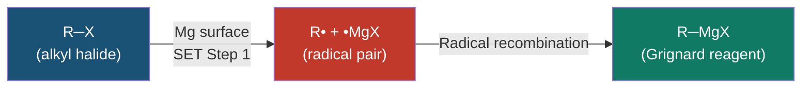
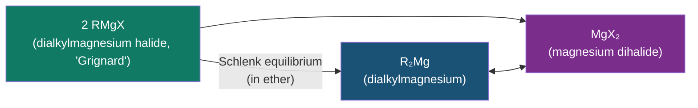
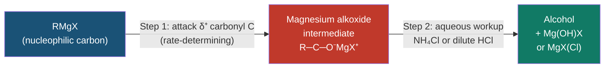
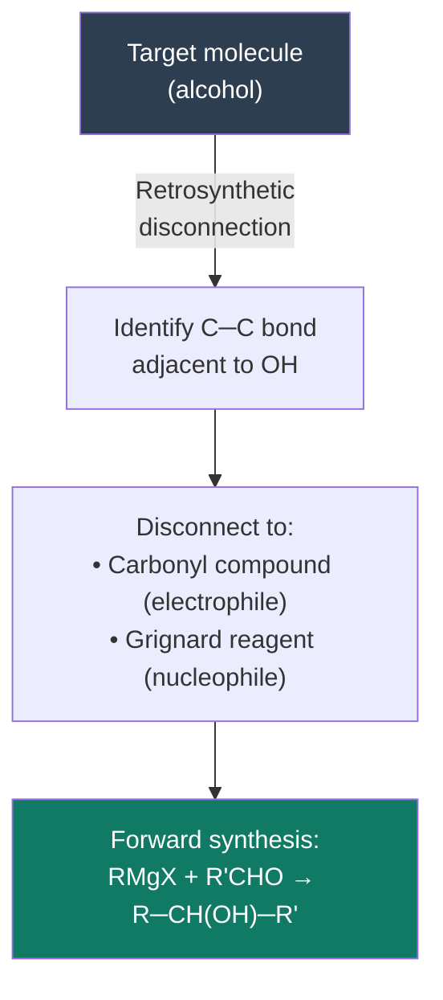
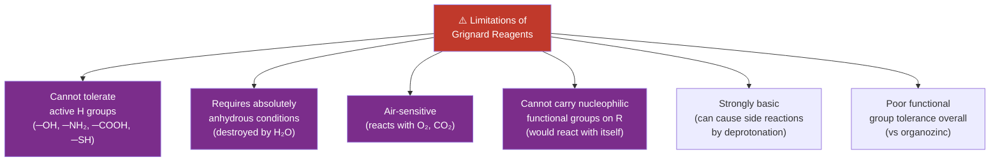
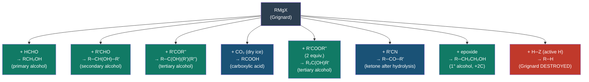

# 🧪 CHEM-103 — Module 12, Topic 02: Grignard Reagent

**[🔗 Back to Module 12](README.md)** | **[⬅ Topic 01: Organometallic Intro](01_organometallic_intro.md)** | **[➡ Topic 03: Organo-zinc](03_organozinc.md)**


---

## 📋 Table of Contents

1. [Historical Background and Nobel Prize](#1-historical-background-and-nobel-prize)
2. [Preparation of Grignard Reagents](#2-preparation-of-grignard-reagents)
3. [Structure in Solution — Schlenk Equilibrium](#3-structure-in-solution--schlenk-equilibrium)
4. [The Grignard Reagent as a Carbanion Equivalent](#4-the-grignard-reagent-as-a-carbanion-equivalent)
5. [Reactions with Carbonyl Compounds](#5-reactions-with-carbonyl-compounds)
   - 5.1 Addition to Formaldehyde → Primary Alcohol
   - 5.2 Addition to Aldehydes → Secondary Alcohol
   - 5.3 Addition to Ketones → Tertiary Alcohol
   - 5.4 Addition to Carbon Dioxide (CO₂) → Carboxylic Acid
   - 5.5 Addition to Esters → Tertiary Alcohol (two equivalents)
   - 5.6 Addition to Acid Chlorides
6. [Reactions with Other Electrophiles](#6-reactions-with-other-electrophiles)
   - 6.1 Addition to Nitriles (RCN) → Ketone
   - 6.2 Ring-Opening of Epoxides → Alcohol
   - 6.3 Reaction with Oxygen and Water
   - 6.4 Reaction with Active Hydrogen Compounds
7. [Applications in Organic Synthesis](#7-applications-in-organic-synthesis)
8. [Limitations of Grignard Reagents](#8-limitations-of-grignard-reagents)
9. [Worked Synthesis Examples](#9-worked-synthesis-examples)
10. [Summary of All Grignard Reactions](#10-summary-of-all-grignard-reactions)
11. [References & Further Reading](#11-references--further-reading)

---

## 1. Historical Background and Nobel Prize

**Victor Grignard** (1871–1935) was a French chemist who discovered the organomagnesium halide reagents bearing his name in **1900**, while a student of Philippe Barbier at the University of Lyon.

> **Key Insight (Grignard, 1900):** Unlike Barbier's original (mixed) procedure, Grignard found that preparing the organomagnesium compound **first** (in dry ether), then adding the carbonyl compound, gave dramatically better yields and reproducibility.

Grignard was awarded the **Nobel Prize in Chemistry in 1912**, shared with Paul Sabatier (for catalytic hydrogenation).

His reagent — **RMgX** — remains, over 120 years later, one of the most widely taught and used reactions in all of organic synthesis.

---

## 2. Preparation of Grignard Reagents

### 2.1 General Equation

$$\boxed{R\text{─}X + \text{Mg} \xrightarrow{\text{dry Et}_2\text{O or THF}} R\text{─}Mg\text{─}X}$$

Where:
- **R** = alkyl (1°, 2°, 3°), aryl (Ar), vinyl, or benzyl
- **X** = Br, Cl, or I (F is too unreactive; I₂ sometimes used to initiate)
- **Mg** = magnesium metal (turnings or powder)
- **Solvent** = dry diethyl ether (Et₂O) or dry THF — must be **absolutely anhydrous**

### 2.2 Specific Examples

| Starting Halide | Grignard Reagent | Name |
|:----------------|:----------------|:-----|
| CH₃Br | CH₃MgBr | Methylmagnesium bromide |
| C₂H₅Cl | C₂H₅MgCl | Ethylmagnesium chloride |
| PhBr | PhMgBr | Phenylmagnesium bromide |
| *n*-C₄H₉Br | *n*-C₄H₉MgBr | *n*-Butylmagnesium bromide |
| CH₂=CHBr | CH₂=CHMgBr | Vinylmagnesium bromide |
| BrMg(CH₂)₅MgBr | — | Pentanedienyl di-Grignard |

### 2.3 Mechanism of Grignard Formation — Radical Pathway

The formation of a Grignard reagent proceeds through a **radical mechanism** (not ionic), via single electron transfer (SET) from the metal surface:



**Detailed steps:**

```
Step 1:  Mg surface donates one electron to R–X
         Mg⁰ → Mg•⁺ (surface radical cation)
         R–X + e⁻ → [R–X]•⁻ → R• + X⁻

Step 2:  R• recombines with •MgX on the surface
         R• + •MgX → R–MgX

Net:     R–X + Mg → R–MgX
```

Evidence for radicals: radical clock experiments show ring-opening of cyclopropylcarbinyl halides, consistent with a radical intermediate.

### 2.4 Reactivity Order of Halides

$$\text{R─I} > \text{R─Br} > \text{R─Cl} \gg \text{R─F}$$

Alkyl fluorides rarely form Grignard reagents (C–F bond too strong and C–F too ionic for SET to Mg). Most lab preparations use **alkyl bromides** (convenient reactivity, low cost).

### 2.5 Critical Experimental Conditions

| Condition | Why essential |
|:----------|:-------------|
| **Absolutely dry (anhydrous) ether or THF** | Grignard reacts instantly with water (destroys it) |
| **Inert atmosphere (N₂ or Ar)** | Reacts with CO₂ and O₂ in air |
| **Mg turnings, not bulk** | High surface area → faster initiation |
| **Iodine crystal or dibromoethane** | Activates (etches) Mg surface — initiates reaction |
| **Gentle heating** | Exothermic once started; may need ice bath to control |
| **Anhydrous glassware** | Even condensed moisture on glassware will destroy the reagent |

### 2.6 Why Ether Solvent?

Ether (Et₂O) and THF are essential — not just as solvents but as **ligands**:

```
    Two ether oxygen lone pairs coordinate to Mg (Lewis acid)
    
    Et₂O → Mg ← OEt₂
              |
              R   X
    
    This solvation:
    • Stabilises the polar C–Mg bond
    • Breaks up aggregates (makes monomeric species)
    • Makes the Grignard soluble
    • Prevents decomposition
```

Without ether stabilisation, R–MgX would be an unstable, polymerised solid.

---

## 3. Structure in Solution — Schlenk Equilibrium

In ether solution, Grignard reagents exist as an **equilibrium mixture** of species, known as the **Schlenk equilibrium** (after Wilhelm Schlenk, 1929):

$$\boxed{2\, R\text{─}MgX \rightleftharpoons R_2Mg + MgX_2}$$



**Equilibrium position depends on:**
- **Solvent**: polar solvents (THF, HMPA) shift equilibrium toward R₂Mg + MgX₂
- **Halide (X)**: I > Br > Cl (more ionic X → more dissociation to R₂Mg)
- **R group**: bulky R groups favour R₂Mg

### 3.1 Solvated Monomer Structure

In dilute ether solution, the **dominant species** for most reactions is the solvated monomer:

```
       OEt₂
        |
    R──Mg──X
        |
       OEt₂

    Tetrahedral Mg
    4 bonds: R (covalent), X (polar covalent), 2× O-ether (dative)
    Mg: sp³ hybridised
```

### 3.2 Dimer in Concentrated Solution

At higher concentration, a **halide-bridged dimer** forms:

```
    R        R
     \      /
      Mg──Mg
     / X  X \
    Et₂O    OEt₂
    
    Two Mg centres bridged by two X atoms
    Each Mg still tetrahedral
```

For synthetic purposes, all species react similarly with electrophiles — the Schlenk equilibrium is rarely relevant to the reaction outcome.

---

## 4. The Grignard Reagent as a Carbanion Equivalent

The C–Mg bond is highly polar (Δχ = 1.3), making the carbon act as a **carbanion (R:⁻)**:

$$\underset{\delta^-}{R}\text{─}\underset{\delta^+}{Mg}\text{─}X \quad \longleftrightarrow \quad R^- \;\; ^+MgX$$

This means:
- R–MgX is a **strong nucleophile** (carbon attacks electrophiles)
- R–MgX is a **strong base** (R can deprotonate weakly acidic H)
- The carbanion R:⁻ equivalent corresponds to an anion of pKa ~50 (sp³ C–H)

---

## 5. Reactions with Carbonyl Compounds

All carbonyl additions follow the **same two-step mechanism**:



**Arrow-pushing mechanism (generic):**

```
         δ⁺
    R─MgX + C═O  →  R─C─O⁻MgX⁺  →  (H₃O⁺ workup)  →  R─C─OH
    ↑                      ↑
  carbanion            alkoxide intermediate
  attacks C             (magnesium chelated)
```

---

### 5.1 Addition to Formaldehyde → Primary Alcohol (1°)

$$R\text{─}MgX + \text{HCHO} \xrightarrow{\text{1. dry Et}_2\text{O}} \xrightarrow{\text{2. H}_3\text{O}^+} R\text{─}CH_2\text{─}OH$$

**Example:**

$$\text{CH}_3\text{MgBr} + \text{HCHO} \xrightarrow{1. \text{Et}_2\text{O}} \xrightarrow{2. \text{H}_3\text{O}^+} \text{CH}_3\text{─CH}_2\text{─OH} \quad \text{(ethanol, 1° alcohol)}$$

**Mechanism:**

```
Step 1:  CH₃─MgBr attacks HCHO at the carbonyl C

             H
              ‖
         CH₃─C═O  →  CH₃─CH₂─O⁻MgBr⁺  (alkoxide)

Step 2:  Aqueous workup (NH₄Cl/H₂O)

         CH₃─CH₂─O⁻MgBr⁺  +  H₂O  →  CH₃─CH₂─OH  +  Mg(OH)Br
```

**Utility:** Converting any RMgX to an alcohol with one more carbon than R–H.

---

### 5.2 Addition to Aldehydes → Secondary Alcohol (2°)

$$R\text{─}MgX + R'\text{─}CHO \xrightarrow{\text{1. Et}_2\text{O}} \xrightarrow{\text{2. H}_3\text{O}^+} R\text{─}CH(OH)\text{─}R'$$

**Example:**

$$\text{PhMgBr} + \text{CH}_3\text{CHO} \xrightarrow{1. \text{Et}_2\text{O}} \xrightarrow{2. \text{H}_3\text{O}^+} \text{Ph─CH(OH)─CH}_3 \quad \text{(1-phenylethan-1-ol, 2° alcohol)}$$

**Note:** The new C–C bond is formed between the Grignard carbon and the carbonyl carbon. The product has **one more C–C bond** than either reactant.

---

### 5.3 Addition to Ketones → Tertiary Alcohol (3°)

$$R\text{─}MgX + R'\text{─}CO\text{─}R'' \xrightarrow{\text{1. Et}_2\text{O}} \xrightarrow{\text{2. H}_3\text{O}^+} R\text{─}C(OH)(R')(R'')$$

The product is a **tertiary alcohol** — a carbon bearing three different carbon groups and one OH.

**Example:**

$$\text{CH}_3\text{MgBr} + \underset{\text{acetone}}{(\text{CH}_3)_2\text{C=O}} \xrightarrow{1. \text{Et}_2\text{O}} \xrightarrow{2. \text{H}_3\text{O}^+} (\text{CH}_3)_3\text{COH} \quad \text{(2-methylpropan-2-ol, 3° alcohol)}$$

**Example 2:**

$$\text{PhMgBr} + \underset{\text{cyclohexanone}}{\bigcirc\text{=O}} \xrightarrow{1.} \xrightarrow{2.} \text{1-phenylcyclohexan-1-ol} \quad \text{(3° alcohol)}$$

---

### 5.4 Addition to CO₂ → Carboxylic Acid

$$R\text{─}MgX + \text{CO}_2 \xrightarrow{\text{1. dry Et}_2\text{O, }−78°\text{C}} \xrightarrow{\text{2. H}_3\text{O}^+} R\text{─}COOH$$

CO₂ acts as a carbonyl electrophile (C is δ⁺). The Grignard adds once to give a carboxylate salt, which on acidic workup gives the carboxylic acid.

**Example:**

$$\text{PhMgBr} + \text{CO}_2 \xrightarrow{1. \text{Et}_2\text{O}} \xrightarrow{2. \text{H}^+} \text{PhCOOH} \quad \text{(benzoic acid)}$$

**Example 2:**

$$\text{CH}_3\text{MgBr} + \text{CO}_2 \xrightarrow{1.} \xrightarrow{2.} \text{CH}_3\text{COOH} \quad \text{(acetic acid)}$$

**Mechanism:**

```
     δ⁻     δ⁺
 R─MgX  +  O═C═O  →  R─C(=O)─O⁻MgX⁺  →  H₃O⁺  →  R─COOH
              ↑
      CO₂ has two carbonyls; only one is attacked
      (second addition would require more forcing conditions)
```

This is one of the few ways to **introduce a carboxyl group from scratch** onto a carbon framework.

---

### 5.5 Addition to Esters → Tertiary Alcohol (Two Equivalents)

$$R\text{─}MgX + R'\text{─}COOR'' \xrightarrow{\text{1. }2\text{ equiv. } R\text{─}MgX} \xrightarrow{\text{2. H}_3\text{O}^+} R_2C(OH)\text{─}R'$$

Esters react with **two equivalents** of the Grignard reagent, because:

1. First equivalent adds to give a **ketone** (after loss of R''O⁻)
2. The ketone reacts immediately with the second equivalent → tertiary alcohol

**Mechanism:**

```
Step 1:  RMgX + R'COOR''  →  [R'─CO─R]─O⁻MgX  →  R'─CO─R + R''O⁻MgX
                                ↑
                        tetrahedral intermediate
                        (collapses by expelling RO⁻ alkoxide)

Step 2:  RMgX + R'─CO─R  →  (as ketone addition)  →  R'─C(OH)(R)₂

Product:  Tertiary alcohol where two of the three R groups come from the Grignard
```

**Example:**

$$2\text{ CH}_3\text{MgBr} + \underset{\text{ethyl acetate}}{\text{CH}_3\text{COOC}_2\text{H}_5} \xrightarrow{1.} \xrightarrow{2.} \underset{\text{2-methylpropan-2-ol}}{(\text{CH}_3)_3\text{COH}}$$

**Synthetic note:** If you want to stop at the ketone stage, use a **less reactive** acyl equivalent (Weinreb amide) that doesn't undergo double addition.

---

### 5.6 Addition to Acid Chlorides

$$R\text{─}MgX + R'\text{─}COCl \xrightarrow{} \underset{\text{(usually ketone or 3° alcohol)}}{R\text{─}CO\text{─}R' \text{ or } R_2\text{─}C(OH)\text{─}R'}$$

Acid chlorides are more reactive than esters. At low temperature with careful stoichiometry, it is sometimes possible to stop at the ketone. In practice, double addition to give 3° alcohol is common unless a more hindered Grignard is used.

---

## 6. Reactions with Other Electrophiles

### 6.1 Addition to Nitriles (RCN) → Ketone (after hydrolysis)

$$R'\text{─}MgX + R\text{─}C\text{≡}N \xrightarrow{\text{1. Et}_2\text{O}} \xrightarrow{\text{2. H}_3\text{O}^+, \text{ then hydrolysis}} R\text{─}CO\text{─}R'$$

**Mechanism:**

```
Step 1:  R'─MgX attacks the electrophilic carbon of R─C≡N
         R'─MgX  +  R─C≡N  →  R─C(=NMgX)─R'  (imine salt / metalated imine)

Step 2:  Aqueous workup hydrolyses the C=N to C=O
         R─C(=N⁻MgX⁺)─R'  +  H₂O  →  R─CO─R'  +  NH₃  +  Mg(OH)X
```

**Example:**

$$\text{CH}_3\text{MgBr} + \underset{\text{benzonitrile}}{\text{PhCN}} \xrightarrow{1.} \xrightarrow{2. \text{H}_3\text{O}^+} \text{Ph─CO─CH}_3 \quad \text{(acetophenone)}$$

This is a useful method to make **ketones** from nitriles.

---

### 6.2 Ring-Opening of Epoxides → Primary or Secondary Alcohol

$$R\text{─}MgX + \underset{\text{epoxide}}{\bigtriangleup_{\text{O}}} \xrightarrow{\text{1. Et}_2\text{O}} \xrightarrow{\text{2. H}_3\text{O}^+} R\text{─}CH_2\text{─}CH_2\text{─}OH \quad \text{(from ethylene oxide)}$$

The Grignard carbon attacks the **less hindered** carbon of the epoxide (SN2 mechanism on the epoxide ring), with inversion at that carbon.

**Example (ethylene oxide gives 1° alcohol — chain extension by 2 carbons!):**

$$\text{RMgX} + \underset{\text{ethylene oxide}}{\boxed{\text{O─CH}_2\text{─CH}_2}} \xrightarrow{1.} \xrightarrow{2.} R\text{─CH}_2\text{─CH}_2\text{─OH}$$

**This is particularly valuable in synthesis:** it extends the carbon chain by TWO carbons and installs a primary alcohol.

**Mechanism:**

```
    R─MgX attacks the less hindered C of the epoxide (SN2):

         O
        / \
    R──→C─C  →  R─C─C─O⁻MgX  →  H₃O⁺  →  R─C─C─OH
       H₂ H₂      H₂ H₂                     H₂ H₂
    
    (backside attack on the epoxide C)
```

---

### 6.3 Reaction with Oxygen (Air) — Side Reaction to Avoid

$$R\text{─}MgX + O_2 \rightarrow R\text{─}O\text{─}O\text{─}MgX \xrightarrow{R\text{─}MgX} 2\, R\text{─}O\text{─}MgX \xrightarrow{H_2O} 2\, R\text{─}OH$$

Exposure to air gives:
- First: peroxide (R–OOMgX)
- Then: alcohol (sometimes useful — preparative oxidation)

In practice, this is an unwanted **side reaction** that destroys the Grignard. Reactions must be performed under **N₂ or Ar atmosphere**.

---

### 6.4 Reaction with Active Hydrogen Compounds — Destruction of Grignard

The Grignard reagent acts as a **strong base** toward any compound with an "active hydrogen" — any H that is more acidic than an alkane C–H (pKₐ < 50):

$$R\text{─}MgX + \text{H─Z} \xrightarrow{} R\text{─}H + Z\text{─}MgX$$

**"Active hydrogen" sources that DESTROY the Grignard:**

| Compound (H─Z) | pKₐ | Product |
|:---------------|:----|:--------|
| Water (H─OH) | 15.7 | R─H + Mg(OH)X |
| Alcohol (R'─OH) | ~16–18 | R─H + R'OMgX |
| Carboxylic acid (R'COOH) | ~4–5 | R─H + R'COOMgX |
| Terminal alkyne (R─C≡C─H) | ~25 | R─H + R─C≡C─MgX |
| Primary amine (R─NH₂) | ~38 | R─H + R─NHMgX |
| NH₃ | 38 | R─H + H₂NMgX |

**The reaction with terminal alkynes is synthetically useful** — it generates an alkynyl Grignard (alkynyl carbanion):

$$R\text{─}C\text{≡}C\text{─}H + R'\text{─}MgX \rightarrow R\text{─}C\text{≡}C\text{─}MgX + R'\text{─}H$$

The alkynyl Grignard can then react with carbonyls to give propargylic alcohols.

---

## 7. Applications in Organic Synthesis

### 7.1 Retrosynthetic Logic with Grignard Reagents

The Grignard reaction is a **C–C bond forming reaction** — it is one of the most powerful tools in retrosynthesis.



**Example retrosynthesis:**

**Target:** 2-phenylethanol (PhCH₂CH₂OH)

```
Retrosynthesis:
  PhCH₂CH₂OH  ←  PhCH₂MgBr  +  HCHO (formaldehyde)
  OR
  PhCH₂CH₂OH  ←  PhMgBr  +  ethylene oxide (opens to give +2C, 1° OH)
  
  (Second route preferred — gives the exact target cleanly)
```

### 7.2 Building Alcohols — The Key Synthetic Targets

| Product | Grignard | Carbonyl | Notes |
|:--------|:---------|:---------|:------|
| 1° alcohol | RMgX | HCHO | Chain extension +1C |
| 1° alcohol (+2C) | RMgX | Ethylene oxide | SN2 ring-opening |
| 2° alcohol | RMgX | R'CHO | R and R' from different sources |
| 3° alcohol | RMgX | R₂C=O | Two R-groups same if same Grignard |
| Carboxylic acid | RMgX | CO₂ | Introduce COOH |
| Ketone | RMgX | R'CN (nitrile) | Controlled at ketone stage |

### 7.3 Synthesis of Carboxylic Acids

One of the best methods to prepare carboxylic acids is **carbonation** of a Grignard:

```
R─X  →  RMgX  →  + CO₂ (dry ice)  →  RCOOMgX  →  H₃O⁺  →  RCOOH

This introduces a COOH group directly on the carbon skeleton.
```

**Example: synthesis of benzoic acid from benzene**

```
1. PhH + Br₂/FeBr₃ → PhBr  (electrophilic aromatic substitution)
2. PhBr + Mg/Et₂O → PhMgBr  (Grignard formation)
3. PhMgBr + CO₂ → PhCOOMgBr  (addition)
4. PhCOOMgBr + H₃O⁺ → PhCOOH  (workup)

Net: benzene → benzoic acid (via Grignard carbonation)
```

### 7.4 Multi-Step Synthesis Example

**Target: 2-methyl-2-butanol** from methylmagnesium bromide and a suitable carbonyl compound.

```
Target: (CH₃)₂C(OH)CH₂CH₃  (2-methyl-2-butanol, tertiary alcohol)

Retrosynthesis:
    (CH₃)₂C(OH)CH₂CH₃
         ↕
    CH₃─C(=O)─CH₂CH₃  (methyl ethyl ketone)  +  CH₃MgBr
    
    or
    
    CH₃CH₂CH₂C(=O)CH₃  (pentan-2-one)  +  CH₃MgBr

Forward synthesis (route 1):
1. CH₃MgBr + CH₃COCH₂CH₃  →  (CH₃)₂C(OMgBr)CH₂CH₃
2. H₃O⁺ workup  →  (CH₃)₂C(OH)CH₂CH₃ ✓
```

---

## 8. Limitations of Grignard Reagents



### 8.1 Functional Groups Incompatible with Grignard Conditions

The R group in RMgX **cannot contain** any of the following (they would be destroyed or react with the reagent):

| Incompatible Group | Reason |
|:------------------|:-------|
| –OH (alcohol, phenol) | Protonates the Grignard (active H) |
| –COOH (carboxylic acid) | Strongly acidic active H |
| –NH₂ or –NHR (amine) | Active H (less acidic, but still reactive) |
| –SH (thiol) | Active H, very reactive |
| –NO₂ (nitro) | Reduced by Grignard |
| –CHO (aldehyde) | Grignard adds to it intramolecularly |
| –COR (ketone in same molecule) | Intramolecular addition |

### 8.2 The "Active Hydrogen" Test (Zerewitinoff Method)

The active H content of a compound can be determined by treating it with methylmagnesium iodide (CH₃MgI) and measuring the volume of methane (CH₄) evolved:

$$n\text{-fold active H compound} + n\,\text{CH}_3\text{MgI} \rightarrow n\,\text{CH}_4 + \text{Mg(OX)I complexes}$$

$$\text{n (active H)} = \frac{V_{\text{CH}_4} \text{ at STP}}{22,400 \text{ mL/mol}} \times \text{(factor for moles compound)}$$

This was historically important for determining the number of –OH, –NH–, –COOH groups in unknowns.

---

## 9. Worked Synthesis Examples

### Example 9.1 — Prepare 1-phenyl-1-propanol from PhMgBr

**Target:** Ph–CH(OH)–CH₂CH₃ (2° alcohol, R = Ph, R' = Et)

**Reaction needed:** Ph–MgBr + CH₃CH₂CHO (propanal) → Ph–CH(OH)–CH₂CH₃

**Steps:**
1. Prepare PhMgBr: PhBr + Mg → PhMgBr (in dry Et₂O)
2. Add propanal (CH₃CH₂CHO) to PhMgBr in dry ether, 0°C
3. Stir, then workup with sat. NH₄Cl (aq)
4. Extract with Et₂O, dry (MgSO₄), filter, concentrate

**Yield:** typically 75–90%

---

### Example 9.2 — Prepare cyclohexanol (2° → 3° example)

**Target:** 1-methylcyclohexanol (3° alcohol)

```
Retrosynthesis:
  1-methylcyclohexanol  ←  cyclohexanone  +  CH₃MgBr

Synthesis:
  1. CH₃MgBr (from CH₃Br + Mg in Et₂O)
  2. + cyclohexanone (6-membered ring ketone)
  3. H₃O⁺ workup
  
  Product: 1-methylcyclohexan-1-ol ✓
```

---

### Example 9.3 — Grignard carbonation to carboxylic acid

**Target:** Cyclohexanecarboxylic acid from cyclohexane

```
1. Cyclohexane + Br₂/hν → bromocyclohexane (radical bromination)
2. BrCy + Mg/dry THF → CyMgBr (Grignard)
3. CyMgBr + CO₂ (excess dry ice) → CyCOOMgBr
4. CyCOOMgBr + H₃O⁺ → CyCOOH ✓  (cyclohexanecarboxylic acid)
```

---

### Example 9.4 — Predict the product and state conditions

**Q:** What is the product of: *n*-BuMgBr + ethylene oxide, followed by H₃O⁺?

**A:**

```
n-BuMgBr  +  epoxide-CH₂CH₂  →  n-Bu─CH₂─CH₂─O⁻MgBr  →  H₃O⁺  →  n-Bu─CH₂─CH₂─OH

Product: hexan-1-ol  (1-hexanol)
Chain: Bu = C₄ + 2 from ethylene oxide = C₆, primary OH

This is 1-hexanol:  CH₃CH₂CH₂CH₂CH₂CH₂OH
```

---

## 10. Summary of All Grignard Reactions



| Reaction Partner | Product | Type of Alcohol/Compound |
|:----------------|:--------|:------------------------|
| Formaldehyde (HCHO) | R─CH₂─OH | **Primary** alcohol (+1C) |
| Aldehyde (RCHO) | R─CH(OH)─R' | **Secondary** alcohol |
| Ketone (R'COR'') | R─C(OH)(R')(R'') | **Tertiary** alcohol |
| CO₂ | R─COOH | **Carboxylic acid** |
| Ester (R'COOR'') × 2 | R₂C(OH)R' | **Tertiary** alcohol (same R) |
| Nitrile (R'CN) | R─CO─R' | **Ketone** |
| Ethylene oxide | R─CH₂CH₂─OH | **Primary** alcohol (+2C) |
| H₂O, R'OH, RCOOH | R─H | **Destroyed** (no addition) |

---

## 11. References & Further Reading

1. **Grignard, V.** — *Comptes Rendus*, 1900, **130**, 1322 — The original paper reporting RMgX. (Historical)
2. **Clayden, J., Greeves, N., Warren, S.** — *Organic Chemistry*, 2nd ed., OUP, 2012 — Chapter 9: "Using organometallic reagents to make C–C bonds" (pp. 194–218). Definitive undergraduate treatment.
3. **March, J.** — *Advanced Organic Chemistry*, 5th ed., Wiley, 2001 — Chapter 12.
4. **Master Organic Chemistry — Grignard reactions master post:** [https://www.masterorganicchemistry.com/grignard-reaction/](https://www.masterorganicchemistry.com/grignard-reaction/)
5. **ChemGuide — Grignard Reagents:** [https://www.chemguide.co.uk/organicprops/haloalkanes/grignard.html](https://www.chemguide.co.uk/organicprops/haloalkanes/grignard.html)
6. **LibreTexts — Grignard Reagents:** [https://chem.libretexts.org/Bookshelves/Organic_Chemistry/Organic_Chemistry_(McMurry)/17%3A_Alcohols_and_Phenols/17.04%3A_Preparation_of_Alcohols_-_Grignard_Reagents](https://chem.libretexts.org/Bookshelves/Organic_Chemistry/Organic_Chemistry_(McMurry)/17%3A_Alcohols_and_Phenols/17.04%3A_Preparation_of_Alcohols_-_Grignard_Reagents)
7. **Nobel Prize Presentation — Grignard (1912):** [https://www.nobelprize.org/prizes/chemistry/1912/grignard/lecture/](https://www.nobelprize.org/prizes/chemistry/1912/grignard/lecture/)
8. **Schlenk Equilibrium — original paper:** Schlenk, W.; Schlenk, W. Jr. — *Berichte der Deutschen Chemischen Gesellschaft*, 1929, **62**, 920.
9. **Zerewitinoff, T.** — *Berichte*, 1908, **41**, 2235 — Active hydrogen determination by Grignard method.

---

<div align="center">

**[⬆ Back to Module 12 README](README.md)** | **[⬅ Organometallic Intro](01_organometallic_intro.md)** | **[➡ Organo-zinc Compounds](03_organozinc.md)**

---

> 📖 *These notes are part of the [BUTEX Notes](https://github.com/itachi-re/butex-notes) repository — B.Sc. Textile Engineering, Fabric Engineering Dept. · CHEM-103*

</div>
