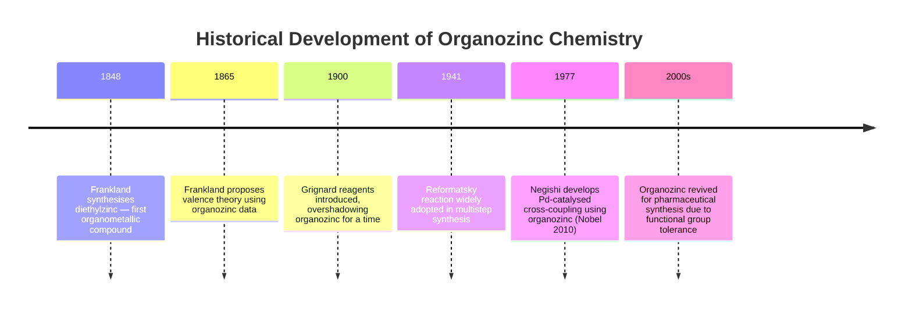
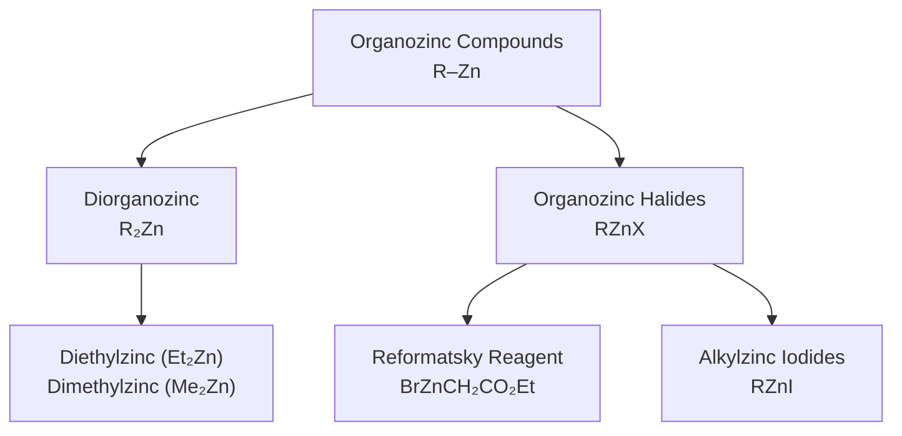
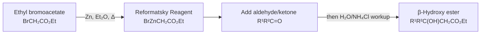
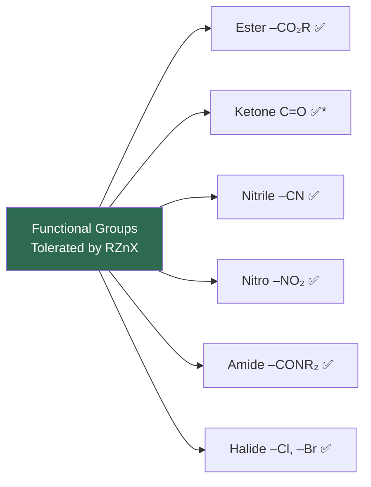
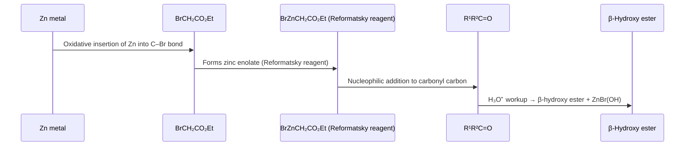
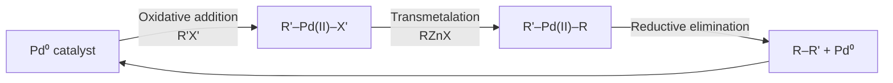

# Organozinc Compounds

---

## Table of Contents

1. [Introduction & Historical Background](#1-introduction--historical-background)
2. [Classification of Organozinc Compounds](#2-classification-of-organozinc-compounds)
3. [Preparation](#3-preparation)
4. [Physical & Chemical Properties](#4-physical--chemical-properties)
5. [Important Reactions](#5-important-reactions)
6. [Uses & Applications](#6-uses--applications)
7. [Comparison with Grignard Reagents](#7-comparison-with-grignard-reagents)
8. [Practice Problems](#8-practice-problems)
9. [References](#9-references)

---

## 1. Introduction & Historical Background

> **Definition:** Organozinc compounds are organometallic species in which one or more carbon atoms are directly bonded to zinc (Zn), forming a **C–Zn bond**.

They represent one of the oldest classes of organometallic compounds in chemistry. Sir **Edward Frankland** first synthesised diethylzinc (Et₂Zn) in **1848** by reacting zinc metal with ethyl iodide — making it the **first true organometallic compound** ever prepared in a laboratory.

$$\text{Zn} + 2\,\text{C}_2\text{H}_5\text{I} \xrightarrow{\Delta} (\text{C}_2\text{H}_5)_2\text{Zn} + \text{ZnI}_2$$

This discovery laid the conceptual groundwork for all organometallic chemistry, predating both Grignard (1900) and organolithium chemistry.

---

## 2. Classification of Organozinc Compounds

Organozinc compounds are broadly divided into two categories:

| Type | General Formula | Example | Key Feature |
|---|---|---|---|
| **Diorganozinc** | R₂Zn | (C₂H₅)₂Zn | Highly reactive, pyrophoric |
| **Organozinc halide** | RZnX | C₂H₅ZnI | Less reactive, easier to handle |
| **Reformatsky reagent** | XZnCH₂CO₂R | BrZnCH₂CO₂Et | α-zinc ester enolate |
| **Organozincate** | R₃Zn⁻ Li⁺ | (C₄H₉)₃ZnLi | Cuprate-like high-order reagent |

---

## 3. Preparation

### 3.1 Direct Synthesis from Zinc Metal and Alkyl Halides

The classical method involves reacting **activated zinc** with an alkyl halide (usually iodide or bromide):

$$\text{Zn} + \text{RI} \xrightarrow{\text{Et}_2\text{O or THF}, \Delta} \text{RZnI}$$

$$2\,\text{Zn} + 2\,\text{RI} \longrightarrow \text{R}_2\text{Zn} + \text{ZnI}_2$$

> **Note:** Zinc is less electropositive than magnesium, so activation of the zinc surface is often necessary. Methods include treatment with I₂, 1,2-dibromoethane, or TMSCl (trimethylsilyl chloride).

**Example — Preparation of diethylzinc:**

$$\text{Zn} + 2\,\text{C}_2\text{H}_5\text{I} \xrightarrow{110\,°\text{C}} (\text{C}_2\text{H}_5)_2\text{Zn} + \text{ZnI}_2$$

The ZnI₂ by-product can be removed by distillation; diethylzinc (bp 118 °C) is collected under inert atmosphere.

---

### 3.2 Transmetalation from Grignard Reagents

A cleaner and more controllable route to diorganozinc:

$$2\,\text{RMgX} + \text{ZnX}_2 \longrightarrow \text{R}_2\text{Zn} + 2\,\text{MgX}_2$$

Or for organozinc halides:

$$\text{RMgX} + \text{ZnX}_2 \longrightarrow \text{RZnX} + \text{MgX}_2$$

This approach allows the Grignard to be made first (where formation is easier), then the metal is exchanged to zinc for greater selectivity.

---

### 3.3 Preparation of the Reformatsky Reagent

The most important organozinc reagent in synthesis — prepared in situ by treating an **α-haloester** with zinc metal:

$$\underbrace{\text{BrCH}_2\text{CO}_2\text{C}_2\text{H}_5}_{\text{Ethyl bromoacetate}} + \text{Zn} \xrightarrow{\text{Et}_2\text{O or THF}} \underbrace{\text{BrZnCH}_2\text{CO}_2\text{C}_2\text{H}_5}_{\text{Reformatsky reagent (zinc enolate)}}$$

---

### 3.4 Hydrozincation of Alkenes

Zinc hydride species (Et₂Zn + iBuNH₂ generates R₂ZnH equivalents) can add across C=C bonds in a syn-selective fashion, useful for making alkyl–zinc species from terminal alkenes.

---

### 3.5 Transmetalation from Organolithium

$$\text{RLi} + \frac{1}{2}\,\text{ZnCl}_2 \longrightarrow \text{RZnCl} + \text{LiCl}$$

This allows organolithium's reactivity to be tamed into the more selective organozinc.

---

## 4. Physical & Chemical Properties

### 4.1 Physical Properties

| Compound | Physical State | Boiling Point | Solubility | Hazard |
|---|---|---|---|---|
| Diethylzinc (Et₂Zn) | Colourless liquid | 118 °C | THF, diethyl ether | **Pyrophoric**, moisture-sensitive |
| Dimethylzinc (Me₂Zn) | Colourless gas/liquid | 46 °C | Hydrocarbons | Pyrophoric, toxic |
| Ethylzinc iodide (EtZnI) | Solid/solution | — | THF, DMF | Moisture-sensitive |
| Reformatsky reagent | Solution in ether | — | Et₂O, THF | Moisture-sensitive |

> ⚠️ **Safety:** Dialkylzincs (R₂Zn) are **spontaneously flammable in air (pyrophoric)**. All operations must be performed under strictly anhydrous, inert gas (N₂ or Ar) conditions using Schlenk techniques.

### 4.2 Electronic Structure

The zinc centre in R₂Zn is **sp-hybridised** with a linear geometry (bond angle R–Zn–R ≈ 180°), unlike the tetrahedral carbon. Zinc is a d¹⁰ metal; the d-orbitals are fully filled and do not participate in bonding, making organozinc compounds more ionic-like than organotransition-metal species.

$$\text{Electronegativity: } \chi(\text{C}) = 2.55, \quad \chi(\text{Zn}) = 1.65$$

The C–Zn bond is **polar covalent** with significant carbanion character (C⁻—Zn²⁺), but less ionic than C–Mg (Grignard) or C–Li bonds.

### 4.3 Stability & Functional Group Tolerance

A critical advantage over Grignard and organolithium reagents:

> *Diorganozincs react slowly with ketones at room temperature without a Lewis acid activator, allowing selective reactions at other positions first.

---

## 5. Important Reactions

### 5.1 The Reformatsky Reaction

The most widely used reaction of organozinc compounds. An α-haloester reacts with zinc and an aldehyde or ketone to give, after aqueous workup, a **β-hydroxy ester**.

**General equation:**

$$\underbrace{\text{R}^1\text{R}^2\text{C=O}}_{\text{carbonyl compound}} + \underbrace{\text{BrCH}_2\text{CO}_2\text{Et}}_{\alpha\text{-bromoester}} + \text{Zn} \xrightarrow{1.\,\text{Et}_2\text{O},\,\Delta \atop 2.\,\text{H}_3\text{O}^+} \underbrace{\text{R}^1\text{R}^2\text{C(OH)–CH}_2\text{CO}_2\text{Et}}_{\beta\text{-hydroxy ester}}$$

**Mechanism:**

**Worked Example:**

Reaction of benzaldehyde with ethyl bromoacetate and zinc:

$$\text{C}_6\text{H}_5\text{CHO} + \text{BrCH}_2\text{CO}_2\text{Et} + \text{Zn} \xrightarrow{1.\,\text{Et}_2\text{O} \atop 2.\,\text{NH}_4\text{Cl}/\text{H}_2\text{O}} \text{C}_6\text{H}_5\text{CH(OH)CH}_2\text{CO}_2\text{Et}$$

Product: **Ethyl 3-hydroxy-3-phenylpropanoate** (a β-hydroxy ester)

**Importance:** The Reformatsky reaction is an atom-economical route to β-hydroxy acids (after hydrolysis) and β-lactones. The zinc enolate is **far less reactive** than the Grignard equivalent (a carbon anion at the α-position of an ester is normally hard to generate without destroying the ester group). Zinc selectively forms the enolate at the α-haloester position without attacking the ester carbonyl, which Grignard reagents would do.

---

### 5.2 Negishi Cross-Coupling

Organozinc halides undergo **palladium-catalysed cross-coupling** with aryl or vinyl halides — the **Negishi coupling** (Nobel Prize in Chemistry, 2010, shared with Heck and Suzuki).

$$\text{RZnX} + \text{R}'\text{X}' \xrightarrow{\text{Pd}(0) \text{ cat.}} \text{R–R}' + \text{ZnXX}'$$

**General catalytic cycle:**

**Example — Synthesis of a biaryl:**

$$\text{4-FC}_6\text{H}_4\text{ZnCl} + \text{PhBr} \xrightarrow{\text{Pd(PPh}_3)_4,\,\text{THF}} \text{4-FC}_6\text{H}_4\text{–Ph} + \text{ZnBrCl}$$

Product: **4-fluorobiphenyl**

> **Why use organozinc over Grignard in cross-coupling?** Organozinc reagents tolerate esters, nitriles, and other electrophilic functional groups. This allows the synthesis of complex, multifunctional biaryl and vinyl compounds that would be destroyed by the more basic Grignard reagents.

---

### 5.3 Nucleophilic Addition to Carbonyls (Direct)

Diorganozinc compounds undergo 1,2-addition to aldehydes (but react sluggishly with ketones without activation):

$$\text{R}_2\text{Zn} + \text{R'CHO} \xrightarrow{} \text{R'CH(OZnR)R} \xrightarrow{\text{H}_3\text{O}^+} \text{R'CH(OH)R}$$

**Catalytic enantioselective addition** using chiral amino alcohols (e.g., DAIB, MIB, or Noyori-type ligands) is one of the most studied reactions in asymmetric synthesis:

$$\text{Et}_2\text{Zn} + \text{PhCHO} \xrightarrow{\text{(–)-DAIB (10 mol\%)}} (R)\text{-1-phenylpropan-1-ol} \quad (>99\%\,ee)$$

This reaction, developed by Noyori and Oguni, provides enantiopure secondary alcohols — pharmaceutically valuable building blocks.

---

### 5.4 Reaction with Acid Chlorides

In the presence of a copper catalyst, organozinc reagents react with acid chlorides to give **ketones** (Fukuyama coupling):

$$\text{RZnI} + \text{R'COCl} \xrightarrow{\text{Pd cat.}} \text{R–CO–R}'$$

Unlike Grignard reagents, the organozinc does not over-add to the ketone product.

---

### 5.5 Reaction with Water (Hydrolysis)

Organozinc compounds react with water, but less vigorously than Grignard reagents:

$$\text{R}_2\text{Zn} + \text{H}_2\text{O} \longrightarrow \text{RH} + \text{Zn(OH)R}$$
$$\text{RZnX} + \text{H}_2\text{O} \longrightarrow \text{RH} + \text{ZnX(OH)}$$

This is why anhydrous solvents and inert atmosphere are required.

---

## 6. Uses & Applications

### 6.1 Reformatsky Reaction in Natural Product Synthesis

The Reformatsky reaction is indispensable in the synthesis of:

| Target | Role of Reformatsky |
|---|---|
| β-Hydroxy acids | Direct precursors after saponification |
| β-Lactones | Via cyclisation of β-hydroxy haloesters |
| Pantothenic acid (Vitamin B₅) | Synthesis via Reformatsky |
| Atorvastatin side chain | β-Hydroxy ester fragment synthesis |
| Chloramphenicol | β-Hydroxy ester as chiral building block |

### 6.2 Negishi Coupling in Pharmaceuticals

Due to the functional group tolerance of organozinc, Negishi coupling is the method of choice for:

- **Losartan** (antihypertensive): biaryl bond formed by Negishi coupling
- **Valsartan** and related angiotensin receptor blockers
- Complex polyene natural products (macrolides, polyketides)

### 6.3 Asymmetric Synthesis

Et₂Zn + chiral ligands → enantioselective carbocycle formation; foundational to modern pharmaceutical asymmetric synthesis (>95% ee routinely achievable).

### 6.4 Historical Role

Frankland's organozinc work in 1848–1865 provided the first experimental evidence for the concept of **valence** — the idea that each element has a fixed combining power. This was the birth of structural organic chemistry.

---

## 7. Comparison with Grignard Reagents

| Property | Grignard (RMgX) | Organozinc (RZnX / R₂Zn) |
|---|---|---|
| **Reactivity** | Higher (more reactive) | Lower (more selective) |
| **Basicity** | High (pKa ~43 for RH) | Moderate |
| **Functional group tolerance** | Poor (attacks esters, nitriles) | Excellent (esters, nitro, CN tolerated) |
| **Cross-coupling** | Kumada coupling (Ni/Pd) | Negishi coupling (Pd) — wider scope |
| **Chiral amplification** | Not applicable | Et₂Zn + chiral ligand → asymmetric |
| **Cost & handling** | Easy to prepare in situ | Requires activated Zn or transmetalation |
| **Water sensitivity** | Violently decomposes | Decomposes, but less violently |
| **Enolate formation** | Deprotonates α to ester? No — adds to C=O | Reformatsky reagent: yes, selectively |

---

## 8. Practice Problems

Problem 1 — Click to reveal

**Q:** Write the product of the Reformatsky reaction between cyclohexanone and ethyl bromoacetate in diethyl ether, followed by acid workup.

**A:**

$$\text{Cyclohexanone} + \text{BrCH}_2\text{CO}_2\text{Et} + \text{Zn} \xrightarrow{1.\,\text{Et}_2\text{O} \atop 2.\,\text{H}_3\text{O}^+} \underbrace{1\text{-hydroxycyclohexane-1-acetic acid ethyl ester}}_{\beta\text{-hydroxy ester}}$$

The product is **ethyl 2-(1-hydroxycyclohexyl)acetate**, with the new C–C bond formed at the α-carbon of the ester.

Problem 2 — Click to reveal

**Q:** Why can diethylzinc add to an aldehyde bearing an ester group without attacking the ester, whereas ethylmagnesium bromide would attack the ester?

**A:**
- Grignard reagents (RMgX) are strong bases and nucleophiles. The ethyl carbanion in EtMgBr is extremely reactive and attacks the most electrophilic carbonyl first — esters have a moderately electrophilic C=O, so addition occurs, giving a tertiary alcohol after over-addition.
- Diethylzinc is a much weaker nucleophile/base. The C–Zn bond is less polar (Zn is more electronegative than Mg: χ(Zn) = 1.65 vs χ(Mg) = 1.31). Et₂Zn reacts selectively with the more reactive aldehyde and tolerates the less reactive ester carbonyl at room temperature.

Problem 3 — Click to reveal

**Q:** Name the reagents and catalyst required for Negishi coupling to form 4-methylbiphenyl from 4-methylphenylzinc chloride and bromobenzene.

**A:**
- Reagent 1: 4-MeC₆H₄ZnCl (4-methylphenylzinc chloride)
- Reagent 2: PhBr (bromobenzene)
- Catalyst: Pd(PPh₃)₄ (tetrakis(triphenylphosphine)palladium(0))
- Solvent: THF, room temperature or mild heating

$$4\text{-MeC}_6\text{H}_4\text{ZnCl} + \text{PhBr} \xrightarrow{\text{Pd(PPh}_3)_4} 4\text{-methylbiphenyl} + \text{ZnClBr}$$

---

## 9. References

1. Frankland, E. (1849). *Notiz über eine neue Reihe organischer Körper, welche Metalle, Phosphor u. s. w. enthalten*. Justus Liebigs Annalen der Chemie, 71(2), 213–216. 
2. Reformatsky, S. (1887). *Neue Synthese zweiatomiger einbasischer Säuren aus den Ketonen*. Berichte der deutschen chemischen Gesellschaft, 20, 1210–1211.
3. Negishi, E. (2002). *Magical Power of Transition Metals: Past, Present, and Future*. Angewandte Chemie Int. Ed., 50, 6738–6764. 
4. Knochel, P., et al. (2001). *Highly Functionalized Organomagnesium Reagents Prepared through Halogen–Metal Exchange*. Angew. Chem. Int. Ed., 40, 2289.
5. Clayden, J.; Greeves, N.; Warren, S. (2012). *Organic Chemistry* (2nd ed.). Oxford University Press. Chapter 46: Organometallic Chemistry.
6. March, J. (1992). *Advanced Organic Chemistry* (4th ed.). Wiley-Interscience.
7. **Online References:**
   - [LibreTexts: Organozinc Compounds](https://chem.libretexts.org/Bookshelves/Organic_Chemistry/Supplemental_Modules_(Organic_Chemistry)/Organometallic_Chemistry/Organozinc_Compounds)
   - [ChemGuide: Grignard & Related Reactions](https://www.chemguide.co.uk/mechanisms/moremech.html)
   - [IUPAC Gold Book: Reformatsky Reaction](https://goldbook.iupac.org/terms/view/R05222)
   - [Nobel Prize 2010 — Negishi](https://www.nobelprize.org/prizes/chemistry/2010/negishi/facts/)

---

*Notes compiled for BUTEX CHEM-103 | Module 12 | © itachi-re 2026*
