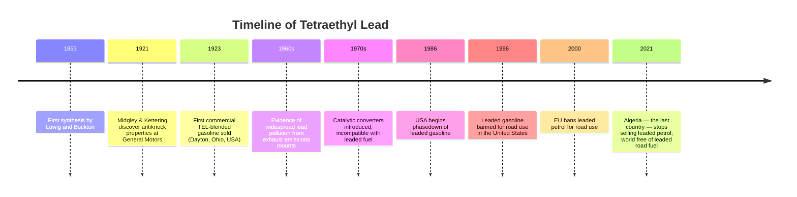
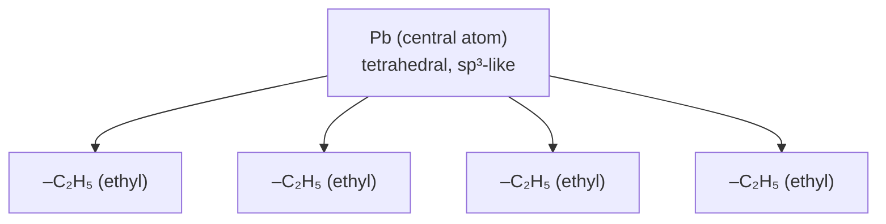
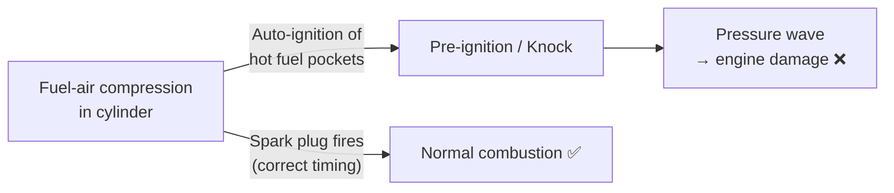
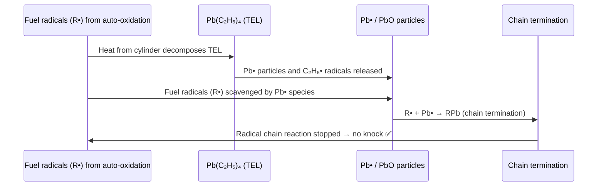
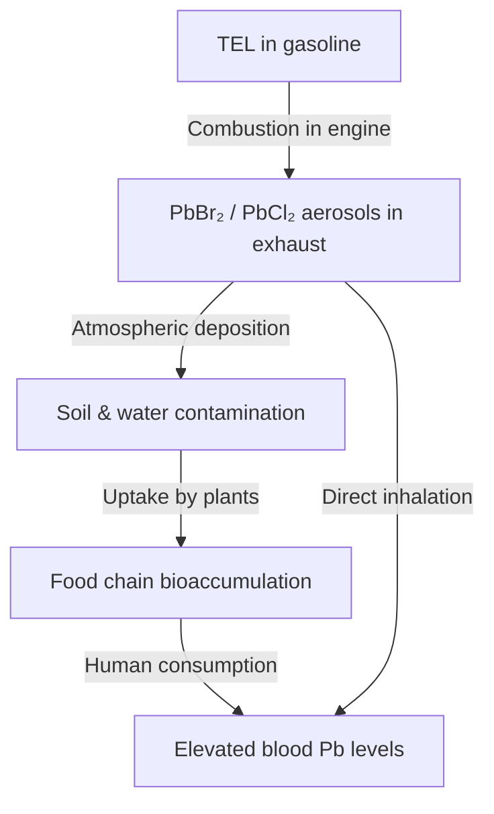

# Tetraethyl Lead (TEL)

[](../README.md)
[]()
[]()
[-red?style=flat-square)]()
[]()

---

## Table of Contents

1. [Introduction & Definition](#1-introduction--definition)
2. [Structure & Physical Properties](#2-structure--physical-properties)
3. [Preparation](#3-preparation)
4. [Chemical Reactions](#4-chemical-reactions)
5. [Mechanism of Antiknock Action](#5-mechanism-of-antiknock-action)
6. [Uses & Applications](#6-uses--applications)
7. [Toxicology & Environmental Impact](#7-toxicology--environmental-impact)
8. [Phase-Out & Alternatives](#8-phase-out--alternatives)
9. [Practice Problems](#9-practice-problems)
10. [References](#10-references)

---

## 1. Introduction & Definition

> **Definition:** Tetraethyl lead (TEL), systematic name **tetraethylplumbane**, is an organolead compound with the molecular formula **Pb(C₂H₅)₄**. It is a colourless, oily liquid that was widely used as a **fuel additive** (antiknock agent) in petrol (gasoline) for most of the 20th century.

**Molecular Formula:** Pb(C₂H₅)₄  
**IUPAC Name:** Tetraethylplumbane  
**Molecular Weight:** 323.44 g/mol  
**CAS Number:** 78-00-2

TEL was first synthesised by **Carl Jacob Löwig** (1853) and later independently by **Georg Buckton** (1853). Its application as an antiknock additive was pioneered by **Thomas Midgley Jr.** and **Charles Kettering** at General Motors in **1921**, marking one of the most commercially significant (and later most controversial) applications of organometallic chemistry.



---

## 2. Structure & Physical Properties

### 2.1 Molecular Structure

TEL has a tetrahedral geometry around the lead centre, with four ethyl groups symmetrically arranged:

```
        C₂H₅
        |
C₂H₅ — Pb — C₂H₅
        |
        C₂H₅
```



- **Bond angle:** C–Pb–C ≈ 109.5° (tetrahedral)
- **C–Pb bond length:** ~2.24 Å
- **Bond type:** Covalent (but weak, BDE ≈ 30 kcal/mol, much weaker than C–C or C–Mg bonds)

### 2.2 Physical Properties

| Property | Value |
|---|---|
| Appearance | Colourless, oily liquid |
| Molecular weight | 323.44 g/mol |
| Density | 1.653 g/mL at 20 °C |
| Melting point | −136 °C |
| Boiling point | 84–85 °C at 15 mmHg; decomposes at ~200 °C at 1 atm |
| Solubility in water | Practically insoluble |
| Solubility in organics | Miscible with gasoline, benzene, ether |
| Vapour pressure | 0.2 mmHg at 20 °C |
| Octane number contribution | +10–15 RON per 0.5 g Pb/L |

> ⚠️ **TEL is extremely toxic** — lethal dose (LD₅₀, rat, oral) ≈ 12.3 mg/kg. It is lipophilic and readily absorbed through skin, lungs, and GI tract.

---

## 3. Preparation

### 3.1 Industrial Method — Lead–Sodium Alloy Process (Primary Method)

The historically dominant industrial synthesis involves reacting a **lead–sodium alloy (NaPb, 1:4 molar ratio)** with **ethyl chloride (chloroethane)**:

**Step 1 — Preparation of Lead–Sodium Alloy:**
$$\text{Na} + \text{Pb} \xrightarrow{\text{molten, 350°C}} \text{NaPb (alloy)}$$

The alloy is typically 10% Na by mass (4 Pb : 1 Na molar ratio).

**Step 2 — Reaction with Ethyl Chloride:**
$$4\,\text{NaPb} + 4\,\text{C}_2\text{H}_5\text{Cl} \xrightarrow{60\!-\!80\,°\text{C}, \text{ autoclave}} \underbrace{\text{Pb}(\text{C}_2\text{H}_5)_4}_{\text{TEL}} + \underbrace{4\,\text{NaCl}}_{\text{salt}} + \underbrace{3\,\text{Pb}}_{\text{recovered lead}}$$

> **Key point:** Note the stoichiometry — 4 moles of NaPb deliver only 4 moles of ethyl groups to **one** Pb atom; the other **3 Pb atoms are recovered** as elemental lead. The Na acts as the electron donor (reductant), while NaPb prevents direct contact of Na metal with ethyl chloride (which would be too violent).

**Step 3 — Separation:**
TEL is steam-distilled from the reaction mixture (it is immiscible with water), dried, and purified.

### 3.2 Grignard Method (Laboratory Scale)

$$2\,\text{PbCl}_2 + 4\,\text{C}_2\text{H}_5\text{MgBr} \xrightarrow{\text{Et}_2\text{O}} \text{Pb}(\text{C}_2\text{H}_5)_4 + \text{Pb} + 4\,\text{MgBrCl}$$

A disproportionation occurs: Pb(II) is both oxidised to Pb(IV, in TEL) and reduced to Pb(0). Less practical industrially due to Grignard reagent cost and scale.

### 3.3 Electrochemical Method

Electrolysis of a Grignard solution using a lead anode:

$$\text{Anode (Pb):} \quad \text{Pb} - 4e^- + 4\,\text{C}_2\text{H}_5^- \longrightarrow \text{Pb}(\text{C}_2\text{H}_5)_4$$

$$\text{Cathode:} \quad 4\,\text{C}_2\text{H}_5\text{MgBr} + 4e^- \longrightarrow 4\,\text{C}_2\text{H}_5^- + 4\,\text{MgBr}^+$$

---

## 4. Chemical Reactions

### 4.1 Thermal Decomposition (Key Reaction)

Upon heating above ~200 °C, TEL undergoes **homolytic C–Pb bond cleavage** to generate **ethyl free radicals**:

$$\text{Pb}(\text{C}_2\text{H}_5)_4 \xrightarrow{\Delta, > 200\,°\text{C}} \text{Pb} + 4\,\text{C}_2\text{H}_5\boldsymbol{\cdot}$$

These ethyl radicals disproportionate or recombine:
$$\text{C}_2\text{H}_5\boldsymbol{\cdot} \longrightarrow \text{C}_2\text{H}_4 + \text{H}\boldsymbol{\cdot}$$
$$\text{H}\boldsymbol{\cdot} + \text{C}_2\text{H}_5\boldsymbol{\cdot} \longrightarrow \text{C}_2\text{H}_6$$

This is the **antiknock mechanism** (see Section 5).

### 4.2 Combustion

Complete combustion of TEL yields carbon dioxide, water, and lead oxide:

$$\text{Pb}(\text{C}_2\text{H}_5)_4 + 13\,\text{O}_2 \longrightarrow \text{PbO} + 8\,\text{CO}_2 + 10\,\text{H}_2\text{O}$$

In practice, the PbO deposits in engines (fouling), which is why **ethylene dibromide (1,2-dibromoethane)** and **ethylene dichloride** were added to commercial leaded fuels as **lead scavengers**:

$$\text{PbO} + \text{CH}_2\text{BrCH}_2\text{Br} \xrightarrow{\Delta} \text{PbBr}_2\,\text{(volatile)} + \text{CH}_2=\text{CH}_2 + \frac{1}{2}\text{O}_2$$

PbBr₂ is volatile and exits the engine as exhaust gas, preventing deposit buildup — at the cost of atmospheric lead pollution.

### 4.3 Reaction with Halogens

TEL reacts with halogens to cleave C–Pb bonds stepwise:

$$\text{Pb}(\text{C}_2\text{H}_5)_4 + \text{Cl}_2 \longrightarrow \text{Pb}(\text{C}_2\text{H}_5)_3\text{Cl} + \text{C}_2\text{H}_5\text{Cl}$$
$$\text{Pb}(\text{C}_2\text{H}_5)_3\text{Cl} + \text{Cl}_2 \longrightarrow \text{Pb}(\text{C}_2\text{H}_5)_2\text{Cl}_2 + \text{C}_2\text{H}_5\text{Cl}$$

Each successive chlorination replaces one ethyl group with chloride, reducing the Pb oxidation state progressively toward Pb(II) and ultimately Pb(IV) compounds.

### 4.4 Reaction with Oxygen (Atmospheric Oxidation)

Slow oxidation in air produces toxic organolead peroxides and eventually lead oxides:

$$\text{Pb}(\text{C}_2\text{H}_5)_4 + \text{O}_2 \longrightarrow \text{Pb}(\text{C}_2\text{H}_5)_3\text{OOC}_2\text{H}_5 \xrightarrow{\text{further}} \text{PbO} + \text{organic fragments}$$

### 4.5 Hydrolysis

TEL is stable to cold water but slowly hydrolyses in the presence of dilute acid or base at elevated temperatures:

$$\text{Pb}(\text{C}_2\text{H}_5)_4 + 4\,\text{H}_2\text{O} \xrightarrow{\text{H}^+, \Delta} \text{Pb}(\text{OH})_4 + 4\,\text{C}_2\text{H}_6$$

Ultimately: $\text{Pb}(\text{OH})_4 \rightarrow \text{PbO}_2 + 2\,\text{H}_2\text{O}$

---

## 5. Mechanism of Antiknock Action

### 5.1 Engine Knocking — The Problem

In a spark-ignition internal combustion engine, the fuel-air mixture should ignite **only** when triggered by the spark plug. **Knocking (pinging)** occurs when the mixture ignites prematurely due to heat and pressure in the cylinder — before the piston reaches top dead centre. Premature ignition creates a pressure wave that opposes piston motion → engine damage and power loss.



Auto-ignition is initiated by **branched free-radical chain reactions** in the unburned fuel ahead of the flame front.

### 5.2 How TEL Prevents Knocking

TEL acts as a **free-radical chain inhibitor (antiknock agent)**:



**Step-by-step mechanism:**
1. TEL decomposes thermally in the hot cylinder: Pb(C₂H₅)₄ → Pb° + 4 C₂H₅•
2. Pb particles oxidise in the combustion environment: Pb + O → PbO
3. Both Pb• radicals and PbO particles **scavenge chain-propagating fuel radicals** (R•, ROO•):
   - R• + Pb → RPb (radical quenched)
   - ROO• + Pb → ROOPb (peroxy radical quenched)
4. Chain branching reactions that lead to auto-ignition are suppressed → no knock.

> **Octane number:** The knock-resistance of a fuel is measured by its **octane number (RON/MON)**. Pure isooctane (2,2,4-trimethylpentane) = RON 100; n-heptane = RON 0. Adding 0.5 g Pb/L as TEL raises RON by approximately 10–15 points.

$$\text{Octane number increase} \approx \frac{k \cdot [\text{Pb}]}{1 + \frac{[\text{Pb}]}{K_{sat}}}$$

where $k$ and $K_{sat}$ are empirical constants (saturation occurs above ~0.8 g/L Pb).

---

## 6. Uses & Applications

### 6.1 Primary Use — Antiknock Additive

TEL was added to automotive gasoline at concentrations of **0.5–4 mL per US gallon** (roughly 0.13–1.06 mL/L):

| Fuel Grade | Pb Content | Octane boost |
|---|---|---|
| Regular leaded | ~0.5 g/L | ~10 RON |
| High-octane "Ethyl" fuel | ~1.0 g/L | ~15–18 RON |
| Aviation gasoline (AVGAS 100LL) | 0.56 g/L | Maintains >100 MON |

> AVGAS 100LL ("low lead") still contains TEL as of 2026 for piston-engine aircraft — the last remaining legitimate application.

### 6.2 Secondary Uses

- **Trimethyllead / Triethyllead compounds** (intermediates) had limited use as marine antifouling agents.
- TEL as a model compound in organolead and heavy metal chemistry research.
- Used as a reference point in the historical development of organometallic chemistry teaching.

---

## 7. Toxicology & Environmental Impact

### 7.1 Toxicity Mechanisms

Lead (Pb²⁺) is a **potent neurotoxin** with no safe blood level. TEL is particularly dangerous because:

1. **High lipophilicity** — readily absorbed through skin, lungs, and mucous membranes without the barrier that inorganic lead salts face.
2. **Metabolic activation** — TEL is converted in the body to **triethyllead (Et₃Pb⁺)**, which is the primary toxic species:
   $$\text{Pb}(\text{C}_2\text{H}_5)_4 \xrightarrow{\text{cytochrome P450}} (\text{C}_2\text{H}_5)_3\text{Pb}^+ \quad\text{(highly toxic cation)}$$
3. Et₃Pb⁺ disrupts **calcium metabolism**, **mitochondrial function**, and **neurotransmitter release**.

### 7.2 Health Effects

| Exposure Level (blood Pb) | Effects |
|---|---|
| >10 µg/dL (children) | Cognitive impairment, reduced IQ |
| >25 µg/dL | Behavioural problems, learning disabilities |
| >45 µg/dL | Acute neurological symptoms |
| >70 µg/dL | Encephalopathy, seizures, death |

### 7.3 Environmental Contamination



Between 1923 and 1986, over **7 million tons** of lead were introduced into the environment through leaded gasoline combustion. Studies (Nevin, 2000; Stretesky & Lynch, 2001) found strong correlations between atmospheric lead levels and violent crime rates 20 years later — suggesting that childhood lead poisoning from TEL contributed significantly to the mid-20th-century crime wave.

---

## 8. Phase-Out & Alternatives

### 8.1 Timeline of Global Phase-Out

| Country/Region | Year of Ban (road fuel) |
|---|---|
| Japan | 1987 |
| USA | 1996 |
| European Union | 2000 |
| China | 2000 |
| India | 2000 |
| Most of Africa | 2000–2006 |
| Algeria (last country) | 2021 |

### 8.2 Alternatives to TEL

| Alternative | Chemical | Mechanism | Notes |
|---|---|---|---|
| **MTBE** (Methyl tert-butyl ether) | (CH₃)₃COCH₃ | Raises octane, oxygen-bearing | Groundwater contamination risk |
| **Ethanol** | C₂H₅OH | High octane (RON 108), renewable | Standard in E10–E85 blends |
| **ETBE** | Ethyl tert-butyl ether | Octane booster from ethanol | Used in EU |
| **MMT** | Methylcyclopentadienyl Mn tricarbonyl | Mn-based radical scavenger | Used in Canada; health concerns |
| **Alkylates** (isooctane) | 2,2,4-Trimethylpentane | Inherently high octane | Expensive; used in premium fuel |
| **Aromatics** (toluene, xylene) | C₇–C₈ aromatics | High octane | Carcinogenic (benzene); regulated |

> **Engine design adaptation:** Modern engines use valve seat inserts (hardened steel) to compensate for the lubricating effect that PbO deposits provided in older engines — TEL had a secondary role as a valve seat lubricant, which was lost when leaded fuel was phased out.

---

## 9. Practice Problems

<details>
<summary>Problem 1 — Click to reveal</summary>

**Q:** Balance the reaction for the industrial preparation of TEL from lead–sodium alloy and ethyl chloride. How many moles of ethyl chloride are required to produce 1 mole of TEL?

**A:**

$$4\,\text{NaPb} + 4\,\text{C}_2\text{H}_5\text{Cl} \longrightarrow \text{Pb}(\text{C}_2\text{H}_5)_4 + 4\,\text{NaCl} + 3\,\text{Pb}$$

**4 moles** of ethyl chloride are required per mole of TEL. Note that NaPb is used in a 1:1 ratio with C₂H₅Cl, but 3 of the 4 lead atoms are recovered as Pb(0) — only 1 lead ends up in TEL.

</details>

<details>
<summary>Problem 2 — Click to reveal</summary>

**Q:** Explain why TEL was added together with 1,2-dibromoethane to leaded gasoline formulations.

**A:**
- Combustion of TEL produces PbO (a solid), which deposits on engine components (valves, spark plugs, piston tops), causing fouling.
- 1,2-Dibromoethane (BrCH₂CH₂Br) acts as a **lead scavenger**: it reacts with PbO in the hot exhaust gases to form **lead bromide (PbBr₂)**, which is volatile at combustion temperatures and exits the engine with the exhaust:
  $$\text{PbO} + \text{BrCH}_2\text{CH}_2\text{Br} \longrightarrow \text{PbBr}_2 + \text{CH}_2=\text{CH}_2 + \frac{1}{2}\text{O}_2$$
- This prevents engine deposits but releases lead aerosols (PbBr₂) into the atmosphere — a major source of environmental lead contamination.

</details>

<details>
<summary>Problem 3 — Click to reveal</summary>

**Q:** If a fuel has an octane number of 82 (RON), and addition of TEL at 0.5 g Pb/L increases it by 12 RON, what is the new octane number? Is this within the range of standard regular unleaded petrol (RON 91–95)?

**A:**

New RON = 82 + 12 = **94 RON**

Yes, 94 RON falls within the standard regular/premium unleaded range (RON 91–95 in most markets). This illustrates why TEL was commercially successful: cheap trace additions could upgrade low-quality base fuels to commercially viable grades without costly refinery work.

</details>

---

## 10. References

1. Midgley, T., Jr.; Boyd, T.A. (1922). *Detonation Characteristics of Some Blended Fuels*. Industrial & Engineering Chemistry, 14(9), 848–853.
2. Lowig, C. (1853). *Über die Verbindungen des Bleies mit den Radikalen der Alkohole*. Annalen der Chemie, 88, 318–322.
3. Nriagu, J.O. (1990). *The rise and fall of leaded gasoline*. Science of the Total Environment, 92, 13–28. [90318--O-blue?style=flat-square)](https://doi.org/10.1016/0048-9697(90)90318-O)
4. Nevin, R. (2000). *How lead exposure relates to temporal changes in IQ, violent crime, and unwed pregnancy*. Environmental Research, 83(1), 1–22.
5. Kovarik, B. (1994). *Charles F. Kettering and the 1921 discovery of tetraethyl lead*. Society of Automotive Engineers Technical Paper 940766.
6. Clayden, J.; Greeves, N.; Warren, S. (2012). *Organic Chemistry* (2nd ed.). Oxford University Press. Chapters 12, 46.
7. **Online References:**
   - [UNEP: Global Phase-Out of Leaded Gasoline](https://www.unep.org/news-and-stories/press-release/leaded-petrol-eliminated-huge-boost-global-health-environment)
   - [PubChem: Tetraethyllead](https://pubchem.ncbi.nlm.nih.gov/compound/Tetraethyllead)
   - [EPA: Lead in Aviation Fuel](https://www.epa.gov/regulations-emissions-vehicles-and-engines/how-epa-regulates-fuels-and-fuel-additives)
   - [LibreTexts: Organolead Chemistry](https://chem.libretexts.org/Bookshelves/Organic_Chemistry/Supplemental_Modules_(Organic_Chemistry)/Organometallic_Chemistry)
   - [WHO: Lead poisoning and health](https://www.who.int/news-room/fact-sheets/detail/lead-poisoning-and-health)

---

*Notes compiled for BUTEX CHEM-103 | Module 12 | © itachi-re 2026*
