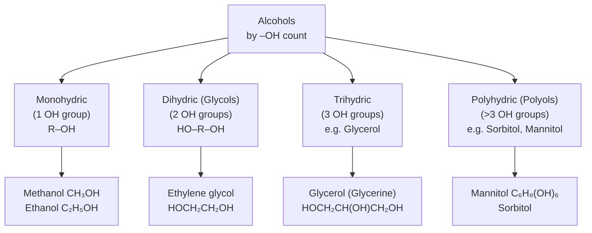
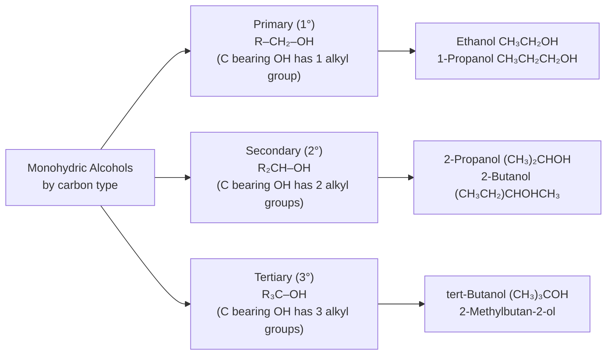
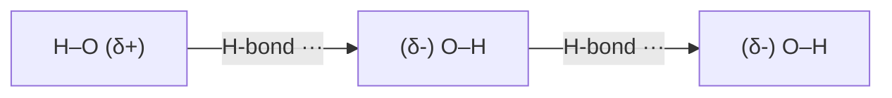
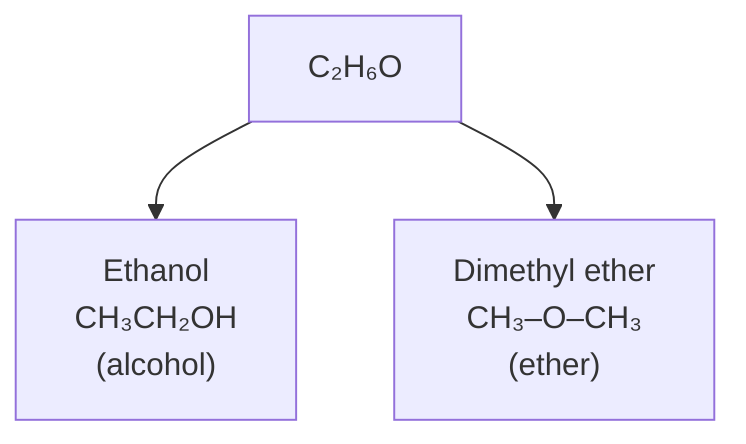
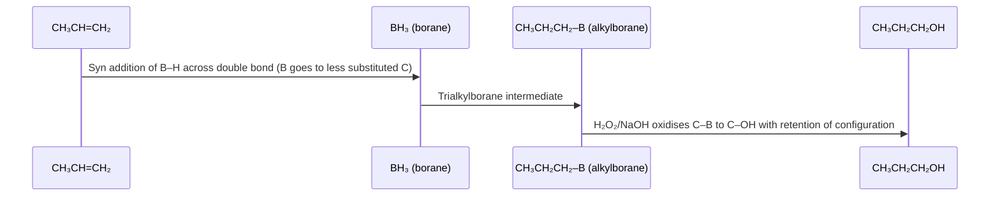
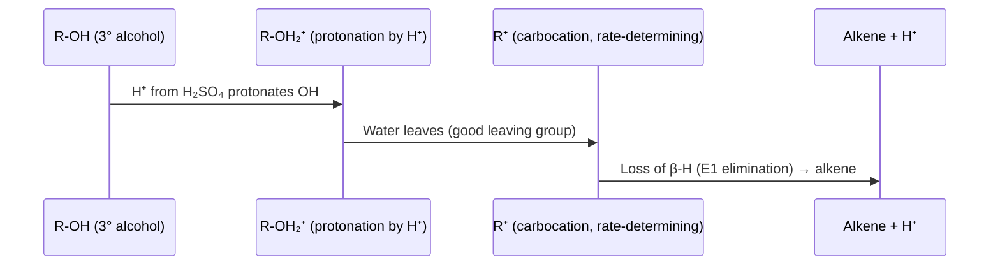
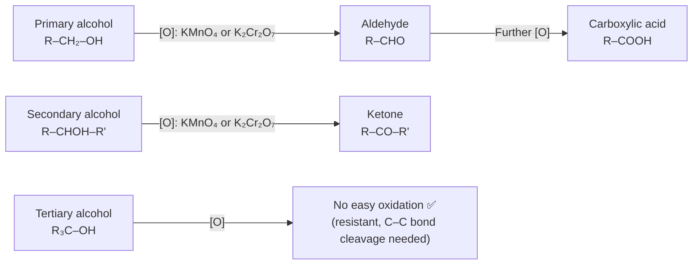

# Hydroxy Compounds — Alcohols

[](../README.md)
[]()
[]()
[]()

---

## Table of Contents

1. [Introduction & Definition](#1-introduction--definition)
2. [Classification](#2-classification)
3. [Nomenclature (IUPAC)](#3-nomenclature-iupac)
4. [Structure of Alcohols](#4-structure-of-alcohols)
5. [Isomerism](#5-isomerism)
6. [General Methods of Preparation](#6-general-methods-of-preparation)
7. [Reactions of Aliphatic Alcohols](#7-reactions-of-aliphatic-alcohols)
8. [Reactions of Aromatic Alcohols](#8-reactions-of-aromatic-alcohols)
9. [Important Tests for Alcohols](#9-important-tests-for-alcohols)
10. [Practice Problems](#10-practice-problems)
11. [References](#11-references)

---

## 1. Introduction & Definition

> **Definition:** Alcohols are organic compounds containing one or more **hydroxyl (–OH) groups** bonded to a **saturated (sp³) carbon atom**. The general formula for monohydric aliphatic alcohols is **CₙH₂ₙ₊₁OH** (or **R–OH**).

Alcohols are the **oxygen analogues of water** (H₂O → ROH by replacing one H with an alkyl group). This relationship explains many of their physical properties — particularly the hydrogen bonding that gives them unusually high boiling points for their molecular masses.

**General formula:** R–OH  
Where R = alkyl or substituted alkyl group.

**Examples:**
- CH₃OH — Methanol (methyl alcohol)
- C₂H₅OH — Ethanol (ethyl alcohol)
- (CH₃)₂CHOH — Isopropanol (propan-2-ol)

---

## 2. Classification

Alcohols are classified in two major ways:

### 2.1 By the Number of –OH Groups (Degree of Hydroxylation)



### 2.2 By the Degree of Substitution at the C–OH Carbon



**Structural representations:**

| Type | General Structure | Example |
|---|---|---|
| **Primary (1°)** | R–CH₂–OH | Ethanol: CH₃CH₂OH |
| **Secondary (2°)** | R–CH(OH)–R' | Propan-2-ol: CH₃CHOHCH₃ |
| **Tertiary (3°)** | R₃C–OH | 2-Methylpropan-2-ol: (CH₃)₃COH |

### 2.3 Aliphatic vs Aromatic Alcohols

| Type | Feature | Example |
|---|---|---|
| **Aliphatic alcohol** | –OH on non-aromatic carbon | Ethanol, cyclohexanol |
| **Aromatic alcohol** | –OH on aliphatic carbon attached to an aromatic ring | Benzyl alcohol (PhCH₂OH) |
| **Phenol** (NOT alcohol) | –OH directly on aromatic ring | C₆H₅OH (separate topic) |

---

## 3. Nomenclature (IUPAC)

**IUPAC Rules:**
1. Select the **longest continuous carbon chain** containing the –OH group.
2. Number the chain from the end **closest to the –OH group**.
3. Replace the terminal **-e** of the parent alkane name with **-ol**.
4. Indicate the position of –OH with a locant.

**General naming pattern:** [locant]-[parent chain]-[branching]-ol

### 3.1 Worked Examples

| Structure | IUPAC Name | Common Name |
|---|---|---|
| CH₃OH | Methanol | Methyl alcohol, Wood spirit |
| CH₃CH₂OH | Ethanol | Ethyl alcohol, Grain alcohol |
| CH₃CH₂CH₂OH | Propan-1-ol | n-Propyl alcohol |
| CH₃CHOHCH₃ | Propan-2-ol | Isopropyl alcohol |
| (CH₃)₃COH | 2-Methylpropan-2-ol | tert-Butyl alcohol |
| HOCH₂CH₂OH | Ethane-1,2-diol | Ethylene glycol |
| HOCH₂CH(OH)CH₂OH | Propane-1,2,3-triol | Glycerol / Glycerine |
| C₆H₅CH₂OH | Phenylmethanol | Benzyl alcohol |

**Example — Naming a branched alcohol:**

$$\text{CH}_3\text{CH(CH}_3)\text{CH(OH)CH}_3$$

- Longest chain with OH: 4 carbons → **butane**
- OH on C2 → **butan-2-ol**
- Methyl on C3 → **3-methylbutan-2-ol**

---

## 4. Structure of Alcohols

### 4.1 Electronic Structure

The carbon bearing the –OH group is **sp³-hybridised** (tetrahedral). The oxygen atom is also sp³-hybridised with **two lone pairs**:

```
     H               H
     |               |
 H–C–O–H   →  H–C–Ö–H   (O has 2 lone pairs, bent)
     |               |
     H               H
   Methanol
```

- **C–O bond length:** ~1.43 Å
- **O–H bond length:** ~0.96 Å
- **C–O–H bond angle:** ~108.5° (slightly less than tetrahedral due to lone pair repulsion)

### 4.2 Hydrogen Bonding — The Reason Alcohols Have High Boiling Points

Alcohols form **intermolecular hydrogen bonds** (O–H···O):

$$\text{R–O–H} \cdots \underset{\text{lone pair}}{\text{O}}\text{–R'} \quad \Delta H_{H\text{-bond}} \approx 20\text{–25 kJ/mol}$$



**Consequence — Boiling points:**

| Compound | MW (g/mol) | BP (°C) | Reason |
|---|---|---|---|
| n-Butane (CH₃CH₂CH₂CH₃) | 58 | –1 | No H-bonding |
| Diethyl ether (C₂H₅OC₂H₅) | 74 | 34.6 | Weak H-bond acceptor only |
| **Propan-1-ol** (C₃H₇OH) | 60 | **97** | Strong H-bonding |
| Water (H₂O) | 18 | 100 | Extensive H-bonding |

Even though propanol has a much higher MW than water, their boiling points are nearly the same — evidence of strong H-bonding in alcohols.

### 4.3 Acidity of Alcohols

Alcohols are **weakly acidic** (pKₐ ≈ 15–19), much weaker than carboxylic acids (pKₐ ≈ 4–5) but can donate protons to very strong bases:

$$\text{ROH} + \text{NaH} \longrightarrow \text{RONa} + \text{H}_2\uparrow$$
$$\text{ROH} + \text{Na} \longrightarrow \text{RONa} + \frac{1}{2}\,\text{H}_2\uparrow$$

**Order of acidity (decreasing):**
$$\text{H}_2\text{O} > 1° \text{ ROH} > 2° \text{ ROH} > 3° \text{ ROH}$$

**pKₐ values (approximate):**
- Water: 15.7
- Methanol: 15.5
- Ethanol: 15.9
- Propan-2-ol: 17.1
- tert-Butanol: 19.0

Tertiary alcohols are **less acidic** than primary alcohols because the alkyl groups (electron-donating by induction) destabilise the resulting alkoxide anion (RO⁻).

---

## 5. Isomerism

Alcohols with the same molecular formula can exist as several structural isomers.

### 5.1 Chain Isomerism

Variation in the carbon skeleton:

**C₅H₁₁OH (pentan-1-ol and isomers):**
- Pentan-1-ol: CH₃CH₂CH₂CH₂CH₂OH
- 3-Methylbutan-1-ol: (CH₃)₂CHCH₂CH₂OH
- 2-Methylbutan-1-ol: CH₃CH(CH₃)CH₂CH₂OH (and further)

### 5.2 Position Isomerism

Same carbon skeleton, –OH at different positions:

**C₃H₇OH:**
- Propan-1-ol: CH₃CH₂CH₂OH (–OH on C1)
- Propan-2-ol: CH₃CHOHCH₃ (–OH on C2)

**C₄H₉OH (four structural isomers):**
1. Butan-1-ol: CH₃CH₂CH₂CH₂OH (1°)
2. Butan-2-ol: CH₃CHOHCH₂CH₃ (2°)
3. 2-Methylpropan-1-ol: (CH₃)₂CHCH₂OH (1°)
4. 2-Methylpropan-2-ol: (CH₃)₃COH (3°)

### 5.3 Functional Group Isomerism

Alcohols are functional group isomers of **ethers** (R–O–R'):

| Alcohol | Molecular Formula | Ether Isomer |
|---|---|---|
| Ethanol CH₃CH₂OH | C₂H₆O | Dimethyl ether CH₃OCH₃ |
| Propan-1-ol | C₃H₈O | Methyl ethyl ether CH₃OC₂H₅ |



---

## 6. General Methods of Preparation

### 6.1 Hydration of Alkenes

**Acid-catalysed (Markovnikov addition):**

$$\text{CH}_2=\text{CH}_2 + \text{H}_2\text{O} \xrightarrow{\text{H}_3\text{PO}_4\text{ or H}_2\text{SO}_4,\, 300\,°\text{C}} \text{CH}_3\text{CH}_2\text{OH}$$

$$\text{CH}_3\text{CH}=\text{CH}_2 + \text{H}_2\text{O} \xrightarrow{\text{H}^+} \underbrace{\text{CH}_3\text{CH(OH)CH}_3}_{\text{2-propanol (Markovnikov)}}$$

**Hydroboration–oxidation (Anti-Markovnikov, syn addition):**

$$\text{CH}_3\text{CH}=\text{CH}_2 \xrightarrow{1.\,\text{B}_2\text{H}_6 \atop 2.\,\text{H}_2\text{O}_2\text{/NaOH}} \underbrace{\text{CH}_3\text{CH}_2\text{CH}_2\text{OH}}_{\text{1-propanol (anti-Markovnikov)}}$$

Mechanism of hydroboration-oxidation:



### 6.2 From Alkyl Halides — Nucleophilic Substitution (SN2)

$$\text{RX} + \text{NaOH (aq)} \xrightarrow{\Delta} \text{ROH} + \text{NaX}$$

**Example:**

$$\text{CH}_3\text{Br} + \text{NaOH} \xrightarrow{\text{H}_2\text{O}, \Delta} \text{CH}_3\text{OH} + \text{NaBr}$$

Primary halides react well; tertiary halides undergo elimination (E2) preferentially.

### 6.3 Reduction of Carbonyl Compounds

**Aldehydes → Primary alcohols:**

$$\text{RCHO} + 2[\text{H}] \xrightarrow{\text{NaBH}_4 \text{ or LiAlH}_4} \text{RCH}_2\text{OH}$$

**Ketones → Secondary alcohols:**

$$\text{R–CO–R}' + 2[\text{H}] \xrightarrow{\text{NaBH}_4 \text{ or LiAlH}_4} \text{R–CHOH–R}'$$

**Carboxylic acids → Primary alcohols (LiAlH₄ only):**

$$\text{RCOOH} + 4[\text{H}] \xrightarrow{\text{LiAlH}_4, \text{ then H}_3\text{O}^+} \text{RCH}_2\text{OH} + \text{H}_2\text{O}$$

> NaBH₄ cannot reduce carboxylic acids directly; LiAlH₄ can reduce all carbonyls.

### 6.4 Grignard Synthesis (Most Versatile Method)

$$\text{RMgX} + \underset{\text{formaldehyde}}{\text{HCHO}} \xrightarrow{1.\,\text{Et}_2\text{O} \atop 2.\,\text{H}_3\text{O}^+} \text{RCH}_2\text{OH} \quad (1°\text{ alcohol})$$

$$\text{RMgX} + \underset{\text{aldehyde}}{\text{R'CHO}} \xrightarrow{1.\,\text{Et}_2\text{O} \atop 2.\,\text{H}_3\text{O}^+} \text{R–CHOHR}' \quad (2°\text{ alcohol})$$

$$\text{RMgX} + \underset{\text{ketone}}{\text{R'COR}''} \xrightarrow{1.\,\text{Et}_2\text{O} \atop 2.\,\text{H}_3\text{O}^+} \text{R–C(OH)(R')(R}'')\quad (3°\text{ alcohol})$$

**Worked Example — 3-Methylpentan-3-ol via Grignard:**

$$\underbrace{\text{CH}_3\text{CH}_2\text{MgBr}}_{\text{ethylmagnesium bromide}} + \underbrace{\text{CH}_3\text{COCH}_2\text{CH}_3}_{\text{pentan-3-one}} \xrightarrow{1.\,\text{Et}_2\text{O} \atop 2.\,\text{NH}_4\text{Cl/H}_2\text{O}} \underbrace{(\text{CH}_3)(\text{C}_2\text{H}_5)_2\text{COH}}_{\text{3-methylpentan-3-ol}}$$

### 6.5 Fermentation (Industrial — Ethanol)

$$\underbrace{\text{C}_6\text{H}_{12}\text{O}_6}_{\text{glucose}} \xrightarrow{\text{zymase (yeast)}, 25\text{–}30\,°\text{C}} 2\,\underbrace{\text{C}_2\text{H}_5\text{OH}}_{\text{ethanol}} + 2\,\text{CO}_2\uparrow$$

> Fermentation produces max ~14–15% ethanol (yeast die above this concentration). Absolute ethanol (>99.5%) requires molecular sieves or azeotropic distillation, since the ethanol–water azeotrope is 95.6% EtOH at 78.1 °C.

### 6.6 Industrial Synthesis of Methanol (Syngas Process)

$$\text{CO} + 2\,\text{H}_2 \xrightarrow{\text{Cu/ZnO/Al}_2\text{O}_3,\,250\,°\text{C},\,50\,\text{atm}} \text{CH}_3\text{OH}$$

Methanol is produced on 80 million tonne/year scale via this catalytic route. Syngas (CO + H₂) is derived from steam reforming of natural gas.

---

## 7. Reactions of Aliphatic Alcohols

### 7.1 Reaction with Active Metals (Na, K, Al)

Alcohols react with alkali metals to produce **metal alkoxides** and **hydrogen gas**:

$$2\,\text{ROH} + 2\,\text{Na} \longrightarrow 2\,\text{RONa} + \text{H}_2\uparrow$$

**Order of reactivity (with Na):** 1° > 2° > 3°  
(Tertiary alkoxides are more sterically hindered and less acidic → slower reaction)

**Specific example:**
$$2\,\text{C}_2\text{H}_5\text{OH} + 2\,\text{Na} \longrightarrow 2\,\text{C}_2\text{H}_5\text{ONa}\,\text{(sodium ethoxide)} + \text{H}_2\uparrow$$

Sodium ethoxide is a strong base used in Claisen condensations and Williamson ether synthesis.

---

### 7.2 Dehydration (Elimination)

Controlled by temperature with concentrated H₂SO₄ (or H₃PO₄):

**At 170 °C → Alkene (intramolecular, E1):**

$$\text{CH}_3\text{CH}_2\text{OH} \xrightarrow{\text{conc. H}_2\text{SO}_4,\,170\,°\text{C}} \text{CH}_2\text{=CH}_2\uparrow + \text{H}_2\text{O}$$

**At 140 °C → Ether (intermolecular, SN2):**

$$2\,\text{CH}_3\text{CH}_2\text{OH} \xrightarrow{\text{conc. H}_2\text{SO}_4,\,140\,°\text{C}} \underbrace{\text{C}_2\text{H}_5\text{–O–C}_2\text{H}_5}_{\text{diethyl ether}} + \text{H}_2\text{O}$$

**Mechanism of alkene formation (E1 pathway with 3° alcohol):**



**Zaitsev's rule** governs which alkene is major: the **more substituted** (more stable) alkene is the major product.

$$\underbrace{\text{CH}_3\text{CH}_2\text{CHOH(CH}_3)}_{\text{butan-2-ol}} \xrightarrow{\text{H}_2\text{SO}_4, \Delta} \underbrace{\text{CH}_3\text{CH=CHCH}_3}_{\text{but-2-ene (major, Zaitsev)}} + \underbrace{\text{CH}_3\text{CH}_2\text{CH=CH}_2}_{\text{but-1-ene (minor)}}$$

---

### 7.3 Oxidation Reactions

The most important diagnostic reaction of alcohols:



**Controlled oxidation of 1° alcohol to aldehyde (avoiding over-oxidation):**

$$\text{RCH}_2\text{OH} \xrightarrow{\text{PCC (pyridinium chlorochromate),}\, \text{CH}_2\text{Cl}_2} \text{RCHO}$$

PCC is mild enough to stop at the aldehyde stage; KMnO₄/H₂SO₄ or K₂Cr₂O₇/H₂SO₄ would over-oxidise to the carboxylic acid.

**Oxidation of 2° alcohols to ketones:**

$$\underbrace{(\text{CH}_3)_2\text{CHOH}}_{\text{propan-2-ol}} \xrightarrow{\text{K}_2\text{Cr}_2\text{O}_7\text{/H}_2\text{SO}_4} \underbrace{(\text{CH}_3)_2\text{C=O}}_{\text{acetone (propanone)}} $$

**Half-equations (for K₂Cr₂O₇, acidic medium):**

$$\text{Cr}_2\text{O}_7^{2-} + 14\,\text{H}^+ + 6e^- \longrightarrow 2\,\text{Cr}^{3+} + 7\,\text{H}_2\text{O}$$
$$\text{R–CHOH–R}' \longrightarrow \text{R–CO–R}' + 2\,\text{H}^+ + 2e^-$$

**Overall (×3 alcohol for every Cr₂O₇²⁻):**
$$3\,\text{R–CHOH–R}' + \text{Cr}_2\text{O}_7^{2-} + 8\,\text{H}^+ \longrightarrow 3\,\text{R–CO–R}' + 2\,\text{Cr}^{3+} + 7\,\text{H}_2\text{O}$$

---

### 7.4 Esterification (Fischer–Speier)

Alcohols react with carboxylic acids in the presence of an acid catalyst (H₂SO₄, H₃PO₄, or p-TsOH) to form **esters**:

$$\text{ROH} + \text{R'COOH} \underset{\Delta}{\overset{\text{H}^+}\rightleftharpoons} \underbrace{\text{R'COOR}}_{\text{ester}} + \text{H}_2\text{O}$$

This is an **equilibrium reaction**; Le Chatelier's principle is used to drive it forward (excess alcohol or acid, remove water by distillation).

**Example — Ethyl ethanoate (ethyl acetate):**

$$\text{CH}_3\text{COOH} + \text{C}_2\text{H}_5\text{OH} \underset{\Delta}{\overset{\text{H}_2\text{SO}_4}\rightleftharpoons} \underbrace{\text{CH}_3\text{COOC}_2\text{H}_5}_{\text{ethyl acetate}} + \text{H}_2\text{O}$$

> **¹⁸O-labelling studies** (Bender, 1951) proved that the C–O bond of the **acid** is broken, not the C–O bond of the alcohol:
> $$\text{CH}_3\text{C(=O)}\underset{\downarrow}{\text{OH}} + \text{H–O–Et} \longrightarrow \text{CH}_3\text{COOEt} + \text{H}_2^{18}\text{O}$$
> (¹⁸O ends up in the water product)

---

### 7.5 Reaction with Halogenating Agents

Conversion of alcohols to **alkyl halides** — replacement of –OH by halide (X = Cl, Br, I):

**Using HX (hydrogen halides):**
$$\text{ROH} + \text{HX} \longrightarrow \text{RX} + \text{H}_2\text{O}$$

**Reactivity order of HX:** HI > HBr > HCl  
**Reactivity order of ROH:** 3° > 2° > 1°

**Using PCl₃:**
$$3\,\text{ROH} + \text{PCl}_3 \longrightarrow 3\,\text{RCl} + \text{H}_3\text{PO}_3$$

**Using PCl₅:**
$$\text{ROH} + \text{PCl}_5 \longrightarrow \text{RCl} + \text{POCl}_3 + \text{HCl}$$

**Using SOCl₂ (thionyl chloride — preferred for clean reactions):**
$$\text{ROH} + \text{SOCl}_2 \xrightarrow{\text{pyridine}} \text{RCl} + \text{SO}_2\uparrow + \text{HCl}\uparrow$$

SOCl₂ is preferred because the by-products (SO₂ and HCl) are **gases** that leave the reaction mixture, driving the reaction to completion; no aqueous workup contamination.

**Lucas Test (for distinguishing 1°, 2°, 3° alcohols):**

$$\text{ROH} + \underbrace{\text{ZnCl}_2 + \text{HCl}}_{\text{Lucas reagent}} \longrightarrow \text{RCl (insoluble, cloudy)} + \text{H}_2\text{O}$$

| Alcohol Type | Observation with Lucas Reagent | Time |
|---|---|---|
| Tertiary (3°) | Immediate turbidity (cloudiness) | < 5 min |
| Secondary (2°) | Turbidity after 5–10 min with warming | 5–10 min |
| Primary (1°) | No turbidity at room temperature | No reaction (or very slow) |

---

### 7.6 Dehydrogenation

Over a copper catalyst at ~300 °C, alcohols undergo catalytic dehydrogenation:

**Primary alcohol → Aldehyde:**
$$\text{RCH}_2\text{OH} \xrightarrow{\text{Cu, 300°C}} \text{RCHO} + \text{H}_2\uparrow$$

**Secondary alcohol → Ketone:**
$$\text{R–CHOH–R}' \xrightarrow{\text{Cu, 300°C}} \text{R–CO–R}' + \text{H}_2\uparrow$$

This is the basis of the **industrial production of formaldehyde** from methanol (Cu/Ag catalyst).

### 7.7 Reaction with Phosphorus Pentoxide (P₂O₅)

Dehydrating agent; converts alcohols to alkenes or ethers at elevated temperatures:

$$2\,\text{C}_2\text{H}_5\text{OH} \xrightarrow{\text{P}_2\text{O}_5} \text{C}_2\text{H}_5\text{–O–C}_2\text{H}_5 + \text{H}_2\text{O}$$

---

## 8. Reactions of Aromatic Alcohols

### 8.1 Benzyl Alcohol (Phenylmethanol, C₆H₅CH₂OH)

Benzyl alcohol is the simplest **aromatic alcohol** — the –OH is on a CH₂ group attached to the benzene ring, NOT directly on the ring (that would be phenol).

**Structure:**
$$\text{C}_6\text{H}_5\text{–CH}_2\text{–OH}$$

#### 8.1.1 Oxidation

Benzyl alcohol undergoes **benzylic oxidation** to benzaldehyde and further to benzoic acid:

$$\text{C}_6\text{H}_5\text{CH}_2\text{OH} \xrightarrow{\text{MnO}_2 \text{ or PCC}} \text{C}_6\text{H}_5\text{CHO} \xrightarrow{\text{KMnO}_4} \text{C}_6\text{H}_5\text{COOH}$$

The benzylic position is activated toward oxidation due to resonance stabilisation of the intermediate radical.

#### 8.1.2 Esterification

$$\text{C}_6\text{H}_5\text{CH}_2\text{OH} + \text{CH}_3\text{COOH} \xrightarrow{\text{H}^+} \underbrace{\text{C}_6\text{H}_5\text{CH}_2\text{OOCCH}_3}_{\text{benzyl acetate}} + \text{H}_2\text{O}$$

Benzyl acetate is used as a fragrance compound (jasmine-like scent).

#### 8.1.3 Hydrogenolysis (Cbz deprotection in peptide chemistry)

$$\text{C}_6\text{H}_5\text{CH}_2\text{OH} + \text{H}_2 \xrightarrow{\text{Pd/C}} \text{C}_6\text{H}_6 + \text{CH}_3\text{OH}$$

The benzyl group (Cbz or Z) is widely used as an **amine protecting group** in peptide synthesis, removed cleanly by hydrogenolysis.

#### 8.1.4 Electrophilic Aromatic Substitution (EAS)

The benzene ring of benzyl alcohol still undergoes EAS (nitration, halogenation, sulfonation), but the –CH₂OH substituent is weakly deactivating (electron-withdrawing through induction but not directly attached) → meta-directing:

$$\text{C}_6\text{H}_5\text{CH}_2\text{OH} + \text{HNO}_3/\text{H}_2\text{SO}_4 \longrightarrow \underbrace{\text{m-O}_2\text{NC}_6\text{H}_4\text{CH}_2\text{OH}}_{\text{3-nitrobenzyl alcohol (major)}}$$

---

## 9. Important Tests for Alcohols

| Test | Reagents | Observation | What it detects |
|---|---|---|---|
| **Lucas Test** | ZnCl₂ + conc. HCl | Immediate cloudiness = 3°; after 5 min = 2°; no change = 1° | Degree (1°/2°/3°) |
| **Iodoform Test** | I₂ + NaOH (warm) | Yellow precipitate CHI₃ (iodoform) | CH₃CH(OH)– structure (ethanol, 2° Me ketones) |
| **Ceric Ammonium Nitrate (CAN)** | (NH₄)₂Ce(NO₃)₆ in HNO₃ | Red/orange colour → positive for –OH | Presence of –OH group |
| **Esterification** | Acetic anhydride or acetyl chloride | Fruity-smelling ester formed | –OH group present |
| **Active metal (Na) test** | Sodium metal | Effervescence (H₂) | –OH group present (not ether/ketone) |
| **Oxidation with K₂Cr₂O₇** | Orange → green | 1°/2° oxidised; 3° shows no colour change | 1°/2° vs 3° |

**Iodoform Reaction (in detail):**

$$\underbrace{\text{CH}_3\text{CH(OH)R}}_{\text{secondary alcohol with CH}_3\text{group at C-OH}} \xrightarrow{I_2/\text{NaOH}} \underbrace{\text{CHI}_3\downarrow}_{\text{iodoform, yellow ppt}} + \text{RCOONa}$$

Ethanol, propan-2-ol, and butan-2-ol (all with CH₃CHOH– motif) give positive iodoform test. Methanol and primary alcohols without CH₃ adjacent to –OH do NOT.

---

## 10. Practice Problems

<details>
<summary>Problem 1 — Click to reveal</summary>

**Q:** Arrange the following in decreasing order of boiling point and justify: ethanol (C₂H₅OH), propane (C₃H₈), dimethyl ether (CH₃OCH₃).

**A:**

| Compound | MW | Intermolecular Force | BP |
|---|---|---|---|
| Ethanol | 46 | H-bonding (strong) | 78.4 °C |
| Propane | 44 | Van der Waals (weak) | −42 °C |
| Dimethyl ether | 46 | Dipole–dipole (moderate; no O–H donor) | −24 °C |

**Order (decreasing BP):** Ethanol > Dimethyl ether > Propane

Ethanol has the highest BP because it forms strong O–H···O hydrogen bonds. Dimethyl ether (same MW as ethanol) cannot act as an H-bond donor, so only dipole–dipole interactions → lower BP. Propane has no dipolar interactions → lowest BP.

</details>

<details>
<summary>Problem 2 — Click to reveal</summary>

**Q:** Give the major product(s) of dehydration of 2-methylbutan-2-ol with conc. H₂SO₄ at 170 °C. Apply Zaitsev's rule.

**Structure:**
$$(\text{CH}_3)_2\text{C(OH)CH}_2\text{CH}_3$$

**A:**

Two alkene products are possible:

1. Loss of H from C1: (CH₃)₂C=CHCH₃ → **2-methylbut-2-ene** (trisubstituted — major, Zaitsev)
2. Loss of H from C3: CH₂=C(CH₃)CH₂CH₃ → **2-methylbut-1-ene** (disubstituted — minor)

**Major product:** 2-methylbut-2-ene (more substituted, more stable alkene per Zaitsev's rule)

</details>

<details>
<summary>Problem 3 — Click to reveal</summary>

**Q:** 1.0 mole of ethanol is fully oxidised by excess acidic KMnO₄. Write the overall ionic equation and calculate the volume of CO₂ produced at STP.

**A:**

Full oxidation: CH₃CH₂OH → CH₃COOH → CO₂ + H₂O

$$\text{C}_2\text{H}_5\text{OH} + 3\,[O] \longrightarrow 2\,\text{CO}_2 + 3\,\text{H}_2\text{O}$$

1 mol ethanol → **2 mol CO₂**

At STP (0 °C, 1 atm): 1 mol of gas = 22.4 L

Volume of CO₂ = 2 × 22.4 = **44.8 L**

</details>

<details>
<summary>Problem 4 — Click to reveal</summary>

**Q:** How would you distinguish between 1-propanol, 2-propanol, and 2-methylpropan-2-ol (tert-butyl alcohol) using simple chemical tests?

**A:**

**Step 1 — Lucas test (ZnCl₂/conc. HCl):**
- tert-Butyl alcohol (3°): **Immediate cloudiness** ✅
- 2-Propanol (2°): **Cloudy after 5–10 min** ✅
- 1-Propanol (1°): **No cloudiness at RT** ✅ → separated from the others.

**Step 2 — Iodoform test (I₂/NaOH) to confirm 2-propanol:**
- 2-Propanol (CH₃CHOHCH₃): **Positive** (yellow CHI₃ precipitate) ✅
- tert-Butyl alcohol: **Negative** ❌

This sequence uniquely identifies all three.

</details>

---

## 11. References

1. Clayden, J.; Greeves, N.; Warren, S. (2012). *Organic Chemistry* (2nd ed.). Oxford University Press. Chapters 12, 17, 22.
2. Morrison, R.T.; Boyd, R.N. (1992). *Organic Chemistry* (6th ed.). Prentice Hall. Chapter 15.
3. March, J. (1992). *Advanced Organic Chemistry* (4th ed.). Wiley-Interscience.
4. Bender, M.L. (1951). *Mechanisms of catalysis of nucleophilic reactions of carboxylic acid derivatives*. Chemical Reviews, 60, 53–113.
5. Solomons, T.W.G.; Fryhle, C.B. (2011). *Organic Chemistry* (10th ed.). Wiley. Chapter 11.
6. **Online References:**
   - [LibreTexts: Alcohols — Classification and Nomenclature](https://chem.libretexts.org/Bookshelves/Organic_Chemistry/Organic_Chemistry_(LibreTexts)/12%3A_Structure_and_Properties_of_Alcohols)
   - [Khan Academy: Alcohols](https://www.khanacademy.org/science/organic-chemistry/alcohols-ethers-epoxides-sulfides/alcohol-properties/a/alcohol-properties)
   - [ChemGuide: Reactions of Alcohols](https://www.chemguide.co.uk/organicprops/alcohols/background.html)
   - [PubChem: Ethanol](https://pubchem.ncbi.nlm.nih.gov/compound/Ethanol)
   - [IUPAC Gold Book: Alcohol](https://goldbook.iupac.org/terms/view/A00204)
   - [RSC: The Chemistry of Ethanol](https://edu.rsc.org/resources/the-chemistry-of-ethanol/1983.article)

---

*Notes compiled for BUTEX CHEM-103 | Module 12 | © itachi-re 2026*
