# Hydroxy Compounds — Phenols

[](../README.md)
[]()
[]()
[]()

---

## Table of Contents

1. [Introduction & Definition](#1-introduction--definition)
2. [Classification](#2-classification)
3. [Structure of Phenol](#3-structure-of-phenol)
4. [Physical Properties](#4-physical-properties)
5. [Preparation of Phenols](#5-preparation-of-phenols)
6. [Important Reactions](#6-important-reactions)
7. [Acidity of Phenol vs Alcohol vs Carboxylic Acid](#7-acidity-of-phenol-vs-alcohol-vs-carboxylic-acid)
8. [Electrophilic Aromatic Substitution (EAS) — Why ortho/para?](#8-electrophilic-aromatic-substitution-eas--why-orthopara)
9. [Practice Problems](#9-practice-problems)
10. [References](#10-references)

---

## 1. Introduction & Definition

> **Definition:** Phenols are organic compounds in which a **hydroxyl group (–OH)** is bonded **directly to a carbon atom of an aromatic (benzene) ring**. They are NOT alcohols, even though both contain –OH, because the nature of the C–O bond and the reactivity are fundamentally different.

**General structure:** Ar–OH (Ar = aryl group)  
**Simplest member:** Phenol (C₆H₅OH), also called carbolic acid.

**Distinguishing phenol from alcohol:**

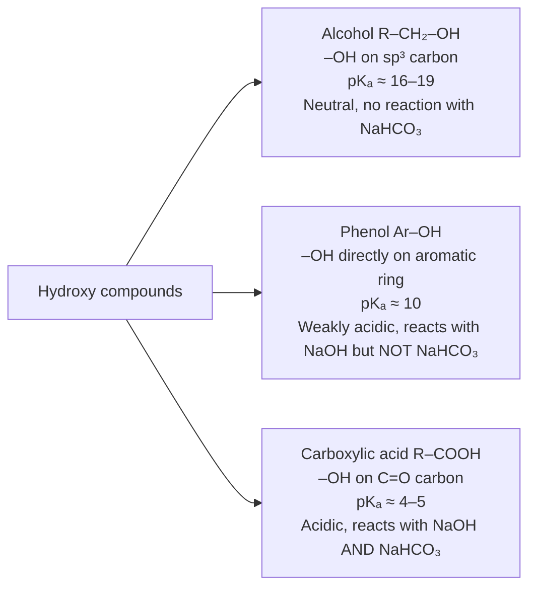

> **Historical note:** Phenol (carbolic acid) was first isolated from coal tar by **Friedlieb Ferdinand Runge** in 1834. **Joseph Lister** introduced phenol as the first **surgical antiseptic** in 1865, revolutionising surgery by dramatically reducing post-operative infections.

---

## 2. Classification

### 2.1 By Number of –OH Groups on the Aromatic Ring

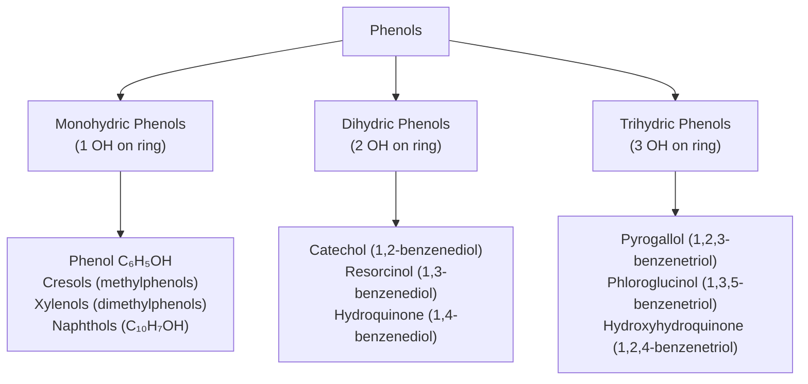

**Table of important phenols:**

| Name | Structure | pKₐ | Key Use |
|---|---|---|---|
| Phenol | C₆H₅OH | 9.99 | Antiseptic, precursor for plastics |
| o-Cresol | 2-CH₃C₆H₄OH | 10.29 | Disinfectant |
| m-Cresol | 3-CH₃C₆H₄OH | 10.09 | Disinfectant |
| p-Cresol | 4-CH₃C₆H₄OH | 10.26 | Fragrance |
| Catechol | 1,2-(HO)₂C₆H₄ | 9.23 | Photography, tanning |
| Resorcinol | 1,3-(HO)₂C₆H₄ | 9.32 | Skin treatment |
| Hydroquinone | 1,4-(HO)₂C₆H₄ | 9.85 | Photographic developer, antioxidant |
| Pyrogallol | 1,2,3-(HO)₃C₆H₃ | 9.0 | Hair dye, oxygen absorber |
| Thymol | 2-isopropyl-5-methylphenol | 10.6 | Antiseptic (Listerine®) |
| 4-Nonylphenol | 4-C₉H₁₉C₆H₄OH | — | Surfactant precursor |

---

## 3. Structure of Phenol

### 3.1 Resonance Structures

The unique properties of phenol arise from **resonance delocalisation** of the oxygen lone pairs into the π-system of the benzene ring:

$$\text{Resonance structures of phenol:}$$

```
   OH         Ö⁻H        Ö⁻H         Ö⁻H         Ö⁻H
   |           |           |           |           |
 ⬡     ↔    ⬡⁺    ↔    ⬡⁺    ↔    ⬡⁺    ↔    ⬡⁺
              (o-)        (p-)        (o-)
```

In resonance notation:

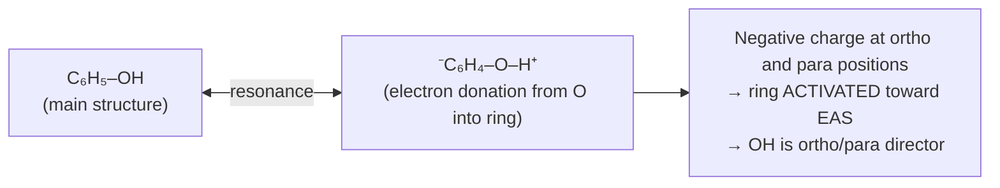

> **Key implication:** Lone pairs on O are delocalised into the ring → the C–O bond in phenol has **partial double bond character** (~1.37 Å, shorter than typical C–O single bond at ~1.43 Å). This also weakens the O–H bond, making phenol **more acidic** than alcohols.

### 3.2 Bond Parameters

| Bond | In Phenol | In Ethanol | Comment |
|---|---|---|---|
| C–O bond length | 1.37 Å | 1.43 Å | Shorter: partial double bond character |
| O–H bond length | 0.958 Å | 0.960 Å | Slightly shorter |
| C–O–H angle | ~109° | ~108.5° | Similar |
| pKₐ (O–H) | ~10 | ~16–19 | Phenol far more acidic |

### 3.3 Why is Phenol More Acidic Than Alcohols?

The phenoxide anion (C₆H₅O⁻) is **resonance-stabilised**:

$$\text{C}_6\text{H}_5\text{OH} \rightleftharpoons \text{C}_6\text{H}_5\text{O}^- + \text{H}^+$$

The negative charge on phenoxide is delocalised over the oxygen AND three carbons of the ring (ortho and para positions). The alkoxide (RO⁻) has no such stabilisation — the negative charge remains localised on oxygen. Greater stabilisation of the conjugate base → lower pKₐ → stronger acid.

$$\text{pKa comparison:}$$

| Species | pKₐ | Conjugate base stability |
|---|---|---|
| Ethanol (C₂H₅OH) | 15.9 | RO⁻ — charge on O only |
| Phenol (C₆H₅OH) | 9.99 | C₆H₅O⁻ — delocalised into ring |
| Carbonic acid (H₂CO₃) | 6.35 | HCO₃⁻ |
| Acetic acid (CH₃COOH) | 4.76 | CH₃COO⁻ — both oxygens |

> **Practical implication:** Phenol reacts with NaOH to give sodium phenoxide BUT does **not** react with NaHCO₃ (pKₐ of H₂CO₃ = 6.35 < 9.99; phenol is too weak an acid to displace CO₂ from carbonate). This distinguishes phenol from carboxylic acids.
>
> $$\text{C}_6\text{H}_5\text{OH} + \text{NaOH} \longrightarrow \text{C}_6\text{H}_5\text{ONa} + \text{H}_2\text{O} \quad \checkmark$$
> $$\text{C}_6\text{H}_5\text{OH} + \text{NaHCO}_3 \longrightarrow \text{no reaction} \quad \times$$

---

## 4. Physical Properties

| Property | Phenol | Reason |
|---|---|---|
| Physical state | White crystalline solid (mp 40.5 °C) | H-bonding in solid state |
| Boiling point | 181.7 °C | Strong H-bonding |
| Solubility in water | ~8.3 g/100 mL at 20 °C (partial) | H-bonding with water; limited by hydrophobic ring |
| Odour | Characteristic "carbolic" disinfectant smell | — |
| Colour | Colourless when pure; pink/reddish when oxidised in air | Atmospheric oxidation |
| Density | 1.071 g/mL | Denser than water |

> ⚠️ **Toxicity:** Phenol is **corrosive and toxic**; causes severe skin burns on contact (chemical burn). Systemic absorption can cause organ damage. Handle with full PPE.

---

## 5. Preparation of Phenols

### 5.1 Dow Process (Alkaline Hydrolysis of Chlorobenzene — Industrial)

$$\underbrace{\text{C}_6\text{H}_5\text{Cl}}_{\text{chlorobenzene}} + 2\,\text{NaOH} \xrightarrow{300\,°\text{C},\,200\,\text{atm}} \underbrace{\text{C}_6\text{H}_5\text{ONa}}_{\text{sodium phenoxide}} + \text{NaCl} + \text{H}_2\text{O}$$

$$\text{C}_6\text{H}_5\text{ONa} + \text{HCl} \longrightarrow \underbrace{\text{C}_6\text{H}_5\text{OH}}_{\text{phenol}} + \text{NaCl}$$

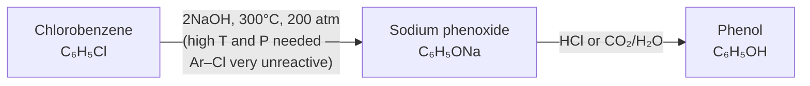

> **Why such harsh conditions?** The C–Cl bond in chlorobenzene is strengthened by resonance (lone pairs of Cl are donated into the ring, partially). Additionally, there is no electrophile to assist; nucleophilic aromatic substitution requires either strongly electron-withdrawing ring substituents OR very harsh conditions.

---

### 5.2 Cumene Process (Hock Process — Major Industrial Route, >95% of world phenol)

$$\underbrace{\text{C}_6\text{H}_5\text{H}}_{\text{benzene}} + \underbrace{\text{CH}_2=\text{CHCH}_3}_{\text{propene}} \xrightarrow{\text{H}_3\text{PO}_4,\,250\,°\text{C}} \underbrace{\text{C}_6\text{H}_5\text{CH(CH}_3)_2}_{\text{cumene (isopropylbenzene)}}$$

$$\underbrace{\text{C}_6\text{H}_5\text{CH(CH}_3)_2}_{\text{cumene}} + \text{O}_2 \xrightarrow{120\,°\text{C},\,\text{catalytic}} \underbrace{\text{C}_6\text{H}_5\text{C(CH}_3)_2\text{OOH}}_{\text{cumene hydroperoxide}}$$

$$\underbrace{\text{C}_6\text{H}_5\text{C(CH}_3)_2\text{OOH}}_{\text{cumene hydroperoxide}} \xrightarrow{\text{H}_2\text{SO}_4,\,\Delta} \underbrace{\text{C}_6\text{H}_5\text{OH}}_{\text{phenol}} + \underbrace{(\text{CH}_3)_2\text{CO}}_{\text{acetone (by-product)}}$$

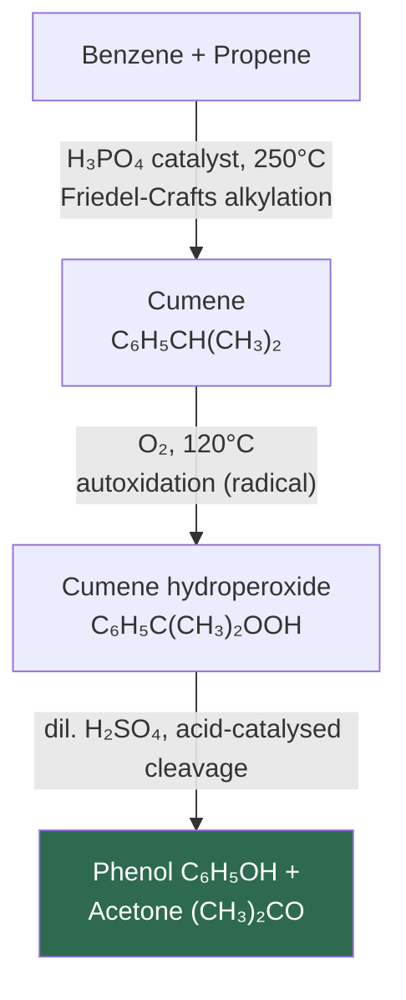

> **Commercial significance:** The cumene process co-produces **acetone** as a valuable by-product. About 7 million tonnes of phenol are produced annually this way. The ratio is stoichiometric: 1 mol phenol per 1 mol acetone.

---

### 5.3 Sulfonation-Fusion Method (Alkaline Fusion of Benzenesulfonic Acid)

**Step 1 — Sulfonation of benzene:**

$$\text{C}_6\text{H}_6 + \text{H}_2\text{SO}_4\text{(fuming)} \xrightarrow{80\,°\text{C}} \underbrace{\text{C}_6\text{H}_5\text{SO}_3\text{H}}_{\text{benzenesulfonic acid}} + \text{H}_2\text{O}$$

**Step 2 — Alkali fusion (NaOH fusion at 350 °C):**

$$\text{C}_6\text{H}_5\text{SO}_3\text{H} + 2\,\text{NaOH} \xrightarrow{300\!-\!350\,°\text{C}, \text{fusion}} \underbrace{\text{C}_6\text{H}_5\text{ONa}}_{\text{sodium phenoxide}} + \text{Na}_2\text{SO}_3 + \text{H}_2\text{O}$$

**Step 3 — Acidification:**

$$\text{C}_6\text{H}_5\text{ONa} + \text{CO}_2 + \text{H}_2\text{O} \longrightarrow \text{C}_6\text{H}_5\text{OH} + \text{NaHCO}_3$$

This was the **original industrial method** before the cumene process.

---

### 5.4 From Diazonium Salts (Balz-Schiemann / Sandmeyer Route)

$$\underbrace{\text{C}_6\text{H}_5\text{NH}_2}_{\text{aniline}} \xrightarrow{\text{NaNO}_2/\text{HCl}, 0\!-\!5\,°\text{C}} \underbrace{\text{C}_6\text{H}_5\text{N}_2^+\text{Cl}^-}_{\text{benzenediazonium chloride}}$$

$$\underbrace{\text{C}_6\text{H}_5\text{N}_2^+}_{\text{diazonium}} + \text{H}_2\text{O} \xrightarrow{\Delta, \text{H}^+\text{or base}} \underbrace{\text{C}_6\text{H}_5\text{OH}}_{\text{phenol}} + \text{N}_2\uparrow + \text{H}^+$$

> This is the most **flexible** preparation — allows introduction of the –OH at any position of an aromatic ring (via aromatic amines, which are in turn made by nitration + reduction). Not used industrially due to hazardous diazonium salts but important in lab synthesis.

**Mechanism:**

```mermaid
sequenceDiagram
    participant ArNH2 as Aniline (C₆H₅NH₂)
    participant Diazo as Diazonium ion (C₆H₅N₂⁺)
    participant Phenol as Phenol (C₆H₅OH)

    ArNH2->>Diazo: NaNO₂/HCl, 0–5°C → diazotisation (keep COLD: diazonium unstable above ~5°C)
    Diazo->>Phenol: Warm with H₂O; N₂ expelled; OH⁻ attacks aryl cation → phenol
```

---

### 5.5 From Aryl Halides (Laboratory — Nucleophilic Aromatic Substitution with EWG)

When **electron-withdrawing groups** are present ortho/para to the halide, nucleophilic aromatic substitution becomes feasible under milder conditions:

$$\underbrace{2,4\text{-dinitrochlorobenzene}}_{\text{Cl at C1, NO}_2\text{ at C2 and C4}} + \text{NaOH}_{(aq)} \xrightarrow{60\,°\text{C}} \underbrace{2,4\text{-dinitrophenol}}_{\text{yellow}} + \text{NaCl}$$

The nitro groups at ortho/para positions stabilise the **Meisenheimer complex** (anionic intermediate) → feasible SNAr.

---

## 6. Important Reactions

### 6.1 Acidic Nature — Reaction with Alkali (Formation of Phenoxide)

$$\text{C}_6\text{H}_5\text{OH} + \text{NaOH} \longrightarrow \underbrace{\text{C}_6\text{H}_5\text{O}^-\text{Na}^+}_{\text{sodium phenoxide}} + \text{H}_2\text{O}$$

This reaction **distinguishes phenol from alcohols** (alcohols do not react with NaOH under normal conditions to form sodium salts).

Acidification regenerates phenol:
$$\text{C}_6\text{H}_5\text{ONa} + \text{HCl} \longrightarrow \text{C}_6\text{H}_5\text{OH} + \text{NaCl}$$

---

### 6.2 Bromination — Aqueous Bromine Water (No Catalyst Required)

Phenol reacts **immediately** with Br₂(aq) to give **2,4,6-tribromophenol** as a white precipitate:

$$\text{C}_6\text{H}_5\text{OH} + 3\,\text{Br}_2(\text{aq}) \longrightarrow \underbrace{2,4,6\text{-Br}_3\text{C}_6\text{H}_2\text{OH}\downarrow}_{\text{white ppt}} + 3\,\text{HBr}$$

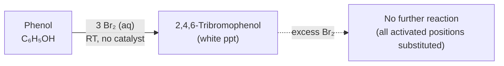

> This is a **qualitative test for phenol** — immediate white precipitate with bromine water. Benzene requires a Lewis acid catalyst (FeBr₃) for bromination; phenol's ring is so activated that no catalyst is needed.

**Why tribromination occurs readily:**  
The –OH group is a powerful **ortho/para-director** that activates the ring enormously. All three ortho/para positions are brominated sequentially in one step because each bromine at one position slightly deactivates but the remaining ortho/para positions are still very reactive.

**In organic solvent (dilute Br₂/CS₂ or CCl₄) at low temperature:** Mono-substitution can be achieved, giving a mixture of o-bromophenol and p-bromophenol (p-bromophenol predominates due to steric factors).

---

### 6.3 Nitration

**Dilute HNO₃ (no H₂SO₄ needed), room temperature:**

$$\text{C}_6\text{H}_5\text{OH} + \text{HNO}_3(\text{dil}) \xrightarrow{\text{RT}} \underbrace{\text{o-NO}_2\text{C}_6\text{H}_4\text{OH}}_{\text{o-nitrophenol}} + \underbrace{\text{p-NO}_2\text{C}_6\text{H}_4\text{OH}}_{\text{p-nitrophenol}}$$

Ratio: approximately 40% ortho : 60% para. The para isomer predominates due to steric hindrance at ortho positions.

**Properties of o- vs p-nitrophenol:**

| Property | o-Nitrophenol | p-Nitrophenol |
|---|---|---|
| Colour | Pale yellow | Colourless to pale yellow |
| BP | 216 °C | 279 °C (higher due to intermolecular H-bonding) |
| Solubility (water) | Lower (intramolecular H-bond with –NO₂) | Higher (external H-bonding with water) |
| Steam distillation | Volatile with steam ✅ | Not steam-distilled ✅ |

> The **difference in volatility** is used to separate them: o-nitrophenol (intramolecular H-bond → lower BP) is steam-volatile; p-nitrophenol is not.

**With conc. HNO₃ / conc. H₂SO₄ at 20 °C:**

$$\text{C}_6\text{H}_5\text{OH} + \text{conc. HNO}_3/\text{H}_2\text{SO}_4 \longrightarrow 2,4\text{-dinitrophenol}$$

**With excess fuming HNO₃:**

$$\text{C}_6\text{H}_5\text{OH} + 3\,\text{HNO}_3 \longrightarrow \underbrace{2,4,6\text{-trinitrophenol}}_{\text{picric acid, yellow solid, explosive}}$$

---

### 6.4 Sulfonation

$$\text{C}_6\text{H}_5\text{OH} + \text{H}_2\text{SO}_4 \xrightarrow{<25\,°\text{C}} \text{o-hydroxybenzenesulfonic acid} \quad (\text{ortho major})$$

$$\text{C}_6\text{H}_5\text{OH} + \text{H}_2\text{SO}_4 \xrightarrow{>100\,°\text{C}} \text{p-hydroxybenzenesulfonic acid} \quad (\text{para major})$$

> This is an equilibrium reaction (sulfonation is reversible). At low temperature, kinetic product (ortho) forms; at high temperature, thermodynamic product (para) predominates. The para isomer is less sterically strained.

---

### 6.5 Kolbe Reaction (Kolbe-Schmitt Reaction)

Sodium phenoxide reacts with CO₂ under pressure to give **sodium salicylate** (2-hydroxybenzoate), which is acidified to **salicylic acid**:

$$\underbrace{\text{C}_6\text{H}_5\text{ONa}}_{\text{sodium phenoxide}} + \text{CO}_2 \xrightarrow{125\,°\text{C},\,4\!-\!7\,\text{atm}} \underbrace{\text{2-HOC}_6\text{H}_4\text{COONa}}_{\text{sodium salicylate}} \xrightarrow{\text{HCl}} \underbrace{\text{2-HOC}_6\text{H}_4\text{COOH}}_{\text{salicylic acid}}$$

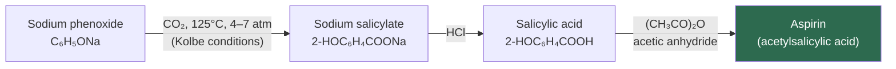

> **Industrial importance:** Salicylic acid from the Kolbe reaction is the precursor to **aspirin (acetylsalicylic acid)**, the world's most widely used drug. The mechanism involves electrophilic carboxylation of the sodium phenoxide ring by CO₂ (the ring acts as nucleophile; CO₂ is the electrophile — reversed role compared to usual EAS).

**Mechanism — Kolbe reaction:**
1. CO₂ acts as an electrophile toward the electron-rich phenoxide anion.
2. Ortho attack (favoured at low temperature → salicylate) or para attack (potassium salt at higher T → 4-hydroxybenzoate).
3. Intramolecular proton transfer and tautomerisation give sodium salicylate.

---

### 6.6 Reimer–Tiemann Reaction

Formylation of phenol — introduction of a **–CHO (aldehyde) group** at the ortho position using chloroform and alkali:

$$\underbrace{\text{C}_6\text{H}_5\text{OH}}_{\text{phenol}} + \text{CHCl}_3 + 3\,\text{NaOH} \xrightarrow{\Delta} \underbrace{\text{2-HOC}_6\text{H}_4\text{CHO}}_{\text{salicylaldehyde (major)}} + \text{3NaCl} + 2\,\text{H}_2\text{O}$$

Minor product: **p-hydroxybenzaldehyde**

**Mechanism:**

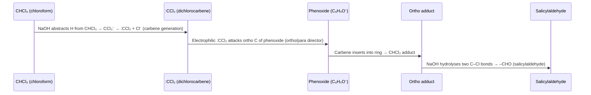

> **Key intermediate:** **Dichlorocarbene (:CCl₂)** — generated by the action of NaOH on CHCl₃. This is the electrophile.  
> The reaction gives predominantly the **ortho-formylated product** (salicylaldehyde) because the ortho positions are activated by the phenoxide and the reaction proceeds via an anionic complex that rearranges.

**Salicylaldehyde** is used in the synthesis of coumarin (fragrance), benzoxazoles, and chelating ligands.

---

### 6.7 Fries Rearrangement

When a **phenyl ester** (phenol ester) is treated with a Lewis acid (AlCl₃), it rearranges to give a **hydroxyaryl ketone** (acyl group migrates to the ring):

$$\underbrace{\text{C}_6\text{H}_5\text{–O–CO–R}}_{\text{phenyl ester}} \xrightarrow{\text{AlCl}_3, \Delta} \underbrace{\text{HO–C}_6\text{H}_4\text{–CO–R}}_{\text{hydroxyketone (ortho or para)}}$$

**Temperature control:**
- **Low temperature** (0–25 °C) → **para-hydroxyketone** (major, thermodynamic)
- **High temperature** (>100 °C) → **ortho-hydroxyketone** (major, kinetic chelate)

**Example:**

$$\underbrace{\text{C}_6\text{H}_5\text{OOCCH}_3}_{\text{phenyl acetate}} \xrightarrow{\text{AlCl}_3,\,25\,°\text{C}} \underbrace{\text{p-HOC}_6\text{H}_4\text{COCH}_3}_{\text{4'-hydroxyacetophenone (major)}} + \underbrace{\text{o-HOC}_6\text{H}_4\text{COCH}_3}_{\text{2'-hydroxyacetophenone (minor)}}$$

**Mechanism:**

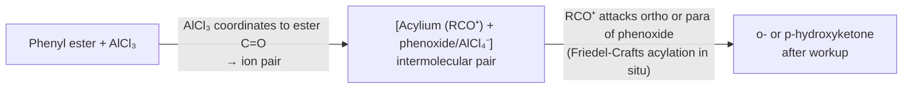

> **Applications:** p-Hydroxyacetophenone (from Fries rearrangement of phenyl acetate) is an intermediate for **paracetamol (acetaminophen)** synthesis.

---

### 6.8 Azo Coupling with Diazonium Salts

Phenol undergoes **electrophilic aromatic substitution** with **diazonium ions** (weak electrophile, only reacts with activated rings):

$$\underbrace{\text{C}_6\text{H}_5\text{N}_2^+}_{\text{diazonium}} + \underbrace{\text{C}_6\text{H}_5\text{OH}}_{\text{phenol}} \xrightarrow{\text{pH 9–10, NaOH}} \underbrace{\text{C}_6\text{H}_5\text{–N=N–C}_6\text{H}_4\text{OH}}_{\text{4-hydroxyazobenzene (azo dye, orange)}}$$

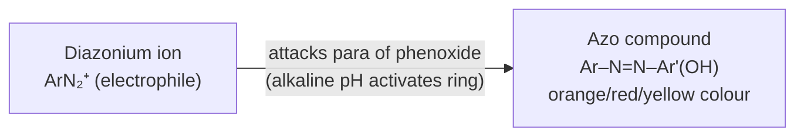

> **Conditions:** Alkaline pH (8–10) is required because phenoxide (C₆H₅O⁻) is a much more reactive coupling partner than phenol; diazonium ion is stable in slightly alkaline conditions.

> **Importance:** Azo coupling is the basis of the **azo dye industry** (>50% of all commercial dyes are azo dyes). The –N=N– chromophore absorbs visible light; substitution patterns tune the colour.

---

### 6.9 Esterification of Phenol

Phenol reacts with **acid anhydrides or acid chlorides** (not directly with carboxylic acids, which require higher activation) to form esters:

$$\text{C}_6\text{H}_5\text{OH} + (\text{CH}_3\text{CO})_2\text{O} \xrightarrow{\text{pyridine or NaOH}} \underbrace{\text{C}_6\text{H}_5\text{OOCCH}_3}_{\text{phenyl acetate}} + \text{CH}_3\text{COOH}$$

$$\text{C}_6\text{H}_5\text{OH} + \text{CH}_3\text{COCl} \xrightarrow{\text{pyridine}} \text{C}_6\text{H}_5\text{OOCCH}_3 + \text{HCl}$$

> **Why not Fischer esterification?** The pKₐ of phenol (10) vs alcohol (16) means phenol's oxygen lone pair is less available (donated into the ring by resonance), making the oxygen a **poorer nucleophile** than alkoxide. Direct Fischer esterification is slow for phenols; acid chlorides or anhydrides are needed.

---

### 6.10 Oxidation of Phenol

**With Na₂Cr₂O₇/H₂SO₄:**  
Phenol is oxidised to **benzoquinone** (1,4-benzoquinone), a yellow solid:

$$\text{C}_6\text{H}_5\text{OH} + [\text{O}] \xrightarrow{\text{Na}_2\text{Cr}_2\text{O}_7/\text{H}_2\text{SO}_4} \underbrace{\text{O=C}_6\text{H}_4\text{=O}}_{\text{1,4-benzoquinone}} + \text{H}_2\text{O}$$

This is why phenol slowly **turns pink/red in air** — aerial oxidation produces quinone-type coloured compounds.

---

## 7. Acidity of Phenol vs Alcohol vs Carboxylic Acid

A summary of relative acidity (quantitative):

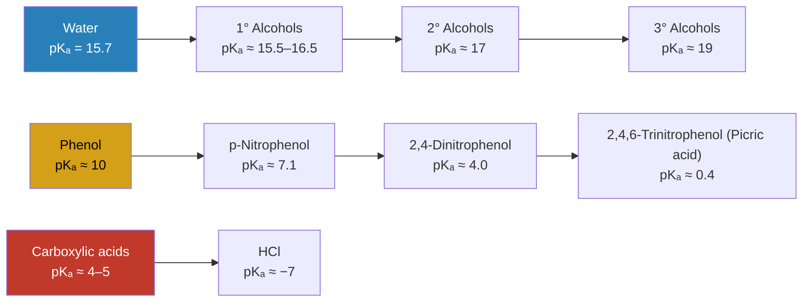

**Acidity trend for substituted phenols:**
- **Electron-withdrawing groups (EWG)** (NO₂, CN, CF₃) at ortho/para → stabilise phenoxide by delocalising negative charge further → **increase acidity (lower pKₐ)**
- **Electron-donating groups (EDG)** (CH₃, OCH₃, NH₂) → destabilise phenoxide → **decrease acidity (raise pKₐ)**

$$\text{pKₐ comparison: p-NO}_2\text{-phenol (7.14)} < \text{phenol (9.99)} < \text{p-CH}_3\text{-phenol (10.26)}$$

---

## 8. Electrophilic Aromatic Substitution (EAS) — Why ortho/para?

### 8.1 The Directing Effect of –OH

The –OH (or –O⁻) group is an **ortho/para director** because it donates electron density to the ortho and para positions through resonance, making them the most nucleophilic sites for electrophilic attack.

**Arenium ion (Wheland intermediate) stability at each position:**

For electrophile (E⁺) attack at **para** position:

$$\text{C}_6\text{H}_5\text{OH} + \text{E}^+ \xrightarrow{\text{attack at para}} \sigma\text{-complex}$$

The arenium ion at para has a resonance structure where the positive charge is **adjacent to the –OH oxygen**, which donates lone pairs to stabilise it — extra resonance contributor → lower activation energy:

```
    OH          OH          OH         ⊕OH
    |           |           |           |
  ⊕ ← E      ↔           ↔   ← E   ↔   ← E
```

For attack at **meta** position: no resonance structure places + charge adjacent to O → less stabilised → meta product not formed.

### 8.2 Summary of EAS of Phenol

| Electrophile (E⁺) | Reagents | Products | Notes |
|---|---|---|---|
| Br⁺ | Br₂(aq), no catalyst | 2,4,6-Tribromophenol | 3 Br added at once |
| NO₂⁺ | dil. HNO₃ | o- and p-nitrophenol | No H₂SO₄ needed |
| SO₃H | H₂SO₄ | o-sulfonic acid (low T) / p-sulfonic acid (high T) | Reversible |
| CHO⁺ | CHCl₃/NaOH (Reimer-Tiemann) | Mainly o-salicylaldehyde | Via :CCl₂ carbene |
| RCO⁺ (Fries) | Phenyl ester + AlCl₃ | o- or p-hydroxyketone | T-dependent |
| ArN₂⁺ | Diazonium + NaOH | p-Azo compound | pH 8–10 |
| CO₂ (Kolbe) | CO₂ + NaOH, pressure | o-Salicylate | Via phenoxide |

---

## 9. Practice Problems

<details>
<summary>Problem 1 — Click to reveal</summary>

**Q:** Arrange the following in order of increasing acidity (most basic first, most acidic last) and justify:
(a) Ethanol, (b) Phenol, (c) p-Nitrophenol, (d) Acetic acid

**A:**

From least to most acidic (increasing acid strength, decreasing pKₐ):

1. **Ethanol** (pKₐ ≈ 15.9) — alkoxide not stabilised by resonance
2. **Phenol** (pKₐ ≈ 9.99) — phenoxide stabilised by ring resonance
3. **p-Nitrophenol** (pKₐ ≈ 7.14) — nitro group (EWG at para) further delocalises negative charge in phenoxide
4. **Acetic acid** (pKₐ ≈ 4.76) — carboxylate stabilised by equivalence of two C=O resonance structures

**Order (increasing acidity):** Ethanol < Phenol < p-Nitrophenol < Acetic acid

</details>

<details>
<summary>Problem 2 — Click to reveal</summary>

**Q:** Explain why phenol reacts with aqueous Br₂ without a catalyst, while benzene requires FeBr₃ as a Lewis acid catalyst.

**A:**

In **benzene**, the π-electron cloud is electron-neutral. Br₂ is a weak electrophile and cannot initiate EAS on benzene without activation — FeBr₃ polarises Br₂ to Br⁺···FeBr₄⁻, generating a stronger electrophile.

In **phenol**, the –OH group donates lone pair electrons into the ring by resonance, creating regions of **high electron density** at the ortho and para positions. This activated ring reacts readily with even weak electrophiles like Br₂ (aq). The reaction is so fast that all three available ortho/para positions are brominated simultaneously, giving 2,4,6-tribromophenol as a white precipitate.

Quantitatively: phenol's ring has a **Hammett σ-parameter** for –OH of σₚ = −0.37, strongly activating. The rate of EAS of phenol is approximately 10⁶× faster than benzene toward Br₂.

</details>

<details>
<summary>Problem 3 — Click to reveal</summary>

**Q:** Starting from phenol, show a two-step synthesis of aspirin (acetylsalicylic acid).

**A:**

**Step 1 — Kolbe reaction** (CO₂ carboxylation of sodium phenoxide):

$$\text{C}_6\text{H}_5\text{ONa} + \text{CO}_2 \xrightarrow{125\,°\text{C},\,5\,\text{atm}} \text{2-HOC}_6\text{H}_4\text{COONa} \xrightarrow{\text{H}^+} \text{2-HOC}_6\text{H}_4\text{COOH}\quad\text{(salicylic acid)}$$

**Step 2 — Acetylation** (esterification with acetic anhydride):

$$\underbrace{\text{2-HOC}_6\text{H}_4\text{COOH}}_{\text{salicylic acid}} + \underbrace{(\text{CH}_3\text{CO})_2\text{O}}_{\text{acetic anhydride}} \xrightarrow{\text{H}_3\text{PO}_4} \underbrace{\text{2-CH}_3\text{COOC}_6\text{H}_4\text{COOH}}_{\text{aspirin}} + \text{CH}_3\text{COOH}$$

The –OH of the phenol (not the carboxylic acid –OH) is selectively acylated; the carboxylic acid remains free.

</details>

<details>
<summary>Problem 4 — Click to reveal</summary>

**Q:** Predict the major product of the Reimer-Tiemann reaction of 2-naphthol (β-naphthol) with CHCl₃/NaOH.

**A:**

2-Naphthol has the –OH group at C2 of naphthalene. The phenoxide form directs electrophilic attack (by :CCl₂) to the most activated ortho/para positions of the phenol-bearing ring:

- C1 (ortho to –OH) is most reactive → major product is **2-hydroxy-1-naphthaldehyde**.

$$\text{2-naphthol} + \text{CHCl}_3 + \text{NaOH} \xrightarrow{\Delta} \underbrace{\text{2-OH-1-CHO naphthyl}}_{\text{2-hydroxy-1-naphthaldehyde}}$$

This selectivity arises because C1 is the "peri-like" position closest to the oxygen in 2-naphthol, giving the strongest orbital overlap in the σ-complex at that position.

</details>

---

## 10. References

1. Carey, F.A.; Sundberg, R.J. (2007). *Advanced Organic Chemistry Part A: Structure and Mechanisms* (5th ed.). Springer. Chapter 4 (EAS), Chapter 5 (Phenols).
2. Clayden, J.; Greeves, N.; Warren, S. (2012). *Organic Chemistry* (2nd ed.). Oxford University Press. Chapters 22, 23, 43.
3. Morrison, R.T.; Boyd, R.N. (1992). *Organic Chemistry* (6th ed.). Prentice Hall. Chapters 16, 24.
4. Kolbe, H. (1860). *Ueber Synthese der Salicylsäure*. Annalen der Chemie, 113, 125–127.
5. Tiemann, F.; Reimer, K. (1876). *Ueber eine neue Bildungsweise aromatischer Aldehyde*. Berichte der deutschen chemischen Gesellschaft, 9, 824–828.
6. Lister, J. (1867). *On the Antiseptic Principle in the Practice of Surgery*. The Lancet, 90(2299), 353–356.
7. Hock, H.; Lang, S. (1944). *Autoxydation von Kohlenwasserstoffen, IX.: Über Peroxyde von Benzol-Derivaten*. Berichte der deutschen chemischen Gesellschaft, 77B, 257–264.
8. **Online References:**
   - [LibreTexts: Phenols — Classification and Reactions](https://chem.libretexts.org/Bookshelves/Organic_Chemistry/Organic_Chemistry_(LibreTexts)/17%3A_Alcohols_and_Phenols)
   - [ChemGuide: Reactions of Phenol](https://www.chemguide.co.uk/organicprops/phenol/reactions.html)
   - [PubChem: Phenol](https://pubchem.ncbi.nlm.nih.gov/compound/Phenol)
   - [IUPAC Gold Book: Phenols](https://goldbook.iupac.org/terms/view/P04539)
   - [Khan Academy: EAS Directing Groups](https://www.khanacademy.org/science/organic-chemistry/aromatic-compounds/electrophilic-aromatic-substitution/a/ortho-para-and-meta-directors)
   - [RSC Education: Aspirin Synthesis](https://edu.rsc.org/download?ac=10874)
   - [Sigma-Aldrich: Phenol Safety Data Sheet](https://www.sigmaaldrich.com/GB/en/sds/sial/185361)

---

*Notes compiled for BUTEX CHEM-103 | Module 12 | © itachi-re 2026*
