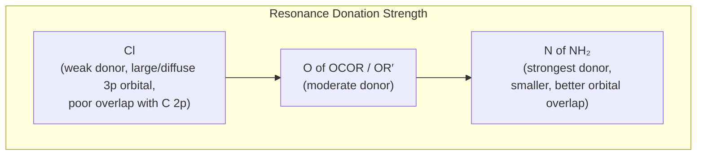
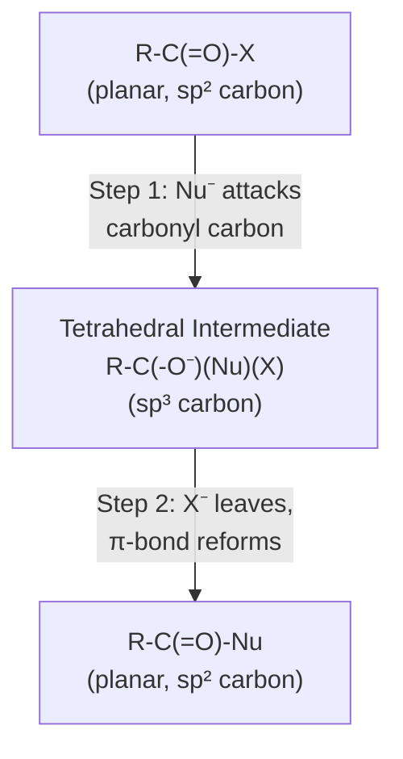
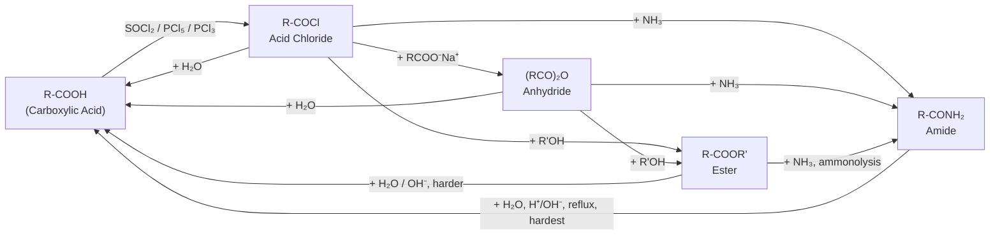
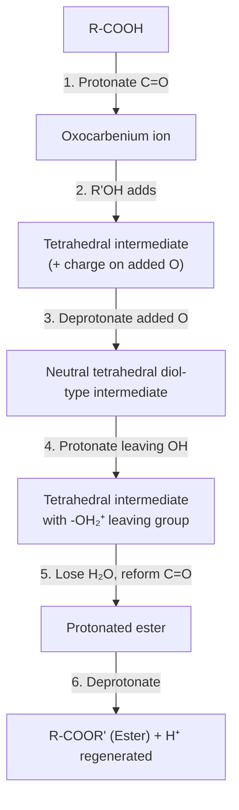
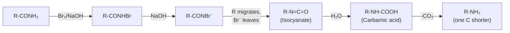

# 09 — Functional Derivatives of Mono-carboxylic Acids

**Acid Chlorides · Acid Anhydrides · Esters · Acid Amides**

---

## 1. Overview

Mono-carboxylic acids (R–COOH) are the parent compounds of an entire family of **acyl derivatives**, all built around the same acyl group, R–C(=O)–, but differing in *what is attached to the carbonyl carbon in place of –OH*. Replace the –OH of an acid with –Cl, with –O–CO–R, with –OR′, or with –NH₂ and you get an acid chloride, an acid anhydride, an ester, or an amide respectively.

These four derivatives are taught together for a good reason: they all react by the **same mechanism** (nucleophilic acyl substitution) and form a single reactivity ladder. Understanding one derivative means understanding 80% of the chemistry of the other three — only the leaving group changes.

**Relationship to previous topics:** This chapter builds directly on Mono-carboxylic Acids (Topic 8). Every derivative here can, in principle, be hydrolysed back to the parent acid, and every derivative can in principle be made from the parent acid (usually via the acid chloride).

**Industrial relevance:** This is one of the most economically important chapters in organic chemistry for a textile engineer specifically:

- **Polyester (PET) fibre** — built entirely from **ester** linkages (terephthalic acid + ethylene glycol).
- **Nylon 6,6** — built entirely from **amide** linkages (adipic acid + hexamethylenediamine).
- **Cellulose acetate / acetate rayon** — made using **acetic anhydride**.
- **Aspirin, paracetamol, and most drug molecules** — contain ester or amide functional groups.

---

## 2. Learning Objectives

By the end of this chapter, a student should be able to:

1. Name and draw the structures of acid chlorides, anhydrides, esters, and amides (IUPAC + common names).
2. Explain the general mechanism of nucleophilic acyl substitution (addition–elimination).
3. Rank the four derivatives in order of reactivity and *justify* the order using leaving-group ability and resonance.
4. Write balanced equations for at least two preparation methods and four reactions of each derivative.
5. Draw complete stepwise mechanisms for Fischer esterification, saponification, and the Hofmann bromamide degradation.
6. Distinguish esters from amides using simple chemical tests.
7. Connect each derivative class to at least one real industrial or textile application.
8. Solve numerical/conversion problems involving interconversion of acid derivatives.

---

## 3. Definitions and Key Terminology

| Term | Formal Definition | Plain-Language Explanation |
|---|---|---|
| **Acyl group** | R–C(=O)– | The "business end" common to all four derivatives — an acid minus its –OH. |
| **Acid (Acyl) Halide** | R–CO–X (usually X = Cl) | Acid with –OH swapped for a halogen; the most reactive derivative. |
| **Acid Anhydride** | R–CO–O–CO–R′ | Two acyl groups joined through one oxygen — "dehydrated" acid. |
| **Ester** | R–CO–O–R′ | Acid + alcohol, joined with loss of water; –OH replaced by –OR′. |
| **Acid Amide** | R–CO–NH₂ (also –NHR, –NR₂) | Acid + ammonia/amine, joined with loss of water; –OH replaced by –NH₂. |
| **Nucleophilic Acyl Substitution (NAS)** | A two-step addition–elimination mechanism at the carbonyl carbon in which a nucleophile replaces a leaving group attached to the acyl carbon. | The master reaction of this whole chapter. |
| **Tetrahedral intermediate** | The sp³ alkoxide-like species formed after a nucleophile adds to the carbonyl carbon, before the leaving group departs. | The "in-between" state of every NAS reaction. |
| **Saponification** | Base-mediated, essentially irreversible hydrolysis of an ester to a carboxylate salt + alcohol. | "Soap-making" reaction; named because it is literally how soap is made from fats. |
| **Schotten–Baumann reaction** | Reaction of an acid chloride with an amine or phenol in the presence of aqueous base (NaOH) to give an amide or ester. | Base mops up the HCl by-product, pushing the reaction forward and protecting the amine. |
| **Rosenmund reduction** | Selective hydrogenation of an acid chloride to an aldehyde using H₂ over Pd poisoned with BaSO₄/quinoline ("Lindlar-type" poisoning). | Stops reduction exactly at the aldehyde stage. |
| **Hofmann bromamide degradation** | Conversion of a primary amide to a primary amine with **one carbon fewer**, using Br₂/NaOH. | A rare reaction that *shortens* the carbon chain by one. |

---

## 4. Theory and Fundamental Concepts

### 4.1 Structure and Bonding

In all four derivatives, the carbonyl carbon is **sp²-hybridised**, trigonal planar, with a C=O π-bond. The carbonyl carbon is electrophilic because oxygen pulls electron density toward itself (both σ-inductively and through the π-bond).

The group attached to the carbonyl carbon (Cl, OCOR, OR′, or NH₂) has **two competing electronic effects**:

- **Inductive (–I) effect**: withdraws electron density *through the σ-bond*, making the carbonyl carbon **more** electrophilic.
- **Resonance (+M) effect**: the lone pair on the heteroatom (Cl, O, or N) can donate into the carbonyl π-system, **reducing** the carbonyl's electrophilicity and giving partial double-bond character to the C–X bond.



Because nitrogen is the best π-donor of the three (small atom, good 2p–2p overlap with carbon), the C–N bond in amides has substantial double-bond character. This is why **amide C–N bonds are shorter and have restricted rotation** (rotational barrier ≈ 75–85 kJ/mol) — a fact that is fundamental to protein secondary structure (this is the same bond that holds polypeptide backbones rigid).

### 4.2 The Master Reaction: Nucleophilic Acyl Substitution (Addition–Elimination)

All four derivatives react with nucleophiles (water, alcohols, ammonia/amines, hydroxide) by the **same two-step pathway**:



Unlike nucleophilic substitution at sp³ carbon (Sₙ1/Sₙ2), acyl substitution proceeds through this **tetrahedral intermediate** because the carbonyl π-bond can re-form once the leaving group departs — there is no need for backside attack or carbocation formation.

### 4.3 Relative Reactivity Order and Why It Exists

$$\text{Acid Chloride} > \text{Acid Anhydride} > \text{Ester} > \text{Amide}$$

**Mnemonic:** *"Cats Always Eat Apples"* (Chloride → Anhydride → Ester → Amide, decreasing reactivity).

The order is governed by **two combined factors**:

| Factor | Effect |
|---|---|
| **Leaving-group ability** | Cl⁻ (excellent, weak base, stable anion) > RCOO⁻ (good) > RO⁻ (poor) > NH₂⁻ (extremely poor — amide ion is a very strong base) |
| **Resonance stabilisation of starting material** | Cl: weak donation → carbonyl stays highly electrophilic. NH₂: strong donation → carbonyl is "deactivated," and the amide itself is resonance-stabilised (lower in energy, less reactive) |

Both factors point the same direction, which is why the order is so clean and consistent across nearly every textbook and exam.



Every arrow above is a nucleophilic acyl substitution; the diagram shows that **acid chlorides sit at the top of the reactivity cascade** and can be converted into *any* of the other three derivatives, while amides sit at the bottom and are the hardest to hydrolyse or interconvert.

---

## 5. Preparation Methods

### 5.1 Acid Chlorides

**(a) Carboxylic acid + Thionyl chloride (preferred method)**

$$\text{R–COOH} + \text{SOCl}_2 \xrightarrow{\Delta} \text{R–COCl} + \text{SO}_2\uparrow + \text{HCl}\uparrow$$

*Advantage:* both by-products are gases — the product is obtained pure with no aqueous/solid by-product to separate.

**(b) Carboxylic acid + Phosphorus pentachloride**

$$\text{R–COOH} + \text{PCl}_5 \rightarrow \text{R–COCl} + \text{POCl}_3 + \text{HCl}\uparrow$$

**(c) Carboxylic acid + Phosphorus trichloride**

$$3\,\text{R–COOH} + \text{PCl}_3 \rightarrow 3\,\text{R–COCl} + \text{H}_3\text{PO}_3$$

*Limitation:* POCl₃/H₃PO₃ are liquids/solids that must be separated by distillation, less convenient than SOCl₂.

### 5.2 Acid Anhydrides

**(a) From acid chloride + sodium salt of the acid**

$$\text{R–COCl} + \text{R–COONa} \rightarrow \text{(R–CO)}_2\text{O} + \text{NaCl}$$

**(b) Dehydration of acid using P₂O₅ (simple acids only)**

$$2\,\text{CH}_3\text{COOH} \xrightarrow{\text{P}_2\text{O}_5} (\text{CH}_3\text{CO})_2\text{O} + \text{H}_2\text{O}$$

**(c) Industrial route to acetic anhydride — via ketene**

$$\text{CH}_3\text{COOH} \xrightarrow[700{-}750\,^\circ\text{C}]{\text{pyrolysis}} \text{CH}_2{=}\text{C=O (ketene)} + \text{H}_2\text{O}$$
$$\text{CH}_2{=}\text{C=O} + \text{CH}_3\text{COOH} \rightarrow (\text{CH}_3\text{CO})_2\text{O}$$

**(d) Cyclic anhydrides** (succinic, phthalic, maleic) form simply by **heating the dicarboxylic acid**, since intramolecular dehydration is entropically favourable when it produces a 5- or 6-membered ring.

### 5.3 Esters

**(a) Fischer Esterification (most important, reversible)**

$$\text{R–COOH} + \text{R'–OH} \xrightleftharpoons[\text{conc. H}_2\text{SO}_4,\ \Delta]{} \text{R–COOR'} + \text{H}_2\text{O}$$

Because this is an **equilibrium**, yield is improved by (i) using excess alcohol, or (ii) continuously removing water (e.g., Dean–Stark trap).

**(b) From acid chloride + alcohol (fast, irreversible)**

$$\text{R–COCl} + \text{R'–OH} \rightarrow \text{R–COOR'} + \text{HCl}\uparrow$$

**(c) From acid anhydride + alcohol**

$$(\text{R–CO})_2\text{O} + \text{R'–OH} \rightarrow \text{R–COOR'} + \text{R–COOH}$$

**(d) Transesterification**

$$\text{R–COOR'} + \text{R''–OH} \xrightleftharpoons[\text{acid or base}]{} \text{R–COOR''} + \text{R'–OH}$$

*Industrial note:* this is exactly the reaction used to make **biodiesel** (fatty acid methyl esters) and is one route to **PET polyester** (dimethyl terephthalate + ethylene glycol).

### 5.4 Acid Amides

**(a) Dry distillation of ammonium salt of the acid**

$$\text{R–COONH}_4 \xrightarrow{\Delta} \text{R–CONH}_2 + \text{H}_2\text{O}$$

**(b) From acid chloride + ammonia**

$$\text{R–COCl} + 2\,\text{NH}_3 \rightarrow \text{R–CONH}_2 + \text{NH}_4\text{Cl}$$

**(c) From acid anhydride or ester + ammonia (ammonolysis)**

$$(\text{R–CO})_2\text{O} + \text{NH}_3 \rightarrow \text{R–CONH}_2 + \text{R–COONH}_4$$

**(d) Controlled partial hydrolysis of a nitrile**

$$\text{R–CN} + \text{H}_2\text{O} \xrightarrow[\text{H}^+ \text{ or OH}^-,\ \text{mild}]{} \text{R–CONH}_2$$

*Limitation:* conditions must be mild — under stronger acid/base or prolonged heating, the amide hydrolyses further to the carboxylic acid.

---

## 6. Important Reactions

### 6.1 Acid Chlorides

| Reaction | Equation |
|---|---|
| Hydrolysis (instant, even with moist air) | $\text{R–COCl} + \text{H}_2\text{O} \rightarrow \text{R–COOH} + \text{HCl}$ |
| Alcoholysis | $\text{R–COCl} + \text{R'OH} \rightarrow \text{R–COOR'} + \text{HCl}$ |
| Ammonolysis | $\text{R–COCl} + 2\text{NH}_3 \rightarrow \text{R–CONH}_2 + \text{NH}_4\text{Cl}$ |
| Schotten–Baumann (with amine, NaOH present) | $\text{R–COCl} + \text{R'NH}_2 \xrightarrow{\text{NaOH(aq)}} \text{R–CONHR'} + \text{NaCl} + \text{H}_2\text{O}$ |
| Friedel–Crafts acylation | $\text{R–COCl} + \text{ArH} \xrightarrow{\text{AlCl}_3} \text{Ar–CO–R} + \text{HCl}$ |
| Rosenmund reduction (to aldehyde) | $\text{R–COCl} + \text{H}_2 \xrightarrow{\text{Pd/BaSO}_4} \text{R–CHO} + \text{HCl}$ |
| With Grignard reagent (excess) | $\text{R–COCl} + 2\,\text{R'MgX} \rightarrow \text{R–C(OH)(R')}_2$ (3° alcohol) |

### 6.2 Acid Anhydrides

| Reaction | Equation |
|---|---|
| Hydrolysis | $(\text{RCO})_2\text{O} + \text{H}_2\text{O} \rightarrow 2\,\text{RCOOH}$ |
| Alcoholysis | $(\text{RCO})_2\text{O} + \text{R'OH} \rightarrow \text{RCOOR'} + \text{RCOOH}$ |
| Ammonolysis | $(\text{RCO})_2\text{O} + \text{NH}_3 \rightarrow \text{RCONH}_2 + \text{RCOOH}$ |
| Friedel–Crafts acylation | $(\text{RCO})_2\text{O} + \text{ArH} \xrightarrow{\text{AlCl}_3} \text{Ar–CO–R} + \text{RCOOH}$ |
| Acetylation of –OH/–NH₂ (e.g. aspirin synthesis) | $\text{ArOH} + (\text{CH}_3\text{CO})_2\text{O} \rightarrow \text{ArOCOCH}_3 + \text{CH}_3\text{COOH}$ |

### 6.3 Esters

| Reaction | Equation |
|---|---|
| Acid hydrolysis (reversible) | $\text{RCOOR'} + \text{H}_2\text{O} \xrightleftharpoons{\text{H}^+} \text{RCOOH} + \text{R'OH}$ |
| Saponification (irreversible) | $\text{RCOOR'} + \text{NaOH} \rightarrow \text{RCOONa} + \text{R'OH}$ |
| Ammonolysis | $\text{RCOOR'} + \text{NH}_3 \rightarrow \text{RCONH}_2 + \text{R'OH}$ |
| Transesterification | $\text{RCOOR'} + \text{R''OH} \rightleftharpoons \text{RCOOR''} + \text{R'OH}$ |
| Reduction (LiAlH₄) | $\text{RCOOR'} \xrightarrow{\text{LiAlH}_4} \text{RCH}_2\text{OH} + \text{R'OH}$ |
| Grignard addition (2 equiv.) | $\text{RCOOR'} + 2\,\text{R''MgX} \rightarrow \text{RC(OH)(R'')}_2 + \text{R'OH}$ |
| Claisen condensation (with base, two esters) | $2\,\text{CH}_3\text{COOC}_2\text{H}_5 \xrightarrow{\text{NaOC}_2\text{H}_5} \text{CH}_3\text{COCH}_2\text{COOC}_2\text{H}_5 + \text{C}_2\text{H}_5\text{OH}$ |

### 6.4 Acid Amides

| Reaction | Equation |
|---|---|
| Hydrolysis (vigorous, slow) | $\text{RCONH}_2 + \text{H}_2\text{O} \xrightarrow[\text{reflux}]{\text{H}^+\text{ or OH}^-} \text{RCOOH} + \text{NH}_3$ |
| Dehydration to nitrile | $\text{RCONH}_2 \xrightarrow{\text{P}_2\text{O}_5,\ \Delta} \text{RCN} + \text{H}_2\text{O}$ |
| **Hofmann bromamide degradation** | $\text{RCONH}_2 + \text{Br}_2 + 4\,\text{NaOH} \rightarrow \text{RNH}_2 + 2\,\text{NaBr} + \text{Na}_2\text{CO}_3 + 2\,\text{H}_2\text{O}$ |
| Reduction (LiAlH₄) | $\text{RCONH}_2 \xrightarrow{\text{LiAlH}_4} \text{RCH}_2\text{NH}_2$ |
| With nitrous acid | $\text{RCONH}_2 + \text{HNO}_2 \rightarrow \text{RCOOH} + \text{N}_2\uparrow + \text{H}_2\text{O}$ |

---

## 7. Reaction Mechanisms

### 7.1 General Nucleophilic Acyl Substitution

1. Nucleophile's lone pair attacks the carbonyl carbon; the C=O π-electrons shift fully onto oxygen → **tetrahedral alkoxide intermediate**.
2. The oxyanion's lone pair re-forms the π-bond as the leaving group (X⁻) departs with the bonding electron pair → planar carbonyl product restored.

### 7.2 Fischer Esterification — Full Mechanism (acid-catalysed)

Mnemonic for the six steps: **P–A–D–P–E–D** (Protonate, Addition, Deprotonate, Protonate, Eliminate, Deprotonate).

1. **Protonation** of the carbonyl oxygen by H₂SO₄ → activates the carbon (now an oxocarbenium ion, strongly electrophilic).
2. **Nucleophilic addition** of the alcohol's oxygen (lone pair) onto the activated carbonyl carbon → tetrahedral intermediate carrying a protonated, positively-charged alkoxy oxygen and an –OH.
3. **Deprotonation** of that newly-added, positively charged oxygen by another solvent/alcohol molecule.
4. **Protonation** of one of the two remaining –OH groups (the one that is to leave as water), converting it into a good leaving group (–OH₂⁺).
5. **Elimination** of water — the C–OH₂⁺ bond breaks, the lone pair from the adjacent oxygen swings in to re-form the C=O π-bond → protonated ester (oxocarbenium form).
6. **Final deprotonation** by water/solvent regenerates the H⁺ catalyst and releases the neutral ester.



Because every step is reversible, **acid-catalysed ester hydrolysis is simply this mechanism run backwards** (excess water instead of excess alcohol drives it toward acid + alcohol).

### 7.3 Saponification (Base Hydrolysis of Esters) — Why It Is Irreversible

1. Hydroxide ion (a strong, small nucleophile) attacks the carbonyl carbon directly → tetrahedral intermediate.
2. The intermediate collapses: the alkoxide (R′O⁻) is expelled as the C=O π-bond re-forms → gives the **carboxylic acid**.
3. **Decisive step:** the carboxylic acid (pKₐ ≈ 4–5) immediately transfers its proton to the alkoxide R′O⁻ (a much stronger base, conjugate acid pKₐ ≈ 16–18). This acid–base step lies enormously far to the right and is effectively instantaneous.

$$\text{RCOOH} + \text{R'O}^- \longrightarrow \text{RCOO}^- + \text{R'OH}$$

This final, thermodynamically very favourable proton transfer is *why* saponification cannot be reversed under the reaction conditions — unlike Fischer esterification, there is no equilibrium to push back.

### 7.4 Amide Hydrolysis — Why It Is the Slowest

The mechanism is the same two-step NAS sequence, but two factors slow it down relative to esters:

- **Resonance stabilisation** of the starting amide (N lone pair delocalised into C=O) means the carbonyl carbon is *less* electrophilic to begin with.
- **NH₂⁻/NHR⁻ is an extremely poor leaving group** (conjugate acid, ammonia/amine, has pKₐ ≈ 35–38) — it does not want to leave at all unless protonated first (acid conditions) or unless the reaction is pushed hard with prolonged reflux in strong acid or base.

### 7.5 Hofmann Bromamide Degradation — Step-by-Step Mechanism

1. **N-bromination:** $\text{RCONH}_2 + \text{Br}_2 + \text{NaOH} \rightarrow \text{RCONHBr} + \text{NaBr} + \text{H}_2\text{O}$
2. **Deprotonation:** excess NaOH removes the remaining N–H → $\text{RCONBr}^-$ anion.
3. **Key rearrangement (α-elimination):** in a *concerted* step, the R group migrates from the carbonyl carbon to nitrogen **as the Br⁻ leaves simultaneously** — this is an intramolecular shift, mechanistically related to the Curtius/Lossen family of rearrangements. The product is an **isocyanate**: $\text{R–N=C=O}$.
4. **Hydration:** the isocyanate is attacked by hydroxide/water → unstable **carbamic acid**, $\text{R–NH–COOH}$.
5. **Decarboxylation:** carbamic acid spontaneously loses CO₂ → primary **amine**, $\text{R–NH}_2$ (one carbon shorter than the starting amide!).
6. The liberated CO₂ is mopped up by the excess NaOH present, forming Na₂CO₃.



---

## 8. Worked Examples

**Example 1 (Basic) — Two-step conversion**
*Convert acetic acid to ethyl acetate.*

$$\text{CH}_3\text{COOH} \xrightarrow{\text{SOCl}_2} \text{CH}_3\text{COCl} \xrightarrow{\text{C}_2\text{H}_5\text{OH}} \text{CH}_3\text{COOC}_2\text{H}_5$$

Step 1 makes the acid chloride (irreversible, clean). Step 2 is fast alcoholysis of the acid chloride — far more reliable here than direct Fischer esterification, since no acid catalyst or equilibrium issue is involved.

**Example 2 (Intermediate) — Schotten–Baumann reaction**
*Predict the product of benzoyl chloride reacting with aniline in the presence of aqueous NaOH.*

$$\text{C}_6\text{H}_5\text{COCl} + \text{C}_6\text{H}_5\text{NH}_2 \xrightarrow{\text{NaOH(aq)}} \text{C}_6\text{H}_5\text{CONHC}_6\text{H}_5\ (\text{benzanilide}) + \text{NaCl} + \text{H}_2\text{O}$$

NaOH neutralises the HCl generated, preventing it from protonating and deactivating the aniline nucleophile.

**Example 3 (Advanced) — Reactivity reasoning**
*Explain, using resonance structures, why an amide is far less reactive than an ester toward nucleophilic acyl substitution.*

*Answer:* In an amide, nitrogen's lone pair delocalises strongly into the carbonyl π-system (small atom, excellent 2p–2p orbital overlap), generating a significant contribution from the resonance structure R–C(–O⁻)=N⁺HR. This donation (i) lowers the electrophilicity of the carbonyl carbon and (ii) makes NH₂⁻/NHR⁻ an extremely poor leaving group. In an ester, oxygen is a weaker π-donor than nitrogen (it is more electronegative and "holds onto" its lone pairs more tightly, and RO⁻ is a far better leaving group than NH₂⁻/NHR⁻), so the carbonyl stays comparatively electrophilic and the leaving group departs more readily.

**Example 4 (Exam-oriented) — Full conversion**
*Convert acetamide into methylamine.*

$$\text{CH}_3\text{CONH}_2 + \text{Br}_2 + 4\,\text{NaOH} \rightarrow \text{CH}_3\text{NH}_2 + 2\,\text{NaBr} + \text{Na}_2\text{CO}_3 + 2\,\text{H}_2\text{O}$$

(See Section 7.5 for the complete stepwise mechanism via the N-bromoamide and isocyanate intermediates.)

**Example 5 (Application-based) — Aspirin synthesis**
*Outline the synthesis of aspirin (acetylsalicylic acid) from salicylic acid.*

$$\text{Salicylic acid (ArOH/COOH)} + (\text{CH}_3\text{CO})_2\text{O} \xrightarrow{\text{H}_2\text{SO}_4\text{(cat.), }\Delta} \text{Acetylsalicylic acid (Aspirin)} + \text{CH}_3\text{COOH}$$

This is acetylation of the phenolic –OH of salicylic acid by acetic anhydride — the carboxylic acid group on the ring is left untouched. Anhydride is preferred industrially over acetyl chloride here because it is milder, cheaper, and does not release corrosive HCl gas.

**Example 6 (Application-based) — Distinguishing test**
*How would you distinguish ethyl acetate from acetamide using a simple test?*

Heat each with NaOH solution. The **ester** undergoes saponification, releasing the smell of ethanol and forming sodium acetate (soapy, slippery solution; no gas evolved that turns litmus blue). The **amide** releases **ammonia gas**, detected by its pungent smell and by turning moist red litmus paper blue.

---

## 9. Industrial Applications

### 9.1 Acid Chlorides
Key intermediates in **dye synthesis**, **pharmaceutical manufacturing** (acylation of amine/alcohol drug intermediates), and **Friedel–Crafts acylations** used to build aromatic ketones for fragrances and pharmaceuticals. Acetyl chloride is a standard laboratory acetylating agent.

### 9.2 Acid Anhydrides
- **Acetic anhydride** is the principal industrial acetylating agent: used to manufacture **cellulose acetate** (the polymer behind acetate rayon fibre and photographic film base) and **aspirin**.
- **Phthalic anhydride** is a major precursor to **plasticisers** (e.g., dioctyl phthalate, used to soften PVC — relevant to coated/laminated textiles) and to **alkyd/polyester resins**.
- **Maleic anhydride** is used in unsaturated polyester resins and copolymers.

### 9.3 Esters
- **Solvents:** ethyl acetate and butyl acetate are workhorse solvents in lacquers, nail polish, and printing inks.
- **Flavours/fragrances:** low-molecular-weight esters give characteristic fruity smells (e.g., isoamyl acetate — banana; ethyl butanoate — pineapple).
- **Biodiesel:** produced by transesterification of plant/animal triglycerides with methanol.
- **Polyester (PET) fibre and film** — the single largest-volume synthetic textile fibre on earth, formed by polycondensation (esterification/transesterification) of terephthalic acid (or dimethyl terephthalate) with ethylene glycol.
- **Plasticiser esters** (phthalates, adipates) for flexible PVC coatings used in technical textiles.

### 9.4 Acid Amides
- **Nylon 6,6** — a polyamide fibre formed from adipic acid and hexamethylenediamine, joined entirely through amide linkages. One of the two most important synthetic fibres in the textile industry.
- **Kevlar (aromatic polyamide)** — exceptional tensile strength from rigid, highly hydrogen-bonded amide linkages between terephthalic acid and p-phenylenediamine; used in ballistic and high-performance technical textiles.
- **Pharmaceuticals:** paracetamol, many antibiotics, and numerous drug classes contain the amide functional group.
- **Urea-formaldehyde resins** for adhesives and finishing agents.
- **Biology:** the peptide bond linking amino acids in all proteins is, structurally, an amide bond — the restricted rotation discussed in Section 4.1 is exactly what gives proteins their secondary structure (α-helices, β-sheets).

### 9.5 Why This Chapter Matters Specifically for Textile Engineering

| Fibre/Material | Functional Derivative Involved |
|---|---|
| Polyester (PET) | **Ester** linkage |
| Nylon 6,6 / Nylon 6 | **Amide** linkage |
| Kevlar / Nomex (aramids) | **Amide** linkage (aromatic) |
| Acetate rayon | **Acetic anhydride** (acetylation of cellulose –OH groups) |
| PVC-coated technical textiles | **Ester** plasticisers (phthalates/adipates) |

Two of the most heavily produced synthetic fibres in the world — polyester and nylon — are, at the molecular level, nothing more than long chains held together by ester and amide bonds respectively. This chapter is the direct chemical foundation of polymer/fibre science courses later in the BUTEX curriculum.

---

## 10. Comparison Tables

### 10.1 Acid Chloride vs Anhydride vs Ester vs Amide

| Property | Acid Chloride | Acid Anhydride | Ester | Amide |
|---|---|---|---|---|
| General formula | R–CO–Cl | (R–CO)₂O | R–CO–OR′ | R–CO–NH₂ |
| Leaving group | Cl⁻ (excellent) | RCOO⁻ (good) | RO⁻ (poor) | NH₂⁻ (very poor) |
| Relative NAS reactivity | **Highest** | High | Moderate | **Lowest** |
| Boiling point (vs. parent acid) | Lower (no H-bonding) | Lower–moderate | Lower–moderate | Higher (1°/2° amides H-bond strongly) |
| Hydrolysis conditions | Instant; even moist air | Fast, mild | Needs acid/base catalyst + heat | Needs strong acid/base + prolonged reflux |
| Typical odour | Pungent, lachrymatory | Pungent, irritating | Often pleasant/fruity | Often odourless solids |
| Common preparation from acid | SOCl₂ / PCl₅ / PCl₃ | P₂O₅, or acid chloride + RCOONa | Fischer esterification | Heating ammonium salt |
| Flagship industrial product | Dye/drug intermediates | Cellulose acetate, aspirin | Polyester (PET), flavours | Nylon, Kevlar, drugs |

### 10.2 Grignard Reagent vs Organo-zinc Reagent (cross-reference, Topics 1–2)

| Feature | Grignard (RMgX) | Organo-zinc (RZnX/R₂Zn) |
|---|---|---|
| Reactivity | Very high, less selective | Milder, more chemoselective |
| Functional group tolerance | Low (reacts with most polar groups) | Higher (tolerates esters, halides better in many cases) |
| Typical use | General C–C bond formation | Negishi/Reformatsky-type selective couplings |

---

## 11. Common Examination Questions

### Short Questions
1. Define nucleophilic acyl substitution.
2. Why is SOCl₂ preferred over PCl₅ for preparing acid chlorides in the laboratory?
3. Arrange acid chloride, anhydride, ester, and amide in decreasing order of reactivity.
4. What is the Schotten–Baumann reaction used for?
5. Name one industrial use of acetic anhydride relevant to the textile industry.

### Descriptive Questions
6. Discuss, with reasons, the relative reactivity of the four functional derivatives of carboxylic acids toward nucleophilic acyl substitution.
7. Describe two methods of preparing acetic anhydride, including one industrial route.
8. Explain why amide hydrolysis requires more vigorous conditions than ester hydrolysis.

### Mechanism Questions
9. Write the complete stepwise mechanism for the Fischer esterification of acetic acid with methanol.
10. Outline, with mechanism, the conversion of acetamide to methylamine (Hofmann bromamide degradation).
11. Using resonance structures, explain why the C–N bond in an amide has restricted rotation.

### Board/University Style Questions
12. Starting from ethanoic acid, outline syntheses of: (a) ethanoyl chloride, (b) ethyl ethanoate, (c) ethanamide, (d) ethanoic anhydride.
13. How would you distinguish between an ester and an amide using simple chemical tests?
14. Convert benzamide into aniline, showing all intermediates.

---

## 12. Practice Problems

**Problem 1.** Write the equation for the reaction of propanoyl chloride with methanol.

<details>
<summary>Solution</summary>

$$\text{CH}_3\text{CH}_2\text{COCl} + \text{CH}_3\text{OH} \rightarrow \text{CH}_3\text{CH}_2\text{COOCH}_3 + \text{HCl}$$

</details>

**Problem 2.** What product forms when benzoic anhydride is heated with excess ammonia?

<details>
<summary>Solution</summary>

$$(\text{C}_6\text{H}_5\text{CO})_2\text{O} + 2\,\text{NH}_3 \rightarrow \text{C}_6\text{H}_5\text{CONH}_2 + \text{C}_6\text{H}_5\text{COONH}_4$$

Benzamide plus ammonium benzoate.

</details>

**Problem 3.** Predict the major organic product of acetamide heated with P₂O₅.

<details>
<summary>Solution</summary>

Dehydration to the nitrile: $\text{CH}_3\text{CONH}_2 \xrightarrow{\text{P}_2\text{O}_5} \text{CH}_3\text{CN} + \text{H}_2\text{O}$ (acetonitrile).

</details>

**Problem 4.** Why does saponification go essentially to completion, while acid-catalysed ester hydrolysis is an equilibrium?

<details>
<summary>Solution</summary>

In saponification, the carboxylic acid product is instantly deprotonated by the alkoxide leaving group (a much stronger base), forming a stable, non-nucleophilic carboxylate that cannot re-form the ester. This irreversible proton transfer removes the reaction from equilibrium control. Acid-catalysed hydrolysis has no such irreversible step — every step is a reversible, acid-catalysed proton transfer or addition/elimination, so it settles at equilibrium.

</details>

**Problem 5.** Give the structure and name of the product when acetyl chloride reacts with benzene in the presence of anhydrous AlCl₃.

<details>
<summary>Solution</summary>

Friedel–Crafts acylation gives **acetophenone**: $\text{CH}_3\text{COCl} + \text{C}_6\text{H}_6 \xrightarrow{\text{AlCl}_3} \text{C}_6\text{H}_5\text{COCH}_3 + \text{HCl}$

</details>

**Problem 6.** A student wants to convert an acid chloride to an aldehyde without over-reducing it to the alcohol. Which reagent/catalyst system should be used?

<details>
<summary>Solution</summary>

Rosenmund reduction: H₂ gas over **Pd catalyst poisoned with BaSO₄** (often with a trace of quinoline/sulfur poison). The poisoned catalyst is active enough to reduce the acid chloride to the aldehyde but too deactivated to further reduce the aldehyde to the alcohol.

</details>

**Problem 7.** Outline how ethyl acetate could be converted to acetic acid using two different methods (one acid-catalysed, one base-mediated), and state which one is irreversible.

<details>
<summary>Solution</summary>

Acid-catalysed: $\text{CH}_3\text{COOC}_2\text{H}_5 + \text{H}_2\text{O} \xrightleftharpoons{\text{H}^+} \text{CH}_3\text{COOH} + \text{C}_2\text{H}_5\text{OH}$ (reversible equilibrium).
Base-mediated (saponification then acidify): $\text{CH}_3\text{COOC}_2\text{H}_5 + \text{NaOH} \rightarrow \text{CH}_3\text{COONa} + \text{C}_2\text{H}_5\text{OH}$, then add dilute HCl to liberate $\text{CH}_3\text{COOH}$. The saponification step itself is irreversible.

</details>

**Problem 8.** Explain why acid chlorides cannot generally be stored in open, humid laboratory air for long periods.

<details>
<summary>Solution</summary>

Acid chlorides are extremely reactive toward even weak nucleophiles such as water (excellent Cl⁻ leaving group, highly electrophilic carbonyl carbon). Atmospheric moisture hydrolyses them rapidly to the carboxylic acid plus HCl gas, which is why many acid chlorides visibly "fume" in moist air.

</details>

**Problem 9.** Devise a one-pot route from acetic acid to N-phenylacetamide (acetanilide) that avoids isolating the acid chloride as a separate purification step (i.e., describe the overall sequence conceptually).

<details>
<summary>Solution</summary>

Convert acetic acid to acetic anhydride (or acetyl chloride generated in situ), then treat directly with aniline: $(\text{CH}_3\text{CO})_2\text{O} + \text{C}_6\text{H}_5\text{NH}_2 \rightarrow \text{CH}_3\text{CONHC}_6\text{H}_5 + \text{CH}_3\text{COOH}$. Acetic anhydride is commonly preferred industrially over the acid chloride for amide-forming acetylations because it is milder and avoids HCl evolution.

</details>

**Problem 10.** A primary amide, RCONH₂, on Hofmann bromamide degradation gives an amine with the formula C₂H₅NH₂. Identify R and the starting amide.

<details>
<summary>Solution</summary>

Hofmann degradation removes exactly one carbon (as CO₂) and converts R–CONH₂ → R–NH₂. Since the product amine is C₂H₅NH₂ (ethylamine), R = C₂H₅, so the starting amide must have had R–CO– with one *more* carbon in the chain overall: it must be **propanamide**, CH₃CH₂CONH₂ (R = CH₃CH₂–, i.e., ethyl group directly bonded to carbonyl). Degradation: $\text{CH}_3\text{CH}_2\text{CONH}_2 \xrightarrow{\text{Br}_2/\text{NaOH}} \text{CH}_3\text{CH}_2\text{NH}_2$.

</details>

---

## 13. Quick Revision Sheet

**Reactivity order (memorise!):**
$$\text{Acid Chloride} > \text{Anhydride} > \text{Ester} > \text{Amide}$$
Mnemonic: *"Cats Always Eat Apples"*

**Key reagents to remember:**
- Acid → Acid chloride: **SOCl₂** (best), PCl₅, PCl₃
- Acid → Anhydride: **P₂O₅** (simple acids) or acid chloride + RCOONa
- Acid → Ester: **Fischer esterification** (conc. H₂SO₄, reflux, reversible)
- Acid → Amide: heat the **ammonium salt**

**Named reactions:**
| Name | What it does |
|---|---|
| Fischer esterification | Acid + alcohol ⇌ ester (acid-catalysed) |
| Schotten–Baumann | Acid chloride + amine/phenol + NaOH(aq) → amide/ester |
| Saponification | Ester + NaOH → carboxylate salt + alcohol (irreversible) |
| Rosenmund reduction | Acid chloride → aldehyde (H₂, Pd/BaSO₄, poisoned) |
| Claisen condensation | Ester + ester (base) → β-keto ester |
| Hofmann bromamide degradation | Amide → amine, **one carbon fewer** (Br₂/NaOH) |

**Mechanism in one line:** Every reaction in this chapter (except Hofmann's rearrangement step and reductions) is **nucleophilic acyl substitution** = nucleophile adds → tetrahedral intermediate → leaving group departs, C=O re-forms.

**Common student mistakes to avoid:**
- Forgetting that saponification is **irreversible** while Fischer esterification/acid hydrolysis is an **equilibrium**.
- Confusing the leaving-group order with the nucleophilicity order — they are *opposite* trends and both matter.
- Writing Hofmann degradation as simple substitution and forgetting the **isocyanate intermediate** and the **loss of one carbon as CO₂**.
- Assuming amide is "unreactive" in general — it is unreactive specifically toward **nucleophilic acyl substitution**; it is still readily hydrolysed under sufficiently strong/prolonged acid or base reflux.

**Textile-relevant takeaway:** Polyester = ester linkages; Nylon/Kevlar = amide linkages; acetate rayon = acetic anhydride chemistry.

---

## 14. References

1. Morrison, R. T. & Boyd, R. N. — *Organic Chemistry*
2. Solomons, T. W. G. & Fryhle, C. B. — *Organic Chemistry*
3. Clayden, J., Greeves, N., Warren, S. — *Organic Chemistry*
4. McMurry, J. — *Organic Chemistry*
5. IUPAC — *Compendium of Chemical Terminology (Gold Book)*
6. LibreTexts Chemistry — Carboxylic Acid Derivatives chapters

---

## Suggested Figures for This File

- Structural comparison diagram: R–COCl / (R–CO)₂O / R–COOR′ / R–CONH₂ side by side with electron-donating arrows from heteroatom lone pair into carbonyl.
- Energy/reactivity ladder diagram (qualitative) showing relative activation energies for NAS across the four derivatives.
- Resonance structures of an amide showing C–N partial double-bond character (relevant to protein chemistry tie-in).
- Industrial flowchart: petroleum/biomass feedstock → terephthalic acid + ethylene glycol → PET polyester fibre (ester linkage highlighted).
- Industrial flowchart: adipic acid + hexamethylenediamine → Nylon 6,6 (amide linkage highlighted).
- Photograph/diagram of cellulose acetate fibre production using acetic anhydride.

---

*Changelog entry suggestion (for `butex-notes/CHANGELOG.md`):*

```
### Added
- CHEM-103: 09-carboxylic-acid-derivatives.md — full notes on acid chlorides,
  anhydrides, esters, and amides (preparation, reactions, mechanisms, textile
  industry applications, comparison tables, practice problems with spoilers).
```
