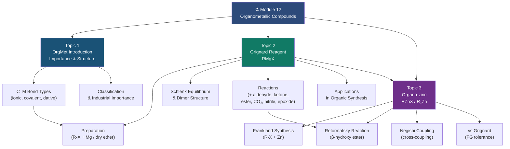

# ⚗️ CHEM-103 — Module 12: Organometallic Compounds

**[🔗 Back to CHEM-103](https://github.com/itachi-re/butex-notes/tree/master/CHEM-103)**

---

## 📋 Module Overview

This module covers **organometallic compounds** — a class of substances containing at least one **direct carbon–metal bond** (C–M bond). Organometallic chemistry sits at the intersection of organic and inorganic chemistry and has transformed modern synthetic chemistry, enabling reactions that are otherwise impossible.

The module is divided into three topics:

1. **Organometallic Compounds — Importance and Structure** (Topic 1): Classification, bonding types, the nature of C–M bonds, and why organometallics are essential in both industry and academia.
2. **Grignard Reagent** (Topic 2): The most widely used organometallic in organic synthesis — preparation, structure, the full range of reactions, and applications in building complex molecules from simple ones.
3. **Organo-zinc Compounds** (Topic 3): The historically first organometallic; modern use in Reformatsky and Negishi reactions; selectivity advantages over Grignard reagents.

---

## 📂 Contents

| # | File | Topic | Key Concepts |
|:--|:-----|:------|:-------------|
| 01 | [01_organometallic_intro.md](01_organometallic_intro.md) | Organometallic Compounds — Importance & Structure | C–M bond, classification, ionic/covalent/dative, importance in synthesis & industry |
| 02 | [02_grignard_reagent.md](02_grignard_reagent.md) | Grignard Reagent | RMgX preparation, Schlenk equilibrium, addition reactions (aldehyde, ketone, ester, CO₂, nitrile, epoxide), synthetic applications |
| 03 | [03_organozinc.md](03_organozinc.md) | Organo-zinc Compounds | Et₂Zn, RZnX, preparation, Frankland synthesis, Reformatsky reaction, Negishi coupling, functional group tolerance |

---

## 🎯 Learning Objectives

By the end of this module, you should be able to:

1. Define an organometallic compound and explain what a C–M bond is
2. Classify organometallic compounds by bonding type (ionic, covalent, dative) and give examples
3. Explain why the electronegativity difference between C and M determines the character of the C–M bond
4. Describe the industrial and synthetic importance of organometallic chemistry
5. Prepare a Grignard reagent from an alkyl or aryl halide and magnesium
6. Explain the Schlenk equilibrium and the dimer structure of Grignard reagents in solution
7. Write complete mechanisms for Grignard additions to aldehydes, ketones, esters, CO₂, nitriles, and epoxides
8. Apply Grignard reagents to multi-step synthesis problems to build target alcohols and carboxylic acids
9. Identify the limitations of Grignard reagents (active hydrogen compounds)
10. Prepare organo-zinc compounds by Frankland's method and transmetalation
11. Write the mechanism for the Reformatsky reaction and identify its products
12. Compare the reactivity and functional group tolerance of organozinc vs Grignard reagents
13. Explain the role of organo-zinc compounds in Negishi cross-coupling

---

## 📚 Prerequisites

Before studying this module, revise:

1. Lewis structures, formal charge, and oxidation states
2. Organic reaction mechanisms — nucleophilic addition (Module 11, Topic 10)
3. Carbocations and carbanions (Module 11, Topics 4 & 5)
4. Redox reactions and electrochemical series
5. Coordination chemistry — Lewis acid–base interactions (CHEM-101, Module 03)
6. Brønsted-Lowry and Lewis acid–base theory (CHEM-101, Module 04)
7. sp³ hybridisation and tetrahedral geometry

---

## 🗺️ Module Map

---

## 🔗 Cross-Module Connections

- **[CHEM-103 / Module 11 — Organic Reactions & Mechanisms](../organic_reaction/)** — Nucleophilic addition to C=O (Topic 10), carbanion intermediates (Topic 5)
- **[CHEM-101 / 03 — Complex Compounds](../../CHEM-101/03_complex_compounds/)** — Coordination bonds, Lewis acid–base
- **[CHEM-101 / 02 — Chemical Bonding](../../CHEM-101/02_chemical_bonding/)** — Electronegativity, polarity, bond character
- **[CHEM-101 / 08 — Kinetics](../../CHEM-101/08_kinetics/)** — Reaction rates, activation energy

---

## 📖 Recommended References

1. **Clayden, J., Greeves, N., Warren, S.** — *Organic Chemistry*, 2nd ed., Oxford University Press, 2012 — Chapter 9: Using organometallic reagents; Chapter 43: Organometallic chemistry.
2. **March, J.** — *Advanced Organic Chemistry*, 5th ed., Wiley, 2001 — Chapter 12: Reactions of organometallics.
3. **Crabtree, R. H.** — *The Organometallic Chemistry of the Transition Metals*, 6th ed., Wiley, 2014 — Graduate reference.
4. **LibreTexts — Organometallic Chemistry:** [https://chem.libretexts.org/Bookshelves/Inorganic_Chemistry/Organometallic_Chemistry](https://chem.libretexts.org/Bookshelves/Inorganic_Chemistry/Organometallic_Chemistry)
5. **Master Organic Chemistry — Grignard Reactions:** [https://www.masterorganicchemistry.com/grignard-reaction/](https://www.masterorganicchemistry.com/grignard-reaction/)
6. **ChemGuide — Grignard Reagents:** [https://www.chemguide.co.uk/organicprops/haloalkanes/grignard.html](https://www.chemguide.co.uk/organicprops/haloalkanes/grignard.html)
7. **IUPAC Gold Book — Organometallic Compound:** [https://goldbook.iupac.org/terms/view/O04328](https://goldbook.iupac.org/terms/view/O04328)
8. **Nobel Prize in Chemistry 2010** — Heck, Negishi, Suzuki — for palladium-catalysed cross-couplings: [https://www.nobelprize.org/prizes/chemistry/2010/summary/](https://www.nobelprize.org/prizes/chemistry/2010/summary/)

---

> 📖 *These notes are part of the [BUTEX Notes](https://github.com/itachi-re/butex-notes) repository — B.Sc. Textile Engineering, Fabric Engineering Dept. · CHEM-103*
