# ⚗️ CHEM-103 — Module 11: Q&A with Mechanism Diagrams

Companion to [`organic_reaction/qna.md`](https://github.com/itachi-re/butex-notes/blob/master/CHEM-103/organic_reaction/qna.md) in **butex-notes**. Same question set, with Mermaid diagrams added at the mechanism-heavy topics (carbocations, SN1, SN2, E1, E2, addition) so the electron/geometry arguments are visual, not just prose.

---

## 📋 Contents

1. [Inductive Effect](#1-inductive-effect)
2. [Electromeric Effect](#2-electromeric-effect)
3. [Mesomeric Effect](#3-mesomeric-effect)
4. [Carbonium Ions](#4-carbonium-ions)
5. [Carbanions](#5-carbanions)
6. [SN1 Reactions](#6-sn1-reactions)
7. [SN2 Reactions](#7-sn2-reactions)
8. [E1 Reactions](#8-e1-reactions)
9. [E2 Reactions](#9-e2-reactions)
10. [Addition Reactions](#10-addition-reactions)
11. [Cross-Topic Challenge Questions](#11-cross-topic-challenge-questions)

---

## 1. Inductive Effect

**Q1.1.** Arrange in decreasing −I effect: −Cl, −NO₂, −OH, −COOH.

Show Answer

$$-\text{NO}_2 > -\text{COOH} > -\text{Cl} > -\text{OH}$$

−NO₂ withdraws most strongly (electronegative + resonance-stabilised nitro group); −OH is weakest since oxygen's lone pairs give a small offsetting +M contribution.

---

**Q1.2.** Why does the inductive effect vanish beyond the third carbon from the substituent?

Show Answer

Each σ bond only relays a fraction of the polarisation from the bond before it, so the induced charge decays multiplicatively along the chain:

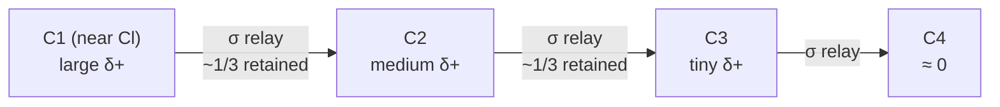

By C3 the residual displacement is negligible — inductive effects are short-range, unlike resonance which spans a whole conjugated system.

---

**Q1.3.** Why is Cl₃CCOOH a much stronger acid than CH₃COOH?

Show Answer

Three chlorines exert a cumulative −I pull, stabilising the conjugate base (trichloroacetate); the methyl group in acetate is a weak +I donor that slightly destabilises the negative charge instead. Lower conjugate-base energy → lower pKₐ (0.7 vs 4.76).

---

**Q1.4.** Rank by increasing acid strength: HCOOH, CH₃COOH, CH₃CH₂COOH.

Show Answer

$$\text{propanoic} < \text{acetic} < \text{formic}$$

Formic acid has no alkyl +I donor at all; each extra alkyl carbon pushes more density onto the carboxylate, destabilising it further.

---

## 2. Electromeric Effect

**Q2.1.** Two conditions needed for the electromeric effect.

Show Answer

1. A multiple bond (π system) must be present.
2. An attacking reagent must approach it — the effect exists only while the reagent is present.

---

**Q2.2.** Distinguish +E and −E with an example each.

Show Answer

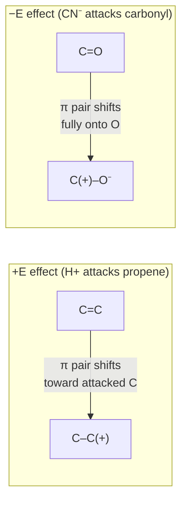

+E: π pair moves toward the carbon being attacked (H⁺ on propene → more stable carbocation). −E: π pair moves away from the attacking site, fully onto the heteroatom (HCN + carbonyl).

---

**Q2.3.** Why is the electromeric effect "temporary" versus inductive/mesomeric "permanent"?

Show Answer

It exists only during the instant of reagent attack, then the system relaxes back. Inductive and mesomeric effects are built into the ground-state structure and show up in measurable properties (dipole moment, bond length) even with no reagent nearby.

---

**Q2.4.** HBr addition to but-2-ene: which electrons shift, and how?

Show Answer

The C=C π electrons shift fully onto one alkene carbon as H⁺ approaches, forming a new C–H σ bond and leaving a carbocation on the other carbon. Both carbons are equivalent secondary centres, so either can become the cation.

---

## 3. Mesomeric Effect

**Q3.1.** Classify −NH₂, −OCH₃, −NO₂ as +M/−M and explain.

Show Answer

−NH₂, −OCH₃ → **+M** (lone pair on N/O delocalises into the π system, donating density).
−NO₂ → **−M** (no lone pair to donate; its own π* withdraws density, spreading negative charge onto its oxygens).

---

**Q3.2.** Why is aniline a weaker base than methylamine?

Show Answer

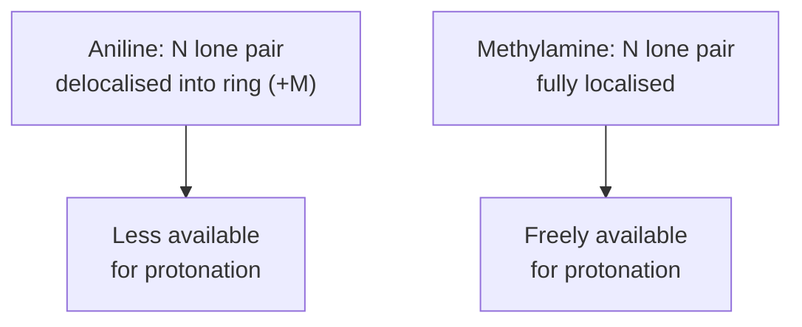

Resonance donation into the ring spreads aniline's nitrogen lone pair thin, lowering its basicity relative to methylamine's fully localised pair.

---

**Q3.3.** Chlorobenzene reacts slower than benzene in EAS yet Cl is still o/p-directing — reconcile.

Show Answer

Cl has a strong **−I** effect (dominates overall reactivity, deactivating the ring → slower reaction) but a weaker **+M** effect (lone-pair donation still raises density selectively at ortho/para relative to meta, so whatever reaction occurs is directed there).

---

**Q3.4.** Why is −COOH both deactivating and meta-directing?

Show Answer

Its carbonyl carbon is electron-poor and withdraws π density from the ring by resonance (−M), while −I withdraws through σ bonds too. Ortho/para positions lose the most density (resonance structures place formal + charge there directly), leaving meta comparatively electron-richer — hence meta-direction despite overall deactivation.

---

## 4. Carbonium Ions

**Q4.1.** Rank stability: methyl, 1°, 2°, 3°, allylic.

Show Answer

$$\text{methyl} < 1° < 2° < 3° < \text{allylic}$$

(Assumes a simple, non-resonance-stabilised comparison; a resonance-stabilised allylic/benzylic cation can rival or exceed 3° depending on substituents.)

---

**Q4.2.** Explain hyperconjugation and why it favours 3° over 1° cations.

Show Answer

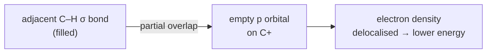

A 3° cation has up to nine adjacent C–H σ bonds available to donate into the empty p orbital; a 1° cation has far fewer — more donating bonds means more stabilisation.

---

**Q4.3.** A 2° carbocation rearranges to 3° before nucleophile attack — name the process and driving force.

Show Answer

**1,2-hydride shift** (or 1,2-methyl shift) — a Wagner–Meerwein rearrangement. A H (or alkyl group) migrates with its bonding pair to the cationic carbon. Driving force: the resulting 3° cation is thermodynamically more stable (greater hyperconjugation/induction) than the 2° one, so rearrangement outpaces the comparatively slow nucleophilic attack step.

---

**Q4.4.** Why is a vinyl cation exceptionally unstable versus a 1° alkyl cation?

Show Answer

Its empty orbital is an **sp** hybrid in-plane, not a p orbital perpendicular to a π system — no hyperconjugative or resonance stabilisation is possible. sp orbitals also hold density closer to the nucleus, raising the empty orbital's energy. Vinyl halides essentially never undergo SN1 solvolysis.

---

## 5. Carbanions

**Q5.1.** Rank stability: CH₃⁻, C₆H₅⁻, allyl (CH₂=CH–CH₂⁻), acetylide (HC≡C⁻).

Show Answer

$$\text{CH}_3^- < \text{allyl} < \text{phenyl} < \text{acetylide}$$

Acetylide's lone pair sits in an sp orbital (50% s-character) — held closest to the nucleus, lowest energy.

---

**Q5.2.** Why does more s-character stabilise a carbanion?

Show Answer

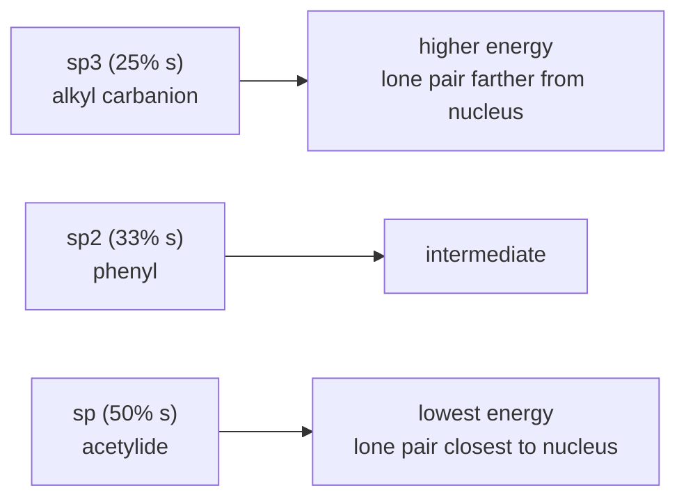

s orbitals are lower-energy and more penetrating than p orbitals, so more s-character means the lone pair is held tighter and at lower energy — exactly what "more stable" means for excess electron density.

---

**Q5.3.** Why does a Grignard reagent behave as a carbanion equivalent despite a non-fully-ionic C–Mg bond?

Show Answer

C is far more electronegative than Mg, so the C–Mg bond is strongly polarised (Cδ−–Mgδ+). Carbon carries substantial partial negative charge, making it strongly nucleophilic/basic in reactivity, even though spectroscopic evidence shows real covalent character remains (not a fully dissociated R⁻/Mg²⁺X⁺ pair).

---

**Q5.4.** Terminal alkynes (pKₐ ≈ 25) are deprotonated by NaNH₂ (conjugate acid pKₐ ≈ 38) but not NaOH (conjugate acid pKₐ ≈ 15.7). Justify.

Show Answer

A base deprotonates an acid only if its own conjugate acid has a *higher* pKₐ. NH₃ (38) ≫ alkyne (25), so NH₂⁻ removes the proton essentially to completion. Water (15.7) is a *stronger* acid than the alkyne, so OH⁻ is too weak — the reverse reaction dominates instead.

---

## 6. SN1 Reactions

**Q6.1.** SN1 rate law — why no [nucleophile] term?

Show Answer

$$\text{Rate} = k[\text{substrate}]$$

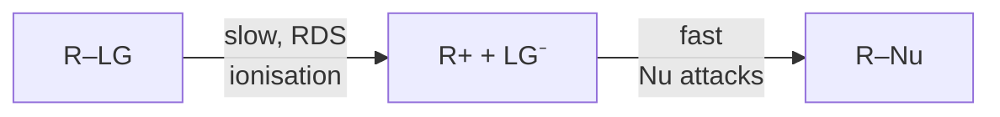

The rate law reflects only species present up to the rate-determining step. The nucleophile acts in the fast second step, so its concentration doesn't affect the observed rate.

---

**Q6.2.** Why does solvolysis of a chiral 2° halide give a racemic product?

Show Answer

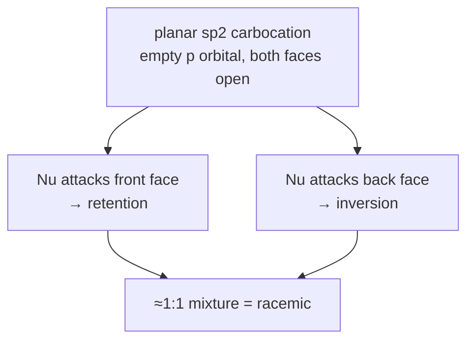

---

**Q6.3.** Rank SN1 rate: t-BuBr, i-PrBr, n-PrBr, MeBr.

Show Answer

$$\text{methyl} < n\text{-propyl} < \text{isopropyl} < tert\text{-butyl}$$

SN1 rate tracks carbocation stability directly since ionisation is rate-determining.

---

**Q6.4.** Doubling [substrate] doubles SN1 rate; doubling [Nu] does nothing. Does this mean the nucleophile is mechanistically irrelevant?

Show Answer

No. It's essential — required to trap the carbocation in step 2 — but not rate-limiting, so it doesn't appear in the rate law. Kinetics shows which species matter *up to the RDS*, not which are mechanistically necessary overall.

---

## 7. SN2 Reactions

**Q7.1.** Explain Walden inversion via the "umbrella" analogy.

Show Answer

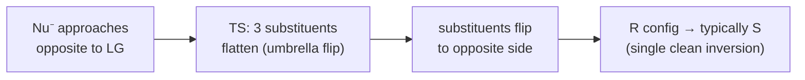

---

**Q7.2.** Why does SN2 rate drop sharply methyl → 1° → 2° → 3° (opposite to SN1)?

Show Answer

SN2 needs backside approach in one concerted step — sensitive to steric bulk at that carbon. Each alkyl substituent blocks the approach path, raising the TS energy; 3° is so crowded backside attack is essentially impossible. SN1 instead benefits from more substituents (they stabilise the sterically-irrelevant planar cation).

---

**Q7.3.** Effect of switching ethanol (protic) → DMSO (aprotic) on SN2 rate with Cl⁻.

Show Answer

Rate **increases**. Protic solvents H-bond to and "cage" the anion, lowering its nucleophilicity. Aprotic solvents can't H-bond to it — the "naked" anion is far more reactive, lowering the activation energy for backside attack.

---

**Q7.4.** (R)-2-bromobutane + NaI/acetone (Finkelstein) gives (S)-2-iodobutane — consistent with SN2?

Show Answer

Yes — I⁻ attacks opposite the departing Br⁻ in one concerted step, forcing spatial inversion. Here that spatial inversion happens to correspond to an R→S label flip too, confirming backside attack (a carbocation route would instead give a racemic mixture).

---

## 8. E1 Reactions

**Q8.1.** Why are E1 and SN1 always in competition?

Show Answer

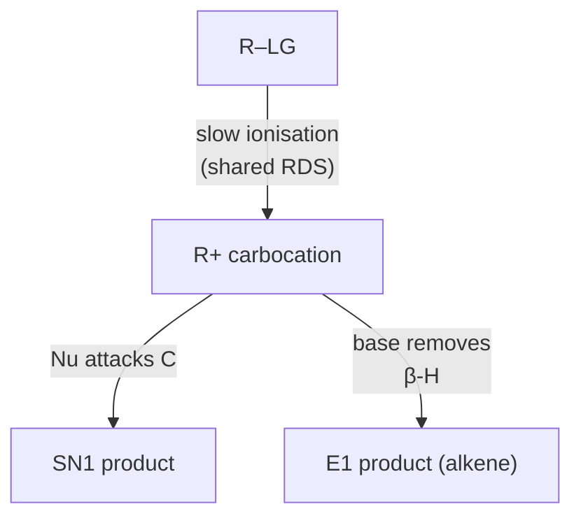

Both share the identical rate-determining ionisation step; once the cation exists, conditions (strong base/poor Nu, heat) tip the fork toward elimination or substitution.

---

**Q8.2.** State Zaitsev's rule and its thermodynamic basis.

Show Answer

Major product = the more substituted, more stable alkene. More alkyl groups donate density into the π system via hyperconjugation (same logic as cation stabilisation), and since E1's proton-loss step is under thermodynamic-like control at the branch point, the more stable alkene's pathway is favoured.

---

**Q8.3.** 3° alkyl halide heated in ethanol, no added base — substitution or elimination?

Show Answer

**Elimination (E1)** dominates. Heat favours elimination entropically; a weak nucleophile (ethanol) traps the stable 3° cation poorly compared to acting as a weak base toward a β-H. In practice both products form, but the E1 fraction rises with temperature and branching.

---

**Q8.4.** Why can E1 give a product with a rearranged carbon skeleton?

Show Answer

If the initial cation isn't maximally stable, a 1,2-hydride/alkyl shift can occur before proton loss, moving the + charge to a more stable position on a different carbon. Elimination then proceeds from *that* cation, so the resulting alkene reflects the rearranged skeleton.

---

## 9. E2 Reactions

**Q9.1.** Why does E2 require anti-periplanar geometry?

Show Answer

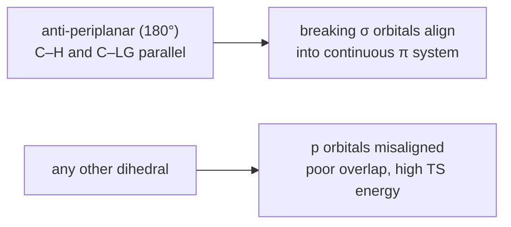

E2 is concerted: base removes β-H as LG leaves and a new π bond forms simultaneously — this only works when the emerging p orbitals line up, i.e. anti-periplanar.

---

**Q9.2.** Zaitsev vs Hofmann — when does Hofmann dominate?

Show Answer

Zaitsev → more substituted (stable) alkene, with small unhindered bases. Hofmann → less substituted alkene, dominates with **bulky bases** (e.g. tert-butoxide) since steric bulk makes the less hindered β-H much easier to reach than a crowded one — kinetic product wins over thermodynamic.

---

**Q9.3.** Why do meso- and (±)-2,3-dibromobutane give different alkene stereochemistry on E2?

Show Answer

Anti-periplanar geometry is strict, and each diastereomer's accessible conformations place different H/Br pairs anti to each other due to their differing relative configurations. This forces the two diastereomers through geometrically distinct TSs, giving different alkene geometry (e.g. E vs Z) — direct evidence E2 is concerted and stereospecific, not via a planar cation.

---

**Q9.4.** 2° alkyl bromide + strong, non-bulky, high-concentration ethoxide — SN2 or E2?

Show Answer

Genuinely competitive, but a strong small base at high concentration tends to favour **E2**, especially as branching increases toward 2°. Both are bimolecular (rate depends on [base]), but E2's TS is less sterically demanding at the reacting carbon than SN2's backside-attack TS.

---

## 10. Addition Reactions

**Q10.1.** State Markovnikov's rule and its electronic basis for HBr + propene.

Show Answer

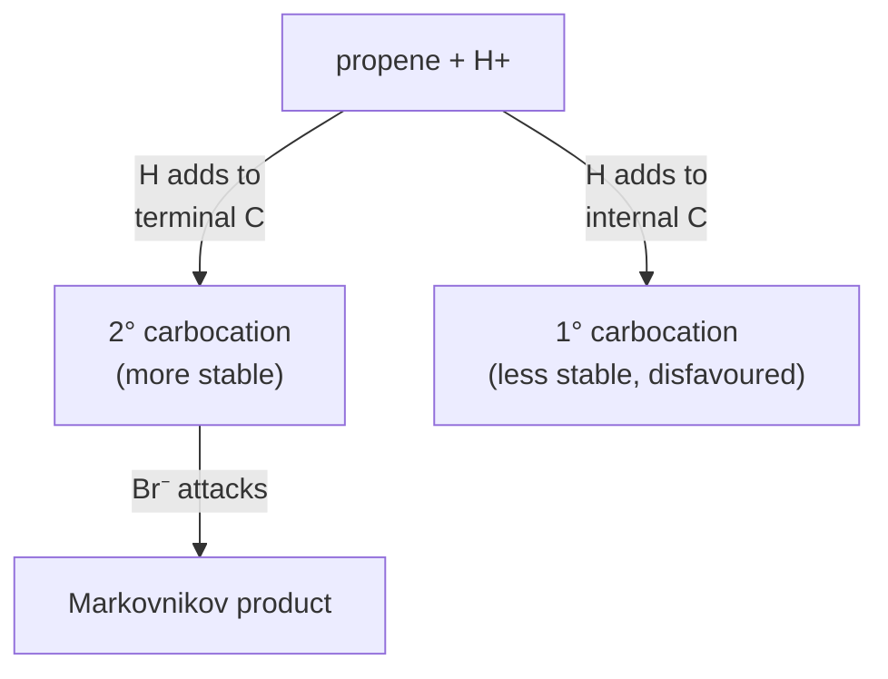

H bonds to the carbon that already has more H's; halide ends up on the more substituted carbon — because that path forms the more stable (here, 2°) carbocation, which forms faster.

---

**Q10.2.** Explain the peroxide (Kharasch) effect and why it's specific to HBr.

Show Answer

Peroxides switch HBr addition to a **radical chain mechanism**, giving the anti-Markovnikov product because regiochemistry is now set by Br• adding to the alkene (favouring the more stable, more substituted radical), not by protonation. Unique to HBr because the bond-energy balance of the propagation steps only works out (both initiable and efficiently propagating) for bromine — HCl's H-abstraction step is thermodynamically unfavourable, and HI's C–I bond is too weak relative to the H–I bond broken.

---

**Q10.3.** Why is H₂/catalyst addition *syn* while Br₂ addition is *anti*?

Show Answer

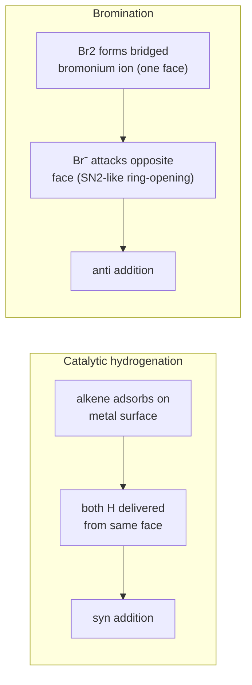

---

**Q10.4.** Why is Grignard addition to a carbonyl *nucleophilic* rather than electrophilic addition?

Show Answer

The Grignard carbon is electron-rich (δ− from the polarised C–Mg bond) and attacks the electron-poor carbonyl carbon (δ+, since O pulls density away) — electron-rich species initiating attack on an electron-poor centre defines nucleophilic addition. This is the reverse polarity pattern from electrophilic addition to a non-polarised alkene π bond.

---

## 11. Cross-Topic Challenge Questions

**Q11.1.** 3° alkyl bromide: (a) weak Nu, polar protic, no base vs (b) bulky strong base (KOtBu) — predict mechanism/product in each.

Show Answer

**(a)** SN1/E1 mixture — substrate ionises readily; weak Nu/base can't force a bimolecular pathway. Mix of substitution + Zaitsev-favoured elimination via the shared cation.

**(b)** **E2 dominates.** 3° is too hindered for SN2; a bulky strong base is a poor nucleophile but excellent for concerted anti-periplanar elimination, favouring the Hofmann (less substituted) alkene where a choice exists.

---

**Q11.2.** How does "carbocation stability" connect Topic 4 to both SN1 (Topic 6) and Markovnikov addition (Topic 10)?

Show Answer

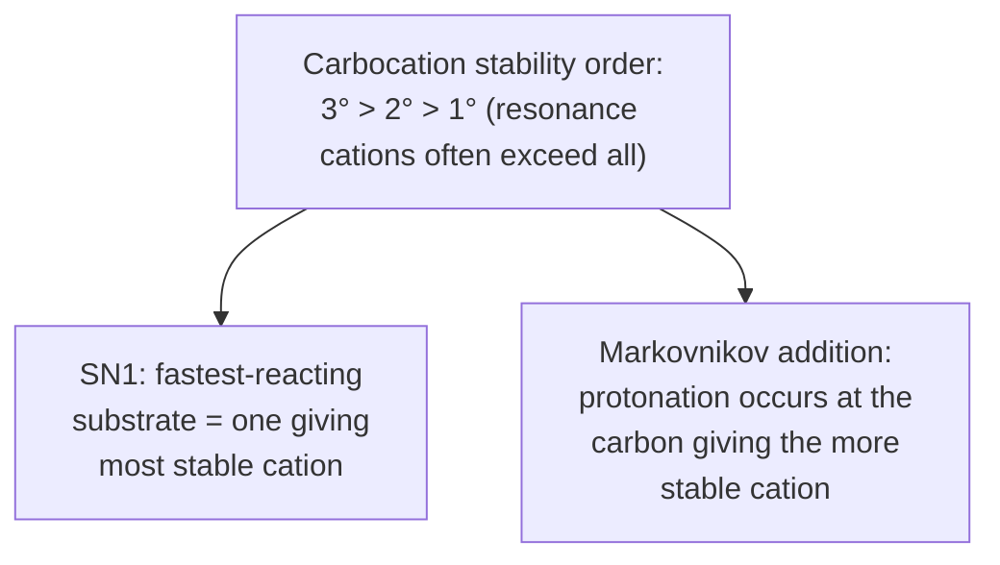

Both phenomena reduce to the same principle: the pathway generating the more stable cation is kinetically favoured (Hammond postulate — for an endothermic ionisation, the TS resembles the product cation).

---

**Q11.3.** Will increasing solvent polarity speed up SN2 with a neutral Nu (NH₃) but slow it down with an anionic Nu (OH⁻)?

Show Answer

Correct. With a **neutral** Nu + neutral substrate, the TS develops charge that wasn't present in the reactants — polar solvent stabilises that developing charge → rate increases. With an **anionic** Nu, charge is already concentrated on the small reactant-state nucleophile and becomes more diffuse in the TS — polar solvent stabilises the concentrated reactant state more than the diffuse TS → effective activation energy rises → rate decreases.

---

**Q11.4.** 2° alkyl chloride: inversion, rate depends on [Nu]. Similar 3° alkyl chloride: racemisation, rate independent of [Nu]. Identify each mechanism and the structural switch.

Show Answer

2° → **SN2** (inversion, bimolecular kinetics). 3° → **SN1** (racemisation, unimolecular kinetics, planar cation attacked from either face). The switch: the 3° centre is too hindered for backside attack (rules out SN2) but stable enough as a cation to ionise readily (enables SN1); the 2° centre is open enough for backside attack and doesn't form a cation stable enough to make ionisation competitive.

---

> 📖 Companion diagram set for [`butex-notes/CHEM-103/organic_reaction/qna.md`](https://github.com/itachi-re/butex-notes/blob/master/CHEM-103/organic_reaction/qna.md)
