# CHEM-103 — Exam Ready One-Shot Revision
## Organic Reactions & Organometallic Compounds

> **How to use this**: Read the ⭐ Key Points and Cheat Sheet first if you have <30 min. Otherwise go topic by topic in order — each builds on the last.

---

# PART A — ORGANIC REACTIONS

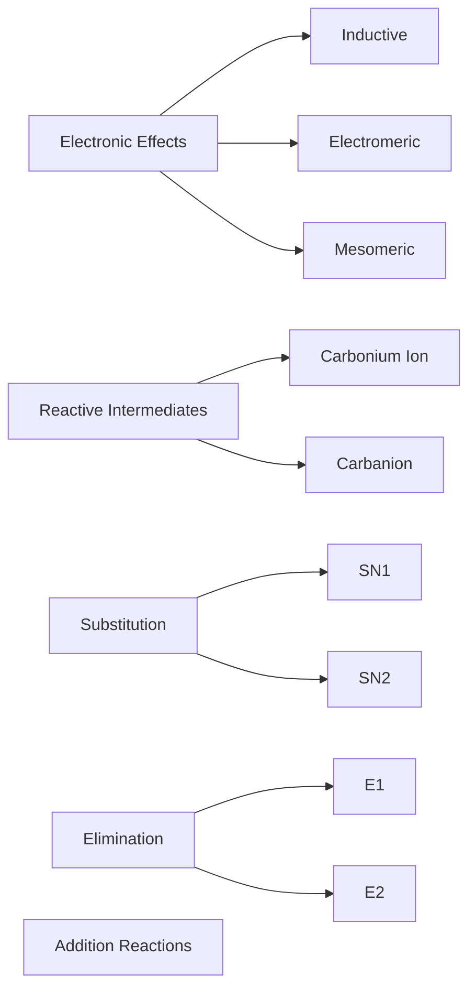

---

## 1. Inductive Effect (I-Effect)

### Definition
The **permanent displacement of σ (sigma) bonding electrons** along a carbon chain caused by a difference in electronegativity between atoms, transmitted through successive bonds with decreasing intensity.

### Simple Explanation
Think of it as electron "tug-of-war" through single bonds. An electronegative atom (like Cl, F, NO₂) pulls bonding electrons toward itself, and this pull is felt weakly down the chain — like ripples that die out after 2–3 bonds.

### Theory / Why It Happens
- σ-electrons are less polarizable than π-electrons, so the effect is **weak and permanent** (always present, doesn't need a reagent to "trigger" it).
- Effect dies off rapidly — negligible beyond the 3rd carbon from the substituent.
- Two types:
  - **−I effect (electron withdrawing):** −NO₂ > −CN > −F > −Cl > −Br > −I > −OH > −C6H5 > −H
  - **+I effect (electron donating):** (CH₃)₃C− > (CH₃)₂CH− > CH₃CH₂− > CH₃− > H−

### Mechanism (electron displacement)
```
δδδ+   δδ+   δ+     δ-
 C4 —— C3 —— C2 —— C1 —— Cl
        (effect weakens with distance →)
```

### Properties / Effects on Molecule
- **Acidity:** −I groups near −COOH increase acid strength (stabilize conjugate base).
- **Basicity:** +I groups (alkyl) near −NH₂ increase basicity of amines (electron density push).
- **Bond polarity & dipole moment** increases with −I substituents.

> **📌 Exam Tip:** Acidity order question (e.g., ClCH₂COOH vs CH₃COOH) is *always* an inductive effect question — more −I groups closer to −COOH = stronger acid.

### Memory Trick
**"I = Induced, In-chain, Instant, dIes quickly"** — Inductive effect is Instant (permanent) but fades fast down the chain.

### Short Note (3–5 marks)
Inductive effect is the permanent polarization of σ-bonds due to electronegativity difference, transmitted through the chain with diminishing strength, and used to explain relative acidity/basicity of substituted acids and amines.

### FAQ
**Q: Arrange in order of acid strength: CH₃COOH, ClCH₂COOH, Cl₂CHCOOH, Cl₃CCOOH.**
A: Cl₃CCOOH > Cl₂CHCOOH > ClCH₂COOH > CH₃COOH (more Cl = more −I = more stable conjugate base = stronger acid). *(5 marks: definition 2, order+reasoning 3)*

### Viva Qs
- Q: Does inductive effect involve π electrons? **A: No, only σ electrons.**
- Q: Is inductive effect permanent or temporary? **A: Permanent.**

### Common Mistakes
- ❌ Confusing inductive effect (σ, permanent, through-chain) with mesomeric effect (π, permanent, through resonance) — they are NOT the same.
- ❌ Assuming the effect is equal at every carbon — it decreases with distance.

### ⭐ Key Points
- **Must Remember:** −I withdraws, +I donates; effect dies after ~3 bonds.
- **Exam Favourite:** Acid/base strength ordering questions.
- **One-line:** Permanent σ-electron pull along a chain due to electronegativity difference.

---

## 2. Electromeric Effect (E-Effect)

### Definition
A **temporary effect** seen only in multiple bonds (C=C, C=O, C≡C) where π-electrons are completely transferred to one atom **in the presence of an attacking reagent**, and the effect disappears once the reagent is removed.

### Simple Explanation
It's like a spring-loaded electron jump — only happens at the exact moment a reagent attacks a double/triple bond, then relaxes back.

### Theory
- Occurs **only in unsaturated systems**.
- Instantaneous — faster than inductive effect.
- Two types:
  - **+E effect:** π-electrons move *toward* the attacking electrophilic reagent.
  - **−E effect:** π-electrons move *away* from the attacking reagent.

### Mechanism
```
     reagent (E+) approaches
            ↓
   C == C   --->   C⁺ — C : (electrons shift completely to one carbon)
   (π bond)          (carbocation formed at one carbon, other gets full pair)
```

### Memory Trick
**"E = Electrophile-triggered, Extinct after use"** — needs a reagent, vanishes after.

### Short Note
Electromeric effect is the temporary, complete transfer of π-electrons to one atom of a multiple bond under the influence of an attacking reagent; it disappears when the reagent is removed. Occurs only in unsaturated compounds and is much faster than inductive effect.

### FAQ
**Q: Differentiate Inductive and Electromeric effect (any 4 points).**
| Point | Inductive | Electromeric |
|---|---|---|
| Bond involved | σ | π |
| Permanence | Permanent | Temporary |
| Needs reagent? | No | Yes |
| Speed | Slow | Instantaneous |

### Viva Qs
- Q: Can electromeric effect occur in ethane? **A: No — no multiple bond present.**

### ⭐ Key Points
- **Must Remember:** Only in π-systems, needs attacking reagent, temporary.
- **One-line:** Instant, complete π-electron shift toward/away from an attacking reagent.

---

## 3. Mesomeric Effect (Resonance / M-Effect)

### Definition
The **permanent delocalization of π-electrons or lone pair electrons** between conjugated atoms via overlapping p-orbitals, resulting in resonance structures.

### Simple Explanation
Electrons in a conjugated system aren't stuck in one place — they're "smeared out" over several atoms, like paint spreading across connected tiles.

### Theory
- Requires **conjugation** (alternate single-double bonds, or lone pair next to a π-system).
- Permanent (unlike electromeric), delocalized (unlike inductive which is localized-chain based).
- **+M (electron donating by resonance):** −NH₂, −OH, −OR, −Cl (halogens, weak +M), alkyl groups on benzene ring via hyperconjugation-assisted resonance.
- **−M (electron withdrawing by resonance):** −NO₂, −CN, −CHO, −COOH, −COR.

### Mechanism (Resonance in Aniline, −NH₂ on benzene)
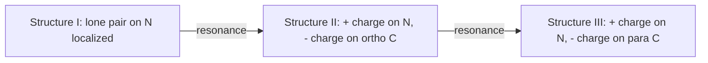
```
      NH2                    NH2(+)                 NH2(+)
       |                      ||                      ||
    benzene ring   <-->   ring (- at ortho C)  <-->  ring (- at para C)
```

### Properties
- +M groups on benzene → **activate ring, direct o/p** (electrophilic substitution).
- −M groups on benzene → **deactivate ring, direct meta**.
- −M groups on carboxylic acid α-carbon → increase acidity (stabilize carboxylate anion by resonance).

> **⚠️ Common Mistake:** Students often mix up +M vs +I for halogens. Halogens are **−I but +M** (weakly). Net effect on benzene ring: deactivating (−I dominates) but o/p directing (+M dominates orientation).

### FAQ
**Q: Why is phenol more acidic than ethanol?**
A: In phenoxide ion, the negative charge on O is delocalized into the benzene ring by resonance (−M stabilization), spreading charge and lowering energy. In ethoxide, no such delocalization exists — charge stays fully on O. Hence phenol is a stronger acid. *(5 marks)*

### Viva Qs
- Q: Is mesomeric effect permanent or temporary? **A: Permanent.**
- Q: Give one +M and one −M group. **A: +M = −OH; −M = −NO₂.**

### ⭐ Key Points
- **Must Remember:** Needs conjugation; permanent; delocalizes charge.
- **Exam Favourite:** Phenol vs alcohol acidity; aniline basicity vs ammonia.
- **One-line:** Permanent delocalization of π/lone-pair electrons through a conjugated system via resonance.

---

## Comparison Table: Inductive vs Electromeric vs Mesomeric

| Feature | Inductive | Electromeric | Mesomeric |
|---|---|---|---|
| Electrons involved | σ | π | π / lone pair |
| Permanence | Permanent | Temporary | Permanent |
| Needs reagent | No | Yes | No |
| Requires conjugation/multiple bond | No | Yes (multiple bond) | Yes (conjugation) |
| Speed | Slow, distance-dependent | Instantaneous | Fast |
| Example effect | Acid strength of haloacids | Addition to alkenes | Acidity of phenol, o/p direction in benzene |


---

## 4. Carbonium Ions (Carbocations)

### Definition
A species in which carbon bears a **positive charge**, has **6 electrons** in its valence shell, is **sp² hybridized**, and is **trigonal planar**.

### Simple Explanation
It's an electron-deficient carbon — like a chair missing one leg (an empty p-orbital), desperately wanting electrons.

### Theory / Formation
Formed by heterolytic bond cleavage where the leaving group takes both bonding electrons:
```
R—X  →  R⁺  +  X⁻   (heterolysis; X = leaving group, e.g. halide)
```

### Structure
- sp² hybridized, **planar**, bond angle ≈120°
- Empty unhybridized p-orbital perpendicular to the plane

```
        empty p-orbital
              |
              |
    H₃C ——— C⁺ ——— CH₃      (trigonal planar, sp²)
              |
             CH₃
     (this is tertiary butyl cation)
```

### Stability Order
**3° > 2° > 1° > methyl** (more alkyl groups = more +I & hyperconjugation donating electron density into empty p-orbital, stabilizing the cation)


Also stabilized by resonance: **allylic/benzylic > 3° alkyl**

### Rearrangements
Carbocations can rearrange to a **more stable** cation via:
- **1,2-Hydride shift** (H⁻ migrates)
- **1,2-Alkyl shift** (methyl/alkyl migrates)

```
CH3-CH2-CH+-CH3  (2°)  →  hydride shift  →  more stable 3° if adjacent C allows
```

> **📌 Exam Tip:** Whenever a question shows a 2° carbocation next to a 3° carbon, ALWAYS mention rearrangement — this is a favorite trick question in SN1/E1 mechanisms.

### Memory Trick
**"Carbonium = Cation = 6 electrons = sp2 = flat"**

### Short Note
Carbocations are sp² hybridized, planar, electron-deficient carbon species with 6 valence electrons, stabilized by +I alkyl groups, hyperconjugation, and resonance; stability order 3°>2°>1°>methyl; prone to rearrangement to more stable forms.

### Viva Qs
- Q: Hybridization of carbocation? **A: sp².**
- Q: Why is 3° carbocation most stable? **A: Maximum hyperconjugation + inductive electron donation from 3 alkyl groups.**

### ⭐ Key Points
- **One-line:** sp², planar, electron-deficient carbon cation, stability 3°>2°>1°.

---

## 5. Carbanions

### Definition
A species in which carbon bears a **negative charge**, has a **lone pair of electrons**, is generally **sp³ hybridized**, and is **pyramidal** (like NH₃).

### Simple Explanation
The opposite of a carbocation — carbon has *too many* electrons (a lone pair) and negative charge.

### Structure
```
          lone pair
             \
              C⁻
            / | \
          H   H   H     (pyramidal, sp3, similar shape to NH3)
```

### Stability Order
**Methyl > 1° > 2° > 3°** (opposite of carbocation!) — because alkyl groups are +I (electron donating) and *destabilize* extra negative charge by intensifying it.

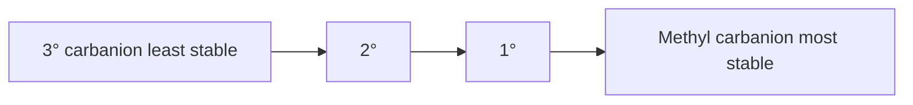

Carbanions are also stabilized by **−I groups nearby** (e.g., adjacent to −NO₂, C≡N) and by **resonance delocalization** (allylic, benzylic, or adjacent to carbonyl as in enolates).

> **⚠️ Common Mistake:** Students apply carbocation stability order (3°>2°>1°) to carbanions by mistake. It is **reversed** for carbanions!

### Formation
```
R-H  +  strong base (B⁻)  →  R⁻  +  B-H     (deprotonation)
```

### Memory Trick
**"Carbanion = Anion = lone pair = pyramidal, and stability is bAckwards (Methyl best)"**

### FAQ
**Q: Why is a carbanion adjacent to a carbonyl group (enolate) more stable?**
A: The negative charge delocalizes by resonance onto the more electronegative oxygen of the carbonyl, forming a stabilized enolate — resonance stabilization dominates over the destabilizing +I of alkyl groups. *(4 marks)*

### ⭐ Key Points
- **Must Remember:** sp³, pyramidal, lone pair, stability order reversed vs carbocation.
- **One-line:** sp³, pyramidal carbanion with lone pair; stability Methyl>1°>2°>3°.

---

## Comparison Table: Carbonium Ion vs Carbanion

| Feature | Carbocation (Carbonium ion) | Carbanion |
|---|---|---|
| Charge | + | − |
| Electrons on C | 6 | 8 (lone pair) |
| Hybridization | sp² | sp³ |
| Geometry | Planar (trigonal) | Pyramidal |
| Stability order | 3° > 2° > 1° > methyl | Methyl > 1° > 2° > 3° |
| Stabilized by | +I groups, hyperconjugation, resonance | −I groups, resonance (enolates), NOT alkyl +I |
| Formed in | SN1, E1 | E2 (transition state character), strong-base deprotonation |


---

## 6. SN1 Reaction (Unimolecular Nucleophilic Substitution)

### Definition
A substitution reaction proceeding through a **carbocation intermediate**, where the **rate-determining step involves only the substrate** (one molecule), making it first-order kinetics.

### Simple Explanation
"Slow ionization first, then fast attack." The substrate leaves its leaving group first (slow step), forming a carbocation; the nucleophile then attacks that cation quickly.

### Theory / Why It Happens
Favored when the carbocation formed is stable (3° substrates), in polar protic solvents (stabilize ions), with weak nucleophiles.

### Mechanism (Step-by-step)
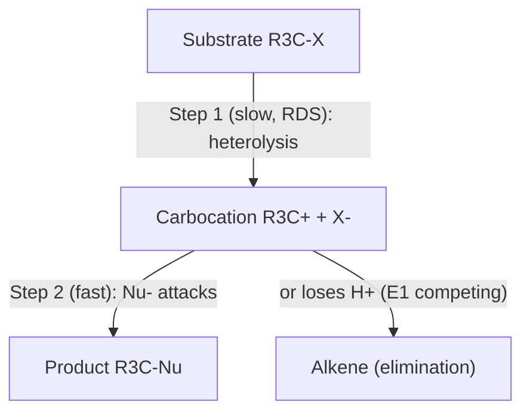

**Step 1 (Rate Determining Step, slow):**
```
R3C—X  ---(heterolytic cleavage)-->  R3C⁺  +  X⁻
(tertiary halide)      (planar carbocation, sp2)
```
**Step 2 (fast):**
```
R3C⁺  +  Nu⁻(or H2O)  -->  R3C—Nu   (nucleophile attacks from either face)
```

### Stereochemistry
- Carbocation is **planar** → nucleophile can attack from either face
- Result: **Racemization** (mixture of both enantiomers, though often slight excess of inversion product due to ion-pairing/backside shielding)

### Energy Profile
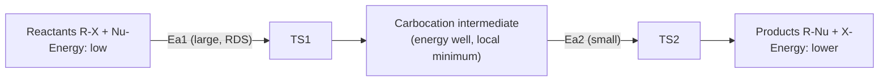
```
Energy
  |        TS1                    TS2
  |       /    \                 /    \
  |      /      \               /      \
  |     /        \   intermediate       \
  |    /           \_____(carbocation)___\
  |   /                                    \___ Products
  |  Reactants
  |________________________________________________ Reaction Coordinate
```
- **Two transition states, one intermediate (carbocation)**
- First activation energy (Ea1) >> second (Ea2) since ionization is RDS

### Rate Law
Rate = k[R-X]   (**first order**, depends only on substrate concentration, independent of [Nu⁻])

### Rearrangements
Since a free carbocation intermediate forms, **hydride/alkyl shifts** are common — always check for rearranged products in 2°/3° substrates.

### Favoring Conditions
| Factor | Favors SN1 |
|---|---|
| Substrate | 3° > 2° (1° almost never) |
| Solvent | Polar protic (H₂O, ROH) |
| Nucleophile | Weak, in excess (often solvent itself) |
| Leaving group | Good LG (I⁻, Br⁻, TsO⁻) |

### Reaction Example
```
(CH3)3C-Br  +  H2O  --(SN1, heat)-->  (CH3)3C-OH  +  HBr
tert-butyl bromide          tert-butyl alcohol
```

### Memory Trick
**"SN1 = Slow, one step in RDS, one molecule (substrate only) decides rate → 1°rder kinetics, racemization"**

### Short Note (3–5 marks)
SN1 is a two-step nucleophilic substitution proceeding via a planar carbocation intermediate. The rate-determining step is unimolecular ionization of the substrate, giving first-order kinetics (Rate = k[RX]). It favors 3° substrates, polar protic solvents, and weak nucleophiles, and typically shows racemization with possible carbocation rearrangement.

### Long Note (7–10 marks)
Should discuss: definition → mechanism (2 steps with diagram) → energy profile (2 TS, 1 intermediate) → rate law derivation → stereochemistry (racemization due to planar intermediate) → rearrangement possibility → factors favoring SN1 (substrate/solvent/LG/Nu) → one worked example → comparison note vs SN2.

### FAQ
**Q: Why does tert-butyl bromide undergo hydrolysis via SN1 and not SN2?**
A: The bulky tertiary carbon is sterically hindered for backside attack (rules out SN2), and it forms a highly stable tertiary carbocation stabilized by hyperconjugation and +I effect from three methyl groups — making the SN1 pathway (via ionization) kinetically and thermodynamically favorable. *(5 marks)*

### Viva Qs
- Q: What is the order of an SN1 reaction? **A: First order (unimolecular RDS).**
- Q: Does SN1 give pure inversion? **A: No, racemization (with possible slight excess of inversion).**

### Common Mistakes
- ❌ Saying SN1 is "fast" overall — only the *second* step is fast; the first (RDS) is slow.
- ❌ Forgetting to mention carbocation rearrangement possibility.
- ❌ Saying SN1 gives 100% inversion (that's SN2).

### ⭐ Key Points
- **Must Remember:** Rate = k[RX]; 2 steps; carbocation intermediate; racemization.
- **Exam Favourite:** tert-Butyl bromide hydrolysis mechanism with energy diagram.
- **One-line:** Two-step substitution via carbocation, first-order, racemizing, favored by 3° substrates + polar protic solvent.

---

## 7. SN2 Reaction (Bimolecular Nucleophilic Substitution)

### Definition
A **single-step**, concerted substitution reaction where the nucleophile attacks the substrate from the **backside** (opposite to the leaving group) exactly as the leaving group departs — rate depends on **both** substrate and nucleophile concentration (second order).

### Simple Explanation
"One-step push-pull": the nucleophile pushes in from behind while the leaving group is pushed out the front — like an umbrella flipping inside-out in the wind (Walden inversion).

### Mechanism
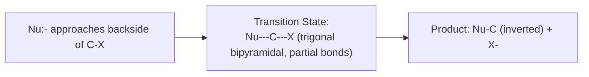
```
              δ-           δ-
   Nu:⁻  +  C—X   →   [ Nu···C···X ]‡   →   Nu—C  +  X⁻
           /|\               |                  /|\
          H H H         (trigonal bipyramidal   (configuration
                          transition state)       INVERTED — "umbrella flip")
```

### Stereochemistry
**Complete Walden inversion** — backside attack flips configuration like an umbrella turning inside out in wind (R → S or vice versa, 100% inversion, no racemization).

### Energy Profile
```
Energy
  |              TS (single, trigonal bipyramidal)
  |             /  \
  |            /    \
  |           /      \
  |  Reactants        \___ Products
  |________________________________ Reaction Coordinate
```
- **Only ONE transition state, NO intermediate** — this is the key visual difference from SN1.

### Rate Law
Rate = k[R-X][Nu⁻]  (**second order** overall — both substrate and nucleophile matter)

### Favoring Conditions
| Factor | Favors SN2 |
|---|---|
| Substrate | Methyl > 1° > 2° (3° never — too hindered) |
| Solvent | Polar aprotic (DMSO, DMF, acetone) — doesn't cage the nucleophile |
| Nucleophile | Strong, good concentration (CN⁻, OH⁻, RO⁻) |
| Leaving group | Good LG (I⁻ > Br⁻ > Cl⁻) |

### Reaction Example
```
CH3-Br  +  OH⁻  --(SN2)-->  CH3-OH  +  Br⁻
(methyl bromide, backside attack, inversion at this achiral center not visible but mechanism still concerted)
```

### Memory Trick
**"SN2 = Second order, Single step, Swap sides (inversion), Sterically sensitive"**

### Short Note
SN2 is a single-step, concerted bimolecular substitution where a nucleophile attacks the backside of the substrate carbon as the leaving group departs, giving complete Walden inversion. Rate = k[RX][Nu⁻] (second order); favored by unhindered (1°/methyl) substrates, strong nucleophiles, and polar aprotic solvents.

### FAQ
**Q: Why does SN2 not occur readily with tertiary alkyl halides?**
A: The bulky alkyl groups around the carbon create steric hindrance that blocks backside approach of the nucleophile, making the required trigonal bipyramidal transition state very high in energy — so 3° substrates instead favor SN1. *(4 marks)*

### Viva Qs
- Q: Order of SN2? **A: Second order.**
- Q: Stereochemical outcome of SN2 on a chiral center? **A: Complete inversion (Walden inversion).**

### Common Mistakes
- ❌ Drawing two transition states / an intermediate for SN2 — there is only ONE TS and no intermediate.
- ❌ Forgetting that SN2 rate depends on nucleophile concentration too.

### ⭐ Key Points
- **Must Remember:** One step, backside attack, 100% inversion, Rate=k[RX][Nu].
- **Exam Favourite:** Methyl/1° halide + strong Nu mechanism with TS structure.
- **One-line:** Single-step, concerted backside attack with full inversion, second-order kinetics.

---

## Comparison Table: SN1 vs SN2

| Feature | SN1 | SN2 |
|---|---|---|
| Mechanism | 2 steps, via carbocation | 1 step, concerted |
| Rate law | Rate = k[RX] (1st order) | Rate = k[RX][Nu⁻] (2nd order) |
| Substrate | 3° (2° sometimes) | Methyl, 1° (2° sometimes) |
| Solvent | Polar protic | Polar aprotic |
| Nucleophile strength | Weak, can be solvent | Strong, good concentration |
| Intermediate | Carbocation (yes) | None |
| Stereochemistry | Racemization | Complete inversion (Walden) |
| Rearrangement | Possible | Not possible (no cation) |
| Transition states | 2 | 1 |
| Leaving group | Good LG needed | Good LG needed |

---

## 8. E1 Reaction (Unimolecular Elimination)

### Definition
A two-step elimination reaction proceeding through a **carbocation intermediate**, where **loss of a β-hydrogen** (instead of nucleophilic attack) generates a double bond. Rate-determining step is unimolecular (ionization), so first order.

### Mechanism
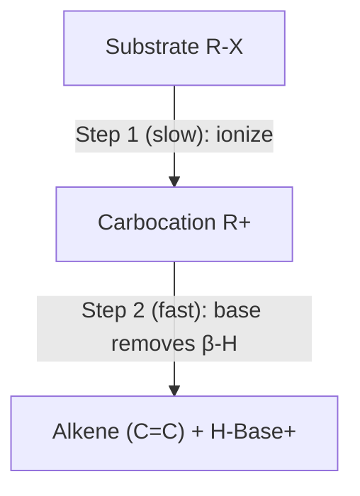
```
Step 1:  R3C—X  →  R3C⁺  +  X⁻            (slow, RDS, same as SN1's first step)
Step 2:  R3C⁺  +  :B  →  C=C  +  H—B⁺      (base removes a β-hydrogen, π bond forms)
```

### Energy Profile
Same shape as SN1 (2 TS, 1 carbocation intermediate) — E1 and SN1 **compete** from the same carbocation intermediate; which product you get (substitution vs elimination) depends on whether the reagent acts as nucleophile or base.

### Regiochemistry
Follows **Zaitsev's Rule**: the more substituted (more stable) alkene is the major product.

### Favoring Conditions
- 3° substrates, weak base/nucleophile, heat (favors elimination over substitution), polar protic solvents.

### Memory Trick
**"E1 = same intermediate as SN1, just base grabs H instead of Nu grabbing C"**

### Short Note
E1 is a two-step elimination via a carbocation intermediate (same slow ionization step as SN1); a base then removes a β-hydrogen to form the alkene, following Zaitsev's rule for the major product. First order kinetics; favored by 3° substrates and heat.

### Viva Qs
- Q: What determines whether SN1 or E1 product forms from the same carbocation? **A: Whether the reagent attacks as a nucleophile (substitution) or removes a β-H as a base (elimination).**

### ⭐ Key Points
- **One-line:** Two-step elimination via carbocation, first order, gives Zaitsev (more substituted) alkene.

---

## 9. E2 Reaction (Bimolecular Elimination)

### Definition
A **single-step, concerted** elimination where a strong base removes a β-hydrogen **at the same time** the leaving group departs, forming a π bond — requires **anti-periplanar** geometry.

### Mechanism
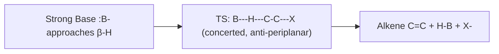
```
        B:⁻
         |
         H  (β-H, anti to X)
         |
    X—C—C           →     C=C   +   H-B   +   X⁻
       (anti-periplanar arrangement required)
```

### Stereochemistry
Requires **anti-periplanar** (180°) arrangement of the β-H and the leaving group for effective orbital overlap in the developing π-bond — this dictates *which* stereoisomer of alkene forms from a given substrate stereoisomer.

### Regiochemistry
Usually **Zaitsev product** (more substituted alkene) with normal bases; **Hofmann product** (less substituted) with bulky bases (e.g., tert-butoxide).

### Rate Law
Rate = k[RX][Base] — **second order**, single step, no intermediate.

### Favoring Conditions
- 2°/3° substrates (can also occur on 1° with bulky strong base), strong bulky bases (like KOtBu), heat.

### Memory Trick
**"E2 = Everything at once (concerted), anti-periplanar, 2nd order"**

### Short Note
E2 is a single-step, concerted elimination in which a strong base removes a β-hydrogen anti-periplanar to the leaving group as it departs, forming an alkene. Rate = k[RX][Base] (second order); gives Zaitsev product usually, Hofmann with bulky base; no carbocation, so no rearrangement.

### FAQ
**Q: Why is anti-periplanar geometry required in E2?**
A: For proper backside orbital overlap between the developing p-orbital on the leaving carbon and the C–H σ-bond being broken, allowing simultaneous formation of the π-bond as both groups leave — this maximizes orbital overlap and minimizes torsional strain in the TS. *(4 marks)*

### Viva Qs
- Q: Order of E2? **A: Second order.**
- Q: Does E2 involve a carbocation? **A: No — single concerted step.**

### Common Mistakes
- ❌ Confusing E1 (stepwise, carbocation, Zaitsev only) with E2 (concerted, anti-periplanar, Zaitsev/Hofmann depending on base).

### ⭐ Key Points
- **One-line:** Single-step, concerted, anti-periplanar elimination, second order, Zaitsev/Hofmann depending on base bulk.

---

## Comparison Table: E1 vs E2

| Feature | E1 | E2 |
|---|---|---|
| Steps | 2 (via carbocation) | 1 (concerted) |
| Rate law | k[RX] | k[RX][Base] |
| Substrate | 3° | 2°, 3° (1° with strong bulky base) |
| Base | Weak | Strong (bulky → Hofmann) |
| Geometry requirement | None strict | Anti-periplanar |
| Product (Zaitsev/Hofmann) | Zaitsev only | Zaitsev (normal base) / Hofmann (bulky base) |
| Rearrangement | Possible | Not possible |

## Comparison Table: Addition vs Substitution

| Feature | Addition Reaction | Substitution Reaction |
|---|---|---|
| Bond change | π bond broken, 2 new σ formed | 1 σ (C-LG) broken, 1 new σ (C-Nu) formed |
| Typical substrate | Alkenes/alkynes (unsaturated) | Alkyl halides (saturated, sp3 C) |
| Degree of unsaturation | Decreases | Unchanged |
| Example | Br2 addition to ethene | OH- substitution on CH3Br |


---

## 10. Addition Reactions (Electrophilic Addition to Alkenes)

### Definition
A reaction where **two atoms/groups add across a multiple bond** (C=C or C≡C), converting it to a single bond, without loss of any atoms.

### Simple Explanation
The π-bond (weak, exposed electron cloud) acts as a nucleophile and attacks an electrophile; the double bond "opens up" to grab two new groups.

### Mechanism — Electrophilic Addition of HBr to Propene (Markovnikov)
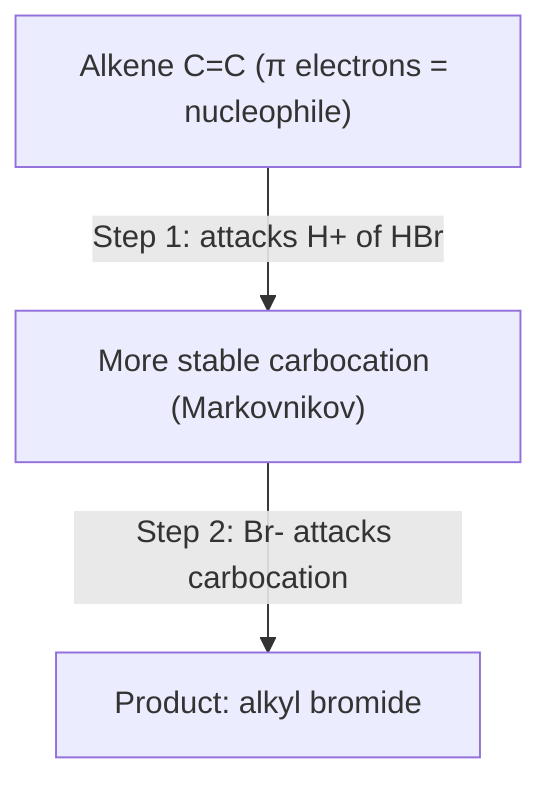
```
Step 1:  CH3-CH=CH2  +  H-Br  →  CH3-CH⁺-CH3  +  Br⁻   (H adds to less substituted C, giving more stable 2° cation)
Step 2:  CH3-CH⁺-CH3  +  Br⁻  →  CH3-CHBr-CH3           (Br- attacks carbocation)
```

### Markovnikov's Rule
"H adds to the carbon already bearing more H atoms" — mechanistically: **H⁺ adds to give the MORE STABLE carbocation** (more substituted carbon gets the new group X).

### Anti-Markovnikov (Peroxide/Kharasch effect)
With peroxides, HBr adds via a **free-radical mechanism** instead, giving the opposite regiochemistry (Br adds to less substituted carbon). *Only works for HBr, not HCl/HI.*

### Energy Profile
Similar 2-step shape to SN1 (carbocation intermediate as local minimum between two transition states).

### Memory Trick
**"Markovnikov: rich get richer"** — the carbon with more H's already, gets even more (H adds there); the more substituted carbon gets the halogen.

### Short Note
Electrophilic addition converts a C=C π-bond into two new σ-bonds via a carbocation intermediate; Markovnikov's rule predicts H adds to give the more stable (more substituted) carbocation, so X ends up on the more substituted carbon. Peroxides reverse this (anti-Markovnikov) via a radical mechanism, only for HBr.

### FAQ
**Q: Predict product of propene + HBr in presence of peroxide.**
A: Anti-Markovnikov addition occurs via a free-radical chain mechanism; Br adds to the terminal (less substituted) carbon, giving 1-bromopropane instead of the Markovnikov 2-bromopropane. *(4 marks)*

### Viva Qs
- Q: Does Markovnikov's rule apply to HCl with peroxide? **A: No, peroxide effect is specific to HBr.**

### ⭐ Key Points
- **Must Remember:** Markovnikov = H to more-H carbon, X to more-substituted carbon (via more stable carbocation).
- **Exam Favourite:** Peroxide (Kharasch) effect reversing regiochemistry for HBr only.
- **One-line:** π-bond electrons act as nucleophile, forming carbocation intermediate that decides regiochemistry per Markovnikov's rule.

---
---

# PART B — ORGANOMETALLIC COMPOUNDS

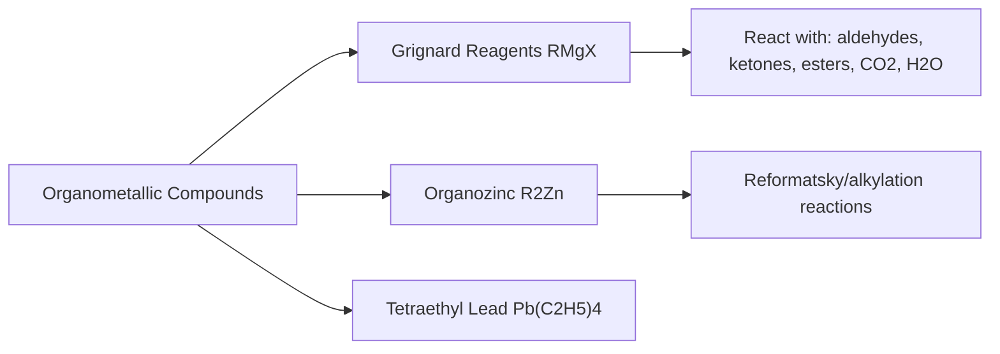

## 1. Introduction to Organometallic Chemistry

### Definition
Compounds containing a **direct bond between carbon and a metal atom** (C–M bond), where M is typically an electropositive metal (Mg, Zn, Li, Pb, Na, etc.)

### Simple Explanation
Carbon normally isn't very reactive, but attach it to a metal and it becomes a strong **carbanion-like nucleophile** — this is the basis of huge swaths of organic synthesis (C–C bond formation).

### Theory
- The C–M bond is **polarized**: C is δ⁻ (carbanion character), M is δ⁺, because carbon is more electronegative than most metals.
- This makes the carbon **strongly nucleophilic/basic** — organometallics react instantly with anything acidic (water, alcohols, amines) and add to electrophilic carbons (C=O).

### Classification
| Type | Example | Bond character |
|---|---|---|
| Ionic organometallics | Organosodium, organopotassium | Highly ionic C-M |
| Covalent/polar-covalent | Grignard (RMgX), organozinc (R2Zn) | Polarized covalent |
| Covalent (near non-polar) | Tetraethyl lead Pb(C2H5)4 | Mostly covalent |

### Applications (industrial)
- C–C bond formation (Grignard, organozinc, organolithium reagents) in pharmaceutical/fine chemical synthesis
- Catalysis (organometallic catalysts — Ziegler-Natta, Grubbs, etc. — advanced topic)
- Historically, anti-knock additives in petrol (tetraethyl lead — now banned in most countries due to toxicity)

### ⭐ Key Points
- **One-line:** Organometallics have a polarized C–M bond giving carbon strong carbanion/nucleophilic character, central to C–C bond-forming reactions.

---

## 2. Grignard Reagent (RMgX)

### Definition
An organomagnesium halide of general formula **R–Mg–X** (R = alkyl/aryl, X = Cl, Br, I), prepared by reacting an alkyl/aryl halide with magnesium metal in dry ether.

### Preparation
```
R—X  +  Mg  --(dry ether, anhydrous, under N2)-->  R—Mg—X
```
> **⚠️ Must be strictly anhydrous** — even trace water destroys the reagent (see reactions below).

### Structure
```
       Et
        \
         O          (ether solvates and coordinates Mg,
        /            stabilizing the reagent)
       Et
        |
   R ——Mg—— X
```
Bond: C–Mg is polarized, C is δ⁻ (carbanion-like), Mg is δ⁺.

### Reactions (Very High-Yield Exam Topic)

**(a) With water/protic sources (destructive — shows carbanion character):**
```
R-MgX  +  H2O  →  R-H  +  Mg(OH)X
```

**(b) With CO2 (→ carboxylic acid, +1 carbon):**
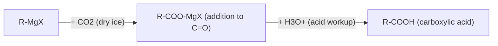

**(c) With aldehydes/ketones (→ alcohols):**
```
R-MgX  +  H-CHO  →  R-CH2-O-MgX  --(H3O+)-->  R-CH2-OH        (1° alcohol, formaldehyde)
R-MgX  +  R'-CHO  →  R'-CH(R)-O-MgX  --(H3O+)-->  R'-CH(R)-OH  (2° alcohol, other aldehydes)
R-MgX  +  R'2C=O  →  R'2C(R)-O-MgX  --(H3O+)-->  R'2C(R)-OH    (3° alcohol, ketones)
```

**Mechanism (nucleophilic addition to carbonyl):**
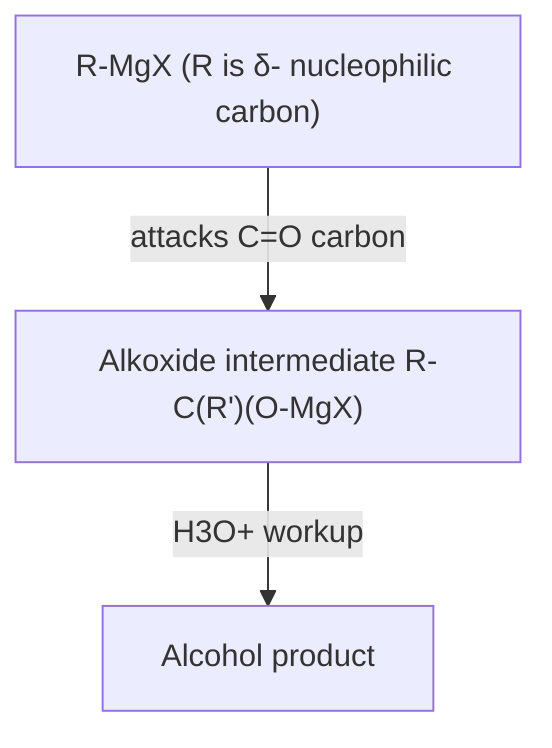
```
        δ+  δ-
   R'2C=O   +   R-MgX   →   R'2C(R)-O-MgX   --H3O+-->   R'2C(R)-OH
   (electrophilic C)    (nucleophile attacks C=O carbon, Mg goes to O)
```

**(d) With esters (2 equivalents → 3° alcohol):**
```
R-COOR'  +  2 R''-MgX  →  R-C(R'')2-OH  +  R'OH  (goes through ketone intermediate)
```

**(e) With epoxides (→ primary alcohol with 2-carbon extension):**
```
CH2—CH2  +  R-MgX  →  R-CH2-CH2-O-MgX  --H3O+-->  R-CH2-CH2-OH
  \O/
```

### Summary Table of Grignard Reactions
| Reagent reacted with | Product | Carbons added |
|---|---|---|
| H2O / ROH / NH3 (acidic H) | R-H (alkane) | 0 (destructive) |
| CO2 | R-COOH | +1 |
| HCHO | 1° alcohol | +1 |
| Other aldehyde | 2° alcohol | + variable |
| Ketone | 3° alcohol | + variable |
| Ester (2 eq.) | 3° alcohol | + variable |
| Epoxide | 1° alcohol (2C extended) | +2 |

### Precautions / Limitations
- Must be prepared and used under **strictly anhydrous, moisture-free** conditions (dry ether, N2 atmosphere).
- **Cannot** be used on substrates with acidic protons (−OH, −NH, −COOH, −SH) in the same molecule — it will just get destroyed by protonation before reacting productively.
- Reacts violently/exothermically with water.

### Memory Trick
**"Grignard = Green (go anywhere) but Gets destroyed by water/acidic H — always adds to C=O carbon"**

### Short Note
Grignard reagents (RMgX) are organomagnesium halides prepared from alkyl/aryl halides and Mg in dry ether; the polarized, carbanion-like carbon acts as a strong nucleophile, adding to carbonyl compounds (CO2, aldehydes, ketones, esters, epoxides) to build alcohols/acids with new C–C bonds, but are destroyed by any acidic proton source (water, alcohols).

### FAQ
**Q: Why must Grignard reagent preparation be carried out under anhydrous conditions?**
A: Water (or any acidic proton source) reacts instantly with the highly reactive, carbanion-like carbon of the Grignard reagent, protonating it to give the corresponding alkane and destroying the reagent before it can perform any useful synthesis. *(4 marks)*

**Q: How would you prepare a tertiary alcohol using a Grignard reagent?**
A: React a ketone (R'2C=O) with a Grignard reagent (R-MgX) via nucleophilic addition to give the magnesium alkoxide, then hydrolyze with dilute acid (H3O+) to obtain the 3° alcohol R'2C(R)-OH. *(5 marks)*

### Viva Qs
- Q: What solvent is essential for Grignard formation? **A: Dry (anhydrous) ether.**
- Q: What happens if Grignard reagent contacts water? **A: It is destroyed, forming the alkane R-H.**
- Q: Product of Grignard + CO2 (after acid workup)? **A: Carboxylic acid.**

### Common Mistakes
- ❌ Forgetting the acidic workup (H3O+) step after Grignard addition — the initial product is an alkoxide, not the free alcohol.
- ❌ Using Grignard reagents on molecules with free −OH/−NH groups without protecting them first.

### ⭐ Key Points
- **Must Remember:** Nucleophilic addition to C=O; needs anhydrous conditions; destroyed by acidic H.
- **Exam Favourite:** Full synthesis route: alkyl halide → Grignard → alcohol (1°/2°/3°) or acid.
- **One-line:** Highly nucleophilic RMgX adds to carbonyl electrophiles to build alcohols/acids; destroyed by any acidic proton.

---

## 3. Organozinc Compounds (R2Zn)

### Definition
Organometallic compounds with a **C–Zn bond**, general formula R2Zn or RZnX, historically the **first organometallic reagents discovered** (Frankland, 1849).

### Preparation
```
2 R-X  +  2 Zn  →  R2Zn  +  ZnX2      (alkyl halide + zinc)
```

### Reactivity vs Grignard
- **Less reactive / less polarized C–Zn bond** than C–Mg → more **chemoselective**, tolerates some functional groups Grignard cannot.
- Historically important in the **Reformatsky reaction**: α-halo ester + Zn + aldehyde/ketone → β-hydroxy ester (zinc enolate intermediate, milder than Grignard, tolerates ester group in the same molecule).

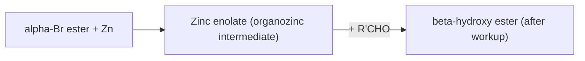

### Applications
- Reformatsky reaction (synthesis of β-hydroxy esters)
- Negishi coupling (modern Pd-catalyzed C–C coupling, uses organozinc reagents) — advanced/industrial application

### Memory Trick
**"Organozinc = Older, Only mild-reactive, Okay with esters (Reformatsky)"**

### ⭐ Key Points
- **One-line:** Milder, less reactive C–Zn organometallic than Grignard; key to the Reformatsky reaction.

---

## Comparison Table: Grignard vs Organozinc

| Feature | Grignard (RMgX) | Organozinc (R2Zn) |
|---|---|---|
| Bond polarity | Highly polarized C–Mg | Less polarized C–Zn |
| Reactivity | Very high, reacts with almost all electrophiles + acidic H | Milder, more selective |
| Solvent | Dry ether (essential) | Can tolerate slightly less strict conditions |
| Functional group tolerance | Low (destroyed by esters' own acidic workup issues, acidic H) | Higher — tolerates ester group in same molecule (Reformatsky) |
| Historical discovery | Victor Grignard, 1900 (Nobel Prize 1912) | Edward Frankland, 1849 (earliest known organometallic) |
| Key named reaction | Grignard synthesis of alcohols | Reformatsky reaction |

---

## 4. Tetraethyl Lead (TEL), Pb(C2H5)4

### Definition
An organolead compound, Pb(C2H5)4, historically used as an **anti-knock additive** in petrol (gasoline).

### Preparation
```
4 C2H5Cl  +  4 Na-Pb alloy  →  Pb(C2H5)4  +  4 NaCl  +  3 Pb
```

### Properties
- Colorless, oily liquid; covalent, thermally decomposes to give Pb and ethyl radicals.
- **Mechanism of anti-knock action:** decomposes homolytically under engine heat to give ethyl radicals + Pb; these radicals scavenge/quench chain-branching peroxide radicals responsible for premature/uncontrolled ignition ("knocking"), smoothing combustion.

### Industrial Use & Why Discontinued
- Was the primary octane booster in leaded petrol through much of the 20th century.
- **Banned/phased out globally** due to severe **neurotoxicity of lead** (bioaccumulation, environmental lead pollution, catalytic converter poisoning).

### Safety / Laboratory Precautions
- Extremely toxic by all routes (inhalation, skin absorption); handle only with full protective equipment in a fume hood; regulated substance in most countries.

### Memory Trick
**"TEL = Toxic, Ethyl-Lead, ended (banned) due to toxicity"**

### ⭐ Key Points
- **One-line:** Pb(C2H5)4 was an anti-knock petrol additive that works via radical mechanism, now banned for its severe lead toxicity.


---

## 5. Alcohols (R–OH)

### Definition
Organic compounds containing an **−OH (hydroxyl) group** bonded to an **sp³ hybridized carbon** (not directly on an aromatic ring).

### Classification
| Type | Structure | Example |
|---|---|---|
| 1° (primary) | R-CH2-OH | Ethanol |
| 2° (secondary) | R2CH-OH | Isopropanol |
| 3° (tertiary) | R3C-OH | tert-Butanol |

### Preparation (from Grignard — cross-reference Section 2)
Alcohols are a **major product class from Grignard reagents** — see table above (formaldehyde→1°, aldehyde→2°, ketone→3°).

### Properties
- **H-bonding** → higher boiling points than alkanes/ethers of similar mass; water-miscible for small R groups.
- **Acidity:** Alcohols are weakly acidic (pKa ~16-18), less acidic than water; acidity order **1° > 2° > 3°** (more alkyl = more +I = destabilizes alkoxide conjugate base... plus solvation effects).
- **Reactions:** oxidation (1°→aldehyde→acid; 2°→ketone; 3°→resists oxidation), dehydration (→alkenes, E1/E2), esterification, reaction with HX (→alkyl halide, SN1/SN2 depending on class), reaction with active metals (Na → alkoxide + H2).

```
2 R-OH  +  2 Na  →  2 R-O-Na  +  H2↑     (shows weak acidity)
```

### Memory Trick
**"Alcohol: sp3-attached OH, acidity 1°>2°>3° (opposite of stability logic, driven by steric/solvation)"**

### ⭐ Key Points
- **One-line:** sp³ C–OH compounds, classified 1°/2°/3°, acidity 1°>2°>3°, key Grignard product.

---

## 6. Phenols (Ar–OH)

### Definition
Organic compounds with an **−OH group directly bonded to an aromatic (sp²) carbon** of a benzene ring.

### Structure & Why More Acidic than Alcohols
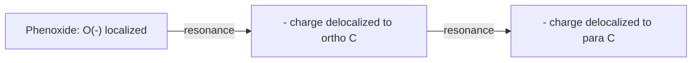
The lone pair on O conjugates into the ring (+M donation from OH into ring in phenol itself), but once deprotonated, the **phenoxide ion's negative charge is delocalized by resonance** into the ring (ortho/para positions), stabilizing it — hence phenol (pKa ≈10) is far more acidic than typical alcohols (pKa ≈16-18).

### Properties
- More acidic than alcohols and even carbonic acid partially (reacts with NaOH but not NaHCO3 typically, distinguishing it from carboxylic acids which react with both).
- **Electrophilic aromatic substitution:** −OH is a strong **activating, ortho/para-directing** group (via +M donation of lone pair into ring) — makes phenol far more reactive than benzene toward EAS (nitration, halogenation, sulfonation happen readily, even without catalyst for halogenation).

### Reactions
```
C6H5-OH  +  NaOH  →  C6H5-O-Na  +  H2O     (salt formation, shows acidity)
C6H5-OH  +  Br2(aq)  →  2,4,6-tribromophenol (white ppt)   (fast EAS, no catalyst needed - shows strong activation)
```

> **📌 Exam Tip:** "Phenol vs alcohol acidity" and "phenol vs benzene reactivity toward EAS" are two of the most repeated university questions — master both resonance diagrams.

### Memory Trick
**"Phenol: Aromatic-OH, aPPears much more Acidic (resonance-stabilized anion) + strongly Activates ring"**

### FAQ
**Q: Why is phenol a stronger acid than an aliphatic alcohol like ethanol?**
A: (See Mesomeric Effect FAQ above) — the phenoxide ion delocalizes its negative charge into the aromatic ring by resonance, spreading and stabilizing the charge, while ethoxide has no such delocalization — so phenol loses its proton more readily. *(5 marks)*

### ⭐ Key Points
- **One-line:** Ar-OH, resonance-stabilized (acidic) phenoxide anion, strongly activates ring toward EAS (o/p director).

---

## Comparison Table: Alcohol vs Phenol

| Feature | Alcohol (R-OH) | Phenol (Ar-OH) |
|---|---|---|
| C-OH carbon type | sp³ | sp² (aromatic) |
| Acidity (pKa) | ~16-18 (weaker) | ~10 (stronger) |
| Why acidic | Simple −I inductive effects only | Resonance-stabilized phenoxide anion |
| Reaction with NaOH | No reaction (too weakly acidic) | Forms sodium phenoxide salt |
| Effect on adjacent ring (EAS) | N/A (no ring) | Strong activator, o/p director |
| Oxidation | 1°→aldehyde/acid, 2°→ketone, 3°→resists | Resists simple oxidation the same way; can be oxidized to quinones under stronger conditions |

---

## 7. Carboxylic Acid Derivatives

### Definition
Compounds derived from carboxylic acids (R-COOH) by replacing the −OH with another group (−X, −OR', −NH2, −O-CO-R), i.e. **acyl (R-CO-) compounds**: acid halides, anhydrides, esters, amides.

### Family & General Reactivity Order (toward nucleophilic acyl substitution)
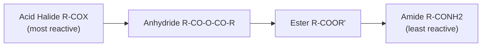
**Reactivity order: Acid halide > Anhydride > Ester > Amide** — governed by leaving group ability (better LG = more reactive) and resonance donation into the carbonyl (less donation from a better leaving group).

### General Mechanism (Nucleophilic Acyl Substitution — Addition-Elimination)
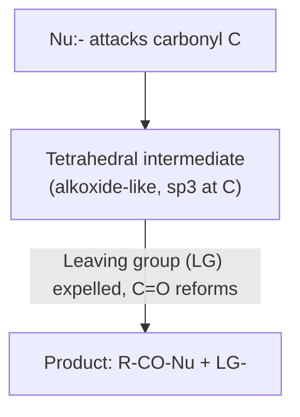
```
        O                    O⁻                     O
        ‖                    |                       ‖
   R—C—LG   +  Nu:⁻   →   R—C—LG        →      R—C—Nu   +   LG⁻
                              |
                              Nu
        (tetrahedral intermediate forms then collapses, expelling LG)
```

### Individual Reactions
- **Acid halides:** react violently with H2O, alcohols (→esters), NH3 (→amides) — most reactive, no catalyst needed.
- **Esters:** hydrolysis (acid or base-catalyzed, base = saponification, irreversible), transesterification, ammonolysis (→amide), reduction (LiAlH4 → 1° alcohol).
- **Amides:** hydrolysis needs strong acid/base + heat (least reactive due to resonance donation of N lone pair into C=O, very stable).

### Memory Trick
**"AAEA: Acid halide > Anhydride > Ester > Amide — Angry Acids Expell Amides last"** (reactivity decreasing)

### FAQ
**Q: Why are amides the least reactive carboxylic acid derivative toward nucleophilic acyl substitution?**
A: The nitrogen lone pair strongly donates into the carbonyl by resonance (N is a poor leaving group and a good π-donor), delocalizing positive character away from the carbonyl carbon and making it least electrophilic, plus N⁻/NH2⁻ is a very poor leaving group. *(4 marks)*

### Viva Qs
- Q: Rank reactivity of acid chloride, ester, amide. **A: Acid chloride > ester > amide.**
- Q: What forms when an ester reacts with LiAlH4? **A: A primary alcohol (plus the alcohol from the leaving OR' group).**

### ⭐ Key Points
- **Must Remember:** Reactivity order Acid halide>Anhydride>Ester>Amide; mechanism is addition-elimination via tetrahedral intermediate.
- **One-line:** Acyl derivatives react via a tetrahedral intermediate; reactivity governed by leaving-group ability and resonance donation.


---
---

# FINAL REVISION SECTION

## 📄 One-Page Cheat Sheet

| Topic | Key Formula/Rule | Condition |
|---|---|---|
| Inductive | σ-bond, permanent, decays with distance | −I: NO2>CN>F>Cl>Br>I>OH; +I: alkyls |
| Electromeric | π-bond, temporary, needs reagent | Instant, faster than inductive |
| Mesomeric | π/lone pair delocalization, permanent | Needs conjugation; +M: OH,NH2; −M: NO2,CN,CHO |
| Carbocation | sp², planar, 6e⁻ | Stability 3°>2°>1°>Me |
| Carbanion | sp³, pyramidal, 8e⁻(lone pair) | Stability Me>1°>2°>3° |
| SN1 | Rate=k[RX]; 2 steps; carbocation | 3°, polar protic, weak Nu, racemization |
| SN2 | Rate=k[RX][Nu]; 1 step | Me/1°, polar aprotic, strong Nu, inversion |
| E1 | Rate=k[RX]; 2 steps; carbocation | 3°, weak base, heat, Zaitsev |
| E2 | Rate=k[RX][Base]; 1 step | anti-periplanar, strong base, Zaitsev/Hofmann |
| Addition | Markovnikov: H→more-H C, X→more-sub C | Peroxide reverses for HBr only (radical) |
| Grignard | RMgX + C=O → alcohol; +CO2 → acid | Strictly anhydrous; destroyed by acidic H |
| Organozinc | R2Zn, milder than Grignard | Reformatsky reaction (α-halo ester+Zn+carbonyl) |
| TEL | Pb(C2H5)4, anti-knock, radical mechanism | Banned — lead toxicity |
| Alcohol | R-OH, sp³ C, pKa~16-18 | Acidity 1°>2°>3° |
| Phenol | Ar-OH, pKa~10 | Resonance-stabilized phenoxide; o/p activator |
| Acyl derivatives | Addition-elimination, tetrahedral intermediate | Reactivity: acid halide>anhydride>ester>amide |

---

## ⚡ Ultra Short Notes (One-Liners)

1. **Inductive effect** — permanent σ-electron pull through a chain, weakens with distance.
2. **Electromeric effect** — temporary, complete π-shift needing an attacking reagent.
3. **Mesomeric effect** — permanent π/lone-pair delocalization via resonance in conjugated systems.
4. **Carbocation** — sp², planar, electron-deficient; stability 3°>2°>1°.
5. **Carbanion** — sp³, pyramidal, lone pair; stability Me>1°>2°>3° (reversed).
6. **SN1** — 2-step, carbocation, 1st order, racemization, 3° substrates.
7. **SN2** — 1-step, backside attack, 2nd order, full inversion, 1°/Me substrates.
8. **E1** — 2-step via carbocation, 1st order, Zaitsev product.
9. **E2** — 1-step concerted, anti-periplanar, 2nd order, Zaitsev/Hofmann.
10. **Addition (Markovnikov)** — H to more-H carbon, X to more-substituted carbon via stable carbocation.
11. **Grignard** — RMgX adds to C=O to build alcohols/acids; destroyed by any acidic H.
12. **Organozinc** — milder C-Zn nucleophile; basis of the Reformatsky reaction.
13. **Tetraethyl lead** — radical anti-knock agent, banned due to toxicity.
14. **Alcohol** — sp³ C-OH, acidity 1°>2°>3°.
15. **Phenol** — aromatic C-OH, far more acidic than alcohol (resonance), strong ring activator.
16. **Acyl derivatives** — reactivity acid halide>anhydride>ester>amide, via tetrahedral intermediate.

---

## ⏱️ Last-Minute 10-Minute Revision

**Minute 0-2:** Electronic effects → I (σ, permanent) / E (π, temporary, needs reagent) / M (π, permanent, resonance).
**Minute 2-4:** Intermediates → Carbocation (sp²,planar,3°>2°>1°) vs Carbanion (sp³,pyramidal,Me>1°>2°>3°, reversed!).
**Minute 4-7:** The Big Four mechanisms → SN1(2-step,racemize,3°) / SN2(1-step,invert,1°) / E1(2-step,Zaitsev,3°) / E2(1-step,anti-periplanar,Zaitsev/Hofmann). Draw the two energy diagram shapes (2-hump vs 1-hump) from memory.
**Minute 7-8:** Addition — Markovnikov rule + peroxide exception (HBr only, radical).
**Minute 8-10:** Organometallics → Grignard table (what attacks what → what alcohol/acid), Grignard vs Organozinc, Alcohol vs Phenol acidity reasoning (resonance!), acyl reactivity order (halide>anhydride>ester>amide).

---

## 🎯 Expected Exam Questions

### Very Important / Repeated Questions
1. Distinguish SN1 and SN2 with mechanism, energy diagram, and stereochemistry. *(Very frequently asked, 10 marks)*
2. Why is phenol more acidic than ethanol? *(Resonance-based, 5 marks, near-guaranteed)*
3. Explain Grignard reagent synthesis of 1°, 2°, 3° alcohols with reactions. *(10 marks)*
4. Distinguish E1 and E2 mechanisms with examples. *(7 marks)*
5. Explain Markovnikov's rule with mechanism; explain peroxide effect. *(5-7 marks)*
6. Compare stability and structure of carbocation vs carbanion. *(5 marks)*

### Conceptual Questions
- Why does SN2 show inversion but SN1 shows racemization?
- Why is tert-butyl bromide solvolysis SN1 while methyl bromide + strong Nu is SN2?
- Why must Grignard reagents be prepared under anhydrous conditions?
- Why is amide the least reactive carboxylic acid derivative?

### Viva Questions (Rapid Fire)
- Hybridization of carbocation? sp². Carbanion? sp³.
- Order of SN1? First. SN2? Second.
- Which needs anti-periplanar geometry — E1 or E2? E2.
- Which organometallic reagent is destroyed by water? Grignard.
- Which is more acidic, phenol or ethanol? Phenol.

### Short Questions (3–5 marks) — pick any topic's "Short Note" above.
### Long Questions (7–10 marks) — combine mechanism + energy diagram + example + one comparison table (see "Long Note" template under SN1).

---

## 📊 Complete Summary Table — Full Syllabus

| Concept | Type | Rate/Order | Stereochemistry | Key Condition |
|---|---|---|---|---|
| SN1 | Substitution | 1st order | Racemization | 3°, polar protic, weak Nu |
| SN2 | Substitution | 2nd order | Inversion | 1°/Me, polar aprotic, strong Nu |
| E1 | Elimination | 1st order | Zaitsev | 3°, weak base, heat |
| E2 | Elimination | 2nd order | Anti-periplanar, Zaitsev/Hofmann | Strong (bulky) base |
| Electrophilic Addition | Addition | — | Markovnikov (or anti-Mark. w/ peroxide, HBr only) | Alkenes + HX/X2 |
| Grignard + carbonyl | Organometallic | — | — | Anhydrous ether |
| Nucleophilic Acyl Substitution | Acyl derivatives | — | Retention at C (addition-elimination) | Reactivity: halide>anhydride>ester>amide |

---
> **End of One-Shot Revision.** Revisit the ⭐ Key Points and Cheat Sheet one more time right before entering the exam hall.
