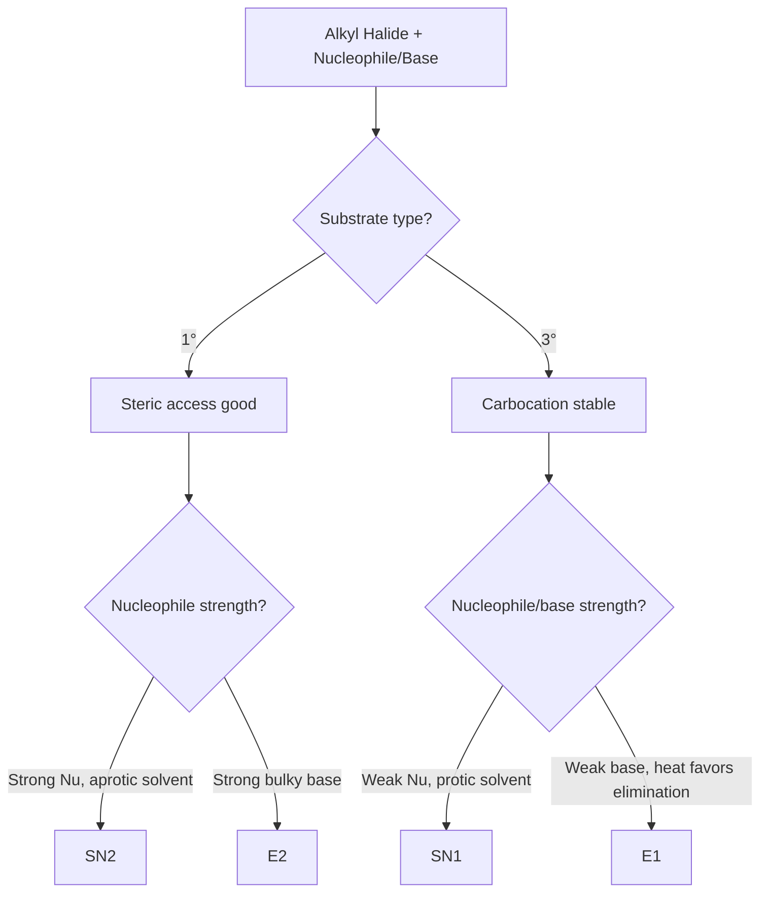

# CHEM-103 — Addition Reactions, Substitution/Elimination Kinetics, Grignard Reagents & TEL

---

## 1. Electrophilic and Nucleophilic Addition Reactions

### 1.1 Definitions

**Electrophilic addition**: An addition reaction in which the attacking species is an electrophile (electron-deficient) that adds first to a π-bond-containing substrate (typically an alkene or alkyne), followed by addition of a nucleophile to complete the reaction.

**Nucleophilic addition**: An addition reaction in which the attacking species is a nucleophile (electron-rich) that adds first, typically to a carbon bearing a partial positive charge (as in carbonyl compounds), followed by protonation.

### 1.2 Electrophilic Addition — General Mechanism (Alkenes)

Alkenes are electron-rich due to the π-bond, so they react readily with electrophiles.

**Step 1 — Electrophile attack:** The π-electrons attack the electrophile (e.g. H⁺ from HX), forming a carbocation intermediate.

**Step 2 — Nucleophile attack:** The nucleophile (X⁻) attacks the carbocation, completing the addition.

```
   H–X
    |
C=C  →  C–C(+)  →  C–C
              |          |  |
              X⁻ attacks  H  X
```

**Example — Addition of HBr to propene:**

CH₃–CH=CH₂ + HBr → CH₃–CHBr–CH₃ (major, Markovnikov product)

**Markovnikov's Rule:** In the electrophilic addition of HX to an unsymmetrical alkene, the hydrogen atom adds to the carbon already bearing more hydrogens, and X adds to the more substituted carbon (because the more stable, more substituted carbocation forms preferentially).

**Anti-Markovnikov (Peroxide/Kharasch effect):** In the presence of peroxides, HBr adds via a free-radical mechanism, so Br ends up on the *less* substituted carbon. This exception applies specifically to HBr (not HCl or HI, due to thermodynamics of the propagation steps).

**Industrial relevance:** Electrophilic hydration of ethene (with H₃PO₄ catalyst, steam, high pressure/temperature) is the industrial route to ethanol; electrophilic addition of Cl₂/Br₂ across alkenes gives vicinal dihalides used as solvents and monomer precursors (e.g., vinyl chloride production).

### 1.3 Nucleophilic Addition — General Mechanism (Carbonyl Compounds)

The carbonyl carbon in aldehydes/ketones is electrophilic (δ+) due to the polarized C=O bond, so nucleophiles attack it directly.

**Step 1:** Nucleophile attacks the carbonyl carbon; the π-electrons shift onto oxygen, generating an alkoxide intermediate.

**Step 2:** Protonation (usually by aqueous workup) gives the neutral alcohol product.

```
        O                    O⁻                  OH
        ‖         Nu:        |         H⁺         |
  R–C–R'  ───────→  R–C–R'  ───────→  R–C–R'
                        |                          |
                        Nu                         Nu
```

**Example — Grignard addition to acetone:**

(CH₃)₂C=O + CH₃MgBr → (CH₃)₃C–OMgBr → (H₃O⁺) → (CH₃)₃C–OH

Nucleophilic addition is the basis for the Grignard, cyanohydrin, and hydride-reduction (NaBH₄/LiAlH₄) reactions covered later.

---

## 2. Kinetics of Substitution and Elimination: SN1, SN2, E1, E2

### 2.1 SN2 — Bimolecular Nucleophilic Substitution

**Definition:** A concerted, one-step substitution in which the nucleophile attacks the substrate carbon from the side opposite the leaving group, while the leaving group departs simultaneously.

**Mechanism:**

```
Nu⁻ + C–LG  →  [Nu···C···LG]‡  →  Nu–C + LG⁻
        (backside attack)   (transition state)
```

- Backside attack causes **inversion of configuration** (Walden inversion).
- Favored by: primary substrates, strong nucleophiles, polar aprotic solvents (DMSO, DMF, acetone), unhindered leaving groups.

**Rate law derivation:** Because bond formation (Nu–C) and bond breaking (C–LG) happen in a single concerted step, the transition state involves both the substrate *and* the nucleophile. The rate-determining step therefore depends on the concentration of both species:

Rate = k[substrate][Nu⁻]

This is a second-order rate law (first order in each reactant), so **SN2 is kinetically second order**.

### 2.2 SN1 — Unimolecular Nucleophilic Substitution

**Definition:** A two-step substitution proceeding through a carbocation intermediate.

**Mechanism:**

**Step 1 (slow, rate-determining):** C–LG bond breaks heterolytically to form a carbocation.

R–LG → R⁺ + LG⁻

**Step 2 (fast):** The nucleophile attacks the planar carbocation from either face.

R⁺ + Nu⁻ → R–Nu

- Attack from both faces of the planar sp² carbocation gives a **racemic mixture** (with partial inversion preference due to ion-pairing).
- Favored by: tertiary substrates (stable carbocations), weak nucleophiles, polar protic solvents (water, alcohols) that stabilize the ion pair.

**Rate law derivation:** Since Step 1 (ionization) is the slow, rate-determining step and does not involve the nucleophile at all, the rate depends *only* on the substrate concentration:

Rate = k[R–LG]

The nucleophile enters only in the fast second step and does not affect the overall rate. This is a first-order rate law, so **SN1 is kinetically first order**.

**Proof by rate-determining step principle:** In multistep reactions, the overall rate equals the rate of the slowest step. For SN1, the slow step (ionization) involves one molecule (unimolecular), giving Rate = k[R–LG]. For SN2, there is only one step, and it is bimolecular by definition, giving Rate = k[R–LG][Nu⁻]. The order of reaction is therefore a direct consequence of molecularity of the rate-determining/only step, not an arbitrary label.

### 2.3 E1 — Unimolecular Elimination

**Definition:** A two-step elimination proceeding through the same type of carbocation intermediate as SN1, followed by loss of a β-hydrogen to form an alkene.

**Mechanism:**

**Step 1 (slow):** R–LG → R⁺ + LG⁻ (ionization, rate-determining)

**Step 2 (fast):** A base removes a β-hydrogen; the electron pair forms the new π-bond.

R⁺ + B: → alkene + BH⁺

**Rate law:** Since ionization is rate-determining and involves only the substrate:

Rate = k[R–LG]

**E1 is first order**, for exactly the same reason as SN1 — the base/nucleophile is not involved until after the rate-determining step.

E1 and SN1 are competing pathways from the same carbocation intermediate; product ratio depends on whether the nucleophile attacks carbon (SN1) or removes a β-H (E1).

### 2.4 E2 — Bimolecular Elimination

**Definition:** A concerted, one-step elimination in which a strong base removes a β-hydrogen while the leaving group departs simultaneously, forming the alkene directly.

**Mechanism:**

```
        H
        |
B: ···  C–C  ···LG   →   B–H + C=C + LG⁻
```

Requires **anti-periplanar** geometry between the departing H and the leaving group (180° dihedral angle) for optimal orbital overlap in the concerted transition state.

**Rate law derivation:** The single concerted step requires simultaneous participation of the base and the substrate in the transition state:

Rate = k[substrate][Base]

**E2 is second order**, favored by strong, bulky bases (e.g., tert-butoxide) and secondary/tertiary substrates.

### 2.5 Comparison Table

| Feature | SN1 | SN2 | E1 | E2 |
|---|---|---|---|---|
| Order | 1st | 2nd | 1st | 2nd |
| Rate law | k[RX] | k[RX][Nu] | k[RX] | k[RX][B] |
| Mechanism | 2-step | 1-step (concerted) | 2-step | 1-step (concerted) |
| Intermediate | Carbocation | None | Carbocation | None |
| Stereochemistry | Racemization | Inversion | — | Anti-periplanar |
| Substrate preference | 3° > 2° | 1° > 2° | 3° > 2° | 3° > 2° |
| Nucleophile/base strength | Weak | Strong | Weak base | Strong, bulky base |
| Solvent | Polar protic | Polar aprotic | Polar protic | Any (often aprotic) |
| Rearrangement possible | Yes | No | Yes | No |

### 2.6 Carbocation Stability (relevant to SN1/E1)

Stability order: **3° > 2° > 1° > methyl**, due to hyperconjugation and the +I (inductive) effect of alkyl groups donating electron density into the empty p-orbital. Allylic and benzylic carbocations are further stabilized by resonance delocalization.

### 2.7 Mnemonics

- **"SN2 = 2 things happen at once"** → bimolecular, concerted, inversion.
- **"SN1 = 1 slow step decides it all"** → carbocation, first order, racemization.
- **Steric hindrance kills SN2; carbocation stability drives SN1/E1.**
- **E2 needs "anti" alignment — think of two dancers backing away from each other in a straight line.**

### 2.8 Common Exam Mistakes

- Confusing *molecularity* (number of species colliding in the rate-determining step) with *reaction order* — for elementary/concerted steps they coincide, which is exactly why SN2/E2 are second order and SN1/E1 are first order.
- Forgetting that in SN1/E1, the nucleophile/base concentration genuinely does not appear in the rate law because it acts after the RDS.
- Assuming primary substrates always give SN2 — allylic/benzylic primary halides can still undergo SN1 due to resonance-stabilized carbocations.



---

## 3. Grignard Reagents

### 3.1 Definition and General Formula

A **Grignard reagent** is an organomagnesium halide of general formula **R–Mg–X**, where R is an alkyl or aryl group and X is Cl, Br, or I. The C–Mg bond is highly polarized (C is δ−), making the R group act as a strong carbanion-like nucleophile.

### 3.2 Preparation

R–X + Mg → (dry ether, reflux) → R–Mg–X

- Must be carried out under strictly anhydrous, oxygen-free conditions in dry diethyl ether or THF, since Mg inserts into the C–X bond via a radical mechanism at the metal surface.
- Order of reactivity of halides: R–I > R–Br > R–Cl (C–I bond is weakest).

### 3.3 Reactions

| Substrate | Product (after H₃O⁺ workup) |
|---|---|
| Formaldehyde (HCHO) | Primary alcohol |
| Other aldehydes | Secondary alcohol |
| Ketones | Tertiary alcohol |
| Esters (2 equiv.) | Tertiary alcohol |
| CO₂ (dry ice) | Carboxylic acid |
| Water/alcohols | Alkane (R–H) — destroys the reagent |

**Example — reaction with an aldehyde:**

CH₃MgBr + CH₃CHO → CH₃–CH(OMgBr)–CH₃ → (H₃O⁺) → CH₃–CH(OH)–CH₃

### 3.4 Laboratory Precautions

- All glassware and solvents must be rigorously dried (traces of water quench the reagent).
- Reactions run under inert atmosphere (N₂ or Ar) to exclude moisture and CO₂.
- Grignard reagents are never isolated as solids; they are used in situ in ether solution.

### 3.5 Industrial/Synthetic Applications

Grignard reagents are a cornerstone of C–C bond-forming synthesis, used to build alcohols, carboxylic acids, and complex natural-product/pharmaceutical intermediates from simple halides.

---

## 4. Tetraethyl Lead (TEL)

### 4.1 Definition and Structure

**Tetraethyl lead**, Pb(C₂H₅)₄, is an organolead compound in which four ethyl groups are covalently bonded to a central lead atom in a tetrahedral arrangement.

### 4.2 Preparation

4 C₂H₅Cl + 4 NaPb (Pb–Na alloy) → Pb(C₂H₅)₄ + 4 NaCl + 3 Pb

(Industrially prepared by reacting ethyl chloride with a sodium–lead alloy.)

### 4.3 Uses and Advantages

- Historically used as an **anti-knock additive** in petrol; it raises the octane number by promoting smoother, more controlled combustion and suppressing premature auto-ignition ("knocking").

### 4.4 Disadvantages, Toxicity, and Environmental Impact

- Combustion releases lead compounds into the atmosphere, causing severe neurotoxicity, especially in children (impaired cognitive development).
- Lead deposits also poison catalytic converters, preventing the use of TEL alongside modern emissions-control equipment.
- Persistent environmental contamination of soil, water, and air.

### 4.5 Why It Is Banned and Modern Alternatives

Most countries phased out TEL from road-vehicle petrol from the 1970s–2000s due to public-health regulation once the neurotoxicity of airborne lead was firmly established. Modern octane boosters instead use **MTBE, ethanol, and aromatic hydrocarbons (e.g., toluene, oxygenates)**, none of which release toxic heavy metals on combustion.

---

## 5. Revision Sheet (One Page)

- **Electrophilic addition**: electrophile attacks first → carbocation → nucleophile completes; governs alkene + HX/X₂/H₂O reactions; Markovnikov (peroxide reverses it for HBr only).
- **Nucleophilic addition**: nucleophile attacks electrophilic carbonyl carbon first → alkoxide → protonation; governs Grignard, cyanide, hydride additions to C=O.
- **SN1/E1** = 1st order (Rate = k[RX]), carbocation intermediate, 3° substrates, racemization (SN1).
- **SN2/E2** = 2nd order (Rate = k[RX][Nu/B]), concerted, 1°/3° substrates respectively, inversion (SN2) / anti-periplanar (E2).
- **Grignard**: RMgX, made in dry ether from RX + Mg; adds to carbonyls to build alcohols; destroyed by water.
- **TEL**: Pb(C₂H₅)₄, former anti-knock additive, banned for neurotoxicity; replaced by MTBE/ethanol/aromatics.

---

## 6. Viva Questions (20)

1. Why does SN2 proceed with inversion of configuration?
2. Why is the SN1 rate independent of nucleophile concentration?
3. What determines whether a substrate undergoes SN1 vs SN2?
4. Why do polar protic solvents favor SN1 over SN2?
5. What is the anti-periplanar requirement in E2, and why does it matter?
6. Why can E1 and SN1 occur from the same carbocation intermediate?
7. State Markovnikov's rule with one example.
8. Explain why HBr shows anti-Markovnikov addition only in the presence of peroxides.
9. Why must Grignard reagents be prepared under anhydrous conditions?
10. What product forms when a Grignard reagent reacts with dry ice?
11. Why does reaction of a Grignard reagent with formaldehyde give a primary alcohol specifically?
12. Why is diethyl ether preferred as solvent for Grignard formation?
13. What is the molecular formula of TEL?
14. Why was TEL banned in most countries?
15. Name two modern replacements for TEL as an anti-knock agent.
16. Why does TEL poison catalytic converters?
17. What is the order of leaving-group reactivity in Grignard formation (Cl vs Br vs I)?
18. Why does a tertiary carbocation form more readily than a primary one?
19. Differentiate molecularity from order of reaction using SN1 vs SN2 as an example.
20. Why is a strong, bulky base like tert-butoxide preferred to promote E2 over SN2?

## 7. MCQs (20, with answers)

1. SN2 reactions proceed with: (a) retention (b) inversion (c) racemization (d) no change — **Answer: (b)**
2. The rate law for SN1 is: (a) k[RX][Nu] (b) k[RX] (c) k[Nu] (d) k[RX]² — **Answer: (b)**
3. Which substrate favors SN1 the most? (a) methyl (b) primary (c) secondary (d) tertiary — **Answer: (d)**
4. E2 reactions require which geometry? (a) syn-periplanar (b) anti-periplanar (c) gauche (d) eclipsed — **Answer: (b)**
5. Markovnikov's rule applies to: (a) nucleophilic substitution (b) electrophilic addition to unsymmetrical alkenes (c) elimination (d) oxidation — **Answer: (b)**
6. Anti-Markovnikov addition of HBr occurs due to: (a) polar solvent (b) peroxide/free-radical mechanism (c) high temperature only (d) strong base — **Answer: (b)**
7. Grignard reagent general formula: (a) R₂Mg (b) RMgX (c) RMgOH (d) R–Mg=O — **Answer: (b)**
8. Grignard reagents must be prepared in: (a) water (b) dry ether (c) alcohol (d) acetic acid — **Answer: (b)**
9. Reaction of RMgX with CO₂ followed by workup gives: (a) alcohol (b) carboxylic acid (c) ketone (d) alkane — **Answer: (b)**
10. Reaction of RMgX with water gives: (a) alcohol (b) alkane (c) ether (d) ester — **Answer: (b)**
11. TEL stands for: (a) Trimethyl ethyl lead (b) Tetraethyl lead (c) Triethyl lead (d) Tetramethyl lead — **Answer: (b)**
12. TEL was used in petrol as: (a) solvent (b) anti-knock agent (c) dye (d) preservative — **Answer: (b)**
13. TEL is banned mainly due to: (a) high cost (b) neurotoxicity/lead pollution (c) flammability (d) low octane boost — **Answer: (b)**
14. Which is a modern replacement for TEL? (a) MTBE (b) NaCl (c) TEL itself, reformulated (d) H₂SO₄ — **Answer: (a)**
15. SN2 is favored by: (a) bulky substrate (b) strong nucleophile + polar aprotic solvent (c) weak nucleophile (d) tertiary substrate — **Answer: (b)**
16. Which reaction proceeds through a carbocation intermediate? (a) SN2 (b) E2 (c) SN1 (d) none — **Answer: (c)**
17. Carbocation stability order is: (a) 1°>2°>3° (b) 3°>2°>1° (c) all equal (d) methyl>1° — **Answer: (b)**
18. In nucleophilic addition to a carbonyl, the nucleophile attacks: (a) oxygen (b) the electrophilic carbon (c) hydrogen (d) none — **Answer: (b)**
19. Grignard + ketone (after workup) gives: (a) primary alcohol (b) secondary alcohol (c) tertiary alcohol (d) carboxylic acid — **Answer: (c)**
20. The order of a reaction is determined by: (a) the overall stoichiometric equation always (b) the molecularity of the rate-determining step (c) temperature (d) solvent color — **Answer: (b)**

## 8. Short Questions (10)

1. Define electrophile and nucleophile with examples.
2. Write the rate law for SN2 and explain each term.
3. Why does SN1 show racemization rather than complete inversion?
4. State two conditions that favor E2 over E1.
5. Write the reaction of a Grignard reagent with water.
6. Why is dry ether used, not just any solvent, in Grignard synthesis?
7. Give the structure and formula of TEL.
8. State one advantage and one disadvantage of TEL.
9. What is the peroxide (Kharasch) effect?
10. Differentiate electrophilic and nucleophilic addition in one line each.

## 9. Long Questions (10)

1. Derive the rate laws for SN1 and SN2 and use them to prove their respective reaction orders.
2. Describe the mechanism, stereochemistry, and rate law of E1 and E2 with suitable examples.
3. Explain Markovnikov's and anti-Markovnikov's rules with mechanisms and one example each.
4. Describe the preparation of a Grignard reagent and its reactions with aldehydes, ketones, esters, CO₂, and water.
5. Discuss the factors (substrate, nucleophile, solvent) that determine whether a reaction proceeds by SN1 or SN2.
6. Explain the preparation, uses, and environmental hazards of TEL, and why it has been phased out.
7. Compare and contrast SN1, SN2, E1, and E2 with respect to mechanism, kinetics, and stereochemistry.
8. Explain the mechanism of electrophilic addition of HBr to propene, including the peroxide effect.
9. Explain the mechanism of nucleophilic addition to a carbonyl compound with a Grignard reagent as the nucleophile.
10. Discuss carbocation stability and its role in determining SN1/E1 reactivity and rearrangement.

---

*Figure placeholders (for insertion into butex-notes `assets/` if diagrams are added later):*
- *Figure 1: SN1 mechanism — carbocation intermediate and racemization*
- *Figure 2: SN2 backside attack and inversion*
- *Figure 3: E1 mechanism via carbocation*
- *Figure 4: E2 anti-periplanar transition state*
- *Figure 5: Electrophilic addition of HX to an alkene*
- *Figure 6: Nucleophilic addition to a carbonyl*
- *Figure 7: Grignard reagent formation from RX + Mg*
- *Figure 8: Grignard reaction with an aldehyde/ketone*
- *Figure 9: Tetraethyl lead molecular structure*
- *Figure 10: Carbocation stability chart (methyl < 1° < 2° < 3°)*
