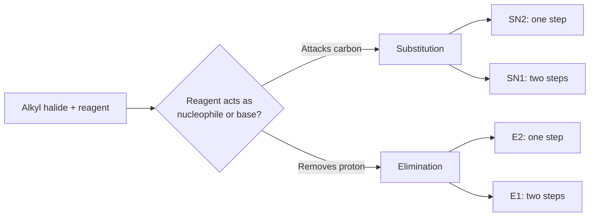
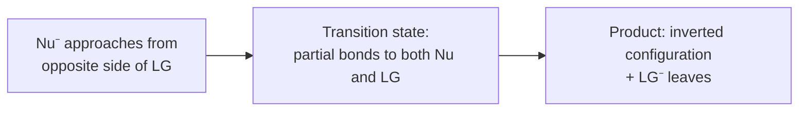
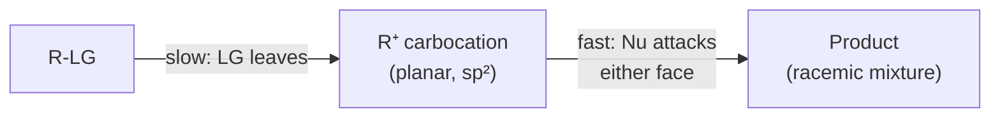
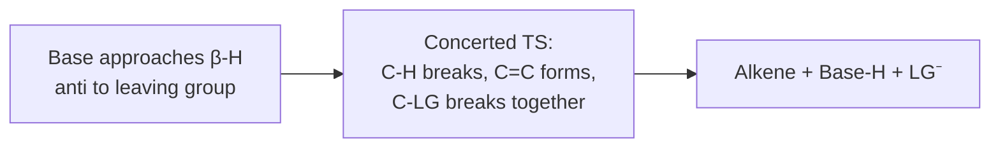
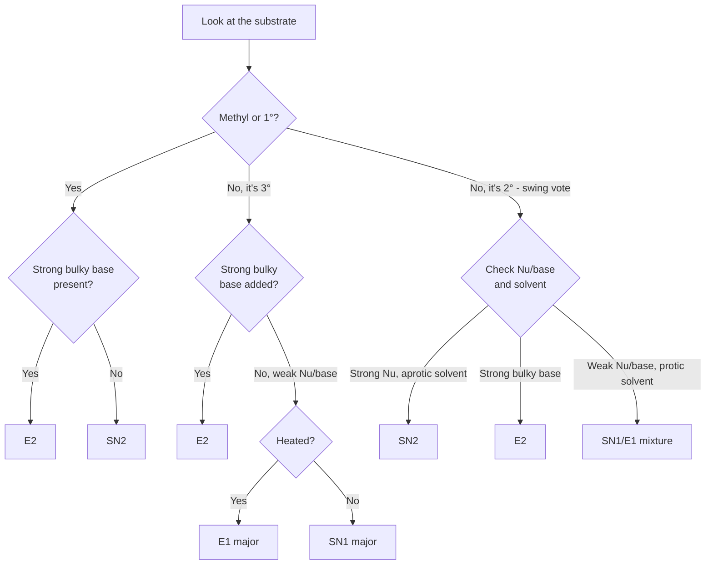

# SN1, SN2, E1, E2 — Complete Exam Prep Notes
### CHEM-103 Organic Chemistry — Nucleophilic Substitution & Elimination

---

## 1. The Big Picture

All four mechanisms start the same way: an alkyl halide (or similar leaving group) reacts with something that is either a **nucleophile** (attacks carbon → substitution) or a **base** (grabs a proton → elimination).



**Rule of thumb:** one-step mechanisms (SN2, E2) are concerted and stereospecific. Two-step mechanisms (SN1, E1) go through a flat carbocation and lose stereochemical information.

---

## 2. SN2 — Substitution, Nucleophilic, Bimolecular

### Mechanism
One concerted step. The nucleophile attacks carbon from the side directly **opposite** the leaving group (backside attack), so the leaving group is pushed off as the new bond forms.



### Simple example

**Reaction:** CH₃CH₂Br + NaOH → CH₃CH₂OH + NaBr
(ethyl bromide + hydroxide → ethanol)

- Nucleophile (OH⁻) attacks carbon opposite to Br
- Transition state is trigonal bipyramidal (partial bonds to OH and Br)
- One step, no intermediate
- If the starting carbon were a stereocenter, e.g. (R)-2-bromobutane + NaOH, the product would be **(S)** — inversion of configuration ("Walden inversion")
- Rate = k[substrate][OH⁻]

### Key features

| Property | SN2 |
|---|---|
| Steps | 1 (concerted) |
| Rate law | k[substrate][Nu⁻] |
| Stereochemistry | Inversion |
| Best substrate | Methyl > 1° > 2° >> 3° |
| Nucleophile | Strong, small/unhindered (OH⁻, CN⁻, I⁻) |
| Solvent | Polar aprotic (DMSO, DMF, acetone) |

---

## 3. SN1 — Substitution, Nucleophilic, Unimolecular

### Mechanism
Two steps. The leaving group departs first (slow, rate-determining), forming a flat carbocation. Then the nucleophile attacks the carbocation from either face (fast).



### Simple example

**Reaction:** (CH₃)₃C–Br + H₂O → (CH₃)₃C–OH + HBr
(tert-butyl bromide + water, solvolysis)

```
Step 1 (slow):  (CH₃)₃C–Br  →  (CH₃)₃C⁺  +  Br⁻
Step 2 (fast):  (CH₃)₃C⁺ + H₂O  →  (CH₃)₃C–OH₂⁺  →  (CH₃)₃C–OH + H⁺
```

- Step 1 is rate-determining → Rate = k[(CH₃)₃CBr] only
- Carbocation is planar, so nucleophile attacks from either face
- If the starting material were chiral, the product is a **racemic mixture**
- 3° substrate → most stable carbocation, no rearrangement needed here

### Rearrangement example (examiners love this)

```
CH₃-CH(Br)-CH(CH₃)₂  →  CH₃-CH⁺-CH(CH₃)₂  --(hydride shift)-->  CH₃-CH₂-C⁺(CH₃)₂
     (2° cation)                                                    (more stable 3° cation)
```

**Always ask:** can a hydride shift or methyl shift produce a more stable carbocation? If yes, mention it — it's free marks.

### Key features

| Property | SN1 |
|---|---|
| Steps | 2 (carbocation intermediate) |
| Rate law | k[substrate] only |
| Stereochemistry | Racemization |
| Best substrate | 3° > 2° >> 1° (never methyl) |
| Nucleophile | Weak (H₂O, ROH) |
| Solvent | Polar protic (water, alcohols) |
| Rearrangements | Yes — hallmark clue |

---

## 4. E1 — Elimination, Unimolecular

### Mechanism
Same first step as SN1: the leaving group departs to form a carbocation. Then, instead of a nucleophile attacking, a base removes a proton from a carbon **next to** the carbocation (the β-carbon), and the electrons form the new π bond.


### Simple example

**Reaction:** (CH₃)₃C–Br + H₂O, heat → (CH₃)₂C=CH₂ + H₃O⁺ + Br⁻
(tert-butyl bromide, warm water → isobutylene)

```
Step 1 (slow):  (CH₃)₃C–Br  →  (CH₃)₃C⁺  +  Br⁻

Step 2 (fast, base removes β-H):
      H
      |
H₂O: -C-C(CH₃)₂⁺   →   H₂C=C(CH₃)₂  +  H₃O⁺
      |
      H (β-hydrogen)
```

### Key features

| Property | E1 |
|---|---|
| Steps | 2 (shares intermediate with SN1) |
| Rate law | k[substrate] only |
| Stereochemistry | None required — flat cation, base grabs any accessible β-H |
| Best substrate | 3° > 2° |
| Base | Weak |
| Solvent | Polar protic |
| Major product | Zaitsev (more substituted, more stable alkene) |
| Rearrangements | Yes |
| Competes with | SN1 (same intermediate — often see both products) |
| Conditions | Heat favors E1 over SN1 |

---

## 5. E2 — Elimination, Bimolecular

### Mechanism
One concerted step. A base removes a β-hydrogen at the same time the leaving group departs — the C–H bond breaks, the π bond forms, and the C–LG bond breaks, all simultaneously. No intermediate.



### The anti-periplanar requirement

The H being removed and the leaving group must be **180° apart** (anti-periplanar) for the orbitals to line up correctly. This makes E2 **stereospecific** — draw a Newman projection when a question shows specific stereochemistry.

```
        H
        |
   Base:O–CH2CH3    (removes the H that is anti to Br)
        |
   H₃C–C–C–CH(CH₃)₂
        |  |
        H  Br
        
   →  H₃C–CH=C(CH₃)–CH(CH₃)₂ + EtOH + Br⁻
```

**Newman projection view (looking down the C–C bond):**

```
        H   H
         \ /
     H----C----H         Front carbon: H, H, CH₃
          |
     -----C-----          Back carbon: H (top, anti to Br), Br (bottom)
         / \
        H   Br
```
The H directly opposite (180° from) Br is the one removed — everything happens in one motion.

### Simple example

**Reaction:** CH₃–CH₂–Br + NaOCH₂CH₃ (sodium ethoxide) → CH₂=CH₂ + EtOH + Br⁻
(ethyl bromide + ethoxide, a simple E2 producing ethylene)

- Base removes an anti-periplanar β-H as Br⁻ leaves — one step
- Rate = k[substrate][base]
- Since ethyl bromide only has one possible alkene, there's no Zaitsev/Hofmann choice to worry about here — good for building intuition before tackling branched substrates

**Classic branched example:** (CH₃)₂CH–CHBr–CH₃ + NaOEt → mostly the more substituted alkene (Zaitsev), but switching to the bulky base KOC(CH₃)₃ favors the **less substituted (Hofmann)** alkene, because the bulky base can only reach the more accessible (less hindered) β-H.

**Classic anti-periplanar exam question:** menthyl chloride vs. neomenthyl chloride with base — one gives a single alkene (only one H is anti-periplanar to Cl), the other gives a mixture. If you see this type of question, draw the Newman projection along the C–C bond.

### Key features

| Property | E2 |
|---|---|
| Steps | 1 (concerted) |
| Rate law | k[substrate][base] |
| Stereochemistry | Anti-periplanar required (stereospecific) |
| Best substrate | 1°, 2°, 3° — bulky substrates favor E2 |
| Base | Strong (OH⁻, OEt⁻); bulky bases (KOtBu) give Hofmann product |
| Solvent | Any — base strength matters more |
| Major product | Zaitsev, unless bulky base → Hofmann |
| Rearrangements | Never (no carbocation forms) |

---

## 6. Side-by-Side Master Comparison Table

| Feature | SN2 | SN1 | E2 | E1 |
|---|---|---|---|---|
| Steps | 1 (concerted) | 2 (carbocation) | 1 (concerted) | 2 (carbocation) |
| Rate law | k[sub][Nu] | k[sub] | k[sub][base] | k[sub] |
| Best substrate | Methyl, 1° | 3°, 2° | 3°, 2°, bulky | 3°, 2° |
| Stereochemistry | Inversion | Racemization | Anti-periplanar | No requirement |
| Rearrangements? | No | Yes | No | Yes |
| Nucleophile/base | Strong, unhindered | Weak | Strong, often bulky | Weak |
| Solvent | Polar aprotic | Polar protic | Any | Polar protic |
| Major product | — | — | Zaitsev (or Hofmann w/ bulky base) | Zaitsev |
| Competes with | — | E1 (same intermediate) | — | SN1 (same intermediate) |

---

## 7. Decision Flowchart for Exams



### Quick reference table

| You're given... | Think... |
|---|---|
| 1° substrate + strong nucleophile (CN⁻, OH⁻) | **SN2** |
| 1° substrate + strong bulky base (tBuO⁻) | **E2** |
| 3° substrate + weak nucleophile, no heat | **SN1** |
| 3° substrate + weak nucleophile + heat | **E1** (major) |
| Any substrate + strong bulky base + heat | **E2** |
| Question mentions "inversion of configuration" | **SN2** |
| Question mentions "racemization" or "rearrangement" | **SN1 / E1** |
| Question shows a Newman projection / anti-periplanar H | **E2** |
| 2° substrate, ambiguous — check solvent | Protic solvent → SN1/E1; aprotic + strong Nu → SN2 |

**Tip:** Whenever you write out a mechanism, state explicitly:
1. Number of steps
2. Rate law
3. Stereochemical outcome (inversion / racemization / anti-periplanar)
4. Whether rearrangement is possible

Examiners give marks for each of these even if your final product is correct.

---

## 8. Practice Questions with Solutions (Simple Level)

**Q1. Predict the mechanism and product:**
CH₃Br + NaCN (in DMSO)

<details>
<summary>Solution</summary>

- Methyl substrate → no steric hindrance → SN2 is easy
- CN⁻ is a strong, small nucleophile; DMSO is polar aprotic (favors SN2)
- **Mechanism: SN2**
- **Product:** CH₃CN + NaBr
- Rate = k[CH₃Br][CN⁻]
</details>

---

**Q2. Predict the mechanism and product:**
(CH₃)₃C–Br + H₂O (room temperature, no added base)

<details>
<summary>Solution</summary>

- 3° substrate, weak nucleophile (H₂O), polar protic solvent
- No strong base to grab a proton preferentially, and no heat specified → substitution dominates
- **Mechanism: SN1**
- **Product:** (CH₃)₃C–OH + HBr
- Rate = k[(CH₃)₃CBr] only
- Note: some E1 elimination product ((CH₃)₂C=CH₂) will also form as a minor side product, since SN1 and E1 always compete
</details>

---

**Q3. Predict the mechanism and product:**
CH₃CH₂CH₂Br + NaOC(CH₃)₃ (potassium tert-butoxide-type strong bulky base)

<details>
<summary>Solution</summary>

- 1° substrate, but the base is very bulky → backside attack (SN2) is hindered, and the base prefers to pull off a proton
- **Mechanism: E2**
- **Product:** CH₂=CH–CH₃ (propene) + tBuOH + Br⁻
- Rate = k[substrate][base]
- Only one type of β-H here, so there's no Zaitsev/Hofmann choice — good for a simple first example
</details>

---

**Q4. Predict the mechanism and product:**
(CH₃)₂CHBr + NaOH, heated

<details>
<summary>Solution</summary>

- 2° substrate — swing vote. OH⁻ is both a decent nucleophile and a decent base
- Heat favors elimination
- **Mechanism: E2** (major), with some SN2 as minor product
- **Product:** CH₂=CH–CH₃ (propene) + H₂O + Br⁻ (major, E2)
</details>

---

**Q5. (R)-2-bromobutane + NaOH → predict stereochemistry of the product**

<details>
<summary>Solution</summary>

- 2° substrate + strong, small nucleophile (OH⁻) → SN2
- SN2 causes **inversion of configuration**
- **Product: (S)-2-butanol**
- Mechanism: SN2, one step, backside attack, rate = k[substrate][OH⁻]
</details>

---

**Q6. Which alkene forms as the major product?**
2-bromo-2-methylbutane + NaOEt (ethoxide, small strong base), heat

<details>
<summary>Solution</summary>

- 3° substrate + strong small base + heat → **E2**
- Since the base is small (not bulky), **Zaitsev's rule** applies: the more substituted alkene is major
- **Major product:** 2-methyl-2-butene (trisubstituted alkene)
- **Minor product:** 2-methyl-1-butene (less substituted)
</details>

---

**Q7. Same substrate as Q6, but now with KOC(CH₃)₃ (bulky base) — what changes?**

<details>
<summary>Solution</summary>

- Same substrate (2-bromo-2-methylbutane), but now the base is bulky
- Bulky base can't easily reach the more hindered β-H, so it grabs the more accessible one instead
- **Major product switches to 2-methyl-1-butene** (Hofmann product, less substituted)
- Still **E2** mechanism, still one concerted step, rate = k[substrate][base]
</details>

---

**Q8. tert-amyl bromide ((CH₃)₂C(Br)CH₂CH₃) is heated in methanol with no added base. What two product types do you expect, and why?**

<details>
<summary>Solution</summary>

- 3° substrate + weak nucleophile/base (MeOH) + heat → both **SN1** and **E1** happen, since they share the same carbocation intermediate
- **SN1 product:** (CH₃)₂C(OCH₃)CH₂CH₃ (ether via substitution)
- **E1 product:** (CH₃)₂C=CHCH₃ (Zaitsev alkene, major elimination product)
- Mention explicitly on your exam: "SN1 and E1 compete because they share the same rate-determining step (carbocation formation)"
</details>

---

**Q9. Fill in the mechanism type:**
A reaction shows a full racemic mixture of product and evidence of a hydride shift. What mechanism, and what's the giveaway?

<details>
<summary>Solution</summary>

- Racemization → planar carbocation intermediate → **SN1** (or E1 if an alkene formed instead)
- Hydride shift → confirms a carbocation was involved, not a concerted mechanism
- **Giveaway clues:** "racemic mixture" + "rearranged product" = SN1/E1, never SN2/E2
</details>

---

**Q10. A question gives you a single diastereomer of a cyclohexane derivative and states "only one alkene forms." What should you immediately think, and what should you draw?**

<details>
<summary>Solution</summary>

- "Only one alkene forms" from a single stereoisomer = classic **E2 anti-periplanar** signal
- **Draw a Newman projection** along the C–C bond bearing the leaving group, and identify which β-H is 180° (anti) to the leaving group — that's the one removed
- Mechanism: E2, one step, rate = k[substrate][base], stereospecific
</details>

---

## 9. Final Exam Checklist

Before you submit any mechanism question, confirm you've stated:

- [ ] Number of steps (1 = concerted, 2 = carbocation intermediate)
- [ ] Rate law (k[sub] vs k[sub][Nu/base])
- [ ] Stereochemical outcome (inversion / racemization / anti-periplanar / none)
- [ ] Whether a rearrangement is possible (always check 2°/1° carbocations for a hydride or methyl shift)
- [ ] Major product, and whether Zaitsev or Hofmann applies (for eliminations)
- [ ] Solvent type (protic vs aprotic) and how it supports your answer
