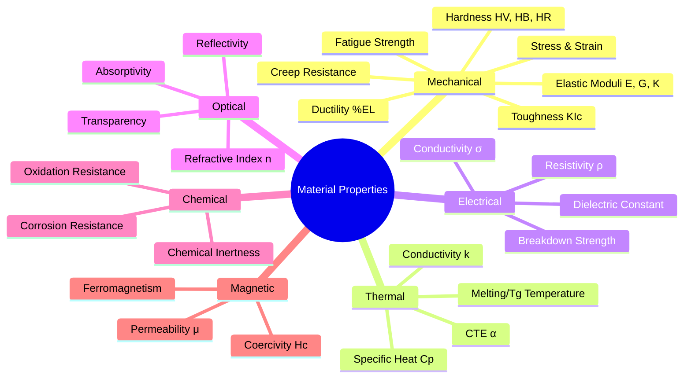
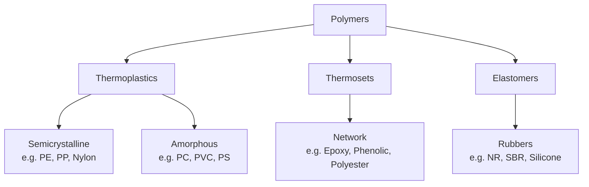

# 01. Properties of Metals, Ceramics, and Polymers

> 📅 **Date:** June 4, 2026
> 🎓 **Course:** Industrial & Production Engineering (IPE)
> 🏫 **Dept.:** Industrial & Production Engineering — B.Sc. Textile Engineering
> 📖 **Ref.:** Callister & Rethwisch, *Materials Science and Engineering: An Introduction*, 10th ed.

---

## Table of Contents

1. [Introduction](#1-introduction)
2. [Mechanical Properties](#2-mechanical-properties)
   - 2.1 [Stress and Strain](#21-stress-and-strain)
   - 2.2 [Elastic Moduli](#22-elastic-moduli)
   - 2.3 [Hardness](#23-hardness)
   - 2.4 [Toughness and Impact Energy](#24-toughness-and-impact-energy)
   - 2.5 [Ductility and Brittleness](#25-ductility-and-brittleness)
3. [Thermal Properties](#3-thermal-properties)
4. [Electrical & Magnetic Properties](#4-electrical--magnetic-properties)
5. [Optical Properties](#5-optical-properties)
6. [Chemical Properties](#6-chemical-properties)
7. [Properties of Metals](#7-properties-of-metals)
8. [Properties of Ceramics](#8-properties-of-ceramics)
9. [Properties of Polymers](#9-properties-of-polymers)
10. [Comparative Analysis](#10-comparative-analysis)
11. [Worked Examples](#11-worked-examples)
12. [References & Further Reading](#12-references--further-reading)

---

## 1. Introduction

Materials science is founded on the **Structure–Processing–Properties–Performance** paradigm:

The three primary material families and their bonding types:

| Family | Primary Bond | Secondary Bond |
|--------|-------------|----------------|
| **Metals** | Metallic (free electrons) | — |
| **Ceramics** | Ionic + Covalent | van der Waals |
| **Polymers** | Covalent (backbone) | van der Waals, Hydrogen |

### Property Classification Overview

---

## 2. Mechanical Properties

### 2.1 Stress and Strain

#### Normal Stress (σ)

When a force $F$ is applied perpendicular to a cross-sectional area $A_0$:

$$\sigma = \frac{F}{A_0} \quad [\text{Pa} = \text{N/m}^2]$$

> In practice, **MPa** ($10^6$ Pa) and **GPa** ($10^9$ Pa) are used.

#### Shear Stress (τ)

When force acts parallel to the area:

$$\tau = \frac{F}{A_0} \quad [\text{Pa}]$$

#### Engineering Strain (ε)

$$\varepsilon = \frac{\Delta L}{L_0} = \frac{L_f - L_0}{L_0} \quad \text{(dimensionless)}$$

#### Shear Strain (γ)

$$\gamma = \tan\theta \approx \theta \quad \text{(for small angles)}$$

#### True Stress and True Strain

Used for large deformations where area changes significantly:

$$\sigma_T = \frac{F}{A_i} \quad ; \quad \varepsilon_T = \ln\left(\frac{L_i}{L_0}\right)$$

Relating to engineering values:
$$\sigma_T = \sigma(1 + \varepsilon) \quad ; \quad \varepsilon_T = \ln(1 + \varepsilon)$$

---

### 2.2 Elastic Moduli

In the linear elastic region (Hooke's Law applies):

$$\boxed{\sigma = E\varepsilon}$$

$$\boxed{\tau = G\gamma}$$

where:
- $E$ = **Young's modulus** (modulus of elasticity) [GPa]
- $G$ = **Shear modulus** [GPa]

**Poisson's Ratio (ν)**

$$\nu = -\frac{\varepsilon_{\text{lateral}}}{\varepsilon_{\text{axial}}} \quad (0 < \nu < 0.5)$$

**Bulk Modulus (K)** — resistance to uniform compression:

$$K = \frac{E}{3(1-2\nu)}$$

**Inter-relationship of elastic constants:**

$$E = 2G(1+\nu) = 3K(1-2\nu)$$

| Material | E (GPa) | G (GPa) | ν | K (GPa) |
|----------|---------|---------|---|---------|
| Steel (AISI 1020) | 207 | 80 | 0.29 | 165 |
| Aluminum (1100) | 69 | 26 | 0.33 | 68 |
| Copper | 110 | 46 | 0.34 | 140 |
| Glass (SiO₂) | 73 | 30 | 0.23 | 45 |
| Polyethylene (HDPE) | 0.8 | 0.3 | 0.38 | 1.1 |
| Natural Rubber | 0.002 | 0.0007 | 0.50 | — |

---

### 2.3 Hardness

Hardness = **resistance to permanent plastic deformation (indentation)**.

#### Vickers Hardness (HV)

$$HV = 1.854 \times \frac{F}{d^2}$$

where $F$ = applied force (kgf), $d$ = diagonal of indentation (mm).

> Vickers uses a square pyramid diamond indenter at 136° face angle.

#### Brinell Hardness (HB)

$$HB = \frac{2P}{\pi D\left(D - \sqrt{D^2 - d^2}\right)}$$

where $P$ = load (kgf), $D$ = ball diameter (mm), $d$ = indentation diameter (mm).

#### Rockwell Hardness (HR)

Based on depth of penetration $h$ under specified load. Scales: HRA, HRB, HRC.

$$HR = 130 - \frac{h}{0.002} \quad \text{(C-scale)}$$

#### Mohs Hardness (scratch scale)

| Mohs | Mineral | Material |
|------|---------|----------|
| 1 | Talc | Soft polymers |
| 2-3 | Gypsum | — |
| 4-5 | Fluorite | Some metals |
| 6-7 | Quartz | Glass |
| 8 | Topaz | Hardened steel |
| 9 | Corundum (Al₂O₃) | Ceramics |
| 10 | Diamond | — |

**Approximate conversion** (metals):

$$\sigma_{UTS} \approx 3.45 \times HB \quad \text{[MPa]}$$

---

### 2.4 Toughness and Impact Energy

**Toughness** = energy absorbed per unit volume up to fracture = area under σ–ε curve:

$$U_T = \int_0^{\varepsilon_f} \sigma \, d\varepsilon \approx \frac{\sigma_y + \sigma_{UTS}}{2} \cdot \varepsilon_f \quad [\text{J/m}^3 = \text{Pa}]$$

**Modulus of Resilience** (energy stored elastically):

$$U_r = \frac{\sigma_y^2}{2E}$$

**Charpy Impact Test** measures energy absorbed (Joules) when a notched specimen is broken by a swinging pendulum:

$$E_{impact} = Mgh_0 - Mgh_f = Mg(h_0 - h_f) \quad [\text{J}]$$

**Fracture Toughness (K\_Ic)** — see File 05.

---

### 2.5 Ductility and Brittleness

**Percent Elongation (%EL)**:

$$\%EL = \frac{L_f - L_0}{L_0} \times 100\%$$

**Percent Reduction in Area (%RA)**:

$$\%RA = \frac{A_0 - A_f}{A_0} \times 100\%$$

| Classification | %EL |
|----------------|-----|
| Brittle | < 5% |
| Semi-ductile | 5–15% |
| Ductile | > 15% |

---

## 3. Thermal Properties

### 3.1 Thermal Conductivity

**Fourier's Law of Heat Conduction:**

$$q = -k \frac{dT}{dx} \quad [\text{W/m}^2]$$

Through a flat wall of thickness $L$ and area $A$:

$$Q = k A \frac{\Delta T}{L} \cdot t \quad [\text{J}]$$

where $k$ = thermal conductivity [W/(m·K)].

**Mechanism:**
- **Metals**: lattice vibrations (phonons) + **free electron** conduction → high $k$
- **Ceramics**: phonon conduction only → moderate $k$
- **Polymers**: mostly phonon → very low $k$

### 3.2 Coefficient of Thermal Expansion (CTE)

$$\Delta L = \alpha L_0 \Delta T \quad \Rightarrow \quad \alpha = \frac{1}{L_0}\frac{dL}{dT} \quad [\text{K}^{-1}]$$

Volumetric expansion: $\Delta V \approx 3\alpha V_0 \Delta T$

**Thermal stress** when expansion is constrained:

$$\sigma_{th} = E \cdot \alpha \cdot \Delta T$$

### 3.3 Specific Heat Capacity

$$Q = m \cdot C_p \cdot \Delta T \quad [\text{J}]$$

- $C_p$ = specific heat at constant pressure [J/(kg·K)]
- Related to phonon spectrum (Debye model)

**Dulong–Petit Law** (classical, high-T limit for solids):

$$C_v \approx 3R = 24.9 \text{ J/(mol·K)}$$

| Material | $k$ [W/(m·K)] | $\alpha$ [×10⁻⁶/°C] | $C_p$ [J/(kg·K)] | $T_m$ [°C] |
|----------|-------------|----------------|-----------------|-----------|
| Steel | 52 | 12 | 500 | 1480 |
| Aluminum | 222 | 23.6 | 900 | 660 |
| Copper | 400 | 17 | 385 | 1085 |
| Al₂O₃ | 35 | 8.1 | 775 | 2050 |
| SiO₂ (glass) | 1.4 | 0.5 | 840 | 1600 (softens) |
| HDPE | 0.46 | 100–200 | 1900 | 130 |
| Nylon 66 | 0.25 | 80 | 1670 | 260 |

---

## 4. Electrical & Magnetic Properties

### 4.1 Electrical Conductivity and Resistivity

**Ohm's Law (field form):**

$$\mathbf{J} = \sigma_e \mathbf{E}$$

where $\mathbf{J}$ = current density [A/m²], $\sigma_e$ = electrical conductivity [S/m or (Ω·m)⁻¹].

**Resistivity:**

$$\rho_e = \frac{1}{\sigma_e} = \frac{R \cdot A}{L} \quad [\Omega\cdot\text{m}]$$

**Drude free-electron model for metals:**

$$\sigma_e = \frac{n e^2 \tau}{m_e}$$

where $n$ = free electron density, $e$ = electron charge, $\tau$ = mean free time, $m_e$ = electron mass.

**Temperature dependence in metals (Matthiessen's rule):**

$$\rho_{total} = \rho_{thermal} + \rho_{impurity} + \rho_{deformation}$$

$$\rho_{thermal} = \rho_0(1 + a \cdot \Delta T)$$

| Class | Material | $\rho_e$ [Ω·m] |
|-------|---------|----------------|
| Conductor | Copper | 1.7 × 10⁻⁸ |
| Conductor | Aluminum | 2.8 × 10⁻⁸ |
| Conductor | Steel | 10 × 10⁻⁸ |
| Semiconductor | Silicon | ~10⁻³ |
| Insulator | Al₂O₃ | 10¹⁰–10¹² |
| Insulator | Polyethylene | 10¹³–10¹⁶ |
| Insulator | PTFE | >10¹⁸ |

### 4.2 Magnetic Properties

| Type | Behaviour | Materials |
|------|-----------|-----------|
| Diamagnetic | Weak repulsion | Cu, Au, Bi |
| Paramagnetic | Weak attraction | Al, Pt |
| Ferromagnetic | Strong attraction | Fe, Co, Ni |
| Ferrimagnetic | Moderate attraction | Fe₃O₄, ferrites |
| Antiferromagnetic | Zero net magnetisation | MnO, Cr |

---

## 5. Optical Properties

**Refractive Index:**

$$n = \frac{c}{v} = \sqrt{\varepsilon_r \mu_r}$$

where $c$ = speed of light in vacuum, $v$ = speed in material.

**Snell's Law:** $n_1 \sin\theta_1 = n_2 \sin\theta_2$

| Material | Transparency | $n$ |
|----------|-------------|-----|
| Metals | Opaque | N/A (free electrons absorb) |
| Glass (SiO₂) | Transparent | 1.46 |
| Al₂O₃ (single crystal) | Transparent | 1.76 |
| Polycarbonate | Transparent | 1.58 |
| PTFE | Translucent | 1.35 |

**Why metals are opaque:** Free electrons interact with all visible-light photons (energy overlap), absorbing and re-emitting light as reflection.

---

## 6. Chemical Properties

| Property | Definition | Importance |
|----------|-----------|------------|
| **Corrosion resistance** | Resistance to wet electrochemical attack | Pipes, marine use |
| **Oxidation resistance** | Resistance to high-T gas attack | Turbine blades |
| **Chemical inertness** | Stability in acids/bases | Chemical plant |
| **Biocompatibility** | Non-toxic in biological environment | Implants |

---

## 7. Properties of Metals

### Bonding and Structure

Metallic bonding: positive ion cores immersed in a delocalized "sea" of electrons.
- **Non-directional** → allows slip → **ductility**
- **Free electrons** → high electrical and thermal conductivity
- Dense packing → high density

### Key Characteristics

1. **High electrical conductivity**: $10^4–10^7$ S/m
2. **High thermal conductivity**: 20–400 W/(m·K)
3. **Ductile and malleable**: %EL = 10–60%, allows forming
4. **High density**: 1.7–21 g/cm³ (Li to Ir)
5. **Good strength**: σ_y = 30–2000 MPa depending on alloy/treatment
6. **Opaque** and lustrous
7. Can be **ferromagnetic** (Fe, Co, Ni and alloys)
8. **Weldable** (most)

### Notable Metal Properties

| Metal / Alloy | E (GPa) | σ_y (MPa) | σ_UTS (MPa) | %EL | k [W/(m·K)] | ρ [g/cm³] |
|---------------|---------|------------|-------------|-----|------------|----------|
| Steel AISI 1020 (annealed) | 207 | 210 | 380 | 36 | 52 | 7.85 |
| Steel AISI 4340 (heat treated) | 207 | 1620 | 1720 | 12 | 38 | 7.85 |
| Aluminum 1100 | 69 | 34 | 90 | 35 | 222 | 2.71 |
| Al 2024-T3 | 73 | 345 | 483 | 18 | 121 | 2.77 |
| Copper (annealed) | 110 | 70 | 220 | 45 | 400 | 8.94 |
| Ti-6Al-4V | 114 | 880 | 950 | 14 | 7 | 4.43 |
| Tungsten (W) | 407 | 760 | 960 | 1 | 174 | 19.3 |

---

## 8. Properties of Ceramics

### Bonding and Structure

Ceramics = **inorganic, non-metallic** solids held by ionic and/or covalent bonds.
- **Strong, directional bonds** → high hardness, high melting points
- **Few slip systems** → brittle at room temperature
- **Large band gap** → electrical insulators (mostly)

### Key Characteristics

1. **High hardness**: 6–10 on Mohs scale
2. **High melting point**: 1000–4000°C
3. **Brittle**: $K_{Ic}$ = 0.5–5 MPa√m (cf. 25–150 MPa√m for metals)
4. **Low density**: 2–6 g/cm³ (vs. metals 5–19 g/cm³)
5. **Electrical insulators** (mostly; exceptions: SiC is semiconducting)
6. **Chemically inert**: stable to most acids, alkalis
7. **High compression strength**, low tensile strength
8. **Transparent** (single crystals, some glasses)

### Notable Ceramic Properties

| Ceramic | E (GPa) | σ_f (MPa) | $K_{Ic}$ (MPa√m) | Hardness (GPa) | k [W/(m·K)] | T_m [°C] |
|---------|---------|------------|-----------------|---------------|------------|---------|
| Al₂O₃ (alumina) | 390 | 300–550 | 3–4 | 15 | 35 | 2050 |
| SiO₂ (fused silica) | 73 | 100 | 0.8 | 8 | 1.4 | ~1600 |
| SiC | 410 | 200–700 | 3–4.5 | 26 | 120 | 2730 |
| ZrO₂ (stabilised) | 200 | 400–700 | 5–12 | 12 | 2.5 | 2680 |
| Si₃N₄ | 310 | 400–900 | 5–8 | 16 | 30 | 1900 (decomp.) |
| BaTiO₃ | 68 | 120 | 1 | 5 | 6 | 1625 |

> ⚠️ Ceramics are typically loaded in **compression** in applications because compressive strength ≈ 10× tensile strength due to crack closure under compression.

---

## 9. Properties of Polymers

### Bonding and Structure

Polymer chains = long covalent backbone (C–C, C–N, C–O, etc.).
- **Intra-chain**: strong covalent bonds
- **Inter-chain**: weak van der Waals / hydrogen bonds → low melting points, softness
- Chain architecture (linear, branched, cross-linked, network) controls properties

### Key Characteristics

1. **Low density**: 0.9–2.2 g/cm³
2. **Low strength**: σ_UTS = 10–100 MPa (elastomers: ~5 MPa)
3. **Viscoelastic behavior**: time and rate-dependent response
4. **Low thermal conductivity**: $k$ = 0.1–0.5 W/(m·K)
5. **Electrical insulators**: ρ = 10¹²–10¹⁸ Ω·m
6. **Corrosion resistant** (chemically inert)
7. **Easy fabrication** (injection molding, extrusion)
8. **Large elongation** for elastomers: 400–800%

### Polymer Classes

### Notable Polymer Properties

| Polymer | E (GPa) | σ_y (MPa) | σ_UTS (MPa) | %EL | $T_g / T_m$ [°C] | ρ [g/cm³] |
|---------|---------|------------|-------------|-----|-----------------|----------|
| HDPE | 0.8–1.4 | 25–35 | 30–40 | 10–1200 | −90/130 | 0.94–0.97 |
| Polypropylene (PP) | 1.1–1.6 | 30–40 | 35–45 | 100–600 | −20/176 | 0.90 |
| Nylon 66 | 2.8–3.3 | 60–70 | 75–80 | 40–80 | 57/260 | 1.14 |
| Polycarbonate (PC) | 2.1–2.7 | 55–65 | 60–70 | 110–150 | 150/— | 1.20 |
| PTFE (Teflon) | 0.4–0.6 | — | 14–34 | 200–400 | −97/327 | 2.20 |
| Epoxy (cured) | 2.4–4.0 | — | 35–100 | 1–6 | 90–200/— | 1.10–1.25 |
| Natural Rubber | 0.002 | — | 10–30 | 400–800 | −73/— | 0.95 |
| Polystyrene (PS) | 3.0–3.5 | 34–50 | 45–60 | 1–4 | 100/— | 1.05 |

---

## 10. Comparative Analysis

### Property Ranges (Order of Magnitude)

*Figure: Ashby chart showing Young's modulus vs. density for the three material families (Wikipedia Commons)*

| Property | Metals | Ceramics | Polymers |
|----------|--------|----------|---------|
| Young's Modulus E | 40–600 GPa | 70–500 GPa | 0.001–3 GPa |
| Yield / Fracture Strength | 50–2000 MPa | 50–700 MPa (comp.) | 2–100 MPa |
| Fracture Toughness $K_{Ic}$ | 25–150 MPa√m | 0.5–10 MPa√m | 0.5–5 MPa√m |
| Density | 1.7–21 g/cm³ | 2–6 g/cm³ | 0.9–2.2 g/cm³ |
| Melting/Softening Point | 230–3400°C | 1000–4000°C | 100–350°C |
| Thermal Conductivity | 10–400 W/(m·K) | 1–120 W/(m·K) | 0.1–0.5 W/(m·K) |
| Electrical Conductivity | Conductor | Insulator/Semi | Insulator |
| Ductility | High | Very Low (brittle) | Moderate–High |

---

## 11. Worked Examples

### Example 1 — Young's Modulus from Tensile Test

A 250 mm gauge-length steel rod (ø = 12.5 mm) is loaded with 40,000 N.
The extension measured is 0.12 mm.

**Find: Young's modulus E**

$$A_0 = \frac{\pi d^2}{4} = \frac{\pi (0.0125)^2}{4} = 1.227 \times 10^{-4} \text{ m}^2$$

$$\sigma = \frac{F}{A_0} = \frac{40000}{1.227 \times 10^{-4}} = 326 \text{ MPa}$$

$$\varepsilon = \frac{\Delta L}{L_0} = \frac{0.12}{250} = 4.8 \times 10^{-4}$$

$$E = \frac{\sigma}{\varepsilon} = \frac{326 \text{ MPa}}{4.8 \times 10^{-4}} = 679 \text{ GPa}$$

> This value is too high → either the rod is ceramic (Al₂O₃ ~ 390 GPa) or measurement error. For steel E ≈ 207 GPa; check: Δl = σL₀/E = 326×0.25/207000 = 0.394 mm.

---

### Example 2 — Thermal Stress Calculation

A steel rail ($E$ = 207 GPa, $\alpha$ = 12×10⁻⁶/°C) is installed at 15°C and constrained from expanding. On a summer day the temperature rises to 50°C.

**Find: Thermal stress in the rail**

$$\Delta T = 50 - 15 = 35 \text{°C}$$

$$\sigma_{th} = E \cdot \alpha \cdot \Delta T = 207 \times 10^3 \text{ MPa} \times 12 \times 10^{-6} \text{°C}^{-1} \times 35 \text{°C}$$

$$\sigma_{th} = 207000 \times 12 \times 10^{-6} \times 35 = \boxed{86.94 \text{ MPa (compressive)}}$$

Since σ_y(rail steel) ≈ 250 MPa, the rail is safe, but buckling must also be checked.

---

### Example 3 — Vickers Hardness

A Vickers test on annealed copper uses F = 5 kgf. The mean diagonal of the impression is 0.20 mm.

$$HV = 1.854 \times \frac{F}{d^2} = 1.854 \times \frac{5}{(0.20)^2} = 1.854 \times \frac{5}{0.04} = \boxed{231.75 \approx 232 \text{ HV}}$$

> Annealed copper typically ranges 40–80 HV. For this example, the applied load of 5 kgf gives HV 232, indicating the indentation diagonal is too small — a more realistic diagonal for copper at 5 kgf would be ~0.50 mm → HV ≈ 37.

---

### Example 4 — Modulus of Resilience

For 4340 steel ($\sigma_y$ = 1620 MPa, $E$ = 207 GPa):

$$U_r = \frac{\sigma_y^2}{2E} = \frac{(1620 \times 10^6)^2}{2 \times 207 \times 10^9} = \frac{2.624 \times 10^{18}}{4.14 \times 10^{11}} = 6.34 \times 10^6 \text{ J/m}^3 = \boxed{6.34 \text{ MJ/m}^3}$$

Compared to annealed 1020 steel ($\sigma_y$ = 210 MPa):
$$U_r = \frac{(210 \times 10^6)^2}{2 \times 207 \times 10^9} = 0.106 \text{ MJ/m}^3$$

→ Heat-treated 4340 stores **60×** more elastic energy than annealed 1020.

---

## 12. References & Further Reading

1. **Callister, W.D. & Rethwisch, D.G.** — *Materials Science and Engineering: An Introduction*, 10th ed., Wiley (2018).
   📌 [Wiley companion site](https://www.wiley.com/en-us/Materials+Science+and+Engineering%3A+An+Introduction%2C+10th+Edition-p-9781119405498)

2. **Ashby, M.F. & Jones, D.R.H.** — *Engineering Materials 1 & 2*, 4th ed., Butterworth-Heinemann (2011).
   📌 [Elsevier page](https://www.elsevier.com/books/engineering-materials-1/ashby/978-0-08-096665-6)

3. **MIT OpenCourseWare 3.012** — *Fundamentals of Materials Science*
   📌 [https://ocw.mit.edu/courses/3-012-fundamentals-of-materials-science-fall-2005/](https://ocw.mit.edu/courses/3-012-fundamentals-of-materials-science-fall-2005/)

4. **DoITPoMS (Cambridge University)** — Interactive teaching & learning resources for Materials Science
   📌 [https://www.doitpoms.ac.uk/](https://www.doitpoms.ac.uk/)

5. **NPTEL Materials Science Lectures** — IIT course series
   📌 [https://nptel.ac.in/courses/113/105/113105024/](https://nptel.ac.in/courses/113/105/113105024/)

6. **Engineering Toolbox** — Property data for common materials
   📌 [https://www.engineeringtoolbox.com](https://www.engineeringtoolbox.com)

7. **ASM International** — Materials Information Society; Handbooks online (subscription)
   📌 [https://www.asminternational.org](https://www.asminternational.org)

8. **LibreTexts — Materials Science**
   📌 [https://eng.libretexts.org/Bookshelves/Materials_Science](https://eng.libretexts.org/Bookshelves/Materials_Science)

---

*← Back to [Course Index](README.md) | Next → [02 — Processing of Materials](02-processing-of-materials.md)*
