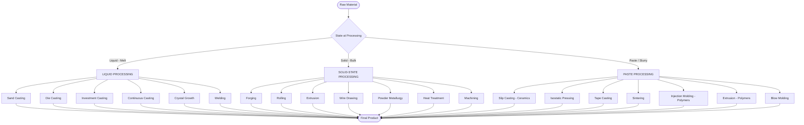
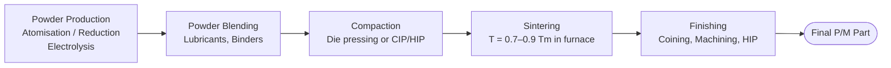
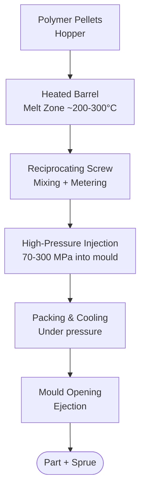

# 02. Processing of Materials — Liquid, Solid & Paste Routes

> 📅 **Date:** June 4, 2026
> 🎓 **Course:** Industrial & Production Engineering (IPE)
> 🏫 **Dept.:** Industrial & Production Engineering — B.Sc. Textile Engineering
> 📖 **Ref.:** Kalpakjian & Schmid, *Manufacturing Engineering & Technology*, 7th ed.

---

## Table of Contents

1. [Introduction — The Processing-Structure-Property Link](#1-introduction)
2. [Processing from the Liquid State](#2-processing-from-the-liquid-state)
   - 2.1 [Sand Casting](#21-sand-casting)
   - 2.2 [Die Casting](#22-die-casting)
   - 2.3 [Investment Casting](#23-investment-casting)
   - 2.4 [Continuous Casting](#24-continuous-casting)
   - 2.5 [Crystal Growth (Czochralski)](#25-crystal-growth)
   - 2.6 [Welding and Joining](#26-welding-and-joining)
3. [Processing from the Solid State](#3-processing-from-the-solid-state)
   - 3.1 [Forging](#31-forging)
   - 3.2 [Rolling](#32-rolling)
   - 3.3 [Extrusion](#33-extrusion)
   - 3.4 [Wire Drawing](#34-wire-drawing)
   - 3.5 [Powder Metallurgy (P/M)](#35-powder-metallurgy)
   - 3.6 [Heat Treatment of Metals](#36-heat-treatment-of-metals)
   - 3.7 [Machining and Cutting](#37-machining-and-cutting)
4. [Processing from the Paste / Slurry State](#4-processing-from-the-paste--slurry-state)
   - 4.1 [Ceramic Processing: Slip Casting](#41-ceramic-slip-casting)
   - 4.2 [Ceramic Processing: Dry/Isostatic Pressing](#42-ceramic-dry-and-isostatic-pressing)
   - 4.3 [Ceramic Processing: Tape Casting](#43-tape-casting)
   - 4.4 [Ceramic Sintering](#44-sintering)
   - 4.5 [Polymer: Injection Molding](#45-polymer-injection-molding)
   - 4.6 [Polymer: Extrusion](#46-polymer-extrusion)
   - 4.7 [Polymer: Blow Molding](#47-polymer-blow-molding)
5. [Defects Introduced by Processing](#5-defects-introduced-by-processing)
6. [Worked Examples](#6-worked-examples)
7. [References & Further Reading](#7-references--further-reading)

---

## 1. Introduction

**Processing** converts raw materials into useful shapes while controlling microstructure and properties.

> **Central principle:** The same composition of material can have vastly different properties depending on how it is processed.

Example: Steel with 0.45% C can be either
- Annealed: σ_y ≈ 360 MPa (soft, ductile, easily machined)
- Quench-tempered: σ_y ≈ 1400 MPa (hard, strong, used for springs)

### Processing Routes Overview

---

## 2. Processing from the Liquid State

When a material is **melted**, atoms/molecules can rearrange freely. Pouring into a mould and solidifying gives a near-net shape.

### Solidification Fundamentals

**Nucleation** — formation of a tiny solid crystal:

- **Homogeneous nucleation** (theoretical):

$$\Delta G^* = \frac{16\pi\gamma_{SL}^3}{3(\Delta G_v)^2}$$

$$r^* = -\frac{2\gamma_{SL}}{\Delta G_v}$$

where $\gamma_{SL}$ = solid-liquid interfacial energy, $\Delta G_v$ = volumetric free energy change.

- **Heterogeneous nucleation** (practical, on mould walls, inoculants): lower $\Delta G^*$, easier.

**Growth** — once a nucleus forms, atoms deposit on the crystal at a rate governed by diffusion and undercooling $\Delta T = T_m - T_{actual}$.

**Solidification time (Chvorinov's Rule):**

$$t_s = B\left(\frac{V}{A}\right)^n$$

where $B$ = mould constant [s/m²], $V$ = volume, $A$ = surface area, $n$ ≈ 2 (Chvorinov: $n=2$).

> **Implication:** Thicker sections solidify last → centreline shrinkage, micro-segregation.

---

### 2.1 Sand Casting

**Process:**
1. A pattern (wood, plastic, metal) is packed in sand + binder
2. Pattern removed → mould cavity formed
3. Molten metal poured through sprue/gating system
4. Solidification → metal shrinks
5. Mould broken, part extracted, runners cut

**Key parameters:**
- **Pouring temperature**: $T_{pour} = T_m + \Delta T_{superheat}$; typically 50–150°C above $T_m$
- **Fluidity**: governed by viscosity $\eta$ and surface tension $\gamma$
- **Shrinkage allowance**: metals contract ~1–2% on cooling

**Advantages:** Complex 3D shapes, all metals, low cost tooling
**Limitations:** Rough surface finish (Ra 6–25 μm), coarse grains, porosity

**Products:** Engine blocks, pump housings, large machine bases

---

### 2.2 Die Casting

Molten metal is **forced under pressure** (10–70 MPa) into a steel die at high velocity.

Types:
- **Hot-chamber** (plunger in molten metal): Zn, Pb, Sn, Mg alloys; fast cycles
- **Cold-chamber** (metal ladled in separately): Al, Cu, Mg at higher temperatures

**Shot velocity:** $v = \sqrt{2gH}$ (gravity cast) or hydraulic pressure driven

**Advantages:** Very high production rate, excellent surface finish (Ra 0.8–3 μm), close tolerances (±0.1 mm), thin walls (1–2 mm)
**Limitations:** Limited to non-ferrous metals (die life), high tooling cost, porosity from trapped gas

**Products:** Automotive door handles, brackets, housings, smartphone frames

---

### 2.3 Investment (Lost-Wax) Casting

**Process:**
1. Wax pattern made (injection molded)
2. Shell built up with ceramic slurry (stucco layers)
3. Wax melted out ("lost wax") in autoclave
4. Ceramic shell fired → mould
5. Metal cast; shell broken away

**Advantages:** Excellent dimensional accuracy, complex internal features, any cast alloy, fine surface finish
**Limitations:** Expensive wax pattern, slow process

**Products:** Turbine blades, surgical implants, jewellery

**Turbine blade grain control:**
- **Equiaxed**: random grains → moderate strength
- **Directionally solidified (DS)**: columnar grains along stress axis → improved creep life
- **Single crystal (SX)**: no grain boundaries → best high-T properties

---

### 2.4 Continuous Casting

Used for **steel, aluminum** production. Molten metal is poured into a water-cooled mould at one end; a continuous strand exits the other.

**Strand cross-sections:** slabs (for sheet), billets (for bar/rod), blooms (for structural sections)

**Benefits:** eliminates ingot casting, higher yield (~98%), better segregation control, energy efficient

---

### 2.5 Crystal Growth

**Czochralski (CZ) method** for Si, Ge, GaAs:

1. Polycrystalline material melted in crucible
2. Seed crystal touched to surface
3. Seed slowly pulled and rotated

The single-crystal boule grows at the solid-liquid interface.

**Pull rate control:**

$$v \approx \frac{\kappa_S G_S - \kappa_L G_L}{\rho \Delta H_f}$$

where $\kappa$ = thermal conductivity, $G$ = temperature gradient, $\rho$ = density, $\Delta H_f$ = latent heat.

Silicon boules: diameter up to 450 mm (18"), length ~1.5 m, for semiconductor wafers.

---

### 2.6 Welding and Joining

Welding joins parts by **melting and resolidification** (fusion welding) or solid-state bonding.

**Main types:**

| Process | Heat Source | Base Metal |
|---------|------------|------------|
| SMAW (stick) | Electric arc | Steel, SS, CI |
| MIG/GMAW | Electric arc + wire feed | Steel, Al, SS |
| TIG/GTAW | Electric arc + W electrode | Ti, Al, SS |
| SAW | Submerged arc | Heavy steel |
| Laser welding | Laser beam | Precision, thin |
| Electron beam | EB in vacuum | Ti, exotic alloys |

**Weld heat-affected zone (HAZ):** region adjacent to weld that is heated but not melted; grain growth, phase changes, residual stresses occur here.

**Residual stress in weld:**

$$\sigma_{res} = E \cdot \alpha \cdot \Delta T \quad \text{(simplified)}$$

HAZ softening in precipitation-hardened alloys (e.g., Al 2024) is a major concern.

---

## 3. Processing from the Solid State

These processes use **plastic deformation** (permanent shape change without melting) to form metals.

### Formability and Flow Stress

**Flow stress** (resistance to deformation):

$$\sigma_f = K \varepsilon^n \dot\varepsilon^m$$

where $K$ = strength coefficient, $n$ = strain-hardening exponent, $m$ = strain-rate sensitivity, $\dot\varepsilon$ = strain rate.

**True strain in deformation:**

$$\varepsilon = \ln\left(\frac{A_0}{A_f}\right) = \ln\left(\frac{h_0}{h_f}\right)$$

---

### 3.1 Forging

**Definition:** A workpiece is **compressed** between dies; metal flows to fill cavity.

Types:
- **Open-die forging**: flat dies, free deformation (blacksmithing)
- **Closed-die/impression forging**: shaped dies, net shape
- **Flashless (precision) forging**: no flash; tighter tolerances

**Forging force:**

$$F = K_f \cdot \sigma_f \cdot A_f$$

where $K_f$ ≈ 1.2–1.5 (friction/constraint factor), $\sigma_f$ = flow stress, $A_f$ = projected area.

**Hot forging** (T > 0.6 T_m): lower forces, full recrystallization, coarser grain
**Cold forging** (T < 0.3 T_m): strain hardening, better surface finish, tighter tolerances

**Microstructural effect:** **Grain refinement** + **fibrous grain flow** → improved mechanical properties vs. casting

**Products:** Connecting rods, crankshafts, aircraft fuselage frames, gears

---

### 3.2 Rolling

Workpiece passes through rotating rolls; thickness is reduced.

**Draft and reduction:**

$$\Delta h = h_0 - h_f \quad ; \quad r = \frac{\Delta h}{h_0}$$

**Roll force** (simplified):

$$F_{roll} = \bar{\sigma}_f \cdot b \cdot L_c$$

$$L_c = \sqrt{R \cdot \Delta h}$$

where $b$ = width, $R$ = roll radius, $L_c$ = contact length.

**Width spread** is small → volume conservation gives:

$$h_0 b_0 L_0 = h_f b_f L_f$$

**Rolling sequence:** ingot → slab → hot-rolled coil → cold-rolled sheet → finished strip

**Products:** Sheet, plate, structural sections (I-beam, channel), rail, rod, wire rod

---

### 3.3 Extrusion

Workpiece (billet) is pushed through a **die orifice** under high pressure.

**Direct extrusion:** ram pushes billet; friction on container wall

**Indirect extrusion:** die moves; no friction on billet surface → lower forces

**Extrusion ratio:**

$$R_{ex} = \frac{A_0}{A_f}$$

**Extrusion pressure (simplified, frictionless):**

$$p = \sigma_f \ln R_{ex}$$

With friction and work-hardening, semi-empirical formulas are used.

**Products:** Aluminum window frames, tubing, complex profiles; polymer pipes, PVC trims

---

### 3.4 Wire Drawing

Thin wire produced by pulling through a tapered die.

**True strain in drawing:**

$$\varepsilon = \ln\left(\frac{A_0}{A_f}\right)$$

**Drawing force:**

$$F_d = A_f \sigma_f \left[\frac{B+1}{B}\right]\left[1 - \left(\frac{A_f}{A_0}\right)^B\right]$$

$$B = \frac{\mu}{\tan\alpha}$$

where $\mu$ = friction coefficient, $\alpha$ = die semi-angle.

**Products:** Copper wire (electrical), steel cables, surgical wire, tungsten filaments

---

### 3.5 Powder Metallurgy

Used when melting is impractical (W, W-Cu, cermets, porous parts).

**Steps:**

**Sintering driving force:** reduction of surface energy

**Densification:** $\rho_f / \rho_0 = 1 - p_f$ where $p_f$ = final porosity

**Products:** Cemented carbide cutting tools, self-lubricating bearings, gears, filters

---

### 3.6 Heat Treatment of Metals

Heat treatment changes **microstructure** without changing shape.

**Key operations:**

| Treatment | Process | Result |
|-----------|---------|--------|
| **Annealing** | Heat + slow cool | Soft, ductile, stress-free |
| **Normalising** | Heat + air cool | Uniform, finer grain |
| **Quenching** | Heat + rapid quench | Hard martensite (steel) |
| **Tempering** | Re-heat quenched steel | Reduce brittleness, maintain hardness |
| **Age hardening** | Solution treat + aging | Precipitation hardening (Al alloys, superalloys) |
| **Carburising** | Expose to C atmosphere at T | Hard case, tough core |
| **Nitriding** | Expose to N atmosphere | Very hard, thin nitride layer |

**Martensite transformation (Fe–C):**

$$M_s \text{ temperature} \approx 561 - 474w_C - 33w_{Mn} - 17w_{Ni} - 17w_{Cr} - 21w_{Mo} \quad [°C]$$

(Andrews' equation, $w_i$ = wt%)

---

### 3.7 Machining and Cutting

Shapes material by **removing** chips using a cutting tool.

**Taylor's tool-life equation:**

$$v T^n = C$$

$$\ln T = \frac{\ln C - \ln v}{n}$$

where $v$ = cutting speed, $T$ = tool life, $n$ = Taylor exponent (≈0.1–0.3 for HSS, ≈0.3–0.5 for carbide), $C$ = constant.

**Chip formation:** shear plane model; shear angle $\phi$:

$$\tan\phi = \frac{r_c \cos\alpha}{1 - r_c \sin\alpha}$$

where $r_c$ = chip thickness ratio, $\alpha$ = rake angle.

---

## 4. Processing from the Paste / Slurry State

Many materials (ceramics, some polymers) cannot be melted cheaply or at all (they decompose). Instead, powders are mixed with water/binder to form a paste, shaped, then sintered/cured.

### 4.1 Ceramic Slip Casting

**Slip** = suspension of fine ceramic powder in water (~50–60 vol% solid).

**Process:**
1. Slip poured into a **plaster of Paris** mould (porous, absorbs water)
2. Solid layer builds up on mould wall (capillary suction)
3. After desired wall thickness: either drain excess slip (hollow casting) or let solid
4. Remove green body → dry → fire (sinter)

**Rate of wall build-up** (Darcy's law model):

$$\frac{d\ell}{dt} = \frac{K}{\ell} \cdot \Delta P$$

where $\ell$ = layer thickness, $K$ = permeability constant, $\Delta P$ = pressure driving force (capillary suction of plaster).

**Products:** Toilets, sinks, porcelain figurines, spark plug insulators

---

### 4.2 Ceramic Dry and Isostatic Pressing

- **Uniaxial dry pressing:** powder (spray-dried, free-flowing granules) in rigid die, pressed at 10–100 MPa
- **Cold isostatic pressing (CIP):** rubber mould submerged in hydraulic fluid; pressure applied uniformly from all sides → more uniform density
- **Hot isostatic pressing (HIP):** simultaneous heat and pressure → full density

**Green density after compaction:**

$$\rho_g = \rho_{theoretical} \times (1 - P)$$

where $P$ = porosity fraction (typically 30–40% before sintering).

---

### 4.3 Tape Casting

Used for **thin flat sheets** (0.1–3 mm): capacitor dielectrics (BaTiO₃), alumina substrates.

**Slurry** (powder + solvent + binder + plasticiser + dispersant) cast onto a moving carrier film using a **doctor blade**. After drying, a flexible "green" tape is obtained which can be cut, laminated, and fired.

---

### 4.4 Sintering

**Sintering** = thermal process below melting point where diffusion bonds powder particles, reducing porosity.

**Stages:**

**Driving force:** reduction of surface energy $\gamma \cdot dA < 0$

**Coble creep (grain-boundary diffusion) dominates at lower T:**

$$\dot\varepsilon = \frac{A D_{gb} \delta b \sigma}{k_B T d^3}$$

**Liquid-phase sintering:** small amount of liquid at grain boundaries accelerates densification (e.g., WC–Co cemented carbide).

**Typical firing temperatures:**

| Ceramic | Firing T [°C] |
|---------|--------------|
| Porcelain/Bone china | 1200–1400 |
| Alumina (Al₂O₃) | 1600–1700 |
| Silicon carbide (SiC) | 2000–2200 |
| Zirconia (ZrO₂) | 1400–1600 |

---

### 4.5 Polymer Injection Molding

**Most important polymer shaping process** (~32% of all polymer production).

**Process:**

**Key process parameters:**
- Melt temperature $T_{melt}$: 180–350°C depending on polymer
- Mould temperature $T_{mould}$: 20–100°C
- Injection pressure: 70–300 MPa
- Cycle time: 5–60 s

**Cooling time** (approximate):

$$t_{cool} = \frac{s^2}{\pi^2 a} \ln\left(\frac{8(T_m - T_w)}{\pi^2(T_{eject} - T_w)}\right)$$

where $s$ = wall thickness, $a = k/(\rho C_p)$ = thermal diffusivity, $T_w$ = mould wall temperature.

**Shrinkage** = 0.2–3% linear (higher for semicrystalline polymers due to crystallisation).

**Products:** Everything from bottle caps to car dashboards to medical syringes.

---

### 4.6 Polymer Extrusion

Polymer melt forced continuously through a die → continuous profile.

- **Single-screw extruder**: most common; feed → compression → metering zones
- **Twin-screw**: better mixing, used for compounding and filled polymers

**Screw geometry:**

$$Q = \pi^2 D^2 h N \sin\phi \cos\phi / 2 - \frac{\pi D h^3 \sin^2\phi}{12\eta} \frac{\partial P}{\partial z}$$

(drag flow + pressure flow terms)

**Products:** Pipes, films, fibres, window seals, wire coating, bags

---

### 4.7 Polymer Blow Molding

**Extrusion blow molding:**
1. Extruded parison (hollow tube) clamped in mould
2. Air blown in → parison expands to mould wall
3. Cooled, ejected

**Injection blow molding:** preform injection-molded first, then blow-molded (PET bottles).

**Stretch blow molding (biaxial orientation):** stretching during blowing aligns chains → stronger, clearer bottles (PET)

---

## 5. Defects Introduced by Processing

| Defect | Origin | Process | Remedy |
|--------|--------|---------|--------|
| **Porosity** | Gas entrapment, solidification shrinkage | Casting | Degassing, risering, HIP |
| **Cold shuts** | Two streams meet without fusing | Casting | Increase T, velocity |
| **Hot tears** | Tensile stress during cooling | Casting | Reduce constraint |
| **Pipe** | Solidification shrinkage at top | Ingot casting | Hot-top, risers |
| **Seams** | Lap or fold in rolling | Rolling | Reduce elongation per pass |
| **Laps / Folds** | Metal folds back on itself | Forging | Die design |
| **Bursts** | Hydrostatic tension in centre | Extrusion | Reduce extrusion ratio |
| **Residual stress** | Non-uniform cooling/deformation | All | Annealing, shot peening |
| **Warpage** | Non-uniform shrinkage | Injection molding | Balanced cooling, design |
| **Flash** | Excess material at parting line | Die casting/molding | Die clamping force |
| **Void/sinkmarks** | Insufficient packing | Injection molding | Increase pack pressure |

---

## 6. Worked Examples

### Example 1 — Chvorinov's Rule (Solidification Time)

A cylindrical casting (D = 60 mm, L = 150 mm) has a mould constant $B$ = 3×10⁶ s/m².

$$V = \frac{\pi D^2 L}{4} = \frac{\pi (0.06)^2 (0.15)}{4} = 4.24 \times 10^{-4} \text{ m}^3$$

$$A = \pi D L + 2\frac{\pi D^2}{4} = \pi(0.06)(0.15) + 2 \times \frac{\pi(0.06)^2}{4}$$
$$= 0.02827 + 0.005655 = 0.03393 \text{ m}^2$$

$$\frac{V}{A} = \frac{4.24 \times 10^{-4}}{0.03393} = 0.01250 \text{ m} = 12.5 \text{ mm}$$

$$t_s = B\left(\frac{V}{A}\right)^2 = 3\times10^6 \times (0.01250)^2 = 3\times10^6 \times 1.5625\times10^{-4} = \boxed{469 \text{ s} \approx 7.8 \text{ min}}$$

---

### Example 2 — Rolling Reduction

Initial thickness $h_0$ = 25 mm, roll radius $R$ = 250 mm, reduction per pass $\Delta h$ = 5 mm.

$$h_f = 25 - 5 = 20 \text{ mm}$$

$$\text{Draft ratio} = \frac{\Delta h}{h_0} = \frac{5}{25} = 20\%$$

$$L_c = \sqrt{R \cdot \Delta h} = \sqrt{250 \times 5} = \sqrt{1250} = 35.4 \text{ mm}$$

If flow stress $\bar\sigma_f$ = 280 MPa and strip width $b$ = 300 mm:

$$F_{roll} = \bar\sigma_f \cdot b \cdot L_c = 280 \times 10^6 \times 0.30 \times 0.0354 = \boxed{2.97 \text{ MN}}$$

---

### Example 3 — Polymer Cooling Time in Injection Molding

Wall thickness $s$ = 3 mm = 0.003 m.
PP: $a$ = 0.087 × 10⁻⁶ m²/s, $T_m$ = 175°C, $T_{eject}$ = 100°C, $T_w$ = 30°C.

$$t_{cool} = \frac{(0.003)^2}{\pi^2 \times 0.087\times10^{-6}} \ln\left(\frac{8(175-30)}{\pi^2(100-30)}\right)$$

$$= \frac{9 \times 10^{-6}}{8.587 \times 10^{-7}} \ln\left(\frac{8 \times 145}{9.87 \times 70}\right)$$

$$= 10.48 \times \ln\left(\frac{1160}{690.9}\right) = 10.48 \times \ln(1.679) = 10.48 \times 0.518 = \boxed{5.4 \text{ s}}$$

---

## 7. References & Further Reading

1. **Kalpakjian, S. & Schmid, S.R.** — *Manufacturing Engineering & Technology*, 7th ed., Pearson (2014).
   📌 [Pearson page](https://www.pearson.com/en-us/subject-catalog/p/manufacturing-engineering-and-technology/P200000003282)

2. **Groover, M.P.** — *Fundamentals of Modern Manufacturing*, 5th ed., Wiley (2015).
   📌 [https://www.wiley.com/en-us/Fundamentals+of+Modern+Manufacturing](https://www.wiley.com/en-us/Fundamentals+of+Modern+Manufacturing%3A+Materials%2C+Processes%2C+and+Systems%2C+5th+Edition-p-9781118357927)

3. **Ashby, M.F.** — *Materials Selection in Mechanical Design*, 5th ed. — Chapter on shaping processes
   📌 [https://www.sciencedirect.com/book/9780081006108](https://www.sciencedirect.com/book/9780081006108)

4. **MIT OCW 2.830** — *Control of Manufacturing Processes*
   📌 [https://ocw.mit.edu/courses/2-830j-control-of-manufacturing-processes-sma-6303-spring-2008/](https://ocw.mit.edu/courses/2-830j-control-of-manufacturing-processes-sma-6303-spring-2008/)

5. **DoITPoMS — Casting Processes**
   📌 [https://www.doitpoms.ac.uk/tlplib/casting/index.php](https://www.doitpoms.ac.uk/tlplib/casting/index.php)

6. **NPTEL — Manufacturing Processes I & II**
   📌 [https://nptel.ac.in/courses/112/105/112105127/](https://nptel.ac.in/courses/112/105/112105127/)

7. **ASM Handbooks Vol. 14A (Metalworking: Bulk Forming), Vol. 15 (Casting), Vol. 20 (Materials Selection)**

---

*← [01 — Properties of Materials](01-properties-of-materials.md) | Back to [Course Index](README.md) | Next → [03 — Material Selection](03-material-selection.md)*
