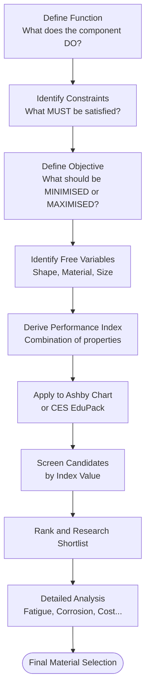

# 03. Choosing Materials for Products

> 📅 **Date:** June 4, 2026
> 🎓 **Course:** Industrial & Production Engineering (IPE)
> 🏫 **Dept.:** Industrial & Production Engineering — B.Sc. Textile Engineering
> 📖 **Ref.:** Ashby, M.F., *Materials Selection in Mechanical Design*, 5th ed., Butterworth-Heinemann (2017)

---

## Table of Contents

1. [Introduction — Why Material Selection Matters](#1-introduction)
2. [The Ashby Approach](#2-the-ashby-approach)
3. [Performance Indices](#3-performance-indices)
   - 3.1 [Stiffness-Limited Design](#31-stiffness-limited-design)
   - 3.2 [Strength-Limited Design](#32-strength-limited-design)
   - 3.3 [Thermal Design](#33-thermal-design)
   - 3.4 [Minimising Cost](#34-minimising-cost)
4. [Ashby Material Property Charts](#4-ashby-material-property-charts)
5. [Shape Factors](#5-shape-factors)
6. [Constraints, Objectives, and Free Variables](#6-constraints-objectives-and-free-variables)
7. [Case Studies](#7-case-studies)
   - 7.1 [Light, Stiff Beam](#71-light-stiff-beam)
   - 7.2 [Light, Strong Tie-Rod](#72-light-strong-tie-rod)
   - 7.3 [Thermal Insulation Panel](#73-thermal-insulation-panel)
8. [Material Substitution and Environmental Drivers](#8-material-substitution)
9. [Worked Examples](#9-worked-examples)
10. [References & Further Reading](#10-references--further-reading)

---

## 1. Introduction

Every engineering design involves material choice. The **wrong** choice leads to:
- Premature failure (underperformance)
- Excessive weight/cost (over-design)
- Difficult manufacturing
- Environmental impact

> **Ashby's maxim:** Every design has one or more objectives, subject to constraints. The best material is the one that optimises the objective while meeting all constraints.

### Selection Approach Overview

---

## 2. The Ashby Approach

Michael Ashby (Cambridge) formalised a systematic approach using **material indices** — combinations of properties that appear in the solution to optimisation problems.

### Key Concept: Separating Geometry and Material

For most structural problems, the performance equation can be written as:

$$\text{Performance} = f_1(\text{Functional requirements}) \times f_2(\text{Geometry}) \times f_3(\text{Material properties})$$

The $f_3$ factor — a combination of material properties — is the **material index** $M$. **Maximising or minimising $M$ optimises the design**, independent of the geometry $f_2$.

---

## 3. Performance Indices

### General derivation method

1. Write the **objective function** (e.g., minimise mass $m$)
2. Express the **constraint** (e.g., stiffness must be ≥ $S^*$)
3. Eliminate the **free variable** (e.g., cross-section area $A$)
4. The remaining material-only quantity is the **index**

---

### 3.1 Stiffness-Limited Design

#### Case A — Light, Stiff Tie Rod (axial load)

Stiffness of a rod: $S = \frac{EA}{L}$

Constraint: $S \geq S^*$ → $A \geq \frac{S^* L}{E}$

Mass: $m = \rho A L \geq \frac{S^* L^2 \rho}{E}$

$$\boxed{M_1 = \frac{E}{\rho}} \quad \text{maximise (specific stiffness)}$$

#### Case B — Light, Stiff Beam (bending, square cross-section)

Bending stiffness: $S = \frac{C_1 E I}{L^3}$; for square section $I = b^4/12$.

Eliminating $b$:

$$m = \rho \cdot b^2 L = \rho L \left(\frac{12 S^* L^3}{C_1 E}\right)^{1/2}$$

$$\boxed{M_2 = \frac{E^{1/2}}{\rho}} \quad \text{maximise}$$

#### Case C — Light, Stiff Panel (bending, fixed width)

For a wide panel of width $b$, thickness $t$:

$$I = \frac{b t^3}{12} \quad \Rightarrow \quad \boxed{M_3 = \frac{E^{1/3}}{\rho}} \quad \text{maximise}$$

---

### 3.2 Strength-Limited Design

#### Case D — Light, Strong Tie Rod

Constraint: $\sigma = F/A \leq \sigma_y$ → $A \geq F/\sigma_y$

Mass: $m = \rho A L \geq \frac{F L \rho}{\sigma_y}$

$$\boxed{M_4 = \frac{\sigma_y}{\rho}} \quad \text{maximise (specific strength)}$$

#### Case E — Light, Strong Beam

For a beam in bending, failure occurs when $\sigma_{max} = M c / I = \sigma_y$:

After elimination: $m \propto \frac{L^{5/2} F^{1/2} \rho}{\sigma_y^{2/3}}$

$$\boxed{M_5 = \frac{\sigma_y^{2/3}}{\rho}} \quad \text{maximise}$$

#### Case F — Pressure Vessel (thin-walled, hoop stress)

Hoop stress: $\sigma = \frac{p r}{t}$

Mass of vessel wall: $m = 2\pi r L t \rho$

$$m = \frac{2\pi r^2 L p \rho}{\sigma_y}$$

$$\boxed{M_6 = \frac{\sigma_y}{\rho}} \quad \text{(same as tie-rod — maximise specific strength)}$$

---

### 3.3 Thermal Design

#### Case G — Minimum Heat Loss through a Slab (thermal insulation)

Heat flow: $q = k A \Delta T / L$

For minimum $q$ (maximum insulation) with fixed thickness: minimise $k$.

For minimum mass insulation with fixed heat flow constraint:

$$\boxed{M_7 = \frac{k}{\rho}} \quad \text{minimise thermal conductivity per unit mass}$$

#### Case H — Minimum Thermal Distortion (precision devices)

Thermal strain: $\varepsilon_{th} = \alpha \Delta T$; the resulting stress $\sigma = E \alpha \Delta T$

For minimum distortion with minimum stress:

$$\boxed{M_8 = \frac{\alpha}{k}} \quad \text{minimise (thermal distortion index)}$$

---

### 3.4 Minimising Cost

If cost per kg is $C_m$ [£/kg], the mass cost is:

$$\text{Cost} = m \cdot C_m = \rho V C_m$$

Replace $\rho$ with $\rho C_m$ (cost per unit volume) in the index:

- Minimum cost stiff tie: $M = \frac{E}{\rho C_m}$ (maximise)
- Minimum cost strong beam: $M = \frac{\sigma_y^{2/3}}{\rho C_m}$ (maximise)

---

## 4. Ashby Material Property Charts

Ashby charts plot two properties on logarithmic axes. Guidelines of constant index $M$ appear as **straight lines** on log-log charts.

### Key Charts

**Chart 1: E–ρ (Modulus vs Density)**

*Source: Wikipedia Commons — Ashby E–ρ chart*

Guideline slope for:
- Tie (axial): slope 1 on log-log → $E/\rho = \text{const}$
- Beam: slope 2 → $E^{1/2}/\rho = \text{const}$
- Panel: slope 3 → $E^{1/3}/\rho = \text{const}$

**Reading the chart:**
Materials on a higher guideline have a better index. To maximise $E^{1/2}/\rho$ (beam), draw a line of slope 2 and shift it toward the top-left until it touches only the best candidates.

**Chart 2: σ_f–ρ (Strength vs Density)**

Useful for strength-limited lightweight design. Best performers: CFRPs, titanium alloys, high-strength Al alloys.

**Chart 3: k–C_p ρ (Thermal conductivity vs volumetric heat capacity)**

Important for thermal management and transient heating problems.

---

## 5. Shape Factors

Structural sections (I-beams, tubes) are more efficient than solid rectangles because material is placed where it is most effective.

**Macro shape factor for stiffness in bending:**

$$\phi_B^e = \frac{I}{(A^2/4\pi)} = \frac{\text{stiffness of shaped section}}{\text{stiffness of solid circle of same area}}$$

For I-beam: $\phi_B^e \approx 50–100$ (much stiffer than solid rod of same mass)

**Modified performance index with shape:**

$$M' = \phi_B^e \cdot \frac{E^{1/2}}{\rho}$$

---

## 6. Constraints, Objectives, and Free Variables

| Component | Function | Objective | Constraints |
|-----------|----------|-----------|-------------|
| Bicycle frame | Carry rider loads | Min. mass | Stiffness, strength, cost |
| Aircraft panel | Carry pressure loads | Min. mass | Fracture toughness, fatigue |
| Thermal insulation | Reduce heat loss | Min. heat loss | Cost, thickness |
| Car crumple zone | Absorb crash energy | Max. energy absorbed | Geometry, weight |
| Cutting tool | Machine metals | Min. wear | Hardness, toughness |

---

## 7. Case Studies

### 7.1 Light, Stiff Beam

**Objective:** Minimum mass beam of length $L$ = 1 m, supporting central load $F$ = 1 kN with stiffness $S^*$ = 10 kN/m. Square cross-section.

**Index:** $M_2 = E^{1/2}/\rho$ (maximise)

**Top candidates:**

| Material | $E$ (GPa) | $\rho$ (kg/m³) | $E^{1/2}/\rho$ (GPa^{1/2}·m³/kg) |
|---------|----------|--------------|----------------------------------|
| CFRP (UD) | 150 | 1550 | 7.90 × 10⁻³ |
| Beryllium | 200 | 1850 | 7.65 × 10⁻³ |
| GFRP | 25 | 1900 | 2.63 × 10⁻³ |
| Al alloy 2024 | 73 | 2770 | 3.07 × 10⁻³ |
| Steel 1020 | 207 | 7850 | 1.82 × 10⁻³ |
| Wood (pine, along grain) | 9 | 500 | 6.00 × 10⁻³ |

→ **CFRP** wins on mass. However, cost, formability, and joining must also be considered.

---

### 7.2 Light, Strong Tie-Rod

**Index:** $M_4 = \sigma_y/\rho$ (maximise)

| Material | $\sigma_y$ (MPa) | $\rho$ (kg/m³) | $M_4$ (kN·m/kg) |
|---------|----------------|--------------|----------------|
| CFRP | ~700 (tensile) | 1550 | 451 |
| Ti-6Al-4V | 880 | 4430 | 199 |
| Al 7075-T6 | 503 | 2800 | 180 |
| Steel 4340 HT | 1620 | 7850 | 206 |
| Nylon 66 | 70 | 1140 | 61 |

→ CFRP exceptional; but if cost matters, Ti-6Al-4V or 7075-T6 Al are preferred for aerospace.

---

### 7.3 Thermal Insulation Panel

**Objective:** Minimise heat loss per unit area through a panel of fixed cost per m².

**Index:** Minimise $k$ (for fixed thickness); if thickness is free, also consider $\rho C_p$ (thermal mass).

| Material | $k$ [W/(m·K)] | ρ [kg/m³] | Application |
|---------|-------------|---------|-------------|
| Aerogel | 0.015 | 100 | Ultra-high insulation |
| Expanded polystyrene (EPS) | 0.033 | 15–30 | Building insulation |
| Mineral wool | 0.040 | 30–100 | Construction |
| Polyurethane foam | 0.025 | 30–40 | Refrigeration |
| Air (still) | 0.025 | 1.2 | Baseline reference |

→ **Aerogel** best; **PU foam** most used for refrigeration.

---

## 8. Material Substitution

Drivers for substitution:
- **Weight reduction** (automotive fuel economy, aerospace)
- **Cost reduction** (cheaper raw material, easier processing)
- **Environmental performance** (recyclability, lower embodied energy)
- **Improved performance** (higher strength, better corrosion resistance)

**Eco-factors (embodied energy):**

| Material | Embodied Energy [MJ/kg] | CO₂ [kg/kg] |
|----------|------------------------|-------------|
| Steel (primary) | 22 | 1.9 |
| Aluminium (primary) | 200 | 12 |
| Aluminium (recycled) | 10 | 0.7 |
| CFRP | 280–450 | 20–35 |
| Polypropylene | 73 | 2.1 |
| Glass (fibres) | 32 | 2.0 |

> **Note:** Although CFRP has very high embodied energy, weight savings in use (e.g., aircraft) can more than offset this over service life.

---

## 9. Worked Examples

### Example 1 — Performance Index for a Shaft (torsion, min. mass)

A solid circular shaft of length $L$, transmitting torque $T$, must not yield in torsion ($\tau_{max} \leq \sigma_y/2$ by Tresca criterion).

**Constraint:** $\tau_{max} = \frac{T r}{J} = \frac{T (d/2)}{\pi d^4/32} = \frac{16T}{\pi d^3} \leq \frac{\sigma_y}{2}$

$$d^3 \geq \frac{32T}{\pi \sigma_y} \quad \Rightarrow \quad d \geq \left(\frac{32T}{\pi \sigma_y}\right)^{1/3}$$

**Mass:** $m = \rho \frac{\pi d^2}{4} L$

Substituting:

$$m = \rho \frac{\pi L}{4}\left(\frac{32T}{\pi \sigma_y}\right)^{2/3} \propto \frac{\rho}{\sigma_y^{2/3}}$$

$$\boxed{M = \frac{\sigma_y^{2/3}}{\rho}} \quad \text{maximise}$$

For $T$ = 50 N·m, $L$ = 0.5 m, comparing Al 7075 ($\sigma_y$ = 503 MPa, $\rho$ = 2800 kg/m³) vs. Steel 4340 ($\sigma_y$ = 1620 MPa, $\rho$ = 7850 kg/m³):

$$M_{Al} = \frac{(503)^{2/3}}{2800} = \frac{63.1}{2800} = 22.5 \times 10^{-3}$$

$$M_{Steel} = \frac{(1620)^{2/3}}{7850} = \frac{137.5}{7850} = 17.5 \times 10^{-3}$$

→ **Al 7075 wins** on specific strength in torsion for this index.

---

### Example 2 — Minimum Cost Strong Rod

Find minimum cost rod to carry $F$ = 10 kN axially; length $L$ = 2 m; must not yield.

Candidate materials:

| Material | $\sigma_y$ (MPa) | ρ (kg/m³) | $C_m$ (£/kg) | $M = \sigma_y/(\rho C_m)$ |
|---------|----------------|---------|------------|--------------------------|
| Steel 1020 | 210 | 7850 | 0.50 | 53.5 |
| Al 6061-T6 | 275 | 2710 | 1.80 | 56.4 |
| Nylon 66 | 70 | 1140 | 2.50 | 24.6 |
| CFRP | 700 | 1550 | 50 | 9.0 |

→ **Steel 1020 and Al 6061-T6 are comparable** on cost-performance. CFRP is expensive per kg, so poor for cost-critical applications.

Minimum cross-section for Steel 1020:

$$A = \frac{F}{\sigma_y} = \frac{10000}{210 \times 10^6} = 4.76 \times 10^{-5} \text{ m}^2 \approx \text{diameter }7.8 \text{ mm}$$

Mass: $m = \rho A L = 7850 \times 4.76 \times 10^{-5} \times 2 = 0.747$ kg

Cost: $0.747 \times 0.50 = \pounds 0.37$

---

## 10. References & Further Reading

1. **Ashby, M.F.** — *Materials Selection in Mechanical Design*, 5th ed., Butterworth-Heinemann / Elsevier (2017).
   📌 [https://www.sciencedirect.com/book/9780081006108](https://www.sciencedirect.com/book/9780081006108)

2. **Ashby, M.F. & Jones, D.R.H.** — *Engineering Materials 1*, 4th ed. (2011) — Chapter 5–7 on Selection.

3. **CES EduPack** (Granta Design / ANSYS) — Software for Ashby charts
   📌 [https://www.ansys.com/products/materials/granta-edupack](https://www.ansys.com/products/materials/granta-edupack)

4. **MIT OCW 3.080** — *Economic and Environmental Issues in Materials Selection*
   📌 [https://ocw.mit.edu/courses/3-080-economic-environmental-issues-in-materials-selection-fall-2005/](https://ocw.mit.edu/courses/3-080-economic-environmental-issues-in-materials-selection-fall-2005/)

5. **DoITPoMS — Materials Selection** (Cambridge)
   📌 [https://www.doitpoms.ac.uk/tlplib/metal-forming-1/index.php](https://www.doitpoms.ac.uk/tlplib/metal-forming-1/index.php)

6. **Callister Ch. 22** — Economic, Environmental, and Societal Issues

---

*← [02 — Processing of Materials](02-processing-of-materials.md) | Back to [Course Index](README.md) | Next → [04 — Atomic & Molecular Structures](04-atomic-molecular-structures.md)*
