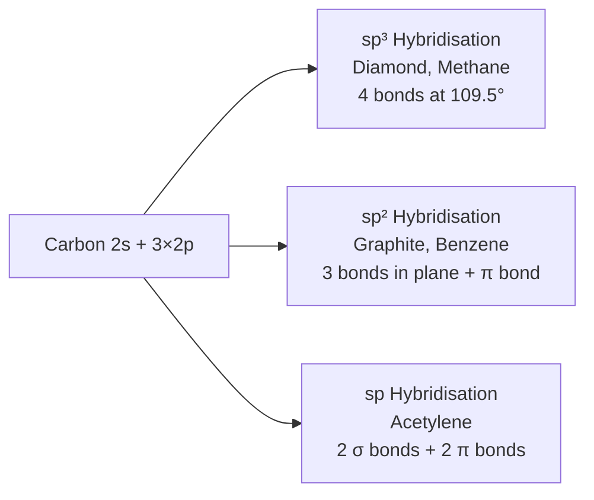
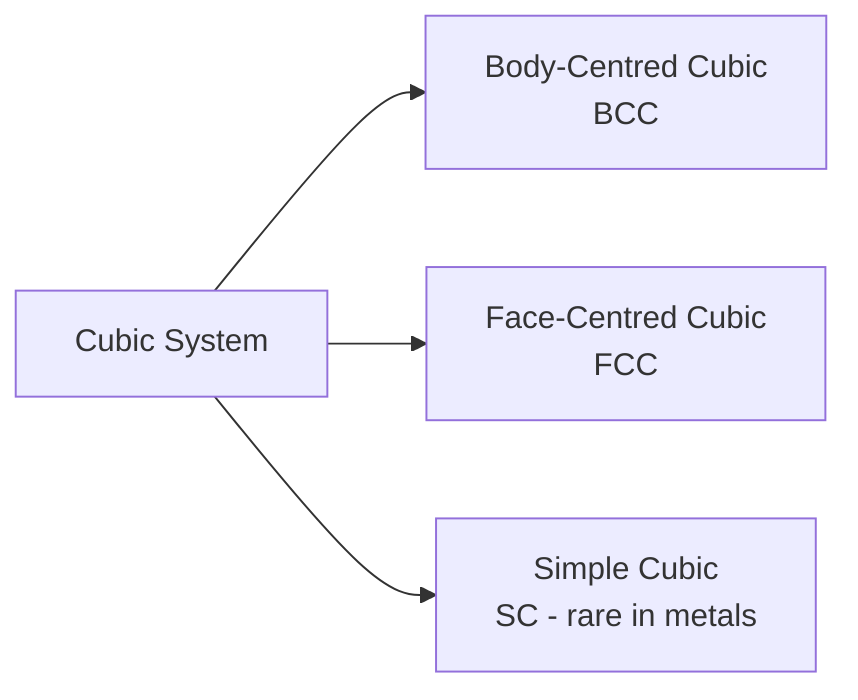
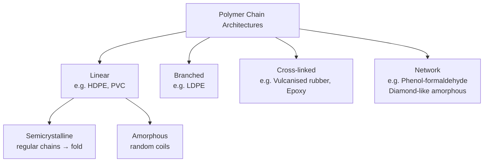
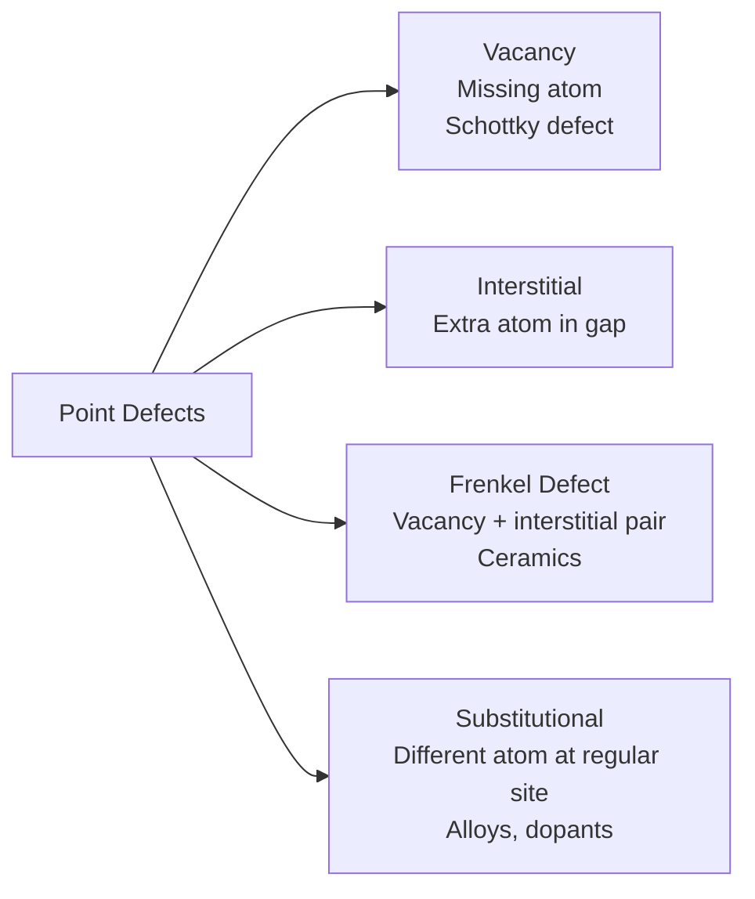

# 04. Atomic, Molecular, Crystalline & Amorphous Structures

> 📅 **Date:** June 4, 2026
> 🎓 **Course:** Industrial & Production Engineering (IPE)
> 🏫 **Dept.:** Industrial & Production Engineering — B.Sc. Textile Engineering
> 📖 **Ref.:** Callister & Rethwisch, Ch. 2–4; Shackelford, Ch. 2–3

---

## Table of Contents

1. [Atomic Structure Fundamentals](#1-atomic-structure-fundamentals)
2. [Interatomic Bonding](#2-interatomic-bonding)
   - 2.1 [Ionic Bonding](#21-ionic-bonding)
   - 2.2 [Covalent Bonding](#22-covalent-bonding)
   - 2.3 [Metallic Bonding](#23-metallic-bonding)
   - 2.4 [Secondary Bonds](#24-secondary-bonds)
3. [Crystal Geometry — Lattices and Unit Cells](#3-crystal-geometry)
4. [Metal Crystal Structures](#4-metal-crystal-structures)
   - 4.1 [Body-Centred Cubic (BCC)](#41-body-centred-cubic-bcc)
   - 4.2 [Face-Centred Cubic (FCC)](#42-face-centred-cubic-fcc)
   - 4.3 [Hexagonal Close-Packed (HCP)](#43-hexagonal-close-packed-hcp)
5. [Miller Indices](#5-miller-indices)
6. [Ceramic Crystal Structures](#6-ceramic-crystal-structures)
7. [Polymer Structures](#7-polymer-structures)
8. [Amorphous Structures](#8-amorphous-structures)
9. [Crystal Defects](#9-crystal-defects)
10. [X-Ray Diffraction and Bragg's Law](#10-x-ray-diffraction-and-braggs-law)
11. [Worked Examples](#11-worked-examples)
12. [References & Further Reading](#12-references--further-reading)

---

## 1. Atomic Structure Fundamentals

### 1.1 The Atom

An atom consists of:
- **Nucleus**: protons ($Z$) + neutrons ($N$), mass ≈ $A = Z + N$ (atomic mass number)
- **Electrons**: $Z$ electrons orbiting the nucleus in shells

**Quantum numbers:**

| Symbol | Name | Values | Describes |
|--------|------|--------|-----------|
| $n$ | Principal | 1, 2, 3, … | Shell / energy level |
| $l$ | Azimuthal | 0, 1, …, $n$−1 | Sub-shell (s, p, d, f) |
| $m_l$ | Magnetic | $-l, …, 0, …, +l$ | Orbital orientation |
| $m_s$ | Spin | ±½ | Electron spin |

**Pauli Exclusion Principle:** No two electrons may have identical quantum numbers.

**Aufbau order:** 1s, 2s, 2p, 3s, 3p, 4s, 3d, 4p, 5s, 4d, 5p, 6s, 4f, 5d…

| Sub-shell | Max electrons |
|-----------|--------------|
| s ($l$=0) | 2 |
| p ($l$=1) | 6 |
| d ($l$=2) | 10 |
| f ($l$=3) | 14 |

**Electron configuration examples:**

| Element | Z | Config |
|---------|---|--------|
| Fe | 26 | [Ar] 3d⁶ 4s² |
| Cu | 29 | [Ar] 3d¹⁰ 4s¹ (anomalous) |
| Si | 14 | [Ne] 3s² 3p² |
| Al | 13 | [Ne] 3s² 3p¹ |

---

## 2. Interatomic Bonding

The **Lennard-Jones potential** (total interaction energy between two atoms):

$$V(r) = 4\varepsilon\left[\left(\frac{\sigma}{r}\right)^{12} - \left(\frac{\sigma}{r}\right)^{6}\right]$$

- Repulsive (short-range): $+\left(\frac{\sigma}{r}\right)^{12}$ — electron cloud overlap
- Attractive (long-range): $-\left(\frac{\sigma}{r}\right)^{6}$ — van der Waals dipole

**Equilibrium bond length** $r_0$: where $dV/dr = 0$

$$r_0 = 2^{1/6}\sigma \approx 1.12\sigma$$

**Bond stiffness** (directly related to Young's modulus):

$$S_0 = \left.\frac{d^2V}{dr^2}\right|_{r=r_0}$$

$$E \approx \frac{S_0}{r_0}$$

This explains why **ceramics (ionic/covalent) have high E** (deep, narrow potential well) and **polymers have low E** (shallow, wide well from van der Waals).

---

### 2.1 Ionic Bonding

Transfer of electrons from electropositive metal to electronegative non-metal.

**Madelung energy** (lattice energy):

$$U = -\frac{N A_M q^2}{4\pi\varepsilon_0 r_0}\left(1 - \frac{1}{n}\right)$$

where $A_M$ = Madelung constant (NaCl: 1.748), $q$ = ion charge, $n$ = Born exponent (≈8–12).

**Characteristics:**
- Strong, non-directional
- High melting point (NaCl: 801°C, MgO: 2852°C)
- Brittle (ionic planes shift breaks electrostatic balance)
- Soluble in polar solvents (water)
- Electrically insulating (in solid state)

**Examples:** NaCl, MgO, CaF₂, Al₂O₃

---

### 2.2 Covalent Bonding

**Sharing** of electron pairs between atoms.

**Bond energy range:** 150–1000 kJ/mol (strong)

**Directionality:** sp³ (tetrahedral, 109.5°), sp² (planar, 120°), sp (linear, 180°)

**Hybrid orbitals in carbon:**

**Characteristics:**
- Very strong, highly directional
- High hardness (diamond: HV ≈ 10000)
- Brittle in ceramics
- Poor electrical conductors (electrons localised)
- Examples: Diamond (C–C), SiC, Si₃N₄, polyethylene (C–C backbone)

---

### 2.3 Metallic Bonding

Metal atom cores (nucleus + core electrons) in a **sea of delocalised valence electrons**.

$$E_{cohesive} = -A n^{2/3} \quad \text{(Wigner-Seitz approximation)}$$

**Characteristics:**
- Non-directional → many slip systems → ductility
- Free electrons → high $\sigma_e$ and $k$
- Lustrous (free electrons reflect light)
- Examples: Fe, Cu, Al, Ag, Au

---

### 2.4 Secondary Bonds

**Van der Waals (Dispersion / London):**

$$E_{vdW} \approx -\frac{C}{r^6}$$

Induced dipole–dipole interactions. Weak (~0.1–10 kJ/mol). Important in polymers and noble gas solids.

**Hydrogen Bond:**

A–H···B where A, B = electronegative atoms (O, N, F).
Strength: ~10–40 kJ/mol. Critical for:
- Water structure (explains anomalous density)
- DNA double helix (A–T: 2 H-bonds, G–C: 3)
- Nylon, polyamide strength
- Spider silk properties

---

## 3. Crystal Geometry

A **crystal** is a solid with a **long-range periodic arrangement** of atoms.

### 3.1 The 7 Crystal Systems

| System | Axes | Angles |
|--------|------|--------|
| **Cubic** | a = b = c | α = β = γ = 90° |
| **Tetragonal** | a = b ≠ c | α = β = γ = 90° |
| **Orthorhombic** | a ≠ b ≠ c | α = β = γ = 90° |
| **Hexagonal** | a = b ≠ c | α = β = 90°, γ = 120° |
| **Rhombohedral/Trigonal** | a = b = c | α = β = γ ≠ 90° |
| **Monoclinic** | a ≠ b ≠ c | α = γ = 90°, β ≠ 90° |
| **Triclinic** | a ≠ b ≠ c | α ≠ β ≠ γ ≠ 90° |

### 3.2 14 Bravais Lattices

Within the 7 systems, 14 distinct space lattice arrangements exist (Bravais, 1850). The three most important for metals:

---

## 4. Metal Crystal Structures

### 4.1 Body-Centred Cubic (BCC)

*BCC unit cell — Source: Wikipedia Commons*

| Property | Formula | Value |
|----------|---------|-------|
| Atoms per unit cell | $2 = 8 \times \frac{1}{8} + 1$ | **2** |
| Close-packed direction | [111] | Body diagonal |
| Relationship $a$–$r$ | $\sqrt{3}a = 4r$ → $a = \frac{4r}{\sqrt{3}}$ | |
| Coordination number | CN | **8** |
| Atomic packing factor | APF = $\frac{2 \times \frac{4}{3}\pi r^3}{a^3}$ | **0.68** |

**APF Derivation:**

$$APF_{BCC} = \frac{2 \times \frac{4}{3}\pi r^3}{\left(\frac{4r}{\sqrt{3}}\right)^3} = \frac{\frac{8\pi r^3}{3}}{\frac{64r^3}{3\sqrt{3}}} = \frac{8\pi}{3} \times \frac{3\sqrt{3}}{64} = \frac{\pi\sqrt{3}}{8} \approx 0.680$$

**Metals with BCC structure:** Fe (below 912°C), W, Cr, Mo, V, Nb, Ta

---

### 4.2 Face-Centred Cubic (FCC)

*FCC unit cell — Source: Wikipedia Commons*

| Property | Formula | Value |
|----------|---------|-------|
| Atoms per unit cell | $4 = 8 \times \frac{1}{8} + 6 \times \frac{1}{2}$ | **4** |
| Close-packed direction | [110] | Face diagonal |
| Close-packed plane | (111) | — |
| Relationship $a$–$r$ | $\sqrt{2}a = 4r$ → $a = 2\sqrt{2} r$ | |
| Coordination number | CN | **12** |
| APF | $\frac{4 \times \frac{4}{3}\pi r^3}{(2\sqrt{2}r)^3}$ | **0.74** (maximum for spheres) |

**APF Derivation:**

$$APF_{FCC} = \frac{4 \times \frac{4}{3}\pi r^3}{(2\sqrt{2}r)^3} = \frac{\frac{16\pi r^3}{3}}{16\sqrt{2}r^3} = \frac{\pi}{3\sqrt{2}} = \frac{\pi\sqrt{2}}{6} \approx 0.7405$$

**Metals with FCC structure:** Al, Cu, Ni, Ag, Au, Pb, γ-Fe (austenite, 912–1394°C)

**Slip system:** (111)[110] — 4 planes × 3 directions = 12 slip systems → **most ductile**

---

### 4.3 Hexagonal Close-Packed (HCP)

*HCP unit cell — Source: Wikipedia Commons*

| Property | Value |
|----------|-------|
| Atoms per unit cell | **6** (= 2 mid-layer + 2×½ top/bottom + 6×⅙ corners×2) |
| Coordination number | **12** (same as FCC) |
| APF | **0.74** (same as FCC — also close-packed) |
| Ideal c/a ratio | $\sqrt{8/3}$ = 1.633 |

**Stacking sequence:**

- FCC: ABCABCABC…
- HCP: ABABAB…

Both are close-packed but differ in stacking of (111)/(0001) planes.

**Metals with HCP structure:** Zn ($c/a$ = 1.856), Mg, Ti (below 882°C), Co, Be, Cd

> **Why HCP metals are less ductile than FCC:** HCP has only 3 independent slip systems vs. 12 for FCC → limited dislocation motion.

---

### 4.4 Theoretical Density Calculation

$$\rho_{theoretical} = \frac{n \cdot A}{V_c \cdot N_A}$$

where:
- $n$ = atoms per unit cell
- $A$ = atomic mass (g/mol)
- $V_c$ = unit cell volume (cm³)
- $N_A$ = Avogadro's number = $6.022 \times 10^{23}$ atoms/mol

**Example — Copper (FCC):**
$n = 4$, $A_{Cu}$ = 63.55 g/mol, $r_{Cu}$ = 0.128 nm → $a = 2\sqrt{2} \times 0.128$ nm = 0.3620 nm

$$V_c = a^3 = (3.620 \times 10^{-8} \text{ cm})^3 = 4.748 \times 10^{-23} \text{ cm}^3$$

$$\rho = \frac{4 \times 63.55}{4.748 \times 10^{-23} \times 6.022 \times 10^{23}} = \frac{254.2}{28.59} = \boxed{8.89 \text{ g/cm}^3}$$

(measured: 8.94 g/cm³ — 0.5% error due to rounding of $r$)

---

## 5. Miller Indices

Miller indices $(hkl)$ describe **crystallographic planes**; $[uvw]$ describe **directions**.

### 5.1 How to Determine Miller Indices for a Plane

1. Find intercepts on $x$, $y$, $z$ axes in terms of $a$, $b$, $c$
2. Take reciprocals
3. Clear fractions to smallest integers
4. Enclose in parentheses: $(hkl)$

**Convention:**
- Negative index: bar over number $\bar{h}$ (e.g., $(1\bar{1}0)$)
- $\{hkl\}$ = family of equivalent planes (e.g., $\{100\} = (100),(010),(001),(\bar100),\ldots$)
- $[uvw]$ = direction vector; $\langle uvw\rangle$ = family of equivalent directions

### 5.2 Examples

**Plane with intercepts (∞, 1, 1/2):**
- Reciprocals: 0, 1, 2 → Miller index: **(012)**

**Plane with intercepts (1, 1, 1):**
- Reciprocals: 1, 1, 1 → Miller index: **(111)** — the FCC close-packed plane

**Direction [110]:** along the face diagonal of a cubic cell → close-packed direction in FCC

### 5.3 Interplanar Spacing (Cubic)

$$d_{hkl} = \frac{a}{\sqrt{h^2 + k^2 + l^2}}$$

Example: $d_{110}$ for FCC Al ($a$ = 0.4049 nm):

$$d_{110} = \frac{0.4049}{\sqrt{1+1+0}} = \frac{0.4049}{\sqrt{2}} = 0.2863 \text{ nm}$$

---

## 6. Ceramic Crystal Structures

Ceramics contain cations (+) and anions (−). Stability requires:
1. **Charge neutrality**: $\sum Z_i n_i = 0$
2. **Radius ratio rule**: $r_{cation}/r_{anion}$ determines coordination number

| $r_+/r_-$ | CN | Geometry |
|-----------|-----|---------|
| 0.155–0.225 | 3 | Triangular |
| 0.225–0.414 | 4 | Tetrahedral |
| 0.414–0.732 | 6 | Octahedral |
| 0.732–1.000 | 8 | Cubic |
| 1.000 | 12 | Cuboctahedral |

### 6.1 Rock Salt Structure (NaCl, MgO)

- Na⁺ in octahedral holes of FCC Cl⁻ lattice
- CN = 6 for both ions ($r_{Na}/r_{Cl}$ = 0.564, in range 0.414–0.732)
- $a = 2(r_+ + r_-)$

**Formula derivation:** 4 NaCl per unit cell ($n_{Na}$ = 4, $n_{Cl}$ = 4)

### 6.2 Cesium Chloride Structure (CsCl)

- Simple cubic Cl⁻, Cs⁺ in centre
- CN = 8 ($r_{Cs}/r_{Cl}$ = 0.934 > 0.732)
- **Not BCC** (two different atoms!)

### 6.3 Fluorite Structure (CaF₂, ZrO₂)

- Ca²⁺ in FCC positions, F⁻ in all tetrahedral holes
- Formula: 1 Ca : 2 F → $n_{Ca}$ = 4, $n_F$ = 8 per unit cell
- Stabilised ZrO₂ (add Y₂O₃): important for thermal barrier coatings, solid oxide fuel cells

### 6.4 Perovskite Structure (BaTiO₃, CaTiO₃)

- Formula: ABX₃
- Large A cation (Ba²⁺) + B cation (Ti⁴⁺) + 3 X anions (O²⁻)
- Ti⁴⁺ off-centre below Curie temperature → **ferroelectric** (piezoelectric)
- Applications: capacitors, actuators, transducers, SOFC electrolytes

---

## 7. Polymer Structures

### 7.1 Chain Architecture

### 7.2 Tacticity

Stereochemistry of pendant groups along a vinyl polymer chain (−CH₂−CHR−):

| Tacticity | Description | Crystallisability |
|-----------|-------------|-----------------|
| **Isotactic** | All R on same side | Semicrystalline |
| **Syndiotactic** | R alternating sides | Semicrystalline |
| **Atactic** | Random | Amorphous |

**Isotactic PP** → ρ = 0.92 g/cm³, T_m = 176°C, used in packaging, engineering.
**Atactic PP** → completely amorphous, sticky; not used structurally.

### 7.3 Degree of Polymerisation and Molecular Weight

$$M_n = \sum x_i M_i \quad \text{(number-average)} \quad ; \quad M_w = \frac{\sum x_i M_i^2}{\sum x_i M_i} \quad \text{(weight-average)}$$

**Polydispersity index (PDI):**

$$PDI = \frac{M_w}{M_n} \geq 1$$

PDI = 1: monodisperse (ideal); PDI > 1: broad distribution (typical commercial polymer).

### 7.4 Crystallinity in Polymers

Degree of crystallinity $\chi_c$:

$$\chi_c = \frac{\rho_c(\rho - \rho_a)}{\rho(\rho_c - \rho_a)} \times 100\%$$

where $\rho$ = observed density, $\rho_c$ = fully crystalline density, $\rho_a$ = amorphous density.

Higher crystallinity → higher density, stiffness, yield strength, melting point; lower toughness and impact strength.

---

## 8. Amorphous Structures

**Amorphous** = no long-range order. Atoms/molecules arranged randomly (like a frozen liquid).

### 8.1 Amorphous Metals (Metallic Glasses)

Produced by **rapid solidification** (~10⁶ K/s) — no time for crystallisation.
- Very high strength (no grain boundaries)
- High hardness
- Good corrosion resistance
- Applications: razor blades (Fe-based), transformer cores (Fe-Si-B), golf club heads

### 8.2 Oxide Glasses

SiO₂ glass: Si⁴⁺ in SiO₄ tetrahedra, randomly linked. No long-range order.

**Modified glasses:** Na₂O breaks Si–O–Si bridges → **network modifiers** → lower viscosity, lower T_g.

**Viscosity–temperature relationship (VTF/WLF equations for silicates):**

$$\eta = A \exp\left(\frac{B}{T - T_0}\right)$$

**Glass transition temperature $T_g$:**

Below $T_g$: glassy solid (brittle)
Above $T_g$: rubbery / viscous flow

$T_g$ increases with:
- Cross-link density
- Chain stiffness
- Molecular weight (for polymers)

### 8.3 Crystalline vs Amorphous Comparison

| Property | Crystalline | Amorphous |
|----------|-------------|----------|
| Long-range order | Yes | No |
| Sharp melting point | Yes | No (gradual softening at T_g) |
| Density | Higher | Lower |
| Mechanical strength | Can be high | Often high (no grain boundaries) |
| Transparency | Often opaque (grain scatter) | Often transparent |
| Examples | Al, Fe, NaCl | Silica glass, PMMA, metallic glass |

---

## 9. Crystal Defects

Real crystals are **never perfect**. Defects control mechanical, electrical, and diffusion properties.

### 9.1 Point Defects

**Equilibrium vacancy concentration:**

$$N_v = N \exp\left(-\frac{Q_v}{k_B T}\right)$$

where $Q_v$ = activation energy for vacancy formation, $k_B$ = Boltzmann constant ($8.62 \times 10^{-5}$ eV/K).

**Example — Cu at 1000°C (1273 K):**
$Q_v$ = 0.9 eV, $N$ ≈ $8.0 \times 10^{28}$ atoms/m³

$$\frac{N_v}{N} = \exp\left(-\frac{0.9}{8.62 \times 10^{-5} \times 1273}\right) = \exp(-8.20) = 2.74 \times 10^{-4}$$

$$N_v = 2.74 \times 10^{-4} \times 8.0 \times 10^{28} = 2.19 \times 10^{25} \text{ vacancies/m}^3$$

### 9.2 Line Defects (Dislocations)

**Edge dislocation:** extra half-plane of atoms. Burger's vector **b** ⊥ dislocation line.

**Screw dislocation:** lattice sheared parallel to dislocation line. **b** ∥ dislocation line.

**Why dislocations matter:** Plastic deformation occurs by **dislocation glide** — dislocations move through the lattice under shear stress.

**Critical resolved shear stress (Schmid's Law):**

$$\tau_{crss} = \sigma \cos\phi \cos\lambda$$

where $\phi$ = angle between load axis and slip plane normal, $\lambda$ = angle between load axis and slip direction.

**Taylor factor $M_T$:**

$$\sigma_y = M_T \cdot \tau_{crss}$$

For polycrystalline FCC metals: $M_T$ ≈ 3.06

### 9.3 Planar Defects

- **Grain boundaries:** interface between two crystals of different orientation → strengthening
- **Stacking faults:** wrong stacking sequence (ABCABC**B**CABC...)
- **Twin boundary:** mirror image reflection of lattice; important in TWIP steels
- **Free surface:** atoms on surface have fewer neighbours → surface energy

**Hall-Petch relationship (grain size strengthening):**

$$\sigma_y = \sigma_0 + k_y d^{-1/2}$$

where $d$ = grain diameter, $k_y$ = Hall-Petch coefficient, $\sigma_0$ = lattice friction stress.

**Example:** Al with $d$ = 100 μm → $d$ = 10 μm: reduces $d^{-1/2}$ from 100 to 316 m$^{-1/2}$

$$\Delta\sigma_y = k_y \times (316 - 100) = 0.04 \times 216 \approx 8.6 \text{ MPa}$$

### 9.4 Volume Defects (3D)

- **Voids / porosity**: from processing, fatigue
- **Inclusions**: foreign particles (MnS in steel)
- **Precipitates**: second-phase particles from heat treatment (γ' in Ni superalloys)

---

## 10. X-Ray Diffraction and Bragg's Law

X-rays are diffracted by crystal planes. Constructive interference when:

$$\boxed{n\lambda = 2d_{hkl}\sin\theta}$$

(Bragg's Law)

where $n$ = order, $\lambda$ = X-ray wavelength, $d_{hkl}$ = interplanar spacing, $\theta$ = glancing angle.

**Diffraction condition for BCC:** $h + k + l$ = even (structure factor ≠ 0)

**Diffraction condition for FCC:** $h, k, l$ all odd or all even

These **extinction rules** are used to identify crystal structures from XRD patterns.

**Scherrer equation (crystallite size from peak broadening):**

$$D = \frac{K\lambda}{\beta\cos\theta}$$

where $K$ ≈ 0.9 (Scherrer constant), $\beta$ = FWHM of peak [radians].

---

## 11. Worked Examples

### Example 1 — BCC Atomic Radius and Density for Iron

Iron (BCC, $a$ = 0.2866 nm, $A_{Fe}$ = 55.85 g/mol):

**Atomic radius:**
$$r = \frac{\sqrt{3}a}{4} = \frac{\sqrt{3} \times 0.2866}{4} = \frac{0.4964}{4} = 0.1241 \text{ nm}$$

**Theoretical density:**
$$\rho = \frac{nA}{V_c N_A} = \frac{2 \times 55.85}{(2.866 \times 10^{-8})^3 \times 6.022 \times 10^{23}}$$

$$V_c = (2.866 \times 10^{-8})^3 = 2.354 \times 10^{-23} \text{ cm}^3$$

$$\rho = \frac{111.7}{2.354 \times 10^{-23} \times 6.022 \times 10^{23}} = \frac{111.7}{14.18} = \boxed{7.88 \text{ g/cm}^3}$$

(Measured: 7.87 g/cm³ — excellent agreement)

---

### Example 2 — Bragg's Law: Finding Crystal Plane

XRD using Cu $K\alpha$ radiation ($\lambda$ = 0.15406 nm). A peak appears at $2\theta$ = 43.3°.

Find the interplanar spacing and identify the plane for BCC iron ($a$ = 0.2866 nm).

$$\theta = 21.65°, \quad d = \frac{\lambda}{2\sin\theta} = \frac{0.15406}{2 \times \sin(21.65°)} = \frac{0.15406}{2 \times 0.3688} = 0.2088 \text{ nm}$$

$$h^2 + k^2 + l^2 = \frac{a^2}{d^2} = \frac{(0.2866)^2}{(0.2088)^2} = \frac{0.08214}{0.04360} = 1.884 \approx 2$$

$(h,k,l)$ with $h^2+k^2+l^2 = 2$: **(110)** (and since 1+1+0 = 2 = even ✓ for BCC)

$$d_{110,theoretical} = \frac{0.2866}{\sqrt{2}} = 0.2026 \text{ nm}$$

---

### Example 3 — Hall-Petch Calculation for Copper

For pure copper: $\sigma_0$ = 25 MPa, $k_y$ = 0.11 MPa√m.

For $d$ = 500 μm: $\sigma_y = 25 + 0.11/(500 \times 10^{-6})^{0.5} = 25 + 0.11/0.02236 = 25 + 4.9 = 29.9$ MPa

For $d$ = 50 μm: $\sigma_y = 25 + 0.11/\sqrt{50 \times 10^{-6}} = 25 + 0.11/0.00707 = 25 + 15.6 = 40.6$ MPa

For $d$ = 5 μm: $\sigma_y = 25 + 0.11/\sqrt{5 \times 10^{-6}} = 25 + 0.11/0.002236 = 25 + 49.2 = 74.2$ MPa

**Finer grain → 2.5× increase in yield strength** by reducing grain size 100×.

---

## 12. References & Further Reading

1. **Callister, W.D. & Rethwisch, D.G.** — *Materials Science and Engineering*, 10th ed. — Chapters 2, 3, 4, 12, 14.

2. **Shackelford, J.F.** — *Introduction to Materials Science for Engineers*, 8th ed., Pearson (2015).

3. **DoITPoMS — Crystal Structures**
   📌 [https://www.doitpoms.ac.uk/tlplib/crystallography3/index.php](https://www.doitpoms.ac.uk/tlplib/crystallography3/index.php)

4. **MIT OCW 3.012 — Structure of Materials**
   📌 [https://ocw.mit.edu/courses/3-012-fundamentals-of-materials-science-fall-2005/pages/lecture-notes/](https://ocw.mit.edu/courses/3-012-fundamentals-of-materials-science-fall-2005/pages/lecture-notes/)

5. **CrystalMaker Software** — Visualise crystal structures interactively
   📌 [https://www.crystalmaker.com](https://www.crystalmaker.com)

6. **Interactive Crystal Structures — WebMineral**
   📌 [http://webmineral.com/](http://webmineral.com/)

7. **VESTA (Crystal Structure Visualisation)** — Free software
   📌 [https://jp-minerals.org/vesta/en/](https://jp-minerals.org/vesta/en/)

8. **LibreTexts — Crystal Structure**
   📌 [https://eng.libretexts.org/Bookshelves/Materials_Science/Supplemental_Modules_(Materials_Science)/Crystal_Structure](https://eng.libretexts.org/Bookshelves/Materials_Science/Supplemental_Modules_(Materials_Science)/Crystal_Structure)

---

*← [03 — Material Selection](03-material-selection.md) | Back to [Course Index](README.md) | Next → [05 — Mechanical Behaviour, Fracture & Fatigue](05-mechanical-behavior.md)*
