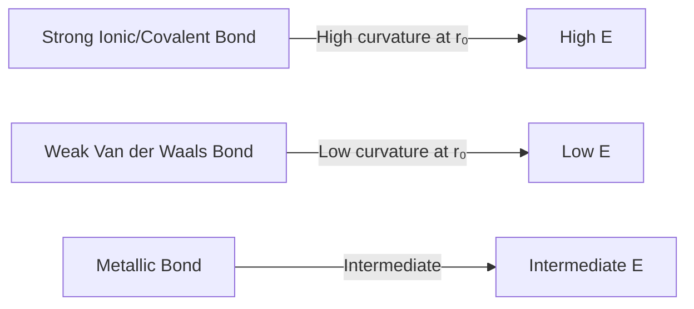
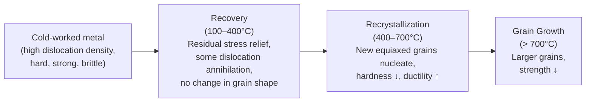
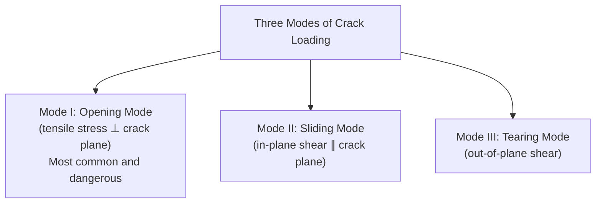
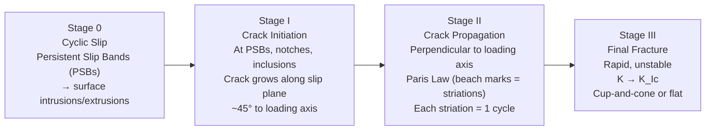
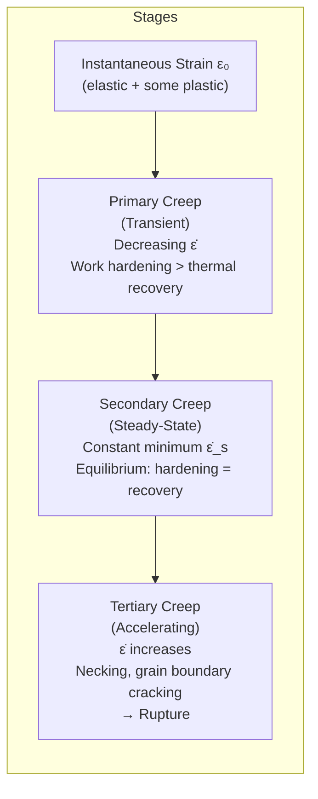
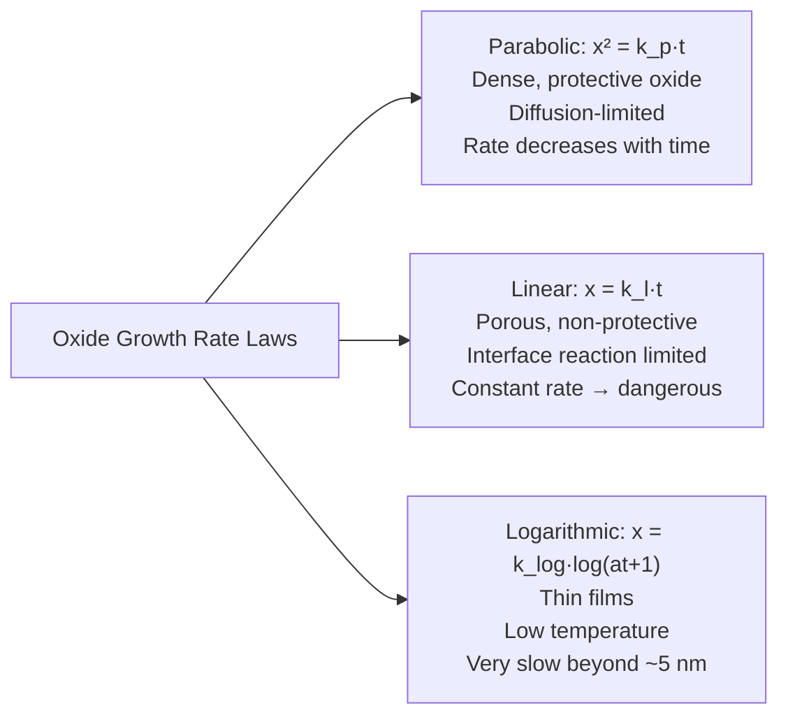
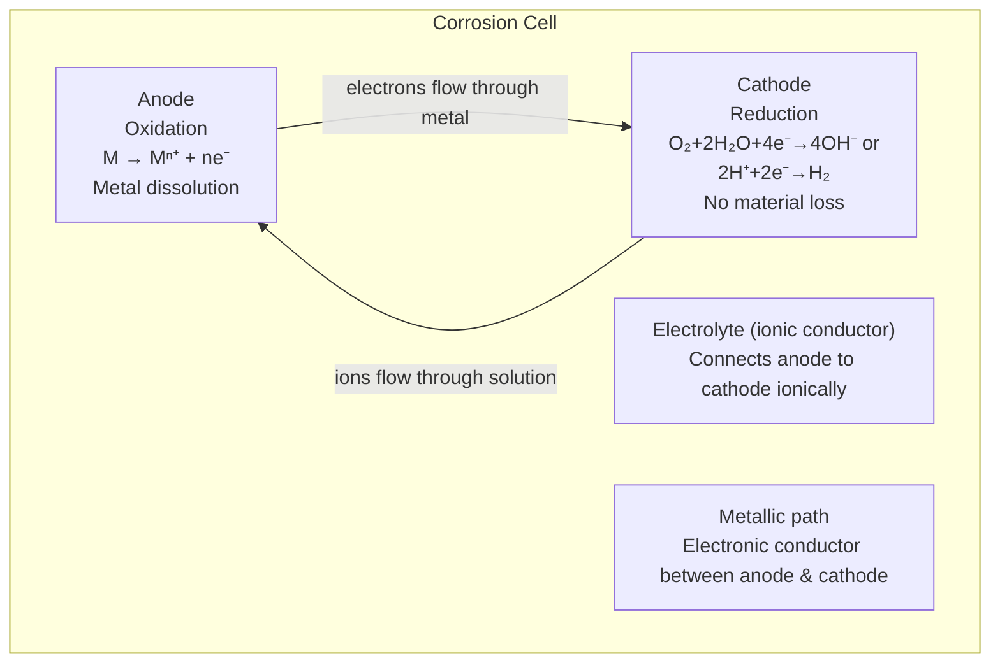
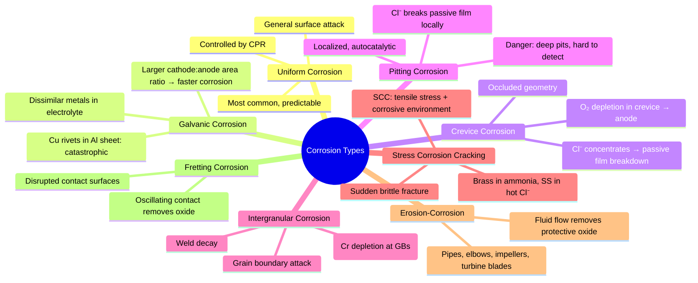

# Topic 5: Elastic and Plastic Behavior of Materials in Service

> **Course:** IPE-101 — Industrial & Production Engineering
> **Institution:** Bangladesh University of Textiles (BUTEX)
> **Date:** June 4, 2026
> **References:** Callister & Rethwisch (10th ed.), Ashby & Jones, Anderson (Fracture Mechanics)

---

## Table of Contents

1. [Elastic Behavior](#1-elastic-behavior)
2. [Plastic Behavior and Work Hardening](#2-plastic-behavior-and-work-hardening)
3. [Fracture](#3-fracture)
4. [Ductile-Brittle Transition (DBTT)](#4-ductile-brittle-transition-dbtt)
5. [Fatigue](#5-fatigue)
6. [Creep](#6-creep)
7. [Oxidation and High-Temperature Degradation](#7-oxidation-and-high-temperature-degradation)
8. [Corrosion and Corrosion Protection](#8-corrosion-and-corrosion-protection)
9. [Practice Problems](#9-practice-problems)
10. [References and Further Reading](#10-references-and-further-reading)

---

## 1. Elastic Behavior

### 1.1 Definition

**Elastic deformation** is *reversible* deformation — when the applied load is removed, the material returns exactly to its original dimensions. It is governed by interatomic bonding forces (the restoring force from a stretched or compressed bond). The energy is stored and fully recoverable (like a spring).

### 1.2 Stress and Strain Fundamentals

#### Engineering (Nominal) Stress

$$\sigma = \frac{F}{A_0} \quad [\text{Pa} = \text{N/m}^2]$$

where $F$ = applied force (N), $A_0$ = **original** cross-sectional area (m²).
Practical units: MPa ($10^6$ Pa) and GPa ($10^9$ Pa).

#### Engineering (Nominal) Strain

$$\varepsilon = \frac{\Delta L}{L_0} = \frac{L - L_0}{L_0} \quad [\text{dimensionless}]$$

where $L_0$ = original gauge length, $L$ = deformed gauge length.

#### Shear Stress and Shear Strain

$$\tau = \frac{F_s}{A_0}, \qquad \gamma = \tan\theta \approx \theta \quad (\text{small angle approximation})$$

where $F_s$ is the force component *parallel* to the cross-section.

### 1.3 Hooke's Law

For a linear-elastic, isotropic material under **uniaxial** loading:

$$\boxed{\sigma = E\varepsilon}$$

where $E$ is the **Young's modulus (modulus of elasticity)** — a fundamental material constant reflecting bond stiffness.

For **shear**:
$$\tau = G\gamma$$

For **hydrostatic compression** (volumetric stress):
$$P = -K\frac{\Delta V}{V_0}$$

$G$ = shear modulus, $K$ = bulk modulus. All three have units of GPa.

| Material | $E$ (GPa) | $G$ (GPa) | $K$ (GPa) |
|---|---|---|---|
| Diamond | 1000 | 478 | 443 |
| Tungsten (W) | 411 | 161 | 311 |
| Steel (low-C) | 200–210 | 80–84 | 160–170 |
| Copper | 110–130 | 40–50 | 130–140 |
| Aluminum | 69–70 | 26 | 76 |
| Glass (soda-lime) | 69 | 29 | 45 |
| Polyethylene (HDPE) | 0.7–1.4 | — | — |
| Rubber | 0.001–0.1 | — | — |

### 1.4 Poisson's Ratio

When a material is stretched axially, it contracts laterally:

$$\nu = -\frac{\varepsilon_{\text{lateral}}}{\varepsilon_{\text{axial}}}$$

- For isotropic materials: $0 \leq \nu \leq 0.5$
- Metals: $\nu \approx 0.25$–$0.35$
- Rubber (incompressible): $\nu \approx 0.5$
- Cork: $\nu \approx 0$ (why it is used for bottle stoppers — no lateral expansion)

### 1.5 Elastic Moduli Interrelationships

For an isotropic solid, only **two** of the four constants are independent:

$$\boxed{E = 2G(1+\nu) = 3K(1-2\nu)}$$

$$G = \frac{3KE}{9K-E}, \qquad \nu = \frac{3K-2G}{6K+2G}$$

**Worked Example:**

> Steel: $E = 200$ GPa, $\nu = 0.30$. Find $G$ and $K$.
>
> $$G = \frac{E}{2(1+\nu)} = \frac{200}{2(1.30)} = 76.9 \text{ GPa}$$
>
> $$K = \frac{E}{3(1-2\nu)} = \frac{200}{3(0.40)} = 166.7 \text{ GPa}$$

### 1.6 Atomic Origin of Elastic Modulus

The elastic modulus reflects the curvature of the interatomic potential energy well at the equilibrium separation $r_0$:

$$E \propto \left.\frac{d^2U}{dr^2}\right|_{r=r_0}$$

This explains why:
- Strongly bonded materials (diamond, ceramics) → high $E$
- Weakly bonded polymers → low $E$
- $E$ decreases with temperature (bonds soften)

*Fig 1.1: Typical stress-strain curves for ductile metal vs. brittle ceramic. Source: Wikimedia Commons*

---

## 2. Plastic Behavior and Work Hardening

### 2.1 The Yield Point

Beyond the **elastic limit**, deformation becomes **permanent (plastic)**. The transition stress is the **yield strength** $\sigma_y$.

**0.2% Offset Yield Strength:** For metals without a sharp yield point, draw a line parallel to the elastic region, offset by $\varepsilon = 0.002$ (0.2%). Its intersection with the stress-strain curve defines $\sigma_y$.

**Sharp yield point in mild steel:** The upper/lower yield point phenomenon is caused by **Cottrell atmospheres** — interstitial carbon and nitrogen atoms pin dislocations. When the applied stress exceeds the pinning force (upper yield point, $\sigma_{yU}$), dislocations break free and strain localization (Lüders bands) propagates at a lower stress ($\sigma_{yL}$).

### 2.2 True Stress and True Strain

Engineering stress and strain reference the **original** dimensions, which becomes inaccurate after large deformation (especially necking). **True (Cauchy) stress and true (logarithmic) strain** reference the **instantaneous** dimensions:

$$\sigma_T = \frac{F}{A_i} = \sigma(1 + \varepsilon)$$

$$\varepsilon_T = \ln\left(\frac{L}{L_0}\right) = \ln(1 + \varepsilon)$$

Volume conservation in plastic deformation: $A_0 L_0 = A_i L_i$, therefore:

$$\varepsilon_T = \ln\left(\frac{A_0}{A_i}\right)$$

True stress is always **higher** than engineering stress beyond the UTS (since $A_i < A_0$).

### 2.3 Work Hardening (Strain Hardening)

As metals are plastically deformed, dislocation density increases from ~$10^6$ to $10^{14}$ dislocations/m². Dislocation entanglement and pile-up **impedes further dislocation motion**, requiring higher stress.

**Hollomon Power Law:**
$$\boxed{\sigma_T = K \varepsilon_T^n}$$

where $K$ = strength coefficient (MPa), $n$ = strain hardening exponent (0 < n < 1).

Taking logarithms: $\log \sigma_T = \log K + n \log \varepsilon_T$ → straight line on a log-log plot.

| Material | n | K (MPa) |
|---|---|---|
| Low-carbon steel | 0.26 | 530 |
| Annealed copper | 0.54 | 315 |
| AISI 304 stainless steel | 0.44 | 1400 |
| 70/30 Brass (annealed) | 0.49 | 895 |
| Aluminium alloy 2024-T4 | 0.17 | 690 |

**Engineering significance of $n$:**
- $n$ = 0: Perfectly plastic (rigid-ideal plastic), no hardening
- $n$ = 1: Linearly elastic
- Higher $n$ → better formability (uniform deformation; delayed necking)

**Considère criterion:** Necking begins when $\varepsilon_T = n$ (the true strain equals the strain hardening exponent).

### 2.4 Recovery, Recrystallization, and Grain Growth

After cold working, annealing restores ductility:

**Recrystallization temperature:** $\approx 0.4\,T_m$ (in Kelvin). For steel: ~450–650°C; for Al: ~150–250°C.

---

## 3. Fracture

### 3.1 Ductile vs. Brittle Fracture

| Feature | Ductile Fracture | Brittle Fracture |
|---|---|---|
| Plastic deformation | Extensive (necking, void coalescence) | Little to none |
| Energy absorbed | High | Low |
| Warning | Yes (visible deformation) | No (sudden) |
| Fracture surface | Cup-and-cone; fibrous, dull gray | Flat, bright, crystalline |
| Crack propagation | Slow, stable | Rapid, unstable ($>$1000 m/s) |
| Examples | Low-carbon steel, copper, Al | Cast iron, glass, ceramics, cold steel |

**Cup-and-cone fracture mechanism:**
1. Necking begins (stress triaxiality increases in center)
2. Microvoids nucleate at inclusions/second-phase particles
3. Voids grow and coalesce → internal crack
4. Crack propagates outward at 45° (maximum shear stress plane) → "cone"

*Fig 3.1: Cup-and-cone fracture morphology. Source: Wikimedia Commons*

### 3.2 Griffith Crack Theory (1921)

A.A. Griffith observed that glass fails at stresses far below the theoretical cohesive strength. He proposed that **pre-existing microscopic cracks** (flaws) act as stress concentrators, and fracture occurs when the decrease in elastic strain energy upon crack extension ≥ the increase in surface energy.

**Energy balance for crack growth:**
- Elastic strain energy released: $U_e = -\frac{\pi a^2 \sigma^2}{E}$ (per unit thickness)
- Surface energy required: $U_s = 4a\gamma_s$

At the critical crack length $a_c$, $\partial(U_e + U_s)/\partial a = 0$:

$$\boxed{\sigma_f = \sqrt{\frac{2E\gamma_s}{\pi a}}} \quad (\text{plane stress})$$

For plane strain (thick specimens, including plastic energy $\gamma_p$):

$$\sigma_f = \sqrt{\frac{2E(\gamma_s + \gamma_p)}{\pi a(1-\nu^2)}}$$

**Worked Example:**

> Soda-lime glass: $E = 69$ GPa, $\gamma_s = 0.3$ J/m², surface crack of depth $a = 0.5$ µm.
>
> $$\sigma_f = \sqrt{\frac{2 \times 69 \times 10^9 \times 0.3}{\pi \times 0.5 \times 10^{-6}}} = \sqrt{\frac{4.14 \times 10^{10}}{1.571 \times 10^{-6}}} = \sqrt{2.635 \times 10^{16}} \approx 162 \text{ MPa}$$
>
> (Real glass fails at ~70 MPa — surface damage makes effective $a$ larger.)

**Note on surface vs. internal cracks:** For a surface crack of depth $a$, the effective formula uses $a$ directly (same as half-length of internal crack of $2a$) because the stress concentration is the same.

### 3.3 Stress Intensity Factor (Fracture Mechanics)

Irwin (1957) developed the stress field near a crack tip in terms of a **stress intensity factor** $K$:

$$\boxed{K = Y\sigma\sqrt{\pi a}}$$

where:
- $K$ = stress intensity factor (MPa·m$^{1/2}$)
- $Y$ = dimensionless geometry factor (accounts for specimen/crack geometry)
  - Central crack in infinite plate: $Y = 1$
  - Edge crack in semi-infinite plate: $Y \approx 1.12$
  - More complex shapes: see handbooks
- $\sigma$ = applied stress (MPa)
- $a$ = crack half-length (m)

**Fracture toughness** $K_{Ic}$ (plane strain, Mode I critical value): A material property. Fracture occurs when $K \geq K_{Ic}$.

$$\sigma_f = \frac{K_{Ic}}{Y\sqrt{\pi a}}$$

| Material | $K_{Ic}$ (MPa·m$^{1/2}$) |
|---|---|
| High-strength steel (4340) | 50–80 |
| Mild steel | 140–154 |
| Aluminium alloy (7075-T651) | 24–26 |
| Titanium alloy (Ti-6Al-4V) | 55–115 |
| Alumina (Al₂O₃) | 3–5 |
| Silicon nitride (Si₃N₄) | 5–8 |
| Soda-lime glass | 0.7–1.0 |
| Concrete | 0.2–1.4 |
| PMMA (acrylic) | 0.7–1.6 |
| Nylon 66 | 2.5–3 |

**Design against fracture (damage-tolerant design):**
$$a_c = \frac{1}{\pi}\left(\frac{K_{Ic}}{Y\sigma}\right)^2$$

If NDE (non-destructive evaluation) can detect all cracks $a > a_{detect}$, and $a_{detect} < a_c$, the component is safe.

### 3.4 Modes of Fracture

$K_{Ic}$ specifically applies to Mode I (tensile opening). Most engineering fracture is Mode I or mixed-mode.

---

## 4. Ductile-Brittle Transition (DBTT)

### 4.1 The Transition

Many metals — particularly **BCC metals** (ferritic steels, Cr, W, Mo) — exhibit a dramatic decrease in impact toughness as temperature falls below a critical range: the **Ductile-to-Brittle Transition Temperature (DBTT)** or **Nil-Ductility Temperature (NDT)**.

**FCC metals** (austenitic SS, Al, Cu, Ni) and most polymers above $T_g$ do NOT show DBTT — they remain ductile at cryogenic temperatures. This is why austenitic SS is used in LNG tanks.

Historical significance: Liberty ship hull fractures (WWII, North Atlantic) were caused by DBTT of mild steel in cold seawater. The Titanic's hull plates had DBTT ~0°C.

### 4.2 Charpy V-Notch Impact Test

A notched specimen (55 × 10 × 10 mm with a 2 mm deep V-notch) is struck by a swinging pendulum. The energy absorbed is:

$$E_{absorbed} = mg(h_0 - h_f) = mgR(\cos\theta_f - \cos\theta_0)$$

where $h_0$, $h_f$ = initial and final pendulum heights.

**Transition temperature definitions:**
- Temperature at **50% of maximum absorbed energy** (most common)
- Temperature at **50% fibrous fracture appearance** (FATT — Fracture Appearance Transition Temperature)
- Fixed energy criterion (e.g., 27 J for structural steel, per Charpy specifications)

| Steel Grade | Required minimum impact energy | Temperature |
|---|---|---|
| S355J2 (structural) | 27 J | −20°C |
| S460M (offshore) | 40 J | −20°C |
| Pressure vessel (ASME) | varies | varies |

### 4.3 Factors Affecting DBTT

| Factor | Effect on DBTT | Mechanism |
|---|---|---|
| Carbon content ↑ | DBTT **increases** (shifts to higher T) | More cementite, harder matrix |
| Manganese content ↑ | DBTT **decreases** (beneficial) | Solid solution softening, grain refinement |
| Grain refinement (↓ grain size) | DBTT **decreases** | Hall-Petch: finer grains → more boundaries → less stress concentration |
| Nitrogen content ↑ | DBTT **increases** | Interstitial embrittlement |
| Phosphorus/Sulfur ↑ | DBTT **increases** | Grain boundary segregation |
| Neutron irradiation | DBTT **increases** | Radiation-induced defects ("radiation embrittlement") |
| Higher strain rate | Apparent DBTT **increases** | Less time for plastic relaxation |
| Notch sharpness | Apparent DBTT **increases** | Increases stress triaxiality |
| Hydrogen | DBTT **increases** | Hydrogen embrittlement |

**Hall-Petch relation:** The relationship between grain size $d$ and yield strength:
$$\sigma_y = \sigma_0 + k_y d^{-1/2}$$
Smaller grains → higher $\sigma_y$ AND lower DBTT (grain boundaries impede cleavage crack propagation).

---

## 5. Fatigue

### 5.1 Definition and Significance

**Fatigue** is failure under *repeated* (cyclic) loading at stresses well below the static fracture strength. Responsible for an estimated **90% of mechanical service failures**. Aircraft structures, automotive components, bridges, turbine blades, and biomedical implants are all fatigue-critical.

Fatigue is insidious: no warning (no macroscopic plastic deformation), sudden fracture.

### 5.2 Stress Cycle Parameters

For sinusoidal cyclic loading between $\sigma_{max}$ and $\sigma_{min}$:

| Parameter | Definition | Formula |
|---|---|---|
| Mean stress | Average stress | $\sigma_m = \dfrac{\sigma_{max} + \sigma_{min}}{2}$ |
| Stress amplitude | Half the stress range | $\sigma_a = \dfrac{\sigma_{max} - \sigma_{min}}{2}$ |
| Stress range | Total variation | $\Delta\sigma = \sigma_{max} - \sigma_{min}$ |
| Stress ratio | Ratio of extremes | $R = \dfrac{\sigma_{min}}{\sigma_{max}}$ |
| Amplitude ratio | | $A = \dfrac{\sigma_a}{\sigma_m}$ |

Special cases:
- **Fully reversed:** $\sigma_m = 0$, $R = -1$ (most damaging; e.g., rotating shaft in bending)
- **Pulsating tension:** $\sigma_{min} = 0$, $R = 0$
- **Static:** $R = +1$ (no cycling)

### 5.3 S-N (Wöhler) Curves and Endurance Limit

The **S-N curve** plots stress amplitude $S = \sigma_a$ vs. number of cycles to failure $N_f$ (log scale), obtained at constant $R$ (usually $R = -1$).

*Fig 5.1: S-N (Wöhler) curves for steel and aluminum. Source: Wikimedia Commons*

**Fatigue (endurance) limit $\sigma_e$:** Stress below which the metal can theoretically endure *infinite* cycles. Observed **only in BCC ferrous metals** (steel, cast iron) — due to interstitial pinning of dislocations below a threshold stress.

**FCC/HCP metals** (Al, Cu, Ti alloys): No true endurance limit — the S-N curve continues to slope down. A **fatigue strength** at a fixed life (e.g., $10^7$ cycles) is used instead.

Empirical approximation for steels ($\sigma_{UTS} < 1400$ MPa):
$$\sigma_e \approx 0.5\,\sigma_{UTS}$$

**High-Cycle Fatigue (HCF):** $N > 10^4$–$10^5$ cycles; stress-controlled, elastic.
**Low-Cycle Fatigue (LCF):** $N < 10^4$ cycles; strain-controlled, significant plastic deformation.

### 5.4 Fatigue Life Equations

**Basquin's Law** (HCF, stress amplitude vs. life):
$$\sigma_a = \sigma_f'(2N_f)^b$$

where $\sigma_f'$ = fatigue strength coefficient (≈ true fracture strength), $b$ = fatigue strength exponent (typically $-0.05$ to $-0.12$).

**Coffin-Manson Relation** (LCF, plastic strain amplitude vs. life):
$$\varepsilon_a^p = \varepsilon_f'(2N_f)^c$$

where $\varepsilon_f'$ = fatigue ductility coefficient, $c \approx -0.5$ to $-0.7$.

**Total strain amplitude** (combined):
$$\varepsilon_a = \frac{\sigma_f'}{E}(2N_f)^b + \varepsilon_f'(2N_f)^c$$

### 5.5 Mean Stress Correction

Tensile mean stress $\sigma_m > 0$ is **harmful** (reduces fatigue life). Several empirical relations correct for this:

**Goodman (linear, conservative):**
$$\frac{\sigma_a}{\sigma_e} + \frac{\sigma_m}{\sigma_{UTS}} = 1$$

**Gerber (parabolic, less conservative):**
$$\frac{\sigma_a}{\sigma_e} + \left(\frac{\sigma_m}{\sigma_{UTS}}\right)^2 = 1$$

**Soderberg (most conservative, uses $\sigma_y$):**
$$\frac{\sigma_a}{\sigma_e} + \frac{\sigma_m}{\sigma_y} = 1$$

**Worked Example (Goodman):**

> Steel: $\sigma_e = 300$ MPa, $\sigma_{UTS} = 620$ MPa, $\sigma_m = 150$ MPa. Find allowable $\sigma_a$.
>
> $$\sigma_a = \sigma_e\left(1 - \frac{\sigma_m}{\sigma_{UTS}}\right) = 300\left(1 - \frac{150}{620}\right) = 300 \times 0.758 = 227 \text{ MPa}$$

### 5.6 Paris Law — Fatigue Crack Growth

Once a crack initiates, its **growth rate** per cycle:

$$\boxed{\frac{da}{dN} = C(\Delta K)^m}$$

where:
- $\Delta K = K_{max} - K_{min} = Y\Delta\sigma\sqrt{\pi a}$ = stress intensity range
- $C$, $m$ = material constants (from experiment)
- For steels: $m \approx 2$–$4$, $C \approx 10^{-11}$–$10^{-12}$ (SI units)

**Three regimes on log $da/dN$ vs. log $\Delta K$:**
1. **Threshold regime** ($\Delta K < \Delta K_{th}$): No crack growth. $\Delta K_{th} \approx 3$–$10$ MPa·m$^{1/2}$ for steels.
2. **Paris regime (power law):** $\Delta K_{th} < \Delta K < 0.8 K_{Ic}$
3. **Rapid growth** ($\Delta K \to K_{Ic}$): Unstable fracture imminent

**Fatigue life from Paris Law** (integrating from $a_0$ to $a_c$, $m \neq 2$):

$$N_f = \int_{a_0}^{a_c} \frac{da}{C(\Delta K)^m} = \frac{a_0^{1-m/2} - a_c^{1-m/2}}{C(Y\Delta\sigma)^m\pi^{m/2}(1-m/2)}$$

### 5.7 Stages of Fatigue Fracture

**Beach marks (macroscopic):** Visible arcs on fracture surface, show crack front position at different times (correspond to changes in load level or environment). **Striations (microscopic):** Each = one cycle; spacing $\propto \Delta K^2$.

### 5.8 Factors Affecting Fatigue Life

| Factor | Effect |
|---|---|
| Surface roughness ↑ | Life ↓ (stress concentration) |
| Compressive residual stress (shot peening, case hardening) | Life ↑ |
| Tensile residual stress (welding, grinding) | Life ↓ |
| Corrosive environment | Life ↓↓ (corrosion fatigue; no endurance limit) |
| High temperature | Life ↓ (creep-fatigue interaction) |
| Grain refinement | Initiation life ↑; propagation life may ↓ |
| Higher $\sigma_{UTS}$ | $\sigma_e$ ↑ (for $\sigma_{UTS} < 1400$ MPa) |

---

## 6. Creep

### 6.1 Definition and Significance

**Creep** is the **time-dependent, permanent deformation** of a material under **constant stress** at elevated temperature. Significant when $T > 0.3$–$0.4\,T_m$ (in Kelvin).

Critical applications: gas turbine blades (1000–1200°C), nuclear fuel cladding, steam boilers, jet engine discs, lead sheathing in cables.

For polymers: creep is important even at room temperature.

### 6.2 Creep Curve

At constant stress $\sigma$ and temperature $T$, the strain-time curve has three distinct regions:

The **secondary creep rate** $\dot{\varepsilon}_s$ (also called minimum creep rate) is the most important parameter for engineering design.

### 6.3 Andrade's Empirical Creep Equation

$$\varepsilon(t) = \varepsilon_0\left(1 + \beta t^{1/3}\right)e^{kt}$$

where $\varepsilon_0$ = instantaneous strain, $\beta$ = transient creep constant, $k$ = steady-state (viscous) creep constant.

- If $k \approx 0$ (primary dominant): $\varepsilon = \varepsilon_0(1 + \beta t^{1/3})$
- If $\beta \approx 0$ (secondary dominant): $\varepsilon = \varepsilon_0 e^{kt}$

### 6.4 Steady-State Creep — Dorn/Power Law

$$\boxed{\dot{\varepsilon}_s = A\sigma^n \exp\left(-\frac{Q_c}{RT}\right)}$$

where:
- $A$ = pre-exponential constant
- $\sigma$ = applied stress
- $n$ = stress exponent (mechanism-dependent, typically 1–8)
- $Q_c$ = activation energy for creep (J/mol)
- $R$ = universal gas constant = 8.314 J/(mol·K)
- $T$ = absolute temperature (K)

| Creep Mechanism | $n$ | $Q_c$ |
|---|---|---|
| Nabarro-Herring (lattice diffusion) | 1 | $Q_{lattice}$ |
| Coble (grain boundary diffusion) | 1 | $Q_{GB}$ (~0.6 $Q_{lattice}$) |
| Dislocation glide | ~3 | — |
| Dislocation climb (power-law) | 3–8 | $Q_{lattice}$ |
| Harper-Dorn | 1 (large grain) | $Q_{lattice}$ |

**Effect of doubling stress** (at constant $T$, $n = 4$):
$$\frac{\dot{\varepsilon}_{s,2}}{\dot{\varepsilon}_{s,1}} = \left(\frac{2\sigma}{\sigma}\right)^4 = 2^4 = 16$$

**Effect of increasing temperature** (at constant $\sigma$, $Q_c = 200$ kJ/mol, $T_1 = 800$ K, $T_2 = 900$ K):
$$\frac{\dot{\varepsilon}_{s,2}}{\dot{\varepsilon}_{s,1}} = \exp\left[\frac{Q_c}{R}\left(\frac{1}{T_1} - \frac{1}{T_2}\right)\right] = \exp\left[\frac{200000}{8.314}\left(\frac{1}{800} - \frac{1}{900}\right)\right]$$
$$= \exp[24057 \times 1.389 \times 10^{-4}] = \exp[3.34] \approx 28$$

### 6.5 Larson-Miller Parameter

For creep rupture life ($t_r$) prediction across different temperatures:

$$\boxed{P_{LM} = T(C + \log_{10} t_r) \times 10^{-3}}$$

where $T$ = temperature (K), $t_r$ = time to rupture (hours), $C$ ≈ 20 for many steels (material constant).

$P_{LM}$ is a function of stress only — plot $P_{LM}$ vs. $\sigma$ to interpolate/extrapolate rupture life.

**Engineering use:** Short-term high-temperature tests → predict long-term service life. (e.g., test at 900°C for 100 h → predict life at 800°C.)

### 6.6 Improving Creep Resistance

| Strategy | Mechanism | Example |
|---|---|---|
| High melting point alloys | Higher $T_m$ → higher $0.4T_m$ | Ni superalloys, Mo, W, ceramics |
| Coarse grain size (↑d) | Fewer grain boundaries → less GB sliding | Controlled hot rolling |
| Single crystal turbine blades | Eliminate grain boundaries entirely | PWA 1480, CMSX-4 |
| $\gamma'$ precipitate hardening | Fine coherent Ni₃Al precipitates block dislocations | IN-738, René 95 |
| Oxide dispersion strengthening (ODS) | Incoherent dispersoids pin dislocations even at high T | MA956 |
| Solid solution strengthening | Solute atoms impede dislocation climb | Inconel 617 (Co, Mo) |

---

## 7. Oxidation and High-Temperature Degradation

### 7.1 High-Temperature Oxidation

At elevated temperatures, metals react with oxygen:

$$2M + O_2 \rightarrow 2MO$$

The oxide layer may be **protective** (acts as diffusion barrier) or **non-protective** (porous, spalling).

### 7.2 Pilling-Bedworth Ratio (PBR)

The ratio of oxide volume produced to the volume of metal consumed:

$$\boxed{PBR = \frac{M_{ox} \cdot \rho_m}{n \cdot M_m \cdot \rho_{ox}}}$$

where:
- $M_{ox}$, $M_m$ = molar masses of oxide and metal (g/mol)
- $\rho_{ox}$, $\rho_m$ = densities of oxide and metal (g/cm³)
- $n$ = moles of metal atoms per mole of oxide formula unit

| PBR | Oxide Behavior | Example |
|---|---|---|
| < 1 | Porous, tensile stress → non-protective | Li₂O (0.59), Na₂O (0.55), K₂O (0.45) |
| 1–2 | Compact, compressive stress → **protective** | Al₂O₃ (1.28), Cr₂O₃ (2.02), SiO₂ (1.90) |
| > 2 | Compressive → spalling, non-protective | Fe₂O₃ (2.14), Nb₂O₅ (2.68), WO₃ (3.35) |

**Worked Example — Aluminium:**
$M_{Al_2O_3} = 102$ g/mol, $M_{Al} = 27$ g/mol, $\rho_{Al} = 2.70$ g/cm³, $\rho_{Al_2O_3} = 3.97$ g/cm³, $n = 2$

$$PBR = \frac{102 \times 2.70}{2 \times 27 \times 3.97} = \frac{275.4}{214.4} = 1.28 \quad \Rightarrow \text{protective oxide}$$

This explains why aluminium is so corrosion-resistant in air despite being thermodynamically reactive.

### 7.3 Oxidation Rate Laws

The oxide layer thickness $x$ varies with time $t$:

**Parabolic Law** (protective, dense oxide; diffusion-controlled growth):
$$x^2 = k_p t$$

The parabolic rate constant has Arrhenius temperature dependence:
$$k_p = k_0 \exp\left(-\frac{Q}{RT}\right)$$

Growth rate decreases with time ($\dot{x} \propto t^{-1/2}$) — self-limiting. Applicable to: Al, Cu, Fe at moderate T.

**Linear Law** (non-protective oxide; interface-reaction-controlled):
$$x = k_l t$$

Constant growth rate — **dangerous** for long-term exposure. Applicable to: alkali metals, Ta, Nb.

**Logarithmic Law** (thin films, low temperature, room temperature oxidation):
$$x = k_{log}\log(at + 1)$$

Applicable to: Fe, Ni, Cu at room temperature (natural oxide films ~2–4 nm thick).

### 7.4 Other High-Temperature Degradation Modes

| Mode | Reaction | Environment | Example |
|---|---|---|---|
| Sulfidation | $M + S \rightarrow MS$ | Combustion gases, refineries | Ni alloys in sour gas |
| Carburization | $M + C \rightarrow$ carbides | Petrochemical plants | 310SS furnace tubes |
| Nitridation | $M + N \rightarrow$ nitrides | Ammonia environments | Cr steels |
| Hot corrosion (Type I) | $Na_2SO_4$ + metal oxide | Gas turbines (marine) | Ni superalloys, ~900°C |
| Hot corrosion (Type II) | $Na_2SO_4 + SO_3$ | Gas turbines | Ni/Co alloys, ~650–750°C |

### 7.5 Polymer Degradation

| Mechanism | Temperature | Chemical reaction | Example |
|---|---|---|---|
| Thermal degradation | >$T_{decomp}$ | Random chain scission or depolymerization | PVC >200°C (HCl evolution) |
| Photo-oxidation (UV) | Any (sunlight) | Free radical chain reaction + O₂ | Polyethylene (yellowing, embrittlement) |
| Hydrolysis | Ambient–100°C | Water attacks ester/amide/carbonate links | PET, nylon, polycarbonate |
| Biodegradation | Ambient | Microbial enzymatic attack | PLA, PHB, starch blends |
| Oxidative degradation | >100°C | Peroxy radical chain oxidation | Rubber (ozone cracking) |

---

## 8. Corrosion and Corrosion Protection

### 8.1 Electrochemical Basis of Corrosion

Aqueous corrosion is electrochemical. The cell requires:

**Cathodic reactions:**
- In neutral/alkaline, aerated: $O_2 + 2H_2O + 4e^- \rightarrow 4OH^-$ (oxygen reduction)
- In acidic: $2H^+ + 2e^- \rightarrow H_2\uparrow$ (hydrogen evolution)

### 8.2 Standard Electrode Potentials

| Half-reaction (reduction) | $E^0$ (V vs. SHE, 25°C) |
|---|---|
| $Au^{3+} + 3e^- \rightarrow Au$ | +1.50 (noble, cathodic) |
| $O_2 + 4H^+ + 4e^- \rightarrow 2H_2O$ | +1.23 |
| $Ag^+ + e^- \rightarrow Ag$ | +0.80 |
| $Cu^{2+} + 2e^- \rightarrow Cu$ | +0.34 |
| $2H^+ + 2e^- \rightarrow H_2$ | 0.00 (SHE reference) |
| $Ni^{2+} + 2e^- \rightarrow Ni$ | −0.25 |
| $Fe^{2+} + 2e^- \rightarrow Fe$ | −0.44 |
| $Cr^{3+} + 3e^- \rightarrow Cr$ | −0.74 |
| $Zn^{2+} + 2e^- \rightarrow Zn$ | −0.76 |
| $Al^{3+} + 3e^- \rightarrow Al$ | −1.66 |
| $Mg^{2+} + 2e^- \rightarrow Mg$ | −2.37 (active, anodic) |

**Rule:** The metal with more **negative** $E^0$ is the **anode** (corrodes). $E_{cell} = E^0_{cathode} - E^0_{anode} > 0$ for spontaneous corrosion.

Note: The **galvanic series** (practical) uses measured potentials in real seawater, which differs from the standard series — passive films shift many metals (Ti, SS, Al) toward the noble end.

### 8.3 Nernst Equation (Effect of Concentration)

$$E = E^0 + \frac{RT}{nF}\ln\frac{[\text{oxidized}]}{[\text{reduced}]}$$

At 25°C: $E = E^0 + \frac{0.0592}{n}\log\frac{[\text{oxidized}]}{[\text{reduced}]}$

### 8.4 Faraday's Law of Corrosion

Mass of metal dissolved:

$$\boxed{m = \frac{M \cdot I \cdot t}{n \cdot F}}$$

where:
- $m$ = mass dissolved (g)
- $M$ = atomic weight of metal (g/mol)
- $I$ = corrosion current (A)
- $t$ = time (s)
- $n$ = valence (electrons per ion)
- $F$ = Faraday constant = 96,485 C/mol

**Corrosion penetration rate (CPR):**
$$CPR\,(\text{mm/yr}) = \frac{87.6 \cdot W}{\rho \cdot A \cdot t}$$

where $W$ = mass lost (mg), $\rho$ = density (g/cm³), $A$ = exposed area (cm²), $t$ = time (h).

**Worked Example:**

> Iron corrodes at $i_{corr} = 2$ mA/cm². Find CPR in mm/year.
>
> $M_{Fe} = 55.85$, $n = 2$, $\rho_{Fe} = 7.87$ g/cm³, $F = 96485$ C/mol
>
> $$\text{Mass flux} = \frac{M \cdot i}{n \cdot F} = \frac{55.85 \times 2 \times 10^{-3}}{2 \times 96485} = 5.79 \times 10^{-7} \text{ g/(cm}^2\text{·s)}$$
>
> $$\text{Thickness loss} = \frac{5.79 \times 10^{-7}}{7.87} = 7.36 \times 10^{-8} \text{ cm/s} = 0.0232 \text{ mm/yr}$$

### 8.5 Types of Corrosion

#### Galvanic Corrosion — Area Effect

$$i_{corr} \propto \frac{A_{cathode}}{A_{anode}}$$

Large cathode / small anode = very aggressive corrosion. Example: steel bolt in copper sheet → steel bolt corrodes rapidly.

#### Sensitization of Stainless Steel

When 304 SS is heated to 450–850°C (as in welding heat-affected zone), chromium carbides ($Cr_{23}C_6$) precipitate at grain boundaries, depleting the adjacent metal to $<12\%$ Cr → loss of passivity → intergranular corrosion.

**Prevention:**
- Use **304L/316L** (low carbon, < 0.03% C) — no carbide precipitation
- Use **321 SS** (Ti-stabilized) or **347 SS** (Nb-stabilized) — Ti/Nb preferentially forms carbides
- Post-weld solution anneal at 1050°C + rapid quench

### 8.6 Corrosion Protection Methods

| Method | Principle | Application |
|---|---|---|
| **Cathodic Protection — Sacrificial Anode** | More active metal (Zn, Mg, Al) corrodes preferentially, electrons flow to structure | Buried pipelines, ship hulls, offshore platforms |
| **Cathodic Protection — Impressed Current** | External DC source makes structure cathodic | Large ships, jetties, storage tanks |
| **Anodic Protection** | Maintain passivity by controlling potential in passive range | Stainless steel in H₂SO₄ |
| **Galvanizing** | Hot-dip Zn coating; Zn protects both as barrier AND sacrificial anode | Structural steel, corrugated roofing |
| **Tin Plating** | Noble barrier coating (tin is cathodic to steel!) — only for non-porous coatings | Food cans (interior intact) |
| **Paint / Polymer Coatings** | Physical barrier + often contains inhibiting primers (zinc chromate) | Automotive, structural steel |
| **Inhibitors** | Adsorb on surface, reduce anodic/cathodic reaction rates | Boiler water, cooling systems, oil pipelines |
| **Alloying** | Intrinsically corrosion resistant | SS (>10.5% Cr), duplex SS, Hastelloy, Ti alloys |
| **Environmental Control** | Deaeration, dehumidification, pH control | Boiler water treatment, food packaging (N₂ flushing) |

**Galvanic protection mechanism:**

$$Zn \rightarrow Zn^{2+} + 2e^- \quad (anode, E^0 = -0.76\text{ V})$$
$$Fe^{2+} + 2e^- \rightarrow Fe \quad (cathode, E^0 = -0.44\text{ V})$$
$$E_{cell} = -0.44 - (-0.76) = +0.32 \text{ V} \quad (\text{spontaneous; Zn corrodes, Fe protected})$$

**Passivation:** Metals like Cr, Al, Ti, Ni, and their alloys form a thin (1–4 nm), adherent, dense oxide layer that drastically reduces the corrosion rate. Stainless steel requires $\geq 10.5\%$ Cr for passivation.

---

## 9. Practice Problems

Problem 1 — Young's Modulus and Elastic Strain

**Q:** A cylindrical rod of copper ($E = 110$ GPa, diameter = 10 mm) is subjected to a 15 kN tensile force. Calculate: (a) stress, (b) elastic strain, (c) elongation over 0.25 m gauge length.

**Solution:**

$$A_0 = \frac{\pi d^2}{4} = \frac{\pi (0.01)^2}{4} = 7.854 \times 10^{-5} \text{ m}^2$$

(a) $\sigma = F/A_0 = 15000 / 7.854 \times 10^{-5} = 190.9$ MPa

(b) $\varepsilon = \sigma/E = 190.9 \times 10^6 / 110 \times 10^9 = 1.735 \times 10^{-3}$

(c) $\Delta L = \varepsilon \times L_0 = 1.735 \times 10^{-3} \times 0.25 = 4.34 \times 10^{-4}$ m = **0.434 mm**

Problem 2 — Griffith Fracture Stress

**Q:** Alumina (Al₂O₃) has $E = 380$ GPa, $\gamma_s = 0.9$ J/m². Find the fracture stress for an internal crack of total length 2a = 0.2 mm. How much does it change for 2a = 0.05 mm?

**Solution:**

For $2a = 0.2$ mm → $a = 0.1$ mm $= 10^{-4}$ m:
$$\sigma_f = \sqrt{\frac{2 \times 380 \times 10^9 \times 0.9}{\pi \times 10^{-4}}} = \sqrt{\frac{6.84 \times 10^{11}}{3.14 \times 10^{-4}}} = \sqrt{2.178 \times 10^{15}} = 46.7 \text{ MPa}$$

For $2a = 0.05$ mm → $a = 0.025$ mm $= 2.5 \times 10^{-5}$ m:
$$\sigma_f = \sqrt{\frac{6.84 \times 10^{11}}{3.14 \times 2.5 \times 10^{-5}}} = \sqrt{8.71 \times 10^{15}} = 93.3 \text{ MPa}$$

**$\sigma_f$ doubles when crack length reduces by 4×** (consistent with $\sigma_f \propto a^{-1/2}$).

Problem 3 — Fatigue Goodman Diagram

**Q:** A steel shaft has $\sigma_{UTS} = 800$ MPa, $\sigma_e = 400$ MPa, $\sigma_y = 650$ MPa. It operates with $\sigma_{max} = 300$ MPa, $\sigma_{min} = -100$ MPa. Is it safe by the Goodman criterion?

**Solution:**

$$\sigma_m = \frac{300 + (-100)}{2} = 100 \text{ MPa}, \qquad \sigma_a = \frac{300 - (-100)}{2} = 200 \text{ MPa}$$

Goodman criterion: $\frac{\sigma_a}{\sigma_e} + \frac{\sigma_m}{\sigma_{UTS}} \leq 1$

$$\frac{200}{400} + \frac{100}{800} = 0.50 + 0.125 = 0.625 < 1 \quad \Rightarrow \text{Safe}$$

Safety factor: $SF = 1/0.625 = \mathbf{1.6}$

Problem 4 — Faraday's Law

**Q:** A zinc sacrificial anode (mass 500 g) provides a current of 50 mA to protect a steel structure. How long will it last? ($M_{Zn} = 65.38$, $n = 2$)

**Solution:**

From Faraday's law: $m = MIt/(nF)$, solve for $t$:

$$t = \frac{m \cdot n \cdot F}{M \cdot I} = \frac{0.500 \times 2 \times 96485}{65.38 \times 0.050}$$

$$= \frac{96485}{3.269} = 29,514 \text{ s}$$

Wait — use all 500 g:
$$t = \frac{500 \times 2 \times 96485}{65.38 \times 0.050} = \frac{96,485,000}{3.269} = 29,513,000 \text{ s} \approx 341.6 \text{ days}$$

Problem 5 — Creep Rate Calculation

**Q:** A Ni-based superalloy has $n = 5$, $Q_c = 300$ kJ/mol, $A = 2 \times 10^{-14}$. Find the ratio of creep rates at 900°C and 1000°C at $\sigma = 150$ MPa.

**Solution:**

$T_1 = 1173$ K, $T_2 = 1273$ K

$$\frac{\dot{\varepsilon}_{s,2}}{\dot{\varepsilon}_{s,1}} = \exp\left[\frac{Q_c}{R}\left(\frac{1}{T_1} - \frac{1}{T_2}\right)\right]$$

$$= \exp\left[\frac{300000}{8.314}\left(\frac{1}{1173} - \frac{1}{1273}\right)\right]$$

$$= \exp\left[36083 \times (8.526 \times 10^{-4} - 7.855 \times 10^{-4})\right]$$

$$= \exp\left[36083 \times 6.71 \times 10^{-5}\right] = \exp[2.421] \approx \mathbf{11.3}$$

Operating 100°C hotter increases creep rate by **11.3 times**.

---

## 10. References and Further Reading

1. Callister, W.D. & Rethwisch, D.G. — *Materials Science and Engineering: An Introduction*, 10th ed., Wiley (2018)
2. Shackelford, J.F. — *Introduction to Materials Science for Engineers*, 8th ed., Pearson (2015)
3. Ashby, M.F. & Jones, D.R.H. — *Engineering Materials 1: An Introduction to Properties, Applications and Design*, 4th ed., Butterworth-Heinemann (2012)
4. Anderson, T.L. — *Fracture Mechanics: Fundamentals and Applications*, 3rd ed., CRC Press (2005)
5. Suresh, S. — *Fatigue of Materials*, 2nd ed., Cambridge University Press (1998)
6. Gaskell, D.R. & Laughlin, D.E. — *Introduction to the Thermodynamics of Materials*, 6th ed., CRC Press (2017)
7. Griffith, A.A. (1921) — "The phenomena of rupture and flow in solids," *Phil. Trans. Roy. Soc.* A221, 163–198 — [DOI](https://doi.org/10.1098/rsta.1921.0006)
8. Wikipedia — [Fracture mechanics](https://en.wikipedia.org/wiki/Fracture_mechanics)
9. Wikipedia — [Fatigue (material)](https://en.wikipedia.org/wiki/Fatigue_(material))
10. Wikipedia — [Creep (deformation)](https://en.wikipedia.org/wiki/Creep_(deformation))
11. Wikipedia — [Corrosion](https://en.wikipedia.org/wiki/Corrosion) | [Galvanic corrosion](https://en.wikipedia.org/wiki/Galvanic_corrosion)
12. Wikipedia — [Pilling–Bedworth ratio](https://en.wikipedia.org/wiki/Pilling%E2%80%93Bedworth_ratio)
13. DoITPoMS, University of Cambridge — [Fracture mechanics](https://www.doitpoms.ac.uk/tlplib/fracture_mechanics/index.php)
14. DoITPoMS, University of Cambridge — [Creep](https://www.doitpoms.ac.uk/tlplib/creep/index.php)
15. NDT Resource Center — [Fatigue](https://www.nde-ed.org/Physics/Materials/Structure/fatigue.xhtml)
16. The Electrochemical Society — [Corrosion](https://www.electrochem.org/corrosion)
17. Wikimedia Commons — [Stress-strain ductile curve SVG](https://commons.wikimedia.org/wiki/File:Stress_strain_ductile.svg)
18. Wikimedia Commons — [S-N (Wöhler) curve](https://commons.wikimedia.org/wiki/File:Woehlerkurve_en.svg)

---

*Last updated: June 4, 2026*
