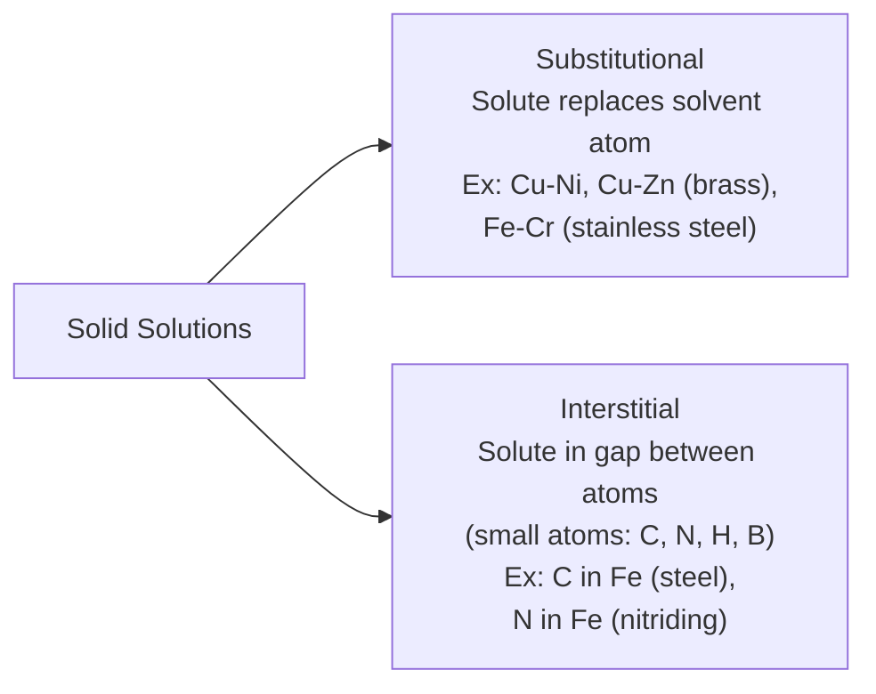
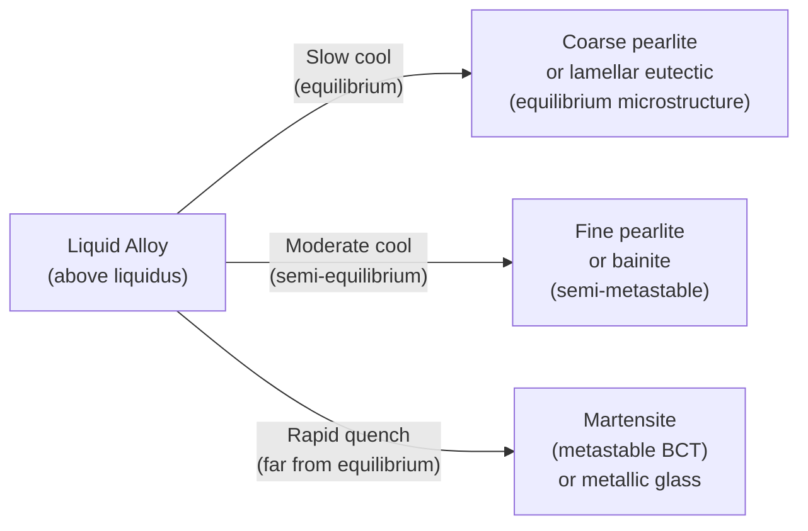
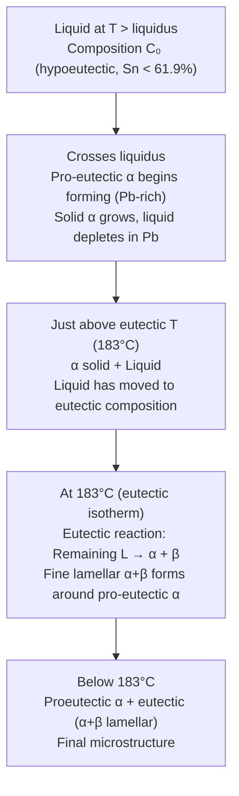
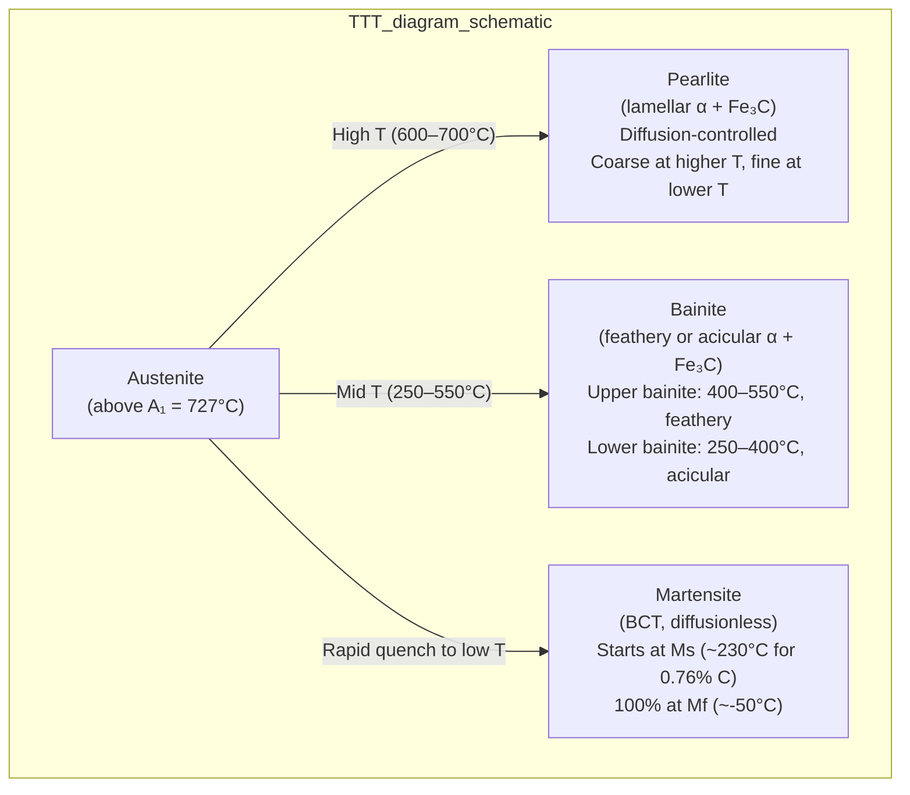

# Topic 6: Materials as Mixtures of Elements — Phase Diagrams and Phase Changes

> **Course:** IPE-101 — Industrial & Production Engineering
> **Institution:** Bangladesh University of Textiles (BUTEX)
> **Date:** June 4, 2026
> **References:** Callister & Rethwisch (10th ed.), Shackelford, Reed-Hill & Abbaschian, Gaskell

---

## Table of Contents

1. [Solutions and Mixtures](#1-solutions-and-mixtures)
2. [Thermodynamics of Mixing](#2-thermodynamics-of-mixing)
3. [Near and Far from Equilibrium](#3-near-and-far-from-equilibrium)
4. [Gibbs Phase Rule](#4-gibbs-phase-rule)
5. [Unary (One-Component) Phase Diagrams](#5-unary-one-component-phase-diagrams)
6. [Binary Isomorphous Systems (Complete Solid Solubility)](#6-binary-isomorphous-systems-complete-solid-solubility)
7. [The Lever Rule](#7-the-lever-rule)
8. [Binary Eutectic Systems (Limited Solid Solubility)](#8-binary-eutectic-systems-limited-solid-solubility)
9. [Other Invariant Reactions](#9-other-invariant-reactions)
10. [The Iron-Carbon (Fe-Fe₃C) Phase Diagram](#10-the-iron-carbon-fe-fe3c-phase-diagram)
11. [Phase Transformations — Kinetics](#11-phase-transformations--kinetics)
12. [TTT and CCT Diagrams](#12-ttt-and-cct-diagrams)
13. [Practice Problems](#13-practice-problems)
14. [References and Further Reading](#14-references-and-further-reading)

---

## 1. Solutions and Mixtures

### 1.1 Terminology

A **phase** is a homogeneous region of matter with uniform composition and physical state throughout, and with a distinct interface with any adjacent phase.

- Single-phase: pure metal, solid solution, single-component glass
- Two-phase: oil + water (immiscible), ice + water, α + β in a eutectic alloy

A **component** is a chemically independent constituent — typically an element or stoichiometric compound. In the Cu-Ni system, there are 2 components (Cu, Ni). In the Fe-C system, components are Fe and C (or Fe and Fe₃C).

### 1.2 Types of Solid Solutions

When a solute atom dissolves into a solvent crystal lattice, a **solid solution** forms — a single-phase mixture.

**Substitutional solid solution:** Solute atoms replace solvent atoms on lattice sites.

Hume-Rothery rules for extensive substitutional solubility:
1. **Atomic size:** Radii must differ by < 15%
2. **Crystal structure:** Same structure
3. **Electronegativity:** Similar (< 0.4 difference)
4. **Valence:** Equal or solute has higher valence

**Interstitial solid solution:** Solute atoms (must be small) occupy interstitial sites between solvent atoms.
- Carbon in iron: $r_C = 0.077$ nm; $r_{Fe} = 0.124$ nm ($r_C/r_{Fe} = 0.62$)
- Maximum solubility in FCC γ-Fe (austenite): 2.14 wt% C
- Maximum solubility in BCC α-Fe (ferrite): 0.022 wt% C (BCC has smaller interstitial holes)

### 1.3 Effect of Solute on Properties

- **Solid solution hardening/strengthening:** Lattice strain around solute atoms impedes dislocation motion → ↑ yield strength, ↑ hardness, ↓ ductility
- Conductivity ↓ (electron scattering by solute atoms)
- Melting point may ↑ or ↓ depending on system

---

## 2. Thermodynamics of Mixing

### 2.1 Gibbs Free Energy

For a process to be spontaneous (at constant T, P):

$$\boxed{\Delta G_{mix} = \Delta H_{mix} - T\Delta S_{mix} < 0}$$

where:
- $\Delta G_{mix}$ = Gibbs free energy of mixing
- $\Delta H_{mix}$ = enthalpy of mixing (heat effects)
- $\Delta S_{mix}$ = entropy of mixing

### 2.2 Ideal Solution — Entropy of Mixing

For an **ideal solution** (solute-solute, solvent-solvent, and solvent-solute interactions all equal): $\Delta H_{mix} = 0$.

The **configurational (mixing) entropy** for two components A and B:

$$\Delta S_{mix} = -R\left[x_A \ln x_A + x_B \ln x_B\right]$$

where $x_A$, $x_B$ = mole fractions ($x_A + x_B = 1$), $R$ = 8.314 J/(mol·K).

$\Delta S_{mix}$ is always **positive** (more disorder → more configurations) → $\Delta G_{mix}$ is always negative for ideal solutions → all compositions are miscible.

Maximum $\Delta S_{mix}$ at $x_A = x_B = 0.5$: $\Delta S_{mix,max} = R\ln 2 = 5.76$ J/(mol·K)

### 2.3 Regular Solution — Non-Ideal Behavior

$$\Delta H_{mix} = \Omega \cdot x_A x_B$$

where $\Omega$ = interaction parameter (J/mol):
- $\Omega < 0$: A-B bonds stronger than A-A and B-B → ordering, complete miscibility
- $\Omega > 0$: A-A and B-B bonds preferred → immiscibility gap / spinodal decomposition if large enough
- $\Omega = 0$: Ideal solution

$$\Delta G_{mix} = \Omega x_A x_B + RT(x_A \ln x_A + x_B \ln x_B)$$

**Miscibility gap:** When $\Omega > 2RT$, $\Delta G_{mix}$ develops a double-well shape → two coexisting solid solutions (immiscible).

### 2.4 Chemical Potential and Equilibrium

At thermodynamic equilibrium between two phases $\alpha$ and $\beta$:

$$\mu_i^\alpha = \mu_i^\beta \quad \text{for each component } i$$

where $\mu_i = \partial G/\partial n_i$ = chemical potential of component $i$.

This condition determines **tie-line endpoints** on phase diagrams.

---

## 3. Near and Far from Equilibrium

### 3.1 Thermodynamic vs. Kinetic Control

**Near equilibrium:** Slow cooling → sufficient time for atom diffusion → phases predicted by the phase diagram form. The system minimizes Gibbs free energy.

**Far from equilibrium:** Rapid cooling (quenching) → insufficient time for diffusion → metastable phases form that are NOT on the equilibrium phase diagram:

| Process | Cooling rate | Microstructure |
|---|---|---|
| Slow furnace cool | ~1–10°C/min | Coarse pearlite (equilibrium) |
| Air cool (normalizing) | ~100°C/min | Fine pearlite |
| Oil quench | ~1000°C/s | Bainite or martensite (metastable!) |
| Water quench | ~3000°C/s | Martensite (extremely metastable) |
| Melt spinning | $10^5$–$10^6$ °C/s | **Metallic glass** (amorphous, completely non-equilibrium) |

### 3.2 Metastable States

Examples of metastable materials formed far from equilibrium:
- **Martensite** in steel (body-centered tetragonal, BCT — distorted BCC; trapped C atoms)
- **Metallic glasses** (amorphous metals: Vitreloy, Fe-based, Zr-based)
- **Supersaturated solid solutions** (before precipitation hardening)
- **Diamond** at atmospheric pressure (stable phase is graphite, but kinetics are impossibly slow)

---

## 4. Gibbs Phase Rule

### 4.1 Derivation

The Gibbs phase rule relates the number of **degrees of freedom** $F$ (independent intensive variables) to the number of **components** $C$ and **phases** $P$ present at equilibrium:

$$\boxed{F = C - P + 2}$$

The "+2" accounts for **temperature** and **pressure** as variables.

**For condensed systems** (solids/liquids, pressure fixed at 1 atm):
$$F = C - P + 1$$

### 4.2 Deriving the Phase Rule

In a system with $C$ components and $P$ phases:
- Variables: $T$, $P$, and $(C-1)$ mole fractions per phase = $2 + P(C-1)$ total
- Equilibrium constraints: $\mu_i^\alpha = \mu_i^\beta = \ldots$ for each of $C$ components across $P-1$ phase interfaces = $C(P-1)$
- Degrees of freedom = Variables − Constraints:
$$F = 2 + P(C-1) - C(P-1) = 2 + PC - P - CP + C = C - P + 2 \quad \checkmark$$

### 4.3 Phase Rule Examples

| System | $C$ | $P$ | $F$ | Meaning |
|---|---|---|---|---|
| Pure water (liquid only) | 1 | 1 | 2 | Can vary T and P freely |
| Water at boiling point | 1 | 2 (liq + vap) | 1 | Fix T → P fixed, or vice versa |
| Water triple point | 1 | 3 | 0 | **Invariant** — unique T and P |
| Cu-Ni alloy (liquid) | 2 | 1 | 2 | Bivariant |
| Cu-Ni in two-phase (L+S) region | 2 | 2 | 1 | Fix T → compositions determined |
| Cu-Ni at eutectic (if it had one) | 2 | 3 | 0 | Invariant, fixed T and compositions |
| Fe-C at eutectoid | 2 | 3 | 0 | 727°C, 0.76% C, **invariant** |

**Key conclusions:**
- An **invariant point** ($F = 0$) represents a unique fixed temperature and composition
- In a **two-phase region**, fixing temperature determines both phase compositions (one degree of freedom)
- Three phases can coexist in a binary system only at a **single temperature** (invariant)

---

## 5. Unary (One-Component) Phase Diagrams

### 5.1 P-T Diagram

For a pure substance, the phase diagram is a plot of pressure vs. temperature:

*Fig 5.1: P-T phase diagram of water, showing triple point (0.006 atm, 0.01°C) and critical point. Source: Wikimedia Commons*

Key features:
- **Solid-liquid boundary** (melting curve)
- **Liquid-vapor boundary** (vapor pressure curve; ends at critical point)
- **Solid-vapor boundary** (sublimation curve)
- **Triple point:** All three phases coexist ($F = 0$)
- **Critical point:** Liquid-vapor distinction disappears above this T and P

### 5.2 Iron's Allotropic Transformations (Unary)

Iron has multiple crystal structures (allotropes) as temperature changes at 1 atm:

$$\underbrace{\alpha\text{-Fe (BCC)}}_{\text{ferrite}\, <\,912°C} \xrightarrow{912°C} \underbrace{\gamma\text{-Fe (FCC)}}_{\text{austenite}\, 912\text{–}1394°C} \xrightarrow{1394°C} \underbrace{\delta\text{-Fe (BCC)}}_{\delta\text{-ferrite}\, 1394\text{–}1538°C} \xrightarrow{1538°C} \text{Liquid}$$

(Note: β-Fe was a historical name for α-Fe above its Curie point at 770°C — there is no structural change, just magnetic transition from ferromagnetic to paramagnetic.)

---

## 6. Binary Isomorphous Systems (Complete Solid Solubility)

### 6.1 Cu-Ni System

Cu and Ni are completely miscible in both liquid and solid states (they satisfy all Hume-Rothery rules: similar radii, same FCC structure, similar electronegativities, both +2/+1 valences).

The Cu-Ni phase diagram has:
- A **liquidus** line: above which the alloy is completely liquid
- A **solidus** line: below which the alloy is completely solid
- A **two-phase (L + S) region** between them

*Fig 6.1: Cu-Ni binary isomorphous phase diagram. Source: Wikimedia Commons*

### 6.2 Reading the Phase Diagram

**At a given temperature and overall composition (point on diagram):**

1. **Single-phase region:** The composition of the phase = overall composition
2. **Two-phase (L+S) region:**
   - Draw a **tie line** (horizontal line at constant T)
   - Left endpoint → liquidus → **composition of liquid phase** $C_L$
   - Right endpoint → solidus → **composition of solid phase** $C_S$
   - The amounts of each phase are given by the **lever rule** (Section 7)

### 6.3 Coring (Non-Equilibrium Solidification)

If cooling is too fast for solid-state diffusion to re-equilibrate:

- **First solid** to form is richer in the high-melting component (Ni in Cu-Ni)
- As temperature falls, later solid is richer in low-melting component (Cu)
- Result: **composition gradient** within each grain (center ≠ rim) → **cored microstructure**

**Homogenization anneal:** Long anneal at high temperature (below solidus) allows diffusion to eliminate coring. Fick's second law governs:
$$\frac{\partial C}{\partial t} = D\frac{\partial^2 C}{\partial x^2}$$

---

## 7. The Lever Rule

### 7.1 Derivation

In a two-phase region, the **fraction of each phase** at a given overall composition $C_0$ and temperature can be found from a **mass balance**:

Total moles: $n = n_\alpha + n_\beta$
Conservation of component B: $n \cdot C_0 = n_\alpha C_\alpha + n_\beta C_\beta$

Solving (with $f_\alpha + f_\beta = 1$, $f = n/n_{total}$):

$$\boxed{f_\alpha = \frac{C_\beta - C_0}{C_\beta - C_\alpha}, \qquad f_\beta = \frac{C_0 - C_\alpha}{C_\beta - C_\alpha}}$$

where $C_\alpha$ and $C_\beta$ are the compositions of the $\alpha$ and $\beta$ phases at that temperature (tie-line endpoints).

**Mnemonic:** Phase $\alpha$'s fraction = the lever arm on the **opposite** side ($\beta$-side distance / total tie-line length). Like a see-saw (lever): the phase at one end has the weight proportional to the distance from the fulcrum to the other end.

### 7.2 Worked Example

> Cu-Ni alloy, overall $C_0 = 35$ wt% Ni, at 1300°C. From the phase diagram: $C_L = 31.5$ wt% Ni, $C_S = 42.5$ wt% Ni. Find the weight fractions of liquid and solid.

$$f_L = \frac{C_S - C_0}{C_S - C_L} = \frac{42.5 - 35}{42.5 - 31.5} = \frac{7.5}{11.0} = 0.682 \quad (68.2\%)$$

$$f_S = \frac{C_0 - C_L}{C_S - C_L} = \frac{35 - 31.5}{11.0} = \frac{3.5}{11.0} = 0.318 \quad (31.8\%)$$

Check: $f_L + f_S = 0.682 + 0.318 = 1.000$ ✓

$$\text{Ni check: } 0.682 \times 31.5 + 0.318 \times 42.5 = 21.5 + 13.5 = 35.0 \text{ wt\%} \checkmark$$

---

## 8. Binary Eutectic Systems (Limited Solid Solubility)

### 8.1 Eutectic Phase Diagram

When two components have **limited mutual solid solubility** and no intermetallic compounds, the system often forms a **eutectic** (from Greek: "easy melting").

Classic example: **Pb-Sn** solder system.

*Fig 8.1: Pb-Sn binary eutectic phase diagram. Source: Wikimedia Commons*

Key regions:
- $\alpha$ phase: Sn dissolved in Pb (Pb-rich solid)
- $\beta$ phase: Pb dissolved in Sn (Sn-rich solid)
- Liquid region
- Two-phase: $\alpha + L$, $\beta + L$, $\alpha + \beta$
- **Eutectic point E:** 61.9 wt% Sn, 183°C (lowest melting point of any composition)

### 8.2 The Eutectic Reaction

At the eutectic point, upon cooling, the liquid simultaneously solidifies into **two solid phases**:

$$\boxed{L \underset{\text{cooling}}{\overset{\text{heating}}{\rightleftharpoons}} \alpha + \beta}$$

- **Invariant** ($F = 0$): occurs at fixed T and fixed compositions of L, $\alpha$, $\beta$
- Produces a **lamellar (alternating plate) microstructure** of $\alpha$ and $\beta$ — eutectic microstructure

### 8.3 Eutectic Microstructures by Composition

| Composition range | Microstructure at room temperature |
|---|---|
| < $C_{\alpha,max}$ (hypoeutectic, nearly pure Pb-side) | $\alpha$ solid solution only |
| $C_{\alpha,max}$ to $C_E$ (hypoeutectic) | **Proeutectic** $\alpha$ + eutectic ($\alpha+\beta$) |
| $C_E = 61.9$ wt% Sn (exactly eutectic) | **All eutectic** $\alpha+\beta$ (lamellar) |
| $C_E$ to $C_{\beta,max}$ (hypereutectic) | **Proeutectic** $\beta$ + eutectic ($\alpha+\beta$) |
| > $C_{\beta,max}$ | $\beta$ solid solution only |

**Amount of eutectic** in a hypoeutectic alloy:

Using lever rule at the eutectic temperature:
$$f_{eutectic} = \frac{C_0 - C_\alpha}{C_E - C_\alpha}$$

### 8.4 Microstructure Development in a Hypoeutectic Alloy

---

## 9. Other Invariant Reactions

In addition to the eutectic reaction, several other three-phase invariant reactions appear in binary phase diagrams:

| Reaction name | Reaction formula | Description |
|---|---|---|
| **Eutectic** | $L \rightleftharpoons \alpha + \beta$ | One liquid → two solids |
| **Eutectoid** | $\gamma \rightleftharpoons \alpha + \beta$ | One solid → two solids |
| **Peritectic** | $L + \alpha \rightleftharpoons \beta$ | Liquid + solid → different solid |
| **Peritectoid** | $\alpha + \beta \rightleftharpoons \gamma$ | Two solids → third solid |
| **Monotectic** | $L_1 \rightleftharpoons L_2 + \alpha$ | One liquid → two liquids + solid |

The **eutectoid** is particularly important in steels (Fe-C system): $\gamma \text{ (austenite)} \rightarrow \alpha \text{ (ferrite)} + \text{Fe}_3\text{C (cementite)}$

---

## 10. The Iron-Carbon (Fe-Fe₃C) Phase Diagram

### 10.1 Why Fe-C?

Steel and cast iron (Fe-C alloys) are by far the most important structural materials. The Fe-C phase diagram is the Rosetta Stone of metallurgy.

The stable system is **Fe-graphite** (carbon), but the metastable system **Fe-Fe₃C** (iron-cementite) governs almost all practical steels — because cementite (Fe₃C) is metastable on human time scales.

*Fig 10.1: Fe-Fe₃C metastable phase diagram. Source: Wikimedia Commons*

### 10.2 Phases in the Fe-C System

| Phase | Crystal Structure | C content | Properties |
|---|---|---|---|
| **δ-ferrite** | BCC | up to 0.09 wt% C | High T only (1394–1538°C) |
| **γ-austenite** | FCC | up to 2.14 wt% C | Stable 912–1394°C; paramagnetic |
| **α-ferrite** | BCC | up to 0.022 wt% C | Stable below 912°C; soft, ductile; ferromagnetic below 770°C |
| **Cementite (Fe₃C)** | Orthorhombic | 6.70 wt% C | Very hard (Vickers: ~1000), brittle |
| **Ledeburite** | Mixture | ~4.3 wt% C | Eutectic of austenite + cementite; in cast iron |
| **Pearlite** | Lamellar | ~0.76 wt% C | Eutectoid of ferrite + cementite; in steels |
| **Martensite** | BCT (metastable) | Varies | Formed by quenching; very hard |

### 10.3 Critical Points and Reactions

#### Eutectic Reaction (Ledeburite) — 1147°C, 4.30 wt% C:
$$L \xrightarrow{1147°C} \gamma\text{(austenite)} + \text{Fe}_3\text{C}\text{(cementite)} \quad [F=0]$$

#### Eutectoid Reaction (Pearlite) — 727°C, 0.76 wt% C:
$$\gamma\text{(0.76 wt\% C)} \xrightarrow{727°C} \alpha\text{(0.022 wt\% C)} + \text{Fe}_3\text{C (6.70 wt\% C)} \quad [F=0]$$

#### Peritectic Reaction — 1493°C, 0.16 wt% C:
$$\delta\text{(0.09 wt\% C)} + L\text{(0.53 wt\% C)} \xrightarrow{1493°C} \gamma\text{(0.17 wt\% C)}$$

### 10.4 Classification of Fe-C Alloys

| Classification | C content | Dominant microstructure |
|---|---|---|
| Pure iron | < 0.008 wt% C | Ferrite only |
| Hypoeutectoid steel | 0.008–0.76 wt% C | Proeutectoid ferrite + pearlite |
| Eutectoid steel | exactly 0.76 wt% C | 100% pearlite |
| Hypereutectoid steel | 0.76–2.14 wt% C | Pearlite + proeutectoid cementite (network at GBs) |
| Hypoeutectic cast iron | 2.14–4.30 wt% C | Austenite (→pearlite) + ledeburite |
| Eutectic cast iron | 4.30 wt% C | Ledeburite |
| Hypereutectic cast iron | 4.30–6.70 wt% C | Primary cementite + ledeburite |

**Practical steels:** 0.1–1.5 wt% C (rarely > 1.0% in engineering use)
**Cast irons:** 2.5–4.0 wt% C (plus 1–3% Si)

### 10.5 Microstructure Development in Steels

#### Eutectoid Steel (0.76 wt% C) — Cooling from Austenite:

$$\gamma\text{(0.76\% C)} \xrightarrow{727°C} \alpha\text{(0.022\% C)} + \text{Fe}_3\text{C (6.70\% C)}$$

Produces **100% pearlite** — alternating lamellae of ferrite and cementite.

**Fraction of Fe₃C in pearlite (lever rule at 727°C):**
$$f_{Fe_3C} = \frac{0.76 - 0.022}{6.70 - 0.022} = \frac{0.738}{6.678} = 11.1\%$$

(~88.9% ferrite and ~11.1% cementite in pearlite)

#### Hypoeutectoid Steel (e.g., 0.40 wt% C):

As austenite cools below ~800°C:
1. **Proeutectoid ferrite** nucleates at grain boundaries (C-poor, BCC)
2. As ferrite grows, remaining austenite enriches in carbon
3. At 727°C, remaining austenite (now at 0.76% C) → pearlite

**Amount of proeutectoid ferrite** (lever rule just above 727°C):
$$f_{\alpha,pro} = \frac{0.76 - 0.40}{0.76 - 0.022} = \frac{0.36}{0.738} = 0.488 \quad (48.8\%)$$

**Amount of pearlite:**
$$f_{pearlite} = 1 - 0.488 = 0.512 \quad (51.2\%)$$

#### Hypereutectoid Steel (e.g., 1.0 wt% C):

As austenite cools below ~900°C:
1. **Proeutectoid cementite** (Fe₃C) precipitates at grain boundaries → forms network
2. At 727°C, remaining austenite (0.76% C) → pearlite

**Microstructure:** Pearlite colonies surrounded by cementite network — **embrittling** (why hypereutectoid steels are rarely used above ~1.0% C)

### 10.6 Pearlite Spacing

Pearlite interlamellar spacing $\lambda$ decreases with increasing undercooling $\Delta T$ below 727°C:
$$\lambda \propto \frac{1}{\Delta T}$$

- Coarse pearlite (small ΔT, slow cool): large spacing, soft, low strength
- Fine pearlite (large ΔT, faster cool): small spacing, higher strength

---

## 11. Phase Transformations — Kinetics

### 11.1 Nucleation

Most phase transformations involve nucleation followed by growth. Two types:

**Homogeneous nucleation:** Random clustering of atoms — requires large undercooling.

The free energy change for nucleation of a spherical nucleus of radius $r$:
$$\Delta G = -\frac{4}{3}\pi r^3 \Delta G_v + 4\pi r^2 \gamma$$

where $\Delta G_v$ = volume free energy change (negative, driving force), $\gamma$ = solid-liquid interfacial energy.

**Critical nucleus radius** (set $d(\Delta G)/dr = 0$):
$$r^* = -\frac{2\gamma}{\Delta G_v} = \frac{2\gamma T_m}{L_f \Delta T}$$

**Activation energy barrier:**
$$\Delta G^* = \frac{16\pi\gamma^3}{3(\Delta G_v)^2}$$

The nucleation rate $I \propto \exp(-\Delta G^*/kT)$ — increases rapidly with undercooling (ΔT below $T_m$).

**Heterogeneous nucleation:** On pre-existing surfaces (mould walls, inclusions, grain boundaries) — much lower activation energy barrier because the solid-liquid interface is partially replaced by a solid-mould interface.

$$\Delta G^*_{het} = \Delta G^*_{hom} \cdot f(\theta)$$

where $f(\theta) = \frac{(2+\cos\theta)(1-\cos\theta)^2}{4} < 1$ for any contact angle $\theta < 180°$.

In practice, almost all industrial solidification involves heterogeneous nucleation — grain refiners (TiB₂, TiC in Al; FeSi in steel) are added to promote it and produce fine equiaxed grains.

### 11.2 Growth

Once nucleated, the new phase grows by:
- **Diffusion-controlled growth** (slow; composition change required): pearlite, bainite
- **Diffusionless (displacive) transformation** (very fast; no composition change): martensite

### 11.3 Avrami Equation — Overall Transformation Kinetics

The overall fraction $f$ of material transformed as a function of time $t$ at constant temperature:

$$\boxed{f(t) = 1 - \exp(-kt^n)}$$

where $k$ = rate constant (Arrhenius temperature dependent), $n$ = Avrami exponent (reflects nucleation/growth mode):

| $n$ | Nucleation mode | Growth |
|---|---|---|
| 0.5 | Diffusion-limited, pre-existing nuclei | Spherical |
| 1.0 | Constant nucleation rate | Rod/fiber |
| 2.0 | Constant nucleation rate | Disk |
| 3.0 | Constant nucleation rate | Sphere (3D) |
| 4.0 | Increasing nucleation rate | 3D |

Taking double logarithm: $\ln[-\ln(1-f)] = \ln k + n \ln t$ → straight line on a log-log plot.

**Worked Example:**

> Pearlite transformation: $k = 1.2 \times 10^{-4}$ s$^{-n}$, $n = 3$. Find time for 50% transformation.
>
> $$0.5 = 1 - \exp(-1.2 \times 10^{-4} \cdot t^3)$$
> $$\exp(-1.2 \times 10^{-4} t^3) = 0.5$$
> $$-1.2 \times 10^{-4} t^3 = \ln(0.5) = -0.6931$$
> $$t^3 = \frac{0.6931}{1.2 \times 10^{-4}} = 5776 \text{ s}^3$$
> $$t = 5776^{1/3} = \mathbf{17.95 \text{ s}}$$

---

## 12. TTT and CCT Diagrams

### 12.1 TTT Diagrams (Time-Temperature-Transformation / Isothermal Transformation)

A TTT diagram shows the **start** and **finish** of phase transformation as a function of **time** (log scale) and **temperature**, for isothermal holding after austenitizing.

**Key temperatures for eutectoid steel (0.76% C):**
- $A_1$ = 727°C (eutectoid temperature, below which austenite is unstable)
- $A_3$ = 912°C (for pure Fe; in alloy steels: upper limit of austenite + ferrite two-phase region)
- $M_s \approx 230°C$ (martensite start temperature for 0.76% C steel)
- $M_f \approx -50°C$ (martensite finish temperature — austenite may be **retained** if quenched to above $M_f$)

**"C-curve" (or "knee") shape:** At intermediate temperatures, nucleation is fast BUT diffusion is slow → minimum transformation time (fastest transformation) at ~550°C. Above: diffusion fast but driving force low. Below: driving force high but diffusion slow.

### 12.2 Products and Their Properties

| Product | Formation T | Morphology | Hardness (HRC) | Toughness |
|---|---|---|---|---|
| Coarse pearlite | 650–700°C | Coarse lamellae | 15–25 | Good |
| Fine pearlite | 580–650°C | Fine lamellae | 30–40 | Moderate |
| Upper bainite | 400–550°C | Feathery, ferrite with carbide clusters | 35–45 | Poor |
| Lower bainite | 250–400°C | Acicular, fine dispersed carbides | 45–55 | Good |
| Martensite | $< M_s$ | Lenticular (plate) or lath, BCT | 60–67 | Very poor (as-quenched) |
| Tempered martensite | After tempering | Fine carbide particles in ferrite | 50–58 | **Excellent** |

### 12.3 Martensite

Martensite forms by a **diffusionless, shear (displacive) transformation** when austenite is quenched below $M_s$ — no atom diffusion, entire lattice shears:

$$\gamma\text{-Fe (FCC, 0.76\% C)} \xrightarrow{\text{quench}} \alpha'\text{-martensite (BCT)}$$

The carbon atoms that were in the FCC octahedral interstitial sites become **trapped** in the BCT lattice, causing:
- Lattice strain and tetragonality (c/a > 1, increasing with C content)
- **Extreme hardness** (up to HRC 67) — highest of any microstructure in steel
- **Brittleness** as-quenched — must be **tempered** to restore toughness

**Tetragonality:**
$$c/a = 1 + 0.046 \times (\text{wt\% C})$$

For 0.76% C: $c/a = 1 + 0.046 \times 0.76 = 1.035$

**$M_s$ temperature** (Andrews empirical equation):
$$M_s(°C) = 539 - 423(\% C) - 30.4(\% Mn) - 17.7(\% Ni) - 12.1(\% Cr) - 7.5(\% Mo)$$

For 0.76% C, plain carbon steel: $M_s = 539 - 423 \times 0.76 = 539 - 321 = 218°C$

### 12.4 Tempering of Martensite

As-quenched martensite is too brittle for most applications. **Tempering** (reheating to 150–700°C) allows carbon diffusion and carbide precipitation, improving toughness:

| Tempering T | Change | Hardness |
|---|---|---|
| 100–200°C | $\varepsilon$-carbide precipitation, lattice strain relief | ↓ slightly |
| 200–350°C | Retained austenite → bainite, more carbide | ↓ gradually |
| 350–500°C | Cementite replaces $\varepsilon$-carbide, recovery of ferrite | ↓ |
| 500–700°C | Coarsening of carbides, recrystallization of ferrite | ↓↓ ; toughness ↑↑ |

**Tempered martensite** = fine cementite particles in a ferrite matrix — optimal balance of strength and toughness.

**Temper embrittlement:** Quench-and-temper steels tempered in 250–400°C range (or slow-cooled through it) can show intergranular embrittlement due to P, Sb, Sn, As segregation to prior austenite grain boundaries.

### 12.5 CCT Diagrams (Continuous Cooling Transformation)

In practice, cooling is continuous (not isothermal). **CCT diagrams** show transformation during continuous cooling:

- C-curves shift to **longer times** and **lower temperatures** compared to TTT
- Cooling rate curves are overlaid on the diagram
- **Critical cooling rate** = minimum rate to miss the pearlite/bainite nose and form 100% martensite (essential for through-hardening)

*Fig 12.1: Schematic CCT diagram for plain carbon eutectoid steel. Source: Wikimedia Commons*

**Hardenability:** Ability to form martensite throughout the cross-section. Increased by alloying elements (Cr, Mo, Ni, Mn) that shift C-curves to longer times. Measured by **Jominy end-quench test**.

### 12.6 Industrial Heat Treatment Summary

| Process | Description | Purpose |
|---|---|---|
| **Annealing** | Heat above $A_3$ or $A_1$, slow furnace cool | Soften, relieve stress, improve machinability |
| **Normalizing** | Heat above $A_3$, air cool | Refine grain, uniform microstructure |
| **Quenching** | Austenitize → rapid quench (water, oil) | Form martensite, maximize hardness |
| **Tempering** | Reheat quenched steel to 150–700°C | Restore toughness, relieve quench stresses |
| **Austempering** | Quench to bainite temperature, hold isothermally | Form bainite without quench cracking |
| **Martempering** | Quench to just above $M_s$, hold, then air cool | Minimize distortion, uniform martensite |
| **Carburizing** | Gas/pack C at 850–950°C | Case hardening (hard surface, tough core) |
| **Nitriding** | NH₃ atmosphere at 500–550°C | Very hard case, excellent fatigue resistance |

---

## 13. Practice Problems

Problem 1 — Gibbs Phase Rule

**Q:** An alloy of A and B is in a two-phase (α + L) region at 1 atm. How many degrees of freedom does the system have? What does this mean?

**Solution:**

$C = 2$ (two components: A, B), $P = 2$ (two phases: solid + liquid), condensed system (fixed pressure):

$$F = C - P + 1 = 2 - 2 + 1 = 1$$

**Interpretation:** One degree of freedom. If you specify the **temperature**, the compositions of both the liquid and solid phases are **uniquely determined** (you read them from the tie-line endpoints). You cannot independently vary T and composition simultaneously while staying in the two-phase region.

Problem 2 — Lever Rule (Cu-Ni)

**Q:** A Cu-Ni alloy of 60 wt% Ni is cooled to 1350°C. The phase diagram gives: liquidus at 60 wt% Ni → alloy is in the two-phase region. At 1350°C, $C_L = 45$ wt% Ni, $C_S = 58$ wt% Ni. The overall composition is 52 wt% Ni. Find $f_L$ and $f_S$.

**Solution:**

$$f_S = \frac{C_0 - C_L}{C_S - C_L} = \frac{52 - 45}{58 - 45} = \frac{7}{13} = 0.538$$

$$f_L = \frac{C_S - C_0}{C_S - C_L} = \frac{58 - 52}{13} = \frac{6}{13} = 0.462$$

53.8 wt% solid, 46.2 wt% liquid.

Problem 3 — Fe-C Microstructure Fractions

**Q:** A hypoeutectoid steel contains 0.30 wt% C. After slow cooling below 727°C, find: (a) fraction of proeutectoid ferrite, (b) fraction of pearlite, (c) fraction of cementite in the pearlite, (d) overall fraction of cementite.

**Solution:**

**At 727°C:** $C_\alpha = 0.022$ wt% C, $C_\gamma = 0.76$ wt% C (eutectoid), $C_{Fe_3C} = 6.70$ wt% C.

(a) Fraction of proeutectoid ferrite (lever rule just above 727°C, in $\alpha + \gamma$ region):
$$f_{\alpha,pro} = \frac{0.76 - 0.30}{0.76 - 0.022} = \frac{0.46}{0.738} = 0.623 \quad (62.3\%)$$

(b) Fraction of pearlite (= fraction of austenite that transforms):
$$f_{pearlite} = 1 - 0.623 = 0.377 \quad (37.7\%)$$

(c) Fraction of cementite **within** pearlite (lever rule at 727°C):
$$f_{Fe_3C/pearlite} = \frac{0.76 - 0.022}{6.70 - 0.022} = \frac{0.738}{6.678} = 0.111 \quad (11.1\%)$$

(d) Overall fraction of cementite:
$$f_{Fe_3C,total} = f_{pearlite} \times f_{Fe_3C/pearlite} = 0.377 \times 0.111 = 0.0418 \quad (4.18\%)$$

Check: $0.623 \times 0.022 + 0.0418 \times 6.70 + (0.377 - 0.0418) \times 0.022$
$\approx 0.0137 + 0.280 + 0.0074 \approx 0.301 \approx 0.30\%$ C ✓

Problem 4 — Avrami Kinetics

**Q:** Recrystallization of cold-worked copper at 120°C follows Avrami kinetics with $n = 2.0$, $k = 2.0 \times 10^{-3}$ min$^{-2}$. Find: (a) time for 50% recrystallization, (b) time for 95% recrystallization.

**Solution:**

From $f = 1 - \exp(-kt^n)$, solving for $t$:
$$t = \left[\frac{-\ln(1-f)}{k}\right]^{1/n}$$

(a) $f = 0.50$:
$$t = \left[\frac{-\ln(0.50)}{2.0 \times 10^{-3}}\right]^{1/2} = \left[\frac{0.6931}{2.0 \times 10^{-3}}\right]^{0.5} = [346.6]^{0.5} = \mathbf{18.6 \text{ min}}$$

(b) $f = 0.95$:
$$t = \left[\frac{-\ln(0.05)}{2.0 \times 10^{-3}}\right]^{0.5} = \left[\frac{2.996}{2.0 \times 10^{-3}}\right]^{0.5} = [1498]^{0.5} = \mathbf{38.7 \text{ min}}$$

Problem 5 — Martensite Start Temperature

**Q:** Find $M_s$ for a steel with 0.40% C, 0.80% Mn, 1.50% Ni, 1.00% Cr, 0.20% Mo. Would you expect retained austenite after quenching to room temperature (25°C)?

**Solution:**

Using Andrews equation:
$$M_s = 539 - 423(0.40) - 30.4(0.80) - 17.7(1.50) - 12.1(1.00) - 7.5(0.20)$$
$$= 539 - 169.2 - 24.3 - 26.6 - 12.1 - 1.5 = \mathbf{305°C}$$

Approximate $M_f \approx M_s - 200°C = 105°C$.

Since $M_f = 105°C > 25°C$ (room temperature), quenching to room temperature does **not** complete the transformation → some **retained austenite** will be present.

To obtain 100% martensite, a cryogenic treatment (sub-zero quench to below $M_f$) would be needed.

---

## 14. References and Further Reading

1. Callister, W.D. & Rethwisch, D.G. — *Materials Science and Engineering: An Introduction*, 10th ed., Wiley (2018)
2. Shackelford, J.F. — *Introduction to Materials Science for Engineers*, 8th ed., Pearson (2015)
3. Reed-Hill, R.E. & Abbaschian, R. — *Physical Metallurgy Principles*, 3rd ed., PWS-Kent (1992)
4. Gaskell, D.R. & Laughlin, D.E. — *Introduction to the Thermodynamics of Materials*, 6th ed., CRC Press (2017)
5. Ashby, M.F. & Jones, D.R.H. — *Engineering Materials 2: Microstructure and Processing*, 4th ed., Butterworth-Heinemann (2012)
6. Porter, D.A., Easterling, K.E. & Sherif, M.Y. — *Phase Transformations in Metals and Alloys*, 3rd ed., CRC Press (2009)
7. Andrews, K.W. (1965) — "Empirical formulae for the calculation of some transformation temperatures," *J. Iron Steel Inst.*, 203, 721–727
8. Wikipedia — [Phase diagram](https://en.wikipedia.org/wiki/Phase_diagram)
9. Wikipedia — [Gibbs phase rule](https://en.wikipedia.org/wiki/Gibbs_phase_rule)
10. Wikipedia — [Iron-carbon phase diagram](https://en.wikipedia.org/wiki/Iron%E2%80%93carbon_phase_diagram)
11. Wikipedia — [Martensite](https://en.wikipedia.org/wiki/Martensite) | [Bainite](https://en.wikipedia.org/wiki/Bainite) | [Pearlite](https://en.wikipedia.org/wiki/Pearlite)
12. Wikipedia — [TTT diagram](https://en.wikipedia.org/wiki/Time%E2%80%93temperature%E2%80%93transformation_diagram)
13. Wikipedia — [Eutectic system](https://en.wikipedia.org/wiki/Eutectic_system)
14. Wikipedia — [Lever rule](https://en.wikipedia.org/wiki/Lever_rule)
15. DoITPoMS, University of Cambridge — [Phase diagrams and phase transformations](https://www.doitpoms.ac.uk/tlplib/phase-diagrams/index.php)
16. DoITPoMS, University of Cambridge — [Iron-Carbon phase diagram](https://www.doitpoms.ac.uk/tlplib/steel-microstructure/index.php)
17. MIT OpenCourseWare — [3.012 Fundamentals of Materials Science: Phase Diagrams](https://ocw.mit.edu/courses/3-012-fundamentals-of-materials-science-fall-2005/)
18. Wikimedia Commons — [Fe-C phase diagram SVG](https://commons.wikimedia.org/wiki/File:Iron_carbon_phase_diagram.svg)
19. Wikimedia Commons — [Pb-Sn phase diagram](https://commons.wikimedia.org/wiki/File:Pb-Sn_phase_diagram.png)
20. Wikimedia Commons — [CCT diagram steel](https://commons.wikimedia.org/wiki/File:Cct_diagram.svg)

---

*Last updated: June 4, 2026*
