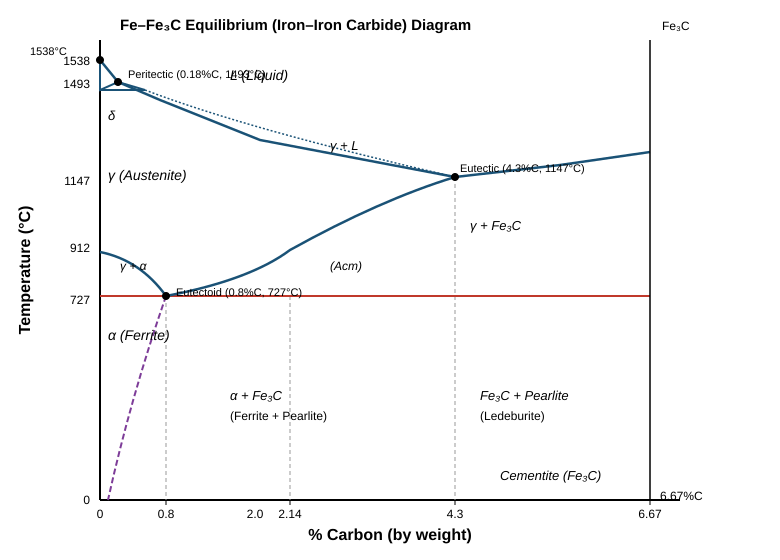
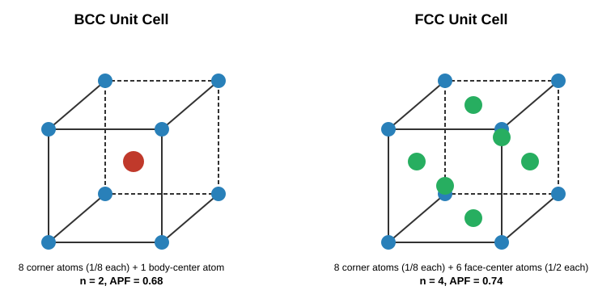
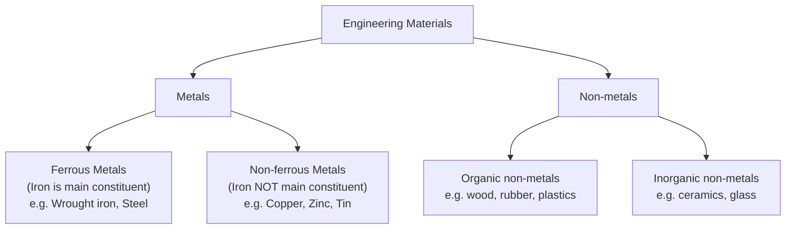
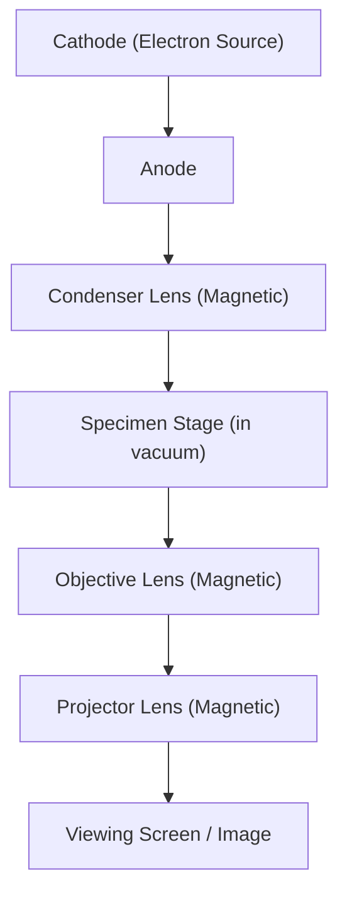

# IPE-101 — Engineering Materials
## First Class Test Practice Bank (with Full Model Answers)

*Built from and cross-checked against `IPE-101/quick_rev/materials_revision_notebook.md` (Chapters 1–3: Crystal Structure, Engineering Materials & Properties, Metallography). Marks distribution follows the class convention: **2 + 3 + 5 = 10**, 30 minutes.*

---

## 📄 Solved: Your Reference Test (FCT-2, 2025)

**B.Sc. in Textile Engineering, Level-1 Term-2 — First Class Test-2025**
**Subject: Engineering Materials (Code: IPE101) — Time: 30 min, Full Marks: 10**

### Q1 (2 marks) — Define "fatigue" and "creep"

**Fatigue** is the property that describes a material's ability to withstand **repeated (cyclic) loading**. A component can fail under fatigue even when the applied stress is well *below* the material's static strength, because each stress cycle initiates and slowly propagates a microscopic crack until sudden fracture occurs.

**Creep** is the **slow, continuous (time-dependent) deformation** of a material under a **steady, constant load**, typically significant at elevated temperature over long periods (e.g., turbine blades, boiler pipes).

> **Everyday analogy:** Fatigue is like a paperclip that snaps after being bent back-and-forth repeatedly. Creep is like a shelf that slowly sags over years under a constant, unchanging weight.

> ⚠️ **Frequently confused:** Fatigue = failure from *repeated* load cycles; Creep = deformation under a *constant* (steady) load over time. Neither requires the load to exceed the yield strength.

---

### Q2 (3 marks) — Define APF. Find the number of atoms per unit cell and the APF of the FCC structure

**Definition — Atomic Packing Factor (APF):**
The **fraction of the volume of a unit cell that is actually occupied by atoms**, assuming atoms are hard, touching spheres.

> **APF = [ n × (4/3)πr³ ] / a³**

where *n* = atoms per unit cell, *r* = atomic radius, *a* = unit cell edge length.

**Step 1 — Atoms per unit cell (FCC):**
FCC has atoms at all 8 corners and at the center of all 6 faces.

| Position | Count | Shared by | Contribution |
|---|---|---|---|
| Corner | 8 | 8 adjacent cells | 8 × 1/8 = 1 |
| Face center | 6 | 2 adjacent cells | 6 × 1/2 = 3 |

> **n = 1 + 3 = 4 atoms per unit cell**

**Step 2 — Relate r and a (atoms touch along the face diagonal in FCC):**

Face diagonal length = 4r, and by Pythagoras, face diagonal = √2·a

> **√2 · a = 4r  ⟹  r = √2a / 4**

**Step 3 — Substitute into the APF formula:**

> **APF = [4 × (4/3)π(√2a/4)³] / a³ = [4 × (4/3)π × (2√2/64)a³] / a³ = π√2 / 6**

> **APF (FCC) ≈ 0.74**

This is the **densest possible packing** of equal spheres (shared with HCP), which is why FCC metals (Al, Ni, Cu, Au, Ag) tend to be soft, ductile, and good conductors.

---

### Q3 (5 marks) — Draw the Fe–Fe₃C equilibrium diagram and label it properly

The **Iron–Iron Carbide (Fe–Fe₃C) equilibrium diagram** plots temperature (°C) against % Carbon (0 → 6.67%, the composition of cementite, Fe₃C) and shows every phase field, phase-boundary line, and invariant reaction relevant to plain-carbon steels and cast irons.

**Key phases:**

| Phase | Description |
|---|---|
| **δ-ferrite** | BCC iron, stable only just below the melting point (up to 1493°C) |
| **γ (Austenite)** | FCC iron, stable 727–1493°C; can dissolve up to 2.14% C |
| **α (Ferrite)** | BCC iron, stable below 912°C; dissolves very little C (max ≈ 0.02% at 727°C) |
| **Fe₃C (Cementite)** | Iron carbide, 6.67% C, hard and brittle intermetallic compound |
| **Pearlite** | Eutectoid mixture of alternating lamellae of ferrite + cementite |
| **Ledeburite** | Eutectic mixture of austenite + cementite |

**Three invariant reactions (must be labeled and remembered):**

| Reaction | Composition & Temp | Reaction equation |
|---|---|---|
| **Peritectic** | 0.18% C, 1493°C | L + δ → γ |
| **Eutectic** | 4.3% C, 1147°C | L → γ + Fe₃C (Ledeburite) |
| **Eutectoid** | 0.8% C, 727°C | γ → α + Fe₃C (Pearlite) |

**Critical lines:**

- **Liquidus** — separates liquid from liquid+solid regions
- **Solidus** — below which the alloy is fully solid
- **A₃ line** — γ → α transformation boundary (starts at 912°C for pure iron, falls to the eutectoid point)
- **A_cm line** — solubility limit of C in austenite (from the eutectoid point up to the eutectic point at 2.14–4.3% C)
- **A₁ line** — the horizontal eutectoid line at 727°C, present across the whole diagram

> 📝 **Exam tip:** Examiners specifically check that you (1) draw the axes with correct units, (2) mark and *label* all three invariant points with composition **and** temperature, (3) name every phase field, and (4) correctly distinguish steels (< 2.14% C) from cast irons (2.14–6.67% C) with a dashed line at 2.14% C.

---
---

# 🆕 New Practice Test — Set A: Bonding & Crystal Structure

**Time: 30 Minutes  Full Marks: 10**

1. Differentiate between ionic and covalent bonding. **(2)**
2. Define space lattice and unit cell. Derive the number of atoms per unit cell in a BCC structure. **(3)**
3. Draw the BCC and FCC unit cells. Derive the relationship between atomic radius (r) and edge length (a) for each, and state their APF values. **(5)**

## ✅ Model Answers — Set A

### A1 (2 marks) — Ionic vs Covalent bonding

| Feature | Ionic bond | Covalent bond |
|---|---|---|
| Mechanism | Electron **transfer** between atoms | Electron **sharing** between atoms |
| Ions formed? | Yes (cation + anion) | No |
| Force holding atoms | Electrostatic attraction between opposite charges | Mutual attraction of shared electron pair by both nuclei |
| Example | NaCl | CH₄ (methane), most gas molecules |

**One-line distinction:** ionic bonds *transfer* electrons and form ions; covalent bonds *share* electrons and form no ions.

### A2 (3 marks) — Space lattice, unit cell, BCC atom count

**Space lattice:** the three-dimensional network of imaginary points/lines connecting the atoms in a crystal, representing the periodic repetition of atomic positions in space.

**Unit cell:** the smallest repeating block of the space lattice that still possesses the full symmetry of the crystal — stacking unit cells in 3D reproduces the entire lattice, the way stacking identical bricks reproduces an entire wall.

**Atoms per unit cell in BCC:**
BCC has one atom at each of the 8 corners, and one atom at the exact body center.

- Each **corner** atom is shared by **8** adjacent unit cells → contributes 1/8
- The **body-center** atom is not shared by any other cell → contributes fully (1)

> **n (BCC) = (1/8 × 8) + (1 × 1) = 1 + 1 = 2 atoms**

### A3 (5 marks) — BCC & FCC: diagrams, r–a relation, APF

**BCC — atoms touch along the body diagonal:**

Body diagonal length = 4r, and for a cube, body diagonal = √3·a

> **√3 · a = 4r  ⟹  r = √3a / 4**

> **APF (BCC) = [2 × (4/3)π(√3a/4)³] / a³ = 0.68**

**FCC — atoms touch along the face diagonal:**

Face diagonal length = 4r, and face diagonal = √2·a

> **√2 · a = 4r  ⟹  r = √2a / 4**

> **APF (FCC) = [4 × (4/3)π(√2a/4)³] / a³ = 0.74**

| Property | BCC | FCC |
|---|---|---|
| Atoms/cell | 2 | 4 |
| Coordination number | 8 | 12 |
| r–a relation | r = √3a/4 | r = √2a/4 |
| APF | 0.68 | 0.74 (densest packing) |
| Examples | Cr, W, α-Fe, Mo, V, Na | Al, Ni, Cu, Au, Ag |
| Ductility | Lower | Higher |

---
---

# 🆕 New Practice Test — Set B: Mechanical, Physical & Thermal Properties

**Time: 30 Minutes  Full Marks: 10**

1. Define hardness and toughness. **(2)**
2. Differentiate ductility from malleability, with one real-life example each. **(3)**
3. Draw a classification chart of engineering materials, then describe **any four** mechanical properties in detail (definition + real-life analogy each). **(5)**

## ✅ Model Answers — Set B

### B1 (2 marks) — Hardness and toughness

**Hardness:** the ability of a material to resist **scratching, wear, abrasion, or penetration** by a harder body.

**Toughness:** the amount of **energy a material absorbs before it fractures**, under static or impact loading.

> ⚠️ **Frequently confused:** Hardness is about resisting *surface* damage; toughness is about absorbing *energy* before breaking. A material (like hardened glass) can be very hard yet not tough (brittle).

### B2 (3 marks) — Ductility vs Malleability

| Feature | Ductility | Malleability |
|---|---|---|
| Definition | Ability to be drawn from a large section into a small section (e.g. a wire), under **tension** | Ability to be permanently deformed by **compression** without rupture (e.g. into sheets/foil) |
| Loading type | Tensile | Compressive |
| Real-life example | Copper drawn into thin electrical wire | Gold beaten into thin gold leaf/foil |

**Memory hook:** *Ductility → wire (pulled thin); Malleability → sheet (hammered flat).*

### B3 (5 marks) — Classification chart + four mechanical properties

**Classification of Engineering Materials:**

*(If your renderer doesn't support Mermaid, the equivalent tree is: Engineering Materials → Metals → {Ferrous, Non-ferrous}; Engineering Materials → Non-metals → {Organic, Inorganic}.)*

**Four mechanical properties, in detail:**

1. **Elasticity** — the ability of a material to regain its original shape and size after the removal of the applied load. *Analogy:* a stretched rubber band snapping back to its original length.

2. **Plasticity** — the property by which a material *retains* its deformed shape and size permanently after the load is removed. *Analogy:* Play-Doh staying in whatever shape you mold it into.

3. **Stiffness** — the relative resistance of a material to (elastic) deformation under an applied load; a stiffer material deflects less for the same load. *Analogy:* a steel ruler barely bends when pushed, while a plastic ruler of the same size bends easily.

4. **Resilience** — the capacity of a material to absorb and store energy **while still within its elastic limit**, and to release that energy on unloading. *Analogy:* a pogo-stick spring storing and releasing energy elastically with every bounce.

*(Fatigue, creep, brittleness, strength, and malleability are equally valid alternative choices — see Q1/Q2 above and the ultra-short notes for their definitions.)*

---
---

# 🆕 New Practice Test — Set C: Metallography & Microscopy

**Time: 30 Minutes  Full Marks: 10**

1. Define metallography. **(2)**
2. List, in order, the six steps of metallographic specimen preparation. **(3)**
3. Compare the optical microscope and the electron microscope under at least five headings, with a labeled diagram of the electron microscope's working. **(5)**

## ✅ Model Answers — Set C

### C1 (2 marks) — Metallography

**Metallography** is the branch of materials science concerned with studying the **structural characteristics (microstructure)** of metals and alloys — their grain size, and the size, shape, and distribution of the different phases present — usually by preparing a polished, etched specimen and examining it under a microscope.

### C2 (3 marks) — Steps of specimen preparation

1. **Sampling** — select a representative piece of material
2. **Rough grinding (filing)** — remove surface irregularities, reduce to workable size
3. **Mounting** — embed small/irregular specimens in resin for easy handling
4. **Intermediate polishing** — progressively remove scratches with emery paper of increasing fineness
5. **Fine polishing** — achieve a mirror-like, scratch-free surface using a polishing wheel, velvet cloth, and diamond paste
6. **Etching** — chemically attack the surface (commonly with Nital: 2% nitric acid in ethyl alcohol) to reveal grain boundaries

> **Mnemonic:** *"Some Rough Metal Is Finally Etched"* → Sampling, Rough grinding, Mounting, Intermediate polishing, Fine polishing, Etching.

### C3 (5 marks) — Optical vs Electron microscope

| Feature | Optical Microscope | Electron Microscope |
|---|---|---|
| Illumination | Visible light | High-velocity electron beam |
| Lens type | Glass lenses | Magnetic field lenses |
| Max. magnification | ≈ 2,000× | ≈ 200,000× |
| Operating environment | Ambient air | Vacuum (required) |
| Power requirement | Low | High |
| Sample presentation | Direct polished + etched surface | Often needs a surface replica |
| Best use | Routine grain-size and phase examination | Fine microstructure / fracture-surface analysis |

**Why vacuum is required for the electron microscope:** air molecules would scatter the electron beam and degrade image quality, so the specimen chamber must be evacuated to let electrons travel to the specimen and detector undisturbed.

**Why magnetic lenses instead of glass:** electrons are charged particles, which magnetic fields can focus — glass lenses only bend light, not electron beams.

---
---

# 🆕 New Practice Test — Set D: Phase Diagram & Structures (mixed)

**Time: 30 Minutes  Full Marks: 10**

1. Define eutectic and eutectoid reactions. **(2)**
2. Describe the HCP structure and derive the number of atoms per unit cell. **(3)**
3. With reference to the Fe–Fe₃C diagram, distinguish between hypoeutectoid and hypereutectoid steels, and explain what happens on slow cooling of a eutectoid (0.8% C) steel from the austenite region to room temperature. **(5)**

## ✅ Model Answers — Set D

### D1 (2 marks) — Eutectic vs Eutectoid

**Eutectic reaction:** an invariant reaction in which a **liquid**, on cooling, transforms directly into **two solid phases simultaneously**, at a fixed composition and temperature (in Fe–Fe₃C: L → γ + Fe₃C at 4.3% C, 1147°C, forming ledeburite).

**Eutectoid reaction:** an invariant reaction in which a **solid phase**, on cooling, transforms into **two other solid phases simultaneously** (in Fe–Fe₃C: γ → α + Fe₃C at 0.8% C, 727°C, forming pearlite).

> **Key distinction:** eutectic starts from a *liquid*; eutectoid starts from a *solid*. Both end in two new solid phases forming together.

### D2 (3 marks) — HCP structure and atom count

**Description:** HCP consists of two hexagonal basal planes (top and bottom), each with an atom at every one of the 6 corners and one atom at the hexagon's center, plus 3 additional atoms sitting midway between the two basal planes, arranged in a triangle.

**Atom count:**

| Position | Count | Shared by | Contribution |
|---|---|---|---|
| Corner (both basal planes) | 12 | 6 adjacent cells | 12 × 1/6 = 2 |
| Basal-plane center (top + bottom) | 2 | 2 adjacent cells | 2 × 1/2 = 1 |
| Mid-layer (interior) | 3 | Not shared | 3 × 1 = 3 |

> **n (HCP) = 2 + 1 + 3 = 6 atoms per unit cell**

Examples: Magnesium, Zinc, Cadmium. HCP shares the same APF as FCC (0.74), but is less ductile due to fewer available slip systems.

### D3 (5 marks) — Hypo/hypereutectoid steels and eutectoid cooling

**Hypoeutectoid steel:** carbon content **less than 0.8%** (below the eutectoid composition). On cooling from austenite, it first forms **proeutectoid ferrite** at the grain boundaries before the remaining austenite transforms to pearlite at 727°C. Final microstructure: **ferrite + pearlite**.

**Hypereutectoid steel:** carbon content **between 0.8% and 2.14%** (above the eutectoid composition). On cooling, it first forms **proeutectoid cementite** (Fe₃C) at the grain boundaries before the remaining austenite transforms to pearlite. Final microstructure: **cementite (network) + pearlite**.

**Cooling of eutectoid steel (exactly 0.8% C) from austenite to room temperature:**

1. Above 727°C, the steel exists as a single homogeneous phase: **austenite (γ)**, FCC, able to dissolve up to 0.8% C at this composition.
2. On slowly cooling through 727°C (the A₁/eutectoid temperature), the **eutectoid reaction** occurs entirely at this one temperature:
> **γ (0.8% C) → α (0.02% C) + Fe₃C (6.67% C)**
3. This produces **pearlite** — alternating lamellae (thin plates) of soft ferrite and hard, brittle cementite — giving the steel a characteristic combination of moderate strength and moderate ductility.
4. Below 727°C, no further phase change occurs on slow cooling; the pearlitic microstructure is retained down to room temperature (only the tiny amount of carbon solubility in α-ferrite drops slightly further along the solvus line).

*(Refer to the Fe–Fe₃C diagram above — the eutectoid point sits at exactly 0.8% C, 727°C.)*

---

## 📌 Quick Formula & Fact Recap (all sets)

| Quantity | Formula / Value |
|---|---|
| BCC atomic radius | r = √3·a / 4 |
| FCC atomic radius | r = √2·a / 4 |
| Atomic Packing Factor | APF = n·(4/3)πr³ / a³ |
| Density of lattice material | ρ = nA / (N·V) |
| BCC / FCC / HCP atoms per cell | 2 / 4 / 6 |
| BCC / FCC / HCP APF | 0.68 / 0.74 / 0.74 |
| Eutectic point (Fe–Fe₃C) | 4.3% C, 1147°C → L → γ + Fe₃C |
| Eutectoid point (Fe–Fe₃C) | 0.8% C, 727°C → γ → α + Fe₃C (pearlite) |
| Peritectic point (Fe–Fe₃C) | 0.18% C, 1493°C → L + δ → γ |
| Optical / Electron microscope max. magnification | ~2,000× / ~200,000× |

---

*Compiled as an extension of `IPE-101/quick_rev/materials_revision_notebook.md`. All definitions and values cross-checked against the source notebook (Chapters 1–3) for consistency with your exam's expected terminology and marking scheme.*
