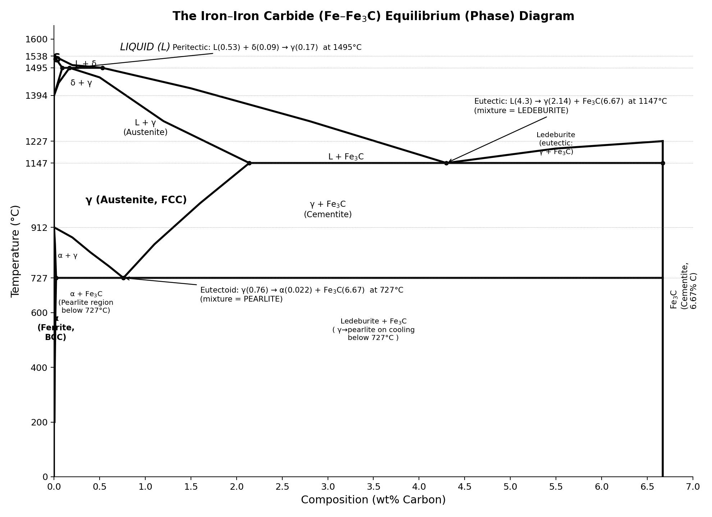

# Engineering Materials (IPE-101) — First Class Test 2025
**B.Sc. Textile Engineering, Level-1, Term-2**
**Full Marks: 10 | Time: 30 Minutes**

---

## Q1. Define "Fatigue" and "Creep" — (2 Marks)

### Fatigue
**Fatigue** is the progressive, localized, and permanent structural damage that occurs in a material when it is subjected to **cyclic (repeated or fluctuating) stresses**, even when the maximum applied stress is well **below the material's yield strength** (or ultimate tensile strength). Repeated loading and unloading initiates a microscopic crack — usually at a surface defect, notch, or stress concentration — which then propagates slowly with each stress cycle until the remaining cross-section can no longer bear the load, causing sudden, brittle-like fracture.

**Key characteristics:**
- Occurs under **dynamic/cyclic loading**, not static loading.
- Failure stress is much lower than the static strength of the material.
- Failure develops in three stages: **crack initiation → crack propagation → sudden final fracture**.
- Fracture surface typically shows "beach marks" (striations) and a rough final-rupture zone.
- Depends on number of cycles (*N*), stress amplitude (*σₐ*), surface finish, temperature, and presence of stress raisers.

*Example:* A rotating shaft, an aircraft wing, or a bridge component that eventually cracks after millions of load cycles, even though the peak stress never exceeded the yield strength in a single loading event.

---

### Creep
**Creep** is the **time-dependent, permanent (plastic) deformation** of a material that occurs under a **constant stress (or constant load)**, typically at **elevated temperature** (generally above ~0.4 T_m, where T_m is the absolute melting temperature of the material). Unlike instantaneous elastic/plastic deformation, creep strain accumulates slowly and continuously over long periods — hours, days, or even years.

**Key characteristics:**
- Requires **sustained stress + high temperature + time**.
- Follows three stages when strain is plotted against time:
  1. **Primary (transient) creep** – decreasing strain rate as the material strain-hardens.
  2. **Secondary (steady-state) creep** – constant, minimum strain rate; the longest stage, most important for design life.
  3. **Tertiary creep** – rapidly increasing strain rate leading to necking and **rupture**.
- Important in components operating at high temperature for long durations, e.g., gas turbine blades, boiler tubes, furnace parts.

| Feature | Fatigue | Creep |
|---|---|---|
| Type of load | Cyclic/fluctuating | Constant (static) |
| Temperature | Usually room temp | Usually elevated (>0.4 T_m) |
| Time dependence | Depends on number of cycles | Depends on time under load |
| Failure mechanism | Crack initiation & propagation | Progressive plastic flow → rupture |

---

## Q2. Atomic Packing Factor (APF); Atoms per Unit Cell and APF of FCC — (3 Marks)

### Definition of APF
The **Atomic Packing Factor (APF)** is defined as the **fraction of the total volume of a unit cell that is actually occupied by atoms**, assuming the atoms are rigid, touching spheres.

$$
\text{APF} = \frac{\text{Volume of atoms in the unit cell}}{\text{Total volume of the unit cell}} = \frac{n \times \dfrac{4}{3}\pi R^3}{a^3}
$$

where *n* = number of atoms per unit cell, *R* = atomic radius, and *a* = lattice (edge) parameter.

### Number of Atoms per Unit Cell — FCC (Face-Centered Cubic)

An FCC unit cell has atoms at:
- **8 corner positions** → each corner atom is shared among **8** adjacent unit cells → contributes 1/8 each
- **6 face-centered positions** → each face atom is shared between **2** adjacent unit cells → contributes 1/2 each

$$
n_{FCC} = \underbrace{8 \times \frac{1}{8}}_{\text{corners}} + \underbrace{6 \times \frac{1}{2}}_{\text{faces}} = 1 + 3 = \boxed{4 \text{ atoms/unit cell}}
$$

### Relationship between Atomic Radius (R) and Lattice Parameter (a)

In FCC, atoms touch along the **face diagonal**. The face diagonal length is $a\sqrt{2}$, and along this diagonal there are 4 atomic radii (corner atom + full diameter of the face atom + corner atom):

$$
4R = a\sqrt{2} \quad \Rightarrow \quad a = 2\sqrt{2}\,R
$$

### Calculating the APF

Volume of the unit cell:
$$
a^3 = (2\sqrt{2}R)^3 = 16\sqrt{2}\,R^3
$$

Volume occupied by the 4 atoms:
$$
V_{atoms} = 4 \times \frac{4}{3}\pi R^3 = \frac{16}{3}\pi R^3
$$

Therefore:
$$
\text{APF} = \frac{\dfrac{16}{3}\pi R^3}{16\sqrt{2}\,R^3} = \frac{\pi}{3\sqrt{2}} = \frac{\pi\sqrt{2}}{6}
$$

$$
\boxed{\text{APF}_{FCC} \approx 0.74 \;(\text{or } 74\%)}
$$

**Interpretation:** 74% of the FCC unit cell volume is occupied by atoms (the remaining 26% is empty space). This is the **highest packing efficiency possible for equal-sized spheres** and is shared by both the FCC and HCP crystal structures (both are "close-packed" structures). Common FCC metals include Al, Cu, Ni, Ag, Au, Pb, and γ-iron (austenite).

---

## Q3. Fe–Fe₃C Equilibrium Diagram — (5 Marks)

The **Iron–Iron Carbide (Fe–Fe₃C) diagram** is a **metastable equilibrium diagram** showing the phases present in iron–carbon alloys (steels and cast irons) up to 6.67 wt% carbon (the composition of cementite, Fe₃C), as a function of temperature and composition. It is "metastable" because the true equilibrium phase would be graphite rather than cementite, but Fe₃C forms preferentially under normal cooling rates.

### Diagram

The diagram below plots **Temperature (°C)** on the vertical axis against **wt% Carbon** on the horizontal axis (0 to 6.67%).

### Phases Present

| Phase | Crystal Structure | Description |
|---|---|---|
| **L (Liquid)** | — | Molten Fe–C solution |
| **δ-ferrite** | BCC | High-temperature phase, stable 1394–1538°C, max ~0.09%C |
| **γ (Austenite)** | FCC | Stable 727–1495°C, max solubility 2.14%C at 1147°C |
| **α-ferrite** | BCC | Stable below 912°C, max solubility only 0.022%C at 727°C |
| **Fe₃C (Cementite)** | Orthorhombic | Fixed composition 6.67%C; hard (~800 HV) and brittle intermetallic compound |

### Key Invariant Reactions

**1. Peritectic Reaction — at 1495°C**
$$
L(0.53\%C) + \delta(0.09\%C) \;\rightarrow\; \gamma(0.17\%C)
$$

**2. Eutectic Reaction — at 1147°C** (this is the point that gives the diagram its "iron-carbon" shape)
$$
L(4.3\%C) \;\rightarrow\; \gamma(2.14\%C) + Fe_3C(6.67\%C)
$$
The resulting eutectic mixture is called **Ledeburite**.

**3. Eutectoid Reaction — at 727°C** (the most important reaction for steel heat treatment)
$$
\gamma(0.76\%C) \;\rightarrow\; \alpha(0.022\%C) + Fe_3C(6.67\%C)
$$
The resulting eutectoid mixture is called **Pearlite** (alternating lamellae of α-ferrite and cementite).

### Important Boundary Lines

- **A₃ line**: γ/(α+γ) boundary — solubility of C in austenite in equilibrium with ferrite; drops from 912°C (0%C) to 727°C (0.76%C).
- **A_cm line**: γ/(γ+Fe₃C) boundary — solubility of C in austenite in equilibrium with cementite; drops from 2.14%C (1147°C) to 0.76%C (727°C).
- **A₁ line**: the eutectoid horizontal line at 727°C — the lower temperature limit of austenite stability.

### Classification of Iron–Carbon Alloys (based on the diagram)

| Category | Carbon Range | Microstructure at Room Temperature |
|---|---|---|
| **Commercially pure iron** | < 0.008% C | Essentially pure α-ferrite |
| **Hypo-eutectoid steel** | 0.008 – 0.76% C | Proeutectoid ferrite + Pearlite |
| **Eutectoid steel** | 0.76% C | 100% Pearlite |
| **Hyper-eutectoid steel** | 0.76 – 2.14% C | Proeutectoid cementite (network) + Pearlite |
| **Hypo-eutectic cast iron** | 2.14 – 4.3% C | Pro-eutectic austenite (→pearlite) + Ledeburite |
| **Eutectic cast iron** | 4.3% C | 100% Ledeburite |
| **Hyper-eutectic cast iron** | 4.3 – 6.67% C | Primary Fe₃C + Ledeburite |

**Note:** The boundary at 2.14%C conventionally separates **steels** (< 2.14% C) from **cast irons** (> 2.14% C), because this is the maximum carbon solubility in austenite — above this the alloy cannot be made fully austenitic (single-phase) at any temperature, which affects its hot-working/forgeability.

---
*End of Answer Sheet*
