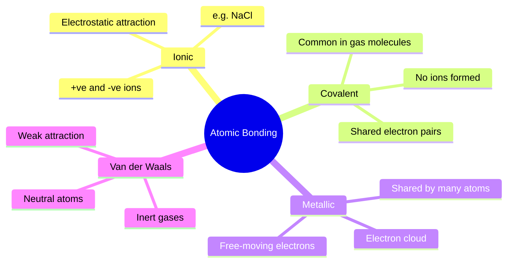
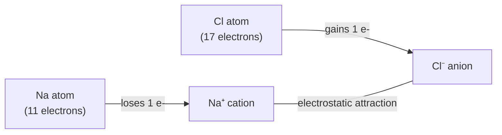
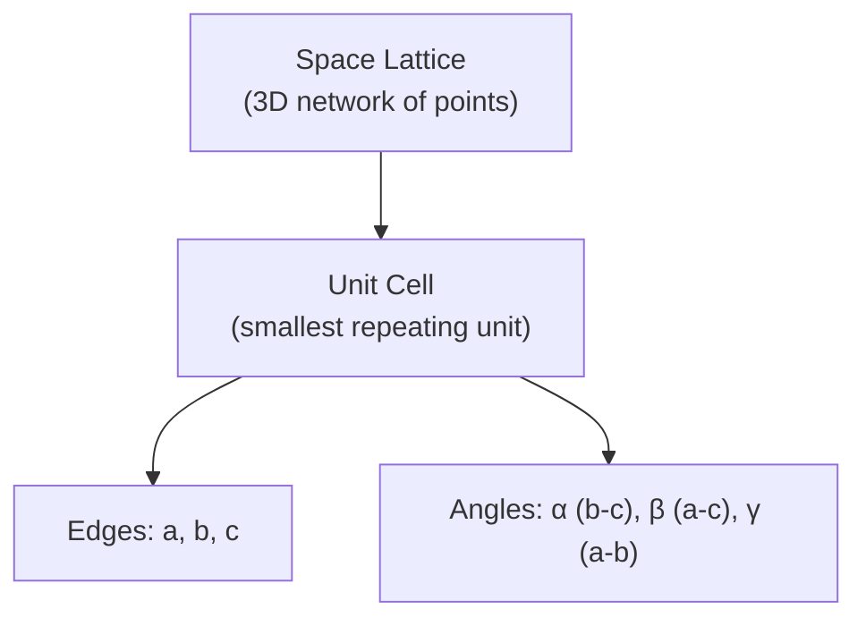
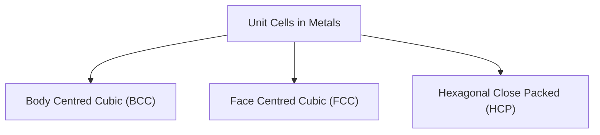
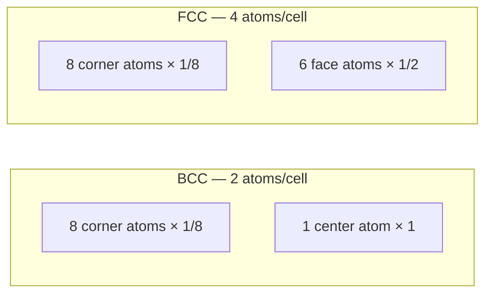
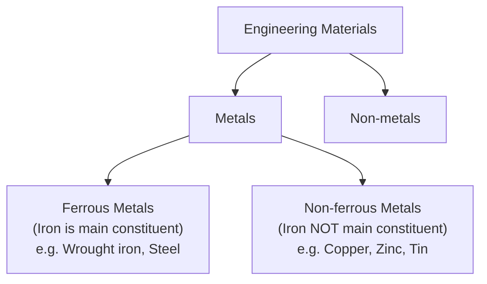
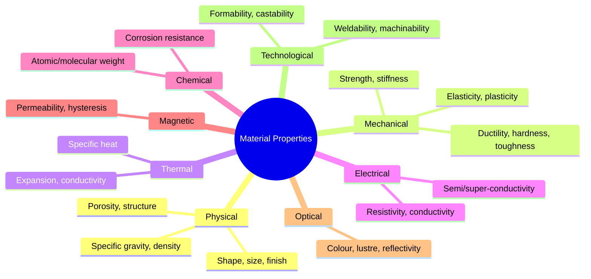
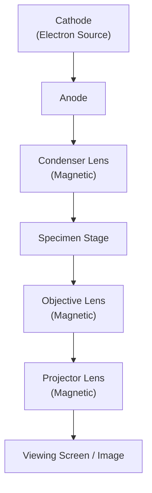

# 📘 Materials Science & Metallurgy — Exam Revision Notebook

*Compiled and expanded from lecture slides by Dr. Md. Arifuzzaman, Department of Mechanical Engineering, KUET, Khulna*

---

## 📑 Table of Contents

1. [Chapter 1: Crystal Structure of Metals](#chapter-1-crystal-structure-of-metals)
2. [Chapter 2: Engineering Materials & Properties](#chapter-2-engineering-materials--properties)
3. [Chapter 3: Metallography & Microscopy](#chapter-3-metallography--microscopy)
4. [One-Night Revision Sheet](#one-night-revision-sheet)
5. [Ultra Short Notes](#ultra-short-notes)
6. [Exam Cheat Sheet](#exam-cheat-sheet)

---

# Chapter 1: Crystal Structure of Metals

## 1.1 Classification of Elements

> **Note:** Solids are classified based on lustre, conductivity, and plastic deformability.

| Group | Characteristics | Examples |
|---|---|---|
| **Metals** | Exist as crystals in solid state; high thermal & electrical conductivity; deform plastically; high reflectivity of light | Fe, Cu, Al, Na |
| **Metalloids** | Resemble metals in some respects, non-metals in others; some conductivity but little/no plasticity | Carbon, Boron, Silicon |
| **Non-metals** | Remaining elements — low lustre, low strength, low conductivity | Sulphur, Oxygen |

### Easy Explanation
Think of it as a spectrum: **metals** (shiny, bendy, conduct well) → **metalloids** (half-and-half) → **non-metals** (dull, brittle, poor conductors).

### Key Points
- Memory trick: **"M-M-N"** — Metals shine and bend, Metalloids sit on the fence, Non-metals do neither.

---

## 1.2 Atomic Bonding

There are **four types of atomic bonds**. All arise from atoms trying to reach a stable (usually 8-electron) outer shell.

### 1.2.1 Ionic Bond

#### Definition
A bond formed by strong electrostatic attraction between positively and negatively charged ions.

#### Easy Explanation
One atom donates an electron, another accepts it — opposite charges then attract like magnets.

#### Key Points
- Stable configuration = 8 electrons in outer shell (octet rule)
- Each Na⁺ ion is surrounded by six Cl⁻ ions for equilibrium (NaCl structure)
- Classic example: **Sodium Chloride (NaCl)**

---

### 1.2.2 Covalent Bond

#### Definition
A bond formed when atoms **share** one or more electrons with adjacent atoms to reach a stable structure.

#### Easy Explanation
Instead of giving away an electron, atoms "hold hands" and share electrons between them — no ions are created.

#### Key Points
- Bond force = attraction of the *shared* electrons by both positive nuclei
- Typical in most **gas molecules** (e.g., methane, CH₄)
- Example from slides: Carbon shares electrons with 4 Hydrogen atoms

> ⚠️ **Frequently confused:** Ionic bonds *transfer* electrons; covalent bonds *share* electrons.

---

### 1.2.3 Metallic Bond

#### Definition
A bond where atoms contribute valence electrons to form a shared **"electron cloud,"** which holds positive metallic ions together.

#### Easy Explanation
Picture positive metal ions sitting in a "sea" of free-flowing electrons — the electrons don't belong to any single atom, and their negative charge glues all the positive ions together.

#### Key Points
- Occurs because there aren't enough valence electrons for a true covalent bond, and no oppositely charged ions exist
- Electrons move **freely** among positive ions
- This free electron cloud explains **why metals conduct electricity and heat well**

---

### 1.2.4 Van der Waals Bond

#### Definition
A weak attractive force that occurs in **neutral atoms** (such as inert gases) due to momentary separation of positive and negative charge centers.

#### Easy Explanation
Even "neutral" atoms have flickering, uneven charge distributions. When two such atoms get close, these flickers align just enough to create a very weak pull.

#### Key Points
- Weakest of the four bond types
- Typical in inert gases (Ne, Ar) and between molecular layers

---

### 🔎 Comparison Table: Types of Atomic Bonds

| Bond Type | Mechanism | Strength | Ions Formed? | Typical Example |
|---|---|---|---|---|
| Ionic | Electron transfer + electrostatic attraction | Strong | Yes | NaCl |
| Covalent | Electron sharing | Strong | No | Gas molecules (CH₄) |
| Metallic | Shared electron cloud | Strong (variable) | No (metal ions in cloud) | Fe, Cu, Al |
| Van der Waals | Weak charge-center separation | Weak | No | Inert gases (Ar, Ne) |

💡 Memory Trick

**"I Can't Make Vans"** → **I**onic, **C**ovalent, **M**etallic, **V**an der Waals — in slide order.

---

## 1.3 Space Lattice & Unit Cell

## Definition
- **Space lattice:** The three-dimensional network of imaginary lines connecting atoms in a crystal.
- **Unit cell:** The smallest unit that still has the full symmetry of the crystal — the repeating "building block."

## Easy Explanation
If a crystal is a brick wall, the **space lattice** is the whole wall's grid pattern, and the **unit cell** is a single brick — repeat it in 3D and you rebuild the entire wall.

Caption: A parallelepiped unit cell with edge lengths a, b, c and interaxial angles α (between b & c), β (between a & c), γ (between a & b).

### Key Points
- Edges of unit cell: **a, b, c**
- **α** = angle between b and c
- **β** = angle between a and c
- **γ** = angle between a and b

---

## 1.4 The Seven Crystal Systems

> There are **14 possible space lattices**, falling into **7 crystal systems**.

| Crystal System | Axial Lengths & Angles | Unit Cell Shape | Number of Lattices |
|---|---|---|---|
| Cubic | a = b = c, α = β = γ = 90° | A cube | 3 |
| Tetragonal | a = b ≠ c, α = β = γ = 90° | Square-based right prism | 2 |
| Orthorhombic | a ≠ b ≠ c, α = β = γ = 90° | Rectangular-based right prism | 4 |
| Rhombohedral | a = b = c, α = β = γ ≠ 90° | A rhombohedron | 1 |
| Hexagonal | a = b ≠ c, α = β = 90°, γ = 120°* | Rhombus-based right prism | 1 |
| Monoclinic | a ≠ b ≠ c, α = γ = 90° ≠ β | Parallelepiped-based right prism | 2 |
| Triclinic | a ≠ b ≠ c, α ≠ β ≠ γ ≠ 90° | A parallelepiped | 1 |

*Note: γ = 120° is the standard convention for the hexagonal system (the slide states α = β = γ = 90°, which describes the hexagonal *prism* base relationship for the simple case; when studying, follow your textbook's convention for γ).

💡 Memory Trick

**"Cows That Often Read Heavy Magazines Today"** → **C**ubic, **T**etragonal, **O**rthorhombic, **R**hombohedral, **H**exagonal, **M**onoclinic, **T**riclinic

---

## 1.5 Primitive vs Non-Primitive Unit Cells

| Feature | Primitive Unit Cell | Non-Primitive Unit Cell |
|---|---|---|
| Atom positions | **Only** corner atoms | Corner atoms **+** face/interior atoms |
| Atoms per cell | 1 (effectively) | More than 1 |
| Example | Simple Cubic (SC) | BCC, FCC |

---

## 1.6 Common Metallic Crystal Structures

### 1.6.1 Body Centred Cubic (BCC)

## Definition
A cubic unit cell with one atom at each of the 8 corners **plus** one atom at the body center.

## Easy Explanation
Imagine a cube with a marble glued to each corner, and one marble floating dead-center inside, touching the corner marbles diagonally — but the corner marbles don't touch each other.

Caption: Atoms at eight corners with one atom at the body center; the center atom touches all 8 corner atoms.

#### Key Facts
| Property | Value |
|---|---|
| Atoms per unit cell | (1/8 × 8) + 1 = **2 atoms** |
| Coordination number | 8 |
| Atomic Packing Factor (APF) | **0.68** |
| Relationship (atomic radius r, edge a) | √3·a = 4r → **r = (√3·a)/4** |
| Examples | Chromium, Tungsten, α-Iron, Molybdenum, Vanadium, Sodium |

#### Advantages / Disadvantages
- ✅ Higher strength/hardness than FCC in many metals
- ❌ Generally less ductile than FCC (fewer close-packed slip planes)

#### Exam Notes
- Corner atom shared by **8** adjacent cubes → contributes 1/8 each
- Center atom is **not shared** by any other cube → contributes fully (1)

---

### 1.6.2 Face Centred Cubic (FCC)

## Definition
A cubic unit cell with one atom at each of the 8 corners **plus** one atom at the center of each of the 6 faces.

## Easy Explanation
Same cube-corner marbles as BCC, but instead of one marble floating in the middle, there's a marble embedded in the center of each of the 6 flat faces.

Caption: Atoms at eight corners plus one atom centered on each of the six faces.

#### Key Facts
| Property | Value |
|---|---|
| Atoms per unit cell | (1/8 × 8) + (1/2 × 6) = **4 atoms** |
| Coordination number | 12 |
| Atomic Packing Factor (APF) | 0.74 (densest packing) |
| Packing | More densely packed than BCC |
| Examples | Aluminium, Nickel, Copper, Gold, Silver |

#### Exam Notes
- Corner atom shared by 8 cubes → 1/8 each
- Face atom shared by only **1 adjacent cube** → 1/2 each (since a face is shared between 2 cubes)
- **Metals with FCC lattice are ductile and good conductors** (important exam line!)

---

### 🔎 Comparison Table: BCC vs FCC

| Feature | BCC | FCC |
|---|---|---|
| Atoms per unit cell | 2 | 4 |
| Coordination number | 8 | 12 |
| Packing factor (APF) | 0.68 | 0.74 |
| Packing density | Less dense | More dense |
| Ductility | Lower | **Higher — ductile** |
| Conductivity | Good | **Better — good conductor** |
| Examples | Cr, W, α-Fe, Mo, V, Na | Al, Ni, Cu, Au, Ag |

---

### 1.6.3 Hexagonal Close Packed (HCP)

## Definition
A structure with two hexagonal basal planes (each with an atom at every corner and one at the center), plus three additional atoms midway between the basal planes forming a triangle.

## Easy Explanation
Picture a hexagonal "sandwich": top and bottom hexagonal bread slices (each with 6 corner atoms + 1 center atom), and 3 "filling" atoms tucked between them in a triangular arrangement.

Caption: Two hexagonal basal planes with corner + center atoms, and three interstitial atoms forming a triangle between the planes.

#### Key Facts
| Property | Value |
|---|---|
| Atoms per unit cell | **6 atoms** |
| Contribution breakdown | Corner atoms shared by 6 adjacent cells; 3 interior (mid-layer) atoms not shared; center (basal) atoms shared by 1 adjacent cell |
| Examples | Magnesium, Zinc, Cadmium |

#### Exam Notes
- Each corner atom → shared by **6** adjacent unit cells
- The 3 mid-layer atoms → **cannot** be shared (fully inside the cell)
- Each basal-plane center atom → shared by **1** adjacent cell

---

### 🔎 Master Comparison Table: BCC vs FCC vs HCP

| Property | BCC | FCC | HCP |
|---|---|---|---|
| Atoms/unit cell | 2 | 4 | 6 |
| Coordination number | 8 | 12 | 12 |
| Packing factor | 0.68 | 0.74 | 0.74 |
| Examples | Cr, W, α-Fe, Mo, V, Na | Al, Ni, Cu, Au, Ag | Mg, Zn, Cd |
| Ductility | Moderate | High | Low (fewer slip systems) |

---

## 1.7 Atomic Radius: BCC Derivation

In BCC, atoms touch along the **body diagonal** (not the edge).

## Formula

$$ (bd)^2 = a^2 + (fd)^2 $$
$$ (bd)^2 = a^2 + 2a^2 = 3a^2 $$
$$ (bd) = \sqrt{3}\,a = 4r $$
$$ \boxed{r = \dfrac{\sqrt{3}\,a}{4}} $$

### Variables
| Symbol | Meaning |
|---|---|
| a | Edge length of the cubic unit cell |
| bd | Body diagonal length |
| fd | Face diagonal length |
| r | Atomic radius |

### Units
- a, r → length units (e.g., nm, Å, pm)

### When to use
Whenever the problem gives the **lattice parameter (a)** of a BCC metal and asks for atomic radius, or vice versa.

### Important Notes
> ✅ **Self-Study Reminder from slides:** Derivations for **Simple Cubic** and **Face Centered Cubic** atomic radius were marked "self-study" — practice these using the same right-triangle method (SC: atoms touch along the edge, r = a/2; FCC: atoms touch along the face diagonal, r = √2·a/4).

---

## 1.8 Atomic Packing Factor (APF)

## Formula

$$ APF = \dfrac{n \times \dfrac{4}{3}\pi r^3}{a^3} $$

### Variables
| Symbol | Meaning |
|---|---|
| n | Number of atoms per unit cell |
| r | Atomic radius |
| a | Unit cell edge length |

### Units
Dimensionless (ratio of volumes)

### When to use
To quantify how "densely packed" a crystal structure is — always a value between 0 and 1.

### Important Notes
- **APF (BCC) = 0.68**
- **APF (FCC) = 0.74** (same as HCP — both are close-packed structures)
- Higher APF → denser structure → generally higher ductility and conductivity

Q: Derive APF for BCC using r = √3a/4

$$ APF = \frac{2 \times \frac{4}{3}\pi\left(\frac{\sqrt{3}a}{4}\right)^3}{a^3} = 0.68 $$

---

## 1.9 Density of Lattice Material

## Formula

$$ \rho = \dfrac{m}{V} = \dfrac{nA/N}{V} = \dfrac{nA}{NV} $$

### Variables
| Symbol | Meaning |
|---|---|
| ρ | Density of the material |
| m | Mass of atoms in the unit cell |
| V | Volume of the unit cell (= a³ for cubic) |
| n | Number of atoms per unit cell |
| A | Atomic weight (g/mol) |
| N | Avogadro's number = 6.023 × 10²³ /mol |

### Units
- ρ typically in g/cm³ or kg/m³

### When to use
Whenever asked to calculate theoretical density of a metal from its crystal structure and atomic weight.

### Important Notes
- Always match units of **a** (and hence V) with the units expected for ρ (commonly convert a from Å or nm to cm)
- n depends on crystal structure (BCC = 2, FCC = 4, HCP = 6)

---

## Chapter 1: High Probability Questions

### Q1
What is a space lattice?

Answer

The 3D network of imaginary lines connecting atoms in a crystal, representing the periodic arrangement of atomic positions.

### Q2
Define unit cell.

Answer

The smallest repeating unit of a crystal structure that possesses the full symmetry of the crystal; stacking unit cells in 3D reproduces the entire lattice.

### Q3
How many atoms are there per unit cell in BCC? Show the calculation.

Answer

(1/8 × 8 corner atoms) + (1 × 1 center atom) = 1 + 1 = **2 atoms**.

### Q4
How many atoms are there per unit cell in FCC? Show the calculation.

Answer

(1/8 × 8 corner atoms) + (1/2 × 6 face atoms) = 1 + 3 = **4 atoms**.

### Q5
Name three metals each that crystallize in BCC and FCC.

Answer

BCC: Chromium, Tungsten, α-Iron (also Molybdenum, Vanadium, Sodium).
FCC: Aluminium, Nickel, Copper (also Gold, Silver).

### Q6
Why are FCC metals generally more ductile than BCC metals?

Answer

FCC has a higher packing factor and more close-packed slip planes/directions, allowing easier dislocation motion and hence greater ductility.

### Q7
What is the atomic packing factor of BCC?

Answer

0.68

### Q8
Differentiate between primitive and non-primitive unit cells.

Answer

Primitive unit cells have atoms only at the corners. Non-primitive unit cells have additional atoms at face centers and/or the body center (e.g., BCC, FCC).

### Q9
List the four types of atomic bonding.

Answer

Ionic, Covalent, Metallic, and Van der Waals bonding.

### Q10
Why do metals conduct electricity well? (Relate to bonding.)

Answer

Metallic bonding involves a "sea" of delocalized valence electrons that move freely among positive metal ions, allowing easy charge transport.

### Q11
How many crystal systems and space lattices exist in total?

Answer

7 crystal systems, comprising 14 possible space lattices (Bravais lattices).

### Q12
State the formula for atomic radius in BCC in terms of lattice parameter a.

Answer

r = (√3 · a) / 4

### Q13
How many atoms are present in an HCP unit cell?

Answer

6 atoms.

### Q14
Give the density formula for a crystalline material and define each term.

Answer

ρ = nA / (N·V), where n = atoms/unit cell, A = atomic weight, N = Avogadro's number, V = unit cell volume.

---

# Chapter 2: Engineering Materials & Properties

## 2.1 Classification of Engineering Materials

## Definition
- **Metals:** Possess lustre (on polishing), strength, and conductivity; in chemistry, materials capable of replacing hydrogen atoms in an acid (criterion = valence electrons).
- **Ferrous metals:** Iron is the main constituent (e.g., wrought iron, steel).
- **Non-ferrous metals:** Iron is *not* the main constituent (e.g., copper, zinc, tin).
- **Non-metals:** Low lustre, strength, and conductivity (e.g., carbon, sulphur).

### 🔎 Comparison Table: Ferrous vs Non-Ferrous Metals

| Feature | Ferrous Metals | Non-Ferrous Metals |
|---|---|---|
| Main constituent | Iron | Not iron |
| Examples | Wrought iron, steel | Copper, zinc, tin |
| Magnetic? | Generally yes | Generally no |
| Corrosion resistance | Lower (rusts) | Often higher |

### 🔎 Comparison Table: Metals vs Non-Metals

| Feature | Metals | Non-Metals |
|---|---|---|
| Lustre | High | Low |
| Strength | High | Low |
| Conductivity | High | Low |
| Plastic deformation | Yes | No |
| Examples | Fe, Cu, Al | Carbon, Sulphur |

> 📚 Reference from slides: *For a detailed difference between metals and non-metals, see Article 1.4, "Materials and Metallurgy" by Narang.*

---

## 2.2 Categories of Material Properties

Engineering materials are studied under **8 property categories**:

### 🔎 Comparison Table: Physical vs Mechanical vs Thermal Properties

| Category | Examples |
|---|---|
| **Physical** | Shape, size, finish, colour, specific gravity, density, porosity, structure |
| **Mechanical** | Strength, stiffness, elasticity, plasticity, ductility, creep, brittleness, hardness, toughness, resilience, impact, fatigue |
| **Thermal** | Specific heat, thermal capacity, expansion, conductivity, thermal stresses, thermal fatigue |

### 🔎 Comparison Table: Optical vs Electrical vs Chemical Properties

| Category | Examples |
|---|---|
| **Optical** | Colour, lustre, diffraction, fluorescence, reflectivity, luminescence |
| **Electrical** | Resistivity, conductivity, dielectric constant, strength, semi-conductivity, super-conductivity |
| **Chemical** | Corrosion resistance, atomic weight, valency, molecular weight, acidity, alkalinity, atomic number |

---

## 2.3 Important Physical Properties

### 2.3.1 Density
## Definition
Weight (mass) of the material per unit volume.
## Easy Explanation
How "heavy" a material feels for its size — lead feels heavier than the same-sized block of wood.
## Key Points
- Real-life example: steel (~7.85 g/cm³) vs aluminium (~2.7 g/cm³)
- Engineering application: aircraft parts favor low-density, high-strength metals (Al, Ti alloys)

### 2.3.2 Melting Point
## Definition
The temperature at which a solid material changes into a liquid.
## Key Points
- Engineering application: choosing filler metals for welding/soldering must have appropriate melting points relative to the base metal

### 2.3.3 Porosity
## Definition
The ratio of the volume of voids in a material to its total volume.
## Key Points
- High porosity → lower strength, useful in filters or sound absorption
- Frequently confused with **density** — porosity is about *void space*, density is about *mass per volume*

---

## 2.4 Important Mechanical Properties

### 🔎 Definitions At a Glance

| Property | Definition |
|---|---|
| **Elasticity** | Ability of a material to regain its original shape and size after removal of load |
| **Plasticity** | The property by which a material *retains* its shape and size after removal of load (permanent deformation) |
| **Strength** | Capacity of a material to withstand or support a load |
| **Ductility** | Ability of a material to be drawn from a large section to a small section (e.g., into wire) |
| **Brittleness** | Property of fracturing without perceptible warning or appreciable deformation |
| **Malleability** | Property of getting permanently deformed by **compression** without rupture (e.g., hammered/rolled into sheets) |
| **Hardness** | Ability to withstand scratching, wear, abrasion, or penetration by harder bodies |
| **Toughness** | Energy absorbed before fracture under various loads |
| **Stiffness** | Relative (resistance to) deformation of a material under load |
| **Creep** | Slow, continuous deformation of a material under a steady (constant) load |
| **Fatigue** | Property describing a material's ability to withstand repeated (cyclic) load |
| **Resilience** | Capacity of a material to absorb or store energy **within the elastic limit** |

### Easy Explanations & Real-Life Analogies

| Property | Everyday Analogy |
|---|---|
| Elasticity | A rubber band / slingshot — snaps back to shape |
| Plasticity | Play-Doh — stays in the shape you mold it into |
| Ductility | Copper wire drawn thinner and thinner |
| Malleability | Gold beaten into thin foil |
| Brittleness | Glass — shatters suddenly with no warning |
| Toughness | A rubber boot — absorbs impact without cracking |
| Creep | A sagging shelf that slowly bends over years under constant weight |
| Fatigue | A paperclip that snaps after being bent back-and-forth repeatedly |
| Resilience | A pogo stick spring absorbing and releasing energy elastically |

> ⚠️ **Frequently Confused: Ductility vs Malleability**
> - **Ductility** → drawn into **wires** (tension)
> - **Malleability** → beaten/rolled into **sheets** (compression)

> ⚠️ **Frequently Confused: Toughness vs Hardness**
> - **Hardness** = resistance to *scratching/surface penetration*
> - **Toughness** = energy absorbed *before fracture* (resistance to cracking under impact)

> ⚠️ **Frequently Confused: Elasticity vs Plasticity vs Resilience**
> - **Elasticity** = *ability* to return to original shape
> - **Plasticity** = property of undergoing *permanent* deformation
> - **Resilience** = *energy stored* while still within the elastic region

💡 Memory Trick: Mechanical Properties

**"Every Person Studies Diligently, But Might Have Trouble Studying Continuously For Rigorous exams"**
→ **E**lasticity, **P**lasticity, **S**trength, **D**uctility, **B**rittleness, **M**alleability, **H**ardness, **T**oughness, **S**tiffness, **C**reep, **F**atigue, **R**esilience

---

## 2.5 Important Thermal Properties

| Property | Definition |
|---|---|
| **Thermal conductivity** | Index of the ease with which heat is conducted through a material |
| **Specific heat** | Quantity of heat required to raise the temperature of 1 kg of material by 1 K |
| **Thermal expansion** | Increase in dimensions of a material when heated |
| **Thermal diffusivity** | Ratio of thermal conductivity to heat capacity per unit volume |
| **Spalling** | Cracking of brittle materials caused by thermal stresses in the surface layer |
| **Thermal fatigue** | Mechanical effect of *repeated* thermal stresses on a solid |
| **Thermal shock** | Impulse effect within a solid due to a *sudden* change in temperature |

> ⚠️ **Frequently Confused: Thermal Fatigue vs Thermal Shock**
> - **Thermal fatigue** → *repeated* cycles of thermal stress (like metal fatigue, but from heat cycling)
> - **Thermal shock** → a *single, sudden* temperature change (e.g., hot glass plunged into cold water)

### Real-Life Examples
- **Thermal expansion**: Gaps left in railway tracks and bridge expansion joints
- **Thermal shock**: Cracking of a hot glass cup when cold water is poured into it

---

## 2.6 Important Electrical Properties

| Property | Definition |
|---|---|
| **Electrical conductivity** | Index of ease with which electric current flows through a material |
| **Resistivity** | The opposite/inverse concept of electrical conductivity |
| **Semi-conductivity** | Characteristic of non-metallic materials arising from structural imperfections or trace impurities |
| **Super-conductivity** | Abrupt drop of resistivity (to near zero) at a very low "superconducting temperature," close to absolute zero |

---

## 2.7 Chemical, Magnetic, Optical & Technological Properties

| Category | Key Terms |
|---|---|
| **Chemical** | Corrosion resistance, atomic weight, valency, molecular weight, acidity, alkalinity, atomic number |
| **Magnetic** | Permeability, hysteresis, reductivity, retentivity, susceptibility, residual inductance |
| **Optical** | Colour, lustre, diffraction, fluorescence, reflectivity, luminescence |
| **Technological** | Hardness, weldability, machinability, formability, castability |

---

## Chapter 2: High Probability Questions

### Q1
Define ductility.

Answer

The ability of a material to be drawn from a large cross-section into a smaller one (e.g., into a wire) without breaking.

### Q2
Differentiate between ferrous and non-ferrous metals with examples.

Answer

Ferrous metals have iron as the main constituent (wrought iron, steel); non-ferrous metals do not (copper, zinc, tin).

### Q3
What is the difference between elasticity and plasticity?

Answer

Elasticity is the ability to return to original shape/size after load removal; plasticity is the property of retaining the deformed shape permanently after load removal.

### Q4
Define creep and give an example situation where it matters.

Answer

Creep is slow, continuous deformation under a steady/constant load over time — important in turbine blades and structures operating at high temperature for long durations.

### Q5
What is fatigue failure?

Answer

Failure of a material caused by repeated/cyclic loading, even when the stress magnitude is below the material's static strength limit.

### Q6
List the eight categories used to classify material properties.

Answer

Physical, Mechanical, Thermal, Electrical, Chemical, Magnetic, Optical, and Technological properties.

### Q7
Distinguish between hardness and toughness.

Answer

Hardness is resistance to scratching/surface penetration; toughness is the energy a material absorbs before fracturing under load/impact.

### Q8
What is resilience?

Answer

The capacity of a material to absorb or store energy while remaining within its elastic limit.

### Q9
Define porosity.

Answer

The ratio of the volume of voids (empty spaces) within a material to its total volume.

### Q10
What is thermal shock and how does it differ from thermal fatigue?

Answer

Thermal shock is a sudden impulse-like stress from a rapid temperature change; thermal fatigue results from repeated cycles of thermal stress over time.

---

# Chapter 3: Metallography & Microscopy

## 3.1 What is Metallography?

## Definition
Metallography is the study of the **structural characteristics** (microstructure) of metals and alloys.

## Easy Explanation
It's like giving a metal a "biopsy" — cutting, polishing, and viewing a thin slice under a microscope to see its internal grain structure.

## Key Points
- Determines grain size, and the size/shape/distribution of various phases
- Microstructure reveals the **mechanical and thermal treatment history** of the metal
- Can help **predict behavior** of metals/alloys under given conditions
- **Critical rule:** microscopic study results depend heavily on correct **specimen preparation**

### Why It Matters (Purpose & Importance)
- Quality control in manufacturing (checking grain size, defects, inclusions)
- Failure analysis (studying fracture surfaces, cracks)
- Correlating microstructure to properties like strength and ductility

---

## 3.2 Steps of Specimen Preparation

| Step | Purpose |
|---|---|
| **1. Sampling** | Select a representative piece of the material to be examined |
| **2. Rough grinding (Filing)** | Remove surface irregularities and reduce to a workable size |
| **3. Mounting** | Embed small/irregular specimens in resin for easy handling |
| **4. Intermediate polishing (Emery paper)** | Progressively remove scratches using finer abrasive grit |
| **5. Fine polishing** | Achieve a mirror-like, scratch-free surface using a polishing machine, velvet cloth, and diamond paste |
| **6. Etching** | Chemically reveal the grain boundaries and microstructure |

### Common Etchants
| Etchant | Composition |
|---|---|
| **Nital** | 2% Nitric acid in ethyl alcohol |
| Alternative | 10% solution of HCl |

### Why Each Step is Performed
- **Sampling** ensures the studied region is representative of the whole part
- **Grinding/Polishing** progressively removes scratches from the *previous* step (never skip a stage — leftover deep scratches can't be removed by finer abrasives alone)
- **Etching** selectively attacks grain boundaries (which are more chemically reactive) faster than the grain interior, making boundaries visible under the microscope as fine dark lines

💡 Memory Trick: Specimen Preparation Steps

**"Some Rough Metal Is Finally Etched"** → **S**ampling, **R**ough grinding, **M**ounting, **I**ntermediate polishing, **F**ine polishing, **E**tching

---

## 3.3 Metallurgical Microscopes

### 3.3.1 Optical (Light) Microscope

## Definition
A microscope using **visible light** and glass lenses (objective + ocular/eyepiece) to magnify a polished, etched metal specimen.

## Key Points
- **Total magnification** = magnification of objective lens × magnification of eyepiece (ocular lens)
- **Maximum magnification ≈ 2000×**
- Components: eyepieces, objective lens, converter, stage, upper/lower light source, focusing mechanism, industrial camera

---

### 3.3.2 Electron Microscope

## Definition
A microscope that uses a beam of **high-velocity electrons** (instead of light) to achieve extremely high magnification.

## Key Points
- High-velocity electrons behave like light of a very short wavelength — nearly **100,000 times shorter** than visible light
- Requires **high power** to produce and control the electron beam
- Specimen chamber must be kept in **vacuum**
- Lenses are **magnetic fields** (not glass)
- A **replica** of the surface is often produced for examination
- **Maximum magnification ≈ 200,000×**

Caption: A scanning electron microscope (SEM) image of a fracture surface, showing fine needle-like/fibrous microstructural features at high magnification.

---

### 🔎 Comparison Table: Optical Microscope vs Electron Microscope

| Feature | Optical Microscope | Electron Microscope |
|---|---|---|
| **Illumination source** | Visible light | High-velocity electron beam |
| **Lens type** | Glass lenses | Magnetic field lenses |
| **Maximum magnification** | ~2,000× | ~200,000× |
| **Operating environment** | Ambient air | Vacuum required |
| **Power requirement** | Low | High |
| **Sample presentation** | Direct polished/etched surface | Often requires a replica of the surface |
| **Applications** | Routine grain-size & phase examination | Fine microstructural/fractographic detail, fracture surface analysis |

---

## Chapter 3: High Probability Questions

### Q1
What is metallography?

Answer

The study of the structural characteristics (microstructure) of metals and alloys, including grain size and phase distribution.

### Q2
List the six steps of specimen preparation for metallography, in order.

Answer

Sampling → Rough grinding (filing) → Mounting → Intermediate polishing (emery paper) → Fine polishing (polishing machine/diamond paste) → Etching.

### Q3
Name a common etchant used in metallography and its composition.

Answer

Nital — 2% Nitric acid in ethyl alcohol (alternatively, a 10% HCl solution).

### Q4
Why is etching necessary before microscopic examination?

Answer

Etching chemically attacks grain boundaries faster than grain interiors, revealing the microstructure (grain boundaries and phases) that would otherwise be invisible on a mirror-polished surface.

### Q5
What is the maximum magnification of an optical microscope, and how is total magnification calculated?

Answer

About 2000×; total magnification = magnification of the objective lens × magnification of the eyepiece (ocular lens).

### Q6
Why must electron microscope specimen chambers be kept in vacuum?

Answer

Because air molecules would scatter the electron beam, degrading the image; a vacuum allows the high-velocity electrons to travel undisturbed to the specimen and detectors.

### Q7
Compare the maximum magnification of optical vs electron microscopes.

Answer

Optical microscope: ~2,000×. Electron microscope: ~200,000× — roughly 100 times greater.

### Q8
Why do electron microscopes use magnetic lenses instead of glass lenses?

Answer

Electrons are charged particles that can be focused by magnetic fields, not by glass (which is designed to bend light, not electron beams).

---

# One-Night Revision Sheet

> Focus only on these high-yield facts the night before the exam.

- **4 Bond Types:** Ionic, Covalent, Metallic, Van der Waals
- **Space lattice** = 3D network of points; **Unit cell** = smallest repeating symmetric unit
- **7 crystal systems, 14 space lattices**
- **BCC:** 2 atoms/cell, APF = 0.68, r = √3a/4, examples: Cr, W, α-Fe
- **FCC:** 4 atoms/cell, APF = 0.74, more ductile & conductive, examples: Al, Ni, Cu, Au, Ag
- **HCP:** 6 atoms/cell, examples: Mg, Zn, Cd
- **Density formula:** ρ = nA / (NV)
- **Ferrous** = iron-based (steel); **Non-ferrous** = not iron-based (Cu, Zn, Sn)
- **8 property categories:** Physical, Mechanical, Thermal, Electrical, Chemical, Magnetic, Optical, Technological
- **Ductility** = drawn into wire; **Malleability** = beaten into sheet
- **Elasticity** = returns to shape; **Plasticity** = stays deformed
- **Creep** = slow deformation under steady load; **Fatigue** = failure under repeated load
- **Metallography steps:** Sampling → Rough grinding → Mounting → Intermediate polishing → Fine polishing → Etching
- **Etchant:** Nital = 2% nitric acid in ethyl alcohol
- **Optical microscope:** ~2,000× max; **Electron microscope:** ~200,000× max, needs vacuum + magnetic lenses

---

# Ultra Short Notes

- **Metal:** Lustrous, strong, conductive solid crystal.
- **Metalloid:** Partial metal/non-metal character (C, B, Si).
- **Ionic bond:** Electron transfer + electrostatic attraction.
- **Covalent bond:** Electron sharing, no ions.
- **Metallic bond:** Shared electron cloud among positive ions.
- **Van der Waals bond:** Weak attraction in neutral atoms.
- **Space lattice:** 3D grid of atomic points.
- **Unit cell:** Smallest symmetric repeating block.
- **Primitive cell:** Corner atoms only.
- **Non-primitive cell:** Corner + face/body atoms.
- **BCC:** 2 atoms, APF 0.68.
- **FCC:** 4 atoms, APF 0.74, ductile, conductive.
- **HCP:** 6 atoms.
- **APF:** Fraction of unit cell volume occupied by atoms.
- **Density (ρ):** nA/(NV).
- **Ferrous metal:** Iron-based.
- **Non-ferrous metal:** Not iron-based.
- **Elasticity:** Returns to original shape.
- **Plasticity:** Retains deformed shape.
- **Strength:** Withstands load.
- **Ductility:** Drawn into wire.
- **Malleability:** Beaten into sheet.
- **Brittleness:** Fractures without warning.
- **Hardness:** Resists scratching/wear.
- **Toughness:** Energy absorbed before fracture.
- **Stiffness:** Resistance to deformation.
- **Creep:** Slow deformation under steady load.
- **Fatigue:** Failure under repeated load.
- **Resilience:** Elastic energy storage capacity.
- **Thermal conductivity:** Ease of heat conduction.
- **Specific heat:** Heat needed to raise 1 kg by 1 K.
- **Thermal expansion:** Dimension increase on heating.
- **Thermal shock:** Sudden temperature-change stress.
- **Thermal fatigue:** Repeated temperature-cycle stress.
- **Electrical conductivity:** Ease of current flow.
- **Resistivity:** Opposite of conductivity.
- **Semi-conductivity:** Non-metal conduction from impurities/defects.
- **Super-conductivity:** Near-zero resistivity near absolute zero.
- **Metallography:** Study of metal microstructure.
- **Etching:** Chemical reveal of grain boundaries.
- **Nital:** 2% nitric acid in ethyl alcohol.
- **Optical microscope:** ~2,000× max magnification.
- **Electron microscope:** ~200,000× max magnification, vacuum + magnetic lenses.

---

# Exam Cheat Sheet

## Formulas

| Quantity | Formula |
|---|---|
| BCC atomic radius | r = √3·a / 4 |
| Atomic Packing Factor | APF = n·(4/3)πr³ / a³ |
| Density of lattice material | ρ = nA / (NV) |
| BCC atoms/cell | (1/8 × 8) + 1 = 2 |
| FCC atoms/cell | (1/8 × 8) + (1/2 × 6) = 4 |
| HCP atoms/cell | 6 |

## Constants
- Avogadro's Number, N = 6.023 × 10²³ /mol

## Crystal Structure Quick Table

| Structure | Atoms/cell | APF | Coordination No. | Examples |
|---|---|---|---|---|
| BCC | 2 | 0.68 | 8 | Cr, W, α-Fe, Mo, V, Na |
| FCC | 4 | 0.74 | 12 | Al, Ni, Cu, Au, Ag |
| HCP | 6 | 0.74 | 12 | Mg, Zn, Cd |

## Bonding Quick Table

| Bond | Mechanism | Example |
|---|---|---|
| Ionic | Electron transfer | NaCl |
| Covalent | Electron sharing | Gas molecules |
| Metallic | Electron cloud | Metals (Fe, Cu) |
| Van der Waals | Weak charge separation | Inert gases |

## 7 Crystal Systems (mnemonic: "Cows That Often Read Heavy Magazines Today")
Cubic, Tetragonal, Orthorhombic, Rhombohedral, Hexagonal, Monoclinic, Triclinic

## Mechanical Properties Quick Definitions
Elasticity (returns to shape) · Plasticity (stays deformed) · Strength (withstands load) · Ductility (drawn to wire) · Malleability (beaten to sheet) · Brittleness (sudden fracture) · Hardness (resists scratching) · Toughness (energy before fracture) · Stiffness (resistance to deformation) · Creep (slow deformation, steady load) · Fatigue (failure, repeated load) · Resilience (elastic energy storage)

## Metallography Steps (mnemonic: "Some Rough Metal Is Finally Etched")
Sampling → Rough grinding → Mounting → Intermediate polishing → Fine polishing → Etching

## Microscopy Quick Table

| | Optical | Electron |
|---|---|---|
| Max magnification | 2,000× | 200,000× |
| Lens type | Glass | Magnetic |
| Environment | Air | Vacuum |

## Last-Minute Tips
- ✅ Always show the **fraction-sharing calculation** (1/8, 1/2, 1) when asked for atoms per unit cell — examiners award marks for the working, not just the final number.
- ✅ Remember **FCC = ductile + good conductor** — a frequently tested one-liner.
- ✅ Don't confuse **ductility** (wire) with **malleability** (sheet).
- ✅ Don't confuse **thermal shock** (sudden) with **thermal fatigue** (repeated).
- ✅ Metallography step order matters on exams — write it as a numbered list.
- ✅ Double-check units when using the density formula — convert lattice parameter `a` to cm if density is asked in g/cm³.

---

*End of Revision Notebook — Good luck with your exam! 🎓*
