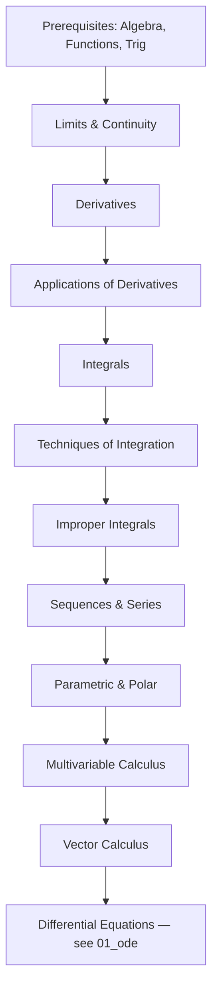

# Calculus, Taught as a Decision Tree


> Companion repository to [`01_ode`](../01_ode) and [`02_vector`](../02_vector)
> in `butex-notes/MATH-103`. Where those cover ODEs and vector calculus in
> depth, this repo covers everything that comes *before* them: limits,
> derivatives, integrals, series, and multivariable calculus — organized the
> same way, as a workflow you run rather than a book you read.

---

## Why this exists

Most Calculus courses are taught chapter by chapter, and most students study
them the same way — memorizing formulas per chapter without a way to decide
*which* formula applies to a problem they've never seen before.

This repository flips that. Every topic is framed as a question:

> *"Given this problem, what do I check first, second, third — until I know
> exactly which technique to use?"*

That question, asked recursively, is the [`WORKFLOW.md`](WORKFLOW.md) at the
center of this repo. The rest of the material exists to make each node in
that tree fast to look up and hard to forget.

---

## Table of Contents

- [How to use this repository](#how-to-use-this-repository)
- [Repository map](#repository-map)
- [The full syllabus, as a roadmap](#the-full-syllabus-as-a-roadmap)
- [The master workflow](#the-master-workflow)
- [Lesson format](#lesson-format)
- [Roadmaps](#roadmaps)
- [Cheat sheets](#cheat-sheets)
- [Practice sets](#practice-sets)
- [Prerequisites](#prerequisites)
- [Relationship to the ODE and Vector notes](#relationship-to-the-ode-and-vector-notes)
- [Contributing / personal use notes](#contributing--personal-use-notes)

---

## How to use this repository

1. **Don't start at Chapter 1 by default.** Start at [`ROADMAP.md`](ROADMAP.md),
   find where you actually are, and jump in there.
2. **Use [`WORKFLOW.md`](WORKFLOW.md) during problem-solving**, not during
   first-time learning. It's a lookup tool, not a tutorial.
3. **Read a lesson top to bottom once**, then use only its *Summary* and
   *Examples* sections on every later pass.
4. **Solutions are hidden by default** inside `<details>` blocks. Attempt every
   problem before expanding one — the hint is there so you rarely need to.
5. **Before an exam**, use `appendix/exam-tips.md` and `practice/mixed-review-sets.md`
   instead of re-reading full lessons.

---

## Repository map

See [`STRUCTURE.md`](STRUCTURE.md) for the complete file tree. High level:

```text
01-prerequisites/              Algebra, functions, trig, limits you already know
02-limits/                     Limits, limit laws, continuity
03-derivatives/                Definitions and differentiation rules
04-applications-of-derivatives/ Optimization, curve sketching, L'Hôpital
05-integrals/                  Antiderivatives → Riemann sums → FTC
06-techniques-of-integration/  Parts, trig sub, partial fractions
07-improper-integrals/         Infinite bounds, discontinuous integrands
08-sequences-series/           Convergence tests, Taylor/Maclaurin series
09-parametric-polar/           Parametric curves, polar coordinates
10-multivariable/              Partial derivatives, multiple integrals
11-vector-calculus/            Line/surface integrals, Green's/Stokes'/Divergence
12-differential-equations/     Bridge to the full 01_ode notes
roadmaps/                      Complete, semester, weekly, daily, exam roadmaps
cheatsheets/                   One-page formula references
practice/                      Graded exercise sets, solutions hidden
appendix/                      Glossary, common mistakes, exam tips
```

---

## The full syllabus, as a roadmap



A one-page ASCII version lives in
[`roadmaps/one-page-visual-roadmap.md`](roadmaps/one-page-visual-roadmap.md);
semester-, weekly-, and daily-paced versions are in [`roadmaps/`](roadmaps/).

---

## The master workflow

Every calculus problem — regardless of chapter — starts with the same three
questions. The full decision tree (with sub-trees for limits, derivatives,
integration technique selection, and series convergence tests) lives in
[`WORKFLOW.md`](WORKFLOW.md). Preview:

```text
Given an expression or function

↓

Is a limit being asked for?
│
├── Yes → go to Limits workflow
└── No

↓

Is a rate of change / slope being asked for?
│
├── Yes → go to Derivatives workflow
└── No

↓

Is an area / accumulation / total being asked for?
│
├── Yes → go to Integrals workflow
│         │
│         ├── Elementary antiderivative? → direct integration
│         ├── Product of functions? → integration by parts
│         ├── Rational function? → partial fractions
│         ├── sqrt(a²±x²) form? → trig substitution
│         └── None of the above? → numerical methods
│
└── No

↓

Is convergence / long-term behavior being asked for?
│
├── Yes → go to Series workflow
└── No

↓

Multiple variables involved?
│
├── Yes → go to Multivariable / Vector Calculus workflow
└── No
```

---

## Lesson format

Every lesson file follows the same fixed structure, so you always know where
to find what you need:

| # | Section | Purpose |
|---|---------|---------|
| 1 | Learning objectives | What you should be able to do after this lesson |
| 2 | Prerequisites | Links to lessons you need before this one |
| 3 | Intuition before mathematics | Plain-language idea, no symbols yet |
| 4 | Formal definitions | Precise mathematical statements |
| 5 | Theorems | Named results with exact hypotheses |
| 6 | Proof sketch | Where appropriate — not full rigor, just the idea |
| 7 | Visual explanation | ASCII diagrams / Mermaid graphs |
| 8 | Step-by-step derivations | How the formula is actually built |
| 9 | Worked examples | Fully solved, reasoning shown |
| 10 | Practice problems | Solutions hidden in `<details>` |
| 11 | Challenge problems | Harder, often exam-style |
| 12 | Common mistakes | What trips students up specifically here |
| 13 | Exam tips | What's actually tested, and how |
| 14 | Summary | 5–10 line recap |
| 15 | Navigation | Links to previous/next topic |

Example spoiler format used throughout:

```markdown
## Example

Evaluate ∫ x·eˣ dx.

<details>
<summary>Hint</summary>

Which factor gets easier when you differentiate it?

</details>

<details>
<summary>Solution</summary>

Complete step-by-step solution with reasoning.

</details>
```

---

## Roadmaps

| File | Use case |
|------|----------|
| [`complete-roadmap.md`](roadmaps/complete-roadmap.md) | Full course from prerequisites to vector calculus |
| [`semester-roadmap.md`](roadmaps/semester-roadmap.md) | Paced across a 14–16 week semester |
| [`weekly-roadmap.md`](roadmaps/weekly-roadmap.md) | Topic-by-topic weekly breakdown |
| [`daily-roadmap.md`](roadmaps/daily-roadmap.md) | Daily study blocks for a fixed deadline |
| [`exam-revision-roadmap.md`](roadmaps/exam-revision-roadmap.md) | Compressed pre-exam pass |
| [`one-page-visual-roadmap.md`](roadmaps/one-page-visual-roadmap.md) | Single-page overview, printable |

---

## Cheat sheets

Located in [`cheatsheets/`](cheatsheets/): differentiation rules, integration
formulas, trigonometric identities, hyperbolic identities, Taylor/Maclaurin
series, vector identities, coordinate conversions, and limit identities —
each a single page, no derivations, pure reference.

---

## Practice sets

Located in [`practice/`](practice/), graded from beginner to challenge level,
plus mixed-review and previous-year-style question sets. All solutions are
hidden in Markdown spoilers so the sets double as exam simulations.

---

## Prerequisites

You should be comfortable with, or willing to review in
[`01-prerequisites/`](01-prerequisites/):

- Algebraic manipulation and factoring
- Function notation, domain/range, composition and inverses
- Trigonometric identities and the unit circle
- Exponentials and logarithms

No prior calculus is assumed.

---

## Relationship to the ODE and Vector notes

This repository is deliberately scoped to stop *before* differential
equations and to treat vector calculus (line/surface integrals, Green's,
Stokes', Divergence theorems) at an introductory level only.
[`12-differential-equations/overview.md`](12-differential-equations/overview.md)
is a short bridge file that links directly into the existing
[`01_ode`](../01_ode) notes, and the vector calculus section here is meant as
a lighter on-ramp to the full [`02_vector`](../02_vector) series rather than a
duplicate of it.

---

## Contributing / personal use notes

This repo is generated iteratively, one file at a time, against a fixed
lesson template so that later files stay consistent with earlier ones.
Math rendering follows GitHub-compatible syntax throughout (no raw LaTeX
environments that GitHub can't render) — the same conversion discipline used
in the ODE handbook in this repo.

---

**Next:** [`ROADMAP.md`](ROADMAP.md) · [`WORKFLOW.md`](WORKFLOW.md) · [`01-prerequisites/`](01-prerequisites/)
