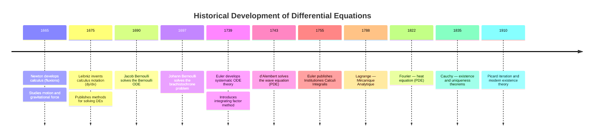
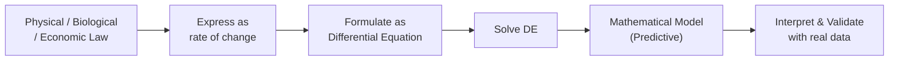
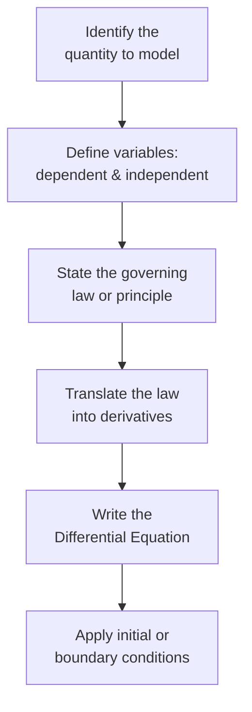
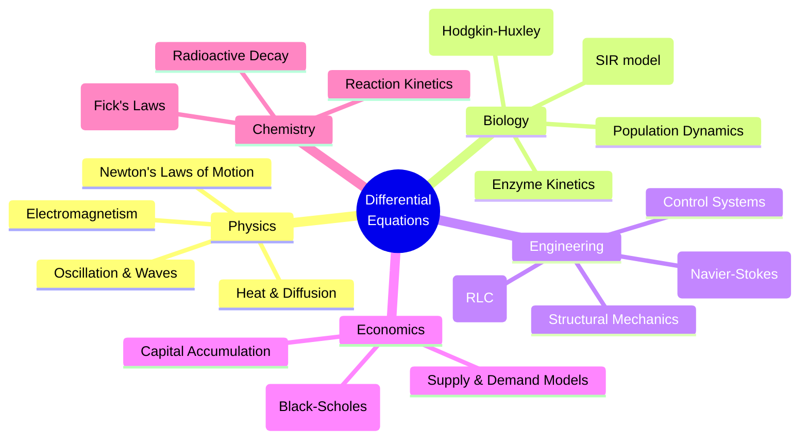

# 01 — Origin of Differential Equations

> **Course:** Ordinary Differential Equations · **Unit:** 1 of 5
> **Date:** 2026-06-04 · **Author:** `itachi_re`

---

## 📋 Table of Contents

1. [What is a Differential Equation?](#1-what-is-a-differential-equation)
2. [Historical Background](#2-historical-background)
3. [How Differential Equations Arise](#3-how-differential-equations-arise)
4. [Basic Terminology](#4-basic-terminology)
5. [Formulating a DE from a Physical Law](#5-formulating-a-de-from-a-physical-law)
6. [Real-World Applications Overview](#6-real-world-applications-overview)
7. [General and Particular Solutions](#7-general-and-particular-solutions)
8. [Worked Examples](#8-worked-examples)
9. [References](#9-references)

---

## 1. What is a Differential Equation?

### 1.1 Definition

> **A differential equation (DE)** is an equation that relates an unknown function with one or more of its derivatives.

Formally, a differential equation in one unknown function $y$ of an independent variable $x$ is an equation of the form:

$$F\!\left(x,\; y,\; y',\; y'',\; \ldots,\; y^{(n)}\right) = 0$$

where:
- $y = y(x)$ is the **unknown function** (dependent variable)
- $x$ is the **independent variable**
- $y', y'', \ldots, y^{(n)}$ are the successive **derivatives** of $y$ with respect to $x$

### 1.2 Simple Examples

| Equation | Type |
|----------|------|
| $\dfrac{dy}{dx} = 3x^2$ | ODE, 1st order |
| $y'' + 4y = 0$ | ODE, 2nd order |
| $\dfrac{d^2y}{dx^2} - 2\dfrac{dy}{dx} + y = e^x$ | ODE, 2nd order, non-homogeneous |
| $\dfrac{\partial^2 u}{\partial x^2} + \dfrac{\partial^2 u}{\partial y^2} = 0$ | PDE (Laplace) |

> **Key distinction:** An *ordinary* DE involves derivatives with respect to **one variable**. A *partial* DE involves **partial derivatives** with respect to **two or more variables**.

---

## 2. Historical Background

The study of differential equations began alongside the invention of calculus in the 17th century:

### 2.1 Newton's Contribution

Isaac Newton used differential equations (which he called *fluxional equations*) to describe:
- Planetary motion (inverse-square law)
- Cooling of bodies
- Gravitational attraction

His second law of motion $\mathbf{F} = m\mathbf{a}$ is inherently a second-order ODE because $\mathbf{a} = \dfrac{d^2\mathbf{x}}{dt^2}$.

### 2.2 Leibniz's Notation

Gottfried Leibniz introduced the notation $\dfrac{dy}{dx}$, which made it easier to manipulate and solve DEs algebraically — the notation we still use today.

### 2.3 Leonhard Euler

Euler was the first to classify and systematically solve many types of ODEs:
- Formulated the **Euler–Cauchy equation**
- Developed the **integrating factor** technique
- Introduced the **characteristic equation** for constant-coefficient ODEs

---

## 3. How Differential Equations Arise

Differential equations arise naturally whenever we express a **rate of change** as a mathematical relationship.

### 3.1 The Core Idea

$$\text{Rate of change of quantity} = f(\text{quantity, time, other variables})$$

### 3.2 Key Physical Scenarios

#### ① Newton's Second Law of Motion

If a mass $m$ moves under force $F$:

$$m\frac{d^2x}{dt^2} = F(t,x,\dot{x})$$

This is a **2nd order ODE** describing position $x(t)$.

#### ② Newton's Law of Cooling

The rate at which a body cools is proportional to the difference between its temperature $T$ and the ambient temperature $T_0$:

$$\frac{dT}{dt} = -k(T - T_0), \quad k > 0$$

This is a **1st order linear ODE**.

#### ③ Radioactive Decay

The rate of decay of a radioactive substance is proportional to the amount present:

$$\frac{dN}{dt} = -\lambda N$$

where $\lambda > 0$ is the **decay constant**. Solution: $N(t) = N_0 e^{-\lambda t}$.

#### ④ Population Growth (Malthusian Model)

$$\frac{dP}{dt} = rP$$

where $r$ is the intrinsic growth rate. Solution: $P(t) = P_0 e^{rt}$.

#### ⑤ Logistic Growth (More Realistic)

$$\frac{dP}{dt} = rP\!\left(1 - \frac{P}{K}\right)$$

where $K$ is the **carrying capacity**.

#### ⑥ Simple Harmonic Motion

A spring-mass system with no damping:

$$m\frac{d^2x}{dt^2} + kx = 0$$

Dividing by $m$:

$$\frac{d^2x}{dt^2} + \omega^2 x = 0, \quad \omega = \sqrt{k/m}$$

Solution: $x(t) = A\cos(\omega t) + B\sin(\omega t)$.

#### ⑦ RLC Electrical Circuit

A series RLC circuit obeys Kirchhoff's voltage law:

$$L\frac{d^2q}{dt^2} + R\frac{dq}{dt} + \frac{q}{C} = E(t)$$

where $q(t)$ is the charge, $L$ is inductance, $R$ is resistance, $C$ is capacitance, $E(t)$ is the EMF.

---

## 4. Basic Terminology

### 4.1 Key Terms Table

| Term | Definition |
|------|-----------|
| **Dependent variable** | The unknown function being solved for, e.g. $y(x)$ |
| **Independent variable** | The variable with respect to which derivatives are taken, e.g. $x$ or $t$ |
| **Order** | The order of the highest derivative present in the DE |
| **Degree** | The exponent of the highest-order derivative (when the DE is polynomial in derivatives) |
| **Solution** | A function $y = \phi(x)$ that satisfies the DE on some interval |
| **General solution** | Solution containing arbitrary constants (one per order) |
| **Particular solution** | Obtained by fixing the arbitrary constants using initial/boundary conditions |
| **Singular solution** | A solution not obtainable from the general solution by any value of the constant(s) |

### 4.2 Order and Degree Examples

| Differential Equation | Order | Degree |
|-----------------------|-------|--------|
| $y' = x + 1$ | 1 | 1 |
| $(y'')^3 + 2y' - y = 0$ | 2 | 3 |
| $y''' - \sin(y'') = x$ | 3 | Not defined (non-polynomial) |
| $\sqrt{y''} + y = x^2$ | 2 | 2 (after squaring) |

> ⚠️ **Note:** The degree is only defined when the equation is a **polynomial** in its derivatives.

---

## 5. Formulating a DE from a Physical Law

### Step-by-Step Process

### Example: Deriving the Cooling Equation

**Scenario:** A cup of coffee at 90°C is placed in a room at 20°C. Formulate a DE.

1. **Quantity:** Temperature $T$ of the coffee
2. **Variable:** Time $t$
3. **Law:** Newton's Law of Cooling — the rate of change of temperature is proportional to the excess temperature over ambient
4. **Translation:**

$$\frac{dT}{dt} \propto -(T - 20)$$

$$\Rightarrow \frac{dT}{dt} = -k(T - 20), \quad k > 0$$

5. **Initial condition:** $T(0) = 90$

This is now a **1st order IVP** (Initial Value Problem).

---

## 6. Real-World Applications Overview

### Application Summary Table

| Field | DE | Meaning |
|-------|----|---------|
| **Mechanics** | $m\ddot{x} + c\dot{x} + kx = F(t)$ | Damped forced oscillator |
| **Electricity** | $L\ddot{q} + R\dot{q} + q/C = E(t)$ | Series RLC circuit |
| **Biology** | $\dot{P} = rP(1 - P/K)$ | Logistic population growth |
| **Heat** | $\dot{T} = -k(T - T_0)$ | Newton's cooling |
| **Chemistry** | $\dot{N} = -\lambda N$ | Radioactive decay |
| **Finance** | $dS = \mu S\,dt + \sigma S\,dW$ | Black-Scholes (SDE) |
| **Epidemiology** | $\dot{I} = \beta SI - \gamma I$ | Infected population in SIR |

---

## 7. General and Particular Solutions

### 7.1 General Solution

The **general solution** of an $n$th-order ODE contains exactly $n$ arbitrary constants $C_1, C_2, \ldots, C_n$.

**Reason:** Solving a DE involves $n$ integrations, each introducing one constant.

**Example:** Solve $y'' = 6x$.

$$y' = \int 6x\,dx = 3x^2 + C_1$$

$$y = \int (3x^2 + C_1)\,dx = x^3 + C_1 x + C_2$$

General solution: $y = x^3 + C_1 x + C_2$ (two constants for a 2nd-order DE ✓)

### 7.2 Particular Solution

Fix the constants using **initial conditions** or **boundary conditions**.

**Example (continued):** With $y(0) = 1$ and $y'(0) = -2$:

$$y'(0) = 0 + C_1 = -2 \Rightarrow C_1 = -2$$

$$y(0) = 0 + 0 + C_2 = 1 \Rightarrow C_2 = 1$$

Particular solution: $y = x^3 - 2x + 1$

### 7.3 Singular Solution

A **singular solution** satisfies the DE but cannot be obtained from the general solution.

**Classic example:** Clairaut's equation $y = xy' + f(y')$

The general solution is a family of straight lines. The singular solution is an **envelope** of this family.

---

## 8. Worked Examples

### Example 1: Verify a Solution

**Problem:** Show that $y = e^{-3x}$ satisfies $y' + 3y = 0$.

**Solution:**

$$y = e^{-3x} \implies y' = -3e^{-3x}$$

Substituting:

$$y' + 3y = -3e^{-3x} + 3e^{-3x} = 0 \checkmark$$

---

### Example 2: Formulate from Geometry

**Problem:** The slope of a curve at every point $(x, y)$ equals twice the $x$-coordinate. Formulate and solve the DE.

**Formulation:**

$$\frac{dy}{dx} = 2x$$

**Solution:**

$$y = \int 2x\,dx = x^2 + C$$

This represents a **family of parabolas** $y = x^2 + C$.

---

### Example 3: Radioactive Decay

**Problem:** Radium-226 has a half-life of 1600 years. If we start with 100 mg, how much remains after 500 years?

**Setup:**

$$\frac{dN}{dt} = -\lambda N, \quad N(0) = 100 \text{ mg}$$

**Find** $\lambda$ using half-life $t_{1/2} = 1600$ years:

$$N(1600) = 50 \implies 100 e^{-1600\lambda} = 50$$

$$e^{-1600\lambda} = \frac{1}{2} \implies \lambda = \frac{\ln 2}{1600}$$

**After 500 years:**

$$N(500) = 100 \cdot e^{-\frac{\ln 2}{1600} \cdot 500} = 100 \cdot 2^{-500/1600} = 100 \cdot 2^{-5/16}$$

$$N(500) \approx 100 \times 0.8027 \approx \boxed{80.27 \text{ mg}}$$

---

### Example 4: Spring-Mass System

**Problem:** A spring with constant $k = 4$ N/m has a mass $m = 1$ kg attached. Find the equation of motion.

$$m\frac{d^2x}{dt^2} + kx = 0 \implies \frac{d^2x}{dt^2} + 4x = 0$$

This is a **2nd-order linear homogeneous ODE** with solution:

$$x(t) = A\cos(2t) + B\sin(2t)$$

The mass oscillates with angular frequency $\omega = 2$ rad/s, period $T = \pi$ s.

---

## 9. References

| Resource | Type | Link |
|----------|------|------|
| Boyce & DiPrima, *Elementary Differential Equations* (12th ed.) | Textbook | Classic university textbook |
| Simmons, *Differential Equations with Applications* | Textbook | Excellent applied treatment |
| MIT OCW 18.03 Lecture Notes | Lecture notes | [ocw.mit.edu](https://ocw.mit.edu/courses/18-03-differential-equations-spring-2010/pages/readings/) |
| Paul's Online Math Notes — DE | Online notes | [tutorial.math.lamar.edu](https://tutorial.math.lamar.edu/Classes/DE/DE.aspx) |
| LibreTexts — Intro to DEs | Online textbook | [math.libretexts.org](https://math.libretexts.org/Bookshelves/Differential_Equations/Differential_Equations_for_Engineers_(Lebl)/0:_Introduction) |
| Wikipedia — Ordinary Differential Equation | Reference | [en.wikipedia.org/wiki/Ordinary_differential_equation](https://en.wikipedia.org/wiki/Ordinary_differential_equation) |
| 3Blue1Brown — What is a Differential Equation? | Video | [youtube.com/watch?v=p_di4Zn4wz4](https://www.youtube.com/watch?v=p_di4Zn4wz4) |

---

> ⬅️ [Back to ODE Index](./README.md) · ➡️ [Next: Classification of DEs](./02-Classification-of-Differential-Equations.md)
