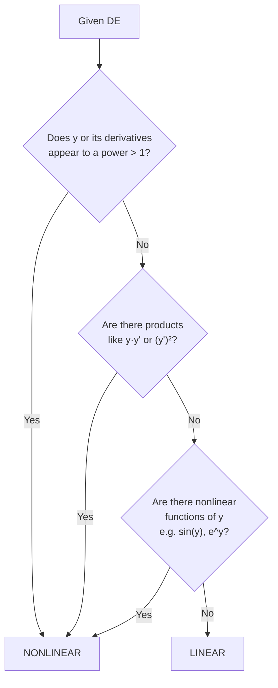
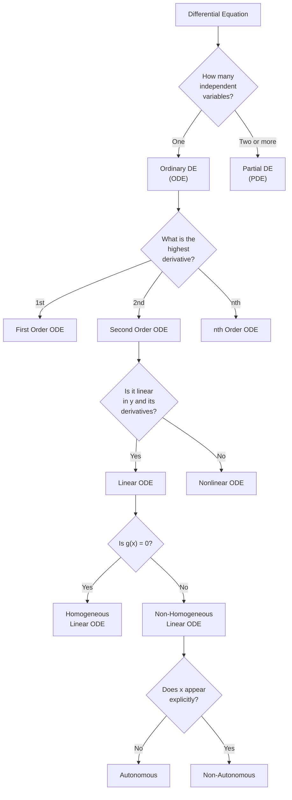
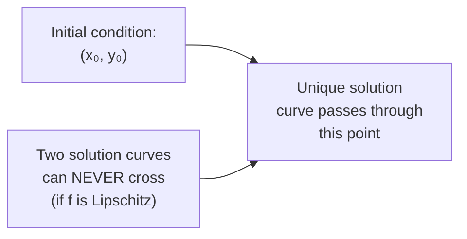

# 02 — Classification of Differential Equations

> **Course:** Ordinary Differential Equations · **Unit:** 2 of 5
> **Date:** 2026-06-04 · **Author:** `itachi_re`

---

## 📋 Table of Contents

1. [ODE vs PDE](#1-ode-vs-pde)
2. [Order of a Differential Equation](#2-order-of-a-differential-equation)
3. [Degree of a Differential Equation](#3-degree-of-a-differential-equation)
4. [Linear vs Nonlinear](#4-linear-vs-nonlinear)
5. [Homogeneous vs Non-Homogeneous](#5-homogeneous-vs-non-homogeneous)
6. [Autonomous vs Non-Autonomous](#6-autonomous-vs-non-autonomous)
7. [Initial Value Problems vs Boundary Value Problems](#7-initial-value-problems-vs-boundary-value-problems)
8. [Complete Classification Flowchart](#8-complete-classification-flowchart)
9. [Worked Classification Examples](#9-worked-classification-examples)
10. [Existence and Uniqueness Theorems](#10-existence-and-uniqueness-theorems)
11. [References](#11-references)

---

## 1. ODE vs PDE

### 1.1 Ordinary Differential Equation (ODE)

> **Definition:** An ODE is a differential equation in which the unknown function depends on a **single independent variable**, and only ordinary (not partial) derivatives appear.

**Standard form:**

$$F\!\left(x,\;y,\;\frac{dy}{dx},\;\frac{d^2y}{dx^2},\;\ldots,\;\frac{d^ny}{dx^n}\right) = 0$$

**Examples:**

$$\frac{dy}{dx} = y \quad \text{(exponential growth)}$$

$$\frac{d^2y}{dt^2} + 2\frac{dy}{dt} + y = \sin t \quad \text{(damped oscillator)}$$

### 1.2 Partial Differential Equation (PDE)

> **Definition:** A PDE is a differential equation where the unknown function depends on **two or more independent variables**, and partial derivatives appear.

**Examples:**

$$\frac{\partial^2 u}{\partial x^2} + \frac{\partial^2 u}{\partial y^2} = 0 \quad \text{(Laplace equation)}$$

$$\frac{\partial u}{\partial t} = k\frac{\partial^2 u}{\partial x^2} \quad \text{(Heat equation)}$$

### 1.3 Side-by-Side Comparison

| Feature | ODE | PDE |
|---------|-----|-----|
| Independent variables | 1 | 2 or more |
| Derivative type | Ordinary $\dfrac{d}{dx}$ | Partial $\dfrac{\partial}{\partial x}$ |
| Example | $y'' + y = 0$ | $u_{xx} + u_{yy} = 0$ |
| Typical application | Motion, circuits, growth | Heat, waves, fluids |
| Complexity | Generally lower | Generally higher |

---

## 2. Order of a Differential Equation

> **Definition:** The **order** of a DE is the order of the highest-order derivative present in the equation.

### 2.1 Determining Order

| Equation | Highest derivative | Order |
|----------|-------------------|-------|
| $y' = x^2 + 1$ | $y'$ (1st) | **1** |
| $y'' - 3y' + 2y = 0$ | $y''$ (2nd) | **2** |
| $y''' + (y')^2 = e^x$ | $y'''$ (3rd) | **3** |
| $y^{(4)} - y = \tan x$ | $y^{(4)}$ (4th) | **4** |

### 2.2 Physical Significance of Order

| Order | Physical Meaning | Example |
|-------|-----------------|---------|
| 1st | Rate of change | Population growth $\dot{P} = rP$ |
| 2nd | Acceleration (Newton's 2nd law) | Spring: $m\ddot{x} + kx = 0$ |
| 3rd | Jerk (rate of change of acceleration) | Beam deflection theory |
| 4th | Snap | Euler–Bernoulli beam $EI y^{(4)} = q(x)$ |

---

## 3. Degree of a Differential Equation

> **Definition:** The **degree** of a DE is the **exponent (power)** of the highest-order derivative, after the equation has been cleared of radicals and fractions in its derivatives.

> ⚠️ The degree is only defined when the DE is a **polynomial** in its derivatives.

### 3.1 Examples

| Equation | Highest-order term | Degree |
|----------|--------------------|--------|
| $(y'')^3 + y' - y = 0$ | $(y'')^3$ | **3** |
| $y'' + \sqrt{y'} = x$ | After squaring: $(y'')^2 + \ldots$ | **1** for $y''$ in original |
| $y'' + \sin(y') = 0$ | $\sin(y')$ is transcendental | **Not defined** |
| $y' = x + y$ | $y'$ to power 1 | **1** |

### 3.2 Step-by-Step: Finding Degree

**Problem:** Find the degree of $\sqrt{y''} + y = x$.

**Step 1:** Isolate the radical:

$$\sqrt{y''} = x - y$$

**Step 2:** Square both sides:

$$y'' = (x - y)^2$$

**Step 3:** Highest-order derivative is $y''$, raised to power 1.

**Degree = 1**

---

## 4. Linear vs Nonlinear

### 4.1 Definition of Linear ODE

> A DE is **linear** if it can be written as:
>
> $$a_n(x)\,y^{(n)} + a_{n-1}(x)\,y^{(n-1)} + \cdots + a_1(x)\,y' + a_0(x)\,y = g(x)$$
>
> where the $a_i(x)$ and $g(x)$ are functions of $x$ **only**, and:
> - $y$ and all its derivatives appear to the **first power**
> - No products of $y$ and its derivatives appear
> - No nonlinear functions of $y$ (e.g., $\sin y$, $e^y$, $y^2$) appear

### 4.2 Linearity Check

### 4.3 Examples

| Equation | Linear? | Reason |
|----------|---------|--------|
| $y'' - 2y' + y = e^x$ | ✅ Linear | All terms have $y$, $y'$, $y''$ to 1st power |
| $y'' + y^2 = 0$ | ❌ Nonlinear | $y^2$ term |
| $y' + \sin(y) = 0$ | ❌ Nonlinear | $\sin(y)$ is nonlinear in $y$ |
| $y'' + x^2 y = \cos x$ | ✅ Linear | $x^2$ is a coefficient, not a power of $y$ |
| $yy' = x$ | ❌ Nonlinear | Product of $y$ and $y'$ |
| $y' + e^x y = x^2$ | ✅ Linear | $e^x$ is a coefficient in $x$, not in $y$ |

### 4.4 Why Linearity Matters

Linear ODEs satisfy the **superposition principle**:

> If $y_1$ and $y_2$ are solutions of the homogeneous linear ODE $L[y] = 0$, then $c_1 y_1 + c_2 y_2$ is also a solution for any constants $c_1, c_2$.

This is the **key tool** for building the general solution.

**Proof of Superposition:**

Let $L[y] \equiv a_n y^{(n)} + \cdots + a_0 y$. If $L[y_1] = 0$ and $L[y_2] = 0$, then by linearity of differentiation:

$$L[c_1 y_1 + c_2 y_2] = c_1 L[y_1] + c_2 L[y_2] = c_1 \cdot 0 + c_2 \cdot 0 = 0 \quad \checkmark$$

---

## 5. Homogeneous vs Non-Homogeneous

> ⚠️ The word "homogeneous" has **two different meanings** in ODE. Be careful!

### 5.1 Meaning 1: For Linear DEs (Standard Usage)

> A linear ODE $a_n(x)y^{(n)} + \cdots + a_0(x)y = g(x)$ is:
> - **Homogeneous** if $g(x) = 0$ (right-hand side is zero)
> - **Non-homogeneous** if $g(x) \neq 0$ (right-hand side is non-zero)

| Equation | Homogeneous? |
|----------|-------------|
| $y'' - 3y' + 2y = 0$ | ✅ Yes ($g = 0$) |
| $y'' - 3y' + 2y = e^x$ | ❌ No ($g = e^x$) |
| $y' + y = 0$ | ✅ Yes |
| $y' + y = \sin x$ | ❌ No |

### 5.2 Meaning 2: For 1st-Order DEs (Substitution Type)

A 1st-order ODE $\dfrac{dy}{dx} = f(x, y)$ is called **homogeneous of type II** if $f(x,y)$ can be written purely as a function of the ratio $y/x$:

$$\frac{dy}{dx} = f\!\left(\frac{y}{x}\right)$$

**Test:** Replace $x \to tx$ and $y \to ty$. If $f(tx, ty) = f(x, y)$ (degree-zero homogeneity), it is type-II homogeneous.

**Example:** $\dfrac{dy}{dx} = \dfrac{x + y}{x} = 1 + \dfrac{y}{x}$ — this is type-II homogeneous.

**Solution method:** Use substitution $v = y/x$, so $y = vx$ and $y' = v + xv'$.

### 5.3 Structure of Solution for Non-Homogeneous Linear ODE

$$y_{\text{general}} = y_{\text{complementary}} + y_{\text{particular}}$$

where:
- $y_c$ = general solution of the associated homogeneous equation ($g = 0$)
- $y_p$ = any particular solution of the full non-homogeneous equation

---

## 6. Autonomous vs Non-Autonomous

> **Definition:** An ODE is **autonomous** if the independent variable does not appear explicitly in the equation.

$$\frac{dy}{dt} = f(y) \quad \text{(autonomous)}$$

$$\frac{dy}{dt} = f(t, y) \quad \text{(non-autonomous)}$$

### Examples

| Equation | Autonomous? |
|----------|-------------|
| $y' = y(1-y)$ | ✅ Yes (logistic) |
| $y' = y - t$ | ❌ No ($t$ appears) |
| $y'' + \omega^2 y = 0$ | ✅ Yes (SHM) |
| $y'' + t y' = 0$ | ❌ No ($t$ appears) |

**Why it matters:** For autonomous systems, the behavior depends only on the **current state**, not on when it started — time-translation invariance.

---

## 7. Initial Value Problems vs Boundary Value Problems

### 7.1 Initial Value Problem (IVP)

All conditions are specified at a **single point** $x_0$:

$$y^{(n)} = f(x, y, y', \ldots, y^{(n-1)}), \quad y(x_0) = y_0,\; y'(x_0) = y_1,\; \ldots,\; y^{(n-1)}(x_0) = y_{n-1}$$

**Example:**

$$y'' + y = 0, \quad y(0) = 1,\; y'(0) = 0$$

**Physical meaning:** Given a complete "snapshot" at one moment in time.

### 7.2 Boundary Value Problem (BVP)

Conditions are specified at **two or more different points**:

$$y'' = f(x,y,y'), \quad y(a) = \alpha,\; y(b) = \beta$$

**Example:**

$$y'' + y = 0, \quad y(0) = 0,\; y(\pi) = 0$$

**Physical meaning:** Conditions at the two ends of a physical domain (e.g., a beam supported at both ends).

### 7.3 Comparison

| Feature | IVP | BVP |
|---------|-----|-----|
| Conditions at | One point | Two or more points |
| Typical application | Dynamics (time evolution) | Steady states, deflections |
| Existence/Uniqueness | Well-studied (Picard) | More subtle (may have 0, 1, or ∞ solutions) |

---

## 8. Complete Classification Flowchart

---

## 9. Worked Classification Examples

### Example Set: Classify Each Equation

**① $y' = 3y$**

- Independent variable: $x$ (or $t$) — **ODE**
- Highest derivative: $y'$ — **1st order**
- $y$ appears to 1st power — **Linear**
- No function of $x$ on RHS — can write as $y' - 3y = 0$ — **Homogeneous**
- No explicit $x$ — **Autonomous**

**Classification:** *1st-order, linear, homogeneous, autonomous ODE*

---

**② $y'' + x^2 y' + e^x y = \sin x$**

- One independent variable — **ODE**
- Highest derivative: $y''$ — **2nd order**
- All terms linear in $y$, $y'$, $y''$ — **Linear**
- RHS $= \sin x \neq 0$ — **Non-homogeneous**
- $x$ appears — **Non-autonomous**

**Classification:** *2nd-order, linear, non-homogeneous, non-autonomous ODE*

---

**③ $y'' + (y')^2 = 0$**

- One independent variable — **ODE**
- Highest derivative: $y''$ — **2nd order**
- $(y')^2$ is quadratic in $y'$ — **Nonlinear**

**Classification:** *2nd-order, nonlinear ODE*

---

**④ $(y'')^3 + 2y' - y = 0$**

- ODE, highest derivative $y''$ → **2nd order**
- $(y'')^3$ → **degree 3**
- Nonlinear (power of $y''$ > 1)

**Classification:** *2nd-order, degree 3, nonlinear ODE*

---

**⑤ $\dfrac{d^2u}{dx^2} + \dfrac{d^2u}{dy^2} = 0$**

- Two independent variables $x$ and $y$ — **PDE**
- Laplace equation — **2nd-order, linear PDE**

---

### Summary Table

| Equation | Order | Degree | Linear? | Homogeneous? |
|----------|-------|--------|---------|-------------|
| $y' = 3y$ | 1 | 1 | ✅ | ✅ |
| $y'' + x^2y = \sin x$ | 2 | 1 | ✅ | ❌ |
| $y'' + (y')^2 = 0$ | 2 | 1* | ❌ | — |
| $(y'')^3 + y = 0$ | 2 | 3 | ❌ | — |
| $y''' = e^x y$ | 3 | 1 | ✅ | ✅ |

*Degree of overall equation counting $y''$ as linear but equation is nonlinear due to $(y')^2$.

---

## 10. Existence and Uniqueness Theorems

### 10.1 Picard–Lindelöf Theorem (1st Order IVP)

> **Theorem:** Consider the IVP $\dfrac{dy}{dx} = f(x, y)$, $y(x_0) = y_0$.
>
> If $f$ and $\dfrac{\partial f}{\partial y}$ are **continuous** on some rectangle $R = \{|x - x_0| \leq a,\; |y - y_0| \leq b\}$, then there exists an interval $|x - x_0| < h$ on which the IVP has a **unique solution**.

**Implication:** Smooth equations have unique solutions — solutions don't cross.

### 10.2 For Linear ODEs (Stronger Result)

> **Theorem:** If $a_n(x), \ldots, a_0(x)$ and $g(x)$ are continuous on $[a, b]$ and $a_n(x) \neq 0$ on $[a, b]$, then the IVP for the $n$th-order linear ODE has a **unique solution on the entire interval $[a,b]$**.

This is much stronger than the nonlinear case!

### 10.3 Geometric Interpretation

When $\partial f / \partial y$ exists and is continuous, the solution curves of $y' = f(x,y)$ form a family that **never intersects**.

---

## 11. References

| Resource | Link |
|----------|------|
| LibreTexts — Classification of DEs | [math.libretexts.org](https://math.libretexts.org/Bookshelves/Differential_Equations/Differential_Equations_for_Engineers_(Lebl)/0:_Introduction/0.3:_Classification_of_Differential_Equations) |
| Penn State — Section 1.2 Classification | [psu.pb.unizin.org](https://psu.pb.unizin.org/differentialequations/chapter/chapter-2/) |
| Wikipedia — ODE | [en.wikipedia.org](https://en.wikipedia.org/wiki/Ordinary_differential_equation) |
| Paul's Online Math Notes | [tutorial.math.lamar.edu](https://tutorial.math.lamar.edu/Classes/DE/Definitions.aspx) |
| MIT OCW 18.03 | [ocw.mit.edu](https://ocw.mit.edu/courses/18-03-differential-equations-spring-2010/) |

---

> ⬅️ [Previous: Origin of DEs](./01-Origin-of-Differential-Equations.md) · ➡️ [Next: First Order ODE](./03-First-Order-ODE.md)
