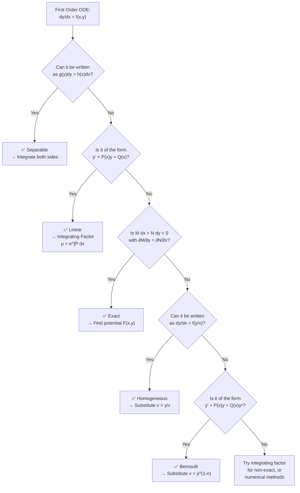

# 03 — Solution of First Order ODEs

> **Course:** Ordinary Differential Equations · **Unit:** 3 of 5
> **Date:** 2026-06-04 · **Author:** `itachi_re`

---

## 📋 Table of Contents

1. [Overview and Strategy Map](#1-overview-and-strategy-map)
2. [Separable Equations](#2-separable-equations)
3. [Linear First-Order Equations (Integrating Factor)](#3-linear-first-order-equations-integrating-factor)
4. [Exact Equations](#4-exact-equations)
5. [Homogeneous Equations (Substitution)](#5-homogeneous-equations-substitution)
6. [Bernoulli Equations](#6-bernoulli-equations)
7. [Applications of First-Order ODEs](#7-applications-of-first-order-odes)
8. [Summary Comparison Table](#8-summary-comparison-table)
9. [References](#9-references)

---

## 1. Overview and Strategy Map

When you encounter a first-order ODE, use this decision flowchart to pick the right method:



---

## 2. Separable Equations

### 2.1 Definition

> A 1st-order ODE is **separable** if it can be written so that all $y$-terms are on one side and all $x$-terms on the other:

$$\frac{dy}{dx} = g(x)\cdot h(y) \quad \Longleftrightarrow \quad \frac{dy}{h(y)} = g(x)\,dx$$

### 2.2 Solution Method

**Step 1:** Rewrite as $\dfrac{dy}{h(y)} = g(x)\,dx$

**Step 2:** Integrate both sides:

$$\int \frac{dy}{h(y)} = \int g(x)\,dx + C$$

**Step 3:** Solve for $y$ (explicitly if possible).

### 2.3 Derivation / Justification

The legitimacy of "separating" the equation:

Starting from $\dfrac{dy}{dx} = g(x)h(y)$, divide both sides by $h(y)$ (assuming $h(y) \neq 0$):

$$\frac{1}{h(y)}\frac{dy}{dx} = g(x)$$

Integrate both sides with respect to $x$:

$$\int \frac{1}{h(y)}\frac{dy}{dx}\,dx = \int g(x)\,dx$$

By substitution ($u = y$, $du = dy/dx \cdot dx$):

$$\int \frac{1}{h(y)}\,dy = \int g(x)\,dx + C \quad \checkmark$$

### 2.4 Worked Examples

#### Example 1: Basic Separable

**Solve:** $\dfrac{dy}{dx} = xy$

**Step 1:** Separate: $\dfrac{dy}{y} = x\,dx$

**Step 2:** Integrate: $\ln|y| = \dfrac{x^2}{2} + C_1$

**Step 3:** Exponentiate: $|y| = e^{x^2/2 + C_1} = e^{C_1} e^{x^2/2}$

**General solution:** $\boxed{y = Ce^{x^2/2}}$ where $C = \pm e^{C_1}$

---

#### Example 2: With Initial Condition

**Solve:** $\dfrac{dy}{dx} = \dfrac{x}{y}$, $y(0) = 3$

**Step 1:** Separate: $y\,dy = x\,dx$

**Step 2:** Integrate: $\dfrac{y^2}{2} = \dfrac{x^2}{2} + C$

**Step 3:** Apply IC: $\dfrac{9}{2} = 0 + C \Rightarrow C = \dfrac{9}{2}$

**Particular solution:** $y^2 = x^2 + 9$, i.e., $\boxed{y = \sqrt{x^2 + 9}}$

---

#### Example 3: Exponential Decay

**Solve:** $\dfrac{dN}{dt} = -kN$, $N(0) = N_0$

**Separate:** $\dfrac{dN}{N} = -k\,dt$

**Integrate:** $\ln N = -kt + C \Rightarrow \boxed{N(t) = N_0 e^{-kt}}$

---

## 3. Linear First-Order Equations (Integrating Factor)

### 3.1 Standard Form

> A 1st-order ODE is **linear** if it can be written as:
>
> $$\frac{dy}{dx} + P(x)\,y = Q(x)$$

### 3.2 The Integrating Factor Method

**Key idea:** Multiply both sides by a function $\mu(x)$ such that the left side becomes an exact derivative $\dfrac{d}{dx}[\mu y]$.

**Derivation:**

We want:

$$\frac{d}{dx}[\mu y] = \mu \frac{dy}{dx} + \mu' y$$

Compare with $\mu\left(\dfrac{dy}{dx} + P(x)y\right) = \mu\dfrac{dy}{dx} + \mu P y$.

For these to match: $\mu' = \mu P(x)$

This is a separable ODE for $\mu$:

$$\frac{d\mu}{\mu} = P(x)\,dx \implies \ln\mu = \int P(x)\,dx \implies \boxed{\mu(x) = e^{\int P(x)\,dx}}$$

**Full solution procedure:**

$$\frac{dy}{dx} + P(x)y = Q(x)$$

$$\xrightarrow{\times\;\mu} \frac{d}{dx}[\mu y] = \mu Q(x)$$

$$\mu y = \int \mu Q(x)\,dx + C$$

$$\boxed{y = \frac{1}{\mu(x)}\left[\int \mu(x)\,Q(x)\,dx + C\right]}$$

### 3.3 Worked Examples

#### Example 1: Simple Integrating Factor

**Solve:** $y' + 2y = 4x$

**P(x) = 2**, **Q(x) = 4x**

$$\mu = e^{\int 2\,dx} = e^{2x}$$

$$\frac{d}{dx}[e^{2x}y] = 4x e^{2x}$$

**Integrate RHS** by parts ($u = 4x$, $dv = e^{2x}dx$):

$$\int 4x e^{2x}\,dx = 4x \cdot \frac{e^{2x}}{2} - \int 4 \cdot \frac{e^{2x}}{2}\,dx = 2xe^{2x} - e^{2x} + C$$

Therefore:

$$e^{2x}y = 2xe^{2x} - e^{2x} + C$$

$$\boxed{y = 2x - 1 + Ce^{-2x}}$$

---

#### Example 2: Variable Coefficient

**Solve:** $y' - \dfrac{y}{x} = x^2$, $x > 0$

**P(x) = -1/x**, **Q(x) = x²**

$$\mu = e^{\int -1/x\,dx} = e^{-\ln x} = \frac{1}{x}$$

$$\frac{d}{dx}\!\left[\frac{y}{x}\right] = \frac{x^2}{x} = x$$

$$\frac{y}{x} = \int x\,dx = \frac{x^2}{2} + C$$

$$\boxed{y = \frac{x^3}{2} + Cx}$$

---

#### Example 3: IVP

**Solve:** $y' + (\tan x)y = \cos^2 x$, $y(0) = 0$

$$\mu = e^{\int \tan x\,dx} = e^{-\ln|\cos x|} = \sec x$$

$$\frac{d}{dx}[y\sec x] = \cos^2 x \cdot \sec x = \cos x$$

$$y\sec x = \sin x + C$$

Apply $y(0) = 0$: $0 \cdot 1 = 0 + C \Rightarrow C = 0$

$$\boxed{y = \sin x \cos x = \frac{\sin 2x}{2}}$$

---

## 4. Exact Equations

### 4.1 Definition

> The equation $M(x,y)\,dx + N(x,y)\,dy = 0$ is **exact** if there exists a function $F(x,y)$ such that:
>
> $$\frac{\partial F}{\partial x} = M \quad \text{and} \quad \frac{\partial F}{\partial y} = N$$

The solution is then $F(x,y) = C$ (constant).

### 4.2 Exactness Test

By Clairaut's theorem (equality of mixed partials), a necessary and sufficient condition (for simply connected domains) is:

$$\boxed{\frac{\partial M}{\partial y} = \frac{\partial N}{\partial x}}$$

### 4.3 Proof of Test

If $F_{xy} = F_{yx}$ (continuous mixed partials), then:

$$\frac{\partial M}{\partial y} = \frac{\partial^2 F}{\partial y \partial x} = \frac{\partial^2 F}{\partial x \partial y} = \frac{\partial N}{\partial x}$$

### 4.4 Solution Method

**Step 1:** Verify $M_y = N_x$

**Step 2:** Integrate $M$ with respect to $x$:

$$F = \int M\,dx + g(y)$$

**Step 3:** Use $F_y = N$ to find $g(y)$:

$$\frac{\partial F}{\partial y} = \frac{\partial}{\partial y}\int M\,dx + g'(y) = N$$

**Step 4:** Solve for $g'(y)$, integrate to get $g(y)$

**Step 5:** Write solution $F(x,y) = C$

### 4.5 Worked Examples

#### Example 1: Standard Exact Equation

**Solve:** $(2xy + 3)\,dx + (x^2 - 1)\,dy = 0$

**Check exactness:**

$$M = 2xy + 3,\quad N = x^2 - 1$$

$$M_y = 2x,\quad N_x = 2x \quad \checkmark \text{ Exact}$$

**Integrate M w.r.t. x:**

$$F = \int (2xy + 3)\,dx = x^2 y + 3x + g(y)$$

**Find g(y):**

$$F_y = x^2 + g'(y) = N = x^2 - 1$$

$$g'(y) = -1 \implies g(y) = -y$$

**Solution:** $\boxed{x^2 y + 3x - y = C}$

---

#### Example 2: IVP with Exact Equation

**Solve:** $(e^x \sin y - 2y\sin x)\,dx + (e^x\cos y + 2\cos x)\,dy = 0$, $y(0) = 0$

**Check:**

$$M_y = e^x\cos y - 2\sin x,\quad N_x = e^x\cos y - 2\sin x \quad \checkmark$$

**Integrate M w.r.t. x:**

$$F = e^x\sin y + 2y\cos x + g(y)$$

**Find g(y):** $F_y = e^x\cos y + 2\cos x + g'(y) = e^x\cos y + 2\cos x$

$$g'(y) = 0 \implies g(y) = 0$$

**General solution:** $F = e^x \sin y + 2y\cos x = C$

**Apply** $y(0) = 0$: $e^0 \sin 0 + 0 = C \Rightarrow C = 0$

$$\boxed{e^x\sin y + 2y\cos x = 0}$$

### 4.6 Integrating Factor for Non-Exact Equations

If $M_y \neq N_x$, find an integrating factor $\mu$:

- If $\dfrac{M_y - N_x}{N}$ depends only on $x$: $\mu = e^{\int \frac{M_y - N_x}{N}dx}$

- If $\dfrac{N_x - M_y}{M}$ depends only on $y$: $\mu = e^{\int \frac{N_x - M_y}{M}dy}$

---

## 5. Homogeneous Equations (Substitution)

### 5.1 Definition

> The equation $\dfrac{dy}{dx} = f(x,y)$ is **homogeneous** (type-II) if $f$ has the property:
>
> $$f(tx, ty) = f(x, y) \quad \forall t$$
>
> i.e., $f$ is a homogeneous function of degree zero — equivalently, $f$ can be written as $\phi(y/x)$.

### 5.2 Solution Method: Substitution $v = y/x$

**Step 1:** Let $v = y/x$, so $y = vx$ and $y' = v + xv'$

**Step 2:** Substitute into the ODE — it becomes separable in $v$ and $x$:

$$v + x\frac{dv}{dx} = f(v)$$

$$x\frac{dv}{dx} = f(v) - v$$

$$\frac{dv}{f(v) - v} = \frac{dx}{x}$$

**Step 3:** Integrate both sides

**Step 4:** Back-substitute $v = y/x$

### 5.3 Worked Examples

#### Example 1

**Solve:** $\dfrac{dy}{dx} = \dfrac{y^2 - x^2}{2xy}$

**Check homogeneity:** $f(tx, ty) = \dfrac{t^2y^2 - t^2x^2}{2t^2xy} = \dfrac{y^2 - x^2}{2xy} = f(x,y)$ ✅

**Substitute** $y = vx$, $y' = v + xv'$:

$$v + xv' = \frac{v^2x^2 - x^2}{2x(vx)} = \frac{v^2 - 1}{2v}$$

$$xv' = \frac{v^2 - 1}{2v} - v = \frac{v^2 - 1 - 2v^2}{2v} = \frac{-v^2 - 1}{2v}$$

**Separate:**

$$\frac{2v\,dv}{v^2 + 1} = -\frac{dx}{x}$$

**Integrate:**

$$\ln(v^2 + 1) = -\ln x + \ln C = \ln\frac{C}{x}$$

$$v^2 + 1 = \frac{C}{x}$$

**Back-substitute** $v = y/x$:

$$\frac{y^2}{x^2} + 1 = \frac{C}{x} \implies y^2 + x^2 = Cx$$

$$\boxed{x^2 + y^2 = Cx}$$

This represents a **family of circles** passing through the origin.

---

#### Example 2: $y' = \dfrac{x + y}{x - y}$

**Check:** $f(tx, ty) = \dfrac{tx + ty}{tx - ty} = \dfrac{x+y}{x-y}$ ✅ Homogeneous

**Substitute** $y = vx$:

$$v + xv' = \frac{x + vx}{x - vx} = \frac{1+v}{1-v}$$

$$xv' = \frac{1+v}{1-v} - v = \frac{1 + v - v + v^2}{1 - v} = \frac{1 + v^2}{1 - v}$$

**Separate:**

$$\frac{(1-v)\,dv}{1+v^2} = \frac{dx}{x}$$

$$\int\frac{dv}{1+v^2} - \int\frac{v\,dv}{1+v^2} = \int\frac{dx}{x}$$

$$\arctan(v) - \frac{1}{2}\ln(1+v^2) = \ln x + C$$

**Back-substitute** $v = y/x$:

$$\boxed{\arctan\!\left(\frac{y}{x}\right) - \frac{1}{2}\ln\!\left(1 + \frac{y^2}{x^2}\right) = \ln x + C}$$

---

## 6. Bernoulli Equations

### 6.1 Definition

> A **Bernoulli equation** has the form:
>
> $$\frac{dy}{dx} + P(x)\,y = Q(x)\,y^n, \quad n \neq 0, 1$$

For $n = 0$: reduces to linear. For $n = 1$: separable. For other $n$: need substitution.

### 6.2 Solution Method

**Step 1:** Divide both sides by $y^n$:

$$y^{-n}\frac{dy}{dx} + P(x)\,y^{1-n} = Q(x)$$

**Step 2:** Let $v = y^{1-n}$, so:

$$\frac{dv}{dx} = (1-n)y^{-n}\frac{dy}{dx}$$

i.e., $y^{-n}\dfrac{dy}{dx} = \dfrac{1}{1-n}\dfrac{dv}{dx}$

**Step 3:** Substituting gives a **linear first-order ODE in $v$**:

$$\frac{1}{1-n}\frac{dv}{dx} + P(x)\,v = Q(x)$$

$$\frac{dv}{dx} + (1-n)P(x)\,v = (1-n)Q(x)$$

**Step 4:** Solve using integrating factor.

**Step 5:** Back-substitute $v = y^{1-n}$.

### 6.3 Worked Examples

#### Example 1: Bernoulli with $n = 2$

**Solve:** $y' - y = -y^2$ (this is the **logistic equation** in disguise)

**Step 1:** Divide by $y^2$: $y^{-2}y' - y^{-1} = -1$

**Step 2:** Let $v = y^{-1}$, $v' = -y^{-2}y'$

So $-v' - v = -1$, i.e., $v' + v = 1$

**Step 3:** Integrating factor: $\mu = e^x$

$$\frac{d}{dx}[e^x v] = e^x \implies e^x v = e^x + C \implies v = 1 + Ce^{-x}$$

**Back-substitute** $v = 1/y$:

$$\boxed{y = \frac{1}{1 + Ce^{-x}}}$$

This is the **logistic curve** — the solution approaches $y = 1$ as $x \to \infty$.

---

#### Example 2: General Bernoulli

**Solve:** $y' + \dfrac{y}{x} = x^2 y^3$

$n = 3$. Divide by $y^3$:

$$y^{-3}y' + \frac{y^{-2}}{x} = x^2$$

Let $v = y^{-2}$, $v' = -2y^{-3}y'$, so $y^{-3}y' = -v'/2$:

$$-\frac{v'}{2} + \frac{v}{x} = x^2 \implies v' - \frac{2v}{x} = -2x^2$$

Integrating factor: $\mu = e^{-\int 2/x\,dx} = e^{-2\ln x} = x^{-2}$

$$\frac{d}{dx}\left[\frac{v}{x^2}\right] = -2 \implies \frac{v}{x^2} = -2x + C \implies v = -2x^3 + Cx^2$$

Back-substitute $v = y^{-2}$:

$$\boxed{y^{-2} = Cx^2 - 2x^3}$$

---

## 7. Applications of First-Order ODEs

### 7.1 Mixing Problems

**Setup:** A tank holds a solution. Liquid flows in at rate $r_{in}$ with concentration $c_{in}$, and flows out at rate $r_{out}$.

Let $Q(t)$ = amount of substance at time $t$, $V(t)$ = volume.

$$\frac{dQ}{dt} = r_{\text{in}} \cdot c_{\text{in}} - r_{\text{out}} \cdot \frac{Q}{V(t)}$$

**Example:** 100-L tank contains 50g salt. Pure water enters at 5 L/min, solution exits at 5 L/min. Find $Q(t)$.

$$\frac{dQ}{dt} = 0 - 5 \cdot \frac{Q}{100} = -\frac{Q}{20}$$

$$Q(t) = 50e^{-t/20}$$

### 7.2 Circuit Analysis (RL Circuit)

A series RL circuit with EMF $E(t)$:

$$L\frac{dI}{dt} + RI = E(t)$$

This is a **linear first-order ODE**. Integrating factor: $\mu = e^{Rt/L}$

For constant $E$: $I(t) = \dfrac{E}{R} + \left(I_0 - \dfrac{E}{R}\right)e^{-Rt/L}$

The steady-state current approaches $E/R$ (Ohm's law), with time constant $\tau = L/R$.

### 7.3 Logistic Population Growth

$$\frac{dP}{dt} = rP\left(1 - \frac{P}{K}\right)$$

This is a Bernoulli equation with $n = 2$. Solution:

$$P(t) = \frac{K}{1 + Ae^{-rt}}, \quad A = \frac{K - P_0}{P_0}$$

This is the famous **S-shaped (sigmoidal) curve**:

```
P(t)
 K ──────────────────────────────── ← carrying capacity
 │                          ╭─────
 │                      ╭───
 │                  ╭───
K/2  ──────────╭────          ← inflection point
 │         ╭───
 │      ╭──
 │   ╭──
 P₀─╯
 └──────────────────────────────── t
```

### 7.4 Newton's Law of Cooling — Complete Solution

**Problem:** Coffee at 90°C in a 20°C room. After 5 min the temperature is 70°C. Find temperature at $t = 10$ min.

**Setup:** $\dfrac{dT}{dt} = -k(T - 20)$

**Separating and integrating:**

$$\int \frac{dT}{T - 20} = -k\int dt \implies \ln(T - 20) = -kt + C$$

$$T - 20 = Ae^{-kt} \implies T(t) = 20 + Ae^{-kt}$$

**Apply** $T(0) = 90$: $90 = 20 + A \Rightarrow A = 70$

$$T(t) = 20 + 70e^{-kt}$$

**Apply** $T(5) = 70$:

$$70 = 20 + 70e^{-5k} \implies e^{-5k} = \frac{50}{70} = \frac{5}{7}$$

$$k = -\frac{1}{5}\ln\frac{5}{7} = \frac{1}{5}\ln\frac{7}{5}$$

**At** $t = 10$:

$$T(10) = 20 + 70\left(\frac{5}{7}\right)^2 = 20 + 70 \cdot \frac{25}{49} = 20 + \frac{1750}{49} \approx \boxed{55.7°C}$$

---

## 8. Summary Comparison Table

| Method | ODE Form | Key Step | When to Use |
|--------|----------|----------|-------------|
| **Separable** | $y' = g(x)h(y)$ | Separate and integrate | Both sides factorable |
| **Linear (IF)** | $y' + P(x)y = Q(x)$ | Multiply by $\mu = e^{\int P\,dx}$ | Linear in $y$ and $y'$ |
| **Exact** | $M\,dx + N\,dy = 0$, $M_y = N_x$ | Find potential $F$ | When cross-partial condition holds |
| **Homogeneous** | $y' = f(y/x)$ | Substitute $v = y/x$ | Degree-zero RHS |
| **Bernoulli** | $y' + Py = Qy^n$ | Substitute $v = y^{1-n}$ | Power of $y$ on RHS |

---

## 9. References

| Resource | Link |
|----------|------|
| Paul's Online Math Notes — First Order DEs | [tutorial.math.lamar.edu](https://tutorial.math.lamar.edu/Classes/DE/FirstOrderDE.aspx) |
| CliffsNotes — Integrating Factors | [cliffsnotes.com](https://www.cliffsnotes.com/study-guides/differential-equations/first-order-equations/integrating-factors) |
| LibreTexts — Separable Equations | [math.libretexts.org](https://math.libretexts.org/Bookshelves/Differential_Equations) |
| MIT 18.03 Notes on 1st Order ODEs | [ocw.mit.edu](https://ocw.mit.edu/courses/18-03-differential-equations-spring-2010/pages/readings/) |
| Khan Academy — 1st Order DEs | [khanacademy.org](https://www.khanacademy.org/math/differential-equations/first-order-differential-equations) |
| 3Blue1Brown — Differential Equations | [youtube.com](https://www.youtube.com/playlist?list=PLZHQObOWTQDNPOjrT6KVlfJuKtYTftqH6) |

---

> ⬅️ [Previous: Classification](./02-Classification-of-Differential-Equations.md) · ➡️ [Next: 2nd & Higher Order ODE](./04-Second-and-Higher-Order-ODE.md)
