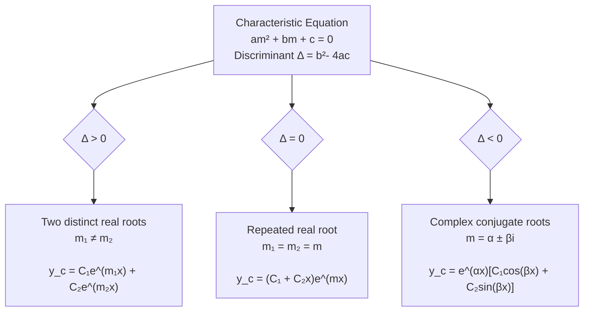
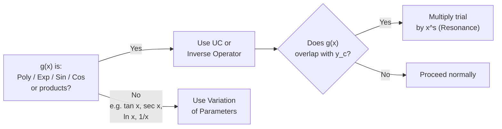

# 04 — Second & Higher Order ODEs

> **Course:** Ordinary Differential Equations · **Unit:** 4 of 5
> **Date:** 2026-06-04 · **Author:** `itachi_re`

---

## 📋 Table of Contents

1. [General Theory of Linear Higher-Order ODEs](#1-general-theory-of-linear-higher-order-odes)
2. [The Characteristic Equation](#2-the-characteristic-equation)
3. [Complementary Function (CF)](#3-complementary-function-cf)
4. [Method 1 — Undetermined Coefficients (UC)](#4-method-1--undetermined-coefficients-uc)
5. [Method 2 — Inverse Operator Method](#5-method-2--inverse-operator-method)
6. [Method 3 — Variation of Parameters](#6-method-3--variation-of-parameters)
7. [Comparison of Methods](#7-comparison-of-methods)
8. [Applications — Mechanical & Electrical Oscillations](#8-applications--mechanical--electrical-oscillations)
9. [References](#9-references)

---

## 1. General Theory of Linear Higher-Order ODEs

### 1.1 Standard Form

A **linear $n$th-order ODE** with constant coefficients:

$$a_n y^{(n)} + a_{n-1}y^{(n-1)} + \cdots + a_1 y' + a_0 y = g(x)$$

or in operator notation (see Section 5):

$$L[y] = g(x)$$

### 1.2 Structure of the General Solution

> **Theorem:** The general solution of a non-homogeneous linear ODE is:
>
> $$y = y_c + y_p$$
>
> where:
> - $y_c$ = **complementary function** = general solution of $L[y] = 0$
> - $y_p$ = **particular integral** = any specific solution of $L[y] = g(x)$

**Proof:**

Let $y_p$ satisfy $L[y_p] = g(x)$, and let $y_c$ satisfy $L[y_c] = 0$. Then:

$$L[y_c + y_p] = L[y_c] + L[y_p] = 0 + g(x) = g(x) \quad \checkmark$$

Conversely, if $y$ is any solution: $L[y - y_p] = L[y] - L[y_p] = g - g = 0$, so $y - y_p = y_c$.

### 1.3 Linear Independence and the Wronskian

> **Definition:** Functions $y_1, y_2, \ldots, y_n$ are **linearly independent** on an interval if:
>
> $$c_1 y_1 + c_2 y_2 + \cdots + c_n y_n = 0 \implies c_1 = c_2 = \cdots = c_n = 0$$

The **Wronskian** is the test:

$$W[y_1, y_2] = \begin{vmatrix} y_1 & y_2 \\ y_1' & y_2' \end{vmatrix} = y_1 y_2' - y_2 y_1'$$

> **Abel's Theorem:** $W(x) \neq 0$ on an interval if and only if $y_1, y_2$ are linearly independent solutions of a 2nd-order homogeneous linear ODE.

---

## 2. The Characteristic Equation

### 2.1 Derivation

For a constant-coefficient homogeneous ODE, try $y = e^{mx}$:

$$y = e^{mx},\; y' = me^{mx},\; y'' = m^2e^{mx},\; \ldots,\; y^{(k)} = m^k e^{mx}$$

Substituting into $a_n y^{(n)} + \cdots + a_0 y = 0$:

$$e^{mx}\!\left(a_n m^n + a_{n-1}m^{n-1} + \cdots + a_0\right) = 0$$

Since $e^{mx} \neq 0$, we need:

$$\boxed{a_n m^n + a_{n-1}m^{n-1} + \cdots + a_0 = 0}$$

This is the **characteristic equation** (auxiliary equation).

### 2.2 Cases for 2nd Order: $ay'' + by' + cy = 0$

Characteristic equation: $am^2 + bm + c = 0$

Discriminant: $\Delta = b^2 - 4ac$

### 2.3 The Three Cases in Detail

#### Case I: Two Distinct Real Roots ($\Delta > 0$)

Roots $m_1, m_2$ real and distinct.

$$y_c = C_1 e^{m_1 x} + C_2 e^{m_2 x}$$

**Example:** $y'' - 5y' + 6y = 0$

Char. eq.: $m^2 - 5m + 6 = (m-2)(m-3) = 0 \Rightarrow m = 2, 3$

$$\boxed{y_c = C_1 e^{2x} + C_2 e^{3x}}$$

---

#### Case II: Repeated Real Roots ($\Delta = 0$)

Root $m = -b/(2a)$ (double).

**Why $xe^{mx}$?** Using reduction of order: if $y_1 = e^{mx}$ is one solution, let $y_2 = v(x)e^{mx}$.

Substituting shows $v'' = 0 \Rightarrow v = C_1 + C_2 x$, giving $y_2 = xe^{mx}$ as independent solution.

$$y_c = (C_1 + C_2 x)e^{mx}$$

**Example:** $y'' - 6y' + 9y = 0$

Char. eq.: $(m-3)^2 = 0 \Rightarrow m = 3$ (double)

$$\boxed{y_c = (C_1 + C_2 x)e^{3x}}$$

---

#### Case III: Complex Conjugate Roots ($\Delta < 0$)

Roots $m = \alpha \pm \beta i$ where $\alpha = -b/(2a)$, $\beta = \sqrt{4ac - b^2}/(2a)$.

Using Euler's formula $e^{i\theta} = \cos\theta + i\sin\theta$:

$$e^{(\alpha + \beta i)x} = e^{\alpha x}(\cos\beta x + i\sin\beta x)$$

Taking real and imaginary parts as independent real solutions:

$$y_c = e^{\alpha x}(C_1\cos\beta x + C_2\sin\beta x)$$

**Example:** $y'' + 4y' + 13y = 0$

Char. eq.: $m^2 + 4m + 13 = 0 \Rightarrow m = \dfrac{-4 \pm \sqrt{16-52}}{2} = -2 \pm 3i$

$$\boxed{y_c = e^{-2x}(C_1\cos 3x + C_2\sin 3x)}$$

### 2.4 Higher-Order: Repeated and Complex Roots

For an $n$th-order ODE, if $m = r$ is a root of multiplicity $k$:

$$y_{c,\text{this root}} = (C_1 + C_2 x + \cdots + C_k x^{k-1})e^{rx}$$

If $m = \alpha \pm \beta i$ each has multiplicity $k$:

$$y_{c} = e^{\alpha x}\Big[(C_1 + C_2 x + \cdots + C_k x^{k-1})\cos\beta x + (D_1 + D_2 x + \cdots + D_k x^{k-1})\sin\beta x\Big]$$

---

## 3. Complementary Function (CF)

The **complementary function** $y_c$ is the general solution of the associated homogeneous equation.

**Algorithm:**

1. Write the characteristic equation
2. Find all roots (real/complex, simple/repeated)
3. Write the corresponding terms using the table above
4. Add all terms together

**Extended Example:** $y^{(4)} - 2y''' + 2y'' - 2y' + y = 0$

Characteristic equation: $m^4 - 2m^3 + 2m^2 - 2m + 1 = 0$

Factor: $(m^2 + 1)(m - 1)^2 = 0$

Roots: $m = 1$ (double), $m = \pm i$ (simple)

$$y_c = (C_1 + C_2 x)e^x + C_3\cos x + C_4\sin x$$

---

## 4. Method 1 — Undetermined Coefficients (UC)

### 4.1 Overview

> The **Method of Undetermined Coefficients** (also called the *method of trial/guess*) finds $y_p$ by assuming a form for the particular integral based on the form of $g(x)$.

**Restriction:** Only works when $g(x)$ is a combination of:
- Polynomials: $x^n$
- Exponentials: $e^{ax}$
- Trig functions: $\sin bx$, $\cos bx$
- Products/sums of the above

### 4.2 Trial Solution Table

| Form of $g(x)$ | Trial $y_p$ |
|----------------|------------|
| $k$ (constant) | $A$ |
| $kx^n$ | $A_n x^n + A_{n-1}x^{n-1} + \cdots + A_0$ |
| $ke^{ax}$ | $Ae^{ax}$ |
| $k\sin bx$ or $k\cos bx$ | $A\sin bx + B\cos bx$ |
| $ke^{ax}\sin bx$ or $ke^{ax}\cos bx$ | $e^{ax}(A\sin bx + B\cos bx)$ |
| $kx^n e^{ax}$ | $(A_n x^n + \cdots + A_0)e^{ax}$ |

### 4.3 Modification Rule (Resonance)

> **If any term of the trial $y_p$ duplicates a term in $y_c$**, multiply the entire trial solution by $x$ (or $x^s$ where $s$ is the smallest positive integer that eliminates duplication).

### 4.4 Worked Examples

#### Example 1: Polynomial RHS

**Solve:** $y'' - 3y' + 2y = 3x^2 - 1$

**Step 1 — Find $y_c$:**

Char. eq.: $m^2 - 3m + 2 = (m-1)(m-2) = 0 \Rightarrow m = 1, 2$

$$y_c = C_1 e^x + C_2 e^{2x}$$

**Step 2 — Guess $y_p$:** Since $g = 3x^2 - 1$ (polynomial of degree 2), try:

$$y_p = Ax^2 + Bx + C$$

$$y_p' = 2Ax + B, \quad y_p'' = 2A$$

**Step 3 — Substitute:**

$$2A - 3(2Ax + B) + 2(Ax^2 + Bx + C) = 3x^2 - 1$$

$$2Ax^2 + (-6A + 2B)x + (2A - 3B + 2C) = 3x^2 - 1$$

**Match coefficients:**

- $x^2$: $2A = 3 \Rightarrow A = 3/2$
- $x^1$: $-6A + 2B = 0 \Rightarrow B = 3A = 9/2$
- $x^0$: $2A - 3B + 2C = -1 \Rightarrow 3 - 27/2 + 2C = -1 \Rightarrow C = 19/4$

$$y_p = \frac{3}{2}x^2 + \frac{9}{2}x + \frac{19}{4}$$

**General solution:** $\boxed{y = C_1 e^x + C_2 e^{2x} + \dfrac{3x^2 + 9x}{2} + \dfrac{19}{4}}$

---

#### Example 2: Exponential RHS

**Solve:** $y'' - 4y = 2e^{3x}$

**$y_c$:** $m^2 - 4 = (m-2)(m+2) = 0 \Rightarrow y_c = C_1 e^{2x} + C_2 e^{-2x}$

**Try** $y_p = Ae^{3x}$, since $3 \neq \pm 2$ (no overlap):

$$y_p'' = 9Ae^{3x}$$

Substitute: $9Ae^{3x} - 4Ae^{3x} = 2e^{3x} \Rightarrow 5A = 2 \Rightarrow A = \dfrac{2}{5}$

$$\boxed{y = C_1 e^{2x} + C_2 e^{-2x} + \frac{2}{5}e^{3x}}$$

---

#### Example 3: Resonance (Modification Rule)

**Solve:** $y'' - 4y = e^{2x}$

**$y_c$:** $y_c = C_1 e^{2x} + C_2 e^{-2x}$

⚠️ Normally we'd try $y_p = Ae^{2x}$, but $e^{2x}$ **already appears in $y_c$**!

**Apply modification:** Try $y_p = Axe^{2x}$

$$y_p' = Ae^{2x}(1 + 2x), \quad y_p'' = Ae^{2x}(4 + 4x)$$

Substitute:

$$Ae^{2x}(4 + 4x) - 4Axe^{2x} = e^{2x}$$

$$4A e^{2x} = e^{2x} \Rightarrow A = \frac{1}{4}$$

$$\boxed{y = C_1 e^{2x} + C_2 e^{-2x} + \frac{x}{4}e^{2x}}$$

---

#### Example 4: Trigonometric RHS

**Solve:** $y'' + 9y = 5\sin 2x$

**$y_c$:** $m^2 + 9 = 0 \Rightarrow m = \pm 3i$

$$y_c = C_1\cos 3x + C_2\sin 3x$$

**Try** $y_p = A\cos 2x + B\sin 2x$ (no overlap since $2 \neq 3$):

$$y_p'' = -4A\cos 2x - 4B\sin 2x$$

Substitute:

$$(-4A + 9A)\cos 2x + (-4B + 9B)\sin 2x = 5\sin 2x$$

$$5A\cos 2x + 5B\sin 2x = 5\sin 2x$$

$$A = 0,\quad B = 1$$

$$\boxed{y = C_1\cos 3x + C_2\sin 3x + \sin 2x}$$

---

#### Example 5: Resonance with Trig (Forcing = Natural Frequency)

**Solve:** $y'' + 9y = 5\sin 3x$

Same $y_c$ as above, but now $g(x) = \sin 3x$ **matches** the natural frequency $\omega = 3$!

**Apply modification:** Try $y_p = x(A\cos 3x + B\sin 3x)$

$$y_p' = (A\cos 3x + B\sin 3x) + x(-3A\sin 3x + 3B\cos 3x)$$

$$y_p'' = (-3A\sin 3x + 3B\cos 3x) + (-3A\sin 3x + 3B\cos 3x) + x(-9A\cos 3x - 9B\sin 3x)$$

$$= 6B\cos 3x - 6A\sin 3x - 9x(A\cos 3x + B\sin 3x)$$

Substitute into $y'' + 9y$:

$$6B\cos 3x - 6A\sin 3x - 9x(\ldots) + 9x(\ldots) = 5\sin 3x$$

$$6B\cos 3x - 6A\sin 3x = 5\sin 3x$$

$$B = 0,\quad A = -\frac{5}{6}$$

$$\boxed{y = C_1\cos 3x + C_2\sin 3x - \frac{5x}{6}\cos 3x}$$

> ⚠️ **Physical meaning:** The $x\cos 3x$ term grows without bound — this is **resonance**! The amplitude grows linearly with time.

---

## 5. Method 2 — Inverse Operator Method

### 5.1 The Differential Operator $D$

Define the **differential operator**:

$$D \equiv \frac{d}{dx}, \quad D^2 \equiv \frac{d^2}{dx^2}, \quad \ldots, \quad D^n \equiv \frac{d^n}{dx^n}$$

A constant-coefficient ODE becomes:

$$f(D)y = g(x) \quad \text{where } f(D) = a_n D^n + \cdots + a_1 D + a_0$$

The **inverse operator** $\dfrac{1}{f(D)}$ is defined by:

$$y_p = \frac{1}{f(D)}g(x) \quad \Longleftrightarrow \quad f(D)y_p = g(x)$$

### 5.2 Operational Formulas

#### Formula 1: Exponential Shift

$$\frac{1}{f(D)}e^{ax} = \frac{e^{ax}}{f(a)}, \quad \text{provided } f(a) \neq 0$$

**Proof:** Since $D e^{ax} = ae^{ax}$, $D^n e^{ax} = a^n e^{ax}$, we have $f(D)e^{ax} = f(a)e^{ax}$.

Therefore $\dfrac{1}{f(D)}e^{ax} = \dfrac{e^{ax}}{f(a)}$.

#### Formula 2: When $f(a) = 0$ (Resonance Case)

If $f(a) = 0$ but $f'(a) \neq 0$:

$$\frac{1}{f(D)}e^{ax} = \frac{x\,e^{ax}}{f'(a)}$$

If $f(a) = f'(a) = 0$ but $f''(a) \neq 0$:

$$\frac{1}{f(D)}e^{ax} = \frac{x^2 e^{ax}}{f''(a)}$$

#### Formula 3: Trig Functions

Using $e^{ibx} = \cos bx + i\sin bx$:

$$\frac{1}{f(D)}\cos bx = \text{Re}\left[\frac{1}{f(D)}e^{ibx}\right] = \text{Re}\left[\frac{e^{ibx}}{f(ib)}\right]$$

$$\frac{1}{f(D)}\sin bx = \text{Im}\left[\frac{e^{ibx}}{f(ib)}\right]$$

More directly, replace $D^2 \to -b^2$:

$$\frac{1}{\phi(D^2)}\sin bx = \frac{\sin bx}{\phi(-b^2)}, \quad \phi(-b^2) \neq 0$$

#### Formula 4: Exponential × Function (Shift Theorem)

$$\frac{1}{f(D)}\left[e^{ax}V(x)\right] = e^{ax}\frac{1}{f(D+a)}V(x)$$

**Proof:** For any function $V$, $D[e^{ax}V] = ae^{ax}V + e^{ax}DV = e^{ax}(D+a)V$.

By induction: $f(D)[e^{ax}V] = e^{ax}f(D+a)V$

Therefore $\dfrac{1}{f(D)}[e^{ax}V] = e^{ax}\dfrac{1}{f(D+a)}V$.

#### Formula 5: Polynomial $x^n$

$$\frac{1}{f(D)}x^n = [f(D)]^{-1}x^n$$

Expand $[f(D)]^{-1}$ as a power series in $D$ (valid since $D^k x^n = 0$ for $k > n$):

$$\frac{1}{a_0 + a_1 D + \cdots} = \frac{1}{a_0}\left(1 + \frac{a_1}{a_0}D + \cdots\right)^{-1}$$

Use binomial expansion, then apply term by term.

### 5.3 Worked Examples

#### Example 1: Exponential RHS

**Find $y_p$ for:** $y'' - 4y = e^{3x}$, i.e., $(D^2 - 4)y = e^{3x}$

$$y_p = \frac{1}{D^2 - 4}e^{3x} = \frac{e^{3x}}{3^2 - 4} = \frac{e^{3x}}{5}$$

$$\boxed{y_p = \frac{e^{3x}}{5}}$$

---

#### Example 2: Resonance Case

**Find $y_p$ for:** $(D^2 - 4)y = e^{2x}$

Here $f(a) = f(2) = 4 - 4 = 0$. Use resonance formula:

$$f(D) = D^2 - 4 \implies f'(D) = 2D \implies f'(2) = 4$$

$$y_p = \frac{x e^{2x}}{f'(2)} = \frac{xe^{2x}}{4}$$

$$\boxed{y_p = \frac{x e^{2x}}{4}}$$

---

#### Example 3: Trigonometric RHS

**Find $y_p$ for:** $(D^2 + 4D + 13)y = \sin 3x$

$$y_p = \frac{1}{D^2 + 4D + 13}\sin 3x$$

Replace $D^2 \to -3^2 = -9$:

$$= \frac{1}{-9 + 4D + 13}\sin 3x = \frac{1}{4D + 4}\sin 3x = \frac{1}{4(D+1)}\sin 3x$$

Multiply numerator and denominator by $(1 - D)$ to rationalize:

$$= \frac{1}{4} \cdot \frac{1-D}{(1+D)(1-D)}\sin 3x = \frac{1}{4}\cdot\frac{1-D}{1-D^2}\sin 3x$$

Replace $D^2 \to -9$: $1 - D^2 = 1 - (-9) = 10$

$$= \frac{1}{40}(1-D)\sin 3x = \frac{1}{40}(\sin 3x - D\sin 3x) = \frac{1}{40}(\sin 3x - 3\cos 3x)$$

$$\boxed{y_p = \frac{1}{40}(\sin 3x - 3\cos 3x)}$$

---

#### Example 4: Polynomial RHS

**Find $y_p$ for:** $(D^2 + D)y = x^2 + 2x$

$$y_p = \frac{1}{D^2 + D}(x^2 + 2x) = \frac{1}{D(D+1)}(x^2 + 2x)$$

Expand $\dfrac{1}{D+1} = (1+D)^{-1} = 1 - D + D^2 - \cdots$ (binomial):

$$\frac{1}{D+1}(x^2 + 2x) = (1 - D + D^2)(x^2 + 2x)$$

$$= (x^2 + 2x) - (2x + 2) + 2 = x^2 + 2x - 2x - 2 + 2 = x^2$$

Now apply $\dfrac{1}{D}$ (integrate):

$$\frac{1}{D}x^2 = \int x^2\,dx = \frac{x^3}{3}$$

$$\boxed{y_p = \frac{x^3}{3}}$$

---

#### Example 5: Exponential × Trig

**Find $y_p$ for:** $(D^2 - 2D + 5)y = e^x \cos 2x$

Using the shift theorem: $\dfrac{1}{f(D)}[e^x \cos 2x] = e^x \dfrac{1}{f(D+1)}\cos 2x$

$$f(D+1) = (D+1)^2 - 2(D+1) + 5 = D^2 + 2D + 1 - 2D - 2 + 5 = D^2 + 4$$

$$y_p = e^x \cdot \frac{1}{D^2 + 4}\cos 2x$$

Replace $D^2 \to -4$: $D^2 + 4 = -4 + 4 = 0$ ← **resonance again!**

Use: $\dfrac{1}{D^2 + b^2}\cos bx = \dfrac{x\sin bx}{2b}$

$$y_p = e^x \cdot \frac{x\sin 2x}{4}$$

$$\boxed{y_p = \frac{x e^x \sin 2x}{4}}$$

---

## 6. Method 3 — Variation of Parameters

### 6.1 Overview and Motivation

> **Variation of Parameters** (VoP) is a general method that works for **any** linear ODE, even with non-constant coefficients or forcing functions not handled by UC/IO.

The idea: in the complementary function $y_c = C_1 y_1 + C_2 y_2$, **replace the constants $C_1, C_2$ with unknown functions $u_1(x), u_2(x)$**:

$$y_p = u_1(x) y_1(x) + u_2(x) y_2(x)$$

### 6.2 Derivation for Second-Order ODEs

**Consider:** $y'' + P(x)y' + Q(x)y = g(x)$, with $y_c = C_1 y_1 + C_2 y_2$.

**Assume:** $y_p = u_1 y_1 + u_2 y_2$

**Differentiate:**

$$y_p' = u_1' y_1 + u_1 y_1' + u_2' y_2 + u_2 y_2'$$

**Impose the constraint** $u_1' y_1 + u_2' y_2 = 0$ (reduces two unknowns to a manageable system):

$$y_p' = u_1 y_1' + u_2 y_2'$$

**Differentiate again:**

$$y_p'' = u_1' y_1' + u_1 y_1'' + u_2' y_2' + u_2 y_2''$$

**Substitute** into the ODE. Since $y_1, y_2$ are solutions of the homogeneous equation:

$$u_1(y_1'' + Py_1' + Qy_1) + u_2(y_2'' + Py_2' + Qy_2) + u_1'y_1' + u_2'y_2' = g$$

$$\Rightarrow u_1'y_1' + u_2'y_2' = g(x)$$

**Combined system:**

$$\begin{cases} u_1' y_1 + u_2' y_2 = 0 \\ u_1' y_1' + u_2' y_2' = g(x) \end{cases}$$

**Solve by Cramer's rule:**

The determinant is the Wronskian $W = y_1 y_2' - y_2 y_1'$:

$$u_1' = \frac{-y_2 g(x)}{W}, \qquad u_2' = \frac{y_1 g(x)}{W}$$

**Integrate:**

$$u_1 = -\int \frac{y_2 g(x)}{W}\,dx, \qquad u_2 = \int \frac{y_1 g(x)}{W}\,dx$$

**Particular integral:**

$$\boxed{y_p = -y_1\int \frac{y_2 g}{W}\,dx + y_2\int \frac{y_1 g}{W}\,dx}$$

### 6.3 Worked Examples

#### Example 1: VoP for Standard Equation

**Solve:** $y'' - 2y' + y = \dfrac{e^x}{x^2}$, $x > 0$

> (UC doesn't work here because $e^x/x^2$ is not of the standard form.)

**Step 1 — Find $y_c$:**

Char. eq.: $m^2 - 2m + 1 = (m-1)^2 = 0 \Rightarrow m = 1$ (double)

$$y_c = (C_1 + C_2 x)e^x, \quad y_1 = e^x,\; y_2 = xe^x$$

**Step 2 — Wronskian:**

$$W = \begin{vmatrix} e^x & xe^x \\ e^x & e^x + xe^x \end{vmatrix} = e^x(e^x + xe^x) - xe^x \cdot e^x = e^{2x}$$

**Step 3 — Compute $u_1', u_2'$:**

$$g = \frac{e^x}{x^2}$$

$$u_1' = -\frac{y_2 g}{W} = -\frac{xe^x \cdot e^x/x^2}{e^{2x}} = -\frac{1}{x}$$

$$u_2' = \frac{y_1 g}{W} = \frac{e^x \cdot e^x/x^2}{e^{2x}} = \frac{1}{x^2}$$

**Step 4 — Integrate:**

$$u_1 = -\int \frac{1}{x}\,dx = -\ln x$$

$$u_2 = \int \frac{1}{x^2}\,dx = -\frac{1}{x}$$

**Step 5 — Particular integral:**

$$y_p = u_1 y_1 + u_2 y_2 = -\ln(x) \cdot e^x + \left(-\frac{1}{x}\right) \cdot xe^x = -e^x\ln x - e^x$$

Since $-e^x$ is a term of $y_c$, drop it (it adds only to the complementary function):

$$y_p = -e^x \ln x$$

**General solution:**

$$\boxed{y = (C_1 + C_2 x)e^x - e^x\ln x}$$

---

#### Example 2: VoP with Trig

**Solve:** $y'' + y = \sec x = \dfrac{1}{\cos x}$

**$y_c$:** $m^2 + 1 = 0 \Rightarrow m = \pm i$

$$y_c = C_1\cos x + C_2\sin x, \quad y_1 = \cos x,\; y_2 = \sin x$$

**Wronskian:**

$$W = \begin{vmatrix}\cos x & \sin x \\ -\sin x & \cos x\end{vmatrix} = \cos^2 x + \sin^2 x = 1$$

**Compute $u_1', u_2'$:**

$$u_1' = -\frac{y_2 g}{W} = -\sin x \sec x = -\tan x$$

$$u_2' = \frac{y_1 g}{W} = \cos x \sec x = 1$$

**Integrate:**

$$u_1 = \int (-\tan x)\,dx = \ln|\cos x|$$

$$u_2 = \int 1\,dx = x$$

**Particular integral:**

$$y_p = \cos x \cdot \ln|\cos x| + x\sin x$$

**General solution:**

$$\boxed{y = C_1\cos x + C_2\sin x + \cos x\ln|\cos x| + x\sin x}$$

> Note: $\sec x$ cannot be handled by UC — VoP is **required** here.

---

#### Example 3: Full Problem with IVP

**Solve:** $y'' - 4y' + 4y = \dfrac{e^{2x}}{x}$, $y(1) = 0$, $y'(1) = 0$

**$y_c$:** $(m-2)^2 = 0 \Rightarrow y_c = (C_1 + C_2 x)e^{2x}$

$y_1 = e^{2x}$, $y_2 = xe^{2x}$, $W = e^{4x}$

$$u_1' = -\frac{xe^{2x} \cdot e^{2x}/x}{e^{4x}} = -1 \implies u_1 = -x$$

$$u_2' = \frac{e^{2x} \cdot e^{2x}/x}{e^{4x}} = \frac{1}{x} \implies u_2 = \ln x$$

$$y_p = -xe^{2x} + xe^{2x}\ln x$$

$$y = (C_1 + C_2 x)e^{2x} - xe^{2x} + xe^{2x}\ln x$$

Apply ICs to find $C_1, C_2$... (detailed algebraic steps omitted for brevity)

---

## 7. Comparison of Methods

| Feature | Undetermined Coefficients | Inverse Operator | Variation of Parameters |
|---------|--------------------------|------------------|------------------------|
| Applicable to | Constant-coeff only | Constant-coeff only | Any linear ODE |
| $g(x)$ type | Poly, exp, trig (limited) | Same as UC | Any continuous $g(x)$ |
| Ease of use | Easy (guessing) | Systematic (algebraic) | Always works, may require integration |
| Resonance handling | Multiply by $x$ | Separate formula | Automatic (no modification) |
| Requires $y_c$ first? | No | No | **Yes** (absolutely required) |

---

## 8. Applications — Mechanical & Electrical Oscillations

### 8.1 Spring-Mass-Damper (Mechanical)

$$m\ddot{x} + c\dot{x} + kx = F_0\cos\omega t$$

| Parameter | Symbol | Meaning |
|-----------|--------|---------|
| Mass | $m$ | kg |
| Damping | $c$ | Ns/m |
| Spring constant | $k$ | N/m |
| Forcing frequency | $\omega$ | rad/s |
| Natural frequency | $\omega_n = \sqrt{k/m}$ | rad/s |

**Divide by $m$:** $\ddot{x} + 2\zeta\omega_n\dot{x} + \omega_n^2 x = \dfrac{F_0}{m}\cos\omega t$

where $\zeta = c/(2\sqrt{km})$ is the **damping ratio**.

| $\zeta$ | Behavior | $y_c$ type |
|---------|----------|------------|
| $\zeta > 1$ | Overdamped | $C_1e^{m_1t} + C_2e^{m_2t}$ (real roots) |
| $\zeta = 1$ | Critically damped | $(C_1 + C_2t)e^{-\omega_n t}$ |
| $0 < \zeta < 1$ | Underdamped | $e^{-\zeta\omega_n t}(C_1\cos\omega_dt + C_2\sin\omega_dt)$ |
| $\zeta = 0$ | Undamped | $C_1\cos\omega_n t + C_2\sin\omega_n t$ |

where $\omega_d = \omega_n\sqrt{1 - \zeta^2}$ is the **damped natural frequency**.

### 8.2 Resonance (Undamped, $\omega = \omega_n$)

$$\ddot{x} + \omega_n^2 x = \frac{F_0}{m}\cos\omega_n t$$

Particular solution (using modification rule):

$$x_p = \frac{F_0}{2m\omega_n} t\sin\omega_n t$$

The amplitude grows without bound — **pure resonance**.

### 8.3 Electrical Analogy (RLC Circuit)

$$L\ddot{q} + R\dot{q} + \frac{q}{C} = E_0\cos\omega t$$

| Mechanical | Electrical |
|-----------|-----------|
| Mass $m$ | Inductance $L$ |
| Damping $c$ | Resistance $R$ |
| Spring $k$ | $1/C$ (reciprocal capacitance) |
| Force $F$ | EMF $E$ |
| Displacement $x$ | Charge $q$ |

---

## 9. References

| Resource | Link |
|----------|------|
| Paul's Online — Method of UC | [tutorial.math.lamar.edu](https://tutorial.math.lamar.edu/Classes/DE/UndeterminedCoefficients.aspx) |
| Paul's Online — VoP | [tutorial.math.lamar.edu](https://tutorial.math.lamar.edu/classes/de/VariationofParameters.aspx) |
| LibreTexts — VoP | [math.libretexts.org](https://math.libretexts.org/Courses/Monroe_Community_College/MTH_225_Differential_Equations/05:_Linear_Second_Order_Equations/5.07:_Variation_of_Parameters) |
| CliffsNotes — VoP | [cliffsnotes.com](https://www.cliffsnotes.com/study-guides/differential-equations/second-order-equations/variation-of-parameters) |
| MIT OCW 18.03 | [ocw.mit.edu](https://ocw.mit.edu/courses/18-03-differential-equations-spring-2010/) |
| Wikipedia — Variation of Parameters | [en.wikipedia.org](https://en.wikipedia.org/wiki/Variation_of_parameters) |
| USU Engineering Math — VoP | [engineering.usu.edu](https://engineering.usu.edu/students/engineering-math-resource-center/topics/differential-equations/variation-of-parameters) |

---

> ⬅️ [Previous: First Order ODE](./03-First-Order-ODE.md) · ➡️ [Next: Homogeneous Linear DE](./05-Homogeneous-Linear-DE.md)
