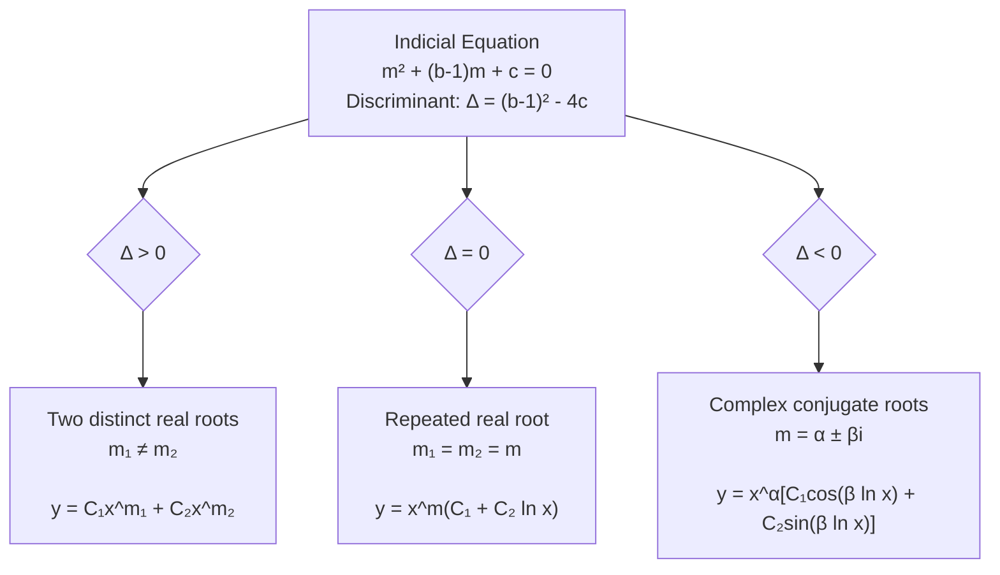
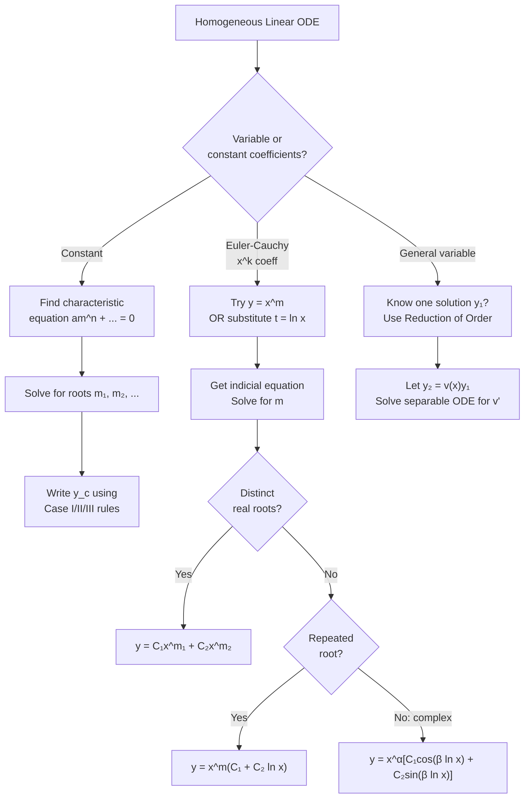

# 05 — Homogeneous Linear Differential Equations

> **Course:** Ordinary Differential Equations · **Unit:** 5 of 5
> **Date:** 2026-06-04 · **Author:** `itachi_re`

---

## 📋 Table of Contents

1. [Overview](#1-overview)
2. [The Euler–Cauchy Equation](#2-the-eulercauchy-equation)
3. [Solution by Power Substitution](#3-solution-by-power-substitution)
4. [Three Cases of the Indicial Equation](#4-three-cases-of-the-indicial-equation)
5. [Reduction to Constant Coefficients](#5-reduction-to-constant-coefficients)
6. [Higher-Order Euler–Cauchy Equations](#6-higher-order-eulercauchy-equations)
7. [General Homogeneous Linear ODE — Reduction of Order](#7-general-homogeneous-linear-ode--reduction-of-order)
8. [Wronskian and Linear Independence](#8-wronskian-and-linear-independence)
9. [Worked Examples](#9-worked-examples)
10. [Applications](#10-applications)
11. [Summary Flowchart](#11-summary-flowchart)
12. [References](#12-references)

---

## 1. Overview

A **homogeneous linear ODE** has the form:

$$a_n(x)y^{(n)} + a_{n-1}(x)y^{(n-1)} + \cdots + a_1(x)y' + a_0(x)y = 0$$

i.e., the right-hand side is zero.

### Why Study Homogeneous ODEs First?

The **general solution** of a non-homogeneous ODE is:

$$y = y_c + y_p$$

So we always need to solve the homogeneous equation first to find $y_c$.

### Key Structures

| Type | Form | Method |
|------|------|--------|
| **Constant coefficient** | $a_n y^{(n)} + \cdots + a_0 y = 0$ ($a_i \in \mathbb{R}$) | Characteristic equation |
| **Euler–Cauchy** | $x^n y^{(n)} + \cdots + a_0 y = 0$ | Power substitution $y = x^m$ |
| **General variable coefficients** | General $a_i(x)$ | Series solutions, reduction of order |

---

## 2. The Euler–Cauchy Equation

### 2.1 Definition

> The **Euler–Cauchy** (also called **Equidimensional**) equation of order $n$ is:
>
> $$x^n y^{(n)} + b_{n-1} x^{n-1} y^{(n-1)} + \cdots + b_1 x y' + b_0 y = 0$$
>
> where $b_0, b_1, \ldots, b_{n-1}$ are **real constants**.

The **second-order** Euler–Cauchy equation is:

$$\boxed{x^2 y'' + bxy' + cy = 0}$$

> **Note:** The coefficient of $y^{(k)}$ is $x^k$ (times a constant), hence *equidimensional* — each term has the same overall dimension in $x$.

### 2.2 Domain

The equation has **singular points at $x = 0$** (since the leading coefficient $x^2 \to 0$). Solutions are valid on:
- $(0, \infty)$ or $(-\infty, 0)$ separately

We typically work on $x > 0$.

### 2.3 Motivation

This equation arises naturally in:
- **Cylindrical/spherical coordinates** (e.g., Laplace's equation)
- **Bessel's equation** (leading term)
- **Power-law potential** problems in physics
- **Beam theory** and elasticity

---

## 3. Solution by Power Substitution

### 3.1 The Substitution

Try $y = x^m$ (power function, analogous to $e^{mx}$ for constant-coefficient equations).

**Derivatives:**

$$y = x^m, \quad y' = mx^{m-1}, \quad y'' = m(m-1)x^{m-2}$$

**Substitute** into $x^2 y'' + bxy' + cy = 0$:

$$x^2 \cdot m(m-1)x^{m-2} + bx \cdot mx^{m-1} + c \cdot x^m = 0$$

$$m(m-1)x^m + bmx^m + cx^m = 0$$

$$x^m[m(m-1) + bm + c] = 0$$

Since $x^m \neq 0$ (for $x > 0$):

$$\boxed{m(m-1) + bm + c = 0}$$

This is the **indicial equation** (or auxiliary equation).

Expanding:

$$m^2 + (b-1)m + c = 0$$

### 3.2 Why Power Functions?

The key property of $x^m$ is that $x^k \dfrac{d^k}{dx^k}[x^m] = m(m-1)\cdots(m-k+1)x^m$, always proportional to $x^m$. This matches the structure of the Euler–Cauchy equation.

---

## 4. Three Cases of the Indicial Equation

The indicial equation $m^2 + (b-1)m + c = 0$ has discriminant:

$$\Delta = (b-1)^2 - 4c$$

### Case I: Two Distinct Real Roots ($\Delta > 0$)

Roots $m_1 \neq m_2$ (real).

$$\boxed{y = C_1 x^{m_1} + C_2 x^{m_2}}$$

**Example:** $x^2 y'' - 3xy' + 4y = 0$ [wait, indicial would be $m^2 - 4m + 4$, Case II — let's use a proper one]

$x^2y'' - 2y = 0$

Indicial: $m(m-1) - 2 = m^2 - m - 2 = (m-2)(m+1) = 0 \Rightarrow m = 2, -1$

$$y = C_1 x^2 + C_2 x^{-1}$$

---

### Case II: Repeated Real Roots ($\Delta = 0$)

Double root $m$.

The two solutions are $x^m$ and $x^m \ln x$.

**Proof using reduction of order:**

Let $y_1 = x^m$. Try $y_2 = v(x) x^m$.

$$y_2' = v'x^m + vmx^{m-1}, \quad y_2'' = v''x^m + 2v'mx^{m-1} + vm(m-1)x^{m-2}$$

Substituting into the ODE and using $y_1 = x^m$ satisfies it:

$$x^2 v'' x^m + 2mx v' x^{m-1} = 0$$

$$x^{m+2}v'' + 2mx^{m+1}v' = 0$$

Let $w = v'$: $xw' + 2mw = 0 \Rightarrow \dfrac{dw}{w} = -\dfrac{2m}{x}dx$

Wait — for the repeated root case, $b - 1 = -2m$ (since the only root is $m$, $m^2 + (b-1)m + c = (m-m_0)^2$). After substituting and simplifying:

$$w' + \frac{1}{x}w = 0 \implies w = \frac{1}{x} \implies v' = \frac{1}{x} \implies v = \ln x$$

Therefore: $y_2 = x^m \ln x$

$$\boxed{y = x^m(C_1 + C_2\ln x)}$$

**Example:** $x^2y'' - 3xy' + 4y = 0$

Indicial: $m(m-1) - 3m + 4 = m^2 - 4m + 4 = (m-2)^2 = 0 \Rightarrow m = 2$ (double)

$$y = x^2(C_1 + C_2\ln x)$$

---

### Case III: Complex Conjugate Roots ($\Delta < 0$)

Roots $m = \alpha \pm \beta i$.

Using $x^{\alpha + \beta i} = x^\alpha \cdot x^{i\beta} = x^\alpha e^{i\beta \ln x} = x^\alpha(\cos(\beta\ln x) + i\sin(\beta\ln x))$:

$$\boxed{y = x^\alpha\left[C_1\cos(\beta\ln x) + C_2\sin(\beta\ln x)\right]}$$

**Example:** $x^2 y'' + xy' + y = 0$

Indicial: $m(m-1) + m + 1 = m^2 + 1 = 0 \Rightarrow m = \pm i$

So $\alpha = 0$, $\beta = 1$:

$$y = C_1\cos(\ln x) + C_2\sin(\ln x)$$

---

**Another Example:** $x^2y'' + 3xy' + 5y = 0$

Indicial: $m^2 - m + 3m + 5 = m^2 + 2m + 5 = 0$

$$m = \frac{-2 \pm \sqrt{4 - 20}}{2} = \frac{-2 \pm 4i}{2} = -1 \pm 2i$$

$\alpha = -1$, $\beta = 2$:

$$y = x^{-1}\left[C_1\cos(2\ln x) + C_2\sin(2\ln x)\right]$$

---

## 5. Reduction to Constant Coefficients

### 5.1 The Substitution $x = e^t$ (or $t = \ln x$)

> The Euler–Cauchy equation can be **transformed into a constant-coefficient ODE** by the substitution $x = e^t$ (i.e., $t = \ln x$).

Let $t = \ln x$, so $x = e^t$. Then:

$$\frac{dy}{dx} = \frac{dy}{dt}\cdot\frac{dt}{dx} = \frac{1}{x}\frac{dy}{dt}$$

$$x\frac{dy}{dx} = \frac{dy}{dt} \quad \text{(operator notation: } xD_x = D_t\text{)}$$

$$x^2\frac{d^2y}{dx^2} = \frac{d^2y}{dt^2} - \frac{dy}{dt} = D_t(D_t - 1)y$$

In general: $x^k y^{(k)} = D_t(D_t - 1)(D_t - 2)\cdots(D_t - k + 1)y$

### 5.2 Transformation Table

| $x$-form | $t$-form (after substitution $t = \ln x$) |
|----------|------------------------------------------|
| $xy'$ | $\dot{y}$ (where dot = $d/dt$) |
| $x^2 y''$ | $\ddot{y} - \dot{y}$ |
| $x^3 y'''$ | $\dddot{y} - 3\ddot{y} + 2\dot{y}$ |

### 5.3 Example: Solving via Substitution

**Solve:** $x^2y'' + 4xy' + 2y = 0$

**Substitute** $t = \ln x$:

- $x^2y'' \to \ddot{y} - \dot{y}$
- $4xy' \to 4\dot{y}$

New ODE:

$$\ddot{y} - \dot{y} + 4\dot{y} + 2y = 0 \implies \ddot{y} + 3\dot{y} + 2y = 0$$

Characteristic equation (in $m$):

$$m^2 + 3m + 2 = (m+1)(m+2) = 0 \Rightarrow m = -1, -2$$

$$y = C_1 e^{-t} + C_2 e^{-2t}$$

**Back-substitute** $e^t = x$:

$$\boxed{y = \frac{C_1}{x} + \frac{C_2}{x^2}}$$

This matches $m_1 = -1$, $m_2 = -2$ from the indicial equation.

---

### 5.4 Complete Example with Non-Homogeneous

**Solve:** $x^2y'' - 3xy' + 3y = 2x^4\ln x$

**Step 1 — Solve the homogeneous equation:**

Indicial: $m(m-1) - 3m + 3 = m^2 - 4m + 3 = (m-1)(m-3) = 0$

$m = 1, 3$ → $y_c = C_1 x + C_2 x^3$

**Step 2 — Use substitution $t = \ln x$:**

$$\ddot{y} - \dot{y} - 3\dot{y} + 3y = 2e^{4t}\cdot t$$

$$\ddot{y} - 4\dot{y} + 3y = 2te^{4t}$$

**Step 3 — Find $y_p$ using UC (now in $t$, constant-coefficient):**

Characteristic roots: $m = 1, 3$. RHS = $2te^{4t}$.

Since $4 \neq 1, 3$: try $y_p = (At + B)e^{4t}$

Substituting:

$$[(16At + 16B + 8A) - 4(4At + 4B + A) + 3(At + B)]e^{4t} = 2te^{4t}$$

$$[(16A - 16A + 3A)t + (16B + 8A - 16B - 4A + 3B)]e^{4t} = 2te^{4t}$$

$$[3At + (4A + 3B)]e^{4t} = 2te^{4t}$$

$$3A = 2 \Rightarrow A = 2/3; \quad 4A + 3B = 0 \Rightarrow B = -8/9$$

$$y_p = \left(\frac{2t}{3} - \frac{8}{9}\right)e^{4t}$$

**Back-substitute** $t = \ln x$, $e^{4t} = x^4$:

$$y_p = \frac{x^4}{9}(6\ln x - 8)$$

**General solution:**

$$\boxed{y = C_1 x + C_2 x^3 + \frac{x^4}{9}(6\ln x - 8)}$$

---

## 6. Higher-Order Euler–Cauchy Equations

For $n$th-order Euler–Cauchy, try $y = x^m$:

$$m(m-1)(m-2)\cdots(m-n+1) + b_{n-1}m(m-1)\cdots(m-n+2) + \cdots + b_0 = 0$$

This is the **indicial equation of degree $n$**.

### Example: Third-Order

**Solve:** $x^3y''' - 3x^2y'' + 6xy' - 6y = 0$

**Indicial equation** (substitute $y = x^m$):

$$m(m-1)(m-2) - 3m(m-1) + 6m - 6 = 0$$

Expand: $m^3 - 3m^2 + 2m - 3m^2 + 3m + 6m - 6 = 0$

$$m^3 - 6m^2 + 11m - 6 = 0$$

Factor: $(m-1)(m-2)(m-3) = 0$

$$m = 1, 2, 3 \implies \boxed{y = C_1 x + C_2 x^2 + C_3 x^3}$$

---

## 7. General Homogeneous Linear ODE — Reduction of Order

### 7.1 The Method

> **Reduction of Order:** If one solution $y_1(x)$ of the homogeneous ODE is known, a second **linearly independent** solution can be found by substituting $y_2 = v(x) y_1(x)$.

### 7.2 For Second-Order $y'' + P(x)y' + Q(x)y = 0$

Let $y_2 = v y_1$:

$$y_2' = v'y_1 + vy_1', \quad y_2'' = v''y_1 + 2v'y_1' + vy_1''$$

Substitute:

$$v''y_1 + 2v'y_1' + vy_1'' + P(v'y_1 + vy_1') + Qvy_1 = 0$$

$$v''y_1 + v'(2y_1' + Py_1) + v(y_1'' + Py_1' + Qy_1) = 0$$

Since $y_1$ satisfies the ODE, the last bracket $= 0$:

$$v''y_1 + v'(2y_1' + Py_1) = 0$$

Let $w = v'$ (order reduction!):

$$w'y_1 + w(2y_1' + Py_1) = 0 \quad \text{(1st-order separable!)}$$

$$\frac{dw}{w} = -\left(\frac{2y_1'}{y_1} + P\right)dx = -2\frac{d(\ln y_1)}{dx}\,dx - P\,dx$$

$$\ln w = -2\ln y_1 - \int P\,dx + C$$

$$w = v' = \frac{e^{-\int P\,dx}}{y_1^2}$$

$$\boxed{v = \int \frac{e^{-\int P\,dx}}{y_1^2}\,dx}$$

This is the **Abel–Liouville formula** for the second solution.

### 7.3 Example

**Solve:** $y'' - \dfrac{2}{x^2}y = 0$ given $y_1 = x^2$.

$P(x) = 0$ (no $y'$ term), $Q(x) = -2/x^2$.

$$v' = \frac{e^{0}}{(x^2)^2} = \frac{1}{x^4} \implies v = \int x^{-4}\,dx = -\frac{1}{3x^3}$$

$$y_2 = v y_1 = -\frac{1}{3x^3} \cdot x^2 = -\frac{1}{3x}$$

Taking $y_2 = x^{-1}$ (drop constant):

$$\boxed{y = C_1 x^2 + C_2 x^{-1}}$$

(This matches the indicial equation result: $m(m-1) = 2 \Rightarrow m^2 - m - 2 = 0 \Rightarrow m = 2, -1$.)

---

## 8. Wronskian and Linear Independence

### 8.1 Definition

For $n$ functions $y_1, y_2, \ldots, y_n$:

$$W[y_1,\ldots,y_n] = \begin{vmatrix}
y_1 & y_2 & \cdots & y_n \\
y_1' & y_2' & \cdots & y_n' \\
\vdots & & & \vdots \\
y_1^{(n-1)} & y_2^{(n-1)} & \cdots & y_n^{(n-1)}
\end{vmatrix}$$

### 8.2 Abel's Identity

For the homogeneous ODE $y'' + P(x)y' + Q(x)y = 0$:

$$W(x) = W(x_0)\exp\!\left(-\int_{x_0}^x P(t)\,dt\right)$$

**Consequence:** $W$ is either always zero or never zero on an interval — there's no middle ground for solutions of a linear homogeneous ODE.

### 8.3 Working Check

For Case I solutions $y_1 = x^{m_1}$, $y_2 = x^{m_2}$:

$$W = \begin{vmatrix}x^{m_1} & x^{m_2} \\ m_1 x^{m_1-1} & m_2 x^{m_2-1}\end{vmatrix} = (m_2 - m_1)x^{m_1+m_2-1} \neq 0 \text{ for } m_1 \neq m_2, x > 0 \checkmark$$

---

## 9. Worked Examples

### Example 1: Full Solution, All Three Cases

**① $x^2y'' + 5xy' + 4y = 0$**

Indicial: $m(m-1) + 5m + 4 = m^2 + 4m + 4 = (m+2)^2 = 0$

$m = -2$ (repeated)

$$\boxed{y = x^{-2}(C_1 + C_2\ln x)}$$

---

**② $x^2y'' + xy' + 4y = 0$**

Indicial: $m^2 + 4 = 0 \Rightarrow m = \pm 2i$

$\alpha = 0$, $\beta = 2$:

$$\boxed{y = C_1\cos(2\ln x) + C_2\sin(2\ln x)}$$

---

**③ $2x^2y'' + 3xy' - y = 0$**

Indicial: $2m(m-1) + 3m - 1 = 2m^2 + m - 1 = (2m-1)(m+1) = 0$

$m = 1/2,\; -1$ (distinct real)

$$\boxed{y = C_1 x^{1/2} + C_2 x^{-1}}$$

---

### Example 2: IVP

**Solve:** $x^2y'' - xy' - 3y = 0$, $y(1) = 1$, $y'(1) = 5$

**Indicial:** $m(m-1) - m - 3 = m^2 - 2m - 3 = (m-3)(m+1) = 0$

$m = 3,\; -1$ → $y = C_1 x^3 + C_2 x^{-1}$

**Apply ICs:**

$$y(1) = C_1 + C_2 = 1 \quad \cdots (1)$$

$$y' = 3C_1 x^2 - C_2 x^{-2} \implies y'(1) = 3C_1 - C_2 = 5 \quad \cdots (2)$$

**(1) + (2):** $4C_1 = 6 \Rightarrow C_1 = 3/2$, $C_2 = -1/2$

$$\boxed{y = \frac{3x^3}{2} - \frac{1}{2x}}$$

---

### Example 3: Non-Homogeneous Euler–Cauchy via Substitution

**Solve:** $x^2y'' + xy' - y = \ln x$, $x > 0$

**Let** $t = \ln x$, so $x = e^t$. RHS = $t$. Transform:

$$\ddot{y} - \dot{y} + \dot{y} - y = t \implies \ddot{y} - y = t$$

**$y_c$:** $m^2 - 1 = 0 \Rightarrow m = \pm 1$

$$y_c = C_1 e^t + C_2 e^{-t}$$

**$y_p$:** Try $y_p = At + B$; $\ddot{y}_p = 0$:

$$0 - (At + B) = t \Rightarrow A = -1,\; B = 0$$

$$y_p = -t$$

**Total:** $y = C_1 e^t + C_2 e^{-t} - t$

**Back-substitute** $e^t = x$, $t = \ln x$:

$$\boxed{y = C_1 x + \frac{C_2}{x} - \ln x}$$

---

## 10. Applications

### 10.1 Laplace's Equation in Polar Coordinates

$$\nabla^2 u = u_{rr} + \frac{1}{r}u_r + \frac{1}{r^2}u_{\theta\theta} = 0$$

Separating $u(r,\theta) = R(r)\Theta(\theta)$:

$$r^2 R'' + rR' - n^2 R = 0 \quad \text{(Euler-Cauchy!)}$$

$$\Theta'' + n^2\Theta = 0$$

The Euler–Cauchy equation for $R$ gives $R = C_1 r^n + C_2 r^{-n}$ (for $n \neq 0$).

### 10.2 Euler–Bernoulli Beam

For a beam with end conditions, the deflection $y(x)$ satisfies:

$$EI\frac{d^4y}{dx^4} = q(x)$$

With variable $EI$ (tapered beam): this reduces to an Euler–Cauchy type.

### 10.3 Power-Law Potentials

In quantum mechanics, radial equations for power-law potentials reduce to Euler–Cauchy form, with solutions as power functions of the radial coordinate.

---

## 11. Summary Flowchart

---

## 12. References

| Resource | Link |
|----------|------|
| Paul's Online — Euler Equations | [tutorial.math.lamar.edu](https://tutorial.math.lamar.edu/Classes/DE/EulerEquations.aspx) |
| CliffsNotes — Cauchy-Euler Equation | [cliffsnotes.com](https://www.cliffsnotes.com/study-guides/differential-equations/second-order-equations/cauchy-euler-equidimensional-equation) |
| Oregon State — Euler-Cauchy | [oregonstate.edu](https://sites.science.oregonstate.edu/math/home/programs/undergrad/CalculusQuestStudyGuides/ode/second/so_ec/so_ec.html) |
| LibreTexts — Euler Equations | [math.libretexts.org](https://math.libretexts.org/Bookshelves/Differential_Equations) |
| MIT OCW 18.03 | [ocw.mit.edu](https://ocw.mit.edu/courses/18-03-differential-equations-spring-2010/) |
| Wikipedia — Cauchy–Euler Equation | [en.wikipedia.org](https://en.wikipedia.org/wiki/Cauchy%E2%80%93Euler_equation) |

---

> ⬅️ [Previous: 2nd & Higher Order ODE](./04-Second-and-Higher-Order-ODE.md) · [Back to Index](./README.md) ⬆️
