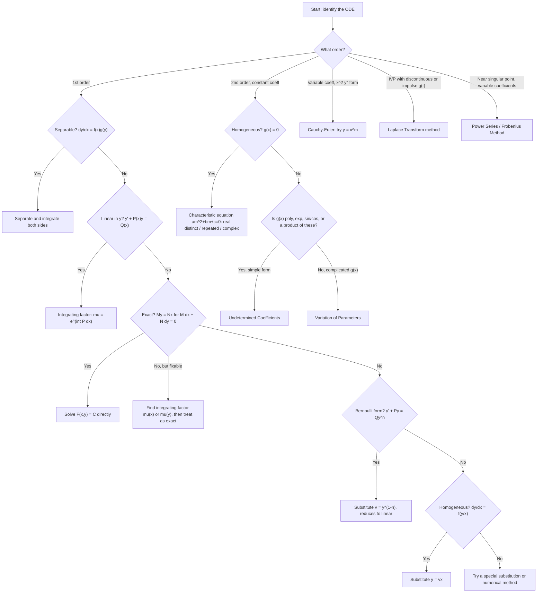

# Calculus & Differential Equations Reference Sheet

## Table of Contents

1. [Derivatives & Integrals](#derivatives--integrals)
   - Basic table, log/exp, inverse trig, hyperbolic, core rules, trig substitution, partial fractions
2. [Differential Equations Cheat Sheet](#differential-equations-cheat-sheet)
3. [Which Method Do I Use? (Decision Tree)](#which-method-do-i-use)
4. [Worked Examples](#worked-examples)

---

## Derivatives & Integrals

### Basic Derivatives & Integrals

| Derivative | Integral |
|---|---|
| $d(x^n)/dx = nx^{n-1}$ | $\int x^n dx = \dfrac{x^{n+1}}{n+1}+C,\; n\neq -1$ |
| $d(e^{ax})/dx = ae^{ax}$ | $\int e^{ax}dx=\dfrac{1}{a}e^{ax}+C$ |
| $d(\sin ax)/dx=a\cos ax$ | $\int \cos(ax)dx=\dfrac{1}{a}\sin(ax)+C$ |
| $d(\cos ax)/dx=-a\sin ax$ | $\int \sin(ax)dx=-\dfrac{1}{a}\cos(ax)+C$ |
| $d(\tan x)/dx=\sec^2x$ | $\int \sec^2x\,dx=\tan x+C$ |
| $d(\sec x)/dx=\sec x\tan x$ | $\int \sec x\tan x\,dx=\sec x+C$ |
| $d(\ln|x|)/dx=1/x$ | $\int \dfrac1x\,dx=\ln|x|+C$ |

### Logarithmic & Exponential

- $d(\ln x)/dx = 1/x$ → $\int \frac{1}{x}dx = \ln|x| + C$
- $d(\log_a x)/dx = \frac{1}{x\ln a}$
- $d(a^x)/dx = a^x \ln a$ → $\int a^x dx = \frac{a^x}{\ln a} + C$

### Inverse Trig

- $d(\sin^{-1}x)/dx = \frac{1}{\sqrt{1-x^2}}$ → $\int \frac{dx}{\sqrt{1-x^2}} = \sin^{-1}x + C$
- $d(\cos^{-1}x)/dx = \frac{-1}{\sqrt{1-x^2}}$
- $d(\tan^{-1}x)/dx = \frac{1}{1+x^2}$ → $\int \frac{dx}{1+x^2} = \tan^{-1}x + C$
- $d(\sec^{-1}x)/dx = \frac{1}{|x|\sqrt{x^2-1}}$ → $\int \frac{dx}{x\sqrt{x^2-1}} = \sec^{-1}|x| + C$

### Hyperbolic

- $d(\sinh x)/dx = \cosh x$ → $\int \cosh x\,dx = \sinh x + C$
- $d(\cosh x)/dx = \sinh x$ → $\int \sinh x\,dx = \cosh x + C$
- $d(\tanh x)/dx = \text{sech}^2 x$ → $\int \text{sech}^2 x\,dx = \tanh x + C$

### Other Standard Trig Integrals

- $\int \tan x\,dx = \ln|\sec x| + C$
- $\int \cot x\,dx = \ln|\sin x| + C$
- $\int \sec x\,dx = \ln|\sec x + \tan x| + C$
- $\int \csc x\,dx = \ln|\csc x - \cot x| + C$
- $\int \csc^2 x\,dx = -\cot x + C$
- $\int \csc x \cot x\,dx = -\csc x + C$

### Core Rules

- **Product rule**: $(fg)' = f'g + fg'$
- **Quotient rule**: $(f/g)' = \dfrac{f'g - fg'}{g^2}$
- **Chain rule**: $\dfrac{d}{dx}f(g(x)) = f'(g(x))g'(x)$
- **Integration by parts**: $\int u\,dv = uv - \int v\,du$
  - LIATE ordering for picking $u$: **L**og, **I**nverse trig, **A**lgebraic, **T**rig, **E**xponential

### Trigonometric Substitution

| Expression in integrand | Substitution | Identity used |
|---|---|---|
| $\sqrt{a^2-x^2}$ | $x=a\sin\theta$ | $1-\sin^2\theta=\cos^2\theta$ |
| $\sqrt{a^2+x^2}$ | $x=a\tan\theta$ | $1+\tan^2\theta=\sec^2\theta$ |
| $\sqrt{x^2-a^2}$ | $x=a\sec\theta$ | $\sec^2\theta-1=\tan^2\theta$ |

### Partial Fractions Quick Reference

- Distinct linear factors: $\dfrac{P(x)}{(x-a)(x-b)} = \dfrac{A}{x-a}+\dfrac{B}{x-b}$
- Repeated linear factor: $\dfrac{P(x)}{(x-a)^2} = \dfrac{A}{x-a}+\dfrac{B}{(x-a)^2}$
- Irreducible quadratic factor: $\dfrac{P(x)}{x^2+bx+c} = \dfrac{Ax+B}{x^2+bx+c}$

---

## Differential Equations Cheat Sheet

### 1st-Order ODEs

**Separable**: $\dfrac{dy}{dx} = f(x)g(y)$ → $\int \dfrac{dy}{g(y)} = \int f(x)\,dx$

**Linear 1st order**: $\dfrac{dy}{dx} + P(x)y = Q(x)$
- Integrating factor: $\mu(x) = e^{\int P(x)dx}$
- Solution: $y\cdot\mu(x) = \int \mu(x)Q(x)\,dx + C$

**Exact equations**: $M(x,y)dx + N(x,y)dy = 0$ is exact if $\partial M/\partial y = \partial N/\partial x$
- Solution $F(x,y) = C$ where $\partial F/\partial x = M$, $\partial F/\partial y = N$
- If not exact, find an integrating factor:
  - $\mu(x) = e^{\int \frac{M_y - N_x}{N}dx}$ if that ratio depends only on $x$
  - $\mu(y) = e^{\int \frac{N_x - M_y}{M}dy}$ if that ratio depends only on $y$

**Bernoulli equation**: $\dfrac{dy}{dx} + P(x)y = Q(x)y^n$
- Substitute $v = y^{1-n}$ → reduces to linear: $\dfrac{dv}{dx} + (1-n)P(x)v = (1-n)Q(x)$

**Homogeneous equation**: $\dfrac{dy}{dx} = f(y/x)$
- Substitute $y = vx$, $\dfrac{dy}{dx} = v + x\dfrac{dv}{dx}$

### 2nd-Order Linear ODEs (Constant Coefficients)

$ay'' + by' + cy = 0$, characteristic equation $am^2 + bm + c = 0$

| Roots | General solution |
|---|---|
| Real distinct $m_1, m_2$ | $y = C_1e^{m_1x} + C_2e^{m_2x}$ |
| Real repeated $m$ | $y = (C_1 + C_2x)e^{mx}$ |
| Complex $\alpha \pm i\beta$ | $y = e^{\alpha x}(C_1\cos\beta x + C_2\sin\beta x)$ |

**Non-homogeneous** $ay'' + by' + cy = g(x)$: $y = y_h + y_p$

**Method of Undetermined Coefficients** (guess $y_p$ based on $g(x)$):

| $g(x)$ | Trial $y_p$ |
|---|---|
| $P_n(x)$ (poly deg $n$) | $Q_n(x)$ (×$x^s$ if root overlap) |
| $ae^{kx}$ | $Ae^{kx}$ (×$x^s$ if $k$ is a root) |
| $a\cos kx + b\sin kx$ | $A\cos kx + B\sin kx$ |
| $e^{kx}(a\cos mx+b\sin mx)$ | $e^{kx}(A\cos mx+B\sin mx)$ |

$s$ = multiplicity of overlap with homogeneous roots (0, 1, or 2).

**Variation of Parameters**: $y_p = -y_1\int \dfrac{y_2 g(x)}{W}dx + y_2\int \dfrac{y_1 g(x)}{W}dx$
where $W = y_1y_2' - y_2y_1'$ (Wronskian)

### Cauchy-Euler Equation

$ax^2y'' + bxy' + cy = 0$
- Substitute $x = e^t$, or try $y = x^m$ → $am(m-1) + bm + c = 0$
- Same real/repeated/complex logic as above, but:
  - Repeated root → $y = (C_1 + C_2\ln x)x^m$
  - Complex root → $y = x^\alpha(C_1\cos(\beta\ln x) + C_2\sin(\beta\ln x))$

### Laplace Transform Table (Common for Solving ODEs)

| $f(t)$ | $\mathcal{L}\{f(t)\} = F(s)$ |
|---|---|
| $1$ | $1/s$ |
| $t^n$ | $n!/s^{n+1}$ |
| $e^{at}$ | $1/(s-a)$ |
| $\sin at$ | $a/(s^2+a^2)$ |
| $\cos at$ | $s/(s^2+a^2)$ |
| $t\,e^{at}$ | $1/(s-a)^2$ |
| $f'(t)$ | $sF(s) - f(0)$ |
| $f''(t)$ | $s^2F(s) - sf(0) - f'(0)$ |

### Series Solutions

- Power series about ordinary point $x_0$: $y = \sum_{n=0}^\infty a_n(x-x_0)^n$
- Frobenius method (regular singular point): $y = x^r\sum_{n=0}^\infty a_n x^n$, indicial equation from lowest power of $x$

---

## Which Method Do I Use?

---

## Worked Examples

### 1. Separable

Solve $\dfrac{dy}{dx} = xy$.

$$\int \frac{dy}{y} = \int x\,dx \implies \ln|y| = \frac{x^2}{2} + C_1 \implies y = Ce^{x^2/2}$$

### 2. Linear 1st Order

Solve $\dfrac{dy}{dx} + 2y = e^{-x}$.

$$\mu(x) = e^{\int 2\,dx} = e^{2x}$$
$$\frac{d}{dx}\left(ye^{2x}\right) = e^{-x}e^{2x} = e^{x}$$
$$ye^{2x} = e^{x} + C \implies y = e^{-x} + Ce^{-2x}$$

### 3. Exact Equation

Solve $(2xy + 3)dx + (x^2 - 1)dy = 0$.

Check: $M_y = 2x$, $N_x = 2x$ — exact.

$$F = \int M\,dx = x^2y + 3x + h(y)$$
$$F_y = x^2 + h'(y) = N = x^2 - 1 \implies h'(y) = -1 \implies h(y) = -y$$
$$\text{Solution: } x^2y + 3x - y = C$$

### 4. Bernoulli

Solve $\dfrac{dy}{dx} + \dfrac{y}{x} = xy^2$.

Here $n = 2$, so let $v = y^{-1}$, $v' = -y^{-2}y'$:

$$\frac{dv}{dx} - \frac{v}{x} = -x$$

Linear in $v$, with $\mu(x) = x^{-1}$:

$$\frac{d}{dx}\left(\frac{v}{x}\right) = -1 \implies \frac{v}{x} = -x + C \implies v = -x^2 + Cx$$
$$\text{So } y = \frac{1}{-x^2 + Cx}$$

### 5. Homogeneous

Solve $\dfrac{dy}{dx} = \dfrac{x^2+y^2}{xy}$.

Let $y = vx$, $\dfrac{dy}{dx} = v + x\dfrac{dv}{dx}$:

$$v + x\frac{dv}{dx} = \frac{1+v^2}{v} \implies x\frac{dv}{dx} = \frac{1}{v}$$
$$v\,dv = \frac{dx}{x} \implies \frac{v^2}{2} = \ln|x| + C \implies y^2 = x^2(2\ln|x| + C')$$

### 6. 2nd-Order, Constant Coefficients (all three root cases)

**Real distinct roots**: $y'' - 5y' + 6y = 0$
$$m^2 - 5m + 6 = 0 \implies m = 2, 3 \implies y = C_1e^{2x} + C_2e^{3x}$$

**Repeated root**: $y'' - 4y' + 4y = 0$
$$m^2 - 4m + 4 = 0 \implies m = 2 \text{ (double)} \implies y = (C_1 + C_2x)e^{2x}$$

**Complex roots**: $y'' + 4y = 0$
$$m^2 + 4 = 0 \implies m = \pm 2i \implies y = C_1\cos 2x + C_2\sin 2x$$

### 7. Undetermined Coefficients

Solve $y'' - 3y' + 2y = 4e^{x}$.

Homogeneous roots: $m = 1, 2$. Since $k=1$ is a root, guess $y_p = Axe^x$ (multiply by $x^s$, $s=1$).

$$y_p' = Ae^x + Axe^x, \quad y_p'' = 2Ae^x + Axe^x$$

Substituting and simplifying gives $-A e^x = 4e^x \implies A = -4$.

$$y = C_1e^x + C_2e^{2x} - 4xe^x$$

### 8. Variation of Parameters

Solve $y'' + y = \tan x$.

Homogeneous solutions: $y_1 = \cos x$, $y_2 = \sin x$, Wronskian $W = \cos^2x + \sin^2x = 1$.

$$y_p = -\cos x\int \sin x \tan x\,dx + \sin x \int \cos x \tan x\,dx$$

The second integral simplifies to $\int \sin x\,dx = -\cos x$, and the first reduces (using $\sin x \tan x = \frac{1-\cos^2x}{\cos x}$) to $\sin x - \ln|\sec x + \tan x|$. Combining:

$$y_p = -\cos x\ln|\sec x + \tan x|$$
$$y = C_1\cos x + C_2\sin x - \cos x\ln|\sec x + \tan x|$$

### 9. Cauchy-Euler

Solve $x^2y'' - 2xy' + 2y = 0$.

Try $y = x^m$: $m(m-1) - 2m + 2 = 0 \implies m^2 - 3m + 2 = 0 \implies m = 1, 2$.

$$y = C_1x + C_2x^2$$

### 10. Laplace Transform (IVP)

Solve $y'' + 3y' + 2y = 0$, $y(0) = 1$, $y'(0) = 0$.

Taking the Laplace transform of both sides:

$$s^2Y - s - 0 + 3(sY - 1) + 2Y = 0$$
$$Y(s^2+3s+2) = s + 3 \implies Y = \frac{s+3}{(s+1)(s+2)}$$

Partial fractions: $Y = \dfrac{2}{s+1} - \dfrac{1}{s+2}$

$$y(t) = 2e^{-t} - e^{-2t}$$

---

*Formatted for `butex-notes` — MATH-103 revision set. Mermaid diagram will render on GitHub natively; for local Neovim preview, use a markdown-preview plugin with Mermaid support (e.g. `markdown-preview.nvim` with the mermaid filetype enabled).*
