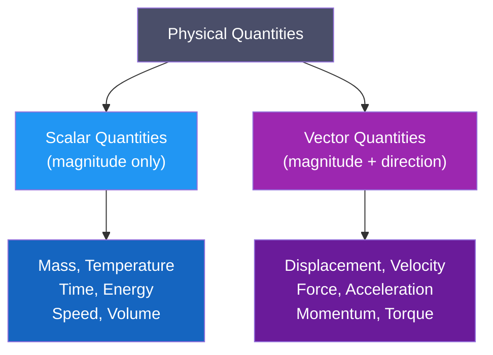
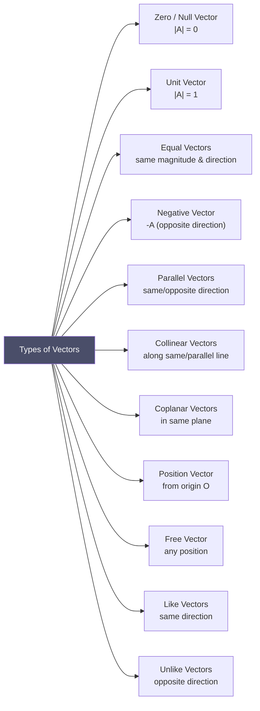

# 📌 Section 2.1 — Scalar and Vector Quantities

> **Course**: MATH-103 | **Topic**: Vector Analysis | **Section**: 2.1

---

## 📋 Table of Contents
1. [Scalar Quantities](#1-scalar-quantities)
2. [Vector Quantities](#2-vector-quantities)
3. [Representation of Vectors](#3-representation-of-vectors)
4. [Types of Vectors](#4-types-of-vectors)
5. [Vector Algebra](#5-vector-algebra)
6. [Unit Vectors and Standard Basis](#6-unit-vectors-and-standard-basis)
7. [Position Vector and Component Form](#7-position-vector-and-component-form)
8. [Direction Cosines and Direction Ratios](#8-direction-cosines-and-direction-ratios)
9. [Worked Examples](#9-worked-examples)
10. [Practice Problems](#10-practice-problems)
11. [Summary](#11-summary)
12. [References](#12-references)

---

## 1. Scalar Quantities

### 1.1 Definition

> **Scalar Quantity**: A physical quantity that is completely described by its **magnitude** (a single real number) and appropriate unit. It has no direction.

A scalar is an element of a field (usually $\mathbb{R}$). It obeys the ordinary rules of algebra.

### 1.2 Examples

| Scalar Quantity | Symbol | SI Unit |
|----------------|--------|---------|
| Mass | $m$ | kg |
| Temperature | $T$ | K or °C |
| Time | $t$ | s |
| Energy / Work | $E$, $W$ | J |
| Speed | $v$ | m/s |
| Electric Charge | $q$ | C |
| Distance | $d$ | m |
| Volume | $V$ | m³ |
| Density | $\rho$ | kg/m³ |
| Pressure | $P$ | Pa |

> **Key Insight**: Scalars can be added, subtracted, multiplied, and divided by the ordinary rules of arithmetic.

---

## 2. Vector Quantities

### 2.1 Definition

> **Vector Quantity**: A physical quantity that requires both **magnitude** *and* **direction** for its complete specification. It obeys the **parallelogram law of addition**.

Mathematically, a vector in $\mathbb{R}^n$ is an ordered $n$-tuple of real numbers.

### 2.2 Examples

| Vector Quantity | Symbol | SI Unit |
|----------------|--------|---------|
| Displacement | $\mathbf{d}$ | m |
| Velocity | $\mathbf{v}$ | m/s |
| Acceleration | $\mathbf{a}$ | m/s² |
| Force | $\mathbf{F}$ | N |
| Momentum | $\mathbf{p}$ | kg·m/s |
| Electric Field | $\mathbf{E}$ | V/m |
| Magnetic Field | $\mathbf{B}$ | T |
| Torque | $\boldsymbol{\tau}$ | N·m |
| Gravitational Field | $\mathbf{g}$ | m/s² |
| Weight | $\mathbf{W}$ | N |

### 2.3 Classification Diagram



### 2.4 Key Distinction

| Property | Scalar | Vector |
|----------|--------|--------|
| Description | Magnitude only | Magnitude + Direction |
| Notation | $m$, $T$, $v$ | $\mathbf{A}$, $\vec{A}$, $\overrightarrow{AB}$ |
| Algebra | Ordinary algebra | Vector algebra |
| Examples | 5 kg, 300 K | 5 N East, 10 m/s² ↓ |
| Graphical | A point on number line | An arrow |

---

## 3. Representation of Vectors

### 3.1 Geometric Representation

A vector is represented by a **directed line segment** (an arrow):
- **Tail** (initial point): starting point
- **Head** (terminal point): ending point
- **Length** of the arrow = magnitude

$$\overrightarrow{AB}: \text{ vector from } A \text{ (tail) to } B \text{ (head)}$$

```
     B
     ↑
     |  → (arrow direction = vector direction)
     |
     A
```

### 3.2 Algebraic Notation

| Notation | Meaning |
|----------|---------|
| $\mathbf{A}$ | Bold lowercase/uppercase (textbook) |
| $\vec{A}$ | Arrow over letter (handwritten) |
| $\overrightarrow{AB}$ | From point A to B |
| $\hat{\mathbf{a}}$ | Unit vector (hat notation) |

### 3.3 Magnitude

The magnitude (length/modulus) of $\mathbf{A}$ is written $|\mathbf{A}|$ or simply $A$ (scalar).

For $\mathbf{A} = A_1\hat{\mathbf{i}} + A_2\hat{\mathbf{j}} + A_3\hat{\mathbf{k}}$:

$$|\mathbf{A}| = \sqrt{A_1^2 + A_2^2 + A_3^2}$$

---

## 4. Types of Vectors

### 4.1 Classification



### 4.2 Detailed Descriptions

| Type | Definition | Symbol |
|------|-----------|--------|
| **Zero / Null vector** | Magnitude = 0, direction undefined | $\mathbf{0}$ |
| **Unit vector** | Magnitude = 1 | $\hat{\mathbf{a}} = \dfrac{\mathbf{A}}{|\mathbf{A}|}$ |
| **Equal vectors** | Same magnitude AND same direction | $\mathbf{A} = \mathbf{B}$ |
| **Negative vector** | Same magnitude, opposite direction | $-\mathbf{A}$ |
| **Parallel vectors** | Parallel lines of action | $\mathbf{A} \parallel \mathbf{B}$ |
| **Collinear vectors** | Lie along the same straight line | — |
| **Coplanar vectors** | Lie in the same plane | — |
| **Position vector** | Drawn from origin O | $\mathbf{r}$ or $\overrightarrow{OP}$ |
| **Coinitial vectors** | Same initial (starting) point | — |
| **Localised vector** | Fixed line of action | — |
| **Free vector** | Line of action not fixed | — |

---

## 5. Vector Algebra

### 5.1 Scalar Multiplication

If $k$ is a scalar and $\mathbf{A}$ is a vector:

$$k\mathbf{A} = (kA_1)\hat{\mathbf{i}} + (kA_2)\hat{\mathbf{j}} + (kA_3)\hat{\mathbf{k}}$$

- $|k\mathbf{A}| = |k| \cdot |\mathbf{A}|$
- If $k > 0$: same direction as $\mathbf{A}$
- If $k < 0$: opposite direction to $\mathbf{A}$
- If $k = 0$: zero vector

### 5.2 Vector Addition

**Geometrically**: Triangle Law or Parallelogram Law

**Triangle Law**: Place the tail of $\mathbf{B}$ at the head of $\mathbf{A}$. The resultant $\mathbf{A} + \mathbf{B}$ goes from the tail of $\mathbf{A}$ to the head of $\mathbf{B}$.

**Parallelogram Law**: If $\mathbf{A}$ and $\mathbf{B}$ are two adjacent sides of a parallelogram, the diagonal represents $\mathbf{A} + \mathbf{B}$.

**Algebraically**:

$$\mathbf{A} + \mathbf{B} = (A_1 + B_1)\hat{\mathbf{i}} + (A_2 + B_2)\hat{\mathbf{j}} + (A_3 + B_3)\hat{\mathbf{k}}$$

### 5.3 Properties of Vector Addition

| Property | Expression |
|----------|-----------|
| **Commutativity** | $\mathbf{A} + \mathbf{B} = \mathbf{B} + \mathbf{A}$ |
| **Associativity** | $(\mathbf{A} + \mathbf{B}) + \mathbf{C} = \mathbf{A} + (\mathbf{B} + \mathbf{C})$ |
| **Identity element** | $\mathbf{A} + \mathbf{0} = \mathbf{A}$ |
| **Inverse element** | $\mathbf{A} + (-\mathbf{A}) = \mathbf{0}$ |
| **Distributivity (scalar)** | $k(\mathbf{A} + \mathbf{B}) = k\mathbf{A} + k\mathbf{B}$ |

### 5.4 Vector Subtraction

$$\mathbf{A} - \mathbf{B} = \mathbf{A} + (-\mathbf{B})$$

$$= (A_1 - B_1)\hat{\mathbf{i}} + (A_2 - B_2)\hat{\mathbf{j}} + (A_3 - B_3)\hat{\mathbf{k}}$$

---

## 6. Unit Vectors and Standard Basis

### 6.1 Standard Basis Vectors

In three-dimensional Cartesian coordinates, the **standard basis vectors** are:

$$\hat{\mathbf{i}} = (1, 0, 0), \quad \hat{\mathbf{j}} = (0, 1, 0), \quad \hat{\mathbf{k}} = (0, 0, 1)$$

They are **mutually perpendicular unit vectors** along the positive $x$-, $y$-, and $z$-axes respectively.

$$|\hat{\mathbf{i}}| = |\hat{\mathbf{j}}| = |\hat{\mathbf{k}}| = 1$$

$$\hat{\mathbf{i}} \perp \hat{\mathbf{j}}, \quad \hat{\mathbf{j}} \perp \hat{\mathbf{k}}, \quad \hat{\mathbf{k}} \perp \hat{\mathbf{i}}$$

### 6.2 Component Form

Any vector $\mathbf{A}$ in 3D space can be written:

$$\mathbf{A} = A_1\hat{\mathbf{i}} + A_2\hat{\mathbf{j}} + A_3\hat{\mathbf{k}}$$

where $A_1, A_2, A_3$ are the **components** (scalar projections) along $x$, $y$, $z$ axes.

### 6.3 Unit Vector in Direction of A

$$\hat{\mathbf{a}} = \frac{\mathbf{A}}{|\mathbf{A}|} = \frac{A_1\hat{\mathbf{i}} + A_2\hat{\mathbf{j}} + A_3\hat{\mathbf{k}}}{\sqrt{A_1^2 + A_2^2 + A_3^2}}$$

---

## 7. Position Vector and Component Form

### 7.1 Position Vector

> The **position vector** of a point $P(x, y, z)$ with respect to origin $O$ is $\overrightarrow{OP} = x\hat{\mathbf{i}} + y\hat{\mathbf{j}} + z\hat{\mathbf{k}}$.

### 7.2 Vector Between Two Points

If $A = (x_1, y_1, z_1)$ and $B = (x_2, y_2, z_2)$, then:

$$\overrightarrow{AB} = \mathbf{b} - \mathbf{a} = (x_2 - x_1)\hat{\mathbf{i}} + (y_2 - y_1)\hat{\mathbf{j}} + (z_2 - z_1)\hat{\mathbf{k}}$$

$$|\overrightarrow{AB}| = \sqrt{(x_2-x_1)^2 + (y_2-y_1)^2 + (z_2-z_1)^2}$$

### 7.3 Section Formula (Midpoint & Division)

**Midpoint** of $AB$:

$$\mathbf{m} = \frac{\mathbf{a} + \mathbf{b}}{2}$$

**Internal division** (point $P$ divides $AB$ in ratio $m:n$ internally):

$$\mathbf{r} = \frac{m\mathbf{b} + n\mathbf{a}}{m + n}$$

**External division** (ratio $m:n$ externally):

$$\mathbf{r} = \frac{m\mathbf{b} - n\mathbf{a}}{m - n}$$

---

## 8. Direction Cosines and Direction Ratios

### 8.1 Direction Angles

Let $\mathbf{A} = A_1\hat{\mathbf{i}} + A_2\hat{\mathbf{j}} + A_3\hat{\mathbf{k}}$. The angles $\alpha$, $\beta$, $\gamma$ that $\mathbf{A}$ makes with the positive $x$-, $y$-, $z$-axes are the **direction angles**.

```
       z
       ↑
       |  /
       | / (γ)
       |/____→ y
      /  (β)
     / (α)
    x
```

### 8.2 Direction Cosines

$$l = \cos\alpha = \frac{A_1}{|\mathbf{A}|}, \quad m = \cos\beta = \frac{A_2}{|\mathbf{A}|}, \quad n = \cos\gamma = \frac{A_3}{|\mathbf{A}|}$$

> **Key Identity**:
$$l^2 + m^2 + n^2 = \cos^2\alpha + \cos^2\beta + \cos^2\gamma = 1$$

This follows because $\hat{\mathbf{a}} = l\hat{\mathbf{i}} + m\hat{\mathbf{j}} + n\hat{\mathbf{k}}$ is a unit vector.

### 8.3 Direction Ratios

Any set of three numbers $(a, b, c)$ proportional to $(l, m, n)$ are called **direction ratios**.

If direction ratios are $(a, b, c)$, then:

$$l = \frac{a}{\sqrt{a^2+b^2+c^2}}, \quad m = \frac{b}{\sqrt{a^2+b^2+c^2}}, \quad n = \frac{c}{\sqrt{a^2+b^2+c^2}}$$

### 8.4 Direction Cosines vs Direction Ratios

| Feature | Direction Cosines | Direction Ratios |
|---------|-----------------|-----------------|
| Notation | $l, m, n$ | $a:b:c$ |
| Uniqueness | Unique (up to sign) | Not unique |
| Constraint | $l^2+m^2+n^2=1$ | No constraint |
| Values | $\in [-1, 1]$ | Any real numbers |

---

## 9. Worked Examples

### Example 1: Magnitude and Unit Vector

**Problem**: Find the magnitude and unit vector of $\mathbf{A} = 2\hat{\mathbf{i}} - 3\hat{\mathbf{j}} + 6\hat{\mathbf{k}}$.

**Solution**:

$$|\mathbf{A}| = \sqrt{(2)^2 + (-3)^2 + (6)^2} = \sqrt{4 + 9 + 36} = \sqrt{49} = 7$$

$$\hat{\mathbf{a}} = \frac{\mathbf{A}}{|\mathbf{A}|} = \frac{2\hat{\mathbf{i}} - 3\hat{\mathbf{j}} + 6\hat{\mathbf{k}}}{7} = \frac{2}{7}\hat{\mathbf{i}} - \frac{3}{7}\hat{\mathbf{j}} + \frac{6}{7}\hat{\mathbf{k}}$$

---

### Example 2: Vector Between Two Points

**Problem**: Find $\overrightarrow{PQ}$ and its magnitude if $P = (1, -2, 4)$ and $Q = (5, 0, -1)$.

**Solution**:

$$\overrightarrow{PQ} = (5-1)\hat{\mathbf{i}} + (0-(-2))\hat{\mathbf{j}} + (-1-4)\hat{\mathbf{k}} = 4\hat{\mathbf{i}} + 2\hat{\mathbf{j}} - 5\hat{\mathbf{k}}$$

$$|\overrightarrow{PQ}| = \sqrt{16 + 4 + 25} = \sqrt{45} = 3\sqrt{5}$$

---

### Example 3: Direction Cosines

**Problem**: Find the direction cosines of $\mathbf{B} = \hat{\mathbf{i}} + 2\hat{\mathbf{j}} - 2\hat{\mathbf{k}}$.

**Solution**:

$$|\mathbf{B}| = \sqrt{1 + 4 + 4} = \sqrt{9} = 3$$

$$l = \cos\alpha = \frac{1}{3}, \quad m = \cos\beta = \frac{2}{3}, \quad n = \cos\gamma = \frac{-2}{3}$$

**Verification**: $l^2 + m^2 + n^2 = \frac{1}{9} + \frac{4}{9} + \frac{4}{9} = \frac{9}{9} = 1$ ✔

---

### Example 4: Section Formula (Internal Division)

**Problem**: Find the position vector of point $P$ that divides $\overrightarrow{AB}$ internally in ratio $2:1$ where $A = (1, 2, 3)$, $B = (4, 5, 6)$.

**Solution**:

$$\mathbf{p} = \frac{2\mathbf{b} + 1\mathbf{a}}{2+1} = \frac{2(4\hat{\mathbf{i}}+5\hat{\mathbf{j}}+6\hat{\mathbf{k}}) + 1(1\hat{\mathbf{i}}+2\hat{\mathbf{j}}+3\hat{\mathbf{k}})}{3}$$

$$= \frac{(8+1)\hat{\mathbf{i}} + (10+2)\hat{\mathbf{j}} + (12+3)\hat{\mathbf{k}}}{3} = \frac{9\hat{\mathbf{i}} + 12\hat{\mathbf{j}} + 15\hat{\mathbf{k}}}{3} = 3\hat{\mathbf{i}} + 4\hat{\mathbf{j}} + 5\hat{\mathbf{k}}$$

---

### Example 5: Direction Angles

**Problem**: If $\cos\alpha = \frac{1}{\sqrt{2}}$, $\cos\beta = \frac{1}{2}$, find $\cos\gamma$.

**Solution**:

Using $l^2 + m^2 + n^2 = 1$:

$$\frac{1}{2} + \frac{1}{4} + \cos^2\gamma = 1 \implies \cos^2\gamma = 1 - \frac{3}{4} = \frac{1}{4}$$

$$\cos\gamma = \pm\frac{1}{2} \implies \gamma = 60° \text{ or } 120°$$

---

## 10. Practice Problems

1. Find the unit vector along $\mathbf{A} = 3\hat{\mathbf{i}} - 4\hat{\mathbf{k}}$.

2. If $\mathbf{A} = 2\hat{\mathbf{i}} + 3\hat{\mathbf{j}} - \hat{\mathbf{k}}$ and $\mathbf{B} = -\hat{\mathbf{i}} + 2\hat{\mathbf{j}} + 3\hat{\mathbf{k}}$, find $|\mathbf{A} - \mathbf{B}|$.

3. Find the direction cosines of the line joining $A(2, -1, 3)$ to $B(4, 3, 1)$.

4. Show that the points $A(1, 2, 3)$, $B(4, 8, 9)$, $C(-2, -4, -3)$ are collinear.

5. A vector has direction ratios $3:-4:5$. Find its direction cosines.

6. Find the midpoint of $A(3, -1, 5)$ and $B(7, 3, -3)$.

---

## 11. Summary

| Concept | Formula | Notes |
|---------|---------|-------|
| Magnitude | $\|\mathbf{A}\| = \sqrt{A_1^2+A_2^2+A_3^2}$ | Always ≥ 0 |
| Unit vector | $\hat{\mathbf{a}} = \mathbf{A}/\|\mathbf{A}\|$ | Magnitude = 1 |
| Direction cosines | $l=A_1/\|\mathbf{A}\|$, etc. | $l^2+m^2+n^2=1$ |
| Vector $\overrightarrow{AB}$ | $\mathbf{b}-\mathbf{a}$ | From A to B |
| Midpoint | $(\mathbf{a}+\mathbf{b})/2$ | — |
| Internal division | $(m\mathbf{b}+n\mathbf{a})/(m+n)$ | — |

---

## 12. References

| Resource | Link |
|----------|------|
| **Khan Academy — Vectors** | https://www.khanacademy.org/math/precalculus/x9e81a4f98389efdf:vectors |
| **Paul's Notes — Vectors** | https://tutorial.math.lamar.edu/Classes/CalcII/Vectors.aspx |
| **LibreTexts — Vectors in Space** | https://math.libretexts.org/Bookshelves/Calculus/Calculus_(OpenStax)/12%3A_Vectors_in_Space |
| **MIT OCW — 12.1 Vectors** | https://ocw.mit.edu/courses/18-02sc-multivariable-calculus-fall-2010/pages/1.-vectors-and-matrices/ |
| **3Blue1Brown — Vectors** | https://www.youtube.com/watch?v=fNk_zzaMoSs |
| **Wikipedia — Euclidean vector** | https://en.wikipedia.org/wiki/Euclidean_vector |
| **Brilliant.org — Vectors** | https://brilliant.org/wiki/vectors/ |
| Kreyszig, *Advanced Engineering Mathematics* (10th ed.) | Chapter 9 |

---

**[↑ Vector Analysis Index](README.md) | [Next: Scalar & Vector Products →](02-scalar-and-vector-products.md)**
