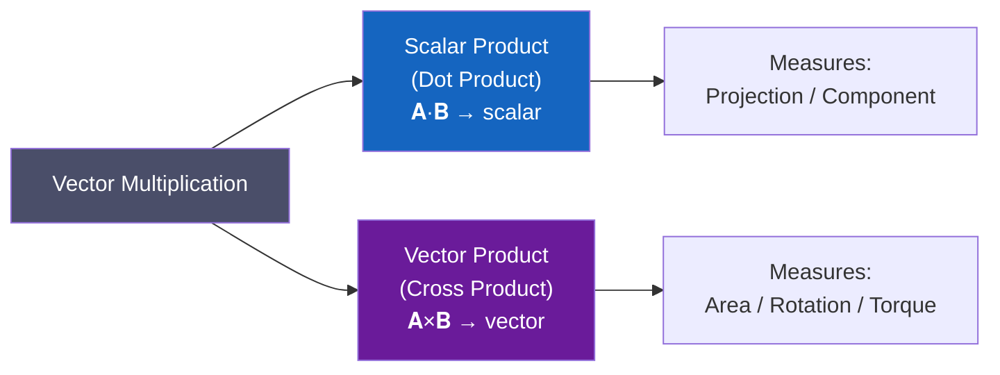
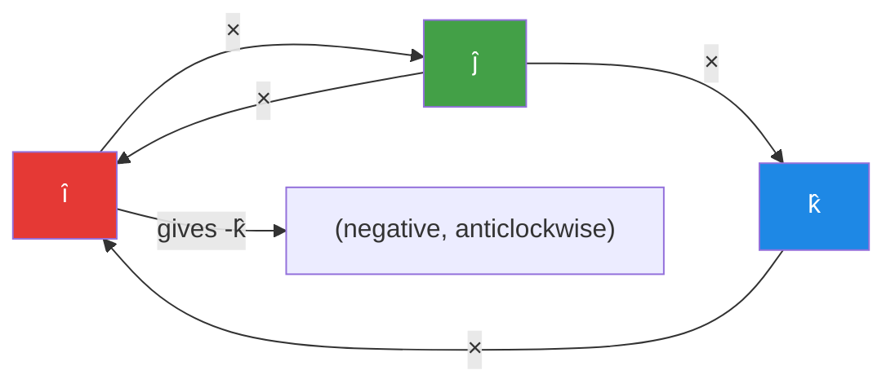

# 📌 Section 2.2 — Scalar and Vector Products

> **Course**: MATH-103 | **Topic**: Vector Analysis | **Section**: 2.2

---

## 📋 Table of Contents
1. [Overview](#1-overview)
2. [Scalar Product (Dot Product)](#2-scalar-product-dot-product)
   - [Definition](#21-definition)
   - [Algebraic Form](#22-algebraic-form)
   - [Properties](#23-properties)
   - [Geometrical Interpretation](#24-geometrical-interpretation)
   - [Applications of Dot Product](#25-applications-of-dot-product)
3. [Vector Product (Cross Product)](#3-vector-product-cross-product)
   - [Definition](#31-definition)
   - [Determinant Form](#32-determinant-form)
   - [Properties](#33-properties)
   - [Geometrical Interpretation](#34-geometrical-interpretation)
   - [Applications of Cross Product](#35-applications-of-cross-product)
4. [Comparison: Dot vs Cross Product](#4-comparison-dot-vs-cross-product)
5. [Worked Examples](#5-worked-examples)
6. [Practice Problems](#6-practice-problems)
7. [Summary](#7-summary)
8. [References](#8-references)

---

## 1. Overview

Two fundamental ways exist to multiply vectors:



---

## 2. Scalar Product (Dot Product)

### 2.1 Definition

> **Scalar Product**: The scalar product of two vectors $\mathbf{A}$ and $\mathbf{B}$ is defined as the product of their magnitudes and the cosine of the angle $\theta$ between them (where $0 \le \theta \le \pi$).

$$\boxed{\mathbf{A} \cdot \mathbf{B} = |\mathbf{A}||\mathbf{B}|\cos\theta}$$

The result is a **scalar** (hence the name).

### 2.2 Algebraic Form

For $\mathbf{A} = A_1\hat{\mathbf{i}} + A_2\hat{\mathbf{j}} + A_3\hat{\mathbf{k}}$ and $\mathbf{B} = B_1\hat{\mathbf{i}} + B_2\hat{\mathbf{j}} + B_3\hat{\mathbf{k}}$:

$$\mathbf{A} \cdot \mathbf{B} = A_1 B_1 + A_2 B_2 + A_3 B_3$$

**Derivation**: From the definition and using orthonormality of basis vectors:

$$\hat{\mathbf{i}} \cdot \hat{\mathbf{i}} = \hat{\mathbf{j}} \cdot \hat{\mathbf{j}} = \hat{\mathbf{k}} \cdot \hat{\mathbf{k}} = 1$$

$$\hat{\mathbf{i}} \cdot \hat{\mathbf{j}} = \hat{\mathbf{j}} \cdot \hat{\mathbf{k}} = \hat{\mathbf{k}} \cdot \hat{\mathbf{i}} = 0$$

Expanding:

$$\mathbf{A} \cdot \mathbf{B} = (A_1\hat{\mathbf{i}} + A_2\hat{\mathbf{j}} + A_3\hat{\mathbf{k}}) \cdot (B_1\hat{\mathbf{i}} + B_2\hat{\mathbf{j}} + B_3\hat{\mathbf{k}}) = A_1 B_1 + A_2 B_2 + A_3 B_3$$

**Angle between vectors**:

$$\cos\theta = \frac{\mathbf{A} \cdot \mathbf{B}}{|\mathbf{A}||\mathbf{B}|} = \frac{A_1 B_1 + A_2 B_2 + A_3 B_3}{\sqrt{A_1^2+A_2^2+A_3^2}\,\sqrt{B_1^2+B_2^2+B_3^2}}$$

### 2.3 Properties

| Property | Expression | Note |
|----------|-----------|------|
| **Commutativity** | $\mathbf{A} \cdot \mathbf{B} = \mathbf{B} \cdot \mathbf{A}$ | — |
| **Distributivity** | $\mathbf{A} \cdot (\mathbf{B} + \mathbf{C}) = \mathbf{A}\cdot\mathbf{B} + \mathbf{A}\cdot\mathbf{C}$ | — |
| **Scalar assoc.** | $(k\mathbf{A}) \cdot \mathbf{B} = k(\mathbf{A} \cdot \mathbf{B})$ | — |
| **Self-dot = sq. magnitude** | $\mathbf{A} \cdot \mathbf{A} = |\mathbf{A}|^2$ | — |
| **Zero vector** | $\mathbf{A} \cdot \mathbf{0} = 0$ | — |
| **Perpendicularity** | $\mathbf{A} \perp \mathbf{B} \iff \mathbf{A} \cdot \mathbf{B} = 0$ | ($\mathbf{A}, \mathbf{B} \neq \mathbf{0}$) |
| **Parallel (same dir.)** | $\mathbf{A} \parallel \mathbf{B} \implies \mathbf{A}\cdot\mathbf{B} = |\mathbf{A}||\mathbf{B}|$ | $\theta = 0°$ |
| **Anti-parallel** | $\mathbf{A} \cdot \mathbf{B} = -|\mathbf{A}||\mathbf{B}|$ | $\theta = 180°$ |

### 2.4 Geometrical Interpretation

The scalar product $\mathbf{A} \cdot \mathbf{B}$ equals:

$$\mathbf{A} \cdot \mathbf{B} = |\mathbf{A}| \underbrace{(|\mathbf{B}|\cos\theta)}_{\text{projection of }\mathbf{B}\text{ on }\mathbf{A}} = |\mathbf{B}| \underbrace{(|\mathbf{A}|\cos\theta)}_{\text{projection of }\mathbf{A}\text{ on }\mathbf{B}}$$

**Scalar Projection** of $\mathbf{B}$ onto $\mathbf{A}$:

$$\text{comp}_{\mathbf{A}}\mathbf{B} = \frac{\mathbf{A} \cdot \mathbf{B}}{|\mathbf{A}|}$$

**Vector Projection** of $\mathbf{B}$ onto $\mathbf{A}$:

$$\text{proj}_{\mathbf{A}}\mathbf{B} = \frac{\mathbf{A} \cdot \mathbf{B}}{|\mathbf{A}|^2}\mathbf{A}$$

```
       B
      /|
     / |
    /  |  B cosθ (projection on A)
   /θ  |
  A----+----------→ A direction
```

### 2.5 Applications of Dot Product

**1. Work Done by a Force**

$$W = \mathbf{F} \cdot \mathbf{d} = |\mathbf{F}||\mathbf{d}|\cos\theta$$

where $\mathbf{F}$ is force and $\mathbf{d}$ is displacement.

**2. Power**

$$P = \mathbf{F} \cdot \mathbf{v}$$

**3. Test for Perpendicularity**: $\mathbf{A} \perp \mathbf{B} \iff \mathbf{A} \cdot \mathbf{B} = 0$

**4. Cauchy-Schwarz Inequality**:

$$|\mathbf{A} \cdot \mathbf{B}| \le |\mathbf{A}||\mathbf{B}|$$

---

## 3. Vector Product (Cross Product)

### 3.1 Definition

> **Vector Product**: The cross product of two vectors $\mathbf{A}$ and $\mathbf{B}$ is a vector $\mathbf{C}$ whose:
> - **Magnitude**: $|\mathbf{C}| = |\mathbf{A}||\mathbf{B}|\sin\theta$
> - **Direction**: perpendicular to the plane of $\mathbf{A}$ and $\mathbf{B}$, given by the **right-hand rule**

$$\boxed{\mathbf{A} \times \mathbf{B} = |\mathbf{A}||\mathbf{B}|\sin\theta\,\hat{\mathbf{n}}}$$

where $\hat{\mathbf{n}}$ is the unit normal perpendicular to both $\mathbf{A}$ and $\mathbf{B}$ (right-hand rule).

**Right-Hand Rule**: Point fingers of right hand in direction of $\mathbf{A}$, curl toward $\mathbf{B}$; the extended thumb points in direction of $\mathbf{A} \times \mathbf{B}$.

### 3.2 Determinant Form

$$\mathbf{A} \times \mathbf{B} = \begin{vmatrix} \hat{\mathbf{i}} & \hat{\mathbf{j}} & \hat{\mathbf{k}} \\ A_1 & A_2 & A_3 \\ B_1 & B_2 & B_3 \end{vmatrix}$$

Expanding along the first row:

$$\mathbf{A} \times \mathbf{B} = (A_2 B_3 - A_3 B_2)\hat{\mathbf{i}} - (A_1 B_3 - A_3 B_1)\hat{\mathbf{j}} + (A_1 B_2 - A_2 B_1)\hat{\mathbf{k}}$$

**Cross products of basis vectors** (cyclic):

$$\hat{\mathbf{i}} \times \hat{\mathbf{j}} = \hat{\mathbf{k}}, \quad \hat{\mathbf{j}} \times \hat{\mathbf{k}} = \hat{\mathbf{i}}, \quad \hat{\mathbf{k}} \times \hat{\mathbf{i}} = \hat{\mathbf{j}}$$

$$\hat{\mathbf{j}} \times \hat{\mathbf{i}} = -\hat{\mathbf{k}}, \quad \hat{\mathbf{k}} \times \hat{\mathbf{j}} = -\hat{\mathbf{i}}, \quad \hat{\mathbf{i}} \times \hat{\mathbf{k}} = -\hat{\mathbf{j}}$$

$$\hat{\mathbf{i}} \times \hat{\mathbf{i}} = \hat{\mathbf{j}} \times \hat{\mathbf{j}} = \hat{\mathbf{k}} \times \hat{\mathbf{k}} = \mathbf{0}$$



The cyclic order $\hat{\mathbf{i}} \to \hat{\mathbf{j}} \to \hat{\mathbf{k}} \to \hat{\mathbf{i}}$ gives **positive** cross products; reversing gives **negative**.

### 3.3 Properties

| Property | Expression | Note |
|----------|-----------|------|
| **Anti-commutativity** | $\mathbf{A} \times \mathbf{B} = -(\mathbf{B} \times \mathbf{A})$ | NOT commutative! |
| **Distributivity** | $\mathbf{A} \times (\mathbf{B}+\mathbf{C}) = \mathbf{A}\times\mathbf{B} + \mathbf{A}\times\mathbf{C}$ | — |
| **Scalar assoc.** | $(k\mathbf{A}) \times \mathbf{B} = k(\mathbf{A} \times \mathbf{B})$ | — |
| **Self-cross = zero** | $\mathbf{A} \times \mathbf{A} = \mathbf{0}$ | $\sin 0 = 0$ |
| **Parallel → zero** | $\mathbf{A} \parallel \mathbf{B} \implies \mathbf{A} \times \mathbf{B} = \mathbf{0}$ | $\sin 0° = \sin 180° = 0$ |
| **Perpendicular → max** | $\mathbf{A} \perp \mathbf{B} \implies |\mathbf{A}\times\mathbf{B}| = |\mathbf{A}||\mathbf{B}|$ | $\sin 90° = 1$ |
| **NOT Associative** | $\mathbf{A}\times(\mathbf{B}\times\mathbf{C}) \neq (\mathbf{A}\times\mathbf{B})\times\mathbf{C}$ | in general |
| **Zero vector** | $\mathbf{A} \times \mathbf{0} = \mathbf{0}$ | — |

### 3.4 Geometrical Interpretation

> $|\mathbf{A} \times \mathbf{B}|$ equals the **area of the parallelogram** formed by $\mathbf{A}$ and $\mathbf{B}$ as adjacent sides.

$$\text{Area of parallelogram} = |\mathbf{A} \times \mathbf{B}| = |\mathbf{A}||\mathbf{B}|\sin\theta$$

$$\text{Area of triangle} = \frac{1}{2}|\mathbf{A} \times \mathbf{B}|$$

**Illustration**:

```
     B
    /|
   / |
  /  |  height = |B|sinθ
 /θ  |
A----|--------→
     ←|A|→
Area = base × height = |A| × |B|sinθ = |A×B|
```

### 3.5 Applications of Cross Product

**1. Torque (Moment of Force)**:

$$\boldsymbol{\tau} = \mathbf{r} \times \mathbf{F}$$

where $\mathbf{r}$ is position vector from pivot and $\mathbf{F}$ is force.

**2. Angular Momentum**:

$$\mathbf{L} = \mathbf{r} \times \mathbf{p} = m(\mathbf{r} \times \mathbf{v})$$

**3. Area of Triangle** with vertices $A$, $B$, $C$:

$$\text{Area} = \frac{1}{2}|\overrightarrow{AB} \times \overrightarrow{AC}|$$

**4. Unit Normal to a Plane** containing $\mathbf{A}$ and $\mathbf{B}$:

$$\hat{\mathbf{n}} = \frac{\mathbf{A} \times \mathbf{B}}{|\mathbf{A} \times \mathbf{B}|}$$

**5. Velocity of rotating body**:

$$\mathbf{v} = \boldsymbol{\omega} \times \mathbf{r}$$

---

## 4. Comparison: Dot vs Cross Product

| Feature | Dot Product $\mathbf{A} \cdot \mathbf{B}$ | Cross Product $\mathbf{A} \times \mathbf{B}$ |
|---------|------|------|
| **Result type** | Scalar | Vector |
| **Formula** | $AB\cos\theta$ | $AB\sin\theta\,\hat{\mathbf{n}}$ |
| **Commutativity** | ✅ $\mathbf{A}\cdot\mathbf{B} = \mathbf{B}\cdot\mathbf{A}$ | ❌ $\mathbf{A}\times\mathbf{B} = -\mathbf{B}\times\mathbf{A}$ |
| **Parallel vectors** | Max: $AB$ | Zero: $\mathbf{0}$ |
| **Perpendicular vectors** | Zero: $0$ | Max: $AB$ |
| **Same vector** | $|\mathbf{A}|^2$ | $\mathbf{0}$ |
| **Geometric meaning** | Projection × magnitude | Area of parallelogram |
| **Application** | Work, power, angle | Torque, area, normal |

---

## 5. Worked Examples

### Example 1: Dot Product and Angle

**Problem**: Find $\mathbf{A} \cdot \mathbf{B}$ and angle between $\mathbf{A} = 2\hat{\mathbf{i}} - \hat{\mathbf{j}} + 3\hat{\mathbf{k}}$ and $\mathbf{B} = \hat{\mathbf{i}} + 2\hat{\mathbf{j}} - \hat{\mathbf{k}}$.

**Solution**:

$$\mathbf{A} \cdot \mathbf{B} = (2)(1) + (-1)(2) + (3)(-1) = 2 - 2 - 3 = -3$$

$$|\mathbf{A}| = \sqrt{4 + 1 + 9} = \sqrt{14}, \quad |\mathbf{B}| = \sqrt{1 + 4 + 1} = \sqrt{6}$$

$$\cos\theta = \frac{-3}{\sqrt{14}\cdot\sqrt{6}} = \frac{-3}{\sqrt{84}} = \frac{-3}{2\sqrt{21}}$$

$$\theta = \cos^{-1}\!\left(\frac{-3}{2\sqrt{21}}\right) \approx \cos^{-1}(-0.327) \approx 109.1°$$

---

### Example 2: Cross Product

**Problem**: Find $\mathbf{A} \times \mathbf{B}$ for $\mathbf{A} = 3\hat{\mathbf{i}} - 2\hat{\mathbf{j}} + \hat{\mathbf{k}}$ and $\mathbf{B} = \hat{\mathbf{i}} + 4\hat{\mathbf{j}} - 2\hat{\mathbf{k}}$.

**Solution**:

$$\mathbf{A} \times \mathbf{B} = \begin{vmatrix} \hat{\mathbf{i}} & \hat{\mathbf{j}} & \hat{\mathbf{k}} \\ 3 & -2 & 1 \\ 1 & 4 & -2 \end{vmatrix}$$

$$= \hat{\mathbf{i}}[(-2)(-2) - (1)(4)] - \hat{\mathbf{j}}[(3)(-2) - (1)(1)] + \hat{\mathbf{k}}[(3)(4) - (-2)(1)]$$

$$= \hat{\mathbf{i}}[4 - 4] - \hat{\mathbf{j}}[-6 - 1] + \hat{\mathbf{k}}[12 + 2]$$

$$= \hat{\mathbf{i}}(0) - \hat{\mathbf{j}}(-7) + \hat{\mathbf{k}}(14) = 7\hat{\mathbf{j}} + 14\hat{\mathbf{k}}$$

**Verification**: $\mathbf{A} \cdot (\mathbf{A}\times\mathbf{B}) = 3(0) + (-2)(7) + 1(14) = 0 - 14 + 14 = 0$ ✔

---

### Example 3: Area of Triangle

**Problem**: Find the area of the triangle with vertices $A(1, 2, 0)$, $B(3, -1, 1)$, $C(2, 4, -2)$.

**Solution**:

$$\overrightarrow{AB} = (3-1)\hat{\mathbf{i}} + (-1-2)\hat{\mathbf{j}} + (1-0)\hat{\mathbf{k}} = 2\hat{\mathbf{i}} - 3\hat{\mathbf{j}} + \hat{\mathbf{k}}$$

$$\overrightarrow{AC} = (2-1)\hat{\mathbf{i}} + (4-2)\hat{\mathbf{j}} + (-2-0)\hat{\mathbf{k}} = \hat{\mathbf{i}} + 2\hat{\mathbf{j}} - 2\hat{\mathbf{k}}$$

$$\overrightarrow{AB} \times \overrightarrow{AC} = \begin{vmatrix} \hat{\mathbf{i}} & \hat{\mathbf{j}} & \hat{\mathbf{k}} \\ 2 & -3 & 1 \\ 1 & 2 & -2 \end{vmatrix}$$

$$= \hat{\mathbf{i}}[(-3)(-2)-(1)(2)] - \hat{\mathbf{j}}[(2)(-2)-(1)(1)] + \hat{\mathbf{k}}[(2)(2)-(-3)(1)]$$

$$= \hat{\mathbf{i}}[6-2] - \hat{\mathbf{j}}[-4-1] + \hat{\mathbf{k}}[4+3]$$

$$= 4\hat{\mathbf{i}} + 5\hat{\mathbf{j}} + 7\hat{\mathbf{k}}$$

$$|\overrightarrow{AB} \times \overrightarrow{AC}| = \sqrt{16 + 25 + 49} = \sqrt{90} = 3\sqrt{10}$$

$$\text{Area} = \frac{1}{2} \cdot 3\sqrt{10} = \frac{3\sqrt{10}}{2} \approx 4.74 \text{ sq. units}$$

---

### Example 4: Work Done

**Problem**: A force $\mathbf{F} = 3\hat{\mathbf{i}} + 2\hat{\mathbf{j}} - \hat{\mathbf{k}}$ N acts on a particle. Find the work done if the displacement is $\mathbf{d} = \hat{\mathbf{i}} - 3\hat{\mathbf{j}} + 2\hat{\mathbf{k}}$ m.

**Solution**:

$$W = \mathbf{F} \cdot \mathbf{d} = (3)(1) + (2)(-3) + (-1)(2) = 3 - 6 - 2 = -5 \text{ J}$$

The negative work means the force opposes the displacement.

---

### Example 5: Perpendicularity Test

**Problem**: Are $\mathbf{A} = 2\hat{\mathbf{i}} + 3\hat{\mathbf{j}} - 6\hat{\mathbf{k}}$ and $\mathbf{B} = 6\hat{\mathbf{i}} + 2\hat{\mathbf{j}} + \frac{7}{2}\hat{\mathbf{k}}$ perpendicular?

**Solution**:

$$\mathbf{A} \cdot \mathbf{B} = (2)(6) + (3)(2) + (-6)\left(\frac{7}{2}\right) = 12 + 6 - 21 = -3 \neq 0$$

Not perpendicular.

---

### Example 6: Torque

**Problem**: A force $\mathbf{F} = 4\hat{\mathbf{i}} - 3\hat{\mathbf{j}} + 2\hat{\mathbf{k}}$ N acts at the point with position vector $\mathbf{r} = \hat{\mathbf{i}} + 2\hat{\mathbf{j}} + 3\hat{\mathbf{k}}$ m. Find the torque.

**Solution**:

$$\boldsymbol{\tau} = \mathbf{r} \times \mathbf{F} = \begin{vmatrix} \hat{\mathbf{i}} & \hat{\mathbf{j}} & \hat{\mathbf{k}} \\ 1 & 2 & 3 \\ 4 & -3 & 2 \end{vmatrix}$$

$$= \hat{\mathbf{i}}[(2)(2)-(3)(-3)] - \hat{\mathbf{j}}[(1)(2)-(3)(4)] + \hat{\mathbf{k}}[(1)(-3)-(2)(4)]$$

$$= \hat{\mathbf{i}}(4+9) - \hat{\mathbf{j}}(2-12) + \hat{\mathbf{k}}(-3-8)$$

$$= 13\hat{\mathbf{i}} + 10\hat{\mathbf{j}} - 11\hat{\mathbf{k}} \text{ N·m}$$

---

## 6. Practice Problems

1. Find $\mathbf{A} \cdot \mathbf{B}$ and $\mathbf{A} \times \mathbf{B}$ for $\mathbf{A} = \hat{\mathbf{i}} + \hat{\mathbf{j}}$ and $\mathbf{B} = \hat{\mathbf{j}} + \hat{\mathbf{k}}$.

2. If $|\mathbf{A}| = 5$, $|\mathbf{B}| = 4$, and $\mathbf{A} \cdot \mathbf{B} = 10$, find the angle between them.

3. Find a unit vector perpendicular to both $\mathbf{A} = 2\hat{\mathbf{i}} + \hat{\mathbf{j}} - \hat{\mathbf{k}}$ and $\mathbf{B} = \hat{\mathbf{i}} - \hat{\mathbf{j}} + 2\hat{\mathbf{k}}$.

4. Find the area of the parallelogram with adjacent sides $\mathbf{A} = 2\hat{\mathbf{i}} + 3\hat{\mathbf{j}}$ and $\mathbf{B} = \hat{\mathbf{i}} - 4\hat{\mathbf{j}} + 2\hat{\mathbf{k}}$.

5. Show that $(\mathbf{A}+\mathbf{B}) \times (\mathbf{A}-\mathbf{B}) = -2(\mathbf{A}\times\mathbf{B})$.

6. Find $\lambda$ if $\mathbf{A} = 2\hat{\mathbf{i}} + \lambda\hat{\mathbf{j}} - \hat{\mathbf{k}}$ is perpendicular to $\mathbf{B} = 3\hat{\mathbf{i}} - 2\hat{\mathbf{j}} + 4\hat{\mathbf{k}}$.

---

## 7. Summary

| Concept | Dot Product | Cross Product |
|---------|------------|---------------|
| **Result** | Scalar | Vector |
| **Magnitude** | $AB\cos\theta$ | $AB\sin\theta$ |
| **Algebraic** | $A_1B_1+A_2B_2+A_3B_3$ | determinant form |
| **Commutative?** | Yes | No (anti-commutative) |
| **= 0 when** | perpendicular | parallel |
| **= max when** | parallel ($\cos\theta=1$) | perpendicular ($\sin\theta=1$) |
| **Geometry** | projection | area / normal |
| **Physics** | work, power | torque, angular momentum |

---

## 8. References

| Resource | Link |
|----------|------|
| **Khan Academy — Dot Product** | https://www.khanacademy.org/math/multivariable-calculus/thinking-about-multivariable-function/x786f2022:vectors-and-spaces/a/dot-products-mv-calc |
| **Khan Academy — Cross Product** | https://www.khanacademy.org/math/multivariable-calculus/thinking-about-multivariable-function/x786f2022:vectors-and-spaces/a/cross-products-mv-calc |
| **Paul's Notes — Dot Product** | https://tutorial.math.lamar.edu/Classes/CalcII/DotProduct.aspx |
| **Paul's Notes — Cross Product** | https://tutorial.math.lamar.edu/Classes/CalcII/CrossProduct.aspx |
| **3Blue1Brown — Dot product** | https://www.youtube.com/watch?v=LyGKycYT2v0 |
| **3Blue1Brown — Cross product** | https://www.youtube.com/watch?v=eu6i7WJeinw |
| **LibreTexts — Dot Product** | https://math.libretexts.org/Bookshelves/Calculus/Calculus_(OpenStax)/12%3A_Vectors_in_Space/12.03%3A_The_Dot_Product |
| **LibreTexts — Cross Product** | https://math.libretexts.org/Bookshelves/Calculus/Calculus_(OpenStax)/12%3A_Vectors_in_Space/12.04%3A_The_Cross_Product |
| Kreyszig, *Advanced Engineering Mathematics* | Chapter 9.2–9.3 |
| Stewart, *Calculus* (8th ed.) | Section 12.3–12.4 |

---

**[← Scalar & Vector Quantities](01-scalar-and-vector-quantities.md) | [↑ Vector Analysis Index](README.md) | [Next: Triple Products →](03-vector-triple-product.md)**
