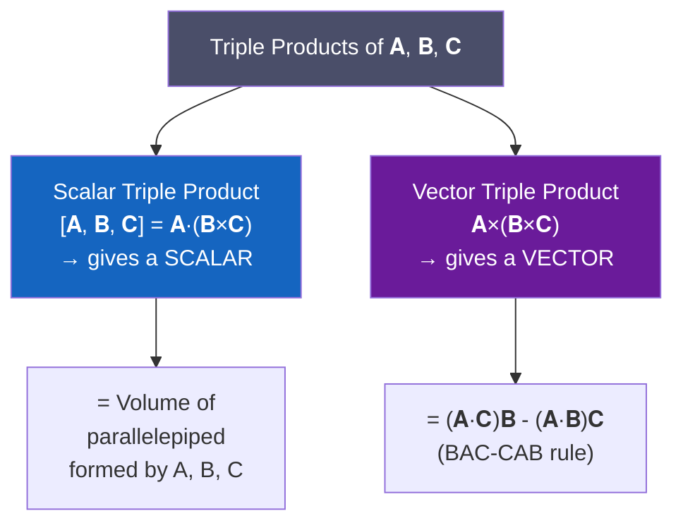

# 📌 Section 2.3 — Vector Triple Product

> **Course**: MATH-103 | **Topic**: Vector Analysis | **Section**: 2.3

---

## 📋 Table of Contents
1. [Introduction](#1-introduction)
2. [Scalar Triple Product](#2-scalar-triple-product)
   - [Definition](#21-definition)
   - [Determinant Form](#22-determinant-form)
   - [Geometrical Interpretation — Volume of Parallelepiped](#23-geometrical-interpretation--volume-of-parallelepiped)
   - [Properties](#24-properties)
   - [Condition for Coplanarity](#25-condition-for-coplanarity)
3. [Vector Triple Product](#3-vector-triple-product)
   - [Definition](#31-definition)
   - [BAC-CAB Rule (Lagrange's Formula)](#32-bac-cab-rule-lagranges-formula)
   - [Proof of BAC-CAB Rule](#33-proof-of-bac-cab-rule)
   - [Properties](#34-properties)
4. [Comparison](#4-comparison)
5. [Worked Examples](#5-worked-examples)
6. [Practice Problems](#6-practice-problems)
7. [Summary](#7-summary)
8. [References](#8-references)

---

## 1. Introduction

When three vectors are combined, we get **triple products**. Two distinct types arise:

---

## 2. Scalar Triple Product

### 2.1 Definition

> **Scalar Triple Product** of three vectors $\mathbf{A}$, $\mathbf{B}$, $\mathbf{C}$ is defined as:

$$[\mathbf{A},\mathbf{B},\mathbf{C}] = \mathbf{A} \cdot (\mathbf{B} \times \mathbf{C})$$

**Result is always a scalar** (a real number).

Other notations: $[\mathbf{A}\ \mathbf{B}\ \mathbf{C}]$, $\mathbf{A} \cdot (\mathbf{B} \times \mathbf{C})$, $(\mathbf{A}, \mathbf{B}, \mathbf{C})$

### 2.2 Determinant Form

Let $\mathbf{A} = A_1\hat{\mathbf{i}} + A_2\hat{\mathbf{j}} + A_3\hat{\mathbf{k}}$, $\mathbf{B} = B_1\hat{\mathbf{i}} + B_2\hat{\mathbf{j}} + B_3\hat{\mathbf{k}}$, $\mathbf{C} = C_1\hat{\mathbf{i}} + C_2\hat{\mathbf{j}} + C_3\hat{\mathbf{k}}$.

First compute $\mathbf{B} \times \mathbf{C}$:

$$\mathbf{B} \times \mathbf{C} = \begin{vmatrix} \hat{\mathbf{i}} & \hat{\mathbf{j}} & \hat{\mathbf{k}} \\ B_1 & B_2 & B_3 \\ C_1 & C_2 & C_3 \end{vmatrix}$$

Then dot with $\mathbf{A}$:

$$\boxed{\mathbf{A} \cdot (\mathbf{B} \times \mathbf{C}) = \begin{vmatrix} A_1 & A_2 & A_3 \\ B_1 & B_2 & B_3 \\ C_1 & C_2 & C_3 \end{vmatrix}}$$

**Derivation**:

$$\mathbf{B} \times \mathbf{C} = (B_2C_3 - B_3C_2)\hat{\mathbf{i}} - (B_1C_3 - B_3C_1)\hat{\mathbf{j}} + (B_1C_2 - B_2C_1)\hat{\mathbf{k}}$$

$$\mathbf{A}\cdot(\mathbf{B}\times\mathbf{C}) = A_1(B_2C_3-B_3C_2) - A_2(B_1C_3-B_3C_1) + A_3(B_1C_2-B_2C_1)$$

$$= \begin{vmatrix} A_1 & A_2 & A_3 \\ B_1 & B_2 & B_3 \\ C_1 & C_2 & C_3 \end{vmatrix}$$

### 2.3 Geometrical Interpretation — Volume of Parallelepiped

> $|\mathbf{A} \cdot (\mathbf{B} \times \mathbf{C})|$ equals the **volume of the parallelepiped** whose three adjacent edges are represented by $\mathbf{A}$, $\mathbf{B}$, and $\mathbf{C}$.

**Why?**

- $|\mathbf{B} \times \mathbf{C}|$ = area of the base parallelogram (formed by $\mathbf{B}$ and $\mathbf{C}$)
- $\hat{\mathbf{n}} = \frac{\mathbf{B}\times\mathbf{C}}{|\mathbf{B}\times\mathbf{C}|}$ = unit normal to the base
- Height of parallelepiped = projection of $\mathbf{A}$ onto $\hat{\mathbf{n}}$ = $\mathbf{A} \cdot \hat{\mathbf{n}} = \frac{\mathbf{A}\cdot(\mathbf{B}\times\mathbf{C})}{|\mathbf{B}\times\mathbf{C}|}$

Therefore:

$$V = \text{Base Area} \times \text{Height} = |\mathbf{B}\times\mathbf{C}| \cdot \frac{|\mathbf{A}\cdot(\mathbf{B}\times\mathbf{C})|}{|\mathbf{B}\times\mathbf{C}|} = |\mathbf{A}\cdot(\mathbf{B}\times\mathbf{C})|$$

$$\boxed{V_{\text{parallelepiped}} = |[\mathbf{A},\mathbf{B},\mathbf{C}]|}$$

**Volume of tetrahedron** with edges $\mathbf{A}$, $\mathbf{B}$, $\mathbf{C}$ from one vertex:

$$V_{\text{tetrahedron}} = \frac{1}{6}|[\mathbf{A},\mathbf{B},\mathbf{C}]|$$

### 2.4 Properties

| Property | Expression | Explanation |
|----------|-----------|-------------|
| **Cyclic permutation** | $\mathbf{A}\cdot(\mathbf{B}\times\mathbf{C}) = \mathbf{B}\cdot(\mathbf{C}\times\mathbf{A}) = \mathbf{C}\cdot(\mathbf{A}\times\mathbf{B})$ | Row permutation (even) |
| **Anti-cyclic** | $\mathbf{A}\cdot(\mathbf{B}\times\mathbf{C}) = -\mathbf{A}\cdot(\mathbf{C}\times\mathbf{B})$ | Odd row swap |
| **Dot & Cross interchange** | $\mathbf{A}\cdot(\mathbf{B}\times\mathbf{C}) = (\mathbf{A}\times\mathbf{B})\cdot\mathbf{C}$ | Dot/cross can swap |
| **Repeated vector = 0** | $\mathbf{A}\cdot(\mathbf{A}\times\mathbf{C}) = 0$ | Two equal rows in det |
| **Scalar multiplication** | $[k\mathbf{A},\mathbf{B},\mathbf{C}] = k[\mathbf{A},\mathbf{B},\mathbf{C}]$ | Factor out |
| **Sign reversal** | $[\mathbf{A},\mathbf{B},\mathbf{C}] = -[\mathbf{B},\mathbf{A},\mathbf{C}]$ | Swap two vectors |

**Proof of cyclic property**: Determinant is unchanged by cyclic permutation of rows.

$$\begin{vmatrix} A_1 & A_2 & A_3 \\ B_1 & B_2 & B_3 \\ C_1 & C_2 & C_3 \end{vmatrix} = \begin{vmatrix} B_1 & B_2 & B_3 \\ C_1 & C_2 & C_3 \\ A_1 & A_2 & A_3 \end{vmatrix} = \begin{vmatrix} C_1 & C_2 & C_3 \\ A_1 & A_2 & A_3 \\ B_1 & B_2 & B_3 \end{vmatrix}$$

### 2.5 Condition for Coplanarity

> Three vectors $\mathbf{A}$, $\mathbf{B}$, $\mathbf{C}$ are **coplanar** if and only if their scalar triple product is zero:

$$[\mathbf{A},\mathbf{B},\mathbf{C}] = 0 \iff \mathbf{A},\mathbf{B},\mathbf{C} \text{ are coplanar}$$

**Reason**: If all three lie in the same plane, the "parallelepiped" collapses to a flat shape with volume = 0.

**Four points coplanar**: Points $P$, $Q$, $R$, $S$ are coplanar iff:

$$[\overrightarrow{PQ}, \overrightarrow{PR}, \overrightarrow{PS}] = 0$$

---

## 3. Vector Triple Product

### 3.1 Definition

> **Vector Triple Product** of three vectors $\mathbf{A}$, $\mathbf{B}$, $\mathbf{C}$ is:

$$\mathbf{A} \times (\mathbf{B} \times \mathbf{C})$$

This is a **vector**, lying in the plane of $\mathbf{B}$ and $\mathbf{C}$.

> ⚠️ **Warning**: The vector triple product is **NOT associative**:
> $$\mathbf{A} \times (\mathbf{B} \times \mathbf{C}) \neq (\mathbf{A} \times \mathbf{B}) \times \mathbf{C}$$

### 3.2 BAC-CAB Rule (Lagrange's Formula)

$$\boxed{\mathbf{A} \times (\mathbf{B} \times \mathbf{C}) = \mathbf{B}(\mathbf{A} \cdot \mathbf{C}) - \mathbf{C}(\mathbf{A} \cdot \mathbf{B})}$$

**Mnemonic**: **BAC - CAB**

$$\underbrace{\mathbf{B}(\mathbf{A}\cdot\mathbf{C})}_{\text{BAC}} - \underbrace{\mathbf{C}(\mathbf{A}\cdot\mathbf{B})}_{\text{CAB}}$$

Similarly:

$$(\mathbf{A} \times \mathbf{B}) \times \mathbf{C} = \mathbf{B}(\mathbf{A} \cdot \mathbf{C}) - \mathbf{A}(\mathbf{B} \cdot \mathbf{C})$$

### 3.3 Proof of BAC-CAB Rule

Let $\mathbf{A} = A_1\hat{\mathbf{i}} + A_2\hat{\mathbf{j}} + A_3\hat{\mathbf{k}}$, $\mathbf{B} = B_1\hat{\mathbf{i}} + B_2\hat{\mathbf{j}} + B_3\hat{\mathbf{k}}$, $\mathbf{C} = C_1\hat{\mathbf{i}} + C_2\hat{\mathbf{j}} + C_3\hat{\mathbf{k}}$.

**Step 1**: Compute $\mathbf{B} \times \mathbf{C}$:

$$\mathbf{B} \times \mathbf{C} = (B_2C_3 - B_3C_2)\hat{\mathbf{i}} + (B_3C_1 - B_1C_3)\hat{\mathbf{j}} + (B_1C_2 - B_2C_1)\hat{\mathbf{k}}$$

**Step 2**: Compute $\mathbf{A} \times (\mathbf{B} \times \mathbf{C})$. Let $\mathbf{P} = \mathbf{B}\times\mathbf{C} = P_1\hat{\mathbf{i}}+P_2\hat{\mathbf{j}}+P_3\hat{\mathbf{k}}$:

$$\mathbf{A} \times \mathbf{P} = (A_2P_3 - A_3P_2)\hat{\mathbf{i}} + (A_3P_1 - A_1P_3)\hat{\mathbf{j}} + (A_1P_2 - A_2P_1)\hat{\mathbf{k}}$$

**Step 3**: Expand the $\hat{\mathbf{i}}$ component:

$$A_2P_3 - A_3P_2 = A_2(B_1C_2-B_2C_1) - A_3(B_3C_1-B_1C_3)$$

$$= A_2B_1C_2 - A_2B_2C_1 - A_3B_3C_1 + A_3B_1C_3$$

$$= B_1(A_2C_2 + A_3C_3) - C_1(A_2B_2 + A_3B_3)$$

Adding and subtracting $B_1A_1C_1 - C_1A_1B_1 = 0$:

$$= B_1(A_1C_1 + A_2C_2 + A_3C_3) - C_1(A_1B_1 + A_2B_2 + A_3B_3)$$

$$= B_1(\mathbf{A}\cdot\mathbf{C}) - C_1(\mathbf{A}\cdot\mathbf{B})$$

This is the $\hat{\mathbf{i}}$-component of $\mathbf{B}(\mathbf{A}\cdot\mathbf{C}) - \mathbf{C}(\mathbf{A}\cdot\mathbf{B})$.

The same holds for $\hat{\mathbf{j}}$ and $\hat{\mathbf{k}}$ components by symmetry. Therefore:

$$\mathbf{A} \times (\mathbf{B} \times \mathbf{C}) = \mathbf{B}(\mathbf{A}\cdot\mathbf{C}) - \mathbf{C}(\mathbf{A}\cdot\mathbf{B}) \qquad \blacksquare$$

### 3.4 Properties

| Property | Expression |
|----------|-----------|
| **Lies in plane of B and C** | $\mathbf{A}\times(\mathbf{B}\times\mathbf{C})$ is a linear combination of $\mathbf{B}$ and $\mathbf{C}$ |
| **NOT associative** | $\mathbf{A}\times(\mathbf{B}\times\mathbf{C}) \neq (\mathbf{A}\times\mathbf{B})\times\mathbf{C}$ |
| **Repeated vector = 0** | $\mathbf{A}\times(\mathbf{A}\times\mathbf{C}) = \mathbf{A}(\mathbf{A}\cdot\mathbf{C}) - \mathbf{C}|\mathbf{A}|^2$ |
| **Lagrange identity** | $|\mathbf{A}\times\mathbf{B}|^2 = |\mathbf{A}|^2|\mathbf{B}|^2 - (\mathbf{A}\cdot\mathbf{B})^2$ |

**Lagrange's Identity** (useful shortcut):

$$|\mathbf{A} \times \mathbf{B}|^2 = |\mathbf{A}|^2|\mathbf{B}|^2 - (\mathbf{A} \cdot \mathbf{B})^2$$

*Proof*: $|\mathbf{A}\times\mathbf{B}|^2 = A^2B^2\sin^2\theta = A^2B^2(1-\cos^2\theta) = A^2B^2 - (AB\cos\theta)^2 = |\mathbf{A}|^2|\mathbf{B}|^2 - (\mathbf{A}\cdot\mathbf{B})^2$ $\quad\square$

---

## 4. Comparison

| Feature | Scalar Triple Product | Vector Triple Product |
|---------|----------------------|----------------------|
| **Notation** | $[\mathbf{A},\mathbf{B},\mathbf{C}] = \mathbf{A}\cdot(\mathbf{B}\times\mathbf{C})$ | $\mathbf{A}\times(\mathbf{B}\times\mathbf{C})$ |
| **Result** | Scalar | Vector |
| **Value** | Determinant of $3\times 3$ matrix | $\mathbf{B}(\mathbf{A}\cdot\mathbf{C}) - \mathbf{C}(\mathbf{A}\cdot\mathbf{B})$ |
| **Geometric meaning** | Volume of parallelepiped | Lies in plane of $\mathbf{B}$ and $\mathbf{C}$ |
| **Commutative?** | Cyclic: $[\mathbf{A}\mathbf{B}\mathbf{C}]=[\mathbf{B}\mathbf{C}\mathbf{A}]$ | Not commutative |
| **= 0 when** | $\mathbf{A},\mathbf{B},\mathbf{C}$ coplanar | $\mathbf{A}$ parallel to $\mathbf{B}\times\mathbf{C}$ |

---

## 5. Worked Examples

### Example 1: Scalar Triple Product

**Problem**: Find $[\mathbf{A},\mathbf{B},\mathbf{C}]$ for $\mathbf{A} = \hat{\mathbf{i}} + 2\hat{\mathbf{j}} - \hat{\mathbf{k}}$, $\mathbf{B} = 3\hat{\mathbf{i}} - \hat{\mathbf{j}} + 2\hat{\mathbf{k}}$, $\mathbf{C} = 2\hat{\mathbf{i}} + \hat{\mathbf{j}} + \hat{\mathbf{k}}$.

**Solution**:

$$[\mathbf{A},\mathbf{B},\mathbf{C}] = \begin{vmatrix} 1 & 2 & -1 \\ 3 & -1 & 2 \\ 2 & 1 & 1 \end{vmatrix}$$

Expanding along the first row:

$$= 1\begin{vmatrix}-1 & 2 \\ 1 & 1\end{vmatrix} - 2\begin{vmatrix}3 & 2 \\ 2 & 1\end{vmatrix} + (-1)\begin{vmatrix}3 & -1 \\ 2 & 1\end{vmatrix}$$

$$= 1(-1-2) - 2(3-4) + (-1)(3+2)$$

$$= (-3) - 2(-1) + (-1)(5) = -3 + 2 - 5 = -6$$

**Volume of parallelepiped** = $|-6| = 6$ cubic units.

---

### Example 2: Volume of Tetrahedron

**Problem**: Find the volume of the tetrahedron with vertices $A(1,1,1)$, $B(2,1,0)$, $C(1,2,0)$, $D(0,1,2)$.

**Solution**:

$$\overrightarrow{AB} = (1,0,-1), \quad \overrightarrow{AC} = (0,1,-1), \quad \overrightarrow{AD} = (-1,0,1)$$

$$V = \frac{1}{6}\left|\begin{vmatrix} 1 & 0 & -1 \\ 0 & 1 & -1 \\ -1 & 0 & 1 \end{vmatrix}\right|$$

$$= \frac{1}{6}\left|1(1-0) - 0 + (-1)(0+1)\right| = \frac{1}{6}|1 - 1| = 0$$

The four points are **coplanar** (volume = 0)!

---

### Example 3: Test for Coplanarity

**Problem**: Check if $\mathbf{A} = 2\hat{\mathbf{i}} + \hat{\mathbf{j}} - \hat{\mathbf{k}}$, $\mathbf{B} = \hat{\mathbf{i}} - \hat{\mathbf{j}} + 2\hat{\mathbf{k}}$, $\mathbf{C} = 3\hat{\mathbf{i}} - \hat{\mathbf{j}} + 3\hat{\mathbf{k}}$ are coplanar.

**Solution**:

$$[\mathbf{A},\mathbf{B},\mathbf{C}] = \begin{vmatrix} 2 & 1 & -1 \\ 1 & -1 & 2 \\ 3 & -1 & 3 \end{vmatrix}$$

$$= 2(-3+2) - 1(3-6) + (-1)(-1+3) = 2(-1) - 1(-3) + (-1)(2)$$

$$= -2 + 3 - 2 = -1 \neq 0$$

Vectors are **not coplanar**.

---

### Example 4: Vector Triple Product

**Problem**: Find $\mathbf{A} \times (\mathbf{B} \times \mathbf{C})$ where $\mathbf{A} = 2\hat{\mathbf{i}} - \hat{\mathbf{j}} + 3\hat{\mathbf{k}}$, $\mathbf{B} = \hat{\mathbf{i}} + 2\hat{\mathbf{j}} - \hat{\mathbf{k}}$, $\mathbf{C} = \hat{\mathbf{i}} - \hat{\mathbf{j}} + 2\hat{\mathbf{k}}$.

**Solution using BAC-CAB rule**:

First compute the dot products:

$$\mathbf{A} \cdot \mathbf{C} = (2)(1) + (-1)(-1) + (3)(2) = 2 + 1 + 6 = 9$$

$$\mathbf{A} \cdot \mathbf{B} = (2)(1) + (-1)(2) + (3)(-1) = 2 - 2 - 3 = -3$$

Apply BAC-CAB:

$$\mathbf{A} \times (\mathbf{B} \times \mathbf{C}) = \mathbf{B}(\mathbf{A}\cdot\mathbf{C}) - \mathbf{C}(\mathbf{A}\cdot\mathbf{B})$$

$$= 9(\hat{\mathbf{i}} + 2\hat{\mathbf{j}} - \hat{\mathbf{k}}) - (-3)(\hat{\mathbf{i}} - \hat{\mathbf{j}} + 2\hat{\mathbf{k}})$$

$$= (9\hat{\mathbf{i}} + 18\hat{\mathbf{j}} - 9\hat{\mathbf{k}}) + (3\hat{\mathbf{i}} - 3\hat{\mathbf{j}} + 6\hat{\mathbf{k}})$$

$$= 12\hat{\mathbf{i}} + 15\hat{\mathbf{j}} - 3\hat{\mathbf{k}}$$

---

### Example 5: Lagrange's Identity

**Problem**: Verify Lagrange's Identity for $\mathbf{A} = \hat{\mathbf{i}} + 2\hat{\mathbf{j}}$ and $\mathbf{B} = 2\hat{\mathbf{i}} - \hat{\mathbf{j}} + 2\hat{\mathbf{k}}$.

**Solution**:

$$|\mathbf{A}|^2 = 1 + 4 = 5, \quad |\mathbf{B}|^2 = 4 + 1 + 4 = 9$$

$$\mathbf{A} \cdot \mathbf{B} = 2 - 2 + 0 = 0$$

$$\mathbf{A} \times \mathbf{B} = \begin{vmatrix}\hat{\mathbf{i}} & \hat{\mathbf{j}} & \hat{\mathbf{k}} \\ 1 & 2 & 0 \\ 2 & -1 & 2\end{vmatrix} = \hat{\mathbf{i}}(4) - \hat{\mathbf{j}}(2) + \hat{\mathbf{k}}(-5) = 4\hat{\mathbf{i}} - 2\hat{\mathbf{j}} - 5\hat{\mathbf{k}}$$

$$|\mathbf{A}\times\mathbf{B}|^2 = 16 + 4 + 25 = 45$$

**LHS**: $|\mathbf{A}\times\mathbf{B}|^2 = 45$

**RHS**: $|\mathbf{A}|^2|\mathbf{B}|^2 - (\mathbf{A}\cdot\mathbf{B})^2 = 5 \cdot 9 - 0 = 45$ ✔

---

## 6. Practice Problems

1. Find the volume of parallelepiped with edges $\hat{\mathbf{i}}+\hat{\mathbf{j}}$, $\hat{\mathbf{j}}+\hat{\mathbf{k}}$, $\hat{\mathbf{k}}+\hat{\mathbf{i}}$.

2. Show that $[\mathbf{A}\!+\!\mathbf{B},\ \mathbf{B}\!+\!\mathbf{C},\ \mathbf{C}\!+\!\mathbf{A}] = 2[\mathbf{A},\mathbf{B},\mathbf{C}]$.

3. Find $\mathbf{A}\times(\mathbf{B}\times\mathbf{C})$ for $\mathbf{A}=\hat{\mathbf{i}}-\hat{\mathbf{j}}$, $\mathbf{B}=\hat{\mathbf{j}}-\hat{\mathbf{k}}$, $\mathbf{C}=\hat{\mathbf{k}}-\hat{\mathbf{i}}$.

4. Find $\lambda$ such that $\hat{\mathbf{i}}+\lambda\hat{\mathbf{j}}+3\hat{\mathbf{k}}$, $\hat{\mathbf{i}}+3\hat{\mathbf{j}}-\hat{\mathbf{k}}$, $-\hat{\mathbf{i}}+\lambda\hat{\mathbf{k}}$ are coplanar.

5. Show that $\mathbf{A}\times(\mathbf{B}\times\mathbf{C}) + \mathbf{B}\times(\mathbf{C}\times\mathbf{A}) + \mathbf{C}\times(\mathbf{A}\times\mathbf{B}) = \mathbf{0}$.

6. If $\mathbf{A} = 2\hat{\mathbf{i}} - 3\hat{\mathbf{j}} + \hat{\mathbf{k}}$, $\mathbf{B} = \hat{\mathbf{i}} + \hat{\mathbf{j}} - 2\hat{\mathbf{k}}$, $\mathbf{C} = 3\hat{\mathbf{i}} + \hat{\mathbf{j}} - \hat{\mathbf{k}}$, find the volume of the tetrahedron.

---

## 7. Summary

| Concept | Formula | Geometric Meaning |
|---------|---------|------------------|
| Scalar triple product | $\mathbf{A}\cdot(\mathbf{B}\times\mathbf{C}) = \det[\mathbf{A},\mathbf{B},\mathbf{C}]$ | Volume of parallelepiped |
| Coplanar test | $[\mathbf{A},\mathbf{B},\mathbf{C}] = 0$ | Zero volume ↔ coplanar |
| Cyclic property | $[\mathbf{A},\mathbf{B},\mathbf{C}]=[\mathbf{B},\mathbf{C},\mathbf{A}]=[\mathbf{C},\mathbf{A},\mathbf{B}]$ | Determinant row cycles |
| Vector triple product | $\mathbf{A}\times(\mathbf{B}\times\mathbf{C}) = \mathbf{B}(\mathbf{A}\cdot\mathbf{C})-\mathbf{C}(\mathbf{A}\cdot\mathbf{B})$ | BAC-CAB rule |
| Lagrange's identity | $|\mathbf{A}\times\mathbf{B}|^2 = |\mathbf{A}|^2|\mathbf{B}|^2-(\mathbf{A}\cdot\mathbf{B})^2$ | — |

---

## 8. References

| Resource | Link |
|----------|------|
| **Paul's Notes — Triple Products** | https://tutorial.math.lamar.edu/Classes/CalcII/CrossProduct.aspx |
| **LibreTexts — Triple Products** | https://math.libretexts.org/Bookshelves/Calculus/Calculus_(OpenStax)/12%3A_Vectors_in_Space/12.04%3A_The_Cross_Product |
| **MIT OCW — Scalar Triple Product** | https://ocw.mit.edu/courses/18-02sc-multivariable-calculus-fall-2010/ |
| **Khan Academy — Cross Products** | https://www.khanacademy.org/math/linear-algebra/vectors-and-spaces/cross-products/v/proof-relationship-between-cross-product-and-sin-of-angle |
| **Wikipedia — Triple Product** | https://en.wikipedia.org/wiki/Triple_product |
| Kreyszig, *Advanced Engineering Mathematics* | Chapter 9.3 |
| Stewart, *Calculus*, §12.4 | — |

---

**[← Scalar & Vector Products](02-scalar-and-vector-products.md) | [↑ Vector Analysis Index](README.md) | [Next: Scalar & Vector Functions →](04-scalar-and-vector-functions.md)**
