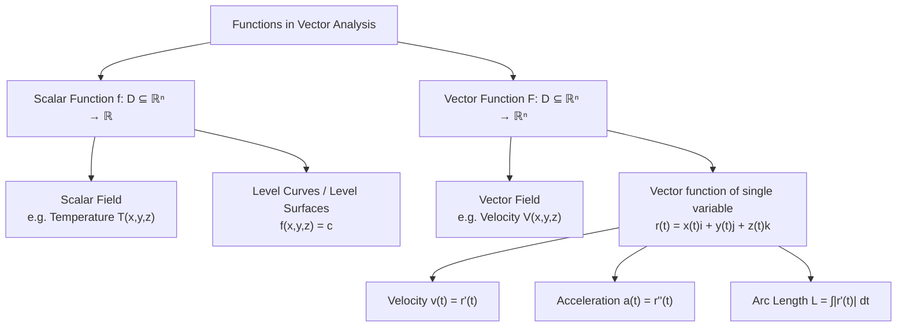

# Scalar and Vector Functions

> **Module:** Vector Analysis
> **Topic 4 of 10**
> **Last Updated:** June 20, 2026

## Table of Contents

1. [Introduction](#1-introduction)
2. [Scalar Functions (Scalar Fields)](#2-scalar-functions-scalar-fields)
3. [Vector Functions (Vector Fields)](#3-vector-functions-vector-fields)
4. [Vector Functions of a Single Variable](#4-vector-functions-of-a-single-variable)
5. [Limits and Continuity](#5-limits-and-continuity)
6. [Differentiation of Vector Functions](#6-differentiation-of-vector-functions)
7. [Integration of Vector Functions](#7-integration-of-vector-functions)
8. [Worked Examples](#8-worked-examples)
9. [Applications](#9-applications)
10. [Diagrams](#10-diagrams)
11. [Summary](#11-summary)
12. [References](#12-references)

---

## 1. Introduction

In vector analysis, we generalize ordinary single-variable calculus to functions whose **input** and/or **output** can be vectors. There are two essential categories:

| Type | Domain | Range | Example |
|---|---|---|---|
| **Scalar function (field)** | Points in space ($\mathbb{R}^n$) or a real parameter | Real number ($\mathbb{R}$) | Temperature $T(x,y,z)$ |
| **Vector function (field)** | Points in space, or a real parameter | Vector ($\mathbb{R}^n$) | Velocity $\vec{V}(x,y,z)$ |

A **field** assigns a quantity to every point in a region of space, while a **vector function of a single variable** traces out a curve as its parameter varies. Both are foundational to everything that follows — gradient, divergence, curl, and the integral theorems.

---

## 2. Scalar Functions (Scalar Fields)

### 2.1 Definition

A **scalar field** is a function
$$
f : D \subseteq \mathbb{R}^n \to \mathbb{R}
$$
that assigns a single real number $f(x_1, x_2, \dots, x_n)$ to every point in its domain $D$.

In three dimensions, we write:
$$
\phi = f(x, y, z)
$$

### 2.2 Examples in Physics and Engineering

- **Temperature distribution** in a room: $T(x,y,z)$
- **Pressure field** in a fluid: $P(x,y,z)$
- **Electric potential**: $V(x,y,z)$
- **Altitude/elevation** of terrain: $h(x,y)$
- **Density** of a material: $\rho(x,y,z)$

### 2.3 Level Curves and Level Surfaces

For a scalar field $f$, the set of points where $f$ takes a constant value $c$ is called a **level set**:

- In 2D: $f(x,y) = c$ defines a **level curve** (e.g., contour lines on a topographic map, isobars on a weather map).
- In 3D: $f(x,y,z) = c$ defines a **level surface** (e.g., isothermal surfaces, equipotential surfaces).

> **Key idea:** Level surfaces never intersect each other (a point cannot have two different field values), and the gradient vector (Topic 5) is always perpendicular to the level surface through that point.

---

## 3. Vector Functions (Vector Fields)

### 3.1 Definition

A **vector field** is a function
$$
\vec{F} : D \subseteq \mathbb{R}^n \to \mathbb{R}^n
$$
that assigns a vector $\vec{F}(x,y,z) = F_1(x,y,z)\,\hat{i} + F_2(x,y,z)\,\hat{j} + F_3(x,y,z)\,\hat{k}$ to every point in $D$.

Each component $F_1, F_2, F_3$ is itself a scalar function of $(x,y,z)$.

### 3.2 Examples in Physics and Engineering

| Vector field | Symbol | Meaning |
|---|---|---|
| Velocity field | $\vec{V}(x,y,z,t)$ | Fluid/wind velocity at each point |
| Gravitational field | $\vec{g}(x,y,z)$ | Force per unit mass |
| Electric field | $\vec{E}(x,y,z)$ | Force per unit charge |
| Magnetic field | $\vec{B}(x,y,z)$ | Magnetic force field |
| Force field | $\vec{F}(x,y,z)$ | General force at a point |

### 3.3 Field Lines

A **field line** (or **flow line / streamline**) is a curve $\vec{r}(t)$ that is everywhere tangent to the vector field:
$$
\frac{d\vec{r}}{dt} = \vec{F}(\vec{r}(t))
$$

Field lines visually represent the direction of flow — e.g., electric field lines radiating from a point charge, or streamlines in fluid flow around an airfoil.

---

## 4. Vector Functions of a Single Variable

A **vector-valued function of one variable** maps a real parameter $t$ to a vector, most commonly used to describe a curve (a particle's position over time):
$$
\vec{r}(t) = x(t)\,\hat{i} + y(t)\,\hat{j} + z(t)\,\hat{k}, \quad t \in [a,b]
$$

This is distinct from a vector *field* — here the **output varies with a single scalar parameter**, tracing a path through space, rather than assigning a vector to every point of a region.

### 4.1 Position, Velocity, and Acceleration

If $\vec{r}(t)$ represents the position of a particle at time $t$:

$$
\text{Velocity: } \vec{v}(t) = \frac{d\vec{r}}{dt} = \dot{x}(t)\,\hat{i} + \dot{y}(t)\,\hat{j} + \dot{z}(t)\,\hat{k}
$$

$$
\text{Acceleration: } \vec{a}(t) = \frac{d\vec{v}}{dt} = \frac{d^2\vec{r}}{dt^2}
$$

$$
\text{Speed: } |\vec{v}(t)| = \sqrt{\dot{x}^2 + \dot{y}^2 + \dot{z}^2}
$$

### 4.2 Unit Tangent Vector

$$
\hat{T}(t) = \frac{\vec{v}(t)}{|\vec{v}(t)|}
$$

This vector always points in the direction of motion and has magnitude 1.

### 4.3 Arc Length

The arc length of the curve traced by $\vec{r}(t)$ from $t=a$ to $t=b$ is:
$$
L = \int_a^b |\vec{r}'(t)|\, dt = \int_a^b \sqrt{\left(\frac{dx}{dt}\right)^2 + \left(\frac{dy}{dt}\right)^2 + \left(\frac{dz}{dt}\right)^2}\, dt
$$

---

## 5. Limits and Continuity

### 5.1 Limit of a Vector Function

$$
\lim_{t \to t_0} \vec{r}(t) = \left(\lim_{t \to t_0} x(t)\right)\hat{i} + \left(\lim_{t \to t_0} y(t)\right)\hat{j} + \left(\lim_{t \to t_0} z(t)\right)\hat{k}
$$

The limit exists **if and only if** the limit of each scalar component exists.

### 5.2 Continuity

$\vec{r}(t)$ is continuous at $t_0$ if:
$$
\lim_{t \to t_0} \vec{r}(t) = \vec{r}(t_0)
$$

Equivalently, $\vec{r}(t)$ is continuous if and only if each of $x(t), y(t), z(t)$ is continuous.

---

## 6. Differentiation of Vector Functions

### 6.1 Definition

$$
\vec{r}'(t) = \lim_{\Delta t \to 0} \frac{\vec{r}(t + \Delta t) - \vec{r}(t)}{\Delta t}
$$

Geometrically, $\vec{r}'(t)$ is tangent to the curve at the point $\vec{r}(t)$ (provided $\vec{r}'(t) \neq \vec{0}$).

### 6.2 Differentiation Rules

For differentiable vector functions $\vec{u}(t), \vec{v}(t)$, scalar function $f(t)$, and constant $c$:

| Rule | Formula |
|---|---|
| Sum | $\dfrac{d}{dt}[\vec{u}+\vec{v}] = \vec{u}' + \vec{v}'$ |
| Scalar multiple | $\dfrac{d}{dt}[c\vec{u}] = c\,\vec{u}'$ |
| Scalar function product | $\dfrac{d}{dt}[f(t)\vec{u}(t)] = f'(t)\vec{u}(t) + f(t)\vec{u}'(t)$ |
| Dot product | $\dfrac{d}{dt}[\vec{u}\cdot\vec{v}] = \vec{u}'\cdot\vec{v} + \vec{u}\cdot\vec{v}'$ |
| Cross product | $\dfrac{d}{dt}[\vec{u}\times\vec{v}] = \vec{u}'\times\vec{v} + \vec{u}\times\vec{v}'$ |
| Chain rule | $\dfrac{d}{dt}\vec{u}(f(t)) = f'(t)\,\vec{u}'(f(t))$ |

**Proof of the dot product rule** (representative proof technique):

Let $\vec{u}(t) = (u_1, u_2, u_3)$ and $\vec{v}(t) = (v_1, v_2, v_3)$. Then
$$
\vec{u}\cdot\vec{v} = u_1v_1 + u_2v_2 + u_3v_3
$$
Differentiating term-by-term using the ordinary product rule for scalar functions:
$$
\frac{d}{dt}(\vec{u}\cdot\vec{v}) = (u_1'v_1+u_1v_1') + (u_2'v_2+u_2v_2') + (u_3'v_3+u_3v_3')
$$
$$
= (u_1'v_1+u_2'v_2+u_3'v_3) + (u_1v_1'+u_2v_2'+u_3v_3') = \vec{u}'\cdot\vec{v} + \vec{u}\cdot\vec{v}' \qquad \blacksquare
$$

### 6.3 Important Consequence: Constant Magnitude ⟹ Perpendicular Derivative

**Theorem:** If $|\vec{r}(t)|$ is constant, then $\vec{r}(t) \perp \vec{r}'(t)$ for all $t$.

**Proof:** Since $|\vec{r}(t)|^2 = \vec{r}(t)\cdot\vec{r}(t) = c^2$ (constant), differentiate both sides:
$$
\frac{d}{dt}(\vec{r}\cdot\vec{r}) = 2\,\vec{r}\cdot\vec{r}' = 0 \implies \vec{r}\cdot\vec{r}' = 0
$$
Hence $\vec{r}$ and $\vec{r}'$ are orthogonal. $\blacksquare$

*(This is why velocity is always tangential to a circular path — position vectors of constant magnitude.)*

---

## 7. Integration of Vector Functions

The **indefinite integral** of $\vec{r}(t) = x(t)\hat{i}+y(t)\hat{j}+z(t)\hat{k}$ is computed component-wise:
$$
\int \vec{r}(t)\, dt = \left(\int x(t)\,dt\right)\hat{i} + \left(\int y(t)\,dt\right)\hat{j} + \left(\int z(t)\,dt\right)\hat{k} + \vec{C}
$$

The **definite integral**:
$$
\int_a^b \vec{r}(t)\, dt = \left(\int_a^b x(t)\,dt\right)\hat{i} + \left(\int_a^b y(t)\,dt\right)\hat{j} + \left(\int_a^b z(t)\,dt\right)\hat{k}
$$

---

## 8. Worked Examples

### Example 1 — Scalar field evaluation and level surfaces

Let $f(x,y,z) = x^2 + y^2 + z^2$ (this represents, e.g., the square of distance from origin).

**(a)** Evaluate $f$ at $(1,2,2)$: $f(1,2,2) = 1+4+4 = 9$

**(b)** The level surface $f = 9$ is the sphere $x^2+y^2+z^2 = 9$ of radius 3.

### Example 2 — Velocity and acceleration

Given $\vec{r}(t) = (3\cos t)\,\hat{i} + (3\sin t)\,\hat{j} + 4t\,\hat{k}$ (a helix), find velocity, speed, and acceleration.

$$
\vec{v}(t) = \vec{r}'(t) = -3\sin t\,\hat{i} + 3\cos t\,\hat{j} + 4\,\hat{k}
$$
$$
|\vec{v}(t)| = \sqrt{9\sin^2 t + 9\cos^2 t + 16} = \sqrt{9+16} = 5 \quad \text{(constant speed)}
$$
$$
\vec{a}(t) = \vec{v}'(t) = -3\cos t\,\hat{i} - 3\sin t\,\hat{j} + 0\,\hat{k}
$$

Note $\vec{a}(t) = -(3\cos t\,\hat{i} + 3\sin t\,\hat{j})$, which points horizontally toward the helix axis — the **centripetal** component of acceleration.

### Example 3 — Arc length of a helix

Using the same $\vec{r}(t)$ from Example 2, find the arc length for $t \in [0, 2\pi]$:
$$
L = \int_0^{2\pi} |\vec{v}(t)|\, dt = \int_0^{2\pi} 5\, dt = 10\pi
$$

### Example 4 — Differentiating a dot product

If $\vec{u}(t) = (t, t^2, t^3)$ and $\vec{v}(t) = (1, 2t, 3t^2)$, verify the product rule for $\vec{u}\cdot\vec{v}$.

Direct computation: $\vec{u}\cdot\vec{v} = t + 2t^3 + 3t^5$, so
$$
\frac{d}{dt}(\vec{u}\cdot\vec{v}) = 1 + 6t^2 + 15t^4
$$

Using the rule: $\vec{u}' = (1,2t,3t^2)$, $\vec{v}' = (0,2,6t)$
$$
\vec{u}'\cdot\vec{v} = 1 + 4t^2 + 9t^4, \qquad \vec{u}\cdot\vec{v}' = 0 + 4t^2 + 18t^4
$$
$$
\vec{u}'\cdot\vec{v} + \vec{u}\cdot\vec{v}' = 1 + 8t^2 + 27t^4 \quad ...
$$

*Let's recompute carefully:* $\vec u\cdot\vec v = t(1) + t^2(2t) + t^3(3t^2) = t + 2t^3 + 3t^5$. Derivative: $1 + 6t^2 + 15t^4$.

$\vec u' \cdot \vec v = (1)(1) + (2t)(2t) + (3t^2)(3t^2) = 1 + 4t^2 + 9t^4$

$\vec u \cdot \vec v' = (t)(0) + (t^2)(2) + (t^3)(6t) = 2t^2 + 6t^4$

Sum $= 1 + 6t^2 + 15t^4$ ✓ — matches the direct computation, confirming the product rule.

---

## 9. Applications

- **Kinematics:** describing trajectories of particles, projectiles, and orbits using $\vec{r}(t)$.
- **Computer graphics & animation:** parametric curves (Bézier curves are vector functions).
- **Robotics:** end-effector path planning uses vector functions of time.
- **Fluid dynamics:** velocity vector fields describe flow at every point of a fluid.
- **Electromagnetism:** electric and magnetic fields are vector fields satisfying Maxwell's equations.
- **Meteorology:** scalar fields (temperature, pressure) and vector fields (wind velocity) together describe atmospheric states.

---

## 10. Diagrams

### 10.1 Conceptual map: scalar vs vector functions

### 10.2 Illustration: helix curve

A 3D helix $\vec{r}(t) = (3\cos t, 3\sin t, 4t)$ spirals upward along the $z$-axis at constant speed — a classic example of a vector function of a single variable.

*Image source: Wikimedia Commons (public domain / CC-licensed mathematical diagram of a helix).*

### 10.3 Illustration: scalar field contour map

Scalar fields are often visualized using **contour plots** (level curves), similar to a topographic/weather map:

*Image source: Wikimedia Commons — contour/topographic map illustrating level curves of elevation (a scalar field).*

---

## 11. Summary

| Concept | Formula / Idea |
|---|---|
| Scalar field | $f(x,y,z) \in \mathbb{R}$ |
| Vector field | $\vec{F}(x,y,z) \in \mathbb{R}^3$ |
| Level surface | $f(x,y,z) = c$ |
| Vector function of $t$ | $\vec{r}(t) = x(t)\hat i + y(t)\hat j + z(t)\hat k$ |
| Velocity | $\vec{v}(t) = \vec{r}'(t)$ |
| Acceleration | $\vec{a}(t) = \vec{r}''(t)$ |
| Arc length | $L = \int_a^b |\vec{r}'(t)|\,dt$ |
| Constant-magnitude rule | $\vec r \cdot \vec r = \text{const} \Rightarrow \vec r \perp \vec r'$ |

---

## 12. References

1. Paul's Online Math Notes — *Calculus III: Vector Functions* — [https://tutorial.math.lamar.edu/Classes/CalcIII/VectorFunctions.aspx](https://tutorial.math.lamar.edu/Classes/CalcIII/VectorFunctions.aspx)
2. MIT OpenCourseWare — *18.02 Multivariable Calculus* — [https://ocw.mit.edu/courses/18-02sc-multivariable-calculus-fall-2010/](https://ocw.mit.edu/courses/18-02sc-multivariable-calculus-fall-2010/)
3. Khan Academy — *Vector-valued functions* — [https://www.khanacademy.org/math/multivariable-calculus](https://www.khanacademy.org/math/multivariable-calculus)
4. Wolfram MathWorld — *Vector Function* — [https://mathworld.wolfram.com/VectorFunction.html](https://mathworld.wolfram.com/VectorFunction.html)
5. Wikipedia — *Vector-valued function* — [https://en.wikipedia.org/wiki/Vector-valued_function](https://en.wikipedia.org/wiki/Vector-valued_function)
6. Marsden, J. E., & Tromba, A. J. — *Vector Calculus*, 6th Edition, W. H. Freeman.
7. Stewart, J. — *Calculus: Early Transcendentals* (Chapter on Vector Functions).

---

**Previous:** [03 — Vector Triple Product](03-vector-triple-product.md) · **Next:** [05 — Gradient, Divergence and Curl](05-gradient-divergence-curl.md)
