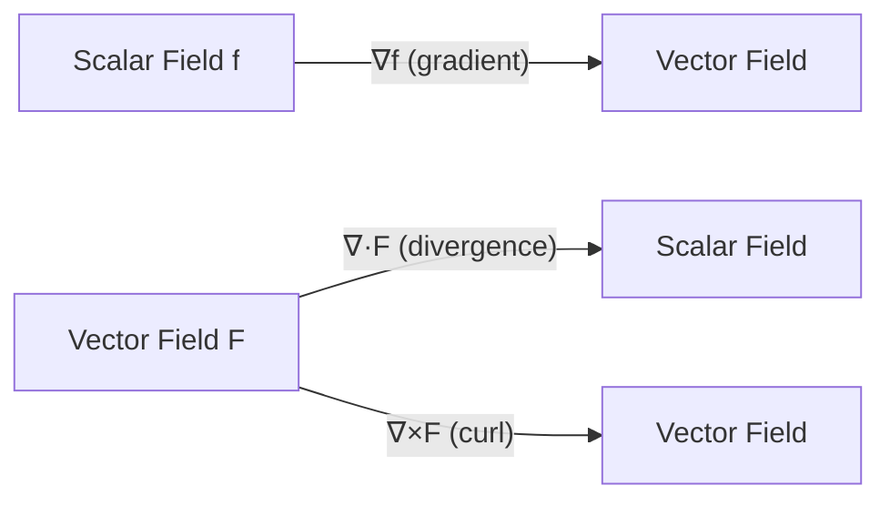
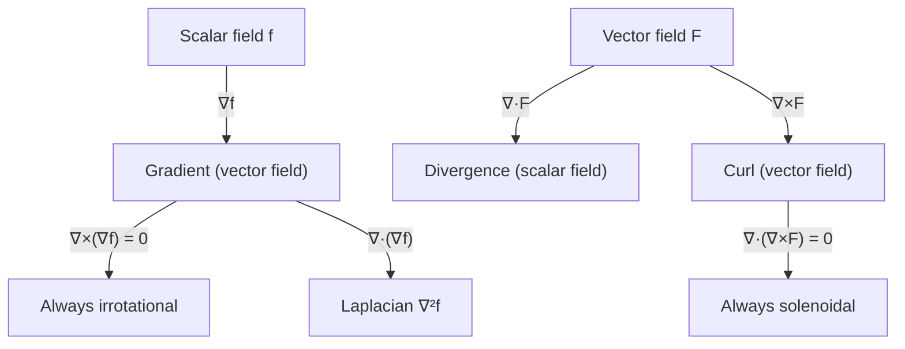
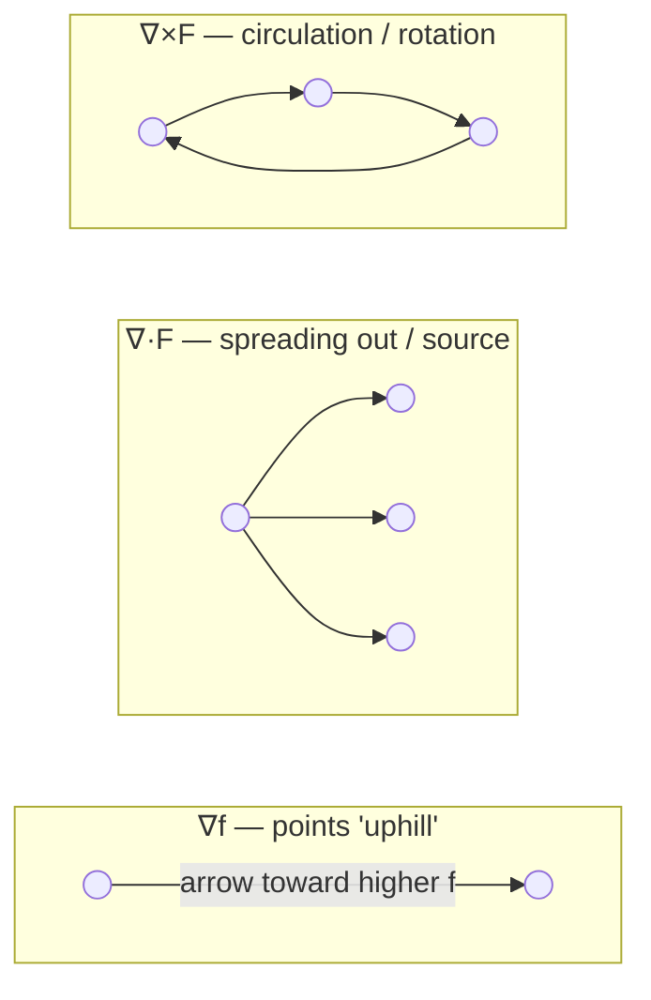

# Gradient, Divergence and Curl

> **Module:** Vector Analysis
> **Topic 5 of 10**
> **Last Updated:** June 20, 2026

## Table of Contents

1. [Introduction: The Del Operator](#1-introduction-the-del-operator)
2. [Gradient](#2-gradient)
3. [Directional Derivative](#3-directional-derivative)
4. [Divergence](#4-divergence)
5. [Curl](#5-curl)
6. [The Laplacian Operator](#6-the-laplacian-operator)
7. [Key Vector Identities and Proofs](#7-key-vector-identities-and-proofs)
8. [Worked Examples](#8-worked-examples)
9. [Applications](#9-applications)
10. [Diagrams](#10-diagrams)
11. [Summary Table](#11-summary-table)
12. [References](#12-references)

---

## 1. Introduction: The Del Operator

The **del** (or **nabla**) operator is a vector differential operator defined in Cartesian coordinates as:
$$
\nabla = \hat{i}\frac{\partial}{\partial x} + \hat{j}\frac{\partial}{\partial y} + \hat{k}\frac{\partial}{\partial z}
$$

It is not a vector itself but a symbolic operator that *acts on* scalar or vector fields to produce new fields. Depending on how it is combined with a field, $\nabla$ generates three fundamentally different operations:

| Operation | Notation | Acts on | Produces |
|---|---|---|---|
| **Gradient** | $\nabla f$ | Scalar field | Vector field |
| **Divergence** | $\nabla \cdot \vec{F}$ | Vector field | Scalar field |
| **Curl** | $\nabla \times \vec{F}$ | Vector field | Vector field |

---

## 2. Gradient

### 2.1 Definition

For a differentiable scalar field $f(x,y,z)$, the **gradient** is the vector field:
$$
\nabla f = \text{grad}\,f = \frac{\partial f}{\partial x}\hat{i} + \frac{\partial f}{\partial y}\hat{j} + \frac{\partial f}{\partial z}\hat{k}
$$

### 2.2 Geometric Interpretation

1. $\nabla f$ points in the direction of the **greatest rate of increase** of $f$.
2. $|\nabla f|$ equals the **maximum rate of change** of $f$ at that point.
3. $\nabla f$ is always **perpendicular (normal) to the level surface** $f(x,y,z) = c$ passing through that point.

**Proof that $\nabla f$ is normal to the level surface:**

Let $\vec{r}(t) = (x(t), y(t), z(t))$ be any curve lying entirely on the level surface $f(x,y,z) = c$. Then $f(\vec r(t)) = c$ for all $t$. Differentiating both sides using the chain rule:
$$
\frac{d}{dt}f(\vec r(t)) = \frac{\partial f}{\partial x}\dot x + \frac{\partial f}{\partial y}\dot y + \frac{\partial f}{\partial z}\dot z = \nabla f \cdot \vec r'(t) = 0
$$
Since $\vec r'(t)$ is tangent to the surface (because the curve lies on it) and $\nabla f \cdot \vec r'(t) = 0$ for *every* such curve, $\nabla f$ must be orthogonal to the entire tangent plane of the surface at that point. Hence $\nabla f$ is normal to the level surface. $\blacksquare$

### 2.3 Properties

For scalar fields $f, g$ and constants $a, b$:

$$
\nabla(af + bg) = a\nabla f + b\nabla g \quad \text{(linearity)}
$$
$$
\nabla(fg) = f\nabla g + g\nabla f \quad \text{(product rule)}
$$
$$
\nabla\left(\frac{f}{g}\right) = \frac{g\nabla f - f\nabla g}{g^2}, \quad g \neq 0
$$

---

## 3. Directional Derivative

### 3.1 Definition

The **directional derivative** of $f$ at a point in the direction of a unit vector $\hat{u}$ measures the instantaneous rate of change of $f$ in that direction:
$$
D_{\hat u} f = \lim_{h \to 0} \frac{f(\vec{r}+h\hat u) - f(\vec r)}{h}
$$

### 3.2 Theorem (Connection to Gradient)

$$
D_{\hat u} f = \nabla f \cdot \hat{u}
$$

**Proof:** Let $\vec r(h) = \vec r_0 + h\hat u$. By the chain rule,
$$
\frac{d}{dh}f(\vec r(h))\Big|_{h=0} = \nabla f(\vec r_0)\cdot \vec r'(0) = \nabla f(\vec r_0)\cdot \hat u
$$
which is precisely $D_{\hat u}f$ at $\vec r_0$. $\blacksquare$

**Consequence:** Since $\nabla f \cdot \hat u = |\nabla f|\cos\theta$, the directional derivative is **maximized** when $\theta = 0$, i.e., when $\hat u$ points in the same direction as $\nabla f$. This confirms that the gradient points in the direction of steepest ascent, with maximum rate $|\nabla f|$.

---

## 4. Divergence

### 4.1 Definition

For a differentiable vector field $\vec F = F_1\hat i + F_2 \hat j + F_3 \hat k$, the **divergence** is the scalar field:
$$
\nabla \cdot \vec F = \text{div}\,\vec F = \frac{\partial F_1}{\partial x} + \frac{\partial F_2}{\partial y} + \frac{\partial F_3}{\partial z}
$$

### 4.2 Physical Interpretation

Divergence measures the **net outward flux per unit volume** at a point — i.e., how much the vector field "spreads out" (diverges) from that point.

- $\nabla \cdot \vec F > 0$: point behaves as a **source** (net outflow, e.g., fluid being created or expanding).
- $\nabla \cdot \vec F < 0$: point behaves as a **sink** (net inflow, e.g., fluid being absorbed or compressing).
- $\nabla \cdot \vec F = 0$: the field is **solenoidal** or **incompressible** at that point (no net source or sink).

This intuition is made rigorous later by the **Divergence Theorem** (Topic 9), which states that the divergence integrated over a volume equals the total flux out of its boundary surface.

### 4.3 Properties

$$
\nabla\cdot(\vec F + \vec G) = \nabla\cdot\vec F + \nabla\cdot\vec G
$$
$$
\nabla\cdot(f\vec F) = f(\nabla\cdot \vec F) + \vec F \cdot \nabla f
$$

---

## 5. Curl

### 5.1 Definition

For $\vec F = F_1\hat i + F_2\hat j + F_3\hat k$, the **curl** is the vector field:
$$
\nabla \times \vec F =
\begin{vmatrix}
\hat i & \hat j & \hat k \\
\dfrac{\partial}{\partial x} & \dfrac{\partial}{\partial y} & \dfrac{\partial}{\partial z} \\
F_1 & F_2 & F_3
\end{vmatrix}
= \left(\frac{\partial F_3}{\partial y} - \frac{\partial F_2}{\partial z}\right)\hat i + \left(\frac{\partial F_1}{\partial z} - \frac{\partial F_3}{\partial x}\right)\hat j + \left(\frac{\partial F_2}{\partial x} - \frac{\partial F_1}{\partial y}\right)\hat k
$$

### 5.2 Physical Interpretation

Curl measures the **rotational tendency / circulation density** of a vector field at a point:

- If a tiny paddle wheel placed at a point in the field $\vec F$ would spin, the field has nonzero curl there; the **axis** of rotation is along $\nabla \times \vec F$, and its **magnitude** measures the spin rate (by the right-hand rule).
- $\nabla \times \vec F = \vec 0$ everywhere in a simply connected domain $\iff$ $\vec F$ is **irrotational** (conservative).

This is formalized later by **Stokes' Theorem** (Topic 10), relating curl over a surface to circulation around its boundary.

### 5.3 Properties

$$
\nabla\times(\vec F+\vec G) = \nabla\times\vec F + \nabla\times\vec G
$$
$$
\nabla\times(f\vec F) = f(\nabla\times\vec F) + (\nabla f)\times \vec F
$$

---

## 6. The Laplacian Operator

The **Laplacian** of a scalar field is the divergence of its gradient:
$$
\nabla^2 f = \nabla\cdot(\nabla f) = \frac{\partial^2 f}{\partial x^2} + \frac{\partial^2 f}{\partial y^2} + \frac{\partial^2 f}{\partial z^2}
$$

It appears in **Laplace's equation** $\nabla^2 f = 0$ (harmonic functions — e.g., steady-state temperature distributions, electrostatic potentials in charge-free regions) and the **heat equation**, **wave equation**, and **Poisson's equation** $\nabla^2 f = \rho$.

---

## 7. Key Vector Identities and Proofs

### 7.1 Curl of a Gradient is Zero

$$
\nabla \times (\nabla f) = \vec 0
$$

**Proof:** By definition,
$$
\nabla \times (\nabla f) = \left(\frac{\partial^2 f}{\partial y\,\partial z} - \frac{\partial^2 f}{\partial z\,\partial y}\right)\hat i + \left(\frac{\partial^2 f}{\partial z\,\partial x} - \frac{\partial^2 f}{\partial x\,\partial z}\right)\hat j + \left(\frac{\partial^2 f}{\partial x\,\partial y} - \frac{\partial^2 f}{\partial y\,\partial x}\right)\hat k
$$
By **Clairaut's theorem** (equality of mixed partial derivatives, assuming $f$ has continuous second partial derivatives), each pair of mixed partials is equal, so every component vanishes. $\blacksquare$

> **Consequence:** Every conservative field $\vec F = \nabla f$ is automatically irrotational. This gives the standard test for conservativeness used in Topic 6.

### 7.2 Divergence of a Curl is Zero

$$
\nabla \cdot (\nabla \times \vec F) = 0
$$

**Proof:**
$$
\nabla\cdot(\nabla\times \vec F) = \frac{\partial}{\partial x}\left(\frac{\partial F_3}{\partial y}-\frac{\partial F_2}{\partial z}\right) + \frac{\partial}{\partial y}\left(\frac{\partial F_1}{\partial z}-\frac{\partial F_3}{\partial x}\right) + \frac{\partial}{\partial z}\left(\frac{\partial F_2}{\partial x}-\frac{\partial F_1}{\partial y}\right)
$$
Expanding, every second-order mixed partial term appears exactly twice with opposite signs (again by Clairaut's theorem), so the sum is identically zero. $\blacksquare$

> **Consequence:** This is why magnetic fields (which satisfy $\vec B = \nabla\times\vec A$ for a vector potential $\vec A$) automatically satisfy $\nabla\cdot\vec B = 0$ (no magnetic monopoles), one of Maxwell's equations.

### 7.3 Other Standard Identities

$$
\nabla\cdot(\vec F\times\vec G) = \vec G\cdot(\nabla\times\vec F) - \vec F\cdot(\nabla\times\vec G)
$$
$$
\nabla\times(\nabla\times\vec F) = \nabla(\nabla\cdot\vec F) - \nabla^2\vec F
$$

---

## 8. Worked Examples

### Example 1 — Gradient and direction of steepest ascent

Let $f(x,y,z) = x^2y + yz^3$. Find $\nabla f$ at $(2,-1,1)$ and the directional derivative in the direction $\vec a = (1, 0, -2)$.

$$
\nabla f = (2xy)\hat i + (x^2+z^3)\hat j + (3yz^2)\hat k
$$
At $(2,-1,1)$: $\nabla f = (2(2)(-1))\hat i + (4+1)\hat j + (3(-1)(1))\hat k = -4\hat i + 5\hat j -3\hat k$

Unit vector: $|\vec a| = \sqrt{1+0+4}=\sqrt5$, so $\hat u = \frac{1}{\sqrt5}(1,0,-2)$

$$
D_{\hat u}f = \nabla f\cdot\hat u = \frac{1}{\sqrt5}\big[(-4)(1)+(5)(0)+(-3)(-2)\big] = \frac{2}{\sqrt5}
$$

### Example 2 — Divergence (testing for incompressible flow)

Let $\vec F = (x^2-y^2)\hat i + 2xy\,\hat j + (z^3)\hat k$. Find $\nabla\cdot\vec F$.
$$
\nabla\cdot\vec F = \frac{\partial}{\partial x}(x^2-y^2) + \frac{\partial}{\partial y}(2xy) + \frac{\partial}{\partial z}(z^3) = 2x + 2x + 3z^2 = 4x+3z^2
$$
This field is **not** incompressible in general (divergence is nonzero except on the surface $4x+3z^2=0$).

### Example 3 — Curl (testing for conservativeness)

Let $\vec F = (2xy+z^3)\hat i + x^2\hat j + 3xz^2\hat k$. Determine whether $\vec F$ is conservative.

$$
\nabla\times\vec F = \left(\frac{\partial(3xz^2)}{\partial y}-\frac{\partial(x^2)}{\partial z}\right)\hat i + \left(\frac{\partial(2xy+z^3)}{\partial z}-\frac{\partial(3xz^2)}{\partial x}\right)\hat j + \left(\frac{\partial(x^2)}{\partial x}-\frac{\partial(2xy+z^3)}{\partial y}\right)\hat k
$$
$$
= (0-0)\hat i + (3z^2-3z^2)\hat j + (2x-2x)\hat k = \vec 0
$$
Since $\nabla\times\vec F = \vec 0$ everywhere (and $\mathbb R^3$ is simply connected), $\vec F$ is **conservative**. (Indeed $\vec F = \nabla(x^2y+xz^3)$.)

### Example 4 — Laplacian

Let $f(x,y,z) = e^x\sin y + z^2$. Find $\nabla^2 f$.
$$
f_{xx} = e^x\sin y, \quad f_{yy} = -e^x\sin y, \quad f_{zz} = 2
$$
$$
\nabla^2 f = e^x\sin y - e^x\sin y + 2 = 2
$$

---

## 9. Applications

| Operator | Field | Application |
|---|---|---|
| Gradient | Temperature, pressure, potential | Heat flows opposite to $\nabla T$; force $= -\nabla U$ (potential energy) |
| Divergence | Fluid velocity, electric field | Continuity equation $\partial\rho/\partial t + \nabla\cdot(\rho\vec v)=0$; Gauss's Law $\nabla\cdot\vec E = \rho/\epsilon_0$ |
| Curl | Fluid velocity, magnetic field | Vorticity of fluid flow; Ampère's/Faraday's Law in Maxwell's equations |
| Laplacian | Steady-state systems | Laplace's equation in electrostatics, heat conduction, gravitation |

---

## 10. Diagrams

### 10.1 Relationship between operators

### 10.2 Visualizing gradient, divergence, and curl

*Gradient field: vectors point in the direction of steepest increase, perpendicular to level curves (illustrative diagram, Wikimedia Commons).*

*Illustration contrasting positive divergence (source-like spreading) and nonzero curl (rotational) vector fields (Wikimedia Commons).*

A simple way to remember the geometric character of each operator:

---

## 11. Summary Table

| Quantity | Symbol | Input | Output | Zero-identity |
|---|---|---|---|---|
| Gradient | $\nabla f$ | scalar | vector | $\nabla\times(\nabla f)=\vec0$ |
| Divergence | $\nabla\cdot\vec F$ | vector | scalar | — |
| Curl | $\nabla\times\vec F$ | vector | vector | $\nabla\cdot(\nabla\times\vec F)=0$ |
| Laplacian | $\nabla^2 f$ | scalar | scalar | $\nabla^2 f = \nabla\cdot\nabla f$ |

---

## 12. References

1. Paul's Online Math Notes — *Gradient Vector, Tangent Planes and Normal Lines* — [https://tutorial.math.lamar.edu/Classes/CalcIII/GradientVectorTangentPlane.aspx](https://tutorial.math.lamar.edu/Classes/CalcIII/GradientVectorTangentPlane.aspx)
2. Paul's Online Math Notes — *Curl and Divergence* — [https://tutorial.math.lamar.edu/Classes/CalcIII/CurlDivergence.aspx](https://tutorial.math.lamar.edu/Classes/CalcIII/CurlDivergence.aspx)
3. Khan Academy — *Divergence and curl* — [https://www.khanacademy.org/math/multivariable-calculus/multivariable-derivatives/divergence-and-curl-articles](https://www.khanacademy.org/math/multivariable-calculus/multivariable-derivatives/divergence-and-curl-articles)
4. 3Blue1Brown — *Divergence and curl: The language of Maxwell's equations* (YouTube) — [https://www.youtube.com/watch?v=rB83DpBJQsE](https://www.youtube.com/watch?v=rB83DpBJQsE)
5. Wolfram MathWorld — *Gradient*, *Divergence*, *Curl* — [https://mathworld.wolfram.com/Gradient.html](https://mathworld.wolfram.com/Gradient.html), [https://mathworld.wolfram.com/Divergence.html](https://mathworld.wolfram.com/Divergence.html), [https://mathworld.wolfram.com/Curl.html](https://mathworld.wolfram.com/Curl.html)
6. MIT OCW 18.02SC — *Gradient, Divergence, Curl* lecture notes — [https://ocw.mit.edu/courses/18-02sc-multivariable-calculus-fall-2010/](https://ocw.mit.edu/courses/18-02sc-multivariable-calculus-fall-2010/)
7. Griffiths, D. J. — *Introduction to Electrodynamics*, Chapter 1 (Vector Calculus review) — standard reference for physical applications.

---

**Previous:** [04 — Scalar and Vector Functions](04-scalar-and-vector-functions.md) · **Next:** [06 — Vector Line Integration and Work Done](06-vector-line-integration-and-work-done.md)
