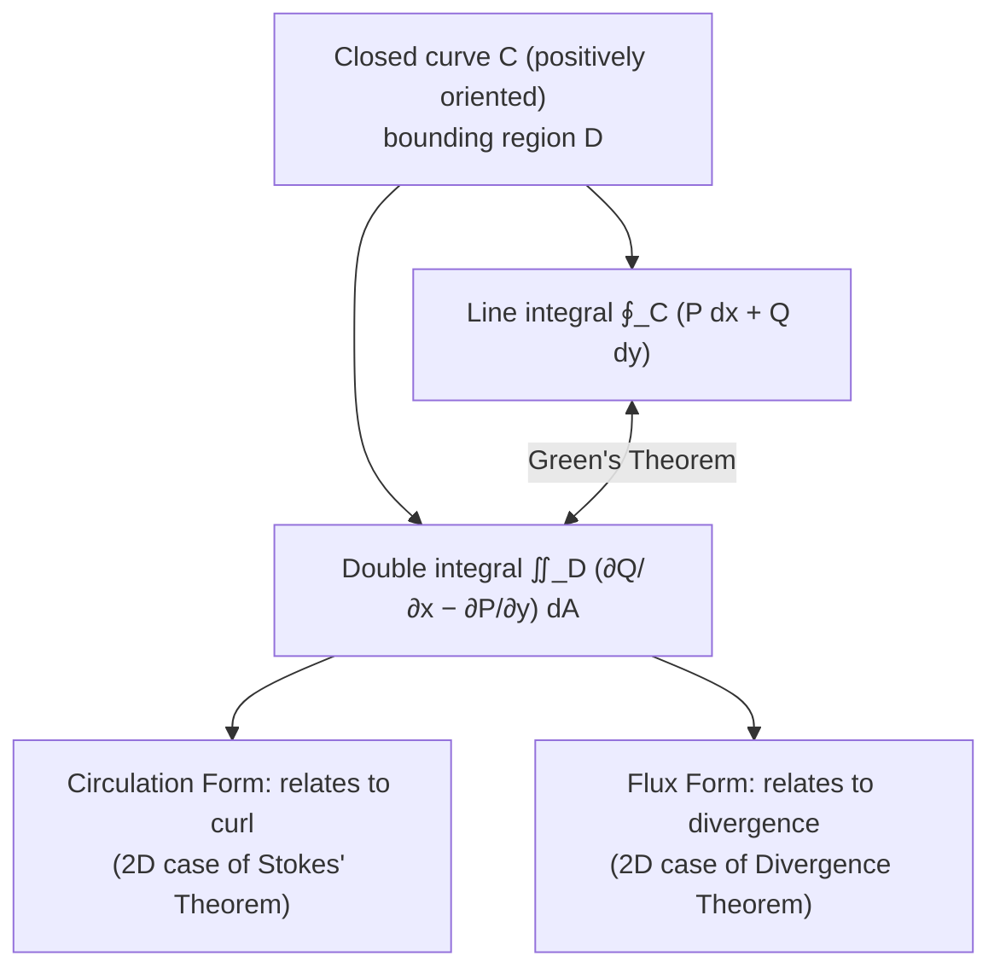
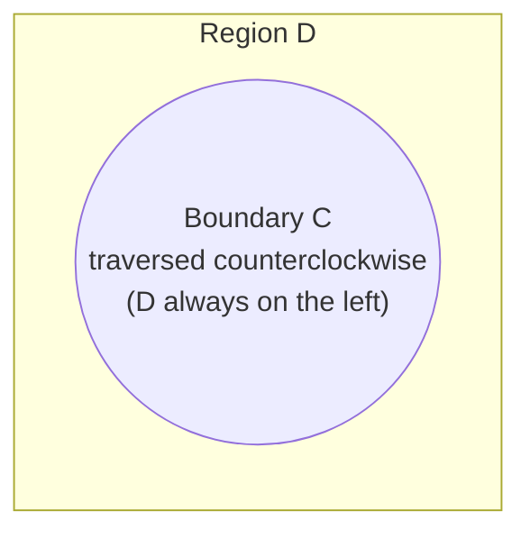

# Green's Theorem

> **Module:** Vector Analysis
> **Topic 7 of 10**
> **Last Updated:** June 20, 2026

## Table of Contents

1. [Introduction](#1-introduction)
2. [Statement of Green's Theorem](#2-statement-of-greens-theorem)
3. [Orientation Convention](#3-orientation-convention)
4. [Proof of Green's Theorem](#4-proof-of-greens-theorem)
5. [Vector Forms of Green's Theorem](#5-vector-forms-of-greens-theorem)
6. [Area via Green's Theorem](#6-area-via-greens-theorem)
7. [Extension to Multiply Connected Regions](#7-extension-to-multiply-connected-regions)
8. [Worked Examples](#8-worked-examples)
9. [Applications](#9-applications)
10. [Diagrams](#10-diagrams)
11. [Summary](#11-summary)
12. [References](#12-references)

---

## 1. Introduction

**Green's Theorem** relates a line integral around a simple closed curve $C$ in the plane to a double integral over the plane region $D$ enclosed by $C$. It is one of the cornerstone results of vector calculus and is the **two-dimensional special case** of both Stokes' Theorem and the Divergence Theorem, which we encounter in Topics 9 and 10.

Informally, Green's theorem says: *the total "circulation" of a vector field around a closed boundary equals the total "microscopic rotation" (curl) summed up over the interior.*

---

## 2. Statement of Green's Theorem

Let $D$ be a simply connected, closed, bounded region in the plane whose boundary $C = \partial D$ is a **piecewise-smooth, simple closed curve**, positively oriented (counterclockwise). Let $P(x,y)$ and $Q(x,y)$ have continuous first partial derivatives on an open region containing $D$. Then:

$$
\oint_C (P\,dx + Q\,dy) = \iint_D \left(\frac{\partial Q}{\partial x} - \frac{\partial P}{\partial y}\right) dA
$$

Equivalently, in vector notation with $\vec F = P\hat i + Q\hat j$:
$$
\oint_C \vec F\cdot d\vec r = \iint_D (\nabla\times\vec F)\cdot \hat k\, dA
$$

(since for a planar field, $\nabla\times\vec F = \left(\frac{\partial Q}{\partial x}-\frac{\partial P}{\partial y}\right)\hat k$).

---

## 3. Orientation Convention

**Positive orientation** means traversing $C$ such that the region $D$ is always on the **left-hand side** — for a simple closed curve, this corresponds to **counterclockwise** traversal. If $C$ is traversed clockwise, the sign of the line integral flips:
$$
\oint_{-C} \vec F\cdot d\vec r = -\oint_C \vec F\cdot d\vec r
$$

---

## 4. Proof of Green's Theorem

We give the standard proof for a **simple region** — one that is both *type I* (vertically simple) and *type II* (horizontally simple). The result for general regions follows by decomposing them into finitely many such simple pieces and using the fact that interior boundary contributions cancel (since shared edges are traversed in opposite directions by adjacent sub-regions).

### 4.1 Proving $\displaystyle\oint_C P\,dx = -\iint_D \frac{\partial P}{\partial y}\, dA$

Suppose $D$ is **type I**: $D = \{(x,y) : a\le x\le b,\ g_1(x)\le y\le g_2(x)\}$, with boundary $C$ consisting of the lower curve $y=g_1(x)$, the upper curve $y=g_2(x)$ (traversed right to left), and possibly vertical segments at $x=a, x=b$.

Evaluate the double integral first:
$$
\iint_D \frac{\partial P}{\partial y}\,dA = \int_a^b \int_{g_1(x)}^{g_2(x)} \frac{\partial P}{\partial y}\,dy\,dx = \int_a^b \Big[P(x,g_2(x)) - P(x,g_1(x))\Big]\,dx
$$

Now evaluate the line integral by splitting $C$ into the bottom curve $C_1$ ($y=g_1(x)$, left to right) and top curve $C_2$ ($y=g_2(x)$, right to left), with vertical sides contributing zero to $\oint P\,dx$ (since $dx=0$ there):
$$
\oint_C P\,dx = \int_{C_1} P\,dx + \int_{C_2} P\,dx = \int_a^b P(x,g_1(x))\,dx - \int_a^b P(x,g_2(x))\,dx
$$
$$
= -\int_a^b\Big[P(x,g_2(x))-P(x,g_1(x))\Big]\,dx = -\iint_D \frac{\partial P}{\partial y}\,dA
$$

### 4.2 Proving $\displaystyle\oint_C Q\,dy = \iint_D \frac{\partial Q}{\partial x}\, dA$

By an entirely analogous argument, treating $D$ as **type II**: $D=\{(x,y): c\le y\le d,\ h_1(y)\le x\le h_2(y)\}$, one obtains:
$$
\oint_C Q\,dy = \iint_D \frac{\partial Q}{\partial x}\,dA
$$

### 4.3 Combining

Adding the two results:
$$
\oint_C (P\,dx+Q\,dy) = \iint_D\left(\frac{\partial Q}{\partial x}-\frac{\partial P}{\partial y}\right) dA \qquad \blacksquare
$$

---

## 5. Vector Forms of Green's Theorem

Green's theorem can be written in two physically meaningful vector forms:

### 5.1 Circulation (Tangential) Form
$$
\oint_C \vec F\cdot \hat T\, ds = \iint_D (\nabla\times\vec F)\cdot\hat k\,dA
$$
This is the version stated above — it relates circulation around $C$ to curl (rotation) over $D$. This is the **2D special case of Stokes' Theorem**.

### 5.2 Flux (Normal) Form
$$
\oint_C \vec F\cdot \hat n\, ds = \iint_D \nabla\cdot\vec F\, dA
$$
where $\hat n$ is the outward unit normal to $C$. This relates the net outward flux through $C$ to the divergence over $D$, and is the **2D special case of the Divergence Theorem** (Topic 9).

**Derivation of the flux form from the circulation form:** If $\vec F = P\hat i+Q\hat j$, apply the circulation form to the rotated field $\vec G = Q\hat i - P\hat j$ (a 90° rotation of $\vec F$, since $\hat n\,ds$ relates to $\hat T\,ds$ by a quarter turn). Then $\nabla\times\vec G \cdot \hat k = Q_x - (-P)_y = Q_x+P_y = \nabla\cdot\vec F$, giving the flux form.

---

## 6. Area via Green's Theorem

A striking application: choosing $P, Q$ such that $Q_x - P_y = 1$ lets us compute the **area** of $D$ via a boundary integral. Common choices:

$$
A = \oint_C x\,dy = -\oint_C y\,dx = \frac{1}{2}\oint_C (x\,dy - y\,dx)
$$

**Verification:** with $P=0,\ Q=x$: $Q_x-P_y = 1-0=1$, so $\iint_D 1\,dA = A = \oint_C x\,dy$. ✓

This formula is the basis of the **shoelace formula** for polygon area and is used in planimeters (mechanical area-measuring instruments).

---

## 7. Extension to Multiply Connected Regions

If $D$ has one or more "holes" (is **multiply connected**), Green's theorem still applies provided **every boundary component is given the orientation that keeps $D$ on the left**. For a region with an outer boundary $C_1$ (counterclockwise) and an inner boundary $C_2$ around a hole (clockwise, i.e., the hole's boundary oriented oppositely):
$$
\oint_{C_1}(P\,dx+Q\,dy) + \oint_{C_2}(P\,dx+Q\,dy) = \iint_D \left(\frac{\partial Q}{\partial x}-\frac{\partial P}{\partial y}\right)dA
$$

This is proven by introducing a "cut" connecting the two boundary curves, converting the multiply connected region into a simple region whose boundary traverses the cut twice (in opposite directions, so those contributions cancel).

> **Important application:** This extension is exactly how one explains why $\displaystyle\oint_C \frac{-y\,dx+x\,dy}{x^2+y^2} = 2\pi$ for any closed curve $C$ enclosing the origin, even though $P_y=Q_x$ everywhere *except* at the singular point $(0,0)$ where the field is undefined.

---

## 8. Worked Examples

### Example 1 — Direct verification of Green's Theorem

Verify Green's Theorem for $\vec F = (x-y)\hat i + (x)\hat j$ over the region $D$ bounded by the unit circle $C: x^2+y^2=1$.

**Double integral side:**
$$
P=x-y,\ Q=x \implies \frac{\partial Q}{\partial x}-\frac{\partial P}{\partial y} = 1-(-1) = 2
$$
$$
\iint_D 2\,dA = 2\cdot(\text{Area of unit disk}) = 2\pi
$$

**Line integral side:** Parametrize $C$: $x=\cos t, y=\sin t$, $t\in[0,2\pi]$, so $dx=-\sin t\,dt$, $dy=\cos t\,dt$.
$$
\oint_C (x-y)\,dx + x\,dy = \int_0^{2\pi}\Big[(\cos t-\sin t)(-\sin t) + \cos t(\cos t)\Big]dt
$$
$$
= \int_0^{2\pi}\Big[-\sin t\cos t+\sin^2 t+\cos^2 t\Big]dt = \int_0^{2\pi}\big[1 - \sin t\cos t\big]dt
$$
$$
= \int_0^{2\pi} 1\,dt - \int_0^{2\pi}\sin t\cos t\, dt = 2\pi - 0 = 2\pi
$$
Both sides equal $2\pi$ ✓.

### Example 2 — Computing area using Green's Theorem

Find the area enclosed by the ellipse $\dfrac{x^2}{a^2}+\dfrac{y^2}{b^2}=1$ using $A = \frac12\oint_C(x\,dy-y\,dx)$.

Parametrize: $x=a\cos t,\ y=b\sin t$, $t\in[0,2\pi]$. Then $dx=-a\sin t\,dt,\ dy=b\cos t\,dt$.
$$
x\,dy - y\,dx = a\cos t(b\cos t\,dt) - b\sin t(-a\sin t\,dt) = ab\cos^2t\,dt + ab\sin^2t\,dt = ab\,dt
$$
$$
A = \frac12\int_0^{2\pi} ab\,dt = \frac12(ab)(2\pi) = \pi ab
$$
This recovers the familiar formula for the area of an ellipse.

### Example 3 — Using Green's Theorem to simplify a difficult line integral

Evaluate $\displaystyle\oint_C (e^x\sin y - y^3)\,dx + (e^x\cos y+ x)\,dy$ where $C$ is the boundary of the upper half of the disk $x^2+y^2\le 4$, $y\ge0$, traversed counterclockwise.

$$
P = e^x\sin y - y^3, \quad Q=e^x\cos y+x
$$
$$
\frac{\partial Q}{\partial x} = e^x\cos y+1, \qquad \frac{\partial P}{\partial y} = e^x\cos y - 3y^2
$$
$$
\frac{\partial Q}{\partial x}-\frac{\partial P}{\partial y} = 1+3y^2
$$
Switching to polar coordinates over the half-disk $D$ ($0\le r\le2,\ 0\le\theta\le\pi$):
$$
\iint_D (1+3y^2)\,dA = \int_0^\pi\int_0^2 (1+3r^2\sin^2\theta)\, r\,dr\,d\theta
$$
$$
= \int_0^\pi \left[\frac{r^2}{2}+\frac{3r^4}{4}\sin^2\theta\right]_0^2 d\theta = \int_0^\pi \left(2 + 12\sin^2\theta\right) d\theta
$$
$$
= 2\pi + 12\int_0^\pi \sin^2\theta\,d\theta = 2\pi + 12\cdot\frac{\pi}{2} = 2\pi+6\pi = 8\pi
$$

This direct double-integral evaluation is far simpler than attempting the original line integral directly (which would require integrating along both the semicircular arc and the diameter separately).

---

## 9. Applications

- **Area computation:** Surveying, CAD/CAM software, and planimeters use the boundary-integral area formula.
- **Fluid dynamics:** Relating circulation around a closed curve to vorticity (curl) inside the region — foundational for 2D aerodynamics (e.g., lift via circulation, Kutta–Joukowski theorem).
- **Electromagnetism:** 2D analogues of Ampère's law.
- **Complex analysis:** Green's theorem underlies the proof of the **Cauchy–Goursat theorem** for analytic functions.
- **Computer graphics:** Polygon area/winding number computations (shoelace formula).

---

## 10. Diagrams

### 10.1 Concept diagram

### 10.2 Region and orientation

*Illustration: a region D bounded by a positively-oriented (counterclockwise) simple closed curve C, decomposed into type-I and type-II strips for the proof (Wikimedia Commons).*

---

## 11. Summary

| Concept | Formula |
|---|---|
| Green's Theorem (general) | $\oint_C (P\,dx+Q\,dy) = \iint_D \left(\dfrac{\partial Q}{\partial x}-\dfrac{\partial P}{\partial y}\right)dA$ |
| Circulation form | $\oint_C \vec F\cdot\hat T\,ds = \iint_D(\nabla\times\vec F)\cdot\hat k\,dA$ |
| Flux form | $\oint_C \vec F\cdot\hat n\,ds = \iint_D \nabla\cdot\vec F\,dA$ |
| Area formula | $A = \dfrac12\oint_C(x\,dy-y\,dx)$ |
| Orientation | Positive = counterclockwise (region on the left) |

---

## 12. References

1. Paul's Online Math Notes — *Green's Theorem* — [https://tutorial.math.lamar.edu/Classes/CalcIII/GreensTheorem.aspx](https://tutorial.math.lamar.edu/Classes/CalcIII/GreensTheorem.aspx)
2. Khan Academy — *Green's theorem* — [https://www.khanacademy.org/math/multivariable-calculus/greens-theorem-and-stokes-theorem](https://www.khanacademy.org/math/multivariable-calculus/greens-theorem-and-stokes-theorem)
3. MIT OCW 18.02SC — *Green's Theorem* — [https://ocw.mit.edu/courses/18-02sc-multivariable-calculus-fall-2010/](https://ocw.mit.edu/courses/18-02sc-multivariable-calculus-fall-2010/)
4. Wolfram MathWorld — *Green's Theorem* — [https://mathworld.wolfram.com/GreensTheorem.html](https://mathworld.wolfram.com/GreensTheorem.html)
5. Wikipedia — *Green's theorem* — [https://en.wikipedia.org/wiki/Green%27s_theorem](https://en.wikipedia.org/wiki/Green%27s_theorem)
6. 3Blue1Brown — visual intuition for circulation and curl (YouTube channel, divergence/curl series).
7. Marsden, J. E., & Tromba, A. J. — *Vector Calculus*, 6th Edition, Chapter 8.

---

**Previous:** [06 — Vector Line Integration and Work Done](06-vector-line-integration-and-work-done.md) · **Next:** [08 — Vector Surface and Volume Integration](08-vector-surface-and-volume-integration.md)
