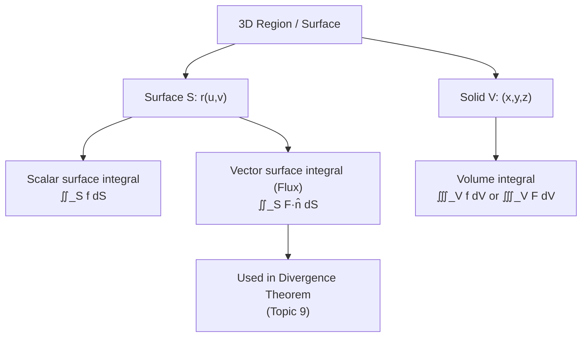
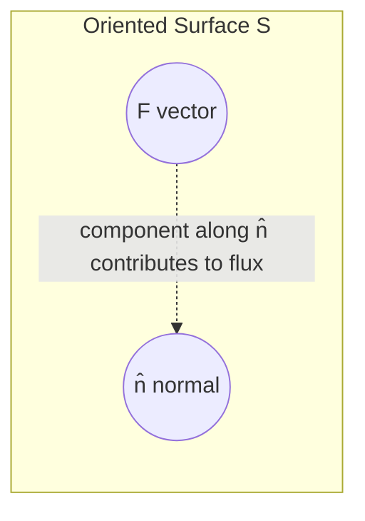

# Vector Surface and Volume Integration

> **Module:** Vector Analysis
> **Topic 8 of 10**
> **Last Updated:** June 20, 2026

## Table of Contents

1. [Introduction](#1-introduction)
2. [Parametric Surfaces](#2-parametric-surfaces)
3. [Surface Integral of a Scalar Field](#3-surface-integral-of-a-scalar-field)
4. [Surface Integral of a Vector Field (Flux)](#4-surface-integral-of-a-vector-field-flux)
5. [Orientation of Surfaces](#5-orientation-of-surfaces)
6. [Volume Integrals](#6-volume-integrals)
7. [Worked Examples](#7-worked-examples)
8. [Applications](#8-applications)
9. [Diagrams](#9-diagrams)
10. [Summary](#10-summary)
11. [References](#11-references)

---

## 1. Introduction

Just as line integrals extend single-variable integration to curves, **surface integrals** extend double integration to curved two-dimensional surfaces embedded in 3D space, and **volume integrals** are simply triple integrals over three-dimensional regions. These tools are essential for stating the two capstone results of vector calculus: the **Divergence Theorem** (Topic 9) and **Stokes' Theorem** (Topic 10).

| Integral Type | Domain | Integrand | Example use |
|---|---|---|---|
| Surface integral of scalar field | 2D surface $S$ in 3D | scalar $f$ | Mass of a curved shell, surface area |
| Surface integral of vector field (flux) | 2D surface $S$ in 3D | vector $\vec F$ | Fluid/electric flux through a surface |
| Volume integral | 3D solid region $V$ | scalar or vector | Mass, charge, total divergence |

---

## 2. Parametric Surfaces

A surface $S$ in $\mathbb R^3$ can be described parametrically by a vector function of **two** parameters:
$$
\vec r(u,v) = x(u,v)\,\hat i + y(u,v)\,\hat j + z(u,v)\,\hat k, \quad (u,v) \in D \subseteq \mathbb R^2
$$

### 2.1 Tangent Vectors and the Normal

At each point, the partial derivatives
$$
\vec r_u = \frac{\partial \vec r}{\partial u}, \qquad \vec r_v = \frac{\partial \vec r}{\partial v}
$$
are tangent to the surface (they span the tangent plane). Their cross product gives a vector **normal** to the surface:
$$
\vec r_u \times \vec r_v
$$

### 2.2 Surface Area Element

The infinitesimal area element on the surface is:
$$
dS = |\vec r_u \times \vec r_v|\, du\, dv
$$

The **surface area** of $S$ is therefore:
$$
A(S) = \iint_D |\vec r_u \times \vec r_v|\, du\, dv
$$

**Special case — graph of a function** $z=g(x,y)$: parametrize trivially as $\vec r(x,y) = (x,y,g(x,y))$. Then $\vec r_x = (1,0,g_x)$, $\vec r_y=(0,1,g_y)$, and:
$$
\vec r_x \times \vec r_y = (-g_x, -g_y, 1) \implies dS = \sqrt{1+g_x^2+g_y^2}\; dx\,dy
$$

---

## 3. Surface Integral of a Scalar Field

### 3.1 Definition

$$
\iint_S f\, dS = \iint_D f(\vec r(u,v))\,|\vec r_u\times\vec r_v|\, du\,dv
$$

This computes quantities such as the **total mass** of a curved lamina/shell with surface density $f$, or simply the **surface area** when $f\equiv 1$.

---

## 4. Surface Integral of a Vector Field (Flux)

### 4.1 Definition

For an oriented surface $S$ with unit normal $\hat n$, the **flux** of a vector field $\vec F$ through $S$ is:
$$
\iint_S \vec F \cdot d\vec S = \iint_S \vec F \cdot \hat n\, dS = \iint_D \vec F(\vec r(u,v)) \cdot (\vec r_u \times \vec r_v)\, du\, dv
$$

Here $d\vec S = \hat n\, dS = (\vec r_u\times\vec r_v)\,du\,dv$ is the **vector surface element**.

### 4.2 Physical Meaning

The flux integral measures the **net amount of the vector field passing through the surface** per unit time (for a velocity field, this is volumetric flow rate; for an electric field, it's related to enclosed charge via Gauss's Law). Intuitively, $\vec F\cdot \hat n$ measures how much of $\vec F$ points *through* the surface (rather than along it) at each point, and integrating sums this contribution over the whole surface.

---

## 5. Orientation of Surfaces

A surface is **orientable** if a consistent choice of unit normal $\hat n$ can be made continuously over the entire surface (e.g., a sphere, plane, or any "two-sided" surface). The **Möbius strip** is the classic example of a **non-orientable** surface, for which flux integrals are not well-defined.

For a **closed surface** (boundary of a solid region, like a sphere or cube), the conventional positive orientation is the **outward** normal. This convention is essential for the Divergence Theorem (Topic 9).

For surfaces with a boundary curve (like a hemisphere or disk), the orientation of $\hat n$ must be consistent with the orientation of the boundary curve via the **right-hand rule** — this convention is essential for Stokes' Theorem (Topic 10).

---

## 6. Volume Integrals

### 6.1 Definition

For a scalar field $f(x,y,z)$ defined on a solid region $V \subset \mathbb R^3$, the volume integral (triple integral) is:
$$
\iiint_V f\, dV
$$
computed in Cartesian, cylindrical, or spherical coordinates as appropriate:
$$
dV = dx\,dy\,dz = r\,dr\,d\theta\,dz \ \text{(cylindrical)} = \rho^2\sin\phi\,d\rho\,d\phi\,d\theta \ \text{(spherical)}
$$

### 6.2 Volume Integral of a Vector Field

For a vector field $\vec F = F_1\hat i+F_2\hat j+F_3\hat k$:
$$
\iiint_V \vec F\, dV = \left(\iiint_V F_1\,dV\right)\hat i + \left(\iiint_V F_2\,dV\right)\hat j + \left(\iiint_V F_3\,dV\right)\hat k
$$
i.e., integrated component-wise. A particularly important case is $\iiint_V (\nabla\cdot\vec F)\, dV$, the **total divergence** over a region — the quantity that the Divergence Theorem (Topic 9) relates directly to the flux through the boundary surface.

---

## 7. Worked Examples

### Example 1 — Surface area of a sphere

Find the surface area of a sphere of radius $a$ using the parametrization $\vec r(\theta,\phi) = (a\sin\phi\cos\theta,\ a\sin\phi\sin\theta,\ a\cos\phi)$, $\theta\in[0,2\pi]$, $\phi\in[0,\pi]$.

Compute:
$$
\vec r_\theta = (-a\sin\phi\sin\theta,\ a\sin\phi\cos\theta,\ 0), \qquad \vec r_\phi = (a\cos\phi\cos\theta,\ a\cos\phi\sin\theta,\ -a\sin\phi)
$$
$$
\vec r_\theta \times \vec r_\phi = -a^2\sin^2\phi\cos\theta\,\hat i - a^2\sin^2\phi\sin\theta\,\hat j - a^2\sin\phi\cos\phi\,\hat k
$$
$$
|\vec r_\theta\times\vec r_\phi| = a^2\sin\phi\sqrt{\sin^2\phi+\cos^2\phi} = a^2\sin\phi
$$
$$
A = \int_0^{2\pi}\int_0^\pi a^2\sin\phi\, d\phi\, d\theta = a^2\int_0^{2\pi}d\theta \int_0^\pi \sin\phi\,d\phi = a^2(2\pi)(2) = 4\pi a^2
$$
This confirms the well-known surface area formula for a sphere.

### Example 2 — Flux through a plane surface

Find the flux of $\vec F = z\,\hat i + x\,\hat j + y\,\hat k$ through the portion of the plane $x+y+z=1$ lying in the first octant, oriented with upward normal.

Parametrize using $x,y$ as parameters: $z=1-x-y$, so $\vec r(x,y) = (x,y,1-x-y)$ over the triangular region $D: x\ge0, y\ge0, x+y\le1$.

$$
\vec r_x = (1,0,-1), \qquad \vec r_y = (0,1,-1)
$$
$$
\vec r_x\times\vec r_y = (1,1,1) \quad \text{(upward-pointing normal — correct orientation)}
$$
$$
\vec F(\vec r(x,y)) = (1-x-y)\,\hat i + x\,\hat j + y\,\hat k
$$
$$
\vec F\cdot(\vec r_x\times\vec r_y) = (1-x-y) + x + y = 1
$$
$$
\iint_S \vec F\cdot d\vec S = \iint_D 1\, dA = \text{Area of } D = \frac12
$$

### Example 3 — Volume integral

Evaluate $\displaystyle\iiint_V xyz\, dV$ over the box $V = [0,1]\times[0,2]\times[0,3]$.

Since the integrand and region are both separable:
$$
\iiint_V xyz\, dV = \left(\int_0^1 x\,dx\right)\left(\int_0^2 y\,dy\right)\left(\int_0^3 z\,dz\right) = \left(\frac12\right)\left(2\right)\left(\frac92\right) = \frac{9}{2}
$$

### Example 4 — Surface integral of a scalar field (mass of a shell)

Find the mass of the hemispherical shell $x^2+y^2+z^2=4$, $z\ge0$, with surface density $\delta(x,y,z) = z$.

Using the spherical parametrization with $a=2$: $dS = a^2\sin\phi\,d\phi\,d\theta = 4\sin\phi\,d\phi\,d\theta$, and $z = a\cos\phi = 2\cos\phi$, with $\phi\in[0,\pi/2]$ (upper hemisphere only):

$$
M = \int_0^{2\pi}\int_0^{\pi/2} (2\cos\phi)(4\sin\phi)\, d\phi\, d\theta = 8\int_0^{2\pi}d\theta\int_0^{\pi/2}\sin\phi\cos\phi\,d\phi
$$
$$
= 8(2\pi)\left[\frac{\sin^2\phi}{2}\right]_0^{\pi/2} = 16\pi \cdot \frac12 = 8\pi
$$

---

## 8. Applications

- **Electromagnetism:** Electric flux $\iint_S \vec E\cdot d\vec S$ through a closed surface (used directly in Gauss's Law, Topic 9).
- **Fluid dynamics:** Volumetric flow rate of fluid through a surface (e.g., flow through a pipe cross-section or a porous membrane).
- **Heat transfer:** Heat flux through a surface, $\iint_S (-k\nabla T)\cdot d\vec S$ (Fourier's Law).
- **Mass/charge distributions:** Total mass of a shell (surface integral of density) or total charge in a solid (volume integral of charge density).
- **Computer graphics & engineering:** Surface area and volume computations for 3D models (CAD, finite element meshing).

---

## 9. Diagrams

### 9.1 Conceptual map

### 9.2 Surface normal and area element

*A parametric surface with tangent vectors $\vec r_u$, $\vec r_v$ spanning the tangent plane, and normal $\vec r_u\times\vec r_v$ (Wikimedia Commons — surface normal illustration).*

### 9.3 Flux through a surface

---

## 10. Summary

| Concept | Formula |
|---|---|
| Surface area element | $dS = \lvert \vec r_u \times \vec r_v\rvert\, du\,dv$ |
| Scalar surface integral | $\iint_S f\,dS$ |
| Vector surface integral (flux) | $\iint_S \vec F\cdot d\vec S = \iint_S \vec F\cdot\hat n\,dS$ |
| Graph surface area element | $dS=\sqrt{1+g_x^2+g_y^2}\,dx\,dy$ for $z=g(x,y)$ |
| Volume integral | $\iiint_V f\,dV$ |
| Orientation (closed surface) | Outward normal by convention |

---

## 11. References

1. Paul's Online Math Notes — *Surface Integrals* — [https://tutorial.math.lamar.edu/Classes/CalcIII/SurfaceIntegrals.aspx](https://tutorial.math.lamar.edu/Classes/CalcIII/SurfaceIntegrals.aspx)
2. Paul's Online Math Notes — *Surface Integrals of Vector Fields* — [https://tutorial.math.lamar.edu/Classes/CalcIII/SurfIntVectorField.aspx](https://tutorial.math.lamar.edu/Classes/CalcIII/SurfIntVectorField.aspx)
3. Khan Academy — *Surface integrals* — [https://www.khanacademy.org/math/multivariable-calculus/integrating-multivariable-functions](https://www.khanacademy.org/math/multivariable-calculus/integrating-multivariable-functions)
4. MIT OCW 18.02SC — *Surface Integrals and Flux* — [https://ocw.mit.edu/courses/18-02sc-multivariable-calculus-fall-2010/](https://ocw.mit.edu/courses/18-02sc-multivariable-calculus-fall-2010/)
5. Wolfram MathWorld — *Surface Integral* — [https://mathworld.wolfram.com/SurfaceIntegral.html](https://mathworld.wolfram.com/SurfaceIntegral.html)
6. Wikipedia — *Surface integral* — [https://en.wikipedia.org/wiki/Surface_integral](https://en.wikipedia.org/wiki/Surface_integral)
7. Griffiths, D. J. — *Introduction to Electrodynamics*, Chapter 1 (Flux integrals).

---

**Previous:** [07 — Green's Theorem](07-greens-theorem.md) · **Next:** [09 — Gauss's Divergence Theorem](09-gauss-divergence-theorem.md)
