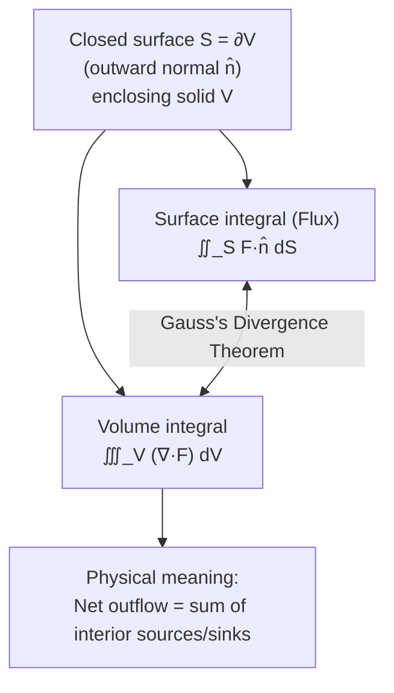

# Gauss's Divergence Theorem

> **Module:** Vector Analysis
> **Topic 9 of 10**
> **Last Updated:** June 20, 2026

## Table of Contents

1. [Introduction](#1-introduction)
2. [Statement of the Divergence Theorem](#2-statement-of-the-divergence-theorem)
3. [Proof of the Divergence Theorem](#3-proof-of-the-divergence-theorem)
4. [Physical Interpretation](#4-physical-interpretation)
5. [Relation to Green's Theorem](#5-relation-to-greens-theorem)
6. [Worked Examples](#6-worked-examples)
7. [Applications](#7-applications)
8. [Diagrams](#8-diagrams)
9. [Summary](#9-summary)
10. [References](#10-references)

---

## 1. Introduction

**Gauss's Divergence Theorem** (also called **Gauss's Theorem** or simply the **Divergence Theorem**) is one of the most important results in vector calculus. It converts a **surface integral** (flux through a closed surface) into a **volume integral** (of the divergence over the enclosed region), and vice versa. It is the **3D generalization** of the flux form of Green's Theorem (Topic 7).

---

## 2. Statement of the Divergence Theorem

Let $V$ be a solid region in $\mathbb R^3$ bounded by a **closed, piecewise-smooth surface** $S = \partial V$, oriented with **outward-pointing** unit normal $\hat n$. Let $\vec F$ be a vector field whose components have continuous first partial derivatives on an open region containing $V$. Then:

$$
\iint_S \vec F \cdot d\vec S = \iint_S \vec F\cdot \hat n\, dS = \iiint_V (\nabla \cdot \vec F)\, dV
$$

In words: **the total flux of $\vec F$ out of the closed surface $S$ equals the total divergence (sum of all sources minus sinks) inside the enclosed volume $V$.**

---

## 3. Proof of the Divergence Theorem

We prove the theorem for a **simple solid region** (one that is simultaneously type I, type II, and type III — i.e., projects nicely onto each coordinate plane), which suffices to convey the key technique. The proof proceeds by establishing three separate component identities and summing them.

### 3.1 Setup

Write $\vec F = P\,\hat i + Q\,\hat j + R\,\hat k$. The theorem decomposes into three identities to be proven separately:
$$
\iint_S P\,dy\,dz = \iiint_V \frac{\partial P}{\partial x}\,dV, \quad
\iint_S Q\,dz\,dx = \iiint_V \frac{\partial Q}{\partial y}\,dV, \quad
\iint_S R\,dx\,dy = \iiint_V \frac{\partial R}{\partial z}\,dV
$$
Adding these three gives the full theorem. We prove the third (the others follow by symmetry/relabeling of axes).

### 3.2 Proving $\iint_S R\,dx\,dy = \iiint_V \dfrac{\partial R}{\partial z}\, dV$

Assume $V$ is **type I** (in the $z$-direction): $V = \{(x,y,z) : (x,y)\in D,\ u_1(x,y)\le z\le u_2(x,y)\}$, where $D$ is the projection of $V$ onto the $xy$-plane. The boundary surface $S$ consists of:

- The **top** surface $S_2$: $z=u_2(x,y)$, with outward normal pointing **upward**.
- The **bottom** surface $S_1$: $z=u_1(x,y)$, with outward normal pointing **downward**.
- A **lateral** surface $S_3$ (if present), which is vertical, so its normal has zero $z$-component — meaning $R\hat k \cdot \hat n = 0$ there, contributing nothing to the $dx\,dy$ flux.

**Volume integral first:**
$$
\iiint_V \frac{\partial R}{\partial z}\, dV = \iint_D \left[\int_{u_1(x,y)}^{u_2(x,y)} \frac{\partial R}{\partial z}\, dz\right] dA = \iint_D \Big[R(x,y,u_2(x,y)) - R(x,y,u_1(x,y))\Big]\, dA
$$

**Surface integral:** On $S_2$ (top, outward normal upward), the flux contribution of $R\hat k$ is $+\iint_D R(x,y,u_2(x,y))\,dA$. On $S_1$ (bottom, outward normal downward), it is $-\iint_D R(x,y,u_1(x,y))\,dA$ (the negative sign arising because the outward normal points in the $-z$ direction there). The lateral surface contributes zero as noted. So:
$$
\iint_S R\,dx\,dy = \iint_D R(x,y,u_2(x,y))\,dA - \iint_D R(x,y,u_1(x,y))\,dA = \iiint_V \frac{\partial R}{\partial z}\,dV
$$

This matches the volume integral exactly. $\blacksquare$

### 3.3 Combining

By symmetric arguments (projecting $V$ onto the other two coordinate planes for the $P$ and $Q$ terms), we obtain all three identities. Summing:
$$
\iint_S (P\,dy\,dz + Q\,dz\,dx + R\,dx\,dy) = \iiint_V\left(\frac{\partial P}{\partial x}+\frac{\partial Q}{\partial y}+\frac{\partial R}{\partial z}\right)dV
$$
which is exactly $\displaystyle\iint_S \vec F\cdot \hat n\, dS = \iiint_V \nabla\cdot\vec F\, dV$. $\blacksquare$

*(For general regions not simultaneously type I/II/III, one decomposes $V$ into finitely many such simple sub-regions; flux through shared internal boundaries cancels because adjacent sub-regions induce opposite outward normals there, leaving only the flux through the original outer surface $S$.)*

---

## 4. Physical Interpretation

The Divergence Theorem formalizes the intuitive picture of divergence introduced in Topic 5:

- **Divergence as local source density:** $\nabla\cdot\vec F$ at a point measures the flux *per unit volume* emanating from an infinitesimally small region around that point.
- **Total flux as accumulated sources:** Integrating divergence over the entire volume $V$ sums up all these infinitesimal contributions — and the theorem confirms this total equals exactly the *net* flow crossing the outer boundary, since flux between adjacent interior sub-volumes always cancels (what flows out of one infinitesimal cell flows into its neighbor).

This is directly analogous to how, in 1D, $\int_a^b f'(x)\,dx = f(b)-f(a)$: the accumulated "local rate of change" throughout an interval equals the net change observable only at the endpoints (boundary).

### 4.1 Conservation Laws

If $\vec F = \rho\vec v$ represents mass flux (density times velocity) in a fluid, and there are no sources/sinks inside $V$, conservation of mass gives the **continuity equation**:
$$
\frac{\partial \rho}{\partial t} + \nabla\cdot(\rho\vec v) = 0
$$
derived precisely by applying the Divergence Theorem to relate the rate of mass change inside $V$ to the flux through $\partial V$.

---

## 5. Relation to Green's Theorem

The Divergence Theorem is the direct 3D generalization of the **flux (normal) form of Green's Theorem** from Topic 7:
$$
\oint_C \vec F\cdot \hat n\,ds = \iint_D \nabla\cdot \vec F\, dA \quad \text{(2D: Green's Theorem, flux form)}
$$
$$
\iint_S \vec F\cdot \hat n\,dS = \iiint_V \nabla\cdot \vec F\, dV \quad \text{(3D: Divergence Theorem)}
$$
In both cases, a boundary integral (around $C$ in 2D, over $S$ in 3D) of the *normal* component of $\vec F$ equals an interior integral of divergence.

---

## 6. Worked Examples

### Example 1 — Direct verification: flux of position vector through a sphere

Verify the Divergence Theorem for $\vec F = x\hat i+y\hat j+z\hat k$ over the sphere $S: x^2+y^2+z^2=a^2$.

**Volume integral side:**
$$
\nabla\cdot\vec F = 1+1+1=3 \implies \iiint_V 3\, dV = 3\cdot\left(\frac{4}{3}\pi a^3\right) = 4\pi a^3
$$

**Surface integral side:** On the sphere, the outward unit normal is $\hat n = \dfrac{1}{a}(x,y,z)$, so:
$$
\vec F\cdot\hat n = \frac{x^2+y^2+z^2}{a} = \frac{a^2}{a} = a \quad \text{(constant on } S\text{)}
$$
$$
\iint_S \vec F\cdot\hat n\, dS = a\cdot(\text{Surface area of sphere}) = a\cdot 4\pi a^2 = 4\pi a^3
$$
Both sides match: $4\pi a^3$ ✓.

### Example 2 — Flux through a cube

Find the flux of $\vec F = x^2\hat i + y^2\hat j + z^2\hat k$ outward through the surface of the unit cube $[0,1]^3$.

Using the Divergence Theorem instead of evaluating 6 separate face integrals:
$$
\nabla\cdot \vec F = 2x+2y+2z
$$
$$
\iiint_V (2x+2y+2z)\, dV = 2\int_0^1\int_0^1\int_0^1 (x+y+z)\,dx\,dy\,dz
$$
By symmetry, $\displaystyle\int_0^1\int_0^1\int_0^1 x\,dV = \int_0^1 x\,dx = \frac12$ (similarly for $y,z$), so:
$$
= 2\left(\frac12+\frac12+\frac12\right) = 2\cdot\frac32 = 3
$$
This single triple integral replaces what would otherwise require computing flux across all six faces of the cube individually.

### Example 3 — Using the theorem to avoid a difficult surface integral

Find the flux of $\vec F = xy\,\hat i + (y^2+e^{xz^2})\,\hat j + \sin(xy)\,\hat k$ outward through the surface of the solid bounded by the paraboloid $z=4-x^2-y^2$ and the plane $z=0$.

Direct computation of $\iint_S \vec F\cdot d\vec S$ would be extremely difficult (the $y\,\hat j$ and $\hat k$ components are not elementary to integrate over the curved cap). Instead, apply the Divergence Theorem:
$$
\nabla\cdot\vec F = \frac{\partial(xy)}{\partial x}+\frac{\partial(y^2+e^{xz^2})}{\partial y}+\frac{\partial(\sin xy)}{\partial z} = y + 2y + 0 = 3y
$$
The messy terms vanish under differentiation! Now integrate over the solid $V$ (using polar coordinates $x=r\cos\theta, y=r\sin\theta$, with $0\le r\le2,\ 0\le z\le 4-r^2$):
$$
\iiint_V 3y\, dV = \int_0^{2\pi}\int_0^2\int_0^{4-r^2} 3r\sin\theta \cdot r\, dz\, dr\, d\theta = 3\int_0^{2\pi}\sin\theta\,d\theta \int_0^2 r^2(4-r^2)\,dr
$$
Since $\displaystyle\int_0^{2\pi}\sin\theta\,d\theta = 0$, the entire integral is **zero**:
$$
\iint_S \vec F\cdot d\vec S = 0
$$

This example highlights the power of the theorem: a seemingly intractable surface integral becomes trivial once converted to a volume integral.

---

## 7. Applications

- **Gauss's Law (electrostatics):** $\displaystyle\oint_S \vec E\cdot d\vec S = \frac{Q_{enc}}{\epsilon_0}$, and combined with the Divergence Theorem gives the differential (local) form $\nabla\cdot\vec E = \rho/\epsilon_0$ — one of Maxwell's four equations.
- **Fluid dynamics:** Derivation of the continuity equation (conservation of mass) and incompressibility condition $\nabla\cdot\vec v=0$.
- **Heat transfer:** Converting Fourier's law and conservation of energy into the heat equation.
- **Engineering/Numerical methods:** Finite volume methods in computational fluid dynamics (CFD) rely directly on the Divergence Theorem to convert flux balances into volumetric source terms.
- **Continuum mechanics:** Stress-equilibrium equations and conservation laws in elasticity.

---

## 8. Diagrams

### 8.1 Concept diagram

### 8.2 Cancellation of internal flux

*Conceptual illustration: dividing a solid into small cells, flux out of one cell equals flux into its neighbor — interior flux cancels in pairs, leaving only the boundary flux through the outer surface S (Wikimedia Commons style illustration).*

---

## 9. Summary

| Concept | Formula |
|---|---|
| Divergence Theorem | $\displaystyle\iint_S \vec F\cdot d\vec S = \iiint_V (\nabla\cdot\vec F)\, dV$ |
| Orientation requirement | $S=\partial V$, outward normal $\hat n$ |
| Physical meaning | Net outward flux = total interior divergence |
| 2D analogue | Flux form of Green's Theorem |
| Key application | Gauss's Law: $\nabla\cdot\vec E = \rho/\epsilon_0$ |

---

## 10. References

1. Paul's Online Math Notes — *Divergence Theorem* — [https://tutorial.math.lamar.edu/Classes/CalcIII/DivergenceTheorem.aspx](https://tutorial.math.lamar.edu/Classes/CalcIII/DivergenceTheorem.aspx)
2. Khan Academy — *Divergence theorem* — [https://www.khanacademy.org/math/multivariable-calculus/greens-theorem-and-stokes-theorem/divergence-theorem-articles](https://www.khanacademy.org/math/multivariable-calculus/greens-theorem-and-stokes-theorem/divergence-theorem-articles)
3. MIT OCW 18.02SC — *The Divergence Theorem* — [https://ocw.mit.edu/courses/18-02sc-multivariable-calculus-fall-2010/](https://ocw.mit.edu/courses/18-02sc-multivariable-calculus-fall-2010/)
4. Wolfram MathWorld — *Divergence Theorem* — [https://mathworld.wolfram.com/DivergenceTheorem.html](https://mathworld.wolfram.com/DivergenceTheorem.html)
5. Wikipedia — *Divergence theorem* — [https://en.wikipedia.org/wiki/Divergence_theorem](https://en.wikipedia.org/wiki/Divergence_theorem)
6. Griffiths, D. J. — *Introduction to Electrodynamics*, Chapter 1 & 2 (Gauss's Law derivations).
7. 3Blue1Brown — *Divergence and curl: The language of Maxwell's equations* (YouTube) — [https://www.youtube.com/watch?v=rB83DpBJQsE](https://www.youtube.com/watch?v=rB83DpBJQsE)

---

**Previous:** [08 — Vector Surface and Volume Integration](08-vector-surface-and-volume-integration.md) · **Next:** [10 — Stokes' Theorem](10-stokes-theorem.md)
