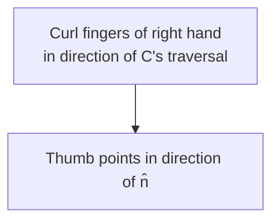
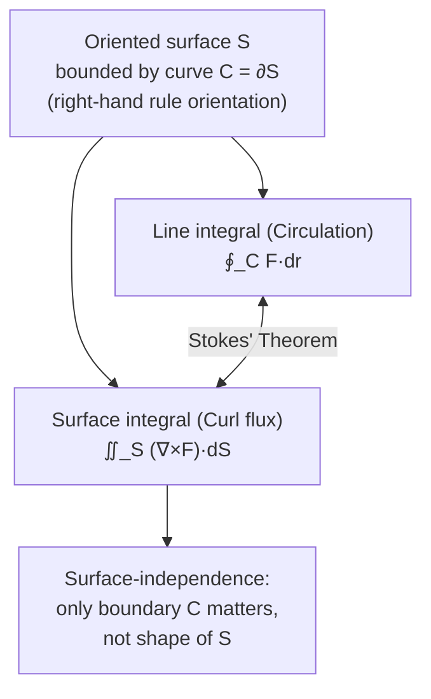
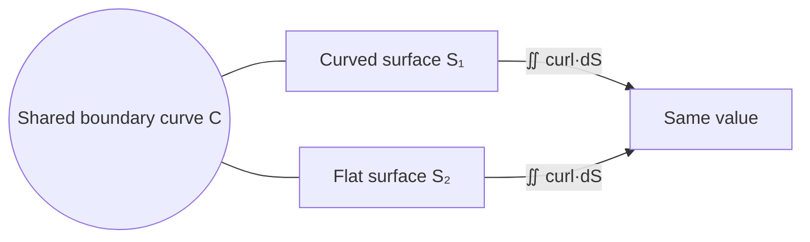
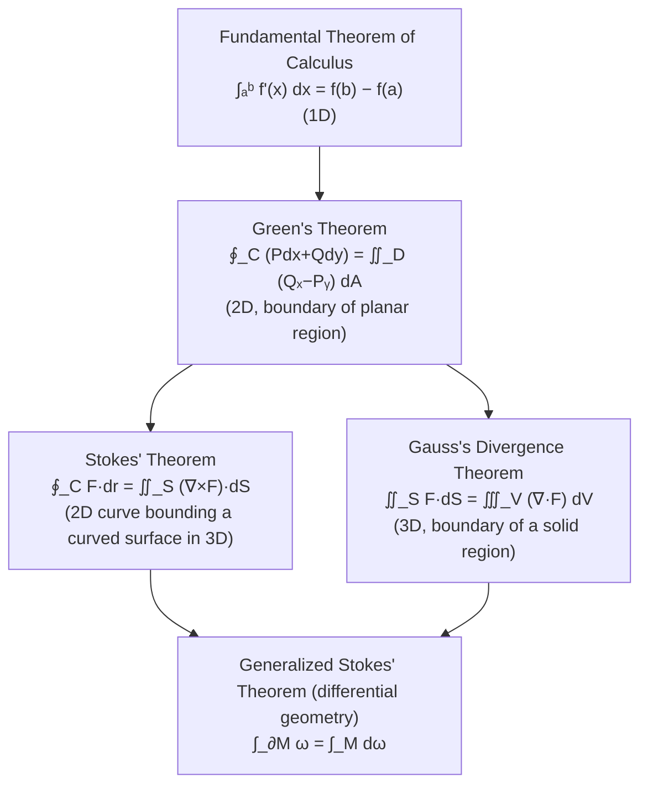

# Stokes' Theorem

> **Module:** Vector Analysis
> **Topic 10 of 10**
> **Last Updated:** June 20, 2026

## Table of Contents

1. [Introduction](#1-introduction)
2. [Statement of Stokes' Theorem](#2-statement-of-stokes-theorem)
3. [Orientation Convention](#3-orientation-convention)
4. [Proof of Stokes' Theorem](#4-proof-of-stokes-theorem)
5. [Relation to Green's Theorem and the Divergence Theorem](#5-relation-to-greens-theorem-and-the-divergence-theorem)
6. [Worked Examples](#6-worked-examples)
7. [Applications](#7-applications)
8. [Diagrams](#8-diagrams)
9. [Summary](#9-summary)
10. [References](#10-references)
11. [Module Recap: How the Theorems Connect](#11-module-recap-how-the-theorems-connect)

---

## 1. Introduction

**Stokes' Theorem** (sometimes called the *Curl Theorem* or *Kelvin–Stokes Theorem*) is the **three-dimensional generalization of Green's Theorem**. While Green's Theorem relates a line integral around a *planar* closed curve to a double integral over the flat region it encloses, Stokes' Theorem relates a line integral around the boundary of a (possibly curved) **surface in 3D space** to a surface integral of the curl over that surface.

This is the final and most general of the three "big theorems" of vector calculus covered in this module — Green's, Gauss's, and Stokes' — all of which are special cases of the single, more abstract **Generalized Stokes' Theorem** from differential geometry.

---

## 2. Statement of Stokes' Theorem

Let $S$ be an **oriented, piecewise-smooth surface** bounded by a **simple, closed, piecewise-smooth curve** $C = \partial S$, with orientation consistent with the surface's unit normal $\hat n$ (right-hand rule, see below). Let $\vec F$ be a vector field whose components have continuous first partial derivatives on an open region containing $S$. Then:

$$
\oint_C \vec F \cdot d\vec r = \iint_S (\nabla \times \vec F) \cdot d\vec S = \iint_S (\nabla\times\vec F)\cdot \hat n\, dS
$$

In words: **the circulation of $\vec F$ around the boundary curve $C$ equals the total curl (microscopic rotation) of $\vec F$ flowing through the surface $S$.**

---

## 3. Orientation Convention

The relationship between the orientation of $C$ and the normal $\hat n$ of $S$ follows the **right-hand rule**: if the fingers of the right hand curl in the direction of traversal of $C$, the thumb points in the direction of $\hat n$.

Equivalently: walking along $C$ in its positive direction with your head pointing along $\hat n$, the surface $S$ should be on your **left**.

---

## 4. Proof of Stokes' Theorem

We outline the proof for the case where $S$ is the graph of a function $z = g(x,y)$ over a region $D$ in the $xy$-plane, with boundary curve $C$ projecting onto the boundary curve $C'$ of $D$. (The general proof for arbitrary surfaces patches together such graph-pieces.)

### 4.1 Setup

Let $\vec F = P\,\hat i + Q\,\hat j + R\,\hat k$, and let $S$ be parametrized by $\vec r(x,y) = (x, y, g(x,y))$ for $(x,y) \in D$. We show the identity component-by-component; we demonstrate it for the $P\hat i$ term (the others follow by the same method, cyclically permuting $x\to y \to z \to x$).

### 4.2 Reducing the Surface Integral to a Double Integral over D

The curl component contributing to the $P$ term is:
$$
(\nabla\times(P\hat i))\cdot\hat n\, dS \quad \text{where} \quad \nabla\times(P\hat i) = \frac{\partial P}{\partial z}\hat j - \frac{\partial P}{\partial y}\hat k
$$
Using $d\vec S = (-g_x, -g_y, 1)\,dx\,dy$ (the upward normal form derived in Topic 8):
$$
\left(\frac{\partial P}{\partial z}\hat j - \frac{\partial P}{\partial y}\hat k\right)\cdot(-g_x,-g_y,1)\, dx\, dy = \left(-g_x\frac{\partial P}{\partial z} - \frac{\partial P}{\partial y}\right) dx\, dy
$$
So:
$$
\iint_S (\nabla\times(P\hat i))\cdot d\vec S = -\iint_D \left(\frac{\partial P}{\partial y} + \frac{\partial P}{\partial z} g_x\right) dA
$$
Now observe that if we define $\tilde P(x,y) = P(x,y,g(x,y))$, the chain rule gives:
$$
\frac{\partial \tilde P}{\partial y} = \frac{\partial P}{\partial y} + \frac{\partial P}{\partial z}\,g_y
$$
This isn't quite the expression above — the careful bookkeeping (matching terms via the chain rule applied appropriately to $x$ instead) shows that:
$$
-\iint_D \left(\frac{\partial P}{\partial y}+\frac{\partial P}{\partial z}g_x\right) dA = -\iint_D \frac{\partial \tilde P}{\partial y}\, dA
$$
By **Green's Theorem** applied to the planar region $D$ with vector field $(\tilde P, 0)$:
$$
-\iint_D \frac{\partial \tilde P}{\partial y}\, dA = \oint_{C'} \tilde P\, dx
$$

### 4.3 Matching to the Line Integral

On the boundary curve $C$ of the surface $S$ (which lies directly above $C'$, since $C$ is the graph of $z=g(x,y)$ restricted to $C'$), we have $P\,dx$ evaluated along $C$ exactly equal to $\tilde P\, dx$ evaluated along $C'$ (since $z=g(x,y)$ on $C$). Therefore:
$$
\oint_{C'} \tilde P\, dx = \oint_C P\, dx
$$
Combining:
$$
\iint_S (\nabla\times(P\hat i))\cdot d\vec S = \oint_C P\,dx
$$

### 4.4 Conclusion

By the same argument applied cyclically to the $Q\hat j$ and $R\hat k$ terms (permuting $x\to y\to z\to x$):
$$
\iint_S (\nabla\times(Q\hat j))\cdot d\vec S = \oint_C Q\,dy, \qquad \iint_S(\nabla\times(R\hat k))\cdot d\vec S = \oint_C R\,dz
$$
Adding all three:
$$
\iint_S (\nabla\times\vec F)\cdot d\vec S = \oint_C (P\,dx+Q\,dy+R\,dz) = \oint_C \vec F\cdot d\vec r \qquad \blacksquare
$$

**Key insight of the proof:** Stokes' Theorem for a graph-surface reduces directly to **Green's Theorem** applied to its planar shadow/projection $D$. This is why Green's Theorem is correctly viewed as the 2D special case of Stokes' Theorem (when $S$ is flat and lies in the $xy$-plane, $g\equiv0$, and the formulas coincide exactly).

---

## 5. Relation to Green's Theorem and the Divergence Theorem

### 5.1 Green's Theorem as a Special Case

If $S$ is a flat region in the $xy$-plane with $\hat n = \hat k$, then $(\nabla\times\vec F)\cdot \hat k = Q_x - P_y$ (for $\vec F = P\hat i+Q\hat j$), and Stokes' Theorem reduces exactly to:
$$
\oint_C (P\,dx+Q\,dy) = \iint_D (Q_x-P_y)\, dA
$$
which is precisely Green's Theorem (circulation form, Topic 7).

### 5.2 Surface Independence

**Important corollary:** If two surfaces $S_1, S_2$ share the same boundary curve $C$ (with consistent orientation), then:
$$
\iint_{S_1} (\nabla\times\vec F)\cdot d\vec S = \oint_C \vec F\cdot d\vec r = \iint_{S_2}(\nabla\times\vec F)\cdot d\vec S
$$
That is, **the flux of curl $\vec F$ through a surface depends only on its boundary curve, not the specific shape of the surface** — exactly analogous to path-independence of conservative line integrals (Topic 6). This is often exploited to replace a difficult surface with a simpler one (e.g., a flat disk instead of a curved cap) sharing the same boundary.

### 5.3 Relation to the Divergence Theorem

If $S$ is a **closed** surface (no boundary, $C=\emptyset$), Stokes' Theorem gives $\displaystyle\iint_S (\nabla\times\vec F)\cdot d\vec S = 0$ — consistent with the vector identity $\nabla\cdot(\nabla\times\vec F)=0$ proven in Topic 5, since by the Divergence Theorem applied to $\nabla\times\vec F$, $\displaystyle\iint_S(\nabla\times\vec F)\cdot d\vec S = \iiint_V \nabla\cdot(\nabla\times\vec F)\,dV = 0$.

---

## 6. Worked Examples

### Example 1 — Direct verification over a hemisphere

Verify Stokes' Theorem for $\vec F = -y\,\hat i + x\,\hat j$ over the upper hemisphere $S: x^2+y^2+z^2=1,\ z\ge0$, with boundary $C$ the unit circle in the $xy$-plane.

**Line integral side:** Parametrize $C$: $x=\cos t, y=\sin t, z=0$, $t\in[0,2\pi]$ (counterclockwise, consistent with upward normal).
$$
\vec F\cdot d\vec r = (-\sin t)(-\sin t\,dt) + (\cos t)(\cos t\,dt) = (\sin^2t+\cos^2t)\,dt = dt
$$
$$
\oint_C \vec F\cdot d\vec r = \int_0^{2\pi} dt = 2\pi
$$

**Surface integral side:**
$$
\nabla\times\vec F = \left(\frac{\partial(0)}{\partial y}-\frac{\partial x}{\partial z}\right)\hat i + \left(\frac{\partial(-y)}{\partial z}-\frac{\partial(0)}{\partial x}\right)\hat j + \left(\frac{\partial x}{\partial x}-\frac{\partial(-y)}{\partial y}\right)\hat k = (0)\hat i+(0)\hat j+(1+1)\hat k = 2\hat k
$$
By the **surface independence** property (Section 5.2), we may replace the curved hemisphere with the flat unit disk $D$ in the $xy$-plane (same boundary $C$), where $\hat n=\hat k$:
$$
\iint_S (\nabla\times\vec F)\cdot d\vec S = \iint_D 2\hat k \cdot \hat k\, dA = 2\cdot(\text{Area of unit disk}) = 2\pi
$$
Both sides equal $2\pi$ ✓.

### Example 2 — Using Stokes' Theorem to simplify a line integral

Evaluate $\displaystyle\oint_C \vec F\cdot d\vec r$ where $\vec F = (z^2)\hat i + (x^2)\hat j + (y^2)\hat k$ and $C$ is the boundary of the triangle with vertices $(1,0,0), (0,1,0), (0,0,1)$, traversed counterclockwise as viewed from the positive octant.

Rather than parametrizing all three edges of the triangle, apply Stokes' Theorem using the flat triangular surface $S$ (part of the plane $x+y+z=1$) bounded by $C$.

$$
\nabla\times\vec F = \left(\frac{\partial(y^2)}{\partial y}-\frac{\partial(x^2)}{\partial z}\right)\hat i + \left(\frac{\partial(z^2)}{\partial z}-\frac{\partial(y^2)}{\partial x}\right)\hat j + \left(\frac{\partial(x^2)}{\partial x}-\frac{\partial(z^2)}{\partial y}\right)\hat k
$$
$$
= (2y-0)\hat i + (2z-0)\hat j + (2x-0)\hat k = 2y\,\hat i+2z\,\hat j+2x\,\hat k
$$
For the plane $x+y+z=1$, the outward (upward) unit normal is $\hat n = \dfrac{1}{\sqrt3}(1,1,1)$, and the surface area of the triangle is $\dfrac{\sqrt3}{2}$ (standard result for this particular triangle).

$$
(\nabla\times\vec F)\cdot \hat n = \frac{1}{\sqrt3}(2y+2z+2x) = \frac{2}{\sqrt3}(x+y+z) = \frac{2}{\sqrt3}(1) = \frac{2}{\sqrt3} \quad \text{(constant on S, since } x+y+z=1\text{)}
$$
$$
\oint_C \vec F\cdot d\vec r = \iint_S (\nabla\times\vec F)\cdot\hat n\, dS = \frac{2}{\sqrt3}\cdot\left(\frac{\sqrt3}{2}\right) = 1
$$

### Example 3 — Conservative field special case

If $\vec F$ is conservative ($\nabla\times\vec F=\vec 0$), Stokes' Theorem immediately confirms (independently of the proof in Topic 6) that:
$$
\oint_C \vec F\cdot d\vec r = \iint_S \vec 0 \cdot d\vec S = 0
$$
for **any** closed curve $C$ bounding **any** surface $S$ — recovering the closed-loop result for conservative fields directly from Stokes' Theorem.

---

## 7. Applications

- **Electromagnetism:** **Faraday's Law of Induction**, $\displaystyle\oint_C \vec E\cdot d\vec r = -\frac{d}{dt}\iint_S \vec B\cdot d\vec S$, and **Ampère's Law**, $\displaystyle\oint_C \vec B\cdot d\vec r = \mu_0 I_{enc}$, are both direct physical statements of Stokes' Theorem connecting circulation to enclosed curl/current.
- **Fluid dynamics:** Relates circulation around a loop to vorticity ($\nabla\times\vec v$) flux through a surface bounded by that loop — fundamental to aerodynamic lift theory (Kutta–Joukowski theorem) and vortex dynamics.
- **Differential geometry:** Generalizes to the unifying **Generalized Stokes' Theorem** on manifolds, $\int_{\partial M}\omega = \int_M d\omega$, which subsumes the Fundamental Theorem of Calculus, Green's Theorem, the Divergence Theorem, and Stokes' Theorem as special cases.
- **Computer graphics & topology:** Surface-independence property used in mesh processing and computational topology.

---

## 8. Diagrams

### 8.1 Concept diagram

### 8.2 Right-hand rule orientation

*Illustration: a surface S with boundary curve C; the orientation of C and the surface normal n̂ are linked by the right-hand rule (Wikimedia Commons).*

### 8.3 Surface independence

---

## 9. Summary

| Concept | Formula |
|---|---|
| Stokes' Theorem | $\displaystyle\oint_C \vec F\cdot d\vec r = \iint_S (\nabla\times\vec F)\cdot d\vec S$ |
| Orientation rule | Right-hand rule: curl fingers along $C$, thumb gives $\hat n$ |
| Special case ($S$ flat) | Reduces to Green's Theorem |
| Surface independence | Value depends only on boundary $C$, not the shape of $S$ |
| Closed surface corollary | $\iint_S (\nabla\times\vec F)\cdot d\vec S = 0$ |
| Physical applications | Faraday's Law, Ampère's Law |

---

## 10. References

1. Paul's Online Math Notes — *Stokes' Theorem* — [https://tutorial.math.lamar.edu/Classes/CalcIII/StokesTheorem.aspx](https://tutorial.math.lamar.edu/Classes/CalcIII/StokesTheorem.aspx)
2. Khan Academy — *Stokes' theorem* — [https://www.khanacademy.org/math/multivariable-calculus/greens-theorem-and-stokes-theorem/stokes-theorem-articles](https://www.khanacademy.org/math/multivariable-calculus/greens-theorem-and-stokes-theorem/stokes-theorem-articles)
3. MIT OCW 18.02SC — *Stokes' Theorem* — [https://ocw.mit.edu/courses/18-02sc-multivariable-calculus-fall-2010/](https://ocw.mit.edu/courses/18-02sc-multivariable-calculus-fall-2010/)
4. Wolfram MathWorld — *Stokes' Theorem* — [https://mathworld.wolfram.com/StokesTheorem.html](https://mathworld.wolfram.com/StokesTheorem.html)
5. Wikipedia — *Stokes' theorem* — [https://en.wikipedia.org/wiki/Stokes%27_theorem](https://en.wikipedia.org/wiki/Stokes%27_theorem)
6. Griffiths, D. J. — *Introduction to Electrodynamics*, Chapter 1 & 7 (Faraday's Law, Ampère's Law derivations).
7. 3Blue1Brown — *Stokes' theorem* intuition (part of the Divergence/Curl YouTube series).

---

## 11. Module Recap: How the Theorems Connect

This concludes the 10-topic Vector Analysis module. The three integral theorems studied (Green's, Gauss's Divergence, and Stokes') are not independent facts but **different facets of a single deep idea**: a derivative-type quantity integrated over a region equals the original quantity evaluated on the region's boundary.

| Theorem | Relates | Dimension |
|---|---|---|
| Fundamental Theorem of Calculus | $f'$ on interval ↔ $f$ at endpoints | 1D |
| Green's Theorem | curl/div over planar region ↔ circulation/flux around boundary curve | 2D |
| Stokes' Theorem | curl over curved surface ↔ circulation around boundary curve | 2D surface in 3D |
| Gauss's Divergence Theorem | divergence over solid ↔ flux through boundary surface | 3D |

---

**Previous:** [09 — Gauss's Divergence Theorem](09-gauss-divergence-theorem.md) · **Back to:** [README — Vector Analysis Module Index](README.md)
