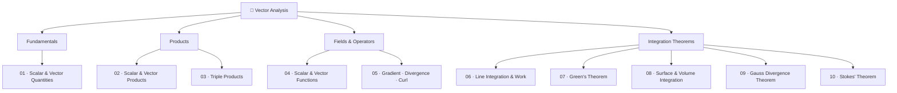

# 📐 Vector Analysis

> *"The study of vector calculus is the mathematical language of classical mechanics, electromagnetism, fluid dynamics, and most of engineering physics."*

Vector Analysis is the branch of mathematics that deals with **differentiation and integration of vector fields** in two or three dimensions. It generalizes classical calculus to multi-dimensional, direction-dependent quantities and is the mathematical backbone of physics and engineering.

---

## 🎯 Learning Objectives

By the end of this module, students will be able to:

1. Distinguish between scalar and vector quantities; perform vector algebra
2. Compute and geometrically interpret dot products and cross products
3. Evaluate scalar and vector triple products; find volumes using these tools
4. Define and analyse scalar and vector fields
5. Compute gradient, divergence, and curl of fields and interpret them physically
6. Evaluate vector line integrals and calculate work done by force fields
7. Apply Green's Theorem to convert between line and area integrals
8. Evaluate vector surface integrals and volume integrals
9. Apply Gauss's Divergence Theorem to relate flux to enclosed sources
10. Apply Stokes' Theorem to relate circulation to surface curl

---

## 📋 Prerequisites

- Multivariable Calculus (partial derivatives, multiple integrals)
- Linear Algebra basics (matrices, determinants)
- PHY-101 (basic mechanics for physical intuition)

---

## 🗺️ Module Map

---

## 📁 File Index

| # | File | Topic | Key Concepts |
|---|------|-------|-------------|
| 01 | [01-scalar-and-vector-quantities.md](01-scalar-and-vector-quantities.md) | Scalar & Vector Quantities | Types of vectors, unit vectors, direction cosines |
| 02 | [02-scalar-and-vector-products.md](02-scalar-and-vector-products.md) | Scalar & Vector Products | Dot product, cross product, geometric interpretation |
| 03 | [03-vector-triple-product.md](03-vector-triple-product.md) | Vector Triple Product | Scalar triple product, volume, BAC-CAB rule |
| 04 | [04-scalar-and-vector-functions.md](04-scalar-and-vector-functions.md) | Scalar & Vector Functions | Fields, del operator, derivatives |
| 05 | [05-gradient-divergence-curl.md](05-gradient-divergence-curl.md) | Gradient, Divergence & Curl | ∇φ, ∇·**F**, ∇×**F**, Laplacian, identities |
| 06 | [06-vector-line-integration.md](06-vector-line-integration.md) | Line Integration & Work Done | Line integrals, work, conservative fields |
| 07 | [07-greens-theorem.md](07-greens-theorem.md) | Green's Theorem | 2D curl–area theorem, corollaries |
| 08 | [08-vector-surface-volume-integration.md](08-vector-surface-volume-integration.md) | Surface & Volume Integration | Flux integrals, volume integrals |
| 09 | [09-gauss-divergence-theorem.md](09-gauss-divergence-theorem.md) | Gauss's Divergence Theorem | Flux ↔ divergence over volume |
| 10 | [10-stokes-theorem.md](10-stokes-theorem.md) | Stokes' Theorem | Circulation ↔ surface curl, generalisation |

---

## 🔗 The Big Picture: Fundamental Theorems

The three great integral theorems of vector calculus are all special cases of the **Generalized Stokes' Theorem** $\int_{\Omega} d\omega = \int_{\partial\Omega} \omega$:

| Theorem | Dimension | Converts |
|---------|-----------|----------|
| **Green's** | 2D | Line integral ↔ Double integral over region |
| **Gauss (Divergence)** | 3D | Volume integral ↔ Closed surface integral |
| **Stokes'** | 3D | Line integral ↔ Surface integral |

$$\underbrace{\oint_C \mathbf{F} \cdot d\mathbf{r}}_{\text{line integral}} \xrightarrow{\text{Stokes}} \iint_S (\nabla \times \mathbf{F}) \cdot d\mathbf{S} \xrightarrow{\text{Gauss}} \iiint_V \nabla \cdot (\nabla \times \mathbf{F})\, dV = 0$$

---

## 📚 Core References

| Source | Link | Type |
|--------|------|------|
| Paul's Online Math Notes — Calculus III | https://tutorial.math.lamar.edu/Classes/CalcIII/CalcIII.aspx | Free Online |
| MIT OCW 18.02 Multivariable Calculus | https://ocw.mit.edu/courses/18-02sc-multivariable-calculus-fall-2010/ | Free Online |
| LibreTexts — Vector Calculus | https://math.libretexts.org/Bookshelves/Calculus/Vector_Calculus_(Corral) | Free Online |
| Khan Academy — Multivariable Calculus | https://www.khanacademy.org/math/multivariable-calculus | Free Video |
| 3Blue1Brown — Essence of Calculus | https://www.youtube.com/playlist?list=PL0-GT3co4r2wlh6UHTUeQsrf3mlS2lk6x | Video |
| *Advanced Engineering Mathematics* — Kreyszig | Standard textbook | Textbook |
| *Calculus* — James Stewart | Standard textbook | Textbook |

---

**[↑ MATH-103 Index](../README.md)**
