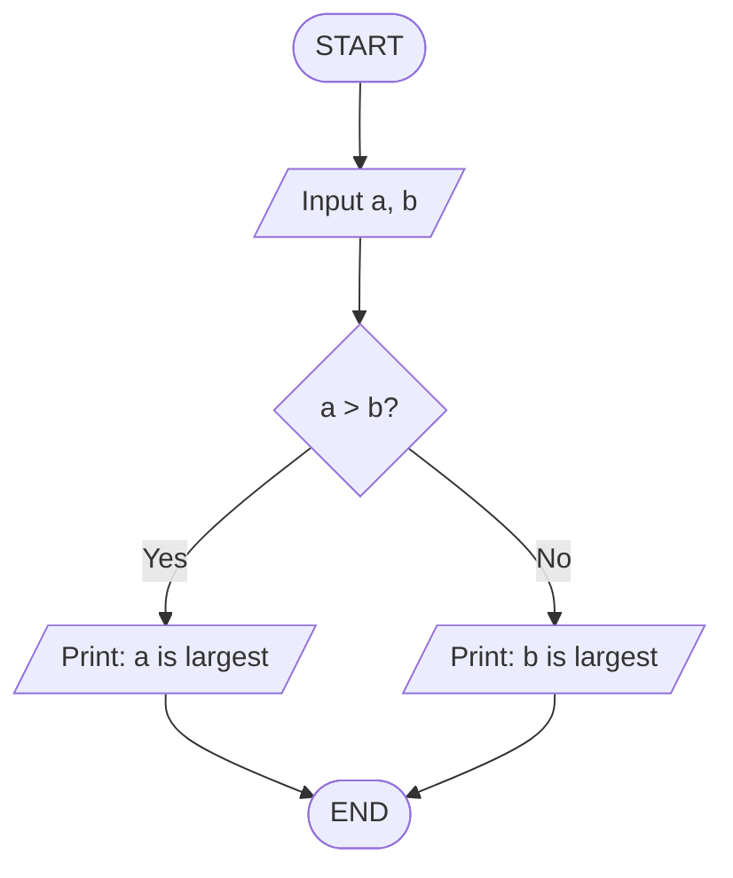
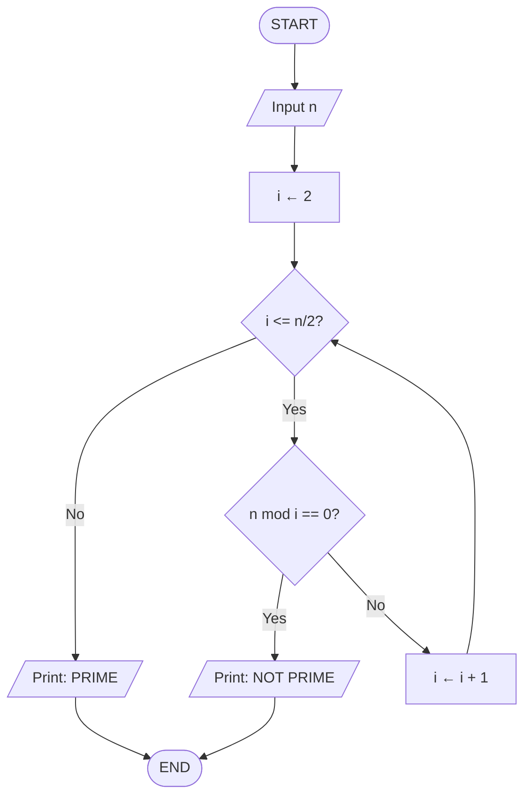
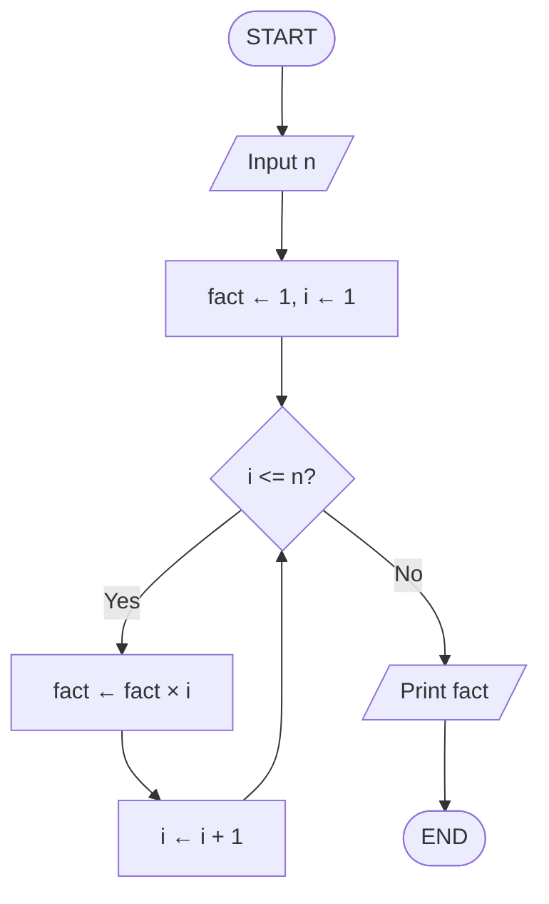
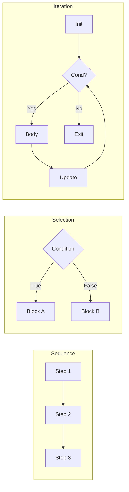
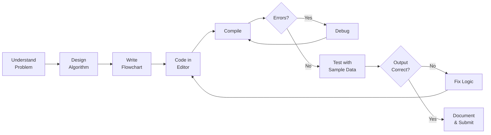

# 01 · Programming Basics

> **Course:** MDM 101 — Computer Programming · 3 Credits · 3 hrs/week · 45 Total Hours  
> **Scope:** Problem analysis → Algorithm design → Flowchart → Debugging → Coding → Documentation

---

## Table of Contents

1. [Problem Analysis](#1-problem-analysis)
2. [Algorithm](#2-algorithm)
3. [Flowchart](#3-flowchart)
4. [Debugging](#4-debugging)
5. [Coding Best Practices](#5-coding-best-practices)
6. [Documentation](#6-documentation)
7. [Practice Problems](#7-practice-problems)
8. [References & Resources](#8-references--resources)

---

## 1. Problem Analysis

Problem analysis is the **first and most critical** step before writing a single line of code. It involves deeply understanding what is being asked before attempting a solution.

### 1.1 Steps in Problem Analysis

```
1. Read and understand the problem statement carefully
2. Identify and list all given inputs (known data)
3. Identify the desired output
4. Identify constraints and edge cases
5. Determine the processing logic to transform input → output
6. Choose an appropriate data representation
```

### 1.2 IPO Model (Input → Process → Output)

Every computational problem fits the **IPO model**:

```
┌───────────┐     ┌───────────────┐     ┌────────────┐
│   INPUT   │────▶│   PROCESS     │────▶│   OUTPUT   │
│           │     │ (Algorithm)   │     │            │
└───────────┘     └───────────────┘     └────────────┘
```

**Example — Area of a Circle:**

| Component | Value |
|:----------|:------|
| **Input** | Radius `r` |
| **Process** | `Area = π × r²` |
| **Output** | Numeric value of area |

### 1.3 Problem Analysis Checklist

- [ ] What are all the inputs?
- [ ] What format are the inputs in?
- [ ] What are the expected outputs?
- [ ] Are there special/boundary cases (e.g., `r = 0`, negative numbers)?
- [ ] What formulas or rules apply?
- [ ] Is the problem decomposable into sub-problems?

> **Note:** Spending 10 minutes on problem analysis can save 2 hours of debugging later.

---

## 2. Algorithm

An **algorithm** is a finite, unambiguous, step-by-step sequence of instructions to solve a well-defined problem within a finite amount of time.

### 2.1 Properties of a Good Algorithm (Knuth's 5 Properties)

| Property | Meaning |
|:---------|:--------|
| **Finiteness** | Must terminate after a finite number of steps |
| **Definiteness** | Each step must be precisely and unambiguously defined |
| **Input** | Zero or more well-defined inputs |
| **Output** | One or more well-defined outputs |
| **Effectiveness** | Each step must be basic enough to be executed |

### 2.2 Algorithm Complexity (Big-O Notation)

The **time complexity** expresses how runtime grows relative to input size `n`:

| Notation | Name | Example |
|:---------|:-----|:--------|
| $O(1)$ | Constant | Array index access |
| $O(\log n)$ | Logarithmic | Binary search |
| $O(n)$ | Linear | Linear search |
| $O(n \log n)$ | Linearithmic | Merge sort |
| $O(n^2)$ | Quadratic | Bubble sort |
| $O(2^n)$ | Exponential | Brute-force subset sum |

**Growth Rate Comparison:**

$$
O(1) < O(\log n) < O(n) < O(n \log n) < O(n^2) < O(2^n)
$$

### 2.3 Writing Algorithms in Pseudocode

Pseudocode uses **structured English** — readable by humans, not tied to any language.

**Example 1 — Swap Two Numbers:**

```
Algorithm SWAP(a, b)
  BEGIN
    temp ← a
    a    ← b
    b    ← temp
    PRINT a, b
  END
```

**Example 2 — Find Maximum of Three Numbers:**

```
Algorithm MAX3(a, b, c)
  BEGIN
    IF a > b AND a > c THEN
      max ← a
    ELSE IF b > c THEN
      max ← b
    ELSE
      max ← c
    END IF
    RETURN max
  END
```

**Example 3 — Sum of First N Natural Numbers:**

```
Algorithm SUM_N(n)
  BEGIN
    sum ← 0
    i   ← 1
    WHILE i <= n DO
      sum ← sum + i
      i   ← i + 1
    END WHILE
    RETURN sum
  END
```

**Mathematical Proof (Closed Form):**

$$
\sum_{i=1}^{n} i = \frac{n(n+1)}{2}
$$

*Proof by induction:*

**Base case** ($n=1$): $\sum_{i=1}^{1} i = 1 = \frac{1 \cdot 2}{2}$ ✓

**Inductive step:** Assume true for $n=k$, i.e., $\sum_{i=1}^{k} i = \frac{k(k+1)}{2}$.  
For $n = k+1$:

$$
\sum_{i=1}^{k+1} i = \frac{k(k+1)}{2} + (k+1) = \frac{k(k+1) + 2(k+1)}{2} = \frac{(k+1)(k+2)}{2} \checkmark
$$

**Example 4 — Bubble Sort Algorithm:**

```
Algorithm BUBBLE_SORT(A, n)
  BEGIN
    FOR i ← 0 TO n-2 DO
      FOR j ← 0 TO n-2-i DO
        IF A[j] > A[j+1] THEN
          SWAP(A[j], A[j+1])
        END IF
      END FOR
    END FOR
  END
```

Time complexity: $O(n^2)$ — for every element, you scan the rest of the array.

---

## 3. Flowchart

A **flowchart** is a graphical representation of an algorithm using standardized symbols connected by arrows.

### 3.1 Standard Flowchart Symbols

| Symbol | Shape | Purpose |
|:-------|:------|:--------|
| **Terminal** | Rounded rectangle / Oval | Start / End |
| **Process** | Rectangle | Computation or action |
| **Decision** | Diamond | Yes/No or True/False branch |
| **Input/Output** | Parallelogram | Read input / Print output |
| **Connector** | Circle | Jump to another part |
| **Flow Line** | Arrow | Direction of execution |

### 3.2 Flowchart — Find Largest of Two Numbers



### 3.3 Flowchart — Check Prime Number



### 3.4 Flowchart — Factorial Using Loop



### 3.5 Types of Control Flow



---

## 4. Debugging

**Debugging** is the process of finding and fixing errors (**bugs**) in a program.

### 4.1 Types of Errors

| Error Type | When Detected | Example |
|:-----------|:-------------|:--------|
| **Syntax Error** | Compile time | Missing `;`, typo in keyword |
| **Semantic Error** | Compile/Link time | Using undeclared variable |
| **Runtime Error** | During execution | Division by zero, segfault |
| **Logical Error** | Testing / Review | Wrong formula, off-by-one |

### 4.2 Debugging Techniques

1. **Print Debugging** — Insert `printf()` statements to trace variable values
2. **Rubber Duck Debugging** — Explain code line-by-line aloud
3. **Breakpoints (GDB/IDE)** — Pause execution at a specific line
4. **Divide & Conquer** — Isolate the buggy section by halving the code
5. **Code Review** — Another person reads your code
6. **Unit Testing** — Test individual functions in isolation

### 4.3 Using GDB (GNU Debugger)

```bash
gcc -g program.c -o program    # Compile with debug symbols
gdb ./program                  # Launch GDB

# Inside GDB:
(gdb) break main               # Set breakpoint at main
(gdb) run                      # Run the program
(gdb) next                     # Step to next line
(gdb) print variable_name      # Inspect a variable
(gdb) continue                 # Continue to next breakpoint
(gdb) quit                     # Exit GDB
```

### 4.4 Common Bugs & Fixes

```c
// BUG 1: Off-by-one in loop
for (int i = 0; i <= n; i++)   // Wrong — goes to n+1 elements
for (int i = 0; i < n; i++)    // Correct

// BUG 2: Assignment instead of comparison
if (x = 5)   // Bug: assigns 5 to x, always true
if (x == 5)  // Correct

// BUG 3: Uninitialized variable
int sum;           // Bug: garbage value
int sum = 0;       // Correct

// BUG 4: Integer overflow
int x = 2147483647 + 1;   // Overflow! Use long long instead
```

---

## 5. Coding Best Practices

### 5.1 Code Readability

- Use **meaningful variable names**: `totalMarks` not `tm`
- Follow **consistent indentation** (2 or 4 spaces)
- Keep functions **short** (one responsibility per function)
- Avoid **magic numbers** — use named constants

```c
// Bad
float x = 3.14159 * r * r;

// Good
#define PI 3.14159
float area = PI * radius * radius;
```

### 5.2 Programming Workflow



---

## 6. Documentation

**Documentation** makes code understandable to others (and to your future self).

### 6.1 Types of Documentation

| Type | Purpose | Tool |
|:-----|:--------|:-----|
| **Inline Comments** | Explain specific lines | `//`, `/* */` in C |
| **Function Headers** | Describe purpose, params, return | Doxygen style |
| **README** | Project overview | Markdown |
| **User Manual** | End-user instructions | PDF/HTML |
| **API Docs** | For library users | Doxygen, Sphinx |

### 6.2 Good vs Bad Comments

```c
// BAD: Obvious comment (noise)
i = i + 1;  // increment i by 1

// GOOD: Explains WHY, not WHAT
i++;  // skip the null terminator at end of string

// GOOD: Function header (Doxygen style)
/**
 * @brief  Computes n-th Fibonacci number recursively.
 * @param  n  Non-negative integer
 * @return    F(n) — the n-th Fibonacci number
 * @note   Time complexity: O(2^n); use iterative for large n.
 */
int fibonacci(int n);
```

### 6.3 Self-Documenting Code

```c
// Hard to read
int f(int a, int b) {
    return a * b / 2;
}

// Self-documenting
int calculate_triangle_area(int base, int height) {
    return (base * height) / 2;
}
```

---

## 7. Practice Problems

1. Write an algorithm and draw a flowchart to find the roots of a quadratic equation $ax^2 + bx + c = 0$.  
   *(Hint: compute discriminant $D = b^2 - 4ac$; check $D > 0$, $D = 0$, $D < 0$)*

2. Write pseudocode to reverse a given integer (e.g., `1234 → 4321`).

3. Design a flowchart for a simple ATM: accept PIN, show balance or withdraw.

4. Trace the following algorithm for `n = 5` and verify the output:
   ```
   sum ← 0
   i   ← 1
   WHILE i <= n
     sum ← sum + i*i
     i ← i + 1
   PRINT sum
   ```
   *(Expected: 1 + 4 + 9 + 16 + 25 = 55)*

5. What type of error is each of the following? Explain.
   - `int x = "hello";`
   - `result = a / 0;`
   - Using `+` instead of `*` in an area formula

---

## 8. References & Resources

### 📚 Textbooks
- Kernighan, B.W. & Ritchie, D.M. — *The C Programming Language*, 2nd ed. (Prentice Hall)
- Balagurusamy, E. — *Programming in ANSI C* (McGraw-Hill)
- Forouzan, B. & Gilberg, R. — *Computer Science: A Structured Programming Approach Using C*

### 🌐 Online Resources

| Resource | URL | Topic |
|:---------|:----|:------|
| GeeksforGeeks — Algorithms | https://www.geeksforgeeks.org/fundamentals-of-algorithms/ | Algorithm fundamentals |
| Visualgo — Algorithm Visualizer | https://visualgo.net/en | Interactive algorithm visuals |
| Khan Academy — Algorithms | https://www.khanacademy.org/computing/computer-science/algorithms | Step-by-step algorithm lessons |
| CS50 Harvard (free) | https://cs50.harvard.edu/x/ | Complete intro programming course |
| Draw.io Flowcharts | https://app.diagrams.net/ | Online flowchart tool |
| Big-O Cheat Sheet | https://www.bigocheatsheet.com/ | Time/space complexity reference |
| Tutorialspoint — C | https://www.tutorialspoint.com/cprogramming/index.htm | C language basics |

---

<div align="center">

**← [README](../README.md)** · **[02 — C Overview →](02_c_overview.md)**

</div>
