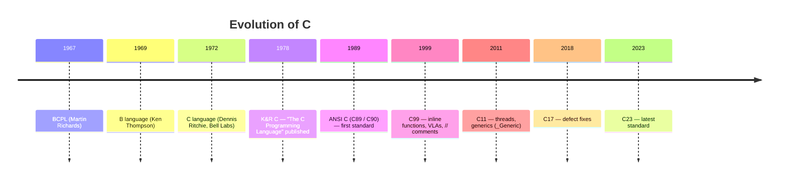
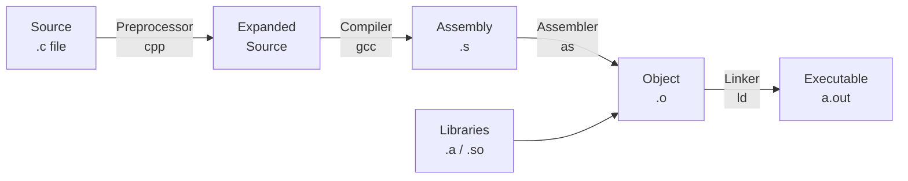
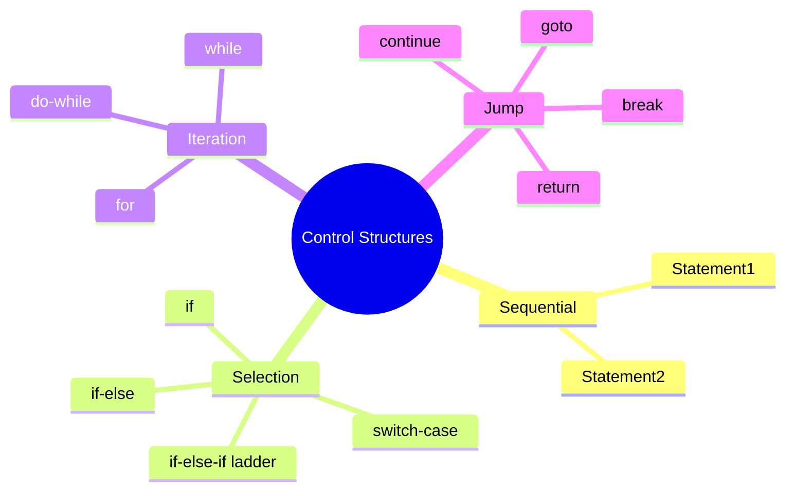

# 02 · Overview of C

> **Prerequisite:** [01 — Programming Basics](01_programming_basics.md)

---

## Table of Contents

1. [History & Structure of C](#1-history--structure-of-c)
2. [Variables & Identifiers](#2-variables--identifiers)
3. [Data Types](#3-data-types)
4. [Constants](#4-constants)
5. [Operators](#5-operators)
6. [Expressions & Operator Precedence](#6-expressions--operator-precedence)
7. [Control Structures](#7-control-structures)
8. [Practice Problems](#8-practice-problems)
9. [References & Resources](#9-references--resources)

---

## 1. History & Structure of C

C was developed by **Dennis Ritchie** at Bell Labs (1969–1973) to write the UNIX operating system.



### 1.1 Structure of a C Program

```c
/*─────────────────────────────────────────────────────────────
  Preprocessor Directives (includes, macros)
─────────────────────────────────────────────────────────────*/
#include <stdio.h>   // standard input/output
#include <math.h>    // math functions

/*─────────────────────────────────────────────────────────────
  Global Declarations (optional)
─────────────────────────────────────────────────────────────*/
#define PI 3.14159

/*─────────────────────────────────────────────────────────────
  main() — Execution Entry Point
─────────────────────────────────────────────────────────────*/
int main(void) {
    /* local declarations */
    float radius, area;

    /* statements */
    printf("Enter radius: ");
    scanf("%f", &radius);
    area = PI * radius * radius;
    printf("Area = %.2f\n", area);

    return 0;   // success exit code
}
```

**Compilation pipeline:**



---

## 2. Variables & Identifiers

A **variable** is a named memory location that holds a value which can change during program execution.

### 2.1 Declaration Syntax

```c
data_type variable_name;               // declaration
data_type variable_name = value;       // declaration + initialization

int   count = 0;
float temperature = 36.6;
char  grade = 'A';
```

### 2.2 Rules for Identifiers

| Rule | Valid | Invalid |
|:-----|:------|:--------|
| Start with letter or `_` | `_count`, `area` | `2fast`, `@name` |
| Can contain letters, digits, `_` | `total_marks2` | `total-marks` |
| Case-sensitive | `Area ≠ area ≠ AREA` | — |
| Cannot be a keyword | `sum` | `int`, `for`, `while` |
| Max 63 chars (C99) | — | — |

### 2.3 C Keywords (32 in C89)

```
auto     break    case     char     const    continue
default  do       double   else     enum     extern
float    for      goto     if       int      long
register return   short    signed   sizeof   static
struct   switch   typedef  union    unsigned void
volatile while
```

---

## 3. Data Types

### 3.1 Primitive Data Types (64-bit Linux / GCC)

| Type | Size | Range | Format Specifier |
|:-----|:----:|:------|:----------------:|
| `char` | 1 byte | −128 to 127 | `%c` |
| `unsigned char` | 1 byte | 0 to 255 | `%c` |
| `short int` | 2 bytes | −32,768 to 32,767 | `%hd` |
| `unsigned short` | 2 bytes | 0 to 65,535 | `%hu` |
| `int` | 4 bytes | −2,147,483,648 to 2,147,483,647 | `%d` |
| `unsigned int` | 4 bytes | 0 to 4,294,967,295 | `%u` |
| `long int` | 8 bytes | −9.2×10¹⁸ to 9.2×10¹⁸ | `%ld` |
| `long long int` | 8 bytes | −9.2×10¹⁸ to 9.2×10¹⁸ | `%lld` |
| `float` | 4 bytes | ±3.4×10⁻³⁸ to ±3.4×10³⁸ (6 sig. digits) | `%f` |
| `double` | 8 bytes | ±1.7×10⁻³⁰⁸ to ±1.7×10³⁰⁸ (15 sig. digits) | `%lf` |
| `long double` | 16 bytes | even wider range | `%Lf` |

### 3.2 Memory Layout Visualization

```
char   [  8 bits ]
short  [ 16 bits                              ]
int    [ 32 bits                                              ]
long   [ 64 bits                                                                              ]
float  [ 32 bits: 1 sign | 8 exponent | 23 mantissa          ]
double [ 64 bits: 1 sign | 11 exponent | 52 mantissa                                         ]
```

**IEEE 754 float representation:**

$$
\text{value} = (-1)^{\text{sign}} \times 2^{\text{exponent} - 127} \times (1 + \text{mantissa})
$$

### 3.3 Type Modifiers

```c
short int  s = 100;       // smaller range integer
long  int  l = 100000L;   // larger range integer
unsigned int u = 65000U;  // non-negative only
signed char  c = -5;      // explicitly signed
```

### 3.4 sizeof Operator

```c
#include <stdio.h>
int main(void) {
    printf("char   : %zu bytes\n", sizeof(char));
    printf("int    : %zu bytes\n", sizeof(int));
    printf("float  : %zu bytes\n", sizeof(float));
    printf("double : %zu bytes\n", sizeof(double));
    return 0;
}
```

### 3.5 Type Conversion

**Implicit (Widening) — automatic promotion:**

```
char → short → int → long → float → double → long double
```

```c
int   a = 5;
float b = 2.0;
float c = a + b;   // a is promoted to float automatically → c = 7.0
```

**Explicit (Cast):**

```c
int   x = 7, y = 2;
float result = (float)x / y;   // → 3.5; without cast: 7/2 = 3 (integer division)
```

---

## 4. Constants

### 4.1 Literal Constants

```c
42          // integer literal (decimal)
0755        // integer literal (octal)
0x1A3F      // integer literal (hexadecimal)
42L         // long integer
3.14        // floating-point (double)
3.14f       // floating-point (float)
'A'         // character literal (ASCII 65)
'\n'        // escape character — newline
"Hello"     // string literal (null-terminated)
```

**Common Escape Sequences:**

| Escape | Meaning |
|:-------|:--------|
| `\n` | Newline |
| `\t` | Horizontal tab |
| `\r` | Carriage return |
| `\\` | Backslash |
| `\'` | Single quote |
| `\"` | Double quote |
| `\0` | Null character (string terminator) |
| `\a` | Alert/bell |

### 4.2 `#define` Macros

```c
#define PI         3.14159265
#define MAX_SIZE   100
#define SQUARE(x)  ((x) * (x))   // always parenthesize macro arguments!

float area = PI * SQUARE(5.0);   // expands to PI * ((5.0)*(5.0))
```

> **Warning:** `#define SQUARE(x) x*x` is **dangerous** — `SQUARE(2+3)` expands to `2+3*2+3 = 11` not `25`.

### 4.3 `const` Keyword

```c
const float PI = 3.14159f;
const int   MAX = 100;

PI = 3.0;   // ❌ Compile error — const cannot be modified
```

`const` is type-safe and preferred over `#define` for constants in modern C.

---

## 5. Operators

### 5.1 Arithmetic Operators

| Operator | Operation | Example | Result |
|:--------:|:----------|:--------|:------:|
| `+` | Addition | `3 + 4` | `7` |
| `-` | Subtraction | `10 - 3` | `7` |
| `*` | Multiplication | `3 * 4` | `12` |
| `/` | Division | `7 / 2` | `3` (integer!) |
| `%` | Modulus (remainder) | `7 % 2` | `1` |

> **Key:** Integer division truncates. `7 / 2 = 3`, not `3.5`.

**Mathematical proof of modulus:**
$$
a = q \times b + r \quad \text{where } 0 \le r < b
$$
So `7 % 2`: $7 = 3 \times 2 + 1$, thus `r = 1`.

### 5.2 Relational Operators

```c
a == b   // equal to
a != b   // not equal
a >  b   // greater than
a <  b   // less than
a >= b   // greater than or equal
a <= b   // less than or equal
```

Return `1` (true) or `0` (false) in C.

### 5.3 Logical Operators

| Operator | Meaning | Truth Table |
|:--------:|:--------|:------------|
| `&&` | Logical AND | True only if **both** operands are true |
| `\|\|` | Logical OR | True if **at least one** is true |
| `!` | Logical NOT | Flips true↔false |

**Truth Table:**

| `A` | `B` | `A && B` | `A \|\| B` | `!A` |
|:---:|:---:|:--------:|:----------:|:----:|
| 0 | 0 | 0 | 0 | 1 |
| 0 | 1 | 0 | 1 | 1 |
| 1 | 0 | 0 | 1 | 0 |
| 1 | 1 | 1 | 1 | 0 |

### 5.4 Bitwise Operators

| Operator | Meaning | Example (`a=5=0101`, `b=3=0011`) |
|:--------:|:--------|:---------------------------------|
| `&` | AND | `5 & 3 = 0101 & 0011 = 0001 = 1` |
| `\|` | OR | `5 \| 3 = 0101 \| 0011 = 0111 = 7` |
| `^` | XOR | `5 ^ 3 = 0101 ^ 0011 = 0110 = 6` |
| `~` | NOT (one's complement) | `~5 = ~0101 = ...11111010 = -6` |
| `<<` | Left shift | `5 << 1 = 1010 = 10` (× 2) |
| `>>` | Right shift | `5 >> 1 = 0010 = 2` (÷ 2) |

**Mathematical note on shifts:**

$$
x \ll n \equiv x \times 2^n \qquad x \gg n \equiv \left\lfloor \frac{x}{2^n} \right\rfloor
$$

### 5.5 Assignment Operators

```c
a  =  5    // simple assignment
a += 3     // a = a + 3
a -= 3     // a = a - 3
a *= 3     // a = a * 3
a /= 3     // a = a / 3
a %= 3     // a = a % 3
a <<= 1    // a = a << 1
a >>= 1    // a = a >> 1
a &= 3     // a = a & 3
a |= 3     // a = a | 3
a ^= 3     // a = a ^ 3
```

### 5.6 Increment / Decrement

```c
int x = 5;
int a = x++;   // a = 5,  then x = 6  (post-increment)
int b = ++x;   // x = 7 first, then b = 7 (pre-increment)
int c = x--;   // c = 7,  then x = 6  (post-decrement)
int d = --x;   // x = 5 first, then d = 5 (pre-decrement)
```

### 5.7 Conditional (Ternary) Operator

```c
// Syntax: condition ? value_if_true : value_if_false
int max = (a > b) ? a : b;
printf("%s\n", (age >= 18) ? "Adult" : "Minor");
```

### 5.8 Special Operators

```c
sizeof(int)        // size in bytes of a type/variable → 4
&variable          // address-of operator → memory address
*pointer           // dereference operator → value at address
(float)variable    // cast operator
array[i]           // subscript operator
structure.member   // dot (member access)
pointer->member    // arrow (pointer member access)
```

---

## 6. Expressions & Operator Precedence

### 6.1 Precedence Table (High to Low)

| Precedence | Operators | Associativity |
|:----------:|:----------|:-------------:|
| 1 (highest) | `()` `[]` `->` `.` | Left → Right |
| 2 | `!` `~` `++` `--` `+` `-` `*` `&` `sizeof` `(type)` | Right → Left |
| 3 | `*` `/` `%` | Left → Right |
| 4 | `+` `-` | Left → Right |
| 5 | `<<` `>>` | Left → Right |
| 6 | `<` `<=` `>` `>=` | Left → Right |
| 7 | `==` `!=` | Left → Right |
| 8 | `&` | Left → Right |
| 9 | `^` | Left → Right |
| 10 | `\|` | Left → Right |
| 11 | `&&` | Left → Right |
| 12 | `\|\|` | Left → Right |
| 13 | `?:` | Right → Left |
| 14 | `=` `+=` `-=` … | Right → Left |
| 15 (lowest) | `,` | Left → Right |

**Example — Evaluate:** `3 + 4 * 2`

$$
3 + 4 \times 2 = 3 + 8 = 11 \quad (*\ \text{binds tighter than}\ +)
$$

**Example — Evaluate:** `(3 + 4) * 2`

$$
(3+4) \times 2 = 7 \times 2 = 14 \quad (\text{parentheses override precedence})
$$

> **Rule of thumb:** When in doubt, **use parentheses** to make intent explicit.

---

## 7. Control Structures

Control structures alter the sequential flow of execution.



### 7.1 `if` / `if-else`

```c
// if
if (score >= 50) {
    printf("Pass\n");
}

// if-else
if (score >= 50)
    printf("Pass\n");
else
    printf("Fail\n");

// if-else-if ladder
if      (score >= 80) printf("A\n");
else if (score >= 70) printf("B\n");
else if (score >= 60) printf("C\n");
else if (score >= 50) printf("D\n");
else                  printf("F\n");
```

**Dangling else — always use braces:**

```c
// Ambiguous — which if does else belong to?
if (a > 0)
    if (b > 0)
        printf("both positive");
else
    printf("a not positive");   // This binds to inner if!

// Safe version with braces:
if (a > 0) {
    if (b > 0)
        printf("both positive");
} else {
    printf("a not positive");
}
```

### 7.2 `switch-case`

```c
int day = 3;
switch (day) {
    case 1:  printf("Monday\n");    break;
    case 2:  printf("Tuesday\n");   break;
    case 3:  printf("Wednesday\n"); break;
    case 4:  printf("Thursday\n");  break;
    case 5:  printf("Friday\n");    break;
    case 6:  printf("Saturday\n");  break;
    case 7:  printf("Sunday\n");    break;
    default: printf("Invalid\n");
}
```

> **Note:** Without `break`, execution **falls through** to the next case — sometimes used intentionally.

```c
// Fall-through intentional example: vowel/consonant check
switch (c) {
    case 'a': case 'e': case 'i': case 'o': case 'u':
        printf("Vowel\n"); break;
    default:
        printf("Consonant\n");
}
```

### 7.3 `while` Loop

```c
// Syntax: while (condition) { body }
// Condition checked BEFORE each iteration (entry-controlled)

int i = 1, sum = 0;
while (i <= 10) {
    sum += i;
    i++;
}
printf("Sum 1..10 = %d\n", sum);  // 55
```

### 7.4 `do-while` Loop

```c
// Condition checked AFTER each iteration (exit-controlled)
// Body executes AT LEAST once

int choice;
do {
    printf("1. Start\n2. Exit\nChoice: ");
    scanf("%d", &choice);
} while (choice != 2);
```

### 7.5 `for` Loop

```c
// Syntax: for (init; condition; update) { body }

for (int i = 0; i < 5; i++) {
    printf("%d ", i);   // 0 1 2 3 4
}

// Infinite loop
for (;;) { /* runs forever */ }

// Multiple variables
for (int i = 0, j = 10; i < j; i++, j--) {
    printf("i=%d j=%d\n", i, j);
}
```

**Nested for loops — Multiplication table:**

```c
for (int i = 1; i <= 5; i++) {
    for (int j = 1; j <= 5; j++) {
        printf("%4d", i * j);
    }
    printf("\n");
}
```

```
   1   2   3   4   5
   2   4   6   8  10
   3   6   9  12  15
   4   8  12  16  20
   5  10  15  20  25
```

### 7.6 `break` and `continue`

```c
// break — immediately exits the loop
for (int i = 0; i < 10; i++) {
    if (i == 5) break;
    printf("%d ", i);   // 0 1 2 3 4
}

// continue — skip rest of current iteration
for (int i = 0; i < 10; i++) {
    if (i % 2 == 0) continue;
    printf("%d ", i);   // 1 3 5 7 9
}
```

### 7.7 `goto` (Use Sparingly)

```c
// goto can jump forward or backward — creates "spaghetti code"
// Legitimate use: error handling / cleanup in C

int result = do_something();
if (result < 0) goto error;

// ... more code ...

error:
    fprintf(stderr, "Error occurred!\n");
    cleanup();
    return -1;
```

> **Best practice:** Avoid `goto` except for error-cleanup in C (where `try-catch` doesn't exist).

### 7.8 Comparison: Loop Types

| Feature | `while` | `do-while` | `for` |
|:--------|:-------:|:----------:|:-----:|
| Entry/Exit controlled | Entry | Exit | Entry |
| Min executions | 0 | 1 | 0 |
| Best for | Unknown iterations | Must run at least once | Known iterations |
| Update location | Manual | Manual | In header |

---

## 8. Practice Problems

1. Write a C program to calculate the sum of digits of a given integer (e.g., `1234 → 10`).

2. Print the following pattern using nested loops:
   ```
   *
   **
   ***
   ****
   *****
   ```

3. Write a program using `switch` to implement a basic calculator (`+`, `-`, `*`, `/`).

4. Find all prime numbers between 1 and 100 (Sieve concept).

5. Given the expression `a = 2, b = 3`, evaluate without running code:
   - `a++ + ++b`
   - `a & b`
   - `a | b`
   - `a ^ b`
   - `!a || b`

6. Explain the output:
   ```c
   int x = 10;
   printf("%d %d %d\n", x, x++, ++x);
   ```
   *(Hint: undefined behavior — explain why)*

---

## 9. References & Resources

| Resource | URL | Focus |
|:---------|:----|:------|
| C Reference Manual | https://en.cppreference.com/w/c | Complete C reference |
| Learn C (interactive) | https://www.learn-c.org/ | In-browser C exercises |
| GeeksforGeeks — C | https://www.geeksforgeeks.org/c-programming-language/ | Tutorials & problems |
| Compiler Explorer | https://godbolt.org/ | See assembly output |
| C Data Types — cppreference | https://en.cppreference.com/w/c/language/type | Type system details |
| IEEE 754 Visualizer | https://www.h-schmidt.net/FloatConverter/IEEE754.html | Float bit representation |
| OnlineGDB C Compiler | https://www.onlinegdb.com/online_c_compiler | Run C in browser |
| TutorialsPoint — Operators | https://www.tutorialspoint.com/cprogramming/c_operators.htm | Operators reference |

---

<div align="center">

**[← 01 — Basics](01_programming_basics.md)** · **[03 — Functions →](03_functions.md)**

</div>
